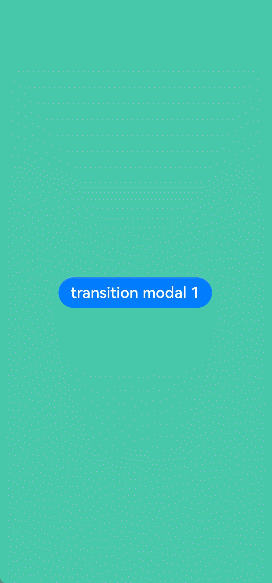
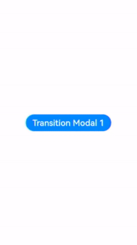

# Modal Transition

You can bind a full-screen modal to a component through the **bindContentCover** attribute. Better yet, with the **ModalTransition** parameter, you can apply a transition effect for when the component is inserted or deleted.

>  **NOTE**
>
>  The APIs of this module are supported since API version 10. Updates will be marked with a superscript to indicate their earliest API version.
>
>  Switching between landscape and portrait modes is not supported.
>
>  Route hopping is not supported.

## bindContentCover

bindContentCover(isShow: Optional\<boolean\>, builder: CustomBuilder, options?: ContentCoverOptions)

Binds a modal to the component, which can be displayed when the component is touched. The content of the modal is customizable. The transition type can be set to none, slide-up and slide-down animation, and opacity gradient animation.

**Atomic service API**: This API can be used in atomic services since API version 11.

**System capability**: SystemCapability.ArkUI.ArkUI.Full

**Parameters**

| Name | Type                                       | Mandatory| Description                                                        |
| ------- | ------------------------------------------- | ---- | ------------------------------------------------------------ |
| isShow  | Optional\<boolean\>                         | Yes  | Whether to display the modal.<br>Since API version 10, this attribute supports two-way binding through [$$](../../../quick-start/arkts-two-way-sync.md).<br>Since API version 16, this parameter supports two-way binding through [!!](../../../quick-start/arkts-new-binding.md#two-way-binding-between-built-in-component-parameters).|
| builder | [CustomBuilder](ts-types.md#custombuilder8) | Yes  | Content of the modal.                                      |
| options | [ContentCoverOptions](#contentcoveroptions) | No  | Optional attributes of the modal.                                |

## ContentCoverOptions
Inherited from [BindOptions](ts-universal-attributes-sheet-transition.md#bindoptions).
| Name             | Type                                      | Mandatory  | Description           |
| --------------- | ---------------------------------------- | ---- | ------------- |
| modalTransition | [ModalTransition](ts-types.md#modaltransition10) | No   | Transition mode of the modal.<br>**Atomic service API**: This API can be used in atomic services since API version 11. |
| onWillDismiss<sup>12+</sup> | Callback&lt;[DismissContentCoverAction](#dismisscontentcoveraction12)&gt; | No   | Callback invoked to prevent a user attempt to dismiss the modal.<br>**NOTE**<br>After this callback is registered, touching the back button does not immediately dismiss the modal. You can use the **reason** parameter to determine the type of operation that triggers the dismissal and decide whether to dismiss the modal based on the reason. Nesting **onWillDismiss** callbacks is not allowed.<br>**Atomic service API**: This API can be used in atomic services since API version 12.|
| transition<sup>12+</sup> | [TransitionEffect](ts-transition-animation-component.md#transitioneffect10) | No   | Transition mode of the modal.<br>**Atomic service API**: This API can be used in atomic services since API version 12.|

## DismissContentCoverAction<sup>12+</sup>

**Atomic service API**: This API can be used in atomic services since API version 12.

| Name             | Type                                      | Mandatory  | Description           |
| --------------- | ---------------------------------------- | ---- | ------------- |
| dismiss | function | Yes   | Callback invoked when the modal is dismissed. Called when you need to exit the page.|
| reason | [DismissReason](ts-universal-attributes-popup.md#dismissreason12) | Yes   | Type of operation that triggers the dismissal of the modal. |

## Example

### Example 1: Implementing Modal Transition Using bindContentCover

This example demonstrates how to implement a modal transition using the **bindContentCover** API.

```ts
// xxx.ets
@Entry
@Component
struct ModalTransitionExample {
  @State isShow: boolean = false
  @State isShow2: boolean = false

  @Builder
  myBuilder2() {
    Column() {
      Button("close modal 2")
        .margin(10)
        .fontSize(20)
        .onClick(() => {
          this.isShow2 = false;
        })
    }
    .width('100%')
    .height('100%')
  }

  @Builder
  myBuilder() {
    Column() {
      Button("transition modal 2")
        .margin(10)
        .fontSize(20)
        .onClick(() => {
          this.isShow2 = true;
        }).bindContentCover(this.isShow2, this.myBuilder2(), {
        modalTransition: ModalTransition.NONE,
        backgroundColor: Color.Orange,
        onWillAppear: () => {
          console.log("BindContentCover onWillAppear.")
        },
        onAppear: () => {
          console.log("BindContentCover onAppear.")
        },
        onWillDisappear: () => {
          console.log("BindContentCover onWillDisappear.")
        },
        onDisappear: () => {
          console.log("BindContentCover onDisappear.")
        }
      })

      Button("close modal 1")
        .margin(10)
        .fontSize(20)
        .onClick(() => {
          this.isShow = false;
        })
    }
    .width('100%')
    .height('100%')
    .justifyContent(FlexAlign.Center)
  }

  build() {
    Column() {
      Button("transition modal 1")
        .onClick(() => {
          this.isShow = true
        })
        .fontSize(20)
        .margin(10)
        .bindContentCover(this.isShow, this.myBuilder(), {
          modalTransition: ModalTransition.NONE,
          backgroundColor: Color.Pink,
          onWillAppear: () => {
            console.log("BindContentCover onWillAppear.")
          },
          onAppear: () => {
            console.log("BindContentCover onAppear.")
          },
          onWillDisappear: () => {
            console.log("BindContentCover onWillDisappear.")
          },
          onDisappear: () => {
            console.log("BindContentCover onDisappear.")
          }
        })
    }
    .justifyContent(FlexAlign.Center)
    .backgroundColor("#ff49c8ab")
    .width('100%')
    .height('100%')
  }
}
```



### Example 2: Implementing a Custom Transition Animation

This example applies a custom animation to two modals whose transition type is none.

```ts
// xxx.ets
import { curves } from '@kit.ArkUI';

@Entry
@Component
struct ModalTransitionExample {
  @State @Watch("isShow1Change") isShow: boolean = false
  @State @Watch("isShow2Change") isShow2: boolean = false
  @State isScale1: number = 1;
  @State isScale2: number = 1;

  isShow1Change() {
    this.isShow ? this.isScale1 = 0.95 : this.isScale1 = 1
  }

  isShow2Change() {
    this.isShow2 ? this.isScale2 = 0.95 : this.isScale2 = 1
  }

  @Builder
  myBuilder2() {
    Column() {
      Button("close modal 2")
        .margin(10)
        .fontSize(20)
        .onClick(() => {
          this.isShow2 = false;
        })
    }
    .width('100%')
    .height('100%')
  }

  @Builder
  myBuilder() {
    Column() {
      Button("transition modal 2")
        .margin(10)
        .fontSize(20)
        .onClick(() => {
          this.isShow2 = true;
        }).bindContentCover(this.isShow2, this.myBuilder2(), {
        modalTransition: ModalTransition.NONE,
        backgroundColor: Color.Orange,
        onWillAppear: () => {
          console.log("BindContentCover onWillAppear.")
        },
        onAppear: () => {
          console.log("BindContentCover onAppear.")
        },
        onWillDisappear: () => {
          console.log("BindContentCover onWillDisappear.")
        },
        onDisappear: () => {
          console.log("BindContentCover onDisappear.")
        }
      })

      Button("close modal 1")
        .margin(10)
        .fontSize(20)
        .onClick(() => {
          this.isShow = false;
        })
    }
    .width('100%')
    .height('100%')
    .justifyContent(FlexAlign.Center)
    .scale({ x: this.isScale2, y: this.isScale2 })
    .animation({ curve: curves.springMotion() })
  }

  build() {
    Column() {
      Button("transition modal 1")
        .onClick(() => {
          this.isShow = true
        })
        .fontSize(20)
        .margin(10)
        .bindContentCover(this.isShow, this.myBuilder(), {
          modalTransition: ModalTransition.NONE,
          backgroundColor: Color.Pink,
          onWillAppear: () => {
            console.log("BindContentCover onWillAppear.")
          },
          onAppear: () => {
            console.log("BindContentCover onAppear.")
          },
          onWillDisappear: () => {
            console.log("BindContentCover onWillDisappear.")
          },
          onDisappear: () => {
            console.log("BindContentCover onDisappear.")
          }
        })
    }
    .justifyContent(FlexAlign.Center)
    .backgroundColor("#ff49c8ab")
    .width('100%')
    .height('100%')
    .scale({ x: this.isScale1, y: this.isScale1 })
    .animation({ curve: curves.springMotion() })
  }
}
```


### Example 3: Implementing a Slide-up and Slide-down Transition Animation

This example shows two modals whose transition type is slide-up and slide-down animation.

```ts
// xxx.ets
@Entry
@Component
struct ModalTransitionExample {
  @State isShow: boolean = false
  @State isShow2: boolean = false

  @Builder
  myBuilder2() {
    Column() {
      Button("close modal 2")
        .margin(10)
        .fontSize(20)
        .onClick(() => {
          this.isShow2 = false;
        })
    }
    .width('100%')
    .height('100%')
  }

  @Builder
  myBuilder() {
    Column() {
      Button("transition modal 2")
        .margin(10)
        .fontSize(20)
        .onClick(() => {
          this.isShow2 = true;
        }).bindContentCover(this.isShow2, this.myBuilder2(), {
        modalTransition: ModalTransition.DEFAULT,
        backgroundColor: Color.Gray,
        onWillAppear: () => {
          console.log("BindContentCover onWillAppear.")
        },
        onAppear: () => {
          console.log("BindContentCover onAppear.")
        },
        onWillDisappear: () => {
          console.log("BindContentCover onWillDisappear.")
        },
        onDisappear: () => {
          console.log("BindContentCover onDisappear.")
        }
      })

      Button("close modal 1")
        .margin(10)
        .fontSize(20)
        .onClick(() => {
          this.isShow = false;
        })
    }
    .width('100%')
    .height('100%')
    .justifyContent(FlexAlign.Center)
  }

  build() {
    Column() {
      Button("transition modal 1")
        .onClick(() => {
          this.isShow = true
        })
        .fontSize(20)
        .margin(10)
        .bindContentCover(this.isShow, this.myBuilder(), {
          modalTransition: ModalTransition.DEFAULT,
          backgroundColor: Color.Pink,
          onWillAppear: () => {
            console.log("BindContentCover onWillAppear.")
          },
          onAppear: () => {
            console.log("BindContentCover onAppear.")
          },
          onWillDisappear: () => {
            console.log("BindContentCover onWillDisappear.")
          },
          onDisappear: () => {
            console.log("BindContentCover onDisappear.")
          }
        })
    }
    .justifyContent(FlexAlign.Center)
    .backgroundColor(Color.White)
    .width('100%')
    .height('100%')
  }
}
```


### Example 4: Implementing an Opacity Transition Animation

This example shows two modals whose transition type is opacity animation.

```ts
// xxx.ets
@Entry
@Component
struct ModalTransitionExample {
  @State isShow: boolean = false
  @State isShow2: boolean = false

  @Builder
  myBuilder2() {
    Column() {
      Button("close modal 2")
        .margin(10)
        .fontSize(20)
        .onClick(() => {
          this.isShow2 = false;
        })
    }
    .width('100%')
    .height('100%')
    .justifyContent(FlexAlign.Center)
  }

  @Builder
  myBuilder() {
    Column() {
      Button("transition modal 2")
        .margin(10)
        .fontSize(20)
        .onClick(() => {
          this.isShow2 = true;
        }).bindContentCover(this.isShow2, this.myBuilder2(), {
        modalTransition: ModalTransition.ALPHA,
        backgroundColor: Color.Gray,
        onWillAppear: () => {
          console.log("BindContentCover onWillAppear.")
        },
        onAppear: () => {
          console.log("BindContentCover onAppear.")
        },
        onWillDisappear: () => {
          console.log("BindContentCover onWillDisappear.")
        },
        onDisappear: () => {
          console.log("BindContentCover onDisappear.")
        }
      })

      Button("close modal 1")
        .margin(10)
        .fontSize(20)
        .onClick(() => {
          this.isShow = false;
        })
    }
    .width('100%')
    .height('100%')
    .justifyContent(FlexAlign.Center)
  }

  build() {
    Column() {
      Button("transition modal 1")
        .onClick(() => {
          this.isShow = true
        })
        .fontSize(20)
        .margin(10)
        .bindContentCover(this.isShow, this.myBuilder(), {
          modalTransition: ModalTransition.ALPHA,
          backgroundColor: Color.Pink,
          onWillAppear: () => {
            console.log("BindContentCover onWillAppear.")
          },
          onAppear: () => {
            console.log("BindContentCover onAppear.")
          },
          onWillDisappear: () => {
            console.log("BindContentCover onWillDisappear.")
          },
          onDisappear: () => {
            console.log("BindContentCover onDisappear.")
          }
        })
    }
    .justifyContent(FlexAlign.Center)
    .backgroundColor(Color.White)
    .width('100%')
    .height('100%')
  }
}
```


### Example 5: Implementing Custom Transitions with Different Effects

This example demonstrates custom transitions for modals, including rotation and translation effects.

```ts
// xxx.ets
@Entry
@Component
struct ModalTransitionExample {
  @State isShow: boolean = false
  @State isShow2: boolean = false

  @Builder
  myBuilder2() {
    Column() {
      Button("Close Modal 2")
        .margin(10)
        .fontSize(20)
        .onClick(() => {
          this.isShow2 = false;
        })
    }
    .width('100%')
    .height('100%')
    .justifyContent(FlexAlign.Center)
  }

  @Builder
  myBuilder() {
    Column() {
      Button("Transition Modal 2")
        .margin(10)
        .fontSize(20)
        .onClick(() => {
          this.isShow2 = true;
        })
        .bindContentCover(
          this.isShow2,
          this.myBuilder2(),
          {
            modalTransition: ModalTransition.DEFAULT,
            backgroundColor: Color.Gray,
            transition: TransitionEffect.SLIDE.animation({ duration: 5000, curve: Curve.LinearOutSlowIn }),
            onWillDismiss: ((dismissContentCoverAction: DismissContentCoverAction) => {
              if (dismissContentCoverAction.reason == DismissReason.PRESS_BACK) {
                console.log("BindContentCover dismiss reason is back pressed")
              }
              dismissContentCoverAction.dismiss()
            }),
            onAppear: () => {
              console.info("BindContentCover onAppear.")
            },
            onDisappear: () => {
              this.isShow2 = false;
              console.info("BindContentCover onDisappear.")
            }
          })

      Button("Close Modal 1")
        .margin(10)
        .fontSize(20)
        .onClick(() => {
          this.isShow = false;
        })
    }
    .width('100%')
    .height('100%')
    .justifyContent(FlexAlign.Center)
  }

  build() {
    Column() {
      Button("Transition Modal 1")
        .onClick(() => {
          this.isShow = true
        })
        .fontSize(20)
        .margin(10)
        .bindContentCover(
          this.isShow,
          this.myBuilder(),
          {
            modalTransition: ModalTransition.DEFAULT,
            backgroundColor: Color.Pink,
            transition: TransitionEffect.asymmetric(
              TransitionEffect.OPACITY.animation({ duration: 1100 }).combine(
                TransitionEffect.rotate({ z: 1, angle: 180 }).animation({ delay: 1000, duration: 1000 }))
              ,
              TransitionEffect.OPACITY.animation({ duration: 1200 }).combine(
                TransitionEffect.rotate({ z: 1, angle: 180 }).animation({ duration: 1300 }))
            ),
            onWillDismiss: ((dismissContentCoverAction: DismissContentCoverAction) => {
              if (dismissContentCoverAction.reason == DismissReason.PRESS_BACK) {
                console.log("back pressed");
              }
              dismissContentCoverAction.dismiss()
            }),
            onAppear: () => {
              console.log("BindContentCover onAppear.")
            },
            onDisappear: () => {
              this.isShow = false;
              console.log("BindContentCover onDisappear.")
            }
          })
    }
    .justifyContent(FlexAlign.Center)
    .backgroundColor(Color.White)
    .width('100%')
    .height('100%')
  }
}
```


