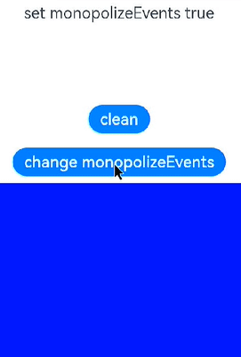

# Event Monopolization

You can configure a component to monopolize events – built-in events and custom gesture events,<br>
so that if the component first responds to an event in a window, it will be the only component that responds to the event.

>  **NOTE**
>
>  This feature is supported since API version 11. Updates will be marked with a superscript to indicate their earliest API version.

## monopolizeEvents

monopolizeEvents(monopolize: boolean)

Sets whether the component monopolizes events.

**Atomic service API**: This API can be used in atomic services since API version 12.

**System capability**: SystemCapability.ArkUI.ArkUI.Full

**Parameters**


| Name  | Type| Mandatory| Description                 |
| ----------- | -------- | ------------------------ | ------------------------ |
| monopolize | boolean  | Yes| Whether the component monopolizes events.<br>Default value: **false**<br>**NOTE**<br>1. If a component is monopolizing events after a finger is pressed on it, and another finger is pressed before the first finger is lifted, the component continues to monopolize events while interacting with the second finger. The same case applies to a third and more fingers.<br>2. If a component is bound through [parallelGesture](ts-gesture-settings.md) to a gesture, for example, [pan gesture](ts-basic-gestures-pangesture.md), that can also be triggered by its child component, and the child component is configured to monopolize events, then the parent will not respond to the gesture after the child component has responded to it.|

## Example

```ts
// xxx.ets
@Entry
@Component
struct Index {
  @State message: string = 'set monopolizeEvents false'
  @State messageOut: string = ' '
  @State messageInner: string = ' '
  @State monopolize: boolean = false

  build() {
    Column() {
      Text(this.message)
        .fontSize(22)
        .margin(10)
      Text(this.messageOut)
        .fontSize(22)
        .margin(10)
      Text(this.messageInner)
        .fontSize(22)
        .margin(10)
      Button('clean')
        .fontSize(22)
        .margin(10)
        // Change the value of the column's monopolizeEvents attribute through the button's click event.
        .onClick(()=>{
          this.messageOut = " "
          this.messageInner = " "
        })
      Button('change monopolizeEvents')
        .fontSize(22)
        .margin(10)
        // Change the value of the column's monopolizeEvents attribute through the button's click event.
        .onClick(()=>{
          this.monopolize = !this.monopolize
          if (!this.monopolize) {
            this.message = "set monopolizeEvents false"
          } else {
            this.message = "set monopolizeEvents true"
          }
        })
      Column() {
        Column(){}
        // When this.monopolize is true, clicking the inner column triggers only a touch event on it, but not on the outer column.
        // When this.monopolize is false, clicking the inner column triggers a touch event on it and the outer column.
        .monopolizeEvents(this.monopolize)
        .width('100%')
        .height('40%')
        .backgroundColor(Color.Blue)
        // Bind the inner column to the touch event.
        .onTouch((event:TouchEvent)=>{
          if (event.type == TouchType.Down) {
            console.log("inner column touch down")
            this.messageInner = "inner column touch down"
          }
        })
      }
      .backgroundColor(Color.Gray)
      .height('100%')
      .width('100%')
      // Bind the outer column to the touch event.
      .onTouch((event)=>{
        if (event.type == TouchType.Down) {
          console.log("outside column touch down")
          this.messageOut = "inner column touch down"
        }
      })
    }
    .height('100%')
  }
}
```

