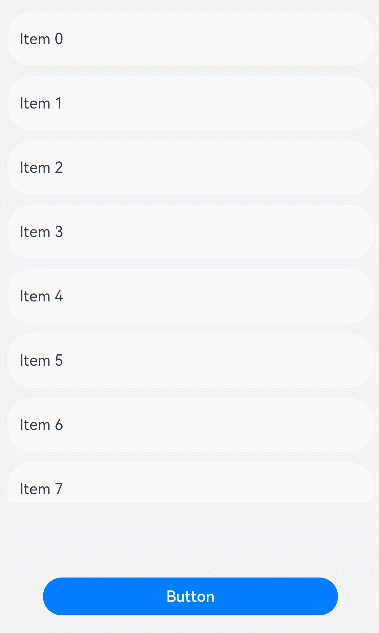

# Custom Event Dispatch

When handling a touch event, ArkUI performs a touch test on the touch point and the component area before the event is triggered – to determine the components targeted by the event – and dispatches the event based on the test result. You can use **onChildTouchTest** on a parent node to specify how to perform the touch test on child nodes and thereby exert an impact on touch event dispatch. For details about the impact, see [TouchTestStrategy](#touchteststrategy).

>  **NOTE**
>
>  - This feature is supported since API version 11. Updates will be marked with a superscript to indicate their earliest API version.
>
>  - With use of **onChildTouchTest**, the **onClick**, rotation, and pinch gesture events may receive no response due to the touch target not being hit.

## onChildTouchTest

onChildTouchTest(event: (value: Array&lt;TouchTestInfo&gt;) => TouchResult): T

Called to specify how to perform the touch test on the children of this component.

**Atomic service API**: This API can be used in atomic services since API version 12.

**System capability**: SystemCapability.ArkUI.ArkUI.Full

**Parameters**

| Name| Type                                      | Mandatory| Description                  |
| ------ | ------------------------------------------ | ---- | ---------------------- |
| value  | Array<[TouchTestInfo>](#touchtestinfo) | Yes  | Array of child components.|

**Return value**

| Type| Description|
| -------- | -------- |
| T | Current component.|

>**NOTE**
>
>The array of child components contains only components for which **id** is set.


## TouchTestInfo

**Atomic service API**: This API can be used in atomic services since API version 12.

**System capability**: SystemCapability.ArkUI.ArkUI.Full

| Name         | Type  | Description                                      |
| ------------- | ------ | ---------------------------------------- |
| windowX | number | X coordinate of the touch point relative to the upper left corner of the window.|
| windowY   | number |Y coordinate of the touch point relative to the upper left corner of the window.|
| parentX   | number |X coordinate of the touch point relative to the upper left corner of the parent component. |
| parentY   | number |Y coordinate of the touch point relative to the upper left corner of the parent component. |
| x   | number | X coordinate of the touch point relative to the upper left corner of the child component.|
| y   | number | Y coordinate of the touch point relative to the upper left corner of the child component.|
| rect   | [RectResult](ts-types.md#rectresult10) |Size of the child component. |
| [id](ts-universal-attributes-component-id.md)   | string | Component ID.|

## TouchResult

**Atomic service API**: This API can be used in atomic services since API version 12.

**System capability**: SystemCapability.ArkUI.ArkUI.Full

| Name     | Type                                    | Mandatory  | Description                               |
| --------- | --------- | ---- |--------------------------------------- |
| strategy  | [TouchTestStrategy](#touchteststrategy) | Yes   | Event dispatch strategy.                    |
| id  | string | No   | Component ID.<br>If **strategy** is set to **TouchTestStrategy.DEFAULT**, **id** is optional. If **strategy** is set to **TouchTestStrategy.FORWARD_COMPETITION** or **TouchTestStrategy.FORWARD**, **id** is mandatory. If **id** is not returned, the strategy **TouchTestStrategy.DEFAULT** is used.|

## TouchTestStrategy

**Widget capability**: This API can be used in ArkTS widgets since API version 11.

**Atomic service API**: This API can be used in atomic services since API version 12.

**System capability**: SystemCapability.ArkUI.ArkUI.Full

| Name         | Description                                      |
| ------------| ----------------------------------------- |
| DEFAULT     | The default event dispatch mechanism for components is used.|
| FORWARD_COMPETITION       | The event is dispatched to the specified child component, while the ArkUI touch test process is followed.|
| FORWARD | The event is dispatched to the specified child component, and the ArkUI touch test process is not followed.|

## Example

### Example 1

```ts
// xxx.ets
import { promptAction } from '@kit.ArkUI';

@Entry
@Component
struct ListExample {
  private arr: number[] = [0, 1, 2, 3, 4, 5, 6, 7, 8, 9, 10, 11, 12]
  @State text: string = 'Button'

  build() {
    Column() {
      List({ space: 12, initialIndex: 0 }) {
        ForEach(this.arr, (item: number) => {
          ListItem() {
            Text('Item ' + item)
              .width('100%')
              .height(56)
              .fontSize(16)
              .textAlign(TextAlign.Start)
          }.borderRadius(24)
          .backgroundColor(Color.White)
          .padding({ left: 12, right: 12 })
        }, (item: string) => item)
      }
      .listDirection(Axis.Vertical)
      .scrollBar(BarState.Off)
      .edgeEffect(EdgeEffect.Spring)
      .onScrollIndex((start: number, end: number) => {
        console.info('first' + start)
        console.info('last' + end)
      })
      .onDidScroll((scrollOffset: number, scrollState: ScrollState) => {
        console.info(`onScroll scrollState = ScrollState` + scrollState + `, scrollOffset = ` + scrollOffset)
      })
      .width('100%')
      .height('65%')
      .id('MyList')

      Button(this.text)
        .width(312)
        .height(40)
        .id('Mybutton')
        .fontSize(16)
        .fontWeight(FontWeight.Medium)
        .margin({ top: 80 })
        .onClick(() => {
          this.text = 'click the button'
          promptAction.showToast({ message: 'you click the button.', duration: 3000 })
        })
    }
    .width('100%')
    .height('100%')
    .backgroundColor(0xF1F3F5)
    .justifyContent(FlexAlign.End)
    .padding({ left: 12, right: 12, bottom: 24 })
    .onChildTouchTest((touchinfo) => {
      for (let info of touchinfo) {
        if (info.id == 'MyList') {
          return { id: info.id, strategy: TouchTestStrategy.FORWARD_COMPETITION }
        }
      }
      return { strategy: TouchTestStrategy.DEFAULT }
    })
  }
}
```
After you touch the blank area in the lower part and drag the list, the list scrolls. After you touch the button, the button responds to the **onClick** event.


### Example 2

```ts
// xxx.ets
import { promptAction } from '@kit.ArkUI';

@Entry
@Component
struct ListExample {
  private arr: number[] = [0, 1, 2, 3, 4, 5, 6, 7, 8, 9, 10, 11, 12]
  @State text: string = 'Button'

  build() {
    Column() {
      List({ space: 12, initialIndex: 0 }) {
        ForEach(this.arr, (item: number) => {
          ListItem() {
            Text('Item ' + item)
              .width('100%')
              .height(56)
              .fontSize(16)
              .textAlign(TextAlign.Start)
          }.borderRadius(24)
          .backgroundColor(Color.White)
          .padding({ left: 12, right: 12 })
        }, (item: string) => item)
      }
      .listDirection(Axis.Vertical)
      .scrollBar(BarState.Off)
      .edgeEffect(EdgeEffect.Spring)
      .onScrollIndex((start: number, end: number) => {
        console.info('first' + start)
        console.info('last' + end)
      })
      .onScroll((scrollOffset: number, scrollState: ScrollState) => {
        console.info(`onScroll scrollState = ScrollState` + scrollState + `, scrollOffset = ` + scrollOffset)
      })
      .width('100%')
      .height('65%')
      .id('MyList')

      Button(this.text)
        .width(312)
        .height(40)
        .id('Mybutton')
        .fontSize(16)
        .fontWeight(FontWeight.Medium)
        .margin({ top: 80 })
        .onClick(() => {
          this.text = 'click the button'
          promptAction.showToast({ message: 'you click the button.', duration: 3000 })
        })
    }
    .width('100%')
    .height('100%')
    .backgroundColor(0xF1F3F5)
    .justifyContent(FlexAlign.End)
    .padding({ left: 12, right: 12, bottom: 24 })
    .onChildTouchTest((touchinfo) => {
      for (let info of touchinfo) {
        if (info.id == 'MyList') {
          return { id: info.id, strategy: TouchTestStrategy.FORWARD }
        }
      }
      return { strategy: TouchTestStrategy.DEFAULT }
    })
  }
}
```
After you touch the blank area in the lower part and drag the list, the list scrolls. After you touch the button, the button does not respond to the **onClick** event.



### Example 3

```ts
// xxx.ets
import { promptAction } from '@kit.ArkUI';

@Entry
@Component
struct ListExample {
  private arr: number[] = [0, 1, 2, 3, 4, 5, 6, 7, 8, 9, 10, 11, 12]
  @State text: string = 'Button'

  build() {
    Column() {
      List({ space: 12, initialIndex: 0 }) {
        ForEach(this.arr, (item: number) => {
          ListItem() {
            Text('Item ' + item)
              .width('100%')
              .height(56)
              .fontSize(16)
              .textAlign(TextAlign.Start)
          }.borderRadius(24)
          .backgroundColor(Color.White)
          .padding({ left: 12, right: 12 })
        }, (item: string) => item)
      }
      .listDirection(Axis.Vertical)
      .scrollBar(BarState.Off)
      .edgeEffect(EdgeEffect.Spring)
      .onScrollIndex((start: number, end: number) => {
        console.info('first' + start)
        console.info('last' + end)
      })
      .onScroll((scrollOffset: number, scrollState: ScrollState) => {
        console.info(`onScroll scrollState = ScrollState` + scrollState + `, scrollOffset = ` + scrollOffset)
      })
      .width('100%')
      .height('65%')
      .id('MyList')

      Button(this.text)
        .width(312)
        .height(40)
        .id('Mybutton')
        .fontSize(16)
        .fontWeight(FontWeight.Medium)
        .margin({ top: 80 })
        .onClick(() => {
          this.text = 'click the button'
          promptAction.showToast({ message: 'you click the button.', duration: 3000 })
        })
    }
    .width('100%')
    .height('100%')
    .backgroundColor(0xF1F3F5)
    .justifyContent(FlexAlign.End)
    .padding({ left: 12, right: 12, bottom: 24 })
    .onChildTouchTest((touchinfo) => {
      return { strategy: TouchTestStrategy.DEFAULT }
    })
  }
}
```
After you touch the blank area in the lower part and drag the list, the list does not scroll. After you touch the button, the button responds to the **onClick** event.


