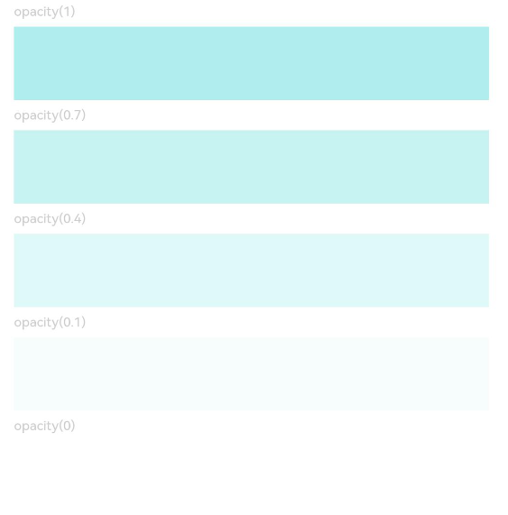

# Opacity

You can set the opacity of a component.

>  **NOTE**
>
>  The APIs of this module are supported since API version 7. Updates will be marked with a superscript to indicate their earliest API version.

## opacity

opacity(value: number | Resource)

Sets the opacity of the component.

**Widget capability**: Since API version 9, this feature is supported in ArkTS widgets.

**System capability**: SystemCapability.ArkUI.ArkUI.Full

**Parameters**

| Name| Type                                                | Mandatory| Description                                                        |
| ------ | ---------------------------------------------------- | ---- | ------------------------------------------------------------ |
| value  | number \| [Resource](ts-types.md#resource) | Yes  | Opacity of the component. The value ranges from 0 to 1. The value **1** means opaque, and **0** means completely transparent. When being completely transparent, the component is hidden, but still takes up space in the layout.<br> Default value: **1**<br>**NOTE**<br> A component inherits the opacity setting from its parent component and multiplies it by its own setting. For example, if the opacity of a component is 0.8 and that of its parent component is 0.1, then the actual opacity of the component is 0.1 x 0.8 = 0.8.|


## Example

```ts
// xxx.ets
@Entry
@Component
struct OpacityExample {
  build() {
    Column({ space: 5 }) {
      Text('opacity(1)').fontSize(9).width('90%').fontColor(0xCCCCCC)
      Text().width('90%').height(50).opacity(1).backgroundColor(0xAFEEEE)
      Text('opacity(0.7)').fontSize(9).width('90%').fontColor(0xCCCCCC)
      Text().width('90%').height(50).opacity(0.7).backgroundColor(0xAFEEEE)
      Text('opacity(0.4)').fontSize(9).width('90%').fontColor(0xCCCCCC)
      Text().width('90%').height(50).opacity(0.4).backgroundColor(0xAFEEEE)
      Text('opacity(0.1)').fontSize(9).width('90%').fontColor(0xCCCCCC)
      Text().width('90%').height(50).opacity(0.1).backgroundColor(0xAFEEEE)
      Text('opacity(0)').fontSize(9).width('90%').fontColor(0xCCCCCC)
      Text().width('90%').height(50).opacity(0).backgroundColor(0xAFEEEE)
    }
    .width('100%')
    .padding({ top: 5 })
  }
}
```


