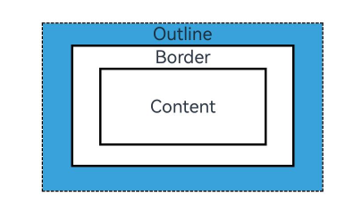

# Outline

You can set outline attributes for components. Drawn outside the component, the outline does not affect the component's layout or increase its size.



>  **NOTE**
>
>  This feature is supported since API version 11. Updates will be marked with a superscript to indicate their earliest API version.

## outline

outline(value: OutlineOptions)

Sets the outline attributes in one declaration.

**Widget capability**: This API can be used in ArkTS widgets since API version 11.

**Atomic service API**: This API can be used in atomic services since API version 12.

**System capability**: SystemCapability.ArkUI.ArkUI.Full

**Parameters**

| Name| Type                                     | Mandatory| Description        |
| ------ | ----------------------------------------- | ---- | ------------ |
| value  | [OutlineOptions](#outlineoptions) | Yes  | Outline attributes.|

## outline<sup>18+</sup>

outline(options: Optional\<OutlineOptions>)

Sets the outline attributes in one declaration. Compared to [outline](#outline), this API supports the **undefined** type for the **options** parameter.

**Widget capability**: This API can be used in ArkTS widgets since API version 18.

**Atomic service API**: This API can be used in atomic services since API version 18.

**System capability**: SystemCapability.ArkUI.ArkUI.Full

**Parameters**

| Name| Type                                     | Mandatory| Description|
| ------ | ----------------------------------------- | ---- | ---- |
| options | Optional\<[OutlineOptions](#outlineoptions)> | Yes  |   Outline attributes.<br>If **options** is **undefined**, the component reverts to its original style with no outline.  |

## OutlineStyle<sup>11+</sup>

Outline attributes.

**Widget capability**: This API can be used in ArkTS widgets since API version 11.

**Atomic service API**: This API can be used in atomic services since API version 12.

**System capability**: SystemCapability.ArkUI.ArkUI.Full

| Name    | Description                           |
| ------ | ----------------------------- |
| SOLID  | Solid border.                     |
| DASHED | Dashed border.                |
| DOTTED | Dotted border. The radius of a dot is half of **outlineWidth**.|

## outlineStyle

outlineStyle(value: OutlineStyle | EdgeOutlineStyles)

Sets the style of the outline.

**Widget capability**: This API can be used in ArkTS widgets since API version 11.

**Atomic service API**: This API can be used in atomic services since API version 12.

**System capability**: SystemCapability.ArkUI.ArkUI.Full

**Parameters**

| Name| Type                                                        | Mandatory| Description                                                 |
| ------ | ------------------------------------------------------------ | ---- | ----------------------------------------------------- |
| value  | [OutlineStyle](#outlinestyle11) \| [EdgeOutlineStyles](#edgeoutlinestyles) | Yes  | Outline style.<br>Default value: **OutlineStyle.SOLID**|

## outlineStyle<sup>18+</sup>

outlineStyle(style: Optional\<OutlineStyle | EdgeOutlineStyles>)

Sets the style of the outline. Compared to [outlineStyle](#outlinestyle), this API supports the **undefined** type for the **style** parameter.

**Widget capability**: This API can be used in ArkTS widgets since API version 18.

**Atomic service API**: This API can be used in atomic services since API version 18.

**System capability**: SystemCapability.ArkUI.ArkUI.Full

**Parameters**

| Name| Type                                                        | Mandatory| Description                                                        |
| ------ | ------------------------------------------------------------ | ---- | ------------------------------------------------------------ |
| style  | Optional\<[OutlineStyle](#outlinestyle11) \| [EdgeOutlineStyles](#edgeoutlinestyles)> | Yes  | Outline style.<br>Default value: **OutlineStyle.SOLID**<br>If **style** is **undefined**, the component reverts to its original style with no outline.|

## outlineWidth

outlineWidth(value: Dimension | EdgeOutlineWidths)

Sets the thickness of the outline.

**Widget capability**: This API can be used in ArkTS widgets since API version 11.

**Atomic service API**: This API can be used in atomic services since API version 12.

**System capability**: SystemCapability.ArkUI.ArkUI.Full

**Parameters**

| Name| Type                                                        | Mandatory| Description                                                 |
| ------ | ------------------------------------------------------------ | ---- | ----------------------------------------------------- |
| value  | [Dimension](ts-types.md#dimension10) \| [EdgeOutlineWidths](#edgeoutlinewidths) | Yes  | Outline thickness. Percentage values are not supported.<br>Default value: **0**|

## outlineWidth<sup>18+</sup>

outlineWidth(width: Optional\<Dimension | EdgeOutlineWidths>)

Sets the thickness of the outline. Compared to [[outlineWidth](#outlinewidth), this API supports the **undefined** type for the **width** parameter.

**Widget capability**: This API can be used in ArkTS widgets since API version 18.

**Atomic service API**: This API can be used in atomic services since API version 18.

**System capability**: SystemCapability.ArkUI.ArkUI.Full

**Parameters**

| Name| Type                                                        | Mandatory| Description                                                        |
| ------ | ------------------------------------------------------------ | ---- | ------------------------------------------------------------ |
| width  | Optional\<[Dimension](ts-types.md#dimension10) \| [EdgeOutlineWidths](#edgeoutlinewidths)> | Yes  | Outline thickness. Percentage values are not supported.<br>Default value: **0**<br>If **width** is **undefined**, the component reverts to its original style with no outline width.|

## outlineColor

outlineColor(value: ResourceColor | EdgeColors)

Sets the color of the outline.

**Widget capability**: This API can be used in ArkTS widgets since API version 11.

**Atomic service API**: This API can be used in atomic services since API version 12.

**System capability**: SystemCapability.ArkUI.ArkUI.Full

**Parameters**

| Name| Type                                                        | Mandatory| Description                                            |
| ------ | ------------------------------------------------------------ | ---- | ------------------------------------------------ |
| value  | [ResourceColor](ts-types.md#resourcecolor) \| [EdgeColors](#edgecolors) | Yes  | Outline color.<br>Default value: **Color.Black**|

## outlineColor<sup>18+</sup>

outlineColor(color: Optional\<ResourceColor | EdgeColors>)

Sets the color of the outline. Compared to [outlineColor](#outlinecolor), this API supports the **undefined** type for the **color** parameter.

**Widget capability**: This API can be used in ArkTS widgets since API version 18.

**Atomic service API**: This API can be used in atomic services since API version 18.

**System capability**: SystemCapability.ArkUI.ArkUI.Full

**Parameters**

| Name| Type                                                        | Mandatory| Description                                                        |
| ------ | ------------------------------------------------------------ | ---- | ------------------------------------------------------------ |
| color  | Optional\<[ResourceColor](ts-types.md#resourcecolor) \| [EdgeColors](#edgecolors)> | Yes  | Outline color.<br>Default value: **Color.Black**<br>If **color** is **undefined**, the component reverts to its original style with the outline color of **Color.Black**.|

## outlineRadius

outlineRadius(value: Dimension | OutlineRadiuses)

Sets the radius of the outline corners.

**Widget capability**: This API can be used in ArkTS widgets since API version 11.

**Atomic service API**: This API can be used in atomic services since API version 12.

**System capability**: SystemCapability.ArkUI.ArkUI.Full

**Parameters**

| Name| Type                                                        | Mandatory| Description                                                        |
| ------ | ------------------------------------------------------------ | ---- | ------------------------------------------------------------ |
| value  | [Dimension](ts-types.md#dimension10) \| [OutlineRadiuses](#outlineradiuses) | Yes  | Radius of the outline corners. Percentage values are not supported.<br>Default value: **0**<br>Maximum effective value: Component width/2 + outlineWidth or component height/2 + outlineWidth|

## outlineRadius<sup>18+</sup>

outlineRadius(radius: Optional\<Dimension | OutlineRadiuses>)

Sets the radius of the outline corners. Compared to [outlineRadius](#outlineradius), this API supports the **undefined** type for the **radius** parameter.

**Widget capability**: This API can be used in ArkTS widgets since API version 18.

**Atomic service API**: This API can be used in atomic services since API version 18.

**System capability**: SystemCapability.ArkUI.ArkUI.Full

**Parameters**

| Name| Type                                                        | Mandatory| Description                                                        |
| ------ | ------------------------------------------------------------ | ---- | ------------------------------------------------------------ |
| radius | Optional\<[Dimension](ts-types.md#dimension10) \| [OutlineRadiuses](#outlineradiuses)> | Yes  | Radius of the outline corners. Percentage values are not supported.<br>Default value: **0**<br>Maximum effective value: Component width/2 + outlineWidth or component height/2 + outlineWidth<br>If **radius** is **undefined**, the component reverts to its original style with the outline corner radius of 0.|

## OutlineOptions

**Atomic service API**: This API can be used in atomic services since API version 12.

**Widget capability**: This API can be used in ArkTS widgets since API version 12.

| Name  | Type                  |Mandatory                                     | Description                                                        |
| ------ | ----------------------|-------------------------------------- | ------------------------------------------------------------ |
| width  | [Dimension](ts-types.md#dimension10) \| [EdgeOutlineWidths](#edgeoutlinewidths) | No| Outline thickness. Percentage values are not supported.<br>Default value: **0**|
| color  | [ResourceColor](ts-types.md#resourcecolor) \| [EdgeColors](#edgecolors) \| [LocalizedEdgeColors](#localizededgecolors12)<sup>12+</sup> |No| Outline color.<br>Default value: **Color.Black**                  |
| radius | [Dimension](ts-types.md#dimension10) \| [OutlineRadiuses](#outlineradiuses) | No| Radius of the outline corners. Percentage values are not supported.<br>Default value: **0**<br>Maximum effective value: Component width/2 + outlineWidth or component height/2 + outlineWidth|
| style  | [OutlineStyle](#outlinestyle11) \| [EdgeOutlineStyles](#edgeoutlinestyles) |No| Outline style.<br>Default value: **OutlineStyle.SOLID**           |

## EdgeOutlineWidths

To reference this object, at least one parameter must be passed.

**Atomic service API**: This API can be used in atomic services since API version 12.

**Widget capability**: This API can be used in ArkTS widgets since API version 12.

| Name    | Type                        | Mandatory  | Description     |
| ------ | ---------------------------- | ---- | ------- |
| left   | [Dimension](ts-types.md#dimension10) | No   | Thickness of the left outline.|
| right  | [Dimension](ts-types.md#dimension10) | No   | Thickness of the right outline.|
| top    | [Dimension](ts-types.md#dimension10) | No   | Thickness of the top outline.|
| bottom | [Dimension](ts-types.md#dimension10) | No   | Thickness of the bottom outline.|

## EdgeColors

To reference this object, at least one parameter must be passed.

**Atomic service API**: This API can be used in atomic services since API version 11.

**System capability**: SystemCapability.ArkUI.ArkUI.Full

**Widget capability**: This API can be used in ArkTS widgets since API version 12.

| Name    | Type                                    | Mandatory  | Description     |
| ------ | ---------------------------------------- | ---- | ------- |
| left   | [ResourceColor](ts-types.md#resourcecolor) | No   | Color of the left outline.|
| right  | [ResourceColor](ts-types.md#resourcecolor) | No   | Color of the right outline.|
| top    | [ResourceColor](ts-types.md#resourcecolor) | No   | Color of the top outline.|
| bottom | [ResourceColor](ts-types.md#resourcecolor) | No   | Color of the bottom outline.|

## LocalizedEdgeColors<sup>12+</sup>

To reference this object, at least one parameter must be passed.

**Atomic service API**: This API can be used in atomic services since API version 12.

**Widget capability**: This API can be used in ArkTS widgets since API version 12.

| Name    | Type                                    | Mandatory  | Description     |
| ------ | ---------------------------------------- | ---- | ------- |
| start | [ResourceColor](ts-types.md#resourcecolor) | No   | Color of the left outline.<br>For right-to-left scripts, this indicates the color of the right outline.|
| end | [ResourceColor](ts-types.md#resourcecolor) | No   | Color of the right outline.<br>For right-to-left scripts, this indicates the color of the left outline.|
| top    | [ResourceColor](ts-types.md#resourcecolor) | No   | Color of the top outline.|
| bottom | [ResourceColor](ts-types.md#resourcecolor) | No   | Color of the bottom outline.|

## OutlineRadiuses

To reference this object, at least one parameter must be passed.

**Atomic service API**: This API can be used in atomic services since API version 12.

**Widget capability**: This API can be used in ArkTS widgets since API version 12.

| Name         | Type                        | Mandatory  | Description      |
| ----------- | ---------------------------- | ---- | -------- |
| topLeft     | [Dimension](ts-types.md#dimension10) | No   | Radius of the upper-left corner.|
| topRight    | [Dimension](ts-types.md#dimension10) | No   | Radius of the upper-right corner.|
| bottomLeft  | [Dimension](ts-types.md#dimension10) | No   | Radius of the lower-left corner.|
| bottomRight | [Dimension](ts-types.md#dimension10) | No   | Radius of the lower-right corner.|

## EdgeOutlineStyles

To reference this object, at least one parameter must be passed.

**Atomic service API**: This API can be used in atomic services since API version 12.

**Widget capability**: This API can be used in ArkTS widgets since API version 12.

| Name    | Type                                    | Mandatory  | Description     |
| ------ | ---------------------------------------- | ---- | ------- |
| left   | [OutlineStyle](#outlinestyle11) | No   | Style of the left outline.|
| right  | [OutlineStyle](#outlinestyle11) | No   | Style of the right outline.|
| top    | [OutlineStyle](#outlinestyle11) | No   | Style of the top outline.|
| bottom | [OutlineStyle](#outlinestyle11) | No   | Style of the bottom outline.|

## Example

### Example 1: Creating Outlines

This example demonstrates how to create component outlines using **outline**.

```ts
// xxx.ets
@Entry
@Component
struct OutlineExample {
  build() {
    Column() {
      Flex({ justifyContent: FlexAlign.SpaceAround, alignItems: ItemAlign.Center }) {
        // Dashed line
        Text('DASHED')
          .backgroundColor(Color.Pink)
          .outlineStyle(OutlineStyle.DASHED).outlineWidth(5).outlineColor(0xAFEEEE).outlineRadius(10)
          .width(120).height(120).textAlign(TextAlign.Center).fontSize(16)
        // Dotted line
        Text('DOTTED')
          .backgroundColor(Color.Pink)
          .outline({ width: 5, color: 0x317AF7, radius: 10, style: OutlineStyle.DOTTED })
          .width(120).height(120).textAlign(TextAlign.Center).fontSize(16)
      }.width('100%').height(150)

      Text('.outline')
        .backgroundColor(Color.Pink)
        .fontSize(50)
        .width(300)
        .height(300)
        .outline({
          width: { left: 3, right: 6, top: 10, bottom: 15 },
          color: { left: '#e3bbbb', right: Color.Blue, top: Color.Red, bottom: Color.Green },
          radius: { topLeft: 10, topRight: 20, bottomLeft: 40, bottomRight: 80 },
          style: {
            left: OutlineStyle.DOTTED,
            right: OutlineStyle.DOTTED,
            top: OutlineStyle.SOLID,
            bottom: OutlineStyle.DASHED
          }
        }).textAlign(TextAlign.Center)
    }
  }
}
```


### Example 2: Using the LocalizedEdgeColors Type

This example sets the **color** property of the **outline** attribute to the LocalizedEdgeColors type.

```ts
// xxx.ets

@Entry
@Component
struct OutlineExample {
  build() {
    Column() {
      Flex({ justifyContent: FlexAlign.SpaceAround, alignItems: ItemAlign.Center }) {
        // Dashed line
        Text('DASHED')
          .backgroundColor(Color.Pink)
          .outlineStyle(OutlineStyle.DASHED).outlineWidth(5).outlineColor(0xAFEEEE).outlineRadius(10)
          .width(120).height(120).textAlign(TextAlign.Center).fontSize(16)
        // Dotted line
        Text('DOTTED')
          .backgroundColor(Color.Pink)
          .outline({ width: 5, color: 0x317AF7, radius: 10, style: OutlineStyle.DOTTED })
          .width(120).height(120).textAlign(TextAlign.Center).fontSize(16)
      }.width('100%').height(150)

      Text('.outline')
        .backgroundColor(Color.Pink)
        .fontSize(50)
        .width(300)
        .height(300)
        .outline({
          width: { left: 3, right: 6, top: 10, bottom: 15 },
          color: { start: '#e3bbbb', end: Color.Blue, top: Color.Red, bottom: Color.Green },
          radius: { topLeft: 10, topRight: 20, bottomLeft: 40, bottomRight: 80 },
          style: {
            left: OutlineStyle.DOTTED,
            right: OutlineStyle.DOTTED,
            top: OutlineStyle.SOLID,
            bottom: OutlineStyle.DASHED
          }
        }).textAlign(TextAlign.Center)
    }
  }
}
```

The following shows how the example is represented with left-to-right scripts.


The following shows how the example is represented with right-to-left scripts.


