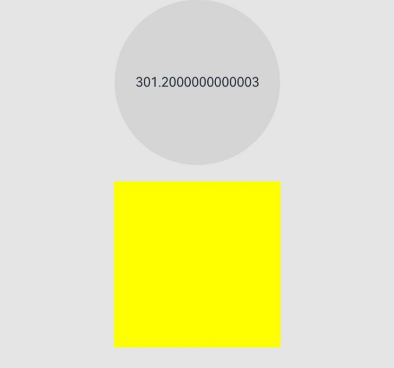
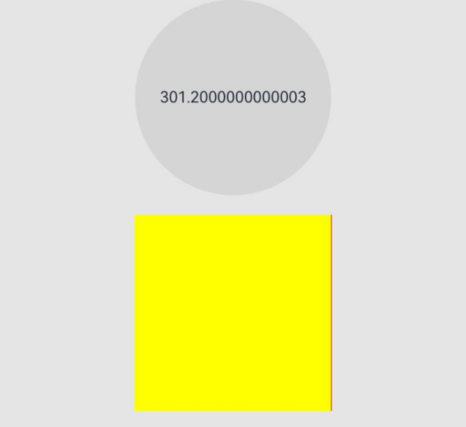

# Component-Level Pixel Rounding

Component-level pixel rounding allows you to enable or disable system pixel rounding for individual components by simply setting the **pixelRound** attribute.

>  **NOTE**
>
>  The initial APIs of this module are supported since API version 11. Updates will be marked with a superscript to indicate their earliest API version.

## pixelRound

pixelRound(value: PixelRoundPolicy)

Sets the pixel rounding policy for the current component in the specified direction. If a direction is not set, the pixels are rounded to the nearest whole number in that direction.

> **NOTE**
> 
> In API version 11, this API uses half-pixel alignment (that is, 0\-0.25 rounds to 0, 0.25\-0.75 rounds to 0.5, 0.75\-1.0 rounds to 1). Since API version 12, this API rounds pixels to the nearest integers and allows you to disable pixel rounding for individual components.

In normal calculations, the top and bottom directions correspond to the component height, and the left and right directions (the starting direction of mirroring is called left) and width correspond to each other. For ease of description, these two sets of directions are referred to as upper left and lower right.

- Calculate the upper left corner coordinates of the current component: offset of the upper left corner relative to the parent container.
- Calculate the lower right corner coordinates of the current component: offset of the upper left corner relative to the parent container plus the size of the component itself.
- Recalculate the size of the current component: lower right corner rounded value minus the upper left corner rounded value.

**Widget capability**: This API can be used in ArkTS widgets since API version 11.

**Atomic service API**: This API can be used in atomic services since API version 11.

**System capability**: SystemCapability.ArkUI.ArkUI.Full

**Parameters**

| Name| Type  | Mandatory| Description                                                        |
| ------ | ------ | ---- | ------------------------------------------------------------ |
| value | [PixelRoundPolicy](ts-types.md#pixelroundpolicy11) | Yes| Rounding policy for the bounds of the component.<br>**NOTE**<br>This attribute is applicable in scenarios where artifacts occur due to floating-point drawing. The rounding result is related not only to the component's width and height but also to its position. Even if the component's width and height are set to be the same, due to different floating-point positions described, the final width and height of the component may also be different after rounding.|

## FAQs

| Issue                                                    | Solution                                                    |
| ------------------------------------------------------------ | ------------------------------------------------------------ |
| When a child component completely fills its parent container, and the offset and size cause the parent container to round up while the child component rounds down, there is a 1 px gap revealed in the parent container.| 1. Use the ceil rounding method for the child component in the direction where the gap is revealed.<br>2. Disable pixel rounding for both parent and child components.|
| When a **List** component is used with dividers set, the dividers disappear under specific cases.          | 1. Set a 2 px space on the **List** component.<br>2. Disable pixel rounding on the corresponding components.|
| Overlapping occurs on specific devices.                                        | 1. Set a 2 px space on the **List** component.<br>2. Disable pixel rounding on the component.<br>3. Obtain the DPI value of the device through media query APIs and implement customized adaptation.|
| When a component rendered with an animation, there is a slight flicker.                            | Disable pixel rounding on the corresponding components.                                  |
| The layout within a container is compact, and the sizes of child components are inconsistent.                          | Disable pixel rounding on the corresponding components.                                  |

## Example

This example shows how to use **pixelRound** to guide layout adjustments when there is a 1 px gap in the parent component.

```ts
@Entry
@Component
struct PixelRoundExample {
    @State curWidth : number = 300;

    build() {
        Column() {
            Button(){
                Text(this.curWidth.toString())
            }
            .onClick(() => {
                this.curWidth += 0.1;
            })
            .height(200)
            .width(200)
            .backgroundColor('rgb(213, 213, 213)')

            Blank().height(20)

            Row() {
                Row() {
                }
                .width('100%')
                .height('100%')
                .backgroundColor(Color.Yellow)
                .pixelRound({
                    start : PixelRoundCalcPolicy.NO_FORCE_ROUND,
                    end : PixelRoundCalcPolicy.NO_FORCE_ROUND,
                })
            }
            .width(this.curWidth.toString() + 'px')
            .height('300.6px')
            .backgroundColor(Color.Red)
            .pixelRound({
                start : PixelRoundCalcPolicy.NO_FORCE_ROUND,
                end : PixelRoundCalcPolicy.NO_FORCE_ROUND,
            })
        }
        .width("100%")
        .height('100%')
        .backgroundColor('#ffe5e5e5')
    }
}
```

In this example, when pixel rounding is initially disabled (that is, the **pixelRound** attribute is not set on the parent and child components), the component appearance is normal. You can increase the width of the parent component by clicking the button. The initial width is set at 301.2 px to provide a baseline for observing visual changes. As you increase the width, you may notice that at certain widths, a 1 px gap appears on the right side of the parent component. You can modify the example code to perform similar tests in the vertical dimension to see whether a similar issue occurs when the height of the components is changed.

**Figure 1** Layout with pixelRound



**Figure 2** Layout without pixelRound


