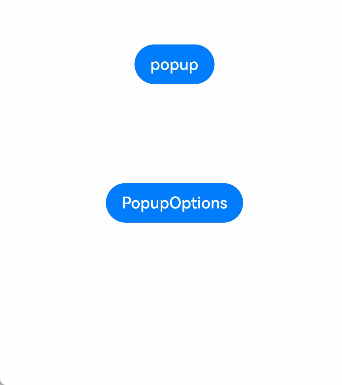
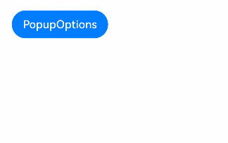
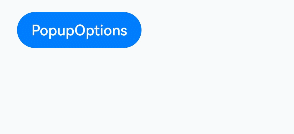

# Popup Control

You can bind a popup to a component, specifying its content, interaction logic, and visibility.

>  **NOTE**
>
> - This attribute is supported since API version 7. Updates will be marked with a superscript to indicate their earliest API version.
>  
> - The visibility of the popup is returned through the **onStateChange** event callback. There is no strong mapping between the visibility and the creation or destruction of the component.

## bindPopup

bindPopup(show: boolean, popup: PopupOptions | CustomPopupOptions)

Binds a popup to the component.

**Atomic service API**: This API can be used in atomic services since API version 11.

**System capability**: SystemCapability.ArkUI.ArkUI.Full

**Parameters**

| Name| Type                                                        | Mandatory| Description                                                        |
| ------ | ------------------------------------------------------------ | ---- | ------------------------------------------------------------ |
| show   | boolean                                                      | Yes  | Whether to show the popup. The default value is **false**, indicating that the popup is hidden. The popup can be displayed only after the entire page is fully constructed. Therefore, to avoid incorrect display positions and shapes, do not set this parameter to **true** while the page is still being constructed. This parameter supports two-way binding through [!! Syntax](../../../quick-start/arkts-new-binding.md).|
| popup  | [PopupOptions](#popupoptions) \| [CustomPopupOptions](#custompopupoptions8)<sup>8+</sup> | Yes  | Parameters of the popup.                                        |

## PopupOptions

| Name                                 | Type                                                        | Mandatory| Description                                                        |
| ------------------------------------- | ------------------------------------------------------------ | ---- | ------------------------------------------------------------ |
| message                               | string                                                       | Yes  | Content of the popup message.<br>**Atomic service API**: This API can be used in atomic services since API version 11.                                              |
| placementOnTop<sup>(deprecated)</sup> | boolean                                                      | No  | Whether to display the popup above the component. The default value is **false**.<br>**NOTE**<br>This API is deprecated since API version 10. You are advised to use **placement** instead.|
| primaryButton                         | {<br>value: string,<br>action: () =&gt; void<br>} | No  | Primary button.<br>**value**: text of the primary button in the popup.<br>**action**: callback for clicking the primary button.<br>**Atomic service API**: This API can be used in atomic services since API version 11.|
| secondaryButton                       | {<br>value: string,<br>action: () =&gt; void<br>} | No  | Secondary button.<br>**value**: text of the secondary button in the popup.<br>**action**: callback for clicking the secondary button.<br>**Atomic service API**: This API can be used in atomic services since API version 11.|
| onStateChange                         | (event: { isVisible: boolean }) =&gt; void | No  | Callback for the popup status change event. The parameter **isVisible** indicates whether the popup is visible.<br>**Atomic service API**: This API can be used in atomic services since API version 11.   |
| arrowOffset<sup>9+</sup>              | [Length](ts-types.md#length)                                 | No  | Offset of the popup arrow relative to the popup. When the arrow is at the top or bottom of the popup: The value **0** indicates that the arrow is located on the leftmost, and any other value indicates the distance from the arrow to the leftmost; the arrow is centered by default. When the arrow is on the left or right side of the popup: The value indicates the distance from the arrow to the top; the arrow is centered by default. When the popup is displayed on either edge of the screen, it will automatically deviate leftward or rightward to stay within the safe area. When the value is 0, the arrow always points to the bound component.<br>**Atomic service API**: This API can be used in atomic services since API version 11.|
| showInSubWindow<sup>9+</sup>          | boolean                                                      | No  | Whether to show the popup in the subwindow. The default value is **false**.<br>**Atomic service API**: This API can be used in atomic services since API version 11.                       |
| mask<sup>10+</sup>                    | boolean \| { color : [ResourceColor](ts-types.md#resourcecolor) }| No  | Whether to apply a mask to the popup. The value **true** means to apply a transparent mask to the popup, **false** means not to apply a mask to the popup, and a color value means to apply a mask in the corresponding color to the popup.<br>**Atomic service API**: This API can be used in atomic services since API version 11.|
| messageOptions<sup>10+</sup>          | [PopupMessageOptions](#popupmessageoptions10)        | No  | Parameters of the popup message.<br>**Atomic service API**: This API can be used in atomic services since API version 11.                                      |
| targetSpace<sup>10+</sup>             | [Length](ts-types.md#length)                                 | No  | Space between the popup and the target.<br>**Atomic service API**: This API can be used in atomic services since API version 11.                                     |
| placement<sup>10+</sup>               | [Placement](ts-appendix-enums.md#placement8)                 | No  | Position of the popup relative to the target. The default value is **Placement.Bottom**.<br>If both **placementOnTop** and **placement** are set, the latter prevails.<br>**Atomic service API**: This API can be used in atomic services since API version 11.|
| offset<sup>10+</sup>                  | [Position](ts-types.md#position)                            | No  | Offset of the popup relative to the display position specified by **placement**.<br>**NOTE**<br>This parameter cannot be set in percentage.<br>**Atomic service API**: This API can be used in atomic services since API version 11.|
| enableArrow<sup>10+</sup>             | boolean                                                      | No  | Whether to display the arrow.<br>Default value: **true**<br>**NOTE**<br>If the available space on the screen is insufficient, the popup will cover part of the component and the arrow will not be displayed.<br>**Atomic service API**: This API can be used in atomic services since API version 11.|
| popupColor<sup>11+</sup>              | [Color](ts-appendix-enums.md#color)  \| string \| number  \|  [Resource](ts-types.md#resource) | No  | Color of the popup. To remove the background blur, set **backgroundBlurStyle** to **BlurStyle.NONE**.<br>Default value: [TRANSPARENT](ts-appendix-enums.md#color) plus[COMPONENT_ULTRA_THICK](ts-universal-attributes-background.md#blurstyle9)<br>**Atomic service API**: This API can be used in atomic services since API version 12.|
| autoCancel<sup>11+</sup>              | boolean                                                      | No  | Whether to automatically dismiss the popup when an operation is performed on the page.<br>Default value: **true**<br>**Atomic service API**: This API can be used in atomic services since API version 12.          |
| width<sup>11+</sup>                   | [Dimension](ts-types.md#dimension10)                         | No  | Width of the popup.<br>**NOTE**<br>When **showInSubWindow** is set to **true**, the maximum height of the popup is the height of the device screen. When **showInSubWindow** is set to **false**, the maximum height is the height of the application window. Allowable height = Maximum height – Status bar height (0 if there is no status bar) – Dock height (0 if there is no dock) – 40 vp – 40 vp.<br>**Atomic service API**: This API can be used in atomic services since API version 12.|
| arrowPointPosition<sup>11+</sup>      | [ArrowPointPosition](ts-appendix-enums.md#arrowpointposition11) | No  | Position of the popup arrow relative to its parent component. Available positions are **Start**, **Center**, and **End**, in both vertical and horizontal directions. All these positions are within the parent component area.<br>**Atomic service API**: This API can be used in atomic services since API version 12.|
| arrowWidth<sup>11+</sup>             | [Dimension](ts-types.md#dimension10)                  | No  | Arrow thickness. If the arrow thickness exceeds the length of the edge minus twice the size of the popup rounded corner, the arrow is not drawn.<br>Default value: **16**<br>Unit: vp<br>**NOTE**<br>This parameter cannot be set in percentage.<br>**Atomic service API**: This API can be used in atomic services since API version 12.                         |
| arrowHeight<sup>11+</sup>             | [Dimension](ts-types.md#dimension10)                  | No  | Arrow height.<br>Default value: **8**<br>Unit: vp<br>**NOTE**<br>This parameter cannot be set in percentage.<br>**Atomic service API**: This API can be used in atomic services since API version 12.                         |
| radius<sup>11+</sup>             | [Dimension](ts-types.md#dimension10)                  | No  | Rounded corner radius of the popup.<br>Default value: **20**<br>Unit: vp<br>**Atomic service API**: This API can be used in atomic services since API version 12.                         |
| shadow<sup>11+</sup>             | [ShadowOptions](ts-universal-attributes-image-effect.md#shadowoptions) \| [ShadowStyle](ts-universal-attributes-image-effect.md#shadowstyle10)    | No  | Popup shadow.<br>Default value: **ShadowStyle.OUTER_DEFAULT_MD**<br>**Atomic service API**: This API can be used in atomic services since API version 12.    |
| backgroundBlurStyle<sup>11+</sup> | [BlurStyle](ts-universal-attributes-background.md#blurstyle9) | No| Background blur style of the popup.<br>Default value: **BlurStyle.COMPONENT_ULTRA_THICK**<br>**Atomic service API**: This API can be used in atomic services since API version 12.|
| transition<sup>12+</sup> | [TransitionEffect](ts-transition-animation-component.md#transitioneffect10) | No| Transition effect for the entrance and exit of the popup.<br>**NOTE**<br>1. If this parameter is not set, the default effect is used.<br>2. Touching the Back button during the entrance animation pauses the entrance animation and starts the exit animation. The final effect is one obtained after the curves of the entrance and exit animations are combined.<br>3. Touching the Back button during the exit animation does not affect the animation playback. The Back button does not respond.<br>**Atomic service API**: This API can be used in atomic services since API version 12.|
| onWillDismiss<sup>12+</sup>           | boolean\|(dismissPopupAction: [DismissPopupAction](#dismisspopupaction12)) => void                                                                               | No  | Whether to perform dismissal event interception and interception callback. The default value is **true**.<br>1. If this parameter is set to **false**, the system does not respond to the dismissal event initiated by touching the Back button, swiping left or right on the screen, or pressing the Esc key; and the system dismisses the popup only when **show** is set to **false**. If this parameter is set to **true**, the system responds to the dismissal event as expected.<br>2. If this parameter is set to a function, the dismissal event is intercepted and the callback function is executed.<br>**NOTE**<br>No more **onWillDismiss** callback is allowed in an **onWillDismiss** callback.<br>**Atomic service API**: This API can be used in atomic services since API version 12.|
| followTransformOfTarget<sup>13+</sup>          | boolean | No  | Whether the popup adjusts its position to follow transformations (like rotation or scaling) applied to its host component or the host component's parent container.<br>Default value: **false**<br>**Atomic service API**: This API can be used in atomic services since API version 13.|
| keyboardAvoidMode<sup>16+</sup>          | [KeyboardAvoidMode](../js-apis-promptAction.md#keyboardavoidmode12) | No  | Whether to avoid the soft keyboard. By default, the popup does not avoid the soft keyboard. When configured to avoid the soft keyboard, if the popup display space is insufficient, the display mode of the popup changes from being centered over the parent component to being translated and covering the parent component.. In addition, if the popup arrow does not point to the host, the arrow will not be displayed.<br>Default value: **KeyboardAvoidMode.NONE**<br>**Atomic service API**: This API can be used in atomic services since API version 16.|

## PopupMessageOptions<sup>10+</sup>

**Atomic service API**: This API can be used in atomic services since API version 11.

| Name     | Type                                      | Mandatory| Description                                                        |
| --------- | ------------------------------------------ | ---- | ------------------------------------------------------------ |
| textColor | [ResourceColor](ts-types.md#resourcecolor) | No  | Text color of the popup message.                                      |
| font      | [Font](ts-types.md#font)                   | No  | Font settings of the popup message.<br>**NOTE**<br>Setting **family** is not supported.|

## DismissPopupAction<sup>12+</sup>

**Atomic service API**: This API can be used in atomic services since API version 12.

| Name   | Type                                     | Mandatory| Description                                                           |
| ------- | ----------------------------------------- | ---- | --------------------------------------------------------------- |
| dismiss | function                                  | Yes  | Callback for dismissing the popup. This API is called only when the popup needs to be exited.|
| reason  | [DismissReason](#dismissreason12)| Yes  | Reason why the popup cannot be dismissed.                      |

## DismissReason<sup>12+</sup>


| Name         | Description          |
| ------------- | ------------------ |
| PRESS_BACK    | Touching the Back button.      |
| TOUCH_OUTSIDE | Touching anywhere outside of the popup.|

## CustomPopupOptions<sup>8+</sup>

| Name                          | Type                                      | Mandatory  | Description                                      |
| ---------------------------- | ---------------------------------------- | ---- | ---------------------------------------- |
| builder                      | [CustomBuilder](ts-types.md#custombuilder8) | Yes   | Popup builder.<br>**NOTE**<br>The **popup** attribute is a universal attribute. A custom popup does not support display of another popup. The **position** attribute cannot be used for the first-layer container in the builder. If the **position** attribute is used, the popup will not be displayed. If a custom component is used in the builder, the **aboutToAppear** and **aboutToDisappear** lifecycle callbacks of the custom component are irrelevant to the visibility of the popup. As such, the lifecycle of the custom component cannot be used to determine whether the popup is displayed or not.<br>**Atomic service API**: This API can be used in atomic services since API version 11.                             |
| placement                    | [Placement](ts-appendix-enums.md#placement8) | No   | Preferred position of the popup. If the set position is insufficient for holding the popup, it will be automatically adjusted.<br>Default value: **Placement.Bottom**<br>**Atomic service API**: This API can be used in atomic services since API version 11.|
| popupColor                   | number \| [Color](ts-types.md#color) \| string \| [Resource](ts-types.md#resource) | No   | Color of the popup. To remove the background blur, set **backgroundBlurStyle** to **BlurStyle.NONE**.<br>The default value varies by API version.<br>API version 10: **'#4d4d4d'**<br>API version 11 and later: [TRANSPARENT](ts-appendix-enums.md#color) plus [COMPONENT_ULTRA_THICK](ts-universal-attributes-background.md#blurstyle9)<br>**Atomic service API**: This API can be used in atomic services since API version 11.|
| enableArrow                  | boolean                                  | No   | Whether to display an arrow.<br>Since API version 9, if the position set for the popup is not large enough, the arrow will not be displayed. For example, if **placement** is set to **Left**, but the popup height (80 vp) is less than the sum of the arrow width (32 vp) and diameter of popup rounded corner (48 vp), the arrow will not be displayed.<br>Default value: **true**<br>**Atomic service API**: This API can be used in atomic services since API version 11.|
| autoCancel                   | boolean                                  | No   | Whether to automatically dismiss the popup when an operation is performed on the page.<br>Default value: **true**<br>**NOTE**<br>To enable the popup to disappear upon a click on it, place a layout component in the builder, place the **\<Popup>** component in the layout component, and modify the value of the **bindPopup** variable (show: boolean) in the **onClick** event of the layout component.<br>**Atomic service API**: This API can be used in atomic services since API version 11.|
| onStateChange                | (event: { isVisible: boolean }) =&gt; void | No   | Callback for the popup status change event. The parameter **isVisible** indicates whether the popup is visible.<br>**Atomic service API**: This API can be used in atomic services since API version 11.                |
| arrowOffset<sup>9+</sup>     | [Length](ts-types.md#length) | No   | Offset of the popup arrow relative to the popup. When the arrow is at the top or bottom of the popup: The value **0** indicates that the arrow is located on the leftmost, and any other value indicates the distance from the arrow to the leftmost; the arrow is centered by default. When the arrow is on the left or right side of the popup: The value indicates the distance from the arrow to the top; the arrow is centered by default. When the popup is displayed on either edge of the screen, it will automatically deviate leftward or rightward to stay within the safe area. When the value is 0, the arrow always points to the bound component.<br>**Atomic service API**: This API can be used in atomic services since API version 11.|
| showInSubWindow<sup>9+</sup> | boolean                                  | No   | Whether to show the popup in the subwindow. The default value is **false**.<br>**Atomic service API**: This API can be used in atomic services since API version 11.                   |
| maskColor<sup>(deprecated)</sup> | [Resource](ts-types.md#resource) \| string \| number \|  [Color](ts-types.md#color) | No  | Color of the popup mask.<br>**NOTE**<br>This parameter is deprecated since API version 10. You are advised to use **mask** instead.|
| mask<sup>10+</sup>           | boolean \| { color : [ResourceColor](ts-types.md#resourcecolor) }| No   | Whether to apply a mask to the popup. The value **true** means to apply a transparent mask to the popup, **false** means not to apply a mask to the popup, and a color value means to apply a mask in the corresponding color to the popup.<br>**Atomic service API**: This API can be used in atomic services since API version 11.|
| targetSpace<sup>10+</sup>    | [Length](ts-types.md#length)             | No   | Space between the popup and the target.<br>**Atomic service API**: This API can be used in atomic services since API version 11.                          |
| offset<sup>10+</sup>         | [Position](ts-types.md#position)                            | No  | Offset of the popup relative to the display position specified by **placement**.<br>**NOTE**<br>This parameter cannot be set in percentage.<br>**Atomic service API**: This API can be used in atomic services since API version 11.|
| width<sup>11+</sup> | [Dimension](ts-types.md#dimension10) | No| Width of the popup.<br>**NOTE**<br>When **showInSubWindow** is set to **true**, the maximum height of the popup is the height of the device screen. When **showInSubWindow** is set to **false**, the maximum height is the height of the application window. Allowable height = Maximum height – Status bar height (0 if there is no status bar) – Dock height (0 if there is no dock) – 40 vp – 40 vp.<br>**Atomic service API**: This API can be used in atomic services since API version 12.|
| arrowPointPosition<sup>11+</sup> | [ArrowPointPosition](ts-appendix-enums.md#arrowpointposition11) | No| Position of the popup arrow relative to its parent component. Available positions are **Start**, **Center**, and **End**, in both vertical and horizontal directions. All these positions are within the parent component area.<br>**Atomic service API**: This API can be used in atomic services since API version 12.|
| arrowWidth<sup>11+</sup>             | [Dimension](ts-types.md#dimension10)                                                      | No  | Arrow thickness. If the arrow thickness exceeds the length of the edge minus twice the size of the popup rounded corner, the arrow is not drawn.<br>Default value: **16**<br>Unit: vp<br>**NOTE**<br>This parameter cannot be set in percentage.<br>**Atomic service API**: This API can be used in atomic services since API version 12.                         |
| arrowHeight<sup>11+</sup>             | [Dimension](ts-types.md#dimension10)                  | No  | Arrow height.<br>Default value: **8**<br>Unit: vp<br>**NOTE**<br>This parameter cannot be set in percentage.<br>**Atomic service API**: This API can be used in atomic services since API version 12.                         |
| radius<sup>11+</sup>             | [Dimension](ts-types.md#dimension10)                  | No  | Rounded corner radius of the popup.<br>Default value: **20**<br>Unit: vp<br>**Atomic service API**: This API can be used in atomic services since API version 12.                         |
| shadow<sup>11+</sup>             | [ShadowOptions](ts-universal-attributes-image-effect.md#shadowoptions) \| [ShadowStyle](ts-universal-attributes-image-effect.md#shadowstyle10)    | No  | Popup shadow.<br>Default value: **ShadowStyle.OUTER_DEFAULT_MD**<br>**Atomic service API**: This API can be used in atomic services since API version 12.    |
| backgroundBlurStyle<sup>11+</sup> | [BlurStyle](ts-universal-attributes-background.md#blurstyle9) | No| Background blur style of the popup.<br>Default value: **BlurStyle.COMPONENT_ULTRA_THICK**<br>**Atomic service API**: This API can be used in atomic services since API version 12.|
| focusable<sup>11+</sup> | boolean | No| Whether the popup obtains focus when displayed.<br>Default value: **false**<br>**Atomic service API**: This API can be used in atomic services since API version 12.|
| transition<sup>12+</sup> | [TransitionEffect](ts-transition-animation-component.md#transitioneffect10) | No| Transition effect for the entrance and exit of the popup.<br>**NOTE**<br>1. If this parameter is not set, the default effect is used.<br>2. Touching the Back button during the entrance animation pauses the entrance animation and starts the exit animation. The final effect is one obtained after the curves of the entrance and exit animations are combined.<br>3. Touching the Back button during the exit animation does not affect the animation playback. The Back button does not respond.<br>**Atomic service API**: This API can be used in atomic services since API version 12.|
| onWillDismiss<sup>12+</sup>           | boolean\|(dismissPopupAction: [DismissPopupAction](#dismisspopupaction12)) => void                                                                               | No  | Whether to perform dismissal event interception and interception callback. The default value is **true**.<br>1. If this parameter is set to **false**, the system does not respond to the dismissal event initiated by touching the Back button, swiping left or right on the screen, or pressing the Esc key; and the system dismisses the popup only when **show** is set to **false**. If this parameter is set to **true**, the system responds to the dismissal event as expected.<br>2. If this parameter is set to a function, the dismissal event is intercepted and the callback function is executed.<br>**NOTE**<br>No more **onWillDismiss** callback is allowed in an **onWillDismiss** callback.<br>**Atomic service API**: This API can be used in atomic services since API version 12.|
| followTransformOfTarget<sup>13+</sup>          | boolean | No  | Whether the popup adjusts its position to follow transformations (like rotation or scaling) applied to its host component or the host component's parent container.<br>Default value: **false**<br>**Atomic service API**: This API can be used in atomic services since API version 13.|
| keyboardAvoidMode<sup>16+</sup>          | [KeyboardAvoidMode](../js-apis-promptAction.md#keyboardavoidmode12) | No  | Whether to avoid the soft keyboard. By default, the popup does not avoid the soft keyboard. When configured to avoid the soft keyboard, if the popup display space is insufficient, the display mode of the popup changes from being centered over the parent component to being translated and covering the parent component.. In addition, if the popup arrow does not point to the host, the arrow will not be displayed.<br>Default value: **KeyboardAvoidMode.NONE**<br>**Atomic service API**: This API can be used in atomic services since API version 16.|

## PopupCommonOptions<sup>16+</sup>

Parameters of the popup. Use the [getPromptAction()](../js-apis-arkui-UIContext.md#getpromptaction) API in [UIContext](../js-apis-arkui-UIContext.md#uicontext) to obtain a [PromptAction](../js-apis-arkui-UIContext.md#promptaction) object. Then, use this object to call **openPopup** and **updatePopup**, where the properties of the **options** parameter are defined as follows.

**Atomic service API**: This API can be used in atomic services since API version 16.

**System capability**: SystemCapability.ArkUI.ArkUI.Full

| Name                          | Type                                      | Mandatory  | Description                                      |
| ---------------------------- | ---------------------------------------- | ---- | ---------------------------------------- |
| placement                    | [Placement](ts-appendix-enums.md#placement8) | No   | Preferred position of the popup. If the set position is insufficient for holding the popup, it will be automatically adjusted.<br>Default value: **Placement.Bottom**|
| popupColor                   | number \| [Color](ts-types.md#color) \| string \| [Resource](ts-types.md#resource) | No   | Color of the popup. To remove the background blur, set **backgroundBlurStyle** to **BlurStyle.NONE**. Default value: [TRANSPARENT](ts-appendix-enums.md#color) plus[COMPONENT_ULTRA_THICK](ts-universal-attributes-background.md#blurstyle9)|
| enableArrow                  | boolean                                  | No   | Whether to display an arrow.<br>If the position set for the popup is not large enough, the arrow will not be displayed. For example, if **placement** is set to **Left**, but the popup height (80 vp) is less than the sum of the arrow width (32 vp) and diameter of popup rounded corner (48 vp), the arrow will not be displayed.<br>Default value: **true**|
| autoCancel                   | boolean                                  | No   | Whether to automatically dismiss the popup when an operation is performed on the page.<br>Default value: **true**|
| onStateChange                | [PopupStateChangeCallback](#popupstatechangecallback16) | No   | Callback invoked when the popup state changes.<br>**NOTE**<br>The settings cannot be updated through [updatePopup](../js-apis-arkui-UIContext.md#updatepopup16).|
| arrowOffset     | [Length](ts-types.md#length) | No   | Offset of the popup arrow relative to the popup. When the arrow is at the top or bottom of the popup: The value **0** indicates that the arrow is located on the leftmost, and any other value indicates the distance from the arrow to the leftmost; the arrow is centered by default. When the arrow is on the left or right side of the popup: The value indicates the distance from the arrow to the top; the arrow is centered by default. When the popup is displayed on either edge of the screen, it will automatically deviate leftward or rightward to stay within the safe area. When the value is 0, the arrow always points to the bound component.|
| showInSubWindow | boolean                                  | No   | Whether to show the popup in the subwindow. The default value is **false**.<br>**NOTE**<br>The settings cannot be updated through [updatePopup](../js-apis-arkui-UIContext.md#updatepopup16).|
| mask           | boolean \| [PopupMaskType](#popupmasktype16) | No   | Whether to apply a mask to the popup. The value **true** means to apply a transparent mask to the popup, **false** means not to apply a mask to the popup, and a color value means to apply a mask in the corresponding color to the popup.|
| targetSpace    | [Length](ts-types.md#length)             | No   | Space between the popup and the target.|
| offset         | [Position](ts-types.md#position)                            | No  | Offset of the popup relative to the display position specified by **placement**.<br>**NOTE**<br>This parameter cannot be set in percentage.|
| width | [Dimension](ts-types.md#dimension10) | No| Width of the popup.<br>**NOTE**<br>When **showInSubWindow** is set to **true**, the maximum height of the popup is the height of the device screen. When **showInSubWindow** is set to **false**, the maximum height is the height of the application window. Allowable height = Maximum height – Status bar height (0 if there is no status bar) – Dock height (0 if there is no dock) – 40 vp – 40 vp.|
| arrowPointPosition | [ArrowPointPosition](ts-appendix-enums.md#arrowpointposition11) | No| Position of the popup arrow relative to its parent component. Available positions are **Start**, **Center**, and **End**, in both vertical and horizontal directions. All these positions are within the parent component area.|
| arrowWidth             | [Dimension](ts-types.md#dimension10)                                                      | No  | Arrow thickness. If the arrow thickness exceeds the length of the edge minus twice the size of the popup rounded corner, the arrow is not drawn.<br>Default value: **16**<br>Unit: vp<br>**NOTE**<br>This parameter cannot be set in percentage.|
| arrowHeight             | [Dimension](ts-types.md#dimension10)                  | No  | Arrow height.<br>Default value: **8**<br>Unit: vp<br>**NOTE**<br>This parameter cannot be set in percentage.|
| radius             | [Dimension](ts-types.md#dimension10)                  | No  | Rounded corner radius of the popup.<br>Default value: **20**<br>Unit: vp|
| shadow             | [ShadowOptions](ts-universal-attributes-image-effect.md#shadowoptions) \| [ShadowStyle](ts-universal-attributes-image-effect.md#shadowstyle10)    | No  | Popup shadow.<br>Default value: **ShadowStyle.OUTER_DEFAULT_MD**|
| backgroundBlurStyle | [BlurStyle](ts-universal-attributes-background.md#blurstyle9) | No| Background blur style of the popup.<br>Default value: **BlurStyle.COMPONENT_ULTRA_THICK**|
| focusable | boolean | No| Whether the popup obtains focus when displayed.<br>Default value: **false**<br>**NOTE**<br>The settings cannot be updated through [updatePopup](../js-apis-arkui-UIContext.md#updatepopup16).|
| transition | [TransitionEffect](ts-transition-animation-component.md#transitioneffect10) | No| Transition effect for the entrance and exit of the popup.<br>**NOTE**<br>1. If this parameter is not set, the default effect is used.<br>2. Touching the Back button during the entrance animation pauses the entrance animation and starts the exit animation. The final effect is one obtained after the curves of the entrance and exit animations are combined.<br>3. Touching the Back button during the exit animation does not affect the animation playback. The Back button does not respond.<br>4. The settings cannot be updated through [updatePopup](../js-apis-arkui-UIContext.md#updatepopup16).|
| onWillDismiss           | boolean\|Callback<[DismissPopupAction](#dismisspopupaction12)> | No  | Whether to perform dismissal event interception and interception callback. The default value is **true**.<br>1. If this parameter is set to **false**, the system does not respond to the dismissal event initiated by touching the Back button, swiping left or right on the screen, or pressing the Esc key; and the system dismisses the popup only when **show** is set to **false**. If this parameter is set to **true**, the system responds to the dismissal event as expected.<br>2. If this parameter is set to a function, the dismissal event is intercepted and the callback function is executed.<br>**NOTE**<br>1. Nesting **onWillDismiss** callbacks is not allowed.<br>2. The settings cannot be updated through [updatePopup](../js-apis-arkui-UIContext.md#updatepopup16).|
| followTransformOfTarget          | boolean | No  | Whether the popup adjusts its position to follow transformations (like rotation or scaling) applied to its host component or the host component's parent container.<br>Default value: **false**|

## PopupStateChangeParam<sup>16+</sup>

Describes the display state of a popup.

**Atomic service API**: This API can be used in atomic services since API version 16.

**System capability**: SystemCapability.ArkUI.ArkUI.Full

| Name     | Type                                      | Mandatory| Description                                                        |
| --------- | ------------------------------------------ | ---- | ------------------------------------------------------------ |
| isVisible | boolean | Yes  | Display state of the popup.                                      |

## PopupStateChangeCallback<sup>16+</sup>

Represents the callback invoked when the popup state changes.

type PopupStateChangeCallback = (event: PopupStateChangeParam) => void;

**Atomic service API**: This API can be used in atomic services since API version 16.

**System capability**: SystemCapability.ArkUI.ArkUI.Full

**Parameters**

| Name     | Type                                      | Mandatory| Description                                                        |
| --------- | ------------------------------------------ | ---- | ------------------------------------------------------------ |
| event  | [PopupStateChangeParam] (#popupstatechangeparam16 type description)| Yes  | Display state of the popup.                                      |

**Return value**

| Type                                      | Description     |
| ---------------------------------------- | ------- |
|   void           |    Callback invoked when the popup state changes.|

## PopupMaskType<sup>16+</sup>

Describes the color of the mask.

**Atomic service API**: This API can be used in atomic services since API version 16.

**System capability**: SystemCapability.ArkUI.ArkUI.Full

| Name     | Type                                      | Mandatory| Description                                                        |
| --------- | ------------------------------------------ | ---- | ------------------------------------------------------------ |
| color | [ResourceColor](ts-types.md#resourcecolor) | Yes  | Color of the mask.                                      |

## Example

### Example 1: Displaying Different Types of Popups

This example showcases how to use the **bindPopup** API to configure and display popups of PopupOptions and CustomPopupOptions types.

```ts
// xxx.ets
@Entry
@Component
struct PopupExample {
  @State handlePopup: boolean = false
  @State customPopup: boolean = false

  // Popup builder
  @Builder popupBuilder() {
    Row({ space: 2 }) {
      Image($r("app.media.icon")).width(24).height(24).margin({ left: -5 })
      Text('Custom Popup').fontSize(10)
    }.width(100).height(50).padding(5)
  }

  build() {
    Flex({ direction: FlexDirection.Column }) {
      // PopupOptions for setting the popup
      Button('PopupOptions')
        .onClick(() => {
          this.handlePopup = !this.handlePopup
        })
        .bindPopup(this.handlePopup, {
          message: 'This is a popup with PopupOptions',
          placementOnTop: true,
          showInSubWindow:false,
          // Set the popup to avoid the soft keyboard.
          keyboardAvoidMode: KeyboardAvoidMode.DEFAULT,
          primaryButton: {
            value: 'confirm',
            action: () => {
              this.handlePopup = !this.handlePopup
              console.info('confirm Button click')
            }
          },
          // Secondary button
          secondaryButton: {
            value: 'cancel',
            action: () => {
              this.handlePopup = !this.handlePopup
              console.info('cancel Button click')
            }
          },
          onStateChange: (e) => {
            console.info(JSON.stringify(e.isVisible))
            if (!e.isVisible) {
              this.handlePopup = false
            }
          }
        })
        .position({ x: 100, y: 150 })


      // CustomPopupOptions for setting the popup
      Button('CustomPopupOptions')
        .onClick(() => {
          this.customPopup = !this.customPopup
        })
        .bindPopup(this.customPopup, {
          builder: this.popupBuilder,
          placement: Placement.Top,
          mask: {color:'#33000000'},
          popupColor: Color.Yellow,
          enableArrow: true,
          // Set the popup to avoid the soft keyboard.
          keyboardAvoidMode: KeyboardAvoidMode.DEFAULT,
          showInSubWindow: false,
          onStateChange: (e) => {
            if (!e.isVisible) {
              this.customPopup = false
            }
          }
        })
        .position({ x: 80, y: 300 })
    }.width('100%').padding({ top: 5 })
  }
}
```


### Example 2: Setting the Popup Text Style

This example shows how to use the **bindPopup** API to display a popup with custom **messageOptions** settings.

```ts
// xxx.ets

@Entry
@Component
struct PopupExample {
  @State handlePopup: boolean = false

  build() {
    Column({ space: 100 }) {
      Button('PopupOptions').margin(100)
        .onClick(() => {
          this.handlePopup = !this.handlePopup
        })
        .bindPopup(this.handlePopup, {
          // Popup of the PopupOptions type
          message: 'This is a popup with PopupOptions',
          messageOptions: {
            // Text style of the popup
            textColor: Color.Red,
            font: {
              size: '14vp',
              style: FontStyle.Italic,
              weight: FontWeight.Bolder
            }
          },
          placement: Placement.Bottom,
          enableArrow: false, // Set the arrow not to display.
          targetSpace: '15vp',
          onStateChange: (e) => {
            console.info(JSON.stringify(e.isVisible))
            if (!e.isVisible) {
              this.handlePopup = false
            }
          }
        })
    }.margin(20)
  }
}
```


### Example 3: Setting the Popup Style

This example demonstrates how to use the **bindPopup** API with properties like **arrowHeight**, **arrowWidth**, **radius**, **shadow**, and **popupColor** to set the styles for both the popup's arrow and the popup itself.

```ts
// xxx.ets

@Entry
@Component
struct PopupExample {
  @State customPopup: boolean = false
  @State handlePopup: boolean = false

  build() {
    Column({ space: 100 }) {
      Button("popup")
        .margin({ top: 50 })
        .onClick(() => {
          this.customPopup = !this.customPopup
        })
        .bindPopup(this.customPopup, {
          message: "this is a popup",
          arrowHeight: 20, // Set the height for the popup arrow.
          arrowWidth: 20, // Set the width for the popup arrow.
          radius: 20, // Set the corner radius of the popup.
          shadow: ShadowStyle.OUTER_DEFAULT_XS, // Set the shadow for the popup.
        })

      Button('PopupOptions')
        .onClick(() => {
          this.handlePopup = !this.handlePopup
        })
        .bindPopup(this.handlePopup, {
          width: 300,
          message: 'This is a popup with PopupOptions',
          arrowPointPosition: ArrowPointPosition.START, // Set the position for the popup arrow.
          backgroundBlurStyle: BlurStyle.NONE, // Disable the background blur for the popup.
          popupColor: Color.Red, // Set the background color for the popup.
          autoCancel: true,
        })
    }
    .width('100%')
  }
}
```



### Example 4: Setting the Popup Animation

In this example, the **bindPopup** API is used with the **transition** property to implement animations for displaying and dismissing popups.

```ts
// xxx.ets
@Entry
@Component
struct PopupExample {
  @State handlePopup: boolean = false
  @State customPopup: boolean = false

  // Popup builder
  @Builder popupBuilder() {
    Row() {
      Text('Custom Popup with transitionEffect').fontSize(10)
    }.height(50).padding(5)
  }

  build() {
    Flex({ direction: FlexDirection.Column }) {
      // PopupOptions for setting the popup
      Button('PopupOptions')
        .onClick(() => {
          this.handlePopup = !this.handlePopup
        })
        .bindPopup(this.handlePopup, {
          message: 'This is a popup with transitionEffect',
          placementOnTop: true,
          showInSubWindow: false,
          onStateChange: (e) => {
            console.info(JSON.stringify(e.isVisible))
            if (!e.isVisible) {
              this.handlePopup = false
            }
          },
          // Set the popup animation to a combination of opacity and translation effects, with no exit animation.
          transition:TransitionEffect.asymmetric(
            TransitionEffect.OPACITY.animation({ duration: 1000, curve: Curve.Ease }).combine(
              TransitionEffect.translate({ x: 50, y: 50 })),
            TransitionEffect.IDENTITY)
        })
        .position({ x: 100, y: 150 })

      // CustomPopupOptions for setting the popup
      Button('CustomPopupOptions')
        .onClick(() => {
          this.customPopup = !this.customPopup
        })
        .bindPopup(this.customPopup, {
          builder: this.popupBuilder,
          placement: Placement.Top,
          showInSubWindow: false,
          onStateChange: (e) => {
            if (!e.isVisible) {
              this.customPopup = false
            }
          },
          // Set the popup entrance and exit animations to be a scaling effect.
          transition:TransitionEffect.scale({ x: 1, y: 0 }).animation({ duration: 500, curve: Curve.Ease })
        })
        .position({ x: 80, y: 300 })
    }.width('100%').padding({ top: 5 })
  }
}
```


### Example 5: Adding an Event to a Popup

This example uses the **bindPopup** API with the **onWillDismiss** property to intercept the dismissal event when a popup is about to be dismissed and execute a callback function.

```ts
// xxx.ets

@Entry
@Component
struct PopupExample {
  @State handlePopup: boolean = false
  build() {
    Column() {
      Button('PopupOptions')
        .onClick(() => {
          this.handlePopup = true
        })
        .bindPopup(this.handlePopup, {
          message: 'This is a popup with PopupOptions',
          messageOptions: {
            textColor: Color.Red,
            font: {
              size: '14vp',
              style: FontStyle.Italic,
              weight: FontWeight.Bolder
            }
          },
          placement: Placement.Bottom,
          enableArrow: false,
          targetSpace: '15vp',
          onStateChange: (e) => {
            if (!e.isVisible) {
              this.handlePopup = false
            }
          },
          onWillDismiss: (
            (dismissPopupAction: DismissPopupAction) => {
              console.info("dismissReason:" + JSON.stringify(dismissPopupAction.reason))
              if (dismissPopupAction.reason == DismissReason.PRESS_BACK) {
                dismissPopupAction.dismiss()
              }
            }
          )
        })
    }.margin(20)
  }
}
```



### Example 6: Intercepting the Popup Dismissal Event

In this example, the **onWillDismiss** property is set to **false** to intercept the dismissal event of the popup.

```ts
// xxx.ets

@Entry
@Component
struct PopupExample {
  @State handlePopup: boolean = false
  build() {
    Column() {
      Button('PopupOptions')
        .onClick(() => {
          this.handlePopup = true
        })
        .bindPopup(this.handlePopup, {
          message: 'This is a popup with PopupOptions',
          messageOptions: {
            textColor: Color.Red,
            font: {
              size: '14vp',
              style: FontStyle.Italic,
              weight: FontWeight.Bolder
            }
          },
          placement: Placement.Bottom,
          enableArrow: false,
          targetSpace: '15vp',
          followTransformOfTarget: true,
          onStateChange: (e) => {
            let timer = setTimeout(()=>{this.handlePopup = false},6000)
            if (!e.isVisible) {
              this.handlePopup = false
              clearTimeout(timer)
            }
          },
          onWillDismiss: false
        })
    }.margin(20)
  }
}
```


<!--no_check-->