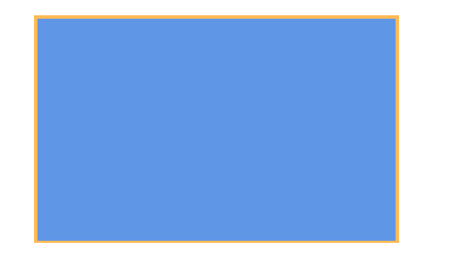
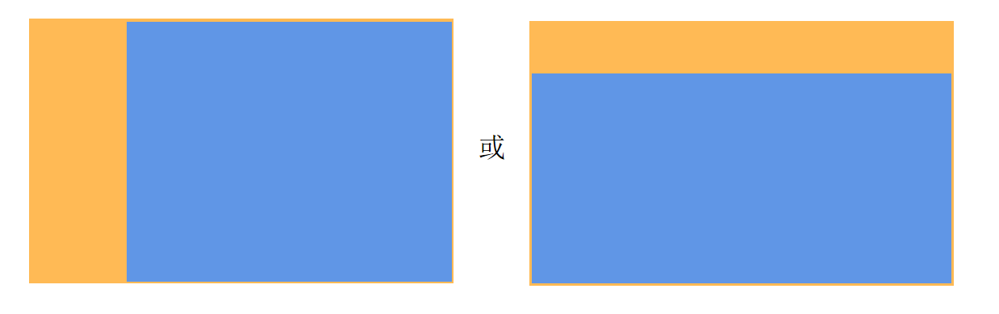
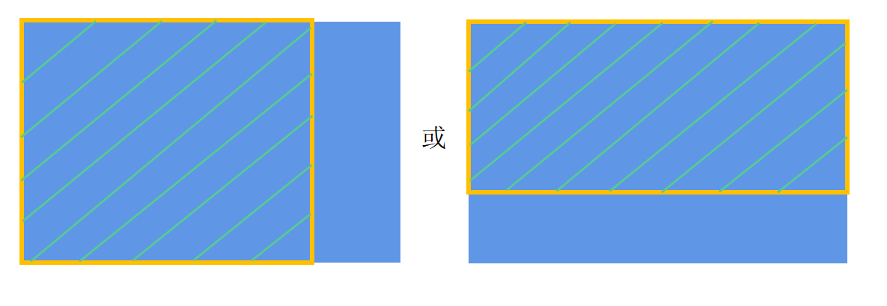
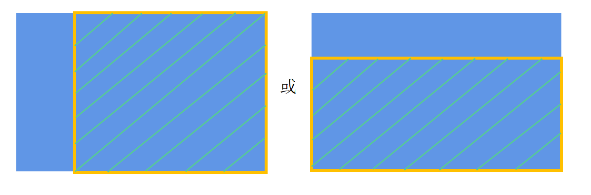
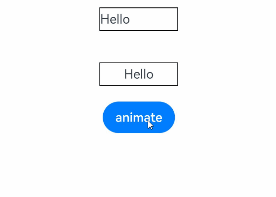

# Render Fit

The **renderFit** attribute sets how the final state of a component's content is rendered during its width and height animation process.

>  **NOTE**
>
>  The APIs of this module are supported since API version 10. Updates will be marked with a superscript to indicate their earliest API version.

## renderFit

renderFit(fitMode: RenderFit)

Sets how the final state of the component's content is rendered during its width and height animation process.

**Atomic service API**: This API can be used in atomic services since API version 11.

**System capability**: SystemCapability.ArkUI.ArkUI.Full

**Parameters**

| Name | Type                           | Mandatory| Description                                                        |
| ------- | ------------------------------- | ---- | ------------------------------------------------------------ |
| fitMode | [RenderFit](#renderfit) | Yes  | How the final state of the component's content is rendered during its width and height animation process.<br>If **renderFit** is not set, the default value **RenderFit.TOP_LEFT** is used.|

## renderFit<sup>18+</sup>

renderFit(fitMode: Optional\<RenderFit>)

Sets how the final state of the component's content is rendered during its width and height animation process. Compared to [renderFit](#renderfit), the **fitMode** parameter supports the **undefined** type.

**Atomic service API**: This API can be used in atomic services since API version 18.

**System capability**: SystemCapability.ArkUI.ArkUI.Full

**Parameters**

| Name | Type                                      | Mandatory| Description                                                        |
| ------- | ------------------------------------------ | ---- | ------------------------------------------------------------ |
| fitMode | Optional\<[RenderFit](#renderfit)> | Yes  | How the final state of the component's content is rendered during its width and height animation process.<br>If **fitMode** is set to **undefined**, the default value is used, which is equivalent to **RenderFit.TOP_LEFT**.|

>  **NOTE**
>
>  For the [XComponent](./ts-basic-components-xcomponent.md) component of the TEXTURE or SURFACE type, if the **renderFit** attribute is not set, it defaults to **RenderFit.RESIZE_FILL**.
>
>  For the [XComponent](./ts-basic-components-xcomponent.md) component of the SURFACE type with an opaque black background, the **renderFit** attribute can only be set to **RenderFit.RESIZE_FILL**. Other **RenderFit** enum values are not recommended.
>
>  For the **XComponent** component created using the [ArkUI NDK API](../../../ui/ndk-access-the-arkts-page.md), the [getAttribute](../_ark_u_i___native_node_a_p_i__1.md#getattribute) function is not supported for obtaining the **renderFit** attribute value.

## RenderFit

**Atomic service API**: This API can be used in atomic services since API version 11.

| Name                         | Description                                      | Diagram                                     |
| --------------------------- | ---------------------------------------- | ---------------------------------------- |
| CENTER                      | The component's content stays at the final size and always aligned with the center of the component.            |  |
| TOP                         | The component's content stays at the final size and always aligned with the top center of the component.          |  |
| BOTTOM                      | The component's content stays at the final size and always aligned with the bottom center of the component.          |  |
| LEFT                        | The component's content stays at the final size and always aligned with the left of the component.            |  |
| RIGHT                       | The component's content stays at the final size and always aligned with the right of the component.            |  |
| TOP_LEFT                    | The component's content stays at the final size and always aligned with the upper left corner of the component.           |  |
| TOP_RIGHT                   | The component's content stays at the final size and always aligned with the upper right corner of the component.           |  |
| BOTTOM_LEFT                 | The component's content stays at the final size and always aligned with the lower left corner of the component.           |  |
| BOTTOM_RIGHT                | The component's content stays at the final size and always aligned with the lower right corner of the component.           |  |
| RESIZE_FILL                 | The component's content is always resized to fill the component's content box, without considering its aspect ratio in the final state.           |  |
| RESIZE_CONTAIN              | While maintaining its aspect ratio in the final state, the component's content is scaled to fit within the component's content box. It is always aligned with the center of the component.|  |
| RESIZE_CONTAIN_TOP_LEFT     | While maintaining its aspect ratio in the final state, the component's content is scaled to fit within the component's content box. When there is remaining space in the width direction of the component, the content is left-aligned with the component. When there is remaining space in the height direction of the component, the content is top-aligned with the component.|  |
| RESIZE_CONTAIN_BOTTOM_RIGHT | While maintaining its aspect ratio in the final state, the component's content is scaled to fit within the component's content box. When there is remaining space in the width direction of the component, the content is right-aligned with the component. When there is remaining space in the height direction of the component, the content is bottom-aligned with the component.|  |
| RESIZE_COVER                | While maintaining its aspect ratio in the final state, the component's content is scaled to cover the component's entire content box. It is always aligned with the center of the component, so that its middle part is displayed.|  |
| RESIZE_COVER_TOP_LEFT       | While maintaining its aspect ratio in the final state, the component's content is scaled to cover the component's entire content box. When there is remaining space in the width direction, the content is left-aligned with the component, so that its left part is displayed. When there is remaining space in the height direction, the content is top-aligned with the component, so that its top part is displayed.|  |
| RESIZE_COVER_BOTTOM_RIGHT   | While maintaining its aspect ratio in the final state, the component's content is scaled to cover the component's entire content box. When there is remaining space in the width direction, the content is right-aligned with the component, so that its right part is displayed. When there is remaining space in the height direction, the content is bottom-aligned with the component, so that its bottom part is displayed.|  |

> **NOTE**
>
> - In the illustrative diagrams, the blue area indicates the content, and the orange area indicates the component content box.
> - Different render fit modes create different effects during the width and height animation process. Choose the one that best fits your need.

## Example

This example demonstrates how to set different content fill modes for a component during width and height animations through the **renderFit** attribute.

```ts
// xxx.ets
@Entry
@Component
struct RenderFitExample {
  @State width1: number = 100;
  @State height1: number = 30;
  flag: boolean = true;

  build() {
    Column() {
      Text("Hello")
        .width(this.width1)
        .height(this.height1)
        .borderWidth(1)
        .textAlign(TextAlign.Start)
        .renderFit(RenderFit.LEFT)// The component's content stays at the final size and always aligned with the left of the component.
        .margin(20)

      Text("Hello")
        .width(this.width1)
        .height(this.height1)
        .textAlign(TextAlign.Center)
        .borderWidth(1)
        .renderFit(RenderFit.CENTER)// The component's content stays at the final size and always aligned with the center of the component.
        .margin(20)

      Button("animate")
        .onClick(() => {
          animateTo({ curve: Curve.Ease }, () => {
            if (this.flag) {
              this.width1 = 150;
              this.height1 = 50;
            } else {
              this.width1 = 100;
              this.height1 = 30;
            }
            this.flag = !this.flag;
          })
        })
    }.width("100%").height("100%").alignItems(HorizontalAlign.Center)
  }
}
```


