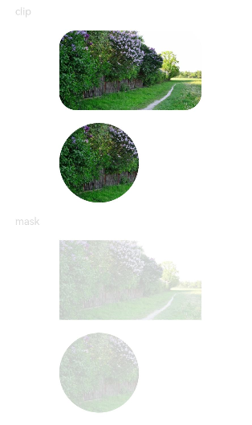
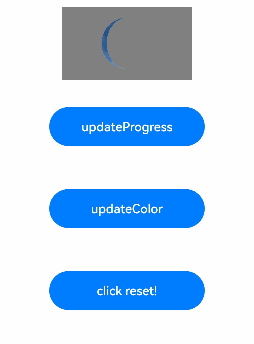

# Shape Clipping

Shape clipping changes the visible portion of a component through clipping or masking.

>  **NOTE**
>
> The APIs of this module are supported since API version 7. Updates will be marked with a superscript to indicate their earliest API version.

## clip<sup>12+</sup>

clip(value: boolean)

Sets whether to clip the areas of child components that extend beyond this component's boundaries, that is, whether to perform clipping based on the edge contour of the parent container

**System capability**: SystemCapability.ArkUI.ArkUI.Full

**Widget capability**: This API can be used in ArkTS widgets since API version 12.

**Atomic service API**: This API can be used in atomic services since API version 12.

**Parameters**

| Name| Type   | Mandatory| Description                                                        |
| ------ | ------- | ---- | ------------------------------------------------------------ |
| value  | boolean | Yes  | Whether to perform clipping based on the edge contour of the parent container.<br>Default value: **false**<br>**NOTE**<br>If this parameter is set to **true**, child components exceeding the current component's bounds will not respond to bound gesture events.|

## clip<sup>16+</sup>

clip(clip: Optional\<boolean>)

Sets whether to clip the areas of child components that extend beyond this component's boundaries, that is, whether to perform clipping based on the edge contour of the parent container Compared to [clip<sup>12+</sup>](#clip12), the **clip** parameter supports the **undefined** type.

**System capability**: SystemCapability.ArkUI.ArkUI.Full

**Widget capability**: This API can be used in ArkTS widgets since API version 16.

**Atomic service API**: This API can be used in atomic services since API version 16.

**Parameters**

| Name| Type              | Mandatory                                                        | Description|
| ------ | ------------------ | ------------------------------------------------------------ | ---- |
| clip   | Optional\<boolean> | Whether to perform clipping based on the edge contour of the parent container.<br>Default value: **false**<br>**NOTE**<br>If this parameter is set to **true**, child components exceeding the current component's bounds will not respond to bound gesture events.<br>If **clip** is set to **undefined**, clipping is disabled, and child components are not clipped.|      |

## clip<sup>(deprecated)</sup>

clip(value: boolean | CircleAttribute | EllipseAttribute | PathAttribute | RectAttribute)

Sets whether to clip this component based on the given shape.

> **NOTE** 
>
> This API is supported since API version 7 and deprecated since API version 12. You are advised to use [clip](#clip12) and [clipShape](#clipshape12) instead.

**Widget capability**: This API can be used in ArkTS widgets since API version 9.

**System capability**: SystemCapability.ArkUI.ArkUI.Full

**Parameters**

| Name| Type                                                        | Mandatory| Description                                                        |
| ------ | ------------------------------------------------------------ | ---- | ------------------------------------------------------------ |
| value  | boolean \| [CircleAttribute](ts-drawing-components-circle.md) \| [EllipseAttribute](ts-drawing-components-ellipse.md) \| [PathAttribute](ts-drawing-components-path.md) \| [RectAttribute](ts-drawing-components-rect.md) | Yes  | Clip mode. If the value is a shape attribute, the component is clipped based on the specified shape. If the value is of the Boolean type, it specifies whether to clip the component based on the boundaries of the parent container.<br>Default value: **false**<br>**NOTE**<br>If the value is a shape attribute, the clipped area can still respond to bound gesture events. If the value is of the Boolean type, the clipped area will not respond to bound gesture events.|

## clipShape<sup>12+</sup>

clipShape(value: CircleShape | EllipseShape | PathShape | RectShape)

Clips this component based on the given shape.

**System capability**: SystemCapability.ArkUI.ArkUI.Full

**Widget capability**: This API can be used in ArkTS widgets since API version 12.

**Atomic service API**: This API can be used in atomic services since API version 12.

**Parameters**

| Name| Type                                                        | Mandatory| Description                                                        |
| ------ | ------------------------------------------------------------ | ---- | ------------------------------------------------------------ |
| value  | [CircleShape](../js-apis-arkui-shape.md#circleshape) \| [EllipseShape](../js-apis-arkui-shape.md#ellipseshape) \| [PathShape](../js-apis-arkui-shape.md#pathshape) \| [RectShape](../js-apis-arkui-shape.md#rectshape) | Yes  | Shape that the component to be clipped into.<br>**NOTE**<br>The clipped area remains responsive to bound gesture events.|

## clipShape<sup>16+</sup>

clipShape(shape: Optional\<CircleShape | EllipseShape | PathShape | RectShape>)

Sets whether to clip this component based on the given shape. Compared to [clipShape<sup>12+</sup>](#clipshape12), the **shape** parameter supports the **undefined** type.

**System capability**: SystemCapability.ArkUI.ArkUI.Full

**Widget capability**: This API can be used in ArkTS widgets since API version 16.

**Atomic service API**: This API can be used in atomic services since API version 16.

**Parameters**

| Name| Type                                                        | Mandatory| Description                                                        |
| ------ | ------------------------------------------------------------ | ---- | ------------------------------------------------------------ |
| shape  | Optional\<[CircleShape](../js-apis-arkui-shape.md#circleshape) \| [EllipseShape](../js-apis-arkui-shape.md#ellipseshape) \| [PathShape](../js-apis-arkui-shape.md#pathshape) \| [RectShape](../js-apis-arkui-shape.md#rectshape)> | Yes  | Shape that the component to be clipped into.<br>**NOTE**<br>The clipped area remains responsive to bound gesture events.<br>If **shape** is set to **undefined**, the previous value is retained.|

## mask<sup>12+</sup>

mask(value: ProgressMask)

Adds a mask to the component to indicate the progress.

**System capability**: SystemCapability.ArkUI.ArkUI.Full

**Atomic service API**: This API can be used in atomic services since API version 12.

**Parameters**

| Name| Type                           | Mandatory| Description                                                |
| ------ | ------------------------------- | ---- | ---------------------------------------------------- |
| value  | [ProgressMask](#progressmask10) | Yes  | Mask to add to the component, which allows for dynamic adjustment of progress, maximum value, and color settings.|

## mask<sup>16+</sup>

mask(mask: Optional\<ProgressMask>)

Adds a mask to the component to indicate the progress. Compared to [mask<sup>12+</sup>](#mask12), the **mask** parameter supports the **undefined** type.

**System capability**: SystemCapability.ArkUI.ArkUI.Full

**Atomic service API**: This API can be used in atomic services since API version 16.

**Parameters**

| Name| Type                                                        | Mandatory| Description                            |
| ------ | ------------------------------------------------------------ | ---- | -------------------------------- |
| mask | Optional\<[ProgressMask](#progressmask10)> | Mask to add to the component, which allows for dynamic adjustment of progress, maximum value, and color settings.<br>If **mask** is set to **undefined**, the component to revert to its original effect without the mask to indicate the progress.|      |

## mask<sup>(deprecated)</sup>

mask(value: CircleAttribute | EllipseAttribute | PathAttribute | RectAttribute | ProgressMask)

Adds a mask of the specified shape to the component.

> **NOTE** 
>
> This API is supported since API version 7 and deprecated since API version 12. You are advised to use [mask](#mask12) and [maskShape](#maskshape12) instead.

**Widget capability**: This API can be used in ArkTS widgets since API version 9.

**System capability**: SystemCapability.ArkUI.ArkUI.Full

**Parameters**

| Name| Type                                                        | Mandatory| Description                            |
| ------ | ------------------------------------------------------------ | ---- | -------------------------------- |
| value  | [CircleAttribute](ts-drawing-components-circle.md) \| [EllipseAttribute](ts-drawing-components-ellipse.md) \| [PathAttribute](ts-drawing-components-path.md) \| [RectAttribute](ts-drawing-components-rect.md) \| [ProgressMask](#progressmask10)<sup>10+</sup> | Yes  | Mask of the specified shape to add to the component.|

## maskShape<sup>12+</sup>

maskShape(value: CircleShape | EllipseShape | PathShape | RectShape)

Adds a mask of the specified shape to the component.

**System capability**: SystemCapability.ArkUI.ArkUI.Full

**Widget capability**: This API can be used in ArkTS widgets since API version 12.

**Atomic service API**: This API can be used in atomic services since API version 12.

**Parameters**

| Name| Type                                                        | Mandatory| Description                            |
| ------ | ------------------------------------------------------------ | ---- | -------------------------------- |
| value  | [CircleShape](../js-apis-arkui-shape.md#circleshape) \| [EllipseShape](../js-apis-arkui-shape.md#ellipseshape) \| [PathShape](../js-apis-arkui-shape.md#pathshape) \| [RectShape](../js-apis-arkui-shape.md#rectshape) | Yes  | Mask of the specified shape to add to the component.|

## maskShape<sup>16+</sup>

maskShape(shape: Optional\<CircleShape | EllipseShape | PathShape | RectShape>)

Adds a mask of the specified shape to the component. Compared to [maskShape<sup>12+</sup>](#maskshape12), the **shape** parameter supports the **undefined** type.

**System capability**: SystemCapability.ArkUI.ArkUI.Full

**Widget capability**: This API can be used in ArkTS widgets since API version 16.

**Atomic service API**: This API can be used in atomic services since API version 16.

**Parameters**

| Name| Type                                                        | Mandatory| Description                                                        |
| ------ | ------------------------------------------------------------ | ---- | ------------------------------------------------------------ |
| shape  | Optional\<[CircleShape](../js-apis-arkui-shape.md#circleshape) \| [EllipseShape](../js-apis-arkui-shape.md#ellipseshape) \| [PathShape](../js-apis-arkui-shape.md#pathshape) \| [RectShape](../js-apis-arkui-shape.md#rectshape)> | Yes  | Mask of the specified shape to add to the component.<br>If **shape** is set to **undefined**, the previous value is retained.|

## ProgressMask<sup>10+</sup>

Implements a **ProgressMask** object to set the progress, maximum value, and color of the mask.

**Atomic service API**: This API can be used in atomic services since API version 11.

**System capability**: SystemCapability.ArkUI.ArkUI.Full

### constructor<sup>10+</sup>

constructor(value: number, total: number, color: ResourceColor)

Constructs a **ProgressMask** object.

**Atomic service API**: This API can be used in atomic services since API version 11.

**System capability**: SystemCapability.ArkUI.ArkUI.Full

**Parameters**

| Name| Type                                  | Mandatory| Description          |
| ------ | ------------------------------------------ | ---- | ------------------ |
| value  | number                                     | Yes  | Current value of the progress mask.|
| total  | number                                     | Yes  | Maximum value of the progress mask.|
| color  | [ResourceColor](ts-types.md#resourcecolor) | Yes  | Color of the progress mask.  |

### updateProgress<sup>10+</sup>

updateProgress(value: number): void

Updates the progress value of the progress mask.

**Atomic service API**: This API can be used in atomic services since API version 11.

**System capability**: SystemCapability.ArkUI.ArkUI.Full

**Parameters**

| Name| Type| Mandatory| Description          |
| ------ | -------- | ---- | ------------------ |
| value  | number   | Yes  | Current value of the progress mask.|

### updateColor<sup>10+</sup>

updateColor(value: ResourceColor): void

Updates the color of the progress mask.

**Atomic service API**: This API can be used in atomic services since API version 11.

**System capability**: SystemCapability.ArkUI.ArkUI.Full

**Parameters**

| Name| Type                                  | Mandatory| Description        |
| ------ | ------------------------------------------ | ---- | ---------------- |
| value  | [ResourceColor](ts-types.md#resourcecolor) | Yes  | Color of the progress mask.|

### enableBreathingAnimation<sup>12+</sup>

enableBreathingAnimation(value: boolean): void

Sets whether to enable the breathing animation when the progress indicator is full. By default, the breathing animation is disabled.

**Atomic service API**: This API can be used in atomic services since API version 12.

**System capability**: SystemCapability.ArkUI.ArkUI.Full

**Parameters**

| Name| Type                                  | Mandatory| Description        |
| ------ | ------------------------------------------ | ---- | ---------------- |
| value  | boolean | Yes  | Whether to enable the breathing animation. The value **true** means to enable the breathing animation, and **false** means the opposite. Default value: **false**|


## Example

### Example 1: Using Different Clipping Attributes

```ts
// xxx.ets
@Entry
@Component
struct ClipAndMaskExample {
  build() {
    Column({ space: 15 }) {
      Text('clip').fontSize(12).width('75%').fontColor('#DCDCDC')
      Row() {
        Image($r('app.media.testImg')).width('500px').height('280px')
      }
      .clip(true) // If clip is not set to true, the image is not confined by the rounded corners of the <Row> component and may extend beyond the <Row> component.
      .borderRadius(20)
      // Clip the image based on a circle with a diameter of 280 px.
      Image($r('app.media.testImg'))
        .clipShape(new Circle({ width: '280px', height: '280px' }))
        .width('500px').height('280px')

      Text('mask').fontSize(12).width('75%').fontColor('#DCDCDC')
      // Add a 500 px x 280 px square mask to the image.
      Image($r('app.media.testImg'))
        .maskShape(new Rect({ width: '500px', height: '280px' }).fill(Color.Gray))
        .width('500px').height('280px')

      // Add a 280 px x 280 px circular mask to the image.
      Image($r('app.media.testImg'))
        .maskShape(new Circle({ width: '280px', height: '280px' }).fill(Color.Gray))
        .width('500px').height('280px')
    }
    .width('100%')
    .margin({ top: 15 })
  }
}
```



### Example 2: Clipping and Masking with Animation

```ts
@Entry
@Component
struct ProgressMaskExample {
  @State progressflag1: boolean = true;
  @State color: Color = 0x01006CDE;
  @State value: number = 10.0;
  @State enableBreathingAnimation: boolean = false;
  @State progress: ProgressMask = new ProgressMask(10.0, 100.0, Color.Gray);
  build() {
    Column({ space: 15 }) {
      Text('progress mask').fontSize(12).width('75%').fontColor('#DCDCDC')
      // Add a 280 px x 280 px progress mask to the image.
      Image($r('app.media.testImg'))
        .width('500px').height('280px')
        .mask(this.progress)
        .animation({
          duration: 2000, // Animation duration.
          .curve(Curve.Linear) // Animation curve.
          delay: 0, // Animation delay.
          iterations: 1, // Number of playback times.
          playMode: PlayMode.Normal // Animation playback mode.
        }) // Animation configuration for the width and height attributes of the <Button> component.

      // Update the progress value of the progress mask.
      Button('updateProgress')
        .onClick((event?: ClickEvent) => {
          this.value += 10;
          this.progress.updateProgress(this.value);
        }).width(200).height(50).margin(20)

      // Update the color of the progress mask.
      Button('updateColor')
        .onClick((event?: ClickEvent) => {
          if (this.progressflag1) {
            this.progress.updateColor(0x9fff0000);
          } else {
            this.progress.updateColor(0x9f0000ff);
          }
          this.progressflag1 = !this.progressflag1
        }).width(200).height(50).margin(20)
      
      // Enable or disable the breathing animation.
      Button('enableBreathingAnimation:' + this.enableBreathingAnimation)
        .onClick((event?: ClickEvent) => {
          this.enableBreathingAnimation = !this.enableBreathingAnimation
          this.progress.enableBreathingAnimation(this.enableBreathingAnimation);
        }).width(200).height(50).margin(20)

      // Restore the progress mask.
      Button('click reset!')
        .onClick((event?: ClickEvent) => {
          this.value = 0;
          this.progress.updateProgress(this.value);
        }).width(200).height(50).margin(20)
    }
    .width('100%')
    .margin({ top: 15 })
  }
}
```


