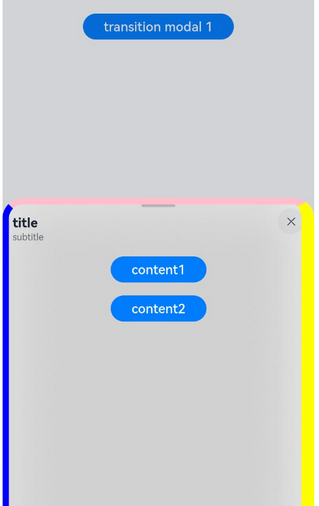
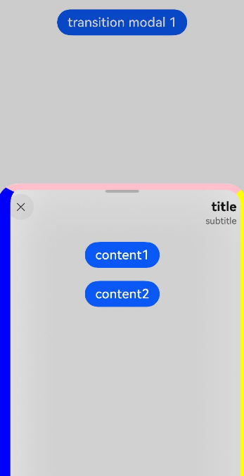

# Sheet Transition

You can bind a sheet to a component through the **bindSheet** attribute. You can also set the sheet to the preset or custom height for when the component is inserted.

>  **NOTE**
>
>  This feature is supported since API version 10. Updates will be marked with a superscript to indicate their earliest API version.
>
>  Route hopping is not supported.

## bindSheet

bindSheet(isShow: Optional\<boolean\>, builder: CustomBuilder, options?: SheetOptions)

Binds a sheet to the component, which is displayed when the component is touched.

**Atomic service API**: This API can be used in atomic services since API version 11.

**System capability**: SystemCapability.ArkUI.ArkUI.Full

**Parameters** 

| Name | Type                                       | Mandatory | Description                                                        |
| ------- | ------------------------------------------- | ---- | ------------------------------------------------------------ |
| isShow  | Optional\<boolean\>                          | Yes  | Whether to display the sheet.<br>Since API version 10, this parameter supports two-way binding through [$$](../../../quick-start/arkts-two-way-sync.md). |
| builder | [CustomBuilder](ts-types.md#custombuilder8) | Yes  | Content of the sheet.                                        |
| options | [SheetOptions](#sheetoptions)               | No  | Optional attributes of the sheet.                                  |

> **NOTE**
>
> 1. When no two-way binding is set up for the **isShow** parameter, closing the sheet by dragging does not change the parameter value.
>
> 2. To synchronize the value of the **isShow** parameter with the sheet UI state, set up a two-way binding for **isShow** through [$$](../../../quick-start/arkts-two-way-sync.md).
>
> 3. In scenarios where a sheet with a single detent is dragged upwards or a sheet with multiple detents is shifted to another detent by swiping up, the display area is updated after the drag ends or the shift is completed.
>
> 4. A sheet is a popup that is strictly bound to its host node. To achieve an effect where the sheet appears the moment the page is displayed, ensure that the host node is mounted in the view hierarchy. If the host node is not yet mounted when **isShow** is set to **true**, the sheet will not be displayed. You are advised to use the [onAppear](ts-universal-events-show-hide.md#onappear) to ensure that the sheet is shown after the host node is mounted.
> When [SheetMode](#sheetmode12) is set to **EMBEDDED**, in addition to the host node, also ensure that the corresponding page node is successfully mounted.
>
> 5. The exit animation of the sheet does not support interruption, and the sheet cannot respond to other gestures during the execution. The current exit animation uses a [spring curve](../../../ui/arkts-spring-curve.md), which has a subtle trailing effect that is not visually prominent. Therefore, when the sheet exits, although it may appear to have disappeared, the animation might not have fully finished, and attempting to initiate the sheet again by a touch will not work. You must wait for the animation to fully complete before you can initiate the sheet again.
>
## SheetOptions

Inherits from [BindOptions](#bindoptions).

| Name             | Type                                      | Mandatory  | Description             |
| --------------- | ---------------------------------------- | ---- | --------------- |
| height          | [SheetSize](#sheetsize) \| [Length](ts-types.md#length) | No   | Height of the sheet.<br>Default value: **LARGE**<br>**NOTE**<br>In versions earlier than API version 12, this attribute is ineffective for a bottom sheet in landscape mode; the height is fixed at 8 vp from the top of the screen.<br>Since API version 12, this attribute takes effect for a bottom sheet in landscape mode; the maximum height is 8 vp from the top of the screen.<br>When a bottom sheet has **detents** set, this attribute is ineffective.<br>For a bottom sheet in portrait mode, the maximum height is 8 vp from the status bar.<br>For center and popup sheets set to **SheetSize.LARGE** or **SheetSize.MEDIUM**, this attribute is ineffective, with the default height being 560 vp. For center and popup sheets, the minimum height is 320 vp, and the maximum height is 90% of the shorter edge of the window. If the height specified by **Length** and the height adaptively set with **SheetSize.FIT_CONTENT** exceed the maximum height, the maximum height is used instead. If they are less than the minimum height, the minimum height is used instead.<br>**Atomic service API**: This API can be used in atomic services since API version 11. |
| detents<sup>11+</sup> | [([SheetSize](#sheetsize) \| [Length](ts-types.md#length)), ( [SheetSize](#sheetsize) \| [Length](ts-types.md#length))?, ([SheetSize](#sheetsize) \| [Length](ts-types.md#length))?] | No | Array of heights where the sheet can rest.<br>**NOTE**<br>Since API version 12, this attribute takes effect for a bottom sheet in landscape mode.<br>In earlier versions, this attribute takes effect only for the bottom sheet in portrait mode. The first height in the tuple is the initial height.<br>The sheet can switch between heights by dragging. After the sheet is dragged and released, it switches to the target height or remains at the current height, depending on the velocity and distance.<br> If the velocity exceeds the threshold, the sheet switches to the target height in the same direction as the velocity. If the velocity is less than the threshold, the displacement distance is used for judgement. If the displacement distance is greater than 1/2 of the distance between the current and target positions, the sheet switches to the target height in the same direction as the velocity; otherwise, the sheet remains at the current height.<br> Velocity threshold: 1000; Distance threshold: 50%.<br>**Atomic service API**: This API can be used in atomic services since API version 12. |
| preferType<sup>11+</sup> | [SheetType](#sheettype11) | No | Type of the sheet.<br>**Atomic service API**: This API can be used in atomic services since API version 12. |
| showClose<sup>11+</sup> | boolean \| [Resource](ts-types.md#resource) | No | Whether to display the close icon. By default, the icon is displayed.<br>**NOTE**<br>The value of **Resource** must be of the Boolean type.<br>**Atomic service API**: This API can be used in atomic services since API version 12. |
| dragBar         | boolean                                  | No   | Whether to display the drag bar.<br>**NOTE**<br>By default, the drag bar is displayed only when the sheet's **detents** attribute is set to multiple heights and the settings take effect.  <br>**Atomic service API**: This API can be used in atomic services since API version 11. |
| blurStyle<sup>11+</sup> | [BlurStyle](ts-universal-attributes-background.md#blurstyle9) | No | Background blur of the sheet. By default, there is no background blur.<br>**Atomic service API**: This API can be used in atomic services since API version 12. |
| maskColor | [ResourceColor](ts-types.md#resourcecolor) | No | Mask color of the sheet.<br>**Atomic service API**: This API can be used in atomic services since API version 11. |
| title<sup>11+</sup> | [SheetTitleOptions](#sheettitleoptions11) \| [CustomBuilder](ts-types.md#custombuilder8) | No | Title of the sheet.<br>**Atomic service API**: This API can be used in atomic services since API version 12. |
| enableOutsideInteractive<sup>11+</sup> | boolean | No | Whether to allow users to interact with the page pertaining to the sheet.<br>**NOTE**<br>The value **true** means that interactions are allowed, in which case no mask is not displayed. The value **false** means that interactions are not allowed, in which case a mask is displayed. If this parameter is not set, interactions are allowed for the popup sheet, but not for bottom and center sheets. If this parameter is set to **true**, the setting of **maskColor** does not take effect.<br>**Atomic service API**: This API can be used in atomic services since API version 12. |
| shouldDismiss<sup>11+</sup> | (sheetDismiss: [SheetDismiss](#sheetdismiss11)) => void | No | Callback invoked when the user attempts to dismiss the sheet.<br>**NOTE**<br>When the user attempts to dismiss the sheet by a pull-down gesture or clicking the back button, the mask, or the close icon, the sheet is not dismissed; instead, the callback is executed.<br>**Atomic service API**: This API can be used in atomic services since API version 12. |
| onWillDismiss<sup>12+</sup> | [DismissSheetAction](#dismisssheetaction12) | No   | Callback invoked when the user attempts to dismiss the sheet.<br>**NOTE**<br>If this callback is registered, when the user attempts to dismiss the sheet, the sheet is not dismissed immediately; instead, this callback is executed, and you can control whether to dismiss the sheet based on [reason](ts-appendix-enums.md#dismissreason12) in the callback. No further interception with **onWillDismiss** is allowed in an **onWillDismiss** callback. **Atomic service API**: This API can be used in atomic services since API version 12.|
| onWillSpringBackWhenDismiss<sup>12+</sup> | [SpringBackAction](#springbackaction12) | No   | Callback to control the interactive spring back before the sheet is dismissed.<br>**NOTE**<br>When a user performs a pull-down-to-dismiss gesture and either **shouldDismiss** or **onWillDismiss** is registered, the sheet will not spring back automatically if this callback is registered. You can then control whether the sheet should spring back through **springBack** in the callback. **Atomic service API**: This API can be used in atomic services since API version 12. |
| onHeightDidChange<sup>12+</sup> | Callback&lt;number&gt; | No | Callback for changes in the height of the sheet.<br>**NOTE**<br>For a bottom sheet, the height of each frame is only returned when there are changes in detents or during drag actions. When the sheet is pulled up or making space for the soft keyboard, only the final height is returned. For other types of sheets, the final height is only returned when the sheet is pulled up.<br>The return value is in px.<br>**Atomic service API**: This API can be used in atomic services since API version 12.|
| onDetentsDidChange<sup>12+</sup> | Callback&lt;number&gt; | No | Callback for changes in the detents of the sheet.<br>**NOTE**<br>For a bottom sheet, the final height is returned when there are changes in detents.<br>The return value is in px.<br>**Atomic service API**: This API can be used in atomic services since API version 12.|
| onWidthDidChange<sup>12+</sup> | Callback&lt;number&gt; | No | Callback for changes in the width of the sheet.<br>**NOTE**<br>The final height is returned when there are changes in the width.<br>The return value is in px.<br>**Atomic service API**: This API can be used in atomic services since API version 12.|
| onTypeDidChange<sup>12+</sup> | Callback&lt;[SheetType](#sheettype11)&gt; | No | Callback for changes in the type of the sheet.<br>**NOTE**<br>The final type is returned when there are changes in the type.<br>**Atomic service API**: This API can be used in atomic services since API version 12.|
| borderWidth<sup>12+</sup> | [Dimension](ts-types.md#dimension10) \| [EdgeWidths](ts-types.md#edgewidths9) \| [LocalizedEdgeWidths](ts-types.md#localizededgewidths12)<sup>12+</sup>  | No | Border width of the sheet.<br>You can set the width for all four sides or set separate widths for individual sides.<br>Default value: **0**<br> Percentage parameter method: Set the border width of the sheet as a percentage of the width of the parent element.<br>If the left and right border widths of the sheet are greater than the width of the sheet, and the top and bottom border widths are greater than the height of the sheet, the display may not appear as expected.<br>**NOTE**<br>For bottom sheets, the bottom border width setting is ineffective.<br>**Atomic service API**: This API can be used in atomic services since API version 12.|
| borderColor<sup>12+</sup> | [ResourceColor](ts-types.md#resourcecolor) \| [EdgeColors](ts-types.md#edgecolors9) \| [LocalizedEdgeColors](ts-types.md#localizededgecolors12)<sup>12+</sup>  | No | Border color of the sheet.<br>Default value: **Color.Black**<br> **borderColor** must be used with **borderWidth** in pairs.<br>**NOTE**<br>For bottom sheets, the bottom border color setting is ineffective.<br>**Atomic service API**: This API can be used in atomic services since API version 12.|
| borderStyle<sup>12+</sup> | [BorderStyle](ts-appendix-enums.md#borderstyle) \| [EdgeStyles](ts-types.md#edgestyles9)  | No | Border style of the sheet.<br>Default value: **BorderStyle.Solid**<br> **borderStyle** must be used with **borderWidth** in pairs.<br>**NOTE**<br>For bottom sheets, the bottom border style setting is ineffective.<br>**Atomic service API**: This API can be used in atomic services since API version 12.|
| width<sup>12+</sup> | [Dimension](ts-types.md#dimension10)   | No | Width of the sheet.<br> Percentage parameter method: Set the width of the sheet as a percentage of the width of the parent element. <br>**Atomic service API**: This API can be used in atomic services since API version 12.|
| shadow<sup>12+</sup> | [ShadowOptions](ts-universal-attributes-image-effect.md#shadowoptions) \| [ShadowStyle](ts-universal-attributes-image-effect.md#shadowstyle10)   | No | Shadow of the sheet.<br>**Atomic service API**: This API can be used in atomic services since API version 12.|
| uiContext<sup>12+</sup> | [UIContext](../js-apis-arkui-UIContext.md#uicontext)   | No | **UIContext** instance corresponding to the window where the sheet is displayed.<br>**NOTE**<br>The sheet launched with [openBindSheet](../js-apis-arkui-UIContext.md#openbindsheet12) does not support setting or updating this attribute.<br>**Atomic service API**: This API can be used in atomic services since API version 12.|
| mode<sup>12+</sup> | [SheetMode](#sheetmode12)   | No | Display mode of the sheet.<br>Default value: **SheetMode.OVERLAY**<br>**NOTE**<br> 1. During the display of the sheet, the **mode** attribute does not support dynamic changes. The display hierarchy of the two modes is entirely different, making it impossible to switch a sheet from one mode to another while it is being displayed. You are advised to clearly define and fix the **mode** value to ensure consistency in the display hierarchy.<br> 2. The **UIContext** attribute cannot be set when **SheetMode.EMBEDDED** is set, as their corresponding sheet display hierarchy effects are mutually conflicting.<br>3. For a sheet launched with [openBindSheet](../js-apis-arkui-UIContext.md#openbindsheet12), if a valid target ID is not provided, **SheetMode.EMBEDDED** cannot be set, and the default value **SheetMode.OVERLAY** is used.<br>**Atomic service API**: This API can be used in atomic services since API version 12.|
| scrollSizeMode<sup>12+</sup> | [ScrollSizeMode](#scrollsizemode12)   | No | Timing for updating the content display area of the sheet when it is scrolled.<br>Default value: **ScrollSizeMode.FOLLOW_DETENT**|

## SheetSize

| Name                     | Value   | Description                        |
| ------------------------- | ---- | -------------------------------- |
| MEDIUM                    | 0    | The sheet height is half of the screen height.<br>**Atomic service API**: This API can be used in atomic services since API version 11.  |
| LARGE                     | 1    | The sheet height is almost the screen height.<br>**Atomic service API**: This API can be used in atomic services since API version 11.  |
| FIT_CONTENT<sup>11+</sup> | 2    | The sheet height automatically adapts to the content.<br>**Atomic service API**: This API can be used in atomic services since API version 12. |

## BindOptions

| Name           | Type                                      | Mandatory | Description                    |
| --------------- | ------------------------------------------ | ---- | ------------------------ |
| backgroundColor | [ResourceColor](ts-types.md#resourcecolor) | No  | Background color of the sheet.<br>Default value: **Color.White**<br>**Atomic service API**: This API can be used in atomic services since API version 11. |
| onWillAppear<sup>12+</sup>        | () => void                                 | No  | Callback for when the sheet is about to be displayed (before the animation starts). **Atomic service API**: This API can be used in atomic services since API version 12. |
| onAppear        | () => void                                 | No  | Callback for when the sheet is displayed (after the animation ends).<br>**Atomic service API**: This API can be used in atomic services since API version 11. |
| onWillDisappear<sup>12+</sup>     | () => void                                 | No  | Callback for when the sheet is about to disappear (before the animation starts).<br>**NOTE**<br>Modifying state variables within the **onWillDisappear** function is not allowed, as it may lead to unstable component behavior. **Atomic service API**: This API can be used in atomic services since API version 12. |
| onDisappear     | () => void                                 | No  | Callback for when the sheet disappears (after the animation ends).<br>**Atomic service API**: This API can be used in atomic services since API version 11. |

## SheetType<sup>11+</sup>

**Atomic service API**: This API can be used in atomic services since API version 12.

| Name  | Value  | Description                                              |
| ------ | ---- | ------------------------------------------------------ |
| BOTTOM | 0    | Bottom sheet.                                            |
| CENTER | 1    | Center sheet.                                            |
| POPUP  | 2    | Popup sheet. The popup sheet cannot be dismissed with a pull-down gesture. |

## SheetDismiss<sup>11+</sup>

**Atomic service API**: This API can be used in atomic services since API version 12.

| Name   | Type      | Mandatory | Description                                                        |
| ------- | ---------- | ---- | ------------------------------------------------------------ |
| dismiss | () => void | Yes  | Callback for dismissing the sheet. Call this API only when you need the sheet to exit. |

## SheetTitleOptions<sup>11+</sup>

**Atomic service API**: This API can be used in atomic services since API version 12.

| Name    | Type                                  | Mandatory | Description                |
| -------- | -------------------------------------- | ---- | -------------------- |
| title    | [ResourceStr](ts-types.md#resourcestr) | Yes  | Main title of the sheet. |
| subtitle | [ResourceStr](ts-types.md#resourcestr) | No  | Subtitle of the sheet. |

## SheetMode<sup>12+</sup>

**Atomic service API**: This API can be used in atomic services since API version 12.

| Name                     | Value  | Description                        |
| ------------------------- | ---- | -------------------------------- |
| OVERLAY                   | 0    | The sheet is displayed at the top of the window corresponding to the current **UIContext** instance, above all pages. It is displayed at the same level as dialog boxes.  |
| EMBEDDED                  | 1    | The sheet is displayed at the top of the current page.<br>**NOTE**<br>Currently, the sheet can only be mounted on a **Page** or **NavDestination** node, with priority given to the **NavDestination** node if it is present. This means that, the sheet can only be displayed at the top of these two types of pages.<br> In this mode, new pages can overlay the sheet, and when the user returns to the previous page, the sheet remains present without losing its content.<br> In this mode, you must ensure that the target page node, such as the **Page** node, has been mounted to the tree before bringing up the sheet; otherwise, the sheet will not be able to be attached to the corresponding page node.|

## ScrollSizeMode<sup>12+</sup>
| Name          | Value  | Description                        |
| ------------------------- | ---- | -------------------------------- |
| FOLLOW_DETENT | 0    | The sheet updates the content display area after a swipe ends.  |
| CONTINUOUS    | 1    | The sheet continuously updates the content display area during the scroll process.|

## DismissSheetAction<sup>12+</sup>

**Atomic service API**: This API can be used in atomic services since API version 12.

| Name             | Type                                      | Mandatory  | Description           |
| --------------- | ---------------------------------------- | ---- | ------------- |
| dismiss | function | Yes   | Callback for dismissing the sheet. Call this API when you need to exit the page. |
| reason | [DismissReason](ts-appendix-enums.md#dismissreason12) | Yes   | Type of operation that causes the sheet to be dismissed. |

## SpringBackAction<sup>12+</sup>

| Name             | Type                                      | Mandatory  | Description           |
| --------------- | ---------------------------------------- | ---- | ------------- |
| springBack | function | Yes   | Callback to control the interactive spring back before the sheet is dismissed. |

## Example
### Example 1

```ts
// xxx.ets
@Entry
@Component
struct SheetTransitionExample {
  @State isShow:boolean = false
  @State isShow2:boolean = false
  @State sheetHeight:number = 300;

  @Builder myBuilder() {
    Column() {
      Button("change height")
        .margin(10)
        .fontSize(20)
        .onClick(()=>{
          this.sheetHeight = 500;
        })

      Button("Set Illegal height")
        .margin(10)
        .fontSize(20)
        .onClick(()=>{
          this.sheetHeight = -1;
        })

      Button("close modal 1")
        .margin(10)
        .fontSize(20)
        .onClick(()=>{
          this.isShow = false;
        })
    }
    .width('100%')
    .height('100%')
  }

  build() {
    Column() {
      Button("transition modal 1")
        .onClick(() => {
          this.isShow = true
        })
        .fontSize(20)
        .margin(10)
        .bindSheet($$this.isShow, this.myBuilder(), {
          height: this.sheetHeight, 
          backgroundColor: Color.Green,
          onWillAppear: () => {console.log("BindSheet onWillAppear.")}, 
          onAppear: () => {console.log("BindSheet onAppear.")}, 
          onWillDisappear: () => {console.log("BindSheet onWillDisappear.")}, 
          onDisappear: () => {console.log("BindSheet onDisappear.")}
        })
    }
    .justifyContent(FlexAlign.Center)
    .width('100%')
    .height('100%')
  }
}
```


### Example 2

```ts
// xxx.ets
@Entry
@Component
struct SheetTransitionExample {
  @State isShow:boolean = false
  @Builder myBuilder() {
    Column() {
      Button("content1")
        .margin(10)
        .fontSize(20)

      Button("content2")
        .margin(10)
        .fontSize(20)
    }
    .width('100%')
  }

  build() {
    Column() {
      Button("transition modal 1")
        .onClick(() => {
          this.isShow = true
        })
        .fontSize(20)
        .margin(10)
        .bindSheet($$this.isShow, this.myBuilder(),{
          detents:[SheetSize.MEDIUM,SheetSize.LARGE,200],
          backgroundColor:Color.Gray,
          blurStyle:BlurStyle.Thick,
          showClose:true,
          title:{title:"title", subtitle:"subtitle"},
          preferType: SheetType.CENTER,
          shouldDismiss:((sheetDismiss: SheetDismiss)=> {
            console.log("bind sheet shouldDismiss")
            sheetDismiss.dismiss()
          })
        })
    }
    .justifyContent(FlexAlign.Start)
    .width('100%')
    .height('100%')
  }
}
```


### Example 3

```ts
// xxx.ets
// The borderWidth and borderColor attributes of bindSheet use the LocalizedEdgeWidths type and LocalizedEdgeColors type, respectively.

import { LengthMetrics } from '@kit.ArkUI'

@Entry
@Component
struct SheetTransitionExample {
  @State isShow: boolean = false

  @Builder
  myBuilder() {
    Column() {
      Button("content1")
        .margin(10)
        .fontSize(20)

      Button("content2")
        .margin(10)
        .fontSize(20)
    }
    .width('100%')
  }

  build() {
    Column() {
      Button("transition modal 1")
        .onClick(() => {
          this.isShow = true
        })
        .fontSize(20)
        .margin(10)
        .bindSheet($$this.isShow, this.myBuilder(), {
          detents: [SheetSize.MEDIUM, SheetSize.LARGE, 200],
          backgroundColor: Color.Gray,
          blurStyle: BlurStyle.Thick,
          showClose: true,
          title: { title: "title", subtitle: "subtitle" },
          preferType: SheetType.CENTER,
          borderWidth: { top: LengthMetrics.vp(10), start: LengthMetrics.vp(10), end: LengthMetrics.vp(20) },
          borderColor: { top: Color.Pink, start: Color.Blue, end: Color.Yellow },
          shouldDismiss: ((sheetDismiss: SheetDismiss) => {
            console.log("bind sheet shouldDismiss")
            sheetDismiss.dismiss()
          })
        })
    }
    .justifyContent(FlexAlign.Start)
    .width('100%')
    .height('100%')
  }
}
```

The following shows how the example is represented with left-to-right scripts.



The following shows how the example is represented with right-to-left scripts.



### Example 4

```ts
// xxx.ets
// Registers onWillDismiss and onWillSpringBackWhenDismiss for bindSheet.

@Entry
@Component
struct bindSheetExample {
  @State isShow: Boolean = false;

  @Builder
  myBuilder() {
    Column() {
      Button() {
        Text("CONTEXT")
      }.height(50)
    }
  }

  build() {
    Column() {
      Button("NoRegisterSpringback")
        .onClick(() => {
          this.isShow = true
        })
        .fontSize(20)
        .margin(10)
        .bindSheet($$this.isShow, this.myBuilder(), {
          height: SheetSize.MEDIUM,
          blurStyle: BlurStyle.Thick,
          showClose: true,
          title: { title: "title", subtitle: "subtitle" },
          preferType: SheetType.CENTER,


          onWillDismiss: ((DismissSheetAction: DismissSheetAction) => {
            if (DismissSheetAction.reason == DismissReason.SLIDE_DOWN) {
              DismissSheetAction.dismiss() // Register the dismiss behavior.
            }
          }),

          onWillSpringBackWhenDismiss: ((SpringBackAction: SpringBackAction) => {
            // If springBack is not registered, the sheet will not exhibit a spring back effect when pulled down.
            //SpringBackAction.springBack()
          }),
        })
    }
  }
}
```

