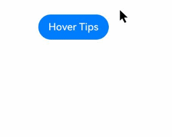
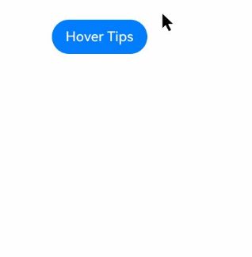

# Tooltip Control

You can bind a floating tooltip to a component. The tooltip is automatically displayed when the cursor hovers over the component and hidden when the cursor moves away.

>  **NOTE**
>
>  This API is supported since API version 18. Updates will be marked with a superscript to indicate their earliest API version.

## bindTips
bindTips(message: TipsMessageType, options: TipsOptions)

Binds a tooltip to the component.

> **NOTE**
>
> If the **enable** attribute of the bound component is set to **false**, the tooltip can still be displayed.

**Atomic service API**: This API can be used in atomic services since API version 18.

**System capability**: SystemCapability.ArkUI.ArkUI.Full

**Parameters**

| Name| Type                                                        | Mandatory| Description                                                        |
| ------ | ------------------------------------------------------------ | ---- | ------------------------------------------------------------ |
| message|  [TipsMessageType](#tipsmessagetype)                                                     | Yes  | Content of the tooltip message.|
| options  | [TipsOptions](#tipsoptions) | No  | Parameters of the tooltip.<br>Default value:<br>{<br>appearingTime:700,<br>disappearingTime:300,<br>appearingTimeWithContinuousOperation: 300,<br>disappearingTimeWithContinuousOperation:0, enableArrow:true,<br>arrowPointPosition:ArrowPointPosition.CENTER,<br>arrowWidth:16vp,arrowHeight:8vp<br>} |

## TipsOptions

Defines the parameters of the tooltip.

**Atomic service API**: This API can be used in atomic services since API version 18.

**System capability**: SystemCapability.ArkUI.ArkUI.Full

| Name                                 | Type                                                        | Mandatory| Description                                                     |
| ------------------------------------- | ------------------------------------------------------------ | ---- | ------------------------------------------------------------ |
| appearingTime         |           number   | No   |Delay before the tooltip appears.<br>Default value: **700**.<br>Unit: ms.|
| disappearingTime                 |   number   | No  | Delay before the tooltip disappears.<br>Default value: **300**.<br>Unit: ms.|
| appearingTimeWithContinuousOperation    |     number   | No  | Delay before the tooltip disappears when multiple tooltips are displayed consecutively.<br>Default value: **300**.<br>Unit: ms.|
| disappearingTimeWithContinuousOperation |     number   | No  | Delay before the tooltip disappears when multiple tooltips are displayed consecutively.<br>Default value: **0**.<br>Unit: ms.|
| enableArrow        | boolean                                                      | No  | Whether to display the tooltip arrow.<br>Default value: **true**.<br>**NOTE**<br>If the available space on the screen is insufficient, the tooltip will cover part of the component and the arrow will not be displayed.|
| arrowPointPosition     | [ArrowPointPosition](ts-appendix-enums.md#arrowpointposition11) | No  | Position of the tooltip arrow relative to its parent component. Available positions are **Start**, **Center**, and **End**, in both vertical and horizontal directions. All these positions are within the parent component area.|
| arrowWidth           | [Dimension](ts-types.md#dimension10)                  | No  | Width of the tooltip arrow. If the arrow width exceeds the length of the edge minus twice the size of the tooltip rounded corner, the arrow is not drawn.<br>Default value: **16**.<br>Unit: vp.<br>**NOTE**<br>Percentage values are not supported.|
| arrowHeight          | [Dimension](ts-types.md#dimension10)                  | No  | Height of the tooltip arrow.<br>Default value: **8**.<br>Unit: vp.<br>**NOTE**<br>Percentage values are not supported.|

## TipsMessageType

TipsMessageType = ResourceStr | StyledString

Provides information about the tooltip.

**Atomic service API**: This API can be used in atomic services since API version 18.

**System capability**: SystemCapability.ArkUI.ArkUI.Full

| Type                                                      | Description                                          |
| ---------------------------------------------------------- | ---------------------------------------------- |
| [ResourceStr](ts-types.md#resourcestr)                     | Type used to represent the types that can be used by input parameters of the string type.|
| [StyledString](ts-universal-styled-string.md#styledstring) | Styled string.                                  |

## Example

### Example 1: Binding a Tooltip

This example shows how to bind a tooltip to a button using **bindTooltip**.

```ts
// xxx.ets
@Entry
@Component
struct TipsExample {
  build() {
    Flex({ direction: FlexDirection.Column }) {
      Button('Hover Tips')
        .bindTips("test Tips", {
          appearingTime: 700,
          disappearingTime: 300,
          appearingTimeWithContinuousOperation: 300,
          disappearingTimeWithContinuousOperation: 0,
          enableArrow:true,
        })
        .position({ x: 100, y: 250 })
    }.width('100%').padding({ top: 5 })
  }
}
```



### Example 2: Displaying and Hiding Multiple Tooltips

This example demonstrates how to configure multiple tooltips to appear and disappear in sequence using **bindTips**.

```ts
// xxx.ets

@Entry
@Component
struct TipsExample {
  build() {
    Flex({ direction: FlexDirection.Column }) {
      Button('Hover Tips')
        .bindTips("test Tips", {
          appearingTime: 700,
          disappearingTime: 300,
          appearingTimeWithContinuousOperation: 300,
          disappearingTimeWithContinuousOperation: 0,
          enableArrow:true,
        })
        .position({ x: 100, y: 250 })

      Button('Hover Tips')
        .bindTips("test Tips", {
          appearingTime: 700,
          disappearingTime: 300,
          appearingTimeWithContinuousOperation: 300,
          disappearingTimeWithContinuousOperation: 0,
          enableArrow:true,
        })
        .position({ x: 100, y: 350 })


    }.width('100%').padding({ top: 5 })
  }
}
```


