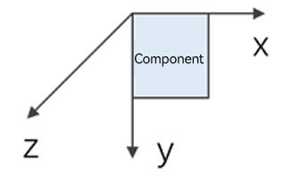
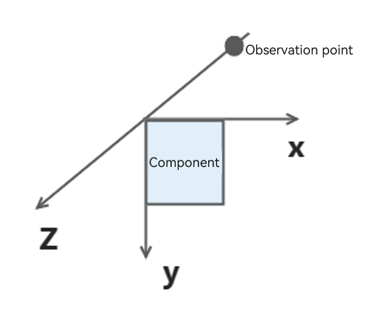

# Transformation

Transformation attributes allow you to rotate, translate, scale, or transform a component.

> **NOTE**
>
> The APIs of this module are supported since API version 7. Updates will be marked with a superscript to indicate their earliest API version.

## rotate

rotate(value: RotateOptions)

Rotates the component.

**Widget capability**: Since API version 9, this feature is supported in ArkTS widgets.

**Atomic service API**: This API can be used in atomic services since API version 11.

**System capability**: SystemCapability.ArkUI.ArkUI.Full

**Parameters**

| Name| Type                                   | Mandatory| Description                                                        |
| ------ | --------------------------------------- | ---- | ------------------------------------------------------------ |
| value  | [RotateOptions](#rotateoptions) | Yes  | How the component rotates in the coordinate system (as shown below) with the upper left corner of the component as the coordinate origin. (x, y, z) specifies a vector as the axis of rotation.<br>The axis and center of rotation are set based on the coordinate system, which remains where it is when the component is moved.<br>Default value:<br>{<br>x: 0,<br>y: 0,<br>z: 0,<br>centerX: '50%',<br>centerY: '50%'<br>centerZ: 0,<br>perspective: 0<br>}<br><br>Since API version 10, **CenterZ** and **perspective** are supported in ArkTS widgets.|

## translate

translate(value: TranslateOptions)

Translates the component.

**Widget capability**: Since API version 9, this feature is supported in ArkTS widgets.

**System capability**: SystemCapability.ArkUI.ArkUI.Full

**Parameters**

| Name| Type                                         | Mandatory| Description                                                        |
| ------ | --------------------------------------------- | ---- | ------------------------------------------------------------ |
| value  | [TranslateOptions](#translateoptions) | Yes  | How the component is translated in the coordinate system (as shown below) with the upper left corner of the component as the coordinate origin. Values of **x**, **y**, and **z** indicate the translation distance along the respective axis. A positive value indicates a forward movement towards the respective axis, and a negative value indicates a backward movement towards the respective axis. The translation distance can be a number or a string (for example, **'10px'** or **'10%'**).<br>Default value:<br>{<br>x: 0,<br>y: 0,<br>z: 0<br>}<br><br>**NOTE**<br>When the component is translated along the z-axis, the position of the observation point remains unchanged. As such, the component appears larger when the value of **z** places it closer to the observation point and smaller when the value of **z** places it further away from the observation point.<br> |

## scale

scale(value: ScaleOptions)

Scales the component.

**Widget capability**: Since API version 9, this feature is supported in ArkTS widgets.

**Atomic service API**: This API can be used in atomic services since API version 11.

**System capability**: SystemCapability.ArkUI.ArkUI.Full

**Parameters**

| Name| Type                                 | Mandatory| Description                                                        |
| ------ | ------------------------------------- | ---- | ------------------------------------------------------------ |
| value  | [ScaleOptions](#scaleoptions) | Yes  | Scale ratio along the x-, y-, and z-axis. The default value is **1**. **centerX** and **centerY** are used to set the scale center point.<br>Default value:<br>{<br>x: 1,<br>y: 1,<br>z: 1,<br>centerX:'50%',<br>centerY:'50%'<br>} |

## transform

transform(value: Matrix4Transit)

Sets the transformation matrix of the component.

**Atomic service API**: This API can be used in atomic services since API version 11.

**System capability**: SystemCapability.ArkUI.ArkUI.Full

**Parameters**

| Name| Type                                   | Mandatory| Description                    |
| ------ | --------------------------------------- | ---- | ------------------------ |
| value  | [Matrix4Transit](../js-apis-matrix4.md) | Yes  | Transformation matrix of the component.|

## RotateOptions

**Widget capability**: This API can be used in ArkTS widgets since API version 9.

**Atomic service API**: This API can be used in atomic services since API version 11.

| Name                     | Type                      | Mandatory| Description                                                        |
| ------------------------- | -------------------------- | ---- | ------------------------------------------------------------ |
| x                         | number                     | No  | X coordinate of the rotation axis vector.                                           |
| y                         | number                     | No  | Y coordinate of the rotation axis vector.                                           |
| z                         | number                     | No  | Z coordinate of the rotation axis vector.                                           |
| angle                     | number \| string | Yes  | Angle to rotate. A positive angle indicates a clockwise rotation, and a negative angle indicates a counterclockwise rotation. The value can be of the string type, for example, **'90deg'**.|
| centerX                   | number \| string | No  | X coordinate of the center point.                                         |
| centerY                   | number \| string | No  | Y coordinate of the center point.                                         |
| centerZ<sup>10+</sup>     | number                     | No  | Z-axis anchor, that is, the z-component of the 3D rotation center point.                          |
| perspective<sup>10+</sup> | number                     | No  | Distance from the user to the z=0 plane.<br>The axis and center of rotation are set based on the coordinate system, which remains where it is when the component is moved.|

## TranslateOptions

**Widget capability**: This API can be used in ArkTS widgets since API version 9.

**Atomic service API**: This API can be used in atomic services since API version 11.

| Name| Type                      | Mandatory| Description           |
| ---- | -------------------------- | ---- | --------------- |
| x    | number \| string | No  | Translation distance along the x-axis.|
| y    | number \| string | No  | Translation distance along the y-axis.|
| z    | number \| string | No  | Translation distance along the z-axis.|

## ScaleOptions

**Widget capability**: This API can be used in ArkTS widgets since API version 9.

**Atomic service API**: This API can be used in atomic services since API version 11.

| Name   | Type                      | Mandatory| Description                                                        |
| ------- | -------------------------- | ---- | ------------------------------------------------------------ |
| x       | number                     | No  | Scale ratio along the x-axis. x > 1: The component is scaled up along the x-axis.<br>0 < x < 1: The component is scaled down along the x-axis.<br>x < 0: The component is scaled in the reverse direction of the x-axis.|
| y       | number                     | No  | Scale ratio along the y-axis. y > 1: The component is scaled up along the y-axis.<br>0 < y < 1: The component is scaled down along the y-axis.<br>y < 0: The component is scaled in the reverse direction of the y-axis.|
| z       | number                     | No  | Scale ratio along the z-axis. z > 1: The component is scaled up along the z-axis.<br>0 < z < 1: The component is scaled down along the z-axis.<br>z < 0: The component is scaled in the reverse direction of the z-axis.|
| centerX | number \| string | No  | X coordinate of the center point.                                         |
| centerY | number \| string | No  | Y coordinate of the center point.                                         |

> **NOTE**
>
> If the **rotate** and **scale** attributes are both set for a component, the values of **centerX** and **centerY** conflict. In this case, the one that is set later in time prevails.

## Example

```ts
// xxx.ets
import matrix4 from '@ohos.matrix4'

@Entry
@Component
struct TransformExample {
  build() {
    Column() {
      Text('rotate').width('90%').fontColor(0xCCCCCC).padding(15).fontSize(14)
      Row()
        .rotate({
          x: 0,
          y: 0,
          z: 1,
          centerX: '50%',
          centerY: '50%',
          angle: 300
        }) // The component rotates around the center point of the rotation axis (0,0,1) clockwise by 300 degrees.
        .width(100).height(100).backgroundColor(0xAFEEEE)

      Text('translate').width('90%').fontColor(0xCCCCCC).padding(10).fontSize(14)
      Row()
        .translate({ x: 100, y: 10 }) // The component translates by 100 along the x-axis and by 10 along the y-axis.
        .width(100).height(100).backgroundColor(0xAFEEEE).margin({ bottom: 10 })

      Text('scale').width('90%').fontColor(0xCCCCCC).padding(15).fontSize(14)
      Row()
        .scale({ x: 2, y: 0.5}) // The height and width are doubled. The z-axis has no effect in 2D mode.
        .width(100).height(100).backgroundColor(0xAFEEEE)

      Text('Matrix4').width('90%').fontColor(0xCCCCCC).padding(15).fontSize(14)
      Row()
        .width(100).height(100).backgroundColor(0xAFEEEE)
        .transform(matrix4.identity().translate({ x: 50, y: 50 }).scale({ x: 1.5, y: 1 }).rotate({
          x: 0,
          y: 0,
          z: 1,
          angle: 60
        }))
    }.width('100%').margin({ top: 5 })
  }
}
```


