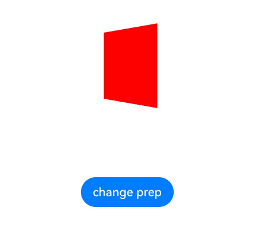
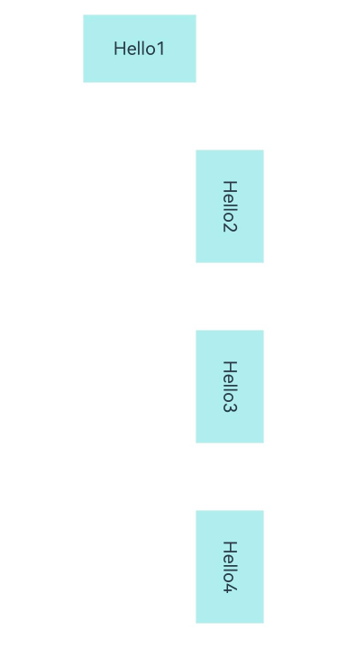

# Transformation

Transformation attributes allow you to rotate, translate, scale, or transform a component.

> **NOTE**
>
> The APIs of this module are supported since API version 7. Updates will be marked with a superscript to indicate their earliest API version.

## rotate

rotate(value: RotateOptions)

Rotates the component.

**Widget capability**: This API can be used in ArkTS widgets since API version 9.

**Atomic service API**: This API can be used in atomic services since API version 11.

**System capability**: SystemCapability.ArkUI.ArkUI.Full

**Parameters**

| Name| Type                                   | Mandatory| Description                                                        |
| ------ | --------------------------------------- | ---- | ------------------------------------------------------------ |
| value  | [RotateOptions](#rotateoptions) | Yes  | How the component rotates in the coordinate system (as shown below) with the upper left corner of the component as the coordinate origin. (x, y, z) specifies a vector as the axis of rotation.<br>The axis and center of rotation are set based on the coordinate system, which remains where it is when the component is moved.<br>Default value: When **x**, **y**, and **z** are not specified, their default values are **0**, **0**, and **1**, respectively. If any of **x**, **y**, and **z** is specified, the default value for the unspecified one is **0**.<br>{<br>centerX: '50%',<br>centerY: '50%'<br>centerZ: 0,<br>perspective: 0<br>}<br>Unit: vp<br><br>Since API version 10, **CenterZ** and **perspective** are supported in ArkTS widgets.|

## rotate<sup>16+</sup>

rotate(options: Optional\<RotateOptions>)

Rotates the component. Compared to [rotate](#rotate), the **options** parameter supports the **undefined** type.

**Widget capability**: This API can be used in ArkTS widgets since API version 16.

**Atomic service API**: This API can be used in atomic services since API version 16.

**System capability**: SystemCapability.ArkUI.ArkUI.Full

**Parameters**

| Name | Type                                              | Mandatory| Description                                                        |
| ------- | -------------------------------------------------- | ---- | ------------------------------------------------------------ |
| options | Optional\<[RotateOptions](#rotateoptions)> | Yes  | How the component rotates in the coordinate system (as shown below) with the upper left corner of the component as the coordinate origin. (x, y, z) specifies a vector as the axis of rotation.<br>The axis and center of rotation are set based on the coordinate system, which remains where it is when the component is moved.<br>Default value: When **x**, **y**, and **z** are not specified, their default values are **0**, **0**, and **1**, respectively. If any of **x**, **y**, and **z** is specified, the default value for the unspecified one is **0**.<br>{<br>centerX: '50%',<br>centerY: '50%'<br>centerZ: 0,<br>perspective: 0<br>}<br>Unit: vp<br><br>Since API version 10, **CenterZ** and **perspective** are supported in ArkTS widgets.<br>If **options** is **undefined**, the component reverts to its original state with no rotation.|

## translate

translate(value: TranslateOptions)

Translates the component.

**Widget capability**: This API can be used in ArkTS widgets since API version 9.

**Atomic service API**: This API can be used in atomic services since API version 11.

**System capability**: SystemCapability.ArkUI.ArkUI.Full

**Parameters**

| Name| Type                                         | Mandatory| Description                                                        |
| ------ | --------------------------------------------- | ---- | ------------------------------------------------------------ |
| value  | [TranslateOptions](#translateoptions) | Yes  | How the component is translated in the coordinate system (as shown below) with the upper left corner of the component as the coordinate origin. Values of **x**, **y**, and **z** indicate the translation distance along the respective axis. A positive value indicates a forward movement towards the respective axis, and a negative value indicates a backward movement towards the respective axis. The translation distance can be a number or a string (for example, **'10px'** or **'10%'**).<br>Default value:<br>{<br>x: 0,<br>y: 0,<br>z: 0<br>}<br>Unit: vp<br><br>**NOTE**<br>When the component is translated along the z-axis, the position of the observation point remains unchanged. As such, the component appears larger when the value of **z** places it closer to the observation point and smaller when the value of **z** places it further away from the observation point.<br> |

## translate<sup>16+</sup>

translate(translate: Optional\<TranslateOptions>)

Translates the component. Compared to [translate](#translate), the **translate** parameter supports the **undefined** type.

**Widget capability**: This API can be used in ArkTS widgets since API version 16.

**Atomic service API**: This API can be used in atomic services since API version 16.

**System capability**: SystemCapability.ArkUI.ArkUI.Full

**Parameters**

| Name   | Type                                                    | Mandatory| Description                                                        |
| --------- | -------------------------------------------------------- | ---- | ------------------------------------------------------------ |
| translate | Optional\<[TranslateOptions](#translateoptions)> | Yes  | How the component is translated in the coordinate system (as shown below) with the upper left corner of the component as the coordinate origin. Values of **x**, **y**, and **z** indicate the translation distance along the respective axis. A positive value indicates a forward movement towards the respective axis, and a negative value indicates a backward movement towards the respective axis. The translation distance can be a number or a string (for example, **'10px'** or **'10%'**).<br>Default value:<br>{<br>x: 0,<br>y: 0,<br>z: 0<br>}<br>Unit: vp<br><br>**NOTE**<br>When the component is translated along the z-axis, the position of the observation point remains unchanged. As such, the component appears larger when the value of **z** places it closer to the observation point and smaller when the value of **z** places it further away from the observation point.<br><br>If **options** is **undefined**, the component reverts to its original state with no translation.|

## scale

scale(value: ScaleOptions)

Scales the component.

**Widget capability**: This API can be used in ArkTS widgets since API version 9.

**Atomic service API**: This API can be used in atomic services since API version 11.

**System capability**: SystemCapability.ArkUI.ArkUI.Full

**Parameters**

| Name| Type                                 | Mandatory| Description                                                        |
| ------ | ------------------------------------- | ---- | ------------------------------------------------------------ |
| value  | [ScaleOptions](#scaleoptions) | Yes  | Scale ratio along the x-, y-, and z-axis. The default value is **1**. **centerX** and **centerY** are used to set the scale center point.<br>Default value:<br>{<br>x: 1,<br>y: 1,<br>z: 1,<br>centerX:'50%',<br>centerY:'50%'<br>} |

## scale<sup>16+</sup>

scale(options: Optional\<ScaleOptions>)

Scales the component. Compared to [scale](#scale), the **options** parameter supports the **undefined** type.

**Widget capability**: This API can be used in ArkTS widgets since API version 16.

**Atomic service API**: This API can be used in atomic services since API version 16.

**System capability**: SystemCapability.ArkUI.ArkUI.Full

**Parameters**

| Name | Type                                            | Mandatory| Description                                                        |
| ------- | ------------------------------------------------ | ---- | ------------------------------------------------------------ |
| options | Optional\<[ScaleOptions](#scaleoptions)> | Yes  | Scale ratio along the x-, y-, and z-axis. The default value is **1**. **centerX** and **centerY** are used to set the scale center point.<br>Default value:<br>{<br>x: 1,<br>y: 1,<br>z: 1,<br>centerX:'50%',<br>centerY:'50%'<br>}<br>If **options** is **undefined**, the component reverts to its original state with no scaling.|

## transform

transform(value: object)

Sets the transformation matrix of the component.

**Atomic service API**: This API can be used in atomic services since API version 11.

**System capability**: SystemCapability.ArkUI.ArkUI.Full

**Parameters**

| Name| Type  | Mandatory| Description                                                        |
| ------ | ------ | ---- | ------------------------------------------------------------ |
| value  | object | Yes  | Transformation matrix of the component. Only the [Matrix4Transit](../js-apis-matrix4.md) object type is supported.|

## transform<sup>16+</sup>

transform(transform: Optional\<object>)

Sets the transformation matrix of the component. Compared to [transform](#transform), the **transform** parameter supports the **undefined** type.

**Atomic service API**: This API can be used in atomic services since API version 16.

**System capability**: SystemCapability.ArkUI.ArkUI.Full

**Parameters**

| Name| Type                                   | Mandatory| Description                    |
| ------ | --------------------------------------- | ---- | ------------------------ |
| transform | Optional\<object> |  | Transformation matrix of the component. Only the [Matrix4Transit](../js-apis-matrix4.md) object type is supported.<br>If **transform** is **undefined**, the component reverts to the identity matrix (no transformation).|

## RotateOptions

**Atomic service API**: This API can be used in atomic services since API version 11.

**System capability**: SystemCapability.ArkUI.ArkUI.Full

| Name                     | Type                      | Mandatory| Description                                                        |
| ------------------------- | -------------------------- | ---- | ------------------------------------------------------------ |
| x                         | number                     | No  | X coordinate of the rotation axis vector.<br>**Widget capability**: This API can be used in ArkTS widgets since API version 9.|
| y                         | number                     | No  | Y coordinate of the rotation axis vector.<br>**Widget capability**: This API can be used in ArkTS widgets since API version 9.|
| z                         | number                     | No  | Z coordinate of the rotation axis vector.<br>**Widget capability**: This API can be used in ArkTS widgets since API version 9.|
| angle                     | number \| string | Yes  | Angle to rotate. A positive angle indicates a clockwise rotation, and a negative angle indicates a counterclockwise rotation. The value can be of the string type, for example, **'90deg'**.<br>**Widget capability**: This API can be used in ArkTS widgets since API version 9.|
| centerX                   | number \| string | No  | X coordinate of the transformation center point (anchor).<br>Unit: vp<br>**Widget capability**: This API can be used in ArkTS widgets since API version 9.|
| centerY                   | number \| string | No  | Y coordinate of the transformation center point (anchor).<br>Unit: vp<br>**Widget capability**: This API can be used in ArkTS widgets since API version 9.|
| centerZ<sup>10+</sup>     | number                     | No  | Z-axis anchor, that is, the z-component of the 3D rotation center point.<br>**Widget capability**: This API can be used in ArkTS widgets since API version 10.|
| perspective<sup>10+</sup> | number                     | No  | Distance from the user to the z=0 plane.<br>The axis and center of rotation are set based on the coordinate system, which remains where it is when the component is moved.<br>**Widget capability**: This API can be used in ArkTS widgets since API version 10.|

## TranslateOptions

**Widget capability**: This API can be used in ArkTS widgets since API version 9.

**Atomic service API**: This API can be used in atomic services since API version 11.

**System capability**: SystemCapability.ArkUI.ArkUI.Full

| Name| Type                      | Mandatory| Description           |
| ---- | -------------------------- | ---- | --------------- |
| x    | number \| string | No  | Translation distance along the x-axis.|
| y    | number \| string | No  | Translation distance along the y-axis.|
| z    | number \| string | No  | Translation distance along the z-axis.|

## ScaleOptions

**Widget capability**: This API can be used in ArkTS widgets since API version 9.

**Atomic service API**: This API can be used in atomic services since API version 11.

**System capability**: SystemCapability.ArkUI.ArkUI.Full

| Name   | Type                      | Mandatory| Description                                                        |
| ------- | -------------------------- | ---- | ------------------------------------------------------------ |
| x       | number                     | No  | Scale ratio along the x-axis. x > 1: The component is scaled up along the x-axis.<br>0 < x < 1: The component is scaled down along the x-axis.<br>x < 0: The component is scaled in the reverse direction of the x-axis.|
| y       | number                     | No  | Scale ratio along the y-axis. y > 1: The component is scaled up along the y-axis.<br>0 < y < 1: The component is scaled down along the y-axis.<br>y < 0: The component is scaled in the reverse direction of the y-axis.|
| z       | number                     | No  | Scale ratio along the z-axis. z > 1: The component is scaled up along the z-axis.<br>0 < z < 1: The component is scaled down along the z-axis.<br>z < 0: The component is scaled in the reverse direction of the z-axis.|
| centerX | number \| string | No  | X coordinate of the transformation center point (anchor).<br>Unit: vp|
| centerY | number \| string | No  | Y coordinate of the transformation center point (anchor).<br>Unit: vp|

> **NOTE**
>
> If the **rotate** and **scale** attributes are both set for a component, the values of **centerX** and **centerY** conflict. In this case, the one that is set later in time prevails.

## Example

### Example 1: Adding Graphical Transformation Effects

This example demonstrates how to apply various graphical transformations using the **rotate**, **translate**, **scale**, and **transform** APIs.

```ts
// xxx.ets
import { matrix4 } from '@kit.ArkUI';

@Entry
@Component
struct TransformExample {
  build() {
    Column() {
      Text('rotate').width('90%').fontColor(0xCCCCCC).padding(15).fontSize(14)
      Row()
        .rotate({
          x: 0,
          y: 0,
          z: 1,
          centerX: '50%',
          centerY: '50%',
          angle: 300
        }) // The component rotates around the center point of the rotation axis (0,0,1) clockwise by 300 degrees.
        .width(100).height(100).backgroundColor(0xAFEEEE)

      Text('translate').width('90%').fontColor(0xCCCCCC).padding(10).fontSize(14)
      Row()
        .translate({ x: 100, y: 10 }) // The component translates by 100 along the x-axis and by 10 along the y-axis.
        .width(100).height(100).backgroundColor(0xAFEEEE).margin({ bottom: 10 })

      Text('scale').width('90%').fontColor(0xCCCCCC).padding(15).fontSize(14)
      Row()
        .scale({ x: 2, y: 0.5}) // The height and width are doubled. The z-axis has no effect in 2D mode.
        .width(100).height(100).backgroundColor(0xAFEEEE)

      Text('Matrix4').width('90%').fontColor(0xCCCCCC).padding(15).fontSize(14)
      Row()
        .width(100).height(100).backgroundColor(0xAFEEEE)
        .transform(matrix4.identity().translate({ x: 50, y: 50 }).scale({ x: 1.5, y: 1 }).rotate({
          x: 0,
          y: 0,
          z: 1,
          angle: 60
        }))
    }.width('100%').margin({ top: 5 })
  }
}
```


### Example 2: Setting the Rotation Perspective

This example demonstrates how to use the **perspective** API to add a perspective effect to a component.

```ts
// xxx.ets
@Entry
@Component
struct Index {
  @State prep: number = 10;

  build() {
    Row() {
      Column() {
        Stack()
          .width(100)
          .height(100)
          .backgroundColor(Color.Red)
          .rotate({ y: 1, angle: 45, perspective: this.prep })
        Button('change prep')
          .margin({ top: 100 })
          .onClick(() => {
            animateTo({
              duration: 2000,
              curve: Curve.EaseIn,
              iterations: 1,
              playMode: PlayMode.Normal,
              onFinish: () => {
                console.info('play end')
              }
            }, () => {
              this.prep = 500 // Change the component's perspective from 10 to 500.
            })
          })
      }
      .width('100%')
    }
    .height('100%')
  }
}
```



### Example 3: Implementing Rotation Around a Center Point

This example shows how to achieve the same rotation effect by setting different parameters for** rotate** and **transform**.

```ts
import { matrix4 } from '@kit.ArkUI'

@Entry
@Component
struct MatrixExample {
  build() {
    Column({ space: 100 }) {
      Text('Hello1')
        .textAlign(TextAlign.Center)
        .width(100)
        .height(60)
        .borderWidth(1)

      Text('Hello2')
        .textAlign(TextAlign.Center)
        .width(100)
        .height(60)
        .borderWidth(1)
          // Rotate 90 degrees around the anchor (100 vp, 60 vp), where the value of centerX and centerY in rotate or scale are the component's anchors.
        .rotate({
          z: 1,
          angle: 90,
          centerX: 100,
          centerY: 60
        })

      Text('Hello3')
        .textAlign(TextAlign.Center)
        .width(100)
        .height(60)
        .borderWidth(1)
          // The component's anchor (centerX, centerY) is (50%, 50%) by default, which is (50 vp, 30 vp).
          // Set (centerX, centerY) of rotate in transform to (50 vp, 30 vp), which is an additional offset from the component's own anchor.
          // This transformation is equivalent to rotating around (100 vp, 60 vp), achieving the same rotation effect as "Hello2."
        .transform(matrix4.identity()
          .rotate({
            z: 1,
            angle: 90,
            centerX: vp2px(50),
            centerY: vp2px(30)
          }))

      Text('Hello4')
        .textAlign(TextAlign.Center)
        .width(100)
        .height(60)
        .borderWidth(1)
          // centerX and centerY take effect only when x or y is set.
          // Set the component anchor to (100 vp, 60 vp).
        .scale({
          x: 1,
          y: 1,
          centerX: 100,
          centerY: 60
        })
          // centerX and centerY are not specified for rotate in transform. As such, the rotation center is not offset from the component's own anchor.
          // The component rotates around (100 vp, 60 vp) through the anchor set by scale, achieving the same rotation effect as "Hello2."
        .transform(matrix4.identity().rotate({ z: 1, angle: 90 }))
    }.width('100%')
    .height('100%')
  }
}
```


