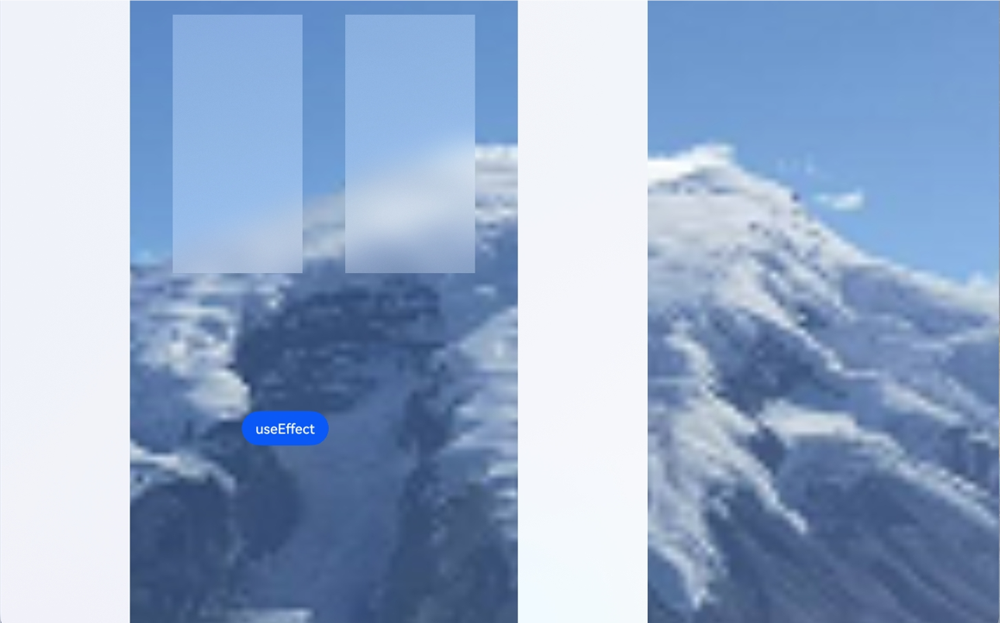

# Special Effect Drawing Combination

The **useEffect** attribute is used to combine the drawing of special effects, such as background blur.

> **NOTE**
>
> This attribute is supported since API version 12. Updates will be marked with a superscript to indicate their earliest API version.
>

## useEffect

useEffect(value: boolean)

Specifies whether to combine the drawing of special effects, such as background blur.

**Atomic service API**: This API can be used in atomic services since API version 12.

**System capability**: SystemCapability.ArkUI.ArkUI.Full

**Parameters**

| Name| Type| Mandatory| Description|
| -------- | -------- | -------- | -------- |
| value | boolean | Yes| Whether the component inherits the special effect settings of the **EffectComponent** component.<br>The value **true** means that the component inherits the special effect settings of the **EffectComponent** component, and **false** means the opposite.<br>Default value: **false**|

## useEffect<sup>14+</sup>

useEffect(useEffect: boolean, effectType: EffectType)

Specifies whether to apply the effect defined by <!--Del-->the parent [EffectComponent](ts-container-effectcomponent-sys.md) or <!--DelEnd-->the window.

**Atomic service API**: This API can be used in atomic services since API version 14.

**System capability**: SystemCapability.ArkUI.ArkUI.Full

**Parameters**

| Name    | Type                                                        | Mandatory| Description                                                        |
| ---------- | ------------------------------------------------------------ | ---- | ------------------------------------------------------------ |
| useEffect  | boolean                                                      | Yes  | Whether to apply the effect defined by <!--Del-->the parent **EffectComponent** or <!--DelEnd-->the window.<br>The value **true** means to apply the effect defined by <!--Del-->the parent **EffectComponent** or <!--DelEnd-->the window.<br>Default value: **false**|
| effectType | [EffectType](ts-universal-attributes-use-effect.md#effecttype14) | Yes  | Type of effect to apply to the component, which is defined by <!--Del-->the parent **EffectComponent** or <!--DelEnd-->the window.<br>Default value: **EffectType.DEFAULT**|

## useEffect<sup>18+</sup>

useEffect(useEffect: Optional\<boolean>, effectType?: EffectType)

Specifies whether to apply the effect defined by <!--Del-->the parent [EffectComponent](ts-container-effectcomponent-sys.md) or <!--DelEnd-->the window. Compared to [useEffect<sup>14+</sup>](#useeffect), the **useEffect** parameter supports the **undefined** type.

**Atomic service API**: This API can be used in atomic services since API version 18.

**System capability**: SystemCapability.ArkUI.ArkUI.Full

**Parameters**

| Name| Type| Mandatory| Description|
| -------- | -------- | -------- | -------- |
| useEffect | Optional\<boolean> | Yes| Whether to apply the effect defined by <!--Del-->the parent **EffectComponent** or <!--DelEnd-->the window.<br>The value **true** means to apply the effect defined by <!--Del-->the parent **EffectComponent** or <!--DelEnd-->the window.<br>Default value: **false**<br>If **useEffect** is set to **undefined**, the previous value is retained.|
| effectType | [EffectType](ts-universal-attributes-use-effect.md#effecttype14) | No| Type of effect to apply to the component, which is defined by <!--Del-->the parent **EffectComponent** or <!--DelEnd-->the window.<br>Default value: **EffectType.DEFAULT**|

## EffectType<sup>14+</sup>

Enumerates the types of effect templates.

**Atomic service API**: This API can be used in atomic services since API version 14.

**System capability**: SystemCapability.ArkUI.ArkUI.Full

| Name    | Value  | Description                  |
| -------- | ---- | ---------------------- |
| DEFAULT  | 0   | Uses the effect template defined<!--Del--> by the parent **EffectComponent** or <!--DelEnd-->.|
| WINDOW_EFFECT  | 1   | Uses the effect template defined by the window.|

Effect Template

|  Device Type   | Fuzzy Radius (Unit: px)  | Saturation                |  Brightness |  Color |
| -------- | ---- | ---------------------- | -------- | -------- |
| Mobile device | 0   | 0 | 0 | '#ffffffff' |
| 2-in-1 device: dark mode | 80   | 1.5 | 1.0 | '#e52e3033' |
| 2-in-1 device: light mode | 80   | 1.9 | 1.0 | '#e5ffffff' |
| Tablet | 0   | 0 | 0 | '#ffffffff' |

<!--Del-->
## Example

This example shows how to combine the drawing of special effects, including background blur.

```ts
//Index.ets
@Entry
@Component
struct Index {
  @State isUse: boolean = true;

  build() {
    Stack() {
      Image($r("app.media.mountain"))
        .autoResize(true)
      EffectComponent() {
        Column({ space: 20 }) {
           Column() {
           }
           .position({ x: 0, y: 0 })
           .width(150)
           .height(800)
           .useEffect(this.isUse, EffectType.WINDOW_EFFECT)
         
           Column() {
           }
           .position({ x: 200, y: 20 })
           .width(150)
           .height(300)
           .useEffect(this.isUse, EffectType.DEFAULT)

           Column() {
           }
           .position({ x: 400, y: 20 })
           .width(150)
           .height(300)
           .useEffect(this.isUse)
        }
        .width('100%')
        .height('100%')
      }
      .backgroundBlurStyle(BlurStyle.Thin)

       Column() {
       }
        .position({ x: 600, y: 0 })
        .width(150)
        .height(800)
        .useEffect(this.isUse, EffectType.WINDOW_EFFECT)

      Row() {
        Button('useEffect')
        .margin(30)
        .onClick(() => {
          this.isUse = !this.isUse;
        })
      }
      .position({ x: 300, y: 450 })
    }
    .backgroundColor(Color.Black)
    .width('100%')
  }
}
```


<!--DelEnd-->
