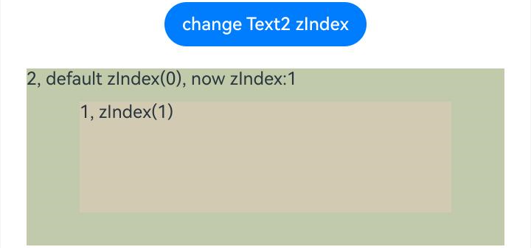
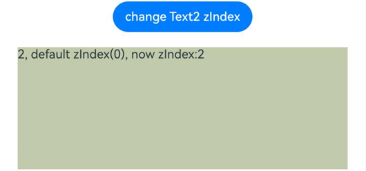

# Z-order Control

The **zIndex** attribute sets the z-order of a component in the stacking context.

>  **NOTE**
>
>  The APIs of this module are supported since API version 7. Updates will be marked with a superscript to indicate their earliest API version.

## zIndex

zIndex(value: number)

Sets the stack level of the component.

**Widget capability**: Since API version 9, this feature is supported in ArkTS widgets.

**Atomic service API**: This API can be used in atomic services since API version 11.

**System capability**: SystemCapability.ArkUI.ArkUI.Full

**Parameters**

| Name| Type  | Mandatory| Description                                                        |
| ------ | ------ | ---- | ------------------------------------------------------------ |
| value  | number | Yes  | Stacking order of the component relative to its sibling components in a container. The components with a larger z-index value cover those with a smaller one. When dynamically changing zIndex does not involve adding or removing sibling nodes, the components are sorted stably based on their previous stack level.|


## Example

### Example 1: Setting the Component Stacking Order

This example demonstrates how to set the stacking order of components using **zIndex**.

```ts
// xxx.ets
@Entry
@Component
struct ZIndexExample {
  build() {
    Column() {
      Stack() {
        // Components are stacked. By default, the component defined later is on the top. A component with a larger zIndex value is displayed before one with a smaller zIndex value.
        Text('1, zIndex(2)')
          .size({ width: '40%', height: '30%' }).backgroundColor(0xbbb2cb)
          .zIndex(2)
        Text('2, default zIndex(1)')
          .size({ width: '70%', height: '50%' }).backgroundColor(0xd2cab3).align(Alignment.TopStart)
          .zIndex(1)
        Text('3, zIndex(0)')
          .size({ width: '90%', height: '80%' }).backgroundColor(0xc1cbac).align(Alignment.TopStart)
      }.width('100%').height(200)
    }.width('100%').height(200)
  }
}
```
Display of child components in the **Stack** component when **zIndex** is not set


Display of child components in the **Stack** component when **zIndex** is set


### Example 2: Dynamically Modifying the zIndex Attribute

This example demonstrates dynamically modifying the **zIndex** attribute on a **Button** component.

```ts
// xxx.ets
@Entry
@Component
struct ZIndexExample {
  @State zIndex_ : number = 0
  build() {
    Column() {
      // Clicking the Button component changes the zIndex value. Components are sorted stably based on their previous stacking order.
      Button("change Text2 zIndex")
        .onClick(()=>{
          this.zIndex_ = (this.zIndex_ + 1) % 3;
        })
      Stack() {
        Text('1, zIndex(1)')
          .size({ width: '70%', height: '50%' }).backgroundColor(0xd2cab3).align(Alignment.TopStart)
          .zIndex(1)
        Text('2, default zIndex(0), now zIndex:' + this.zIndex_)
          .size({ width: '90%', height: '80%' }).backgroundColor(0xc1cbac).align(Alignment.TopStart)
          .zIndex(this.zIndex_)
      }.width('100%').height(200)
    }.width('100%').height(200)
  }
}
```

Effect without clicking the **Button** component to change **zIndex**


Effect after clicking the **Button** component to dynamically change **zIndex** so that **Text1** and **Text2** have the same **zIndex** value



Effect after clicking the **Button** component to dynamically change **zIndex** so that **Text1** has a higher **zIndex** value than **Text2**


