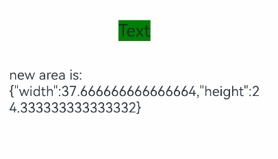

# Component Size Change Event

The size change event is triggered whenever the component's size changes.

>  **NOTE**
>
>  This feature is supported since API version 12. Updates will be marked with a superscript to indicate their earliest API version.

## onSizeChange

onSizeChange(event: SizeChangeCallback): T

Triggered when the component size changes due to layout updates. This event is not triggered for render attribute changes caused by re-rendering, such as changes of **translate** and **offset**.

**Widget capability**: This API can be used in ArkTS widgets since API version 12.

**Atomic service API**: This API can be used in atomic services since API version 12.

**System capability**: SystemCapability.ArkUI.ArkUI.Full

**Parameters**

| Name  | Type                     | Mandatory| Description                                                        |
| -------- | ------------------------- | ---- | ------------------------------------------------------------ |
| event | [SizeChangeCallback](#sizechangecallback) | Yes  | Size of the component before and after the change.|

**Return value**

| Type| Description|
| -------- | -------- |
| T | Current component.|

## SizeChangeCallback

SizeChangeCallback = (oldValue: SizeOptions, newValue: SizeOptions) => void

Invoked when the component size changes.

**Widget capability**: This API can be used in ArkTS widgets since API version 12.

**Atomic service API**: This API can be used in atomic services since API version 12.

**System capability**: SystemCapability.ArkUI.ArkUI.Full

**Parameters**

| Name  | Type                     | Mandatory| Description                                                        |
| -------- | ------------------------- | ---- | ------------------------------------------------------------ |
| oldValue | [SizeOptions](ts-types.md#sizeoptions) | Yes  | Width and height of the component before the change.|
| newValue | [SizeOptions](ts-types.md#sizeoptions) | Yes  | Width and height of the component after the change.|


## Example

```ts
// xxx.ets
@Entry
@Component
struct AreaExample {
  @State value: string = 'Text'
  @State sizeValue: string = ''

  build() {
    Column() {
      Text(this.value)
        .backgroundColor(Color.Green)
        .margin(30)
        .fontSize(20)
        .onClick(() => {
          this.value = this.value + 'Text'
        })
        .onSizeChange((oldValue: SizeOptions, newValue: SizeOptions) => {
          console.info(`Ace: on size change, oldValue is ${JSON.stringify(oldValue)} value is ${JSON.stringify(newValue)}`)
          this.sizeValue = JSON.stringify(newValue)
        })
      Text('new area is: \n' + this.sizeValue).margin({ right: 30, left: 30 })
    }
    .width('100%').height('100%').margin({ top: 30 })
  }
}
```

