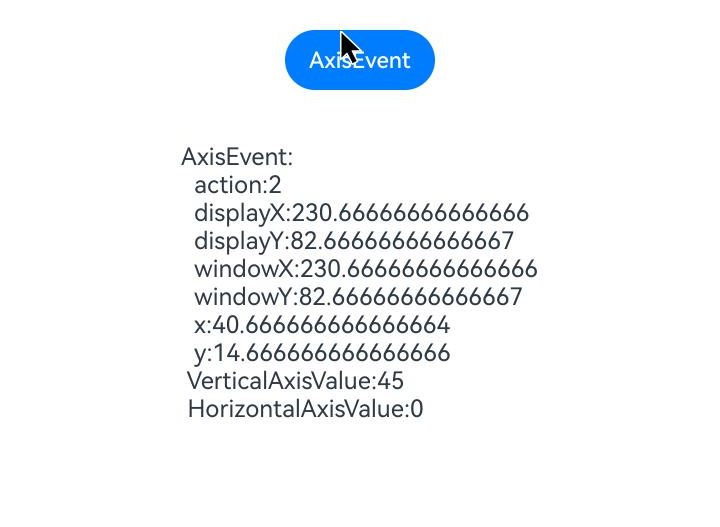

# Axis Event

<!--Kit: ArkUI-->
<!--Subsystem: ArkUI-->
<!--Owner: @yihao-lin-->
<!--Designer: @piggyguy-->
<!--Tester: @songyanhong-->
<!--Adviser: @Brilliantry_Rui-->
<!-- md-trans-meta sourceCommit=1dc78e227c8188fad4eeb3a62581cceb60077c26 translatedAt=2026-08-17T10:23:08.099Z pushedAt=2026-08-17T11:44:34.480Z -->

An axis event is triggered when the pointer from a device like a mouse or touchpad is within a component's area, and an action such as scrolling the wheel, sliding two fingers along a specific direction (axis) on the touchpad, or pinching with two fingers on the touchpad occurs. An "axis" refers to a direction in a two-dimensional coordinate system, which is divided into horizontal (X-axis) and vertical (Y-axis).

>  **NOTE**
>
> - The initial APIs of this module are supported since API version 17. Newly added APIs will be marked with a superscript to indicate their earliest API version.
>
> - The APIs of this module can be used only in the stage model.

## onAxisEvent

onAxisEvent(event: Callback\<AxisEvent>): T

This callback is triggered when the pointer from a device like a mouse or touchpad is within a component's area, and the mouse wheel is scrolled or two fingers on the touchpad slide or pinch.

**Atomic service API**: This API can be used in atomic services since API version 17.

**System capability**: SystemCapability.ArkUI.ArkUI.Full

**Parameters**

| Name| Type                             | Mandatory| Description                |
| ------ | --------------------------------- | ---- | -------------------- |
| event  | Callback\<[AxisEvent](#axisevent)> | Mandatory   | Callback invoked when an axis event is triggered. It is used to receive the [AxisEvent](#axisevent) object, which contains information such as the action type, coordinates, and scroll step of the axis event. |

**Return value**

| Type| Description|
| -------- | -------- |
| T | Current component.|

## AxisEvent

Describes the axis event object, which inherits from BaseEvent.

**Atomic service API**: This API can be used in atomic services since API version 17.

**System capability**: SystemCapability.ArkUI.ArkUI.Full

### Properties

**System capability**: SystemCapability.ArkUI.ArkUI.Full

| Name           | Type | Read-Only|Optional                             | Description                                                   |
| ------------------- | -----------------------|------|----- | -------------------------------------------------------- |
| action              | [AxisAction](ts-appendix-enums.md#axisaction17)           | No   | No   | Action type of the axis event.<br>**Atomic service API:** This API can be used in atomic services since API version 17.                   |
| x                   | number                 | No   | No   | X coordinate of the mouse cursor in the [component coordinate system](../../../ui/arkui-glossary.md#component-coordinate-system) with the target component as the reference.<br>Unit: vp<br>**Atomic service API:** This API can be used in atomic services since API version 17.  |
| y                   | number                 | No   | No   | Y coordinate of the mouse cursor in the [component coordinate system](../../../ui/arkui-glossary.md#component-coordinate-system) with the target component as the reference.<br>Unit: vp<br>**Atomic service API:** This API can be used in atomic services since API version 17.  |
| windowX             | number                 | No   | No   | X coordinate of the mouse cursor in the coordinate system of the current app window.<br>Unit: vp<br>**Atomic service API:** This API can be used in atomic services since API version 17. |
| windowY             | number                 | No   | No   | Y coordinate of the mouse cursor in the coordinate system of the current app window.<br>Unit: vp<br>**Atomic service API:** This API can be used in atomic services since API version 17. |
| displayX            | number                 | No   | No   | X coordinate of the mouse cursor in the coordinate system of the current app screen.<br>Unit: vp<br>**Atomic service API:** This API can be used in atomic services since API version 17. |
| displayY            | number                 | No   | No   | Y coordinate of the mouse cursor in the coordinate system of the current app screen.<br>Unit: vp<br>**Atomic service API:** This API can be used in atomic services since API version 17. |
| scrollStep          | number                 | No   | Yes   | Scroll step configuration of the mouse axis.<br> **Note:** Only the mouse wheel is supported. Value range: [0, 65535]<br>**Atomic service API:** This API can be used in atomic services since API version 17.|
| propagation         | Callback\<void>        | No   | No   | Activates [event bubbling](../../../ui/arkts-interaction-basic-principles.md#event-bubbling), which applies to scenarios where the axis event needs to be passed to the parent component and handled by the parent component in a unified manner.<br>**Atomic service API:** This API can be used in atomic services since API version 17.   |
| globalDisplayX<sup>20+</sup> | number | No | Yes | X coordinate of the mouse cursor in the [global coordinate system](../../../windowmanager/window-terminology.md#global-coordinate-system).<br>Unit: vp<br>Value range: (-∞, +∞)<br>**Atomic service API:** This API can be used in atomic services since API version 20. |
| globalDisplayY<sup>20+</sup> | number | No | Yes | Y coordinate of the mouse cursor in the [global coordinate system](../../../windowmanager/window-terminology.md#global-coordinate-system).<br>Unit: vp<br>Value range: (-∞, +∞)<br>**Atomic service API:** This API can be used in atomic services since API version 20. |
| eventHandleId<sup>24+</sup> | number | No | Yes | Unique identifier used for event processing.<br> Value range: [0, +∞)<br> **Note:** This field is used when distributing events through the [postInputEventWithStrategy](../js-apis-arkui-builderNode.md#postinputeventwithstrategy24) API. Each time an event is distributed, the field increases by 100000.<br> Distributing events multiple times with the same **eventHandleId** will cause abnormal event responses. This field needs to be assigned only when constructing an event; in other cases, you do not need to handle it.<br>**Atomic service API:** This API can be used in atomic services since API version 24. <br>**Model restriction:** This API can be used only in the stage model. |

### getHorizontalAxisValue

getHorizontalAxisValue(): number

Obtains the horizontal axis value of this axis event.

**Atomic service API**: This API can be used in atomic services since API version 17.

**System capability**: SystemCapability.ArkUI.ArkUI.Full

**Return value**

| Type             |Description      |
| ------- | --------------------------------- | 
| number | Horizontal axis value.<br>Unit: vp|

### getVerticalAxisValue

getVerticalAxisValue(): number

Obtains the vertical axis value of this axis event.

**Atomic service API**: This API can be used in atomic services since API version 17.

**System capability**: SystemCapability.ArkUI.ArkUI.Full

**Return value**

| Type             |Description      |
| ------- | --------------------------------- | 
| number | Vertical axis value.<br>Unit: vp|

### getPinchAxisScaleValue<sup>21+</sup>

getPinchAxisScaleValue(): number

Obtains the two-finger pinch zoom ratio from the axis event.

**Atomic service API**: This API can be used in atomic services since API version 21.

**System capability**: SystemCapability.ArkUI.ArkUI.Full

**Return value**

| Type             |Description      |
| ------- | --------------------------------- |
| number | Pinch scale ratio.<br> **Note:** The scale ratio is the ratio of the current distance between the two fingers to the initial distance between them when the touchpad pinch event is triggered.<br>Default value: 0<br>Value range: [0, +∞)<br> |

### hasAxis<sup>22+</sup>

hasAxis(axisType: AxisType): boolean

Checks whether this axis event contains the specified axis type.

**Atomic service API**: This API can be used in atomic services since API version 22.

**System capability**: SystemCapability.ArkUI.ArkUI.Full

**Parameters**

| Name| Type                             | Mandatory| Description                |
| ------ | --------------------------------- | ---- | -------------------- |
| axisType  | [AxisType](ts-appendix-enums.md#axistype22) | Yes   | Axis type to detect, used to determine whether the current axis event contains the specified axis type. |

**Return value**

| Type             |Description      |
| ------- | --------------------------------- | 
| boolean | Whether the axis event contains the specified axis type.<br>**true** if the axis event contains the specified axis type; **false** otherwise.|

### getCurrentLocalPosition

getCurrentLocalPosition?(): Coordinate2D

Obtains the coordinates of the mouse cursor relative to the upper left corner of the current component's real-time position.

**Since:** 26.0.0

**Model restriction:** This API can be used only in the stage model.

**Atomic service API:** This API can be used in atomic services since API version 26.0.0.

**System capability:** SystemCapability.ArkUI.ArkUI.Full

**Return value**

| Type    | Description                                                  |
| ------- | ----------------------------------------------------- |
| [Coordinate2D](ts-types.md#coordinate2d) | Coordinates of the mouse cursor relative to the upper left corner of the current component's real-time position. |

## Examples

### Example 1: Obtaining Axis Event Parameters

This example shows how to set up an axis event on a button. When the user scrolls the mouse wheel, the axis event parameters are captured. Starting from API version 21, this example uses the `axisPinch` attribute of BaseEvent and [getPinchAxisScaleValue](#getpinchaxisscalevalue21) to obtain the pinch scale value. Starting from API version 22, this example uses [hasAxis](#hasaxis22) to check whether the axis event contains the specified axis type.

```ts
// xxx.ets
@Entry
@Component
struct AxisEventExample {
  @State text: string = '';

  build() {
    Column() {
      Row({ space: 20 }) {
        Button('AxisEvent').width(100).height(40)
          .onAxisEvent((event?: AxisEvent) => {
            if (event) {
              this.text =
                'AxisEvent:' + '\n  action:' + event.action + '\n  displayX:' + event.displayX + '\n  displayY:' +
                event.displayY + '\n  windowX:' + event.windowX + '\n  windowY:' + event.windowY + '\n  x:' + event.x +
                  '\n  y:' + event.y + '\n VerticalAxisValue:' + event.getVerticalAxisValue() +
                  '\n HorizontalAxisValue:' + event.getHorizontalAxisValue() + '\n axisPinch:' + event.axisPinch +
                  '\n PinchAxisScaleValue:' + event.getPinchAxisScaleValue() +
                  '\n HasAxis:' + event.hasAxis(AxisType.VERTICAL_AXIS);
            }
          })
      }.margin(20)

      Text(this.text).margin(15)
    }.width('100%')
  }
}
```

The figure below shows the event parameters captured when the user scrolls the mouse wheel.



### Example 2: Obtaining the Real-Time Position of a Component

This example uses the [getCurrentLocalPosition](#getcurrentlocalposition) method to obtain the coordinates of the mouse cursor position relative to the upper-left corner of the current component's real-time position.

The **getCurrentLocalPosition** API is supported since API version 26.0.0.

```ts
// xxx.ets
@Entry
@Component
struct GetCurrentLocalPositionExample {
  @State positionText: string = '';
  @State textOffsetY: number = 0;

  build() {
    Column() {
      Button('Obtain the coordinates of the mouse wheel position relative to the upper left corner of the component's real-time position').translate({ y: this.textOffsetY })
        .onAxisEvent((event?: AxisEvent) => {
          if (event) {
            // Move the button first, and obtain the coordinates of the mouse cursor relative to the upper left corner of the component's real-time position after a delay.
            this.textOffsetY = -200;
            setTimeout(() => {
              let localPos: Coordinate2D | undefined = event?.getCurrentLocalPosition?.();
              this.positionText = `Coordinates relative to the upper left corner of the component's real-time position:\n  x: ${localPos?.x}\n  y: ${localPos?.y}`;
            }, 2000);
          }
        })

      Text(this.positionText)
    }.width('100%')
  }
}
```

<!--Del--> <!--DelEnd-->