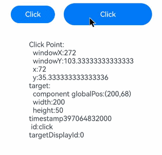

# Click Event

A click event is triggered when a component is clicked.

>  **NOTE**
>
>  The event is supported since API version 7. Updates will be marked with a superscript to indicate their earliest API version.
>
> For details about the event distribution process, see [Multi-level Gesture Events](../../../ui/arkts-gesture-events-multi-level-gesture.md).

## onClick<sup>12+</sup>

onClick(event: Callback\<ClickEvent>, distanceThreshold: number): T

Called when a click event occurs.

When the click event is triggered by a keyboard or game controller, the value of **SourceTool** is **Unknown**.

Compared with the original **onClick** API, this API has the **distanceThreshold** parameter that specifies the finger movement threshold for click events. If the finger's movement exceeds the set threshold, the gesture recognition will fail.
For scenarios where there is no restriction on the finger movement distance during a click, the original API is recommended. If there is a requirement for the finger to stay within a certain area during the click, this API is recommended.

**Widget capability**: This API can be used in ArkTS widgets since API version 12.

>  **NOTE**
>
>  Since API version 12, the following constraints apply when this API is used in service widgets:
>  1. Click events will not be triggered if the finger is pressed for more than 800 ms.
>  2. Click events will not be triggered if the finger moves more than 20 px after pressing down.

**Atomic service API**: This API can be used in atomic services since API version 12.

**System capability**: SystemCapability.ArkUI.ArkUI.Full

**Parameters**

| Name| Type                             | Mandatory| Description                |
| ------ | --------------------------------- | ---- | -------------------- |
| event  | [ClickEvent](#clickevent) | Yes  | [ClickEvent](#clickevent) object.|
| distanceThreshold  | number | Yes  | Finger movement threshold for click events. If the value specified is less than or equal to 0, it will be converted to the default value.<br>Default value: 2^31-1<br>Unit: vp<br>**NOTE**<br>If the finger movement exceeds the preset movement threshold, the gesture recognition fails. If the default threshold is used during initialization and the finger moves beyond the component's touch target, the gesture recognition fails.|

**Return value**

| Type| Description|
| -------- | -------- |
| T | Current component.|

## onClick

onClick(event: (event: ClickEvent) => void): T

Called when a click event occurs.

When the click event is triggered by a keyboard or gamepad, the value of **SourceTool** is **Unknown**.

**Widget capability**: This API can be used in ArkTS widgets since API version 9.

>  **NOTE**
>
>  Since API version 9, the following constraints apply when this API is used in service widgets:
>  1. Click events will not be triggered if the finger is pressed for more than 800 ms.
>  2. Click events will not be triggered if the finger moves more than 20 px after pressing down.

**Atomic service API**: This API can be used in atomic services since API version 11.

**System capability**: SystemCapability.ArkUI.ArkUI.Full

**Parameters**

| Name| Type                             | Mandatory| Description                |
| ------ | --------------------------------- | ---- | -------------------- |
| event  | [ClickEvent](#clickevent) | Yes  | [ClickEvent](#clickevent) object.|

**Return value**

| Type| Description|
| -------- | -------- |
| T | Current component.|

## ClickEvent

Inherits from [BaseEvent](ts-gesture-customize-judge.md#baseevent8).

**System capability**: SystemCapability.ArkUI.ArkUI.Full

| Name           | Type                                | Description                                                    |
| ------------------- | ------------------------------------ | -------------------------------------------------------- |
| x                   | number                               | X coordinate of the click relative to the left edge of the clicked component.<br>Unit: vp<br>**Widget capability**: This API can be used in ArkTS widgets since API version 9.<br>**Atomic service API**: This API can be used in atomic services since API version 11.    |
| y                   | number                               | Y coordinate of the click relative to the upper left corner of the clicked component's original area.<br>Unit: vp<br>**Widget capability**: This API can be used in ArkTS widgets since API version 9.<br>**Atomic service API**: This API can be used in atomic services since API version 11.         |
| target<sup>8+</sup> | [EventTarget](#eventtarget8) | Display area of the object that triggers the event.<br>**Widget capability**: This API can be used in ArkTS widgets since API version 9.<br>**Atomic service API**: This API can be used in atomic services since API version 11. |
| windowX<sup>10+</sup> | number                             | X coordinate of the click relative to the upper left corner of the application window.<br>Unit: vp<br>**Atomic service API**: This API can be used in atomic services since API version 11.|
| windowY<sup>10+</sup> | number                             | Y coordinate of the click relative to the upper left corner of the application window.<br>Unit: vp<br>**Atomic service API**: This API can be used in atomic services since API version 11.|
| displayX<sup>10+</sup> | number                            | X coordinate of the click relative to the upper left corner of the application screen.<br>Unit: vp<br>**Atomic service API**: This API can be used in atomic services since API version 11.|
| displayY<sup>10+</sup> | number                            | Y coordinate of the click relative to the upper left corner of the application screen.<br>Unit: vp<br>**Atomic service API**: This API can be used in atomic services since API version 11.|
| screenX<sup>(deprecated)</sup> | number                    | X coordinate of the click relative to the upper left corner of the application window.<br>Unit: vp<br>This API is deprecated since API version 10. You are advised to use **windowX** instead.|
| screenY<sup>(deprecated)</sup> | number                    | Y coordinate of the click relative to the upper left corner of the application window.<br>Unit: vp<br>This API is deprecated since API version 10. You are advised to use **windowY** instead.|
| preventDefault<sup>12+</sup>      | () => void | Blocks the default event.<br> **NOTE**<br>This API is only supported by the following components: **RichEditor** and **Hyperlink**. An exception is thrown when this API is used with unsupported components. Currently, asynchronous calls and Modifier APIs are not supported.<br>**Atomic service API**: This API can be used in atomic services since API version 12.|
| targetDisplayId<sup>15+</sup> | number | ID of the screen where the event occurs.<br>**Atomic service API**: This API can be used in atomic services since API version 15.|
| hand<sup>15+</sup> | [InteractionHand](./ts-gesture-settings.md#interactionhand15) | Whether the event is triggered by a left-hand or right-hand tap.<br>**Atomic service API**: This API can be used in atomic services since API version 15.|

**Error codes**

For details about the error codes, see [Interaction Event Error Codes](../errorcode-event.md).

| ID  | Error Message|
| --------- | ------- |
| 100017       | Component does not support prevent function. |

## EventTarget<sup>8+</sup>

Describes the display area of the object that triggers the event.

**Widget capability**: This API can be used in ArkTS widgets since API version 9.

**Atomic service API**: This API can be used in atomic services since API version 11.

**System capability**: SystemCapability.ArkUI.ArkUI.Full

| Name  | Type                     | Description        |
| ---- | ------------------------- | ---------- |
| area | [Area](ts-types.md#area8) | Area information of the target element.|
| id<sup>15+</sup> | [string](ts-universal-attributes-component-id.md) | Custom node ID. Default value: **undefined**.|

## Example

This example shows how to configure a click event for a button. By doing so, you can obtain relevant parameters of the click event when the button is pressed.

```ts
// xxx.ets
@Entry
@Component
struct ClickExample {
  @State text: string = ''

  build() {
    Column() {
      Row({ space: 20 }) {
        Button('Click').width(100).height(40).id('click')
          .onClick((event?: ClickEvent) => {
            if(event){
              this.text = 'Click Point:' + '\n  windowX:' + event.windowX + '\n  windowY:' + event.windowY
                + '\n  x:' + event.x + '\n  y:' + event.y + '\ntarget:' + '\n  component globalPos:('
                + event.target.area.globalPosition.x + ',' + event.target.area.globalPosition.y + ')\n  width:'
                + event.target.area.width + '\n  height:' + event.target.area.height + '\ntimestamp' + event.timestamp
                + '\n id:'+ event.target.id + '\ntargetDisplayId:' + event.targetDisplayId;
            }
          }, 20)
        Button('Click').width(200).height(50).id('click')
          .onClick((event?: ClickEvent) => {
            if(event){
              this.text = 'Click Point:' + '\n  windowX:' + event.windowX + '\n  windowY:' + event.windowY
                + '\n  x:' + event.x + '\n  y:' + event.y + '\ntarget:' + '\n  component globalPos:('
                + event.target.area.globalPosition.x + ',' + event.target.area.globalPosition.y + ')\n  width:'
                + event.target.area.width + '\n  height:' + event.target.area.height + '\ntimestamp' + event.timestamp
                + '\n id:'+ event.target.id + '\ntargetDisplayId:' + event.targetDisplayId;
            }
          }, 20)
      }.margin(20)

      Text(this.text).margin(15)
    }.width('100%')
  }
}
```

