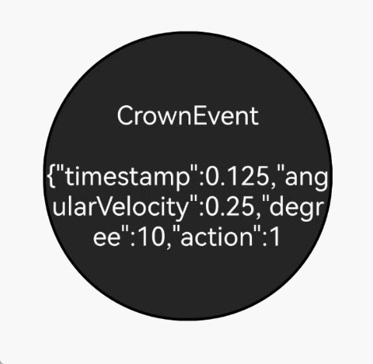

# Crown Event
A crown event is an event triggered when the crown of a wearable device is rotated. Event dispatch relies on component focus, and you can customize event handling through [focus events](ts-universal-attributes-focus.md).

>  **NOTE**
>
>  - This event is supported since API version 18. Updates will be marked with a superscript to indicate their earliest API version.
>
>  - Manual rotation of the crown has default interaction logic. For example, rotating the crown causes the scrollbar to scroll in the direction of the rotation.
>
>  - A component must have focus to receive crown events. Focus control can be managed using [focusable](ts-universal-attributes-focus.md#focusable), [defaultFocus](ts-universal-attributes-focus.md#defaultFocus9), and [focusOnTouch](ts-universal-attributes-focus.md#focusOnTouch9).
>
>  - This event is only supported on wearable devices.
>
>  - By default, the following components support crown events: [Slider](ts-basic-components-slider.md), [DatePicker](ts-basic-components-datepicker.md), [TextPicker](ts-basic-components-textpicker.md), [TimePicker](ts-basic-components-timepicker.md), [Scroll](ts-container-scroll.md), [List](ts-container-list.md), [Grid](ts-container-grid.md), [WaterFlow](ts-container-waterflow.md), [ArcList](ts-container-arclist.md), [Refresh](ts-container-refresh.md), and [Swiper](ts-container-swiper.md).

## onDigitalCrown

onDigitalCrown(handler: Optional&lt;Callback&lt;CrownEvent&gt;&gt;): T

Called when the crown is rotated while the component has focus.

**Atomic service API**: This API can be used in atomic services since API version 18.

**System capability**: SystemCapability.ArkUI.ArkUI.Full


**Parameters**
| Name     | Type                            | Mandatory    | Description                                     |
| ---------- | -------------------------------- | ------- | ----------------------------------------- |
| handler      | Optional&lt;Callback&lt;[CrownEvent](#crownevent)&gt;&gt; | Yes      | [CrownEvent](#crownevent) object.  |


**Return value**
| Type     | Description          |
| --------- | ---------------|
| T         | Current component.  |

## CrownEvent

Defines a data structure for the crown event received by a component. It includes timestamp, angular velocity, rotation angle, and crown action.

**Atomic service API**: This API can be used in atomic services since API version 18.

**System capability**: SystemCapability.ArkUI.ArkUI.Full

| Name                  | Type          | Description                                   |
| --------------------- | -------------- | -------------------------------------- |
| timestamp	        | number	 | Timestamp.                                 |
| angularVelocity	| number	 | Angular velocity in degrees per second (°/s).                  |
| degree	        | number 	 | Relative rotation angle.<br>Unit: degrees<br>Value range: [-360, 360]    |
| action	        | [CrownAction](ts-appendix-enums.md#crownaction18)   | Crown action. |
| stopPropagation	| () => void     | Stops event propagation.                        |

## Example
This example demonstrates how to register a crown event on a component and receive event data.
```ts
// xxx.ets
@Entry
@Component
struct CityList {
  @State message: string = "onDigitalCrown";

  build() {
    Column() {
      Row(){
        Stack() {
          Text(this.message)
            .fontSize(20)
            .fontColor(Color.White)
            .backgroundColor("#262626")
            .textAlign(TextAlign.Center)
            .focusable(true)
            .focusOnTouch(true)
            .defaultFocus(true)
            .borderWidth(2)
            .width(223).height(223)
            .borderRadius(110)
            .onDigitalCrown((event: CrownEvent) => {
              event.stopPropagation();
              this.message = "CrownEvent\n\n" + JSON.stringify(event);
              console.debug("action:%d, angularVelocity:%f, degree:%f, timestamp:%f",
                event.action, event.angularVelocity, event.degree, event.timestamp);
            })
        }.width("100%").height("100%")
      }.width("100%").height("100%")
    }
  }
}
```


