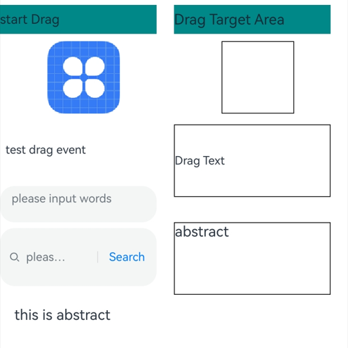

# Drag Event

A drag event is triggered when a component is dragged.

>  **NOTE**
>
>  The APIs of this module are supported since API version 8. Updates will be marked with a superscript to indicate their earliest API version.
>
> The resource files preset in the application (that is, the resource files that are contained in the HAP file before the application is installed) can be dragged and dropped only within the application.

The ArkUI framework provides default drag and drop capabilities for the following components, allowing them to serve as the drag source (from which data can be dragged) or drop target (to which data can be dropped). You can further customize drag and drop behavior by implementing universal drag events.

- The following component supports drag actions by default: [Search](ts-basic-components-search.md), [TextInput](ts-basic-components-textinput.md), [TextArea](ts-basic-components-textarea.md), [RichEditor](ts-basic-components-richeditor.md), [Text](ts-basic-components-text.md), [Image](ts-basic-components-image.md), <!--Del-->[FormComponent](ts-basic-components-formcomponent-sys.md), <!--DelEnd-->[Hyperlink](ts-container-hyperlink.md). You can control the default drag behavior by setting the [draggable](ts-universal-attributes-drag-drop.md#draggable) attribute.

- The following component supports drop actions by default: [Search](ts-basic-components-search.md), [TextInput](ts-basic-components-textinput.md), [TextArea](ts-basic-components-textarea.md), [RichEditor](ts-basic-components-richeditor.md). You can disable the default drag behavior by setting the [allowDrop](ts-universal-attributes-drag-drop.md#allowdrop) attribute to **null**.

<!--RP1--><!--RP1End-->To enable drag and drop for other components, you need to set the **draggable** attribute to **true** and implement data transmission in APIs such as **onDragStart**.

> **NOTE**
>
> When using the **Text** component, set [copyOption](ts-basic-components-text.md#copyoption9) to **CopyOptions.InApp** or **CopyOptions.LocalDevice**.

## onDragStart

onDragStart(event: (event: DragEvent, extraParams?: string) => CustomBuilder | DragItemInfo)

Triggered when the component bound to the event is dragged for the first time. A drag operation is recognized only when the long press time is 500 ms or longer and the dragging distance is 10 vp or larger.

For components that can serve as the drag source by default, a custom **onDragStart** event, if set, is executed and:
- If a custom drag preview is returned, it is used in place of the default drag preview.
- If drag data is set, it is used in place of the default drag data.

No custom drag preview is supported for dragging selected text in the following components: [Text](ts-basic-components-text.md), [Search](ts-basic-components-search.md), [TextInput](ts-basic-components-textinput.md), [TextArea](ts-basic-components-textarea.md), [RichEditor](ts-basic-components-richeditor.md) When **onDragStart** is used together with menu preview or any component that can serve as the drag source by default is used, custom content on menu items and the preview cannot be dragged.

**Atomic service API**: This API can be used in atomic services since API version 11.

**Event priority**:<br>Long press time < 500 ms: Long press event > Drag event<br>Other cases: Drag event > Long press event

**System capability**: SystemCapability.ArkUI.ArkUI.Full

**Parameters**

| Name     | Type                           | Mandatory| Description              |
| ----------- | ------------------------------- | ---- | ------------------ |
| event    | (event: [DragEvent](#dragevent7), extraParams?: string) => [CustomBuilder](ts-types.md#custombuilder8)  \|  [DragItemInfo](#dragiteminfo)  | Yes  | Callback function.<br> **NOTE**<br> **event**: information about the drag event.<br> **extraParams**: extra information about the drag event. The value needs to be parsed into the JSON format. For details, see [extraParams](#extraparams).|

**Return value**

| Type                                                        | Description                    |
| ------------------------------------------------------------ | ------------------------ |
| [CustomBuilder](ts-types.md#custombuilder8) \| [DragItemInfo](#dragiteminfo) | Component information displayed during dragging.<br>**NOTE**<br>The global builder is not supported.|

## onDragEnter

onDragEnter(event: (event: DragEvent, extraParams?: string) => void)

Triggered when a dragged item enters a valid drop target. This event takes effect only when a listener for the [onDrop](#ondrop) event is enabled.

**Atomic service API**: This API can be used in atomic services since API version 11.

**System capability**: SystemCapability.ArkUI.ArkUI.Full

**Parameters**

| Name     | Type                           | Mandatory| Description                          |
| ----------- | ------------------------------- | ---- | ------------------------------ |
| event    | (event: [DragEvent](#dragevent7), extraParams?: string) => void   | Yes  | Callback function.<br>**NOTE**<br> **event**: information about the drag event, including the coordinates of the item that is being dragged.<br> **extraParams**: additional information about the drag event. The value needs to be parsed into the JSON format. For details, see [extraParams](#extraparams).|

## onDragMove

onDragMove(event: (event: DragEvent, extraParams?: string) => void)

Triggered when a dragged item moves in a valid drop target. This event takes effect only when a listener for the [onDrop](#ondrop) event is enabled.

**Atomic service API**: This API can be used in atomic services since API version 11.

**System capability**: SystemCapability.ArkUI.ArkUI.Full

**Parameters**

| Name     | Type                           | Mandatory| Description                          |
| ----------- | ------------------------------- | ---- | ------------------------------ |
| event    | (event: [DragEvent](#dragevent7), extraParams?: string) => void   | Yes  | Callback function.<br>**NOTE**<br> **event**: information about the drag event, including the coordinates of the item that is being dragged.<br> **extraParams**: additional information about the drag event. The value needs to be parsed into the JSON format. For details, see [extraParams](#extraparams).|

## onDragLeave

onDragLeave(event: (event: DragEvent, extraParams?: string) => void)

Triggered when a dragged item leaves a valid drop target. This event takes effect only when a listener for the [onDrop](#ondrop) event is enabled.

**Atomic service API**: This API can be used in atomic services since API version 11.

**System capability**: SystemCapability.ArkUI.ArkUI.Full

**Parameters**

| Name     | Type                           | Mandatory| Description                          |
| ----------- | ------------------------------- | ---- | ------------------------------ |
| event    | (event: [DragEvent](#dragevent7), extraParams?: string) => void   | Yes  | Callback function.<br>**NOTE**<br> **event**: information about the drag event, including the coordinates of the item that is being dragged.<br> **extraParams**: additional information about the drag event. The value needs to be parsed into the JSON format. For details, see [extraParams](#extraparams).|

## onDrop

onDrop(event: (event: DragEvent, extraParams?: string) => void)

Triggered when a dragged item is dropped on a valid drop target. If **event.setResult()** is not explicitly called in the **onDrop** callback to set the drag-and-drop result, then: For supported components, the result is determined based on the actual data processed; for other components, the system considers the data as successfully received.

**Atomic service API**: This API can be used in atomic services since API version 11.

**System capability**: SystemCapability.ArkUI.ArkUI.Full

**Parameters**

| Name     | Type                           | Mandatory| Description                          |
| ----------- | ------------------------------- | ---- | ------------------------------ |
| event    | (event: [DragEvent](#dragevent7), extraParams?: string) => void   | Yes  | Callback function.<br>**NOTE**<br> **event**: information about the drag event, including the coordinates of the item that is being dragged.<br> **extraParams**: additional information about the drag event. The value needs to be parsed into the JSON format. For details, see [extraParams](#extraparams).|

## onDrop<sup>16+</sup>

onDrop(eventCallback: OnDragEventCallback, dropOptions?: DropOptions)

Triggered when a dragged item is dropped on a valid drop target. If you do not explicitly call **event.setResult()** in **onDrop** to set the result of the drag reception, the system handles it as follows:<br>- If the component being dragged is one that supports drop actions by default, the system's actual data processing result is used.<br>- For other components, the system assumes that the data is received successfully.

**Atomic service API**: This API can be used in atomic services since API version 11.

**System capability**: SystemCapability.ArkUI.ArkUI.Full

**Parameters**

| Name     | Type                           | Mandatory| Description                          |
| ----------- | ------------------------------- | ---- | ------------------------------ |
| eventCallback  | (event: DragEvent, extraParams?: string) => void   | Yes  | Callback function.<br>**NOTE**<br> **event**: information about the drag event, including the coordinates of the item that is being dragged.<br> **extraParams**: additional information about the drag event. The value needs to be parsed into the JSON format. For details, see [extraParams](#extraparams).|
| dropOptions  | bool   | No  | Whether to fetch data early during the drag operation.<br>**NOTE**<br> Set this parameter to **true** when using **startDataLoading** to prevent early data fetching.|

## onDragEnd<sup>10+</sup>

onDragEnd(event: (event: DragEvent, extraParams?: string) => void)

Triggered when the dragging of the component bound to the event ends.

**Atomic service API**: This API can be used in atomic services since API version 11.

**System capability**: SystemCapability.ArkUI.ArkUI.Full

**Parameters**

| Name     | Type                           | Mandatory| Description                          |
| ----------- | ------------------------------- | ---- | ------------------------------ |
| event    | (event: [DragEvent](#dragevent7), extraParams?: string) => void   | Yes  | Callback function.<br>**NOTE**<br> **event**: information about the drag event, excluding the coordinates of the item that is being dragged.<br> **extraParams**: additional information about the drag event. The value needs to be parsed into the JSON format. For details, see [extraParams](#extraparams).|

## onPreDrag<sup>12+</sup>

onPreDrag(event: (preDragStatus: PreDragStatus) => void)

Invoked when the component enters a state prior to a drop and drop operation.

**Atomic service API**: This API can be used in atomic services since API version 12.

**System capability**: SystemCapability.ArkUI.ArkUI.Full

**Parameters**

| Name     | Type                           | Mandatory| Description                          |
| ----------- | ------------------------------- | ---- | ------------------------------ |
| callback    | Callback<(preDragStatus: [PreDragStatus](#predragstatus12)> ) => void     | Yes  | Callback function.|

## DragItemInfo

**Atomic service API**: This API can be used in atomic services since API version 11.

**System capability**: SystemCapability.ArkUI.ArkUI.Full

| Name     | Type                                    | Mandatory  | Description                               |
| --------- | ---------------------------------------- | ---- | --------------------------------- |
| pixelMap  | [PixelMap](../../apis-image-kit/js-apis-image.md#pixelmap7) | No   | Image to be displayed during dragging.|
| builder   | [CustomBuilder](ts-types.md#custombuilder8) | No   | Custom component to display during dragging. If **pixelMap** is set, this parameter is ignored.<br> **NOTE**<br>Global builder definition is not supported. If the [Image](ts-basic-components-image.md) component is used in the builder, enable synchronous loading whenever possible, that is, set the [syncLoad](ts-basic-components-image.md#syncload8) attribute of the component to **true**. The builder is used only to generate the image displayed during the current dragging. Changes to the builder, if any, apply to the next dragging, but not to the current dragging.|
| extraInfo | string                                   | No   | Extra information of the dragged item.                          |

## PreviewConfiguration<sup>16+</sup>

Defines the preview image style during a drag operation.

**Atomic service API**: This API can be used in atomic services since API version 16.

**System capability**: SystemCapability.ArkUI.ArkUI.Full

| Name      | Type| Read-Only| Optional| Description                                                        |
| ---------- | ---- | ---- | ---- | ------------------------------------------------------------ |
| onlyForLifting | boolean | No   | Yes   | Whether the custom preview image is used only for lifting.<br> **NOTE**<br>The default value is **false**. When the value is set to **true**, the preview image is used only during the lifting phase of a long press. For the preview image used during the dragging phase: The [dragPreview](ts-universal-attributes-drag-drop.md#dragpreview11) attribute is ignored, and the system prioritizes the image returned in [onDragStart](ts-universal-events-drag-drop.md#ondragstart); if no image is returned in **onDragStart**, the component's snapshot is used.|
| delayCreating  | boolean | No   | Yes   | Whether the preview builder is loaded at the time of setting.<br>The default value is **false**.|

## extraParams

  Provides additional information required for dragging an item.

  **extraParams** is a string converted from a JSON object. You can obtain the following attributes using the JSON object converted from **Json.parse**.

| Name         | Type  | Description                                      |
| ------------- | ------ | ---------------------------------------- |
| selectedIndex | number | Index of the dragged item in the parent container. The value of **selectedindex** starts from **0**.<br>This parameter takes effect only in the drag event of the **ListItem** component.|
| insertIndex   | number | Index of the element into which the dragged item is dropped in the **List** component. The value of **insertIndex** starts from **0**.<br>This parameter takes effect only in the drag event of the **List** component.|

## DragEvent<sup>7+</sup>

**System capability**: SystemCapability.ArkUI.ArkUI.Full

### Attributes

**Atomic service API**: This API can be used in atomic services since API version 11.

**System capability**: SystemCapability.ArkUI.ArkUI.Full

| Name    | Type | Description            |
| ------ | ------ | ---------------- |
| useCustomDropAnimation<sup>10+</sup> | boolean | Whether to use the custom drop animation when the dragging ends.<br>If this parameter is set to **true**, the default drop animation is disabled, and the custom one is used.<br>If this parameter is set to **false** or is not set, the default drop animation is enabled. If the drop target can accept data, it will show a shrinking disappearance animation; if not, it will show an enlarging disappearance animation.<br>When the default drop animation is not disabled, avoid implementing custom animations to prevent conflicts.|
|dragBehavior<sup>10+</sup> | [DragBehavior](#dragbehavior10) | Copy or paste mode.|

### Methods

**System capability**: SystemCapability.ArkUI.ArkUI.Full

| Name    | Return Value Type                           | Description                          |
| ----------- | ------------------------------- | ------------------------------ |
| setData(unifiedData: [UnifiedData](../../apis-arkdata/js-apis-data-unifiedDataChannel.md#unifieddata))<sup>10+</sup>       | void   | Sets drag-related data in the drag event.<br>**Atomic service API**: This API can be used in atomic services since API version 11.|
| getData()<sup>10+</sup> | [UnifiedData](../../apis-arkdata/js-apis-data-unifiedDataChannel.md#unifieddata) | Obtains drag-related data from the drag event. For details about the data obtaining result, see the error code description.<br>**Atomic service API**: This API can be used in atomic services since API version 11.|
| getSummary()<sup>10+</sup> | [Summary](../../apis-arkdata/js-apis-data-unifiedDataChannel.md#summary) | Obtains the summary of drag-related data from the drag event.<br>**Atomic service API**: This API can be used in atomic services since API version 11.|
| setResult(dragRect: [DragResult](#dragresult10))<sup>10+</sup> | void | Sets the drag and drop result in the drag event.<br>**Atomic service API**: This API can be used in atomic services since API version 11.|
| getResult()<sup>10+</sup> | [DragResult](#dragresult10) | Obtains the drag and drop result from the drag event.<br>**Atomic service API**: This API can be used in atomic services since API version 11.|
| getPreviewRect()<sup>10+</sup> | [Rectangle](ts-universal-attributes-touch-target.md#rectangle) | Obtains the position of the drag preview image relative to the current window, as well as the size of the preview image, in VP units. **x** and **y** represent the coordinates of the upper left corner of the preview image, while **width** and **height** represent the size of the preview image.<br>**Atomic service API**: This API can be used in atomic services since API version 11.|
| getVelocityX()<sup>10+</sup> | number | Obtains the dragging velocity along the x-axis. The origin of the coordinate axis is the upper left corner of the screen. The unit is vp. The velocity is positive if the movement is from left to right, and it is negative if the movement is from right to left.<br>**Atomic service API**: This API can be used in atomic services since API version 11.|
| getVelocityY()<sup>10+</sup> | number | Obtains the dragging velocity along the y-axis. The origin of the coordinate axis is the upper left corner of the screen. The unit is vp. The velocity is positive if the movement is from top to bottom, and it is negative if the movement is from bottom to top.|
| getVelocity()<sup>10+</sup> | number | Obtains the dragging velocity along the main axis. The value is the arithmetic square root of the sum of squares of the velocity along the x- and y-axis.<br>**Atomic service API**: This API can be used in atomic services since API version 11.|
| getWindowX()<sup>10+</sup> | number | X coordinate of the drag position relative to the upper left corner of the window, in vp.<br>**Atomic service API**: This API can be used in atomic services since API version 11.|
| getWindowY()<sup>10+</sup> | number | Y coordinate of the drag position relative to the upper left corner of the window, in vp.<br>**Atomic service API**: This API can be used in atomic services since API version 11.|
| getDisplayX()<sup>10+</sup> | number | X coordinate of the drag position relative to the upper left corner of the screen, in vp.<br>**Atomic service API**: This API can be used in atomic services since API version 11.|
| getDisplayY()<sup>10+</sup> | number | Y coordinate of the drag position relative to the upper left corner of the screen, in vp.<br>**Atomic service API**: This API can be used in atomic services since API version 11.|
| getX()<sup>(deprecated)</sup> | number | X coordinate of the drag position relative to the upper left corner of the window, in vp.<br>This API is deprecated since API version 10. You are advised to use **getWindowX()** instead.|
| getY()<sup>(deprecated)</sup> | number | Y coordinate of the drag position relative to the upper left corner of the window, in vp.<br>This API is deprecated since API version 10. You are advised to use **getWindowY()** instead.|
| getModifierKeyState<sup>12+</sup> | (Array&lt;string&gt;) => bool | Obtains the pressed status of modifier keys. For details about the error message, see the following error codes. The following modifier keys are supported: 'Ctrl'\|'Alt'\|'Shift'\|'Fn'. This API does not work for the Fn key on an externally connected keyboard.<br>**Atomic service API**: This API can be used in atomic services since API version 13.|
| startDataLoading(options: GetDataParams)<sup>16+</sup> | string | Asynchronously obtains drag data and notifies you of the current data synchronization progress. This API is only supported during the **onDrop** phase. To cancel data transfer, use the [cancelDataLoading](../js-apis-arkui-UIContext.md#canceldataloading16) API.<br>**Atomic service API**: This API can be used in atomic services since API version 16.|


**Error codes**

For details about the error codes, see [Universal Error Codes](../../errorcode-universal.md) and [Drag Event Error Codes](../errorcode-drag-event.md).

| ID  | Error Message|
| --------- | ------- |
| 401       | Parameter error. Possible causes: 1. Incorrect parameter types. 2. Parameter verification failed. |
| 190001    | Data not found.|
| 190002    | Data error. |

## DragResult<sup>10+</sup>

**Atomic service API**: This API can be used in atomic services since API version 11.

**System capability**: SystemCapability.ArkUI.ArkUI.Full

| Name| Description|
| ----- | ----------------- |
| DRAG_SUCCESSFUL | The drag and drop operation succeeded. It can be used in **onDrop**.|
| DRAG_FAILED | The drag and drop operation failed. It can be used in **onDrop**.|
| DRAG_CANCELED | The drag and drop operation was canceled. It can be used in **onDrop**.|
| DROP_ENABLED | The component allows for a drop operation. It can be used in **onDragMove**.|
| DROP_DISABLED | The component does not allow for a drop operation. It can be used in **onDragMove**.|

## DragBehavior<sup>10+</sup>

Describes the drag behavior. When [DragResult](#dragresult10) is set to **DROP_ENABLED**, you can define **DragBehavior** as either **COPY** or **MOVE**. **DragBehavior** serves to inform you about the intended method of data handling – whether it's a copy or a move –but it does not actually dictate the real processing of the data. The behavior is reported back to the drag source through **onDragEnd**, enabling the initiator of the drag to discern whether the operation results in a copy or a move of the data.

**Atomic service API**: This API can be used in atomic services since API version 11.

**System capability**: SystemCapability.ArkUI.ArkUI.Full

| Name| Description|
| ----- | ----------------- |
| COPY | The data is handled as a copy operation.|
| MOVE| The data is handled as a move operation, effectively cutting it from its original location.|

## PreDragStatus<sup>12+</sup>

**Atomic service API**: This API can be used in atomic services since API version 12.

**System capability**: SystemCapability.ArkUI.ArkUI.Full

| Name| Value| Description|
| ---- | - | ----------------- |
| ACTION_DETECTING_STATUS | 0 | A drag gesture is being detected. (Triggered when the component is long pressed for 50 ms.)|
| READY_TO_TRIGGER_DRAG_ACTION | 1 | The component is ready to be dragged. (Triggered when the component is long pressed for 500 ms.)|
| PREVIEW_LIFT_STARTED | 2 | A lift animation is started. (Triggered when the component is long pressed for 800 ms.)|
| PREVIEW_LIFT_FINISHED | 3 | A lift animation is finished. (Triggered at the completion of the lift animation.)|
| PREVIEW_LANDING_STARTED | 4 | A drop animation is started. (Triggered when the drop animation starts.)|
| PREVIEW_LANDING_FINISHED | 5 | A drop animation is finished. (Triggered when the drop animation ends.)|
| ACTION_CANCELED_BEFORE_DRAG | 6 | A drop animation is terminated. (Triggered when the finger is lifted off the screen after the component enters the **READY_TO_TRIGGER_DRAG_ACTION** state.)|
| PREPARING_FOR_DRAG_DETECTION<sup>16+</sup>  | 7 | The component is ready to be dragged. (Triggered when the component is long pressed for 350 ms.)|
## executeDropAnimation<sup>16+</sup>

Implements a custom drop animation execution function, which is only effective when **useCustomDropAnimation** is set to **true**.

**Atomic service API**: This API can be used in atomic services since API version 16.

**System capability**: SystemCapability.ArkUI.ArkUI.Full

| Name    | Type | Description            |
| ------ | ------ | ---------------- |
| customDropAnimation | Callback\<void\>  |  Custom drop animation.<br> **NOTE**<br>1. This API is only effective when used in the **onDrop** callback.<br> 2. For the API to take effect, set **useCustomDropAnimation** to **true** before using this API.<br> 3. Do not implement logic unrelated to the animation in the animation callback to avoid affecting performance.|

## Example

### Example 1: Setting Draggable and Droppable Areas

This example demonstrates the setup for draggable and droppable areas for certain components, such as **Image** and **Text**.

```ts
// xxx.ets
import { unifiedDataChannel, uniformTypeDescriptor } from '@kit.ArkData';
import { promptAction } from '@kit.ArkUI';
import { BusinessError } from '@kit.BasicServicesKit';

@Entry
@Component
struct Index {
  @State targetImage: string = '';
  @State targetText: string = 'Drag Text';
  @State imageWidth: number = 100;
  @State imageHeight: number = 100;
  @State imgState: Visibility = Visibility.Visible;
  @State abstractContent: string = "abstract";
  @State textContent: string = "";
  @State backGroundColor: Color = Color.Transparent;

  @Builder
  pixelMapBuilder() {
    Column() {
      Image($r('app.media.icon'))
        .width(120)
        .height(120)
        .backgroundColor(Color.Yellow)
    }
  }

  getDataFromUdmfRetry(event: DragEvent, callback: (data: DragEvent) => void) {
    try {
      let data: UnifiedData = event.getData();
      if (!data) {
        return false;
      }
      let records: Array<unifiedDataChannel.UnifiedRecord> = data.getRecords();
      if (!records || records.length <= 0) {
        return false;
      }
      callback(event);
      return true;
    } catch (e) {
      console.log("getData failed, code = " + (e as BusinessError).code + ", message = " + (e as BusinessError).message);
      return false;
    }
  }

  getDataFromUdmf(event: DragEvent, callback: (data: DragEvent) => void) {
    if (this.getDataFromUdmfRetry(event, callback)) {
      return;
    }
    setTimeout(() => {
      this.getDataFromUdmfRetry(event, callback);
    }, 1500);
  }

  private PreDragChange(preDragStatus: PreDragStatus): void {
    if (preDragStatus == PreDragStatus.READY_TO_TRIGGER_DRAG_ACTION) {
      this.backGroundColor = Color.Red;
    } else if (preDragStatus == PreDragStatus.ACTION_CANCELED_BEFORE_DRAG
      || preDragStatus == PreDragStatus.PREVIEW_LANDING_FINISHED) {
      this.backGroundColor = Color.Blue;
    }
  }

  build() {
    Row() {
      Column() {
        Text('start Drag')
          .fontSize(18)
          .width('100%')
          .height(40)
          .margin(10)
          .backgroundColor('#008888')
        Image($r('app.media.icon'))
          .width(100)
          .height(100)
          .draggable(true)
          .margin({ left: 15 })
          .visibility(this.imgState)
          .onDragEnd((event) => {
            // The result value obtained from onDragEnd is set in onDrop of the drop target.
            if (event.getResult() === DragResult.DRAG_SUCCESSFUL) {
              promptAction.showToast({ duration: 100, message: 'Drag Success' });
            } else if (event.getResult() === DragResult.DRAG_FAILED) {
              promptAction.showToast({ duration: 100, message: 'Drag failed' });
            }
          })
        Text('test drag event')
          .width('100%')
          .height(100)
          .draggable(true)
          .margin({ left: 15 })
          .copyOption(CopyOptions.InApp)
        TextArea({ placeholder: 'please input words' })
          .copyOption(CopyOptions.InApp)
          .width('100%')
          .height(50)
          .draggable(true)
        Search({ placeholder: 'please input you word' })
          .searchButton('Search')
          .width('100%')
          .height(80)
          .textFont({ size: 20 })

        Column() {
          Text('this is abstract')
            .fontSize(20)
            .width('100%')
        }.margin({ left: 40, top: 20 })
        .width('100%')
        .height(100)
        .onDragStart((event) => {
          this.backGroundColor = Color.Transparent;
          let data: unifiedDataChannel.PlainText = new unifiedDataChannel.PlainText();
          data.abstract = 'this is abstract';
          data.textContent = 'this is content this is content';
          (event as DragEvent).setData(new unifiedDataChannel.UnifiedData(data));
        })
        .onPreDrag((status: PreDragStatus) => {
          this.PreDragChange(status);
        })
        .backgroundColor(this.backGroundColor)
      }.width('45%')
      .height('100%')

      Column() {
        Text('Drag Target Area')
          .fontSize(20)
          .width('100%')
          .height(40)
          .margin(10)
          .backgroundColor('#008888')
        Image(this.targetImage)
          .width(this.imageWidth)
          .height(this.imageHeight)
          .draggable(true)
          .margin({ left: 15 })
          .border({ color: Color.Black, width: 1 })
          .allowDrop([uniformTypeDescriptor.UniformDataType.IMAGE])
          .onDrop((dragEvent?: DragEvent) => {
            this.getDataFromUdmf((dragEvent as DragEvent), (event: DragEvent) => {
              let records: Array<unifiedDataChannel.UnifiedRecord> = event.getData().getRecords();
              let rect: Rectangle = event.getPreviewRect();
              this.imageWidth = Number(rect.width);
              this.imageHeight = Number(rect.height);
              this.targetImage = (records[0] as unifiedDataChannel.Image).imageUri;
              event.useCustomDropAnimation = false;
              this.imgState = Visibility.None;
              // If result is explicitly set to successful, the value is passed in to onDragEnd of the drag source.
              event.setResult(DragResult.DRAG_SUCCESSFUL);
            })
          })

        Text(this.targetText)
          .width('100%')
          .height(100)
          .border({ color: Color.Black, width: 1 })
          .margin(15)
          .allowDrop([uniformTypeDescriptor.UniformDataType.PLAIN_TEXT])
          .onDrop((dragEvent?: DragEvent) => {
            this.getDataFromUdmf((dragEvent as DragEvent), (event: DragEvent) => {
              let records: Array<unifiedDataChannel.UnifiedRecord> = event.getData().getRecords();
              let plainText: unifiedDataChannel.PlainText = records[0] as unifiedDataChannel.PlainText;
              this.targetText = plainText.textContent;
            })
          })

        Column() {
          Text(this.abstractContent).fontSize(20).width('100%')
          Text(this.textContent).fontSize(15).width('100%')
        }
        .width('100%')
        .height(100)
        .margin(20)
        .border({ color: Color.Black, width: 1 })
        .allowDrop([uniformTypeDescriptor.UniformDataType.PLAIN_TEXT])
        .onDrop((dragEvent?: DragEvent) => {
          this.getDataFromUdmf((dragEvent as DragEvent), (event: DragEvent) => {
            let records: Array<unifiedDataChannel.UnifiedRecord> = event.getData().getRecords();
            let plainText: unifiedDataChannel.PlainText = records[0] as unifiedDataChannel.PlainText;
            this.abstractContent = plainText.abstract as string;
            this.textContent = plainText.textContent;
          })
        })
      }.width('45%')
      .height('100%')
      .margin({ left: '5%' })
    }
    .height('100%')
  }
}
```
 

### Example 2: Implementing a Custom Drop Animation

This example demonstrates how to implement a custom drop animation using the **executeDropAnimation** API.
```ts
import { unifiedDataChannel, uniformTypeDescriptor } from '@kit.ArkData';
import { promptAction } from '@kit.ArkUI';


@Entry
@Component
struct DropAnimationExample {
  @State targetImage: string = '';
  @State targetText: string = 'Drag Text';
  @State hyperLinkText: string = 'HyperLink';
  @State hyperLinkContent: string = 'HyperLink';
  @State imageWidth: number = 100;
  @State imageHeight: number = 100;
  @State imgState: Visibility = Visibility.Visible;
  @State videoSrc: string = 'resource://RAWFILE/02.mp4';
  @State abstractContent: string = "abstract";
  @State textContent: string = "";

  customDropAnimation =
    () => {
      this.getUIContext().animateTo({ duration: 1000, curve: Curve.EaseOut, playMode: PlayMode.Normal }, () => {
        this.imageWidth = 200;
        this.imageHeight = 200;
        this.imgState = Visibility.None;
      })
    }

  build() {
    Row() {
      Column() {
        Image($r('app.media.app_icon'))
          .width(100)
          .height(100)
          .draggable(true)
          .margin({ left: 15 ,top: 40})
          .visibility(this.imgState)
          .onDragStart((event) => {
          })
          .onDragEnd((event) => {
            if (event.getResult() === DragResult.DRAG_SUCCESSFUL) {
              promptAction.showToast({ duration: 100, message: 'Drag Success' });
            } else if (event.getResult() === DragResult.DRAG_FAILED) {
              promptAction.showToast({ duration: 100, message: 'Drag failed' });
            }
          })
      }.width('45%')
      .height('100%')
      Column() {
        Text('Drag Target Area')
          .fontSize(20)
          .width(180)
          .height(40)
          .textAlign(TextAlign.Center)
          .margin(10)
          .backgroundColor('rgb(240,250,255)')
        Column() {
          Image(this.targetImage)
            .width(this.imageWidth)
            .height(this.imageHeight)
        }
        .draggable(true)
        .margin({ left: 15 })
        .border({ color: Color.Black, width: 1 })
        .allowDrop([uniformTypeDescriptor.UniformDataType.IMAGE])
        .onDrop((dragEvent: DragEvent) => {
          let records: Array<unifiedDataChannel.UnifiedRecord> = dragEvent.getData().getRecords();
          let rect: Rectangle = dragEvent.getPreviewRect();
          this.imageWidth = Number(rect.width);
          this.imageHeight = Number(rect.height);
          this.targetImage = (records[0] as unifiedDataChannel.Image).imageUri;
          dragEvent.useCustomDropAnimation = true;
          dragEvent.executeDropAnimation(this.customDropAnimation)
        })
      }.width('45%')
      .height('100%')
      .margin({ left: '5%' })
    }
    .height('100%')
  }
}
```

