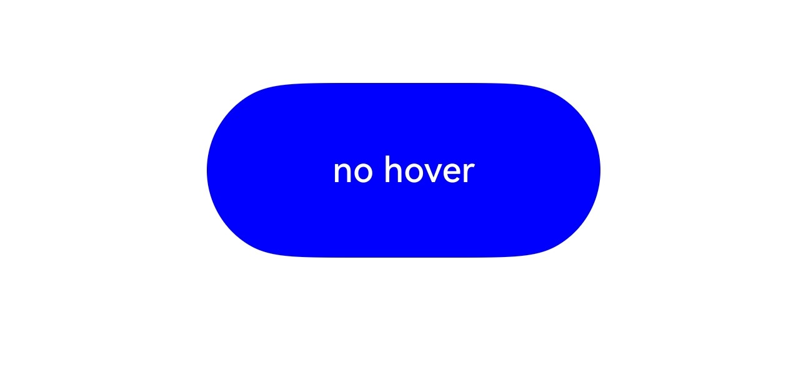

# Hover Event

A hover event is triggered when the cursor slides over a component or when a stylus hovers and moves over the screen.

>  **NOTE**
>
>  - The APIs of this module are supported since API version 8. Updates will be marked with a superscript to indicate their earliest API version.
>  - Currently, only an external mouse device, stylus, or touchpad can be used to trigger a hover event.

## onHover

onHover(event: (isHover: boolean, event: HoverEvent) => void): T

Triggered when the mouse pointer or stylus enters or leaves the component.

**Atomic service API**: This API can be used in atomic services since API version 11.

**System capability**: SystemCapability.ArkUI.ArkUI.Full

**Parameters**

| Name             | Type                               | Mandatory| Description                                                        |
| ------------------- | ----------------------------------- | ---- | ------------------------------------------------------------ |
| isHover             | boolean                             | Yes  | Whether the mouse pointer or stylus is hovering over the component. The value **true** means that the mouse pointer or stylus enters the component, and **false** means that the mouse pointer or stylus leaves the component.|
| event<sup>11+</sup> | [HoverEvent](#hoverevent11) | Yes  | Event bubbling.                                      |

**Return value**

| Type| Description|
| -------- | -------- |
| T | Current component.|

## HoverEvent<sup>11+</sup>

Inherits from [BaseEvent](ts-gesture-customize-judge.md#baseevent).

**Atomic service API**: This API can be used in atomic services since API version 11.

**System capability**: SystemCapability.ArkUI.ArkUI.Full

| Name             | Type      | Description     |
| --------------- | ---------- | ------- |
| stopPropagation | () => void | Stops the event from bubbling upwards or downwards.|

## Example

This example demonstrates how to set a hover event on a button. When the mouse or stylus hovers over the button, the **onHover** event is triggered to dynamically change the text content and background color of the button.

```ts
// xxx.ets
@Entry
@Component
struct HoverEventExample {
  @State hoverText: string = 'no hover';
  @State color: Color = Color.Blue;

  build() {
    Column({ space: 20 }) {
      Button(this.hoverText)
        .width(180).height(80)
        .backgroundColor(this.color)
        .onHover((isHover: boolean, event: HoverEvent) => {
          // Use the onHover event to dynamically change the text content and background color of a button when the mouse pointer or stylus is hovered on it.
          // Use event.sourceTool to determine whether the device is a mouse device or stylus.
          if (isHover) {
            if (event.sourceTool == SourceTool.Pen) {
              this.hoverText = 'pen hover';
              this.color = Color.Pink;
            } else if (event.sourceTool == SourceTool.MOUSE) {
              this.hoverText = 'mouse hover';
              this.color = Color.Red;
            }
          } else {
            this.hoverText = 'no hover';
            this.color = Color.Blue;
          }
        })
    }.padding({ top: 30 }).width('100%')
  }
}
```

Diagrams:

The figure below shows how the button looks when not hovered:

  

The figure below shows how the button looks like when a stylus hovers on it.

  
