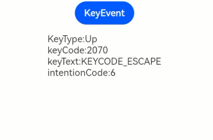

# Key Event

<!--Kit: ArkUI-->
<!--Subsystem: ArkUI-->
<!--Owner: @yihao-lin-->
<!--Designer: @piggyguy-->
<!--Tester: @songyanhong-->
<!--Adviser: @Brilliantry_Rui-->
<!-- md-trans-meta sourceCommit=177cf08b41b42ef2a0a1e73e96f1ea583ec5a150 translatedAt=2026-08-17T10:23:57.290Z pushedAt=2026-08-17T11:51:52.545Z -->

A key event is an event triggered when a component interacts with key input devices such as a physical keyboard or remote control. It applies to all focusable components, for example, **Button**. For components that are not focusable by default, such as **Text** and **Image**, set the [focusable](ts-universal-attributes-focus.md#focusable) attribute to **true** before using key events.

For details about the process and specific timing of the key event triggering, see [Key Event Data Flow](../../../ui/arkts-interaction-development-guide-keyboard.md#key-event-data-flow).

>  **NOTE**
>
>  The initial APIs of this module are supported since API version 7. Newly added APIs will be marked with a superscript to indicate their earliest API version.

## onKeyEvent

onKeyEvent(event: (event: KeyEvent) => void): T

After the component bound to this API obtains focus, a key action triggers this callback. The **onKeyEvent** event bubbles by default. You can call [stopPropagation](#attributes) to prevent event bubbling.

**Atomic service API**: This API can be used in atomic services since API version 11.

**System capability**: SystemCapability.ArkUI.ArkUI.Full

**Parameters**

| Name| Type                         | Mandatory| Description              |
| ------ | ----------------------------- | ---- | ------------------ |
| event  | (event: [KeyEvent](#keyevent)) => void | Yes   | Callback invoked when the component receives a KeyEvent object after gaining focus, to process the key event. |

**Return value**

| Type| Description|
| -------- | -------- |
| T | Current component, which can be used for chained calls. |

## onKeyEvent<sup>15+</sup>

onKeyEvent(event: Callback\<KeyEvent, boolean>): T

After the component bound to this API obtains focus, a key action triggers this callback. If the return value of this callback is `true`, the key event is considered consumed and event bubbling is prevented, which is equivalent to calling `stopPropagation`. If the return value is `false`, the key event is considered not consumed and can continue to bubble.

**Atomic service API**: This API can be used in atomic services since API version 15.

**Model restriction:** This API can be used only in the stage model.

**System capability**: SystemCapability.ArkUI.ArkUI.Full

**Parameters**

| Name| Type                         | Mandatory| Description              |
| ------ | ----------------------------- | ---- | ------------------ |
| event  | [Callback](./ts-types.md#callback12)<[KeyEvent](#keyevent), boolean> | Yes   | Callback used to receive the KeyEvent object and process the key event. |

**Return value**

| Type| Description|
| -------- | -------- |
| T | Current component, which can be used for chained calls. |

## onKeyPreIme<sup>12+</sup>

onKeyPreIme(event: Callback\<KeyEvent, boolean>): T

Triggered before other callbacks when a key operation is performed on the bound component after it obtains focus.

If the return value of this callback is `true`, the key event is considered consumed, and subsequent event callbacks (`keyboardShortcut`, input method events, `onKeyEventDispatch`, and `onKeyEvent`) are intercepted and no longer triggered. If the return value is `false`, the key event is considered not consumed, and subsequent event callbacks can continue to be triggered.

**Atomic service API**: This API can be used in atomic services since API version 12.

**Model restriction:** This API can be used only in the stage model.

**System capability**: SystemCapability.ArkUI.ArkUI.Full

**Parameters**

| Name| Type                         | Mandatory| Description              |
| ------ | ----------------------------- | ---- | ------------------ |
| event  | [Callback](./ts-types.md#callback12)<[KeyEvent](#keyevent), boolean> | Yes   | Callback for preprocessing key events, used to receive the KeyEvent object and process the key event before the input method event. |

**Return value**

| Type| Description|
| -------- | -------- |
| T | Current component, which can be used for chained calls. |

## onKeyEventDispatch<sup>15+</sup>

onKeyEventDispatch(event: Callback\<KeyEvent, boolean>): T

When the corresponding component receives a key event, this callback is triggered, and the key event is not dispatched to its child components. This is suitable for scenarios where the parent component needs to handle key events in a unified manner and avoid duplicate responses to key actions by child components. Since API version 23, constructing a **KeyEvent** for dispatch is supported. In API version 22 and earlier, constructing a **KeyEvent** for dispatch is not supported, and only existing key events can be dispatched.

If the return value of this callback is `true`, the key event is considered consumed and will not [bubble up](../../../ui/arkts-interaction-basic-principles.md#event-bubbling) to parent components for processing. If the return value is `false`, the key event is considered not consumed and can continue to bubble up to parent components for processing.

**Atomic service API**: This API can be used in atomic services since API version 15.

**Model restriction:** This API can be used only in the stage model.

**System capability**: SystemCapability.ArkUI.ArkUI.Full

**Parameters**

| Name| Type                         | Mandatory| Description              |
| ------ | ----------------------------- | ---- | ------------------ |
| event  | [Callback](./ts-types.md#callback12)<[KeyEvent](#keyevent), boolean> | Yes   | Callback for dispatching key events, used to receive the KeyEvent object and process the key event received by the current component. |

**Return value**

| Type| Description|
| -------- | -------- |
| T | Current component, which can be used for chained calls. |

## KeyEvent

### Attributes

**System capability**: SystemCapability.ArkUI.ArkUI.Full

| Name                                   | Type                   | Read-Only   |  Optional  |  Description                        |
| ------------------------------------- | ---------------------------------------- |--------- | ------------- | -------------------------- |
| type                                  | [KeyType](ts-appendix-enums.md#keytype) |  No  |  No     |Type of the key.<br>**Atomic service API:** This API can be used in atomic services since API version 11.                     |
| keyCode | number           |  No        |  No     |Code value of the key. For the code values provided by the key device, see [KeyCode](../../apis-input-kit/js-apis-keycode.md#keycode).<br>**Atomic service API:** This API can be used in atomic services since API version 11.                     |
| keyText                               | string                   |  No   |  No     |Name of the key.<br>**Atomic service API:** This API can be used in atomic services since API version 11.                     |
| keySource                             | [KeySource](ts-appendix-enums.md#keysource) |  No |  No     |Type of the input device that triggers the current key.<br>**Atomic service API:** This API can be used in atomic services since API version 11.             |
| deviceId                              | number                |  No    |  No     |ID of the input device that triggers the current key.<br>**Atomic service API:** This API can be used in atomic services since API version 11.             |
| metaKey                               | number            |  No         |  No     |State of the meta key (the key marked with the window logo, next to the Ctrl or Alt key at the lower-left corner of the keyboard) when the key event occurs. The value **1** indicates the pressed state, and **0** indicates the unpressed state.<br>**Atomic service API:** This API can be used in atomic services since API version 11. |
| timestamp                             | number                 |  No      |  No     |Timestamp of the event. It is the interval from the time when the event is triggered to the time when the system starts, in ns.<br>**Atomic service API:** This API can be used in atomic services since API version 11. |
| stopPropagation                       | () => void             |  No    |  No     |Blocks [event bubbling](../../../ui/arkts-interaction-basic-principles.md#event-bubbling).<br>**Atomic service API:** This API can be used in atomic services since API version 11.                  |
| intentionCode<sup>10+</sup>           | [IntentionCode](#intentioncode10) |  No   |  No     |Intention corresponding to the key.<br>Default value: **IntentionCode.INTENTION_UNKNOWN**.<br>**Atomic service API:** This API can be used in atomic services since API version 11.<br>**Model restriction:** This API can be used only in the stage model.       |
| unicode<sup>14+</sup>                              | number              |  No         |  Yes     |Unicode code value of the key. The supported range is non-space basic Latin characters: 0x0021-0x007E. The unsupported character is 0. In a key combination scenario, the Unicode code value of the key corresponding to the current key event is returned.<br>**Atomic service API:** This API can be used in atomic services since API version 14.<br>**Model restriction:** This API can be used only in the stage model.|
| isNumLockOn<sup>19+</sup>                               | boolean              |  No        |  Yes    |Whether NumLock is locked (**true**: locked; **false**: unlocked).<br>**Atomic service API:** This API can be used in atomic services since API version 19.<br>**Model restriction:** This API can be used only in the stage model.                     |
| isCapsLockOn<sup>19+</sup>                               | boolean         |  No        |  Yes     |Whether CapsLock is locked (**true**: locked; **false**: unlocked).<br>**Atomic service API:** This API can be used in atomic services since API version 19.<br>**Model restriction:** This API can be used only in the stage model.                     |
| isScrollLockOn<sup>19+</sup>                               | boolean        |  No      |  Yes     |Whether ScrollLock is locked (**true**: locked; **false**: unlocked).<br>**Atomic service API:** This API can be used in atomic services since API version 19.<br>**Model restriction:** This API can be used only in the stage model.                     |

### getModifierKeyState<sup>12+</sup>

getModifierKeyState?(keys: Array&lt;string&gt;): boolean

Obtains the pressed state of modifier keys. It is suitable for scenarios such as key combination judgment or shortcut key processing that require identifying whether modifier keys such as Ctrl, Alt, and Shift are pressed.

**Atomic service API**: This API can be used in atomic services since API version 13.

**Model restriction:** This API can be used only in the stage model.

**System capability**: SystemCapability.ArkUI.ArkUI.Full

**Parameters**

| Name| Type                         | Mandatory| Description              |
| ------ | ----------------------------- | ---- | ------------------ |
| keys | Array&lt;string&gt; | Yes | List of modifier keys. Supported modifier keys: 'Ctrl' | 'Alt' | 'Shift'.<br>**NOTE**<br>This API cannot be used in stylus scenarios. |

**Return value**

| Type   | Description                                                 |
| ------- | ----------------------------------------------------- |
| boolean | Whether the modifier key is pressed. The value **true** indicates that it is pressed, and **false** indicates that it is not pressed. |

**Error codes**

For details about the error codes, see [Universal Error Codes](../../errorcode-universal.md).

| ID| Error Message|
| ------- | -------- |
| 401 | Parameter error. Possible causes: 1. Incorrect parameter types. 2. Parameter verification failed. |

## IntentionCode<sup>10+</sup>

type IntentionCode = import('../api/@ohos.multimodalInput.intentionCode').IntentionCode

Intention corresponding to the key.

**Atomic service API**: This API can be used in atomic services since API version 11.

**Model restriction:** This API can be used only in the stage model.

**System capability**: SystemCapability.ArkUI.ArkUI.Full

| Type| Description|
| ----- | ----------------- |
| import('../api/@ohos.multimodalInput.intentionCode').[IntentionCode](../../apis-input-kit/js-apis-intentioncode.md#intentioncode) | Intention corresponding to the key.|

## Example

### Example 1: Triggering the onKeyEvent Callback

This example sets a key event for a button. When the button obtains focus, pressing a key triggers the **onKeyEvent** callback. For details about the process and specific timing of the key event triggering, see [Key Event Data Flow](../../../ui/arkts-interaction-development-guide-keyboard.md#key-event-data-flow).

```ts
// xxx.ets
@Entry
@Component
struct KeyEventExample {
  @State text: string = ''
  @State eventType: string = ''

  build() {
    Column() {
      Button('KeyEvent')
        .defaultFocus(true)
        .onKeyEvent((event?: KeyEvent) => {
          if (event) {
            if (event.type === KeyType.Down) {
              this.eventType = 'Down';
            }
            if (event.type === KeyType.Up) {
              this.eventType = 'Up';
            }
            this.text = 'KeyType:' + this.eventType + '\nkeyCode:' + event.keyCode + '\nkeyText:' + event.keyText +
              '\nintentionCode:' + event.intentionCode;
          }
        })
      Text(this.text).padding(15)
    }.height(300).width('100%').padding(35)
  }
}
```

 

### Example 2: Obtaining the Unicode Code Point

This example demonstrates how to obtain the Unicode code point of the pressed key using the key event.

```ts
// xxx.ets
@Entry
@Component
struct KeyEventExample {
  @State text: string = ''
  @State eventType: string = ''
  @State keyType: string = ''

  build() {
    Column({ space: 10 }) {
      Button('KeyEvent')
        .onKeyEvent((event?: KeyEvent) => {
          if (event) {
            if (event.type === KeyType.Down) {
              this.eventType = 'Down';
            }
            if (event.type === KeyType.Up) {
              this.eventType = 'Up';
            }
            if (event.unicode === 97) {
              this.keyType = 'a';
            } else if (event.unicode === 65) {
              this.keyType = 'A';
            } else {
              this.keyType = ' ';
            }
            this.text =
              'KeyType:' + this.eventType + '\nUnicode:' + event.unicode + '\nkeyCode:' + event.keyCode + '\nkeyType:' +
              this.keyType;
          }
        })
      Text(this.text).padding(15)
    }.height(300).width('100%').padding(35)
  }
}
```


### Example 3: Triggering the onKeyPreIme Callback

This example demonstrates how to use the **onKeyPreIme** callback to intercept and disable the left arrow key in a text box.

```ts
import { KeyCode } from '@kit.InputKit';

@Entry
@Component
struct PreImeEventExample {

  build() {
    Column() {
      Search({
        placeholder: 'Search...'
      })
        .width('80%')
        .height('40vp')
        .border({ radius: '20vp' })
        .onKeyPreIme((event: KeyEvent) => {
          // Prevent the left arrow key from working.
          if (event.keyCode === KeyCode.KEYCODE_DPAD_LEFT) {
            return true;
          }
          return false;
        })
    }
  }
}
```

### Example 4: Preventing Event Bubbling

This example demonstrates event bubbling prevention using **stopPropagation**. Adding **event.stopPropagation()** to the **Button** component's **onKeyEvent** callback ensures only the **Button** component responds to keyboard events, while the parent **Column** remains unresponsive.

>**NOTE**
>
> 1. The **onKeyEvent** event bubbles by default.
> 2. Event bubbling: In a tree structure, after a child node finishes processing an event, the event is passed to its parent node for processing.
> 3. In [onKeyEvent<sup>15+</sup>](#onkeyevent15), you can return **true** to consume the key event and prevent bubbling, which is equivalent to calling **stopPropagation**.

```ts
@Entry
@Component
struct KeyEventExample {
  @State buttonText: string = '';
  @State buttonType: string = '';
  @State columnText: string = '';
  @State columnType: string = '';

  build() {
    Column() {
      Button('onKeyEvent')
        .defaultFocus(true)
        .width(112).height(56)
        .onKeyEvent((event?: KeyEvent) => {
          // Use stopPropagation to prevent the key event from bubbling up.
          if (event) {
            event.stopPropagation();
            if (event.type === KeyType.Down) {
              this.buttonType = 'Down';
            }
            if (event.type === KeyType.Up) {
              this.buttonType = 'Up';
            }
            this.buttonText = 'Button: \n' +
              'KeyType:' + this.buttonType + '\n' +
              'KeyCode:' + event.keyCode + '\n' +
              'KeyText:' + event.keyText;
          }
        })

      Divider()
      Text(this.buttonText).fontColor(Color.Green)

      Divider()
      Text(this.columnText).fontColor(Color.Red)
    }.width('100%').height('100%').justifyContent(FlexAlign.Center)
    .onKeyEvent((event?: KeyEvent) => { // Set the onKeyEvent event for the parent container Column.
      if (event) {
        if (event.type === KeyType.Down) {
          this.columnType = 'Down';
        }
        if (event.type === KeyType.Up) {
          this.columnType = 'Up';
        }
        this.columnText = 'Column: \n' +
          'KeyType:' + this.columnType + '\n' +
          'KeyCode:' + event.keyCode + '\n' +
          'KeyText:' + event.keyText;
      }
    })
  }
}
```

