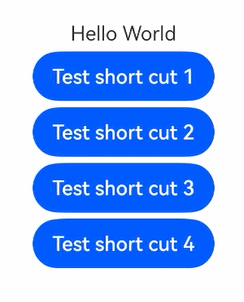

# Component Keyboard Shortcut Event

You can set custom keyboard shortcuts for components, with the flexibility to define multiple shortcuts per component.

A component will still respond to the set custom shortcuts even if it's not in focus or visible on the active page, as long as it's part of the component tree within a window that has focus.

Better yet, you can set custom events for custom keyboard shortcuts, so that when the defined keys of a keyboard shortcut are pressed, the custom event is triggered. If no custom event is set, the behavior of a keyboard shortcut is the same as that of a click.

>  **NOTE**
>
>  The APIs of this module are supported since API version 10. Updates will be marked with a superscript to indicate their earliest API version.

## keyboardShortcut

keyboardShortcut(value: string | FunctionKey, keys: Array\<ModifierKey>, action?: () => void): T

Sets a keyboard shortcut for the component.

**Atomic service API**: This API can be used in atomic services since API version 11.

**System capability**: SystemCapability.ArkUI.ArkUI.Full

**Parameters**

| Name  | Type                                 | Mandatory  | Description                                    |
| ----- | ------------------------------------- | ---- | ---------------------------------------- |
| value | string \| [FunctionKey](#functionkey) | Yes| Character key (which can be entered through the keyboard) or [function key](#functionkey).<br>An empty string means to disable the keyboard shortcut.<br>|
| keys  | Array\<[ModifierKey](#modifierkey)> | Yes| Modifier keys.<br>This parameter can be left empty only when **value** is set to a [function key](#functionkey).<br>|
| action  | () => void    | No   | Callback for a custom event after the keyboard shortcut is triggered.<br>                              |

**Return value**

| Type| Description|
| -------- | -------- |
| T | Current component.|

## ModifierKey

**Atomic service API**: This API can be used in atomic services since API version 11.

**System capability**: SystemCapability.ArkUI.ArkUI.Full

| Name   | Description          |
| ----- | ------------ |
| CTRL  | Ctrl key on the keyboard. |
| SHIFT | Shift key on the keyboard.|
| ALT   | Alt key on the keyboard.  |

## FunctionKey

**System capability**: SystemCapability.ArkUI.ArkUI.Full

| Name  | Description          |
| ---- | ------------ |
| ESC  | Esc key on the keyboard.<br>**Atomic service API**: This API can be used in atomic services since API version 11.|
| F1   | F1 key on the keyboard.<br>**Atomic service API**: This API can be used in atomic services since API version 11. |
| F2   | F2 key on the keyboard.<br>**Atomic service API**: This API can be used in atomic services since API version 11. |
| F3   | F3 key on the keyboard.<br>**Atomic service API**: This API can be used in atomic services since API version 11. |
| F4   | F4 key on the keyboard.<br>**Atomic service API**: This API can be used in atomic services since API version 11. |
| F5   | F5 key on the keyboard.<br>**Atomic service API**: This API can be used in atomic services since API version 11. |
| F6   | F6 key on the keyboard.<br>**Atomic service API**: This API can be used in atomic services since API version 11. |
| F7   | F7 key on the keyboard.<br>**Atomic service API**: This API can be used in atomic services since API version 11. |
| F8   | F8 key on the keyboard.<br>**Atomic service API**: This API can be used in atomic services since API version 11. |
| F9   | F9 key on the keyboard.<br>**Atomic service API**: This API can be used in atomic services since API version 11. |
| F10  | F10 key on the keyboard.<br>**Atomic service API**: This API can be used in atomic services since API version 11.|
| F11  | F11 key on the keyboard.<br>**Atomic service API**: This API can be used in atomic services since API version 11.|
| F12  | F12 key on the keyboard.<br>**Atomic service API**: This API can be used in atomic services since API version 11.|
| TAB<sup>12+</sup>  | Tab key on the keyboard.<br>**Atomic service API**: This API can be used in atomic services since API version 12.|
| DPAD_UP<sup>12+</sup>   | Up arrow key on the keyboard.<br>**Atomic service API**: This API can be used in atomic services since API version 12.|
| DPAD_DOWN<sup>12+</sup> | Down arrow key on the keyboard.<br>**Atomic service API**: This API can be used in atomic services since API version 12.|
| DPAD_LEFT<sup>12+</sup> | Left arrow key on the keyboard.<br>**Atomic service API**: This API can be used in atomic services since API version 12.|
| DPAD_RIGHT<sup>12+</sup> | Right arrow key on the keyboard.<br>**Atomic service API**: This API can be used in atomic services since API version 12.|

## Precautions for Using Keyboard Shortcuts

Keyboard shortcuts, as system keys, take precedence over the common key event **OnKeyEvent**. For details about the key event triggering logic, see [Key Event Data Flow](../../../ui/arkts-common-events-device-input-event.md#key-event-data-flow).

| Scenario                                      | Processing Logic                           | Example                                      |
| ---------------------------------------- | ---------------------------------- | ---------------------------------------- |
| All components that support the **onClick** event                        | Custom keyboard shortcuts are supported.                          | –                                       |
| Requirements for custom keyboard shortcuts                                | A custom keyboard shortcut consists of one or more modifier keys (Ctrl, Shift, Alt, or any combination thereof) and a character key or function key.| Button('button1').keyboardShortcut('a',[ModifierKey.CTRL]) |
| Setting one custom keyboard shortcut for multiple components                           | Only the first component in the component tree responds to the custom keyboard shortcut.         | Button('button1').keyboardShortcut('a',[ModifierKey.CTRL])<br>Button('button2').keyboardShortcut('a',[ModifierKey.CTRL]) |
| When the component is focused or not                              | The component responds to the custom keyboard shortcut as long as the window is focused.                     | –                                       |
| Using a single function key to trigger a keyboard shortcut| A keyboard shortcut can consist of a single function key without any modifier keys.| Button('button1').keyboardShortcut(FunctionKey.F2,[])                                        |
| The input parameter **value** of **keyboardShortcut** is empty| The keyboard shortcut is disabled.<br>This does not apply when there are multiple keyboard shortcuts.| Button('button1').keyboardShortcut('',[ModifierKey.CTRL])<br>Button('button2').keyboardShortcut('',[]) |
| The independent pipeline sub-window and main window coexist                 | The focused window responds to the keyboard shortcut.                        | –                                       |
| The input parameter **keys** of **keyboardShortcut** is set to the Ctrl, Shift, or Alt key| Both the keys on the left or right sides of the keyboard work.                         | Button('button1').keyboardShortcut('a',[ModifierKey.CTRL, ModifierKey.ALT]) |
| Character key in the **value** parameter of the **keyboardShortcut** API           | The response is case-insensitive.                         | Button('button1').keyboardShortcut('a',[ModifierKey.CTRL])<br>Button('button2').keyboardShortcut('A',[ModifierKey.CTRL]) |
| Response to keyboard shortcuts                                  | The component responds to a keyboard shortcut when the keys specified by **keys** are pressed and the key specified by **value** triggers a down event. (Long-pressing leads to continuous response.)             | –                                       |
| The component is hidden<br>                              | The component still responds to keyboard shortcuts.                             | –                                       |
| The component is in the disabled state                             | The component does not respond to keyboard shortcuts.                            | –                                       |
| 1. The keyboard shortcut is the same as an existing one (including the system-defined ones).<br>2. The **value** parameter contains multiple character keys.<br>3. The **key** parameter has a duplicate modifier key.| In these cases, the keyboard shortcut is not added, and the previously added keyboard shortcuts still work.         | Button('button1').keyboardShortcut(FunctionKey.F4,[ModifierKey.ALT])<br>Button('button2').keyboardShortcut('ab',[ModifierKey.CTRL])<br>Button('button3').keyboardShortcut('ab',[ModifierKey.CTRL,ModifierKey.CTRL]) |

### System-defined Keyboard Shortcuts That Cannot Be Bound

The following key combinations cannot function as keyboard shortcuts:

- `Alt` + `F4`
- `Alt` + `Shift` + `F4`
- `Alt` + `TAB`
- `Alt` + `Shift` + `TAB`
- `Ctrl` + `Shift` + `ESC`

### Predefined Key Events

The following table lists the predefined key events.

The predefined key events and custom key events have priorities. Events with higher priorities intercept those with lower priorities. For details about the response priorities, see [Key Event Data Flow](../../../ui/arkts-common-events-device-input-event.md#key-event-data-flow).

| Keyboard Shortcut| Focused Component| Usage| Event Handling Category|
| ----- | ---- | ---- | ---- |
| Arrow keys, **Shift** + Arrow keys| Text box component| Moves the cursor.| Input method|
| Arrow keys, **Shift** + Arrow keys| Universal component| Moves focus in navigation.| System keys|
| **Tab**, **Shift** + **Tab**| Universal component| Triggers focus navigation or moves focus in navigation.| System keys|

## Example

### Example 1

This example sets a keyboard shortcut. You can press the modifier key and accompanying key at the same time to trigger the component to respond to the shortcut and trigger the **onClick** event or other custom event.

```ts
@Entry
@Component
struct Index {
  @State message: string = 'Hello World'

  build() {
    Row() {
      Column({ space: 5 }) {
        Text(this.message)
        Button("Test short cut 1").onClick((event: ClickEvent) => {
          this.message = "I clicked Button 1";
          console.log("I clicked 1");
        }).keyboardShortcut('.', [ModifierKey.SHIFT, ModifierKey.CTRL, ModifierKey.ALT])
          .onKeyEvent((event: KeyEvent)=>{
            console.log("event.keyCode: " + JSON.stringify(event));
          })
        Button("Test short cut 2").onClick((event: ClickEvent) => {
          this.message = "I clicked Button 2";
          console.log("I clicked 2");
        }).keyboardShortcut('1', [ModifierKey.CTRL])
        Button("Test short cut 3").onClick((event: ClickEvent) => {
          this.message = "I clicked Button 3";
          console.log("I clicked 3");
        }).keyboardShortcut('A', [ModifierKey.SHIFT])
        Button("Test short cut 4").onClick((event: ClickEvent) => {
          this.message = "I clicked Button 4";
          console.log("I clicked 4");
        }).keyboardShortcut(FunctionKey.F5, [], () => {
          this.message = "I clicked Button 4";
          console.log("I clicked user callback.");
        }).keyboardShortcut(FunctionKey.F3, [])
      }
      .width('100%')
    }
    .height('100%')
  }
}
```

 

### Example 2

This example registers and deregisters a keyboard shortcut through clicks.

```ts
@Entry
@Component
struct Index {
  @State message: string = 'disable'
  @State shortCutEnable: boolean = false
  @State keyValue: string = ''

  build() {
    Row() {
      Column({ space: 5 }) {
        Text('Ctrl+A is ' + this.message)
        Button("Test short cut").onClick((event: ClickEvent) => {
          this.message = "I clicked Button";
          console.log("I clicked");
        }).keyboardShortcut(this.keyValue, [ModifierKey.CTRL])
        Button(this.message + 'shortCut').onClick((event: ClickEvent) => {
          this.shortCutEnable = !this.shortCutEnable;
          this.message = this.shortCutEnable ? 'enable' : 'disable';
          this.keyValue = this.shortCutEnable ? 'a' : '';
        })
        Button('multi-shortcut').onClick((event: ClickEvent) => {
          console.log('Trigger keyboard shortcut success.')
        }).keyboardShortcut('q', [ModifierKey.CTRL])
          .keyboardShortcut('w', [ModifierKey.CTRL])
          .keyboardShortcut('', []) // Disabling does not work when there are multiple keyboard shortcuts.
      }
      .width('100%')
    }
    .height('100%')
  }
}
```

 
