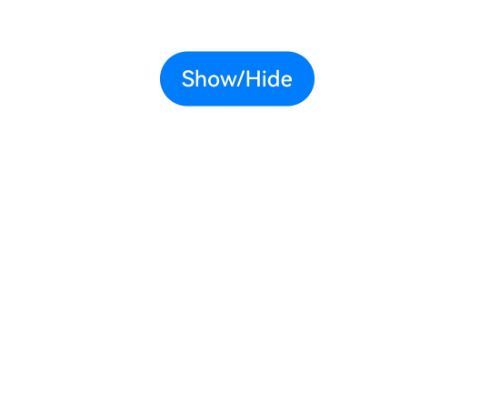

# Show/Hide Event

The show/hide event is triggered when a component is mounted or unmounted from the component tree. A component appears when mounted to the component tree and disappears when unmounted from the component tree.

> **NOTE**
>
> The APIs of this module are supported since API version 7. Updates will be marked with a superscript to indicate their earliest API version.

## onAttach<sup>12+</sup>

onAttach(callback: Callback\<void>): T

Called when this component is mounted to the component tree.

> **NOTE**
>
> The callback must be called before the component layout and rendering process.
>
> It is not allowed to make changes to the component tree in the callback, for example, initiating animations or altering the component tree structure with **if-else** statements.

**Atomic service API**: This API can be used in atomic services since API version 12.

**System capability**: SystemCapability.ArkUI.ArkUI.Full

**Return value**

| Type| Description|
| -------- | -------- |
| T | Current component.|


## onDetach<sup>12+</sup>

onDetach(callback: Callback\<void>): T

Called when this component is unmounted from the component tree.

**Atomic service API**: This API can be used in atomic services since API version 12.

**System capability**: SystemCapability.ArkUI.ArkUI.Full

**Return value**

| Type| Description|
| -------- | -------- |
| T | Current component.|

## onAppear

onAppear(event: () => void): T

Called when this component is displayed.

> **NOTE**
>
> This callback may be called after the component layout and rendering process.

**Widget capability**: Since API version 9, this feature is supported in ArkTS widgets.

**Atomic service API**: This API can be used in atomic services since API version 11.

**System capability**: SystemCapability.ArkUI.ArkUI.Full

**Return value**

| Type| Description|
| -------- | -------- |
| T | Current component.|


## onDisAppear

onDisAppear(event: () => void): T

Triggered when the component is hidden.

**Widget capability**: Since API version 9, this feature is supported in ArkTS widgets.

**Atomic service API**: This API can be used in atomic services since API version 11.

**System capability**: SystemCapability.ArkUI.ArkUI.Full

**Return value**

| Type| Description|
| -------- | -------- |
| T | Current component.|


## Example

This example demonstrates how to control the mounting and unmounting of a component using a button, triggering **onAttach** and **onDetach** events.

```ts
// xxx.ets
import { promptAction } from '@kit.ArkUI'

@Entry
@Component
struct AppearExample {
  @State isShow: boolean = true
  @State changeAppear: string = 'Show/Hide'
  private myText: string = 'Text for onAppear'

  build() {
    Column() {
      Button(this.changeAppear)
        .onClick(() => {
          this.isShow = !this.isShow
        }).margin(15)
      if (this.isShow) {
        Text(this.myText).fontSize(26).fontWeight(FontWeight.Bold)
          .onAttach(() => {
            promptAction.showToast({
              message: 'Text shown.',
              duration: 2000,
              bottom: 500
            })
          })
          .onDetach(() => {
            promptAction.showToast({
              message: 'Text hidden.',
              duration: 2000,
              bottom: 500
            })
          })
      }
    }.padding(30).width('100%')
  }
}
```


