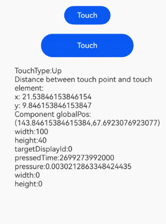

# Touch Event

A touch event is triggered when a finger is pressed against, swipes on, or is lifted from a component.

> **NOTE**
>
> The initial APIs of this module are supported since API version 7. Updates will be marked with a superscript to indicate their earliest API version.
>
> For details about event dispatch, see [Event Interaction Pipeline](../../../ui/arkts-interaction-basic-principles.md#event-interaction-pipeline). For details about gesture event handling, see [Multi-level Gesture Events](../../../ui/arkts-gesture-events-multi-level-gesture.md).
>
> For details about how to bind gesture events, see [Gesture Binding](./ts-gesture-settings.md).

## onTouch

onTouch(event: (event: TouchEvent) => void): T

Invoked when a touch event is triggered. Touch events bubble by default and can be consumed by multiple components. To prevent event bubbling, use the **stopPropagation** API of [TouchEvent](#touchevent). Mouse left-click events are converted to touch events and will also trigger this callback.

**Atomic service API**: This API can be used in atomic services since API version 11.

**System capability**: SystemCapability.ArkUI.ArkUI.Full

**Parameters**

| Name| Type                             | Mandatory| Description                |
| ------ | --------------------------------- | ---- | -------------------- |
| event  | [TouchEvent](#touchevent) | Yes  | **TouchEvent** object.|

**Return value**

| Type| Description|
| -------- | -------- |
| T | Current component.|

## TouchEvent

Inherits from [BaseEvent](ts-gesture-customize-judge.md#baseevent8). In non-event injection scenarios, **changedTouches** contains points resampled at the screen refresh rate, while **touches** contains points reported at the device's refresh rate. As such, **changedTouches** data may differ from **touches**.

**System capability**: SystemCapability.ArkUI.ArkUI.Full

| Name               | Type                                      | Description          |
| ------------------- | ---------------------------------------- | ------------ |
| type                | [TouchType](ts-appendix-enums.md#touchtype)      | Type of the touch event.<br>**Atomic service API**: This API can be used in atomic services since API version 11.    |
| touches             | Array&lt;[TouchObject](#touchobject)&gt; | Information about all touch points (for multi-touch). Each element represents one touch point. When using this property, you need to check whether it is empty.<br>**Atomic service API**: This API can be used in atomic services since API version 11.     |
| changedTouches      | Array&lt;[TouchObject](#touchobject)&gt; | Information about touch points that changed and triggered the event. When using this property, you need to check whether it is empty.<br>**Atomic service API**: This API can be used in atomic services since API version 11.|
| stopPropagation      | () => void | Stops the event from bubbling upwards or downwards.<br>**Atomic service API**: This API can be used in atomic services since API version 11.|
| preventDefault<sup>12+</sup>      | () => void |  Blocks the default event.<br> **NOTE**<br>This API is only supported by the following components: **Hyperlink**. An exception is thrown when this API is used with unsupported components. Asynchronous calls and the **Modifier** API are not yet supported.<br> **Atomic service API**: This API can be used in atomic services since API version 12.|

**Error codes**

For details about the error codes, see [Interaction Event Error Codes](../errorcode-event.md).

| Error Code  | Error Message|
| --------- | ------- |
| 100017       | Component does not support prevent function. |

### getHistoricalPoints<sup>10+</sup>

getHistoricalPoints(): Array&lt;HistoricalPoint&gt;

Obtains all historical points of the current frame. The touch event frequency per frame varies by device. This API can be called only in [TouchEvent](#touchevent). You can use this API to obtain the historical points of the current frame when [onTouch](#ontouch) is invoked. Typically, [onTouch](#ontouch) is invoked once per frame. If multiple [TouchEvent](#touchevent) instances are received in a single frame, the last point is returned through **onTouch**, and the remaining points are stored as historical points. For multi-touch events within the same frame, multiple** onTouch** calls may occur.

**Atomic service API**: This API can be used in atomic services since API version 11.

**System capability**: SystemCapability.ArkUI.ArkUI.Full

**Return value**

| Type    | Description                     |
| ------ | ----------------------- |
| Array&lt;[HistoricalPoint](#historicalpoint10)&gt;| Array of historical points.|


## TouchObject

**System capability**: SystemCapability.ArkUI.ArkUI.Full

| Name   | Type                                       | Description                                 |
| ------- | ------------------------------------------- | ------------------------------------- |
| type    | [TouchType](ts-appendix-enums.md#touchtype) | Type of the touch event.<br>**Atomic service API**: This API can be used in atomic services since API version 11.                     |
| id      | number                                      | Unique identifier of a finger.<br>**Atomic service API**: This API can be used in atomic services since API version 11.                     |
| x       | number                                      | X coordinate of the touch point relative to the upper left corner of the event responding component.<br>Unit: vp.<br>**Atomic service API**: This API can be used in atomic services since API version 11.|
| y       | number                                      | Y coordinate of the touch point relative to the upper left corner of the event responding component.<br>Unit: vp.<br>**Atomic service API**: This API can be used in atomic services since API version 11.|
| windowX<sup>10+</sup>  | number                       | X coordinate of the touch point relative to the upper left corner of the application window.<br>Unit: vp.<br>**Atomic service API**: This API can be used in atomic services since API version 11.  |
| windowY<sup>10+</sup>  | number                       | Y coordinate of the touch point relative to the upper left corner of the application window.<br>Unit: vp.<br>**Atomic service API**: This API can be used in atomic services since API version 11.  |
| displayX<sup>10+</sup> | number                       | X coordinate of the touch point relative to the upper left corner of the application screen.<br>Unit: vp.<br>**Atomic service API**: This API can be used in atomic services since API version 11.  |
| displayY<sup>10+</sup> | number                       | Y coordinate of the touch point relative to the upper left corner of the application screen.<br>Unit: vp.<br>**Atomic service API**: This API can be used in atomic services since API version 11.  |
| screenX<sup>(deprecated)</sup> | number               | X coordinate of the touch point relative to the upper left corner of the application window.<br>Unit: vp<br>This API is deprecated since API version 10. You are advised to use **windowX** instead.  |
| screenY<sup>(deprecated)</sup> | number               | Y coordinate of the touch point relative to the upper left corner of the application window.<br>Unit: vp<br>This API is deprecated since API version 10. You are advised to use **windowY** instead.  |
| PressedTime<sup>15+</sup> | number | Time when the finger is pressed.<br>Unit: ns<br>**Atomic service API**: This API can be used in atomic services since API version 15.|
| pressure<sup>15+</sup> | number | Pressure value of the finger press.<br>Value range: [0, 65535). The greater the pressure, the larger the value.<br>**Atomic service API**: This API can be used in atomic services since API version 15.|
| width<sup>15+</sup> | number | Width of the area pressed by the finger.<br>Unit: vp.<br>**Atomic service API**: This API can be used in atomic services since API version 15.|
| height<sup>15+</sup> | number | Height of the area pressed by the finger.<br>Unit: vp.<br>**Atomic service API**: This API can be used in atomic services since API version 15.|
| hand<sup>15+</sup> | [InteractionHand](./ts-gesture-settings.md#interactionhand15) | Whether the event was triggered by a left-hand or right-hand tap.<br>**Atomic service API**: This API can be used in atomic services since API version 15.|
| globalDisplayX<sup>20+</sup> | number | X coordinate of the touch point relative to the upper left corner of the global display.<br>Unit: vp.<br>Value range: [0, +∞).<br>**Atomic service API**: This API can be used in atomic services since API version 20.|
| globalDisplayY<sup>20+</sup> | number | Y coordinate of the touch point relative to the upper left corner of the global display.<br>Unit: vp.<br>Value range: [0, +∞).<br>**Atomic service API**: This API can be used in atomic services since API version 20.|

## HistoricalPoint<sup>10+</sup>

Provides historical touch point information.

**Atomic service API**: This API can be used in atomic services since API version 11.

**System capability**: SystemCapability.ArkUI.ArkUI.Full

| Name        | Type                                | Description                                                                        |
| ----------- | ----------------------------------- | ----------------------------------------------------------------------------- |
| touchObject | [TouchObject](#touchobject)  | Basic information of the historical point.                                                  |
| size        | number                              | Size of the contact area between the finger and screen for the historical point.<br>Default value: **0**                                    |
| force       | number                              | Touch force of the historical point.<br>Default value: **0**.<br>Value range: [0, 65535). The greater the pressure, the larger the value.|
| timestamp   | number                              | Timestamp of the historical point. It is the interval between the time when the event is triggered and the time when the system starts.<br>Unit: ns          |

## Example

This example configures a touch event for a button. When the button is touched, it obtains relevant parameters of the touch event.

```ts
// xxx.ets
@Entry
@Component
struct TouchExample {
  @State text: string = '';
  @State eventType: string = '';

  build() {
    Column() {
      Button('Touch').height(40).width(100)
        .onTouch((event?: TouchEvent) => {
          if (event && event.sourceTool === SourceTool.Finger) {
            if (event.type === TouchType.Down) {
              this.eventType = 'Down';
            }
            if (event.type === TouchType.Up) {
              this.eventType = 'Up';
            }
            if (event.type === TouchType.Move) {
              this.eventType = 'Move';
            }
            // 1. The cancel event is triggered when the user touches the home button to return to the home screen while keeping a finger on the screen.
            // 2. On a foldable phone, the cancel event is triggered when the user folds the phone to switch to the external screen while keeping a finger on the screen.
            if (event.type === TouchType.Cancel) {
              this.eventType = 'Cancel';
            }
            if (event.touches) {
              this.text = 'TouchType:' + this.eventType + '\nDistance between touch point and touch element:\nx: '
                + event.touches[0].x + '\n' + 'y: ' + event.touches[0].y + '\nComponent globalPos:('
                + event.target.area.globalPosition.x + ',' + event.target.area.globalPosition.y + ')\nwidth:'
                + event.target.area.width + '\nheight:' + event.target.area.height + '\ntargetDisplayId:' +
              event.targetDisplayId + '\npressedTime:' + event.touches[0].pressedTime + '\npressure:' +
              event.touches[0].pressure +
                '\nwidth:' + event.touches[0].width + '\nheight:' + event.touches[0].height;
            }
          }
        })
      Button('Touch').height(50).width(200).margin(20)
        .onTouch((event?: TouchEvent) => {
          if (event) {
            if (event.type === TouchType.Down) {
              this.eventType = 'Down';
            }
            if (event.type === TouchType.Up) {
              this.eventType = 'Up';
            }
            if (event.type === TouchType.Move) {
              this.eventType = 'Move';
            }
            // 1. The cancel event is triggered when the user touches the home button to return to the home screen while keeping a finger on the screen.
            // 2. On a foldable phone, the cancel event is triggered when the user folds the phone to switch to the external screen while keeping a finger on the screen.
            if (event.type === TouchType.Cancel) {
              this.eventType = 'Cancel';
            }
            if (event.touches) {
              this.text = 'TouchType:' + this.eventType + '\nDistance between touch point and touch element:\nx: '
                + event.touches[0].x + '\n' + 'y: ' + event.touches[0].y + '\nComponent globalPos:('
                + event.target.area.globalPosition.x + ',' + event.target.area.globalPosition.y + ')\nwidth:'
                + event.target.area.width + '\nheight:' + event.target.area.height + '\ntargetDisplayId:' +
              event.targetDisplayId + '\npressedTime:' + event.touches[0].pressedTime + '\npressure:' +
              event.touches[0].pressure +
                '\nwidth:' + event.touches[0].width + '\nheight:' + event.touches[0].height;
            }
          }
        })
      Text(this.text)
    }.width('100%').padding(30)
  }
}
```


