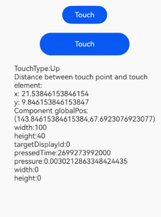

# Touch Event

<!--Kit: ArkUI-->
<!--Subsystem: ArkUI-->
<!--Owner: @yihao-lin-->
<!--Designer: @piggyguy-->
<!--Tester: @songyanhong-->
<!--Adviser: @Brilliantry_Rui-->
<!-- md-trans-meta sourceCommit=177cf08b41b42ef2a0a1e73e96f1ea583ec5a150 translatedAt=2026-08-14T08:56:46.120Z pushedAt=2026-08-15T06:24:29.617Z -->

A touch event is triggered when a finger, stylus, or left mouse button is pressed against, swipes on, or is lifted from a component. It can be used to obtain information such as the touch type, touch point position, touch point changes, and historical points. It applies to interaction scenarios such as tapping, swiping, and multi-touch, helping the app respond to user touch behavior.

> **NOTE**
>
> - The initial APIs of this module are supported since API version 7. Newly added APIs will be marked with a superscript to indicate their earliest API version.
>
> - For details about event distribution, see [Event Interaction Pipeline](../../../ui/arkts-interaction-basic-principles.md#event-interaction-pipeline). For details about the gesture event processing process, see [Multi-level Gesture Events](../../../ui/arkts-gesture-events-multi-level-gesture.md).
>
> - To bind a gesture event, see [Gesture Binding](ts-gesture-settings.md).

## onTouch

onTouch(event: (event: TouchEvent) => void): T

Triggered by a finger or stylus touch action. A touch event [bubbles](../../../ui/arkts-interaction-basic-principles.md#event-bubbling) by default and can be consumed by multiple components. To prevent bubbling, use the **stopPropagation** method of [TouchEvent](#touchevent). When the left mouse button is pressed, the corresponding event is also converted into a touch event and triggers this callback.

**Atomic service API**: This API can be used in atomic services since API version 11.

**System capability**: SystemCapability.ArkUI.ArkUI.Full

**Parameters**

| Name| Type                             | Mandatory| Description                |
| ------ | --------------------------------- | ---- | -------------------- |
| event  | (event: [TouchEvent](#touchevent)) => void | Mandatory   | Callback invoked when a touch event is triggered, used to receive and process the **TouchEvent** object. The callback parameter **event** indicates the detailed information of the current touch event. |

**Return value**

| Type| Description|
| -------- | -------- |
| T | Current component.|

## TouchEvent

Inherits from [BaseEvent](ts-gesture-customize-judge.md#baseevent8). In non-event injection scenarios, **changedTouches** contains points resampled at the screen refresh rate, while **touches** contains points reported at the device's refresh rate. As such, **changedTouches** data may differ from **touches**.

**System capability**: SystemCapability.ArkUI.ArkUI.Full

| Name               | Type      | Read-Only| Optional  | Description                       |
| ------------------- | -----------|------|-------- | -------------------------- |
| type                | [TouchType](ts-appendix-enums.md#touchtype)      | No | No | Type of the touch event.<br>**Atomic service API:** This API can be used in atomic services since API version 11.     |
| touches             | [TouchObject](#touchobject)[] | No | No | Information about all touch points (multi-touch) on the screen. Each element represents a touch point. Check whether this attribute is empty before using it.<br>**Atomic service API:** This API can be used in atomic services since API version 11.      |
| changedTouches      | [TouchObject](#touchobject)[] | No | No | Information about the touch points that have changed and triggered the event. Check whether this attribute is empty before using it.<br>**Atomic service API:** This API can be used in atomic services since API version 11. |
| stopPropagation      | () => void | No | No | Use to block [event bubbling](../../../ui/arkts-interaction-basic-principles.md#event-bubbling).<br>**Atomic service API:** This API can be used in atomic services since API version 11. |
| preventDefault<sup>12+</sup>      | () => void | No | No |  Use to prevent the default event. This is applicable to scenarios where the default behavior of a component needs to be intercepted and custom processing needs to be performed.<br> **Note:** This API is supported only by some components. Currently supported component: [Hyperlink](ts-container-hyperlink.md). An exception is thrown when this API is used by an unsupported component. Asynchronous calling and the **Modifier** API are not supported.<br> **Atomic service API:** This API can be used in atomic services since API version 12.<br>**Model restriction:** This API can be used only in the stage model. |
| eventHandleId<sup>24+</sup> | number | No | Yes | Unique identifier used for event processing.<br> Value range: [0, +∞)<br> **Note:** This field is used when distributing events through the [postInputEventWithStrategy](../js-apis-arkui-builderNode.md#postinputeventwithstrategy24) API. Each time an event is distributed, this field increases by **100000**.<br> Distributing events multiple times with the same **eventHandleId** will cause abnormal event responses. This field needs to be assigned only when constructing an event; in other cases, you do not need to handle it.<br>**Atomic service API:** This API can be used in atomic services since API version 24. <br>**Model restriction:** This API can be used only in the stage model. |

**Error codes**

For details about the error codes, see [Interaction Event Error Codes](../errorcode-event.md).

| Error Code  | Error Message|
| --------- | ------- |
| 100017       | Component does not support prevent function. |

### getHistoricalPoints<sup>10+</sup>

getHistoricalPoints(): Array&lt;HistoricalPoint&gt;

Obtains all historical points of the current frame. The touch event frequency per frame varies with the device. This API can be called only in [TouchEvent](#touchevent) to obtain information about the historical points of the current frame when [onTouch](#ontouch) is triggered. [onTouch](#ontouch) is usually called only once per frame. If the number of [TouchEvent](#touchevent) objects received in the current frame is greater than 1, the last point of the frame is returned through [onTouch](#ontouch), and the remaining points are treated as historical points. If multiple fingers report events in the same frame, **onTouch** may be triggered multiple times.

**Atomic service API**: This API can be used in atomic services since API version 11.

**Model restriction:** This API can be used only in the stage model.

**System capability**: SystemCapability.ArkUI.ArkUI.Full

**Return value**

| Type    | Description                     |
| ------ | ----------------------- |
| Array&lt;[HistoricalPoint](#historicalpoint10)&gt;| Array of historical points.|

## TouchObject

### Attributes

**System capability**: SystemCapability.ArkUI.ArkUI.Full

| Name   | Type                             | Read-Only| Optional         | Description                                 |
| ------- | ----------------------------------|-----| -------------- | ------------------------------------- |
| type    | [TouchType](ts-appendix-enums.md#touchtype) | No | No | Type of the touch event.<br>**Atomic service API:** This API can be used in atomic services since API version 11.                      |
| id      | number                                      | No | No | Unique identifier of the finger.<br>**Atomic service API:** This API can be used in atomic services since API version 11.                      |
| x       | number                                      | No | No | X coordinate of the touch point in the [component coordinates](../../../ui/arkui-glossary.md#component-coordinate-system) relative to the event response component.<br>Unit: vp<br>**Atomic service API:** This API can be used in atomic services since API version 11. |
| y       | number                                      | No | No | Y coordinate of the touch point in the [component coordinates](../../../ui/arkui-glossary.md#component-coordinate-system) relative to the event response component.<br>Unit: vp<br>**Atomic service API:** This API can be used in atomic services since API version 11. |
| windowX<sup>10+</sup>  | number                       | No | No | X coordinate of the touch point in the current application window coordinates.<br>Unit: vp<br>**Atomic service API:** This API can be used in atomic services since API version 11.<br>**Model restriction:** This API can be used only in the stage model.   |
| windowY<sup>10+</sup>  | number                       | No | No | Y coordinate of the touch point in the current application window coordinates.<br>Unit: vp<br>**Atomic service API:** This API can be used in atomic services since API version 11.<br>**Model restriction:** This API can be used only in the stage model.   |
| displayX<sup>10+</sup> | number                       | No | No | X coordinate of the touch point in the current application screen coordinates.<br>Unit: vp<br>**Atomic service API:** This API can be used in atomic services since API version 11.<br>**Model restriction:** This API can be used only in the stage model.   |
| displayY<sup>10+</sup> | number                       | No | No | Y coordinate of the touch point in the current application screen coordinates.<br>Unit: vp<br>**Atomic service API:** This API can be used in atomic services since API version 11.<br>**Model restriction:** This API can be used only in the stage model.   |
| screenX<sup>(deprecated)</sup> | number               | No | No | X coordinate of the touch point in the current application window coordinates.<br>Unit: vp <br>**Note:** This API is supported since API version 7 and deprecated since API version 10. You are advised to use windowX instead.   |
| screenY<sup>(deprecated)</sup> | number               | No | No | Y coordinate of the touch point in the current application window coordinates.<br>Unit: vp <br>**Note:** This API is supported since API version 7 and deprecated since API version 10. You are advised to use windowY instead.   |
| pressedTime<sup>15+</sup> | number | No | Yes | Time when the current finger is pressed.<br>Unit: ns<br>**Atomic service API:** This API can be used in atomic services since API version 15.<br>**Model restriction:** This API can be used only in the stage model. |
| pressure<sup>15+</sup> | number | No | Yes | Pressure value of the current finger press.<br>Value range: [0, 65535). The greater the pressure, the larger the value.<br>**Atomic service API:** This API can be used in atomic services since API version 15.<br>**Model restriction:** This API can be used only in the stage model. |
| width<sup>15+</sup> | number | No | Yes | Width of the press area of the current finger.<br>Unit: vp<br>**Atomic service API:** This API can be used in atomic services since API version 15.<br>**Model restriction:** This API can be used only in the stage model. |
| height<sup>15+</sup> | number | No | Yes | Height of the press area of the current finger.<br>Unit: vp<br>**Atomic service API:** This API can be used in atomic services since API version 15.<br>**Model restriction:** This API can be used only in the stage model. |
| hand<sup>15+</sup> | [InteractionHand](./ts-appendix-enums.md#interactionhand15) | No | Yes | Whether the event is triggered by a left-hand or right-hand tap.<br>**Atomic service API:** This API can be used in atomic services since API version 15.<br>**Model restriction:** This API can be used only in the stage model. |
| globalDisplayX<sup>20+</sup> | number | No | Yes | X coordinate of the touch point in the [global coordinates](../../../windowmanager/window-terminology.md#global-coordinate-system).<br>Unit: vp<br>Value range: (-∞, +∞)<br>**Atomic service API:** This API can be used in atomic services since API version 20.<br>**Model restriction:** This API can be used only in the stage model. |
| globalDisplayY<sup>20+</sup> | number | No | Yes | Y coordinate of the touch point in the [global coordinates](../../../windowmanager/window-terminology.md#global-coordinate-system).<br>Unit: vp<br>Value range: (-∞, +∞)<br>**Atomic service API:** This API can be used in atomic services since API version 20.<br>**Model restriction:** This API can be used only in the stage model. |

### getCurrentLocalPosition

getCurrentLocalPosition?(): Coordinate2D

Obtains the coordinates of the touch position relative to the upper left corner of the current component's real-time position.

**Since:** 26.0.0

**Model restriction:** This API can be used only in the stage model.

**Atomic service API:** This API can be used in atomic services since API version 26.0.0.

**System capability:** SystemCapability.ArkUI.ArkUI.Full

**Return value**

| Type    | Description                                                  |
| ------- | ----------------------------------------------------- |
| [Coordinate2D](ts-types.md#coordinate2d) | Coordinates of the touch position relative to the upper left corner of the current component's real-time position. |

## HistoricalPoint<sup>10+</sup>

Provides historical touch point information.

**Atomic service API**: This API can be used in atomic services since API version 11.

**Model restriction:** This API can be used only in the stage model.

**System capability**: SystemCapability.ArkUI.ArkUI.Full

| Name        | Type                       | Read-Only| Optional      | Description                                                                        |
| ----------- | -----------------------------|------ | ----------|------------------------------------------------------------------- |
| touchObject | [TouchObject](#touchobject)  | No| No| Basic touch event information for the historical point.                                                  |
| size        | number                              | No | No | Size of the touch area between the finger and the screen in the touch event corresponding to the historical point.<br>Default value: **0**<br>Value range: [0, +∞)                                     |
| force       | number                              | No | No | Pressure of the touch event corresponding to the historical point.<br>Default value: **0**<br>Value range: [0, 65535). A larger value indicates a higher pressure.|
| timestamp   | number                              | No| No| Timestamp of the touch event corresponding to the historical point, representing the time interval from system boot when the event is triggered.<br>Unit: ns          |

## Examples

### Example 1: Obtaining Touch Event Parameters

This example shows how to configure a touch event for a button. When the button is touched, it obtains relevant parameters of the event.

```ts
// xxx.ets
@Entry
@Component
struct TouchExample {
  @State text: string = '';
  @State eventType: string = '';

  build() {
    Column() {
      Button('Touch').height(40).width(100)
        .onTouch((event?: TouchEvent) => {
          if (event && event.sourceTool === SourceTool.Finger) {
            if (event.type === TouchType.Down) {
              this.eventType = 'Down';
            }
            if (event.type === TouchType.Up) {
              this.eventType = 'Up';
            }
            if (event.type === TouchType.Move) {
              this.eventType = 'Move';
            }
            // 1. Press and hold the screen and tap the Home key to return to the home screen. In this case, Cancel is triggered.
            // 2. On a foldable phone, fold the phone to switch to the outer screen while the app is being pressed and held on the screen. In this case, Cancel is triggered.
            if (event.type === TouchType.Cancel) {
              this.eventType = 'Cancel';
            }
            if (event.touches.length > 0) {
              this.text = 'TouchType:' + this.eventType
                + '\nDistance between touch point and touch element:'
                + '\n  x: ' + event.touches[0].x + '\n  y: ' + event.touches[0].y
                + '\n  width: ' + event.touches[0].width + '\n  height: ' + event.touches[0].height
                + '\n  pressedTime: ' + event.touches[0].pressedTime
                + '\n  pressure: ' + event.touches[0].pressure
                + '\nComponent globalPos:'
                + '\n  x: ' + event.target.area.globalPosition.x + '\n  y: ' + event.target.area.globalPosition.y
                + '\n  width: ' + event.target.area.width + '\n  height: ' + event.target.area.height
                + '\ntargetDisplayId: ' + event.targetDisplayId;
            }
          }
        })
      Button('Touch').height(50).width(200).margin(20)
        .onTouch((event?: TouchEvent) => {
          if (event) {
            if (event.type === TouchType.Down) {
              this.eventType = 'Down';
            }
            if (event.type === TouchType.Up) {
              this.eventType = 'Up';
            }
            if (event.type === TouchType.Move) {
              this.eventType = 'Move';
            }
            // 1. Press and hold the screen and tap the Home key to return to the home screen. In this case, Cancel is triggered.
            // 2. On a foldable phone, fold the phone to switch to the outer screen while the app is being pressed and held on the screen. In this case, Cancel is triggered.
            if (event.type === TouchType.Cancel) {
              this.eventType = 'Cancel';
            }
            if (event.touches.length > 0) {
              this.text = 'TouchType:' + this.eventType
                + '\nDistance between touch point and touch element:'
                + '\n  x: ' + event.touches[0].x + '\n  y: ' + event.touches[0].y
                + '\n  width: ' + event.touches[0].width + '\n  height: ' + event.touches[0].height
                + '\n  pressedTime: ' + event.touches[0].pressedTime
                + '\n  pressure: ' + event.touches[0].pressure
                + '\nComponent globalPos:'
                + '\n  x: ' + event.target.area.globalPosition.x + '\n  y: ' + event.target.area.globalPosition.y
                + '\n  width: ' + event.target.area.width + '\n  height: ' + event.target.area.height
                + '\ntargetDisplayId: ' + event.targetDisplayId;
            }
          }
        })
      Text(this.text)
    }.width('100%').padding(30)
  }
}
```



### Example 2: Obtaining the Real-Time Position of a Component

This example uses the [getCurrentLocalPosition](#getcurrentlocalposition) method to obtain the coordinates of the touch position relative to the upper left corner of the current component's real-time position.

Since API version 26.0.0, the **getCurrentLocalPosition** API is supported.

```ts
// xxx.ets
@Entry
@Component
struct GetCurrentLocalPositionExample {
  @State positionText: string = '';
  @State textOffsetY: number = 0;

  build() {
    Column() {
      Button('Touch to obtain the coordinates of the touch position relative to the upper left corner of the component's real-time position').translate({ y: this.textOffsetY })
        .onTouch((event?: TouchEvent) => {
          if (event) {
            this.textOffsetY = -200;
            setTimeout(() => {
              let localPos: Coordinate2D | undefined = event.touches.length > 0 ? event.touches[0].getCurrentLocalPosition?.() : undefined;
              this.positionText = `Coordinates relative to the upper left corner of the component's real-time position:\n  x: ${localPos?.x}\n  y: ${localPos?.y}`;
            }, 2000);
          }
        })

      Text(this.positionText)
    }.width('100%')
  }
}
```

<!--Del-->![touch] (figures/localPosition2.gif)<!--DelEnd-->
<!--no_check-->