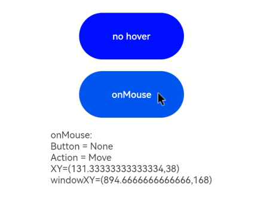

# Mouse Event

If a mouse action triggers multiple events, the order of these events is fixed. By default, mouse events are transmitted transparently.

>  **NOTE**
>
>  - The APIs of this module are supported since API version 8. Updates will be marked with a superscript to indicate their earliest API version.
>  - For the time being, a mouse event can be triggered only by an external mouse device.

## onHover

onHover(event: (isHover: boolean, event: HoverEvent) => void): T

Triggered when the mouse pointer enters or leaves the component.

**Atomic service API**: This API can be used in atomic services since API version 11.

**System capability**: SystemCapability.ArkUI.ArkUI.Full

**Parameters**

| Name             | Type                               | Mandatory| Description                                                        |
| ------------------- | ----------------------------------- | ---- | ------------------------------------------------------------ |
| isHover             | boolean                             | Yes  | Whether the mouse cursor hovers over the component. The value **true** means that the mouse cursor enters the component, and the value **false** means that the mouse cursor leaves the component.|
| event<sup>11+</sup> | [HoverEvent](#hoverevent11)| Yes  | Bubbling of the blocking event.                                      |

**Return value**

| Type| Description|
| -------- | -------- |
| T | Current component.|

## onMouse

onMouse(event: (event: MouseEvent) => void)

Triggered when the component is clicked by a mouse button or the mouse pointer moves on the component.

**Atomic service API**: This API can be used in atomic services since API version 11.

**System capability**: SystemCapability.ArkUI.ArkUI.Full

**Parameters**

| Name | Type                             | Mandatory| Description                                                        |
| ------- | --------------------------------- | ---- | ------------------------------------------------------------ |
| event | [MouseEvent](#mouseevent) | Yes  | Timestamp, mouse button, action, coordinates of the clicked point on the entire screen, and coordinates of the clicked point relative to the component when the event is triggered.|


## MouseEvent

Inherits from [BaseEvent](ts-gesture-customize-judge.md#baseevent).

**System capability**: SystemCapability.ArkUI.ArkUI.Full

| Name                    | Type                                    | Description                          |
| ---------------------- | ---------------------------------------- | ---------------------------- |
| x                      | number                                   | X coordinate of the mouse pointer relative to the upper left corner of the component being clicked.<br>**Atomic service API**: This API can be used in atomic services since API version 11.        |
| y                      | number                                   | Y coordinate of the mouse pointer relative to the upper left corner of the component being clicked.<br>**Atomic service API**: This API can be used in atomic services since API version 11.        |
| button                 | [MouseButton](ts-appendix-enums.md#mousebutton) | Mouse button.<br>**Atomic service API**: This API can be used in atomic services since API version 11.                       |
| action                 | [MouseAction](ts-appendix-enums.md#mouseaction) | Mouse action.<br>**Atomic service API**: This API can be used in atomic services since API version 11.                       |
| stopPropagation        | () => void                               | Stops the event from bubbling upwards or downwards.<br>**Atomic service API**: This API can be used in atomic services since API version 11.                     |
| target    | [EventTarget](ts-universal-events-click.md#eventtarget8) | Display area of the component that triggers the event.<br>**Atomic service API**: This API can be used in atomic services since API version 11.              |
| windowX<sup>10+</sup> | number                          | X coordinate of the mouse pointer relative to the upper left corner of the application window.<br>**Atomic service API**: This API can be used in atomic services since API version 11.|
| windowY<sup>10+</sup> | number                          | Y coordinate of the mouse pointer relative to the upper left corner of the application window.<br>**Atomic service API**: This API can be used in atomic services since API version 11.|
| displayX<sup>10+</sup> | number                         | X coordinate of the mouse pointer relative to the upper left corner of the application screen.<br>**Atomic service API**: This API can be used in atomic services since API version 11.|
| displayY<sup>10+</sup> | number                         | Y coordinate of the mouse pointer relative to the upper left corner of the application screen.<br>**Atomic service API**: This API can be used in atomic services since API version 11.|
| screenX<sup>(deprecated)</sup> | number                 | X coordinate of the mouse pointer relative to the upper left corner of the application window.<br>This API is deprecated since API version 10. You are advised to use **windowX** instead.|
| screenY<sup>(deprecated)</sup> | number                 | Y coordinate of the mouse pointer relative to the upper left corner of the application window.<br>This API is deprecated since API version 10. You are advised to use **windowY** instead.|

## HoverEvent<sup>11+</sup>

Inherits from [BaseEvent](ts-gesture-customize-judge.md#baseevent).

**Atomic service API**: This API can be used in atomic services since API version 11.

**System capability**: SystemCapability.ArkUI.ArkUI.Full

| Name             | Type      | Description     |
| --------------- | ---------- | ------- |
| stopPropagation | () => void | Stops the event from bubbling upwards or downwards.|

## Example

```ts
// xxx.ets
@Entry
@Component
struct MouseEventExample {
  @State hoverText: string = 'no hover';
  @State mouseText: string = '';
  @State action: string = '';
  @State mouseBtn: string = '';
  @State color: Color = Color.Blue;

  build() {
    Column({ space: 20 }) {
      Button(this.hoverText)
        .width(180).height(80)
        .backgroundColor(this.color)
        .onHover((isHover: boolean, event: HoverEvent) => {
          // Use the onHover event to dynamically change the text content and background color of a button when the mouse pointer is hovered on it.
          if (isHover) {
            this.hoverText = 'hover';
            this.color = Color.Pink;
          } else {
            this.hoverText = 'no hover';
            this.color = Color.Blue;
          }
        })
      Button('onMouse')
        .width(180).height(80)
        .onMouse((event: MouseEvent):void => {
          if(event){
            switch (event.button) {
              case MouseButton.None:
                this.mouseBtn = 'None';
                break;
              case MouseButton.Left:
                this.mouseBtn = 'Left';
                break;
              case MouseButton.Right:
                this.mouseBtn = 'Right';
                break;
              case MouseButton.Back:
                this.mouseBtn = 'Back';
                break;
              case MouseButton.Forward:
                this.mouseBtn = 'Forward';
                break;
              case MouseButton.Middle:
                this.mouseBtn = 'Middle';
                break;
            }
            switch (event.action) {
              case MouseAction.Hover:
                this.action = 'Hover';
                break;
              case MouseAction.Press:
                this.action = 'Press';
                break;
              case MouseAction.Move:
                this.action = 'Move';
                break;
              case MouseAction.Release:
                this.action = 'Release';
                break;
            }
            this.mouseText = 'onMouse:\nButton = ' + this.mouseBtn +
            '\nAction = ' + this.action + '\nXY=(' + event.x + ',' + event.y + ')' +
            '\nwindowXY=(' + event.windowX + ',' + event.windowY + ')';
          }
        })
      Text(this.mouseText)
    }.padding({ top: 30 }).width('100%')
  }
}
```

 

The figure below shows how the button looks like when hovered on.

  

The figure below shows how the button looks like when clicked.


