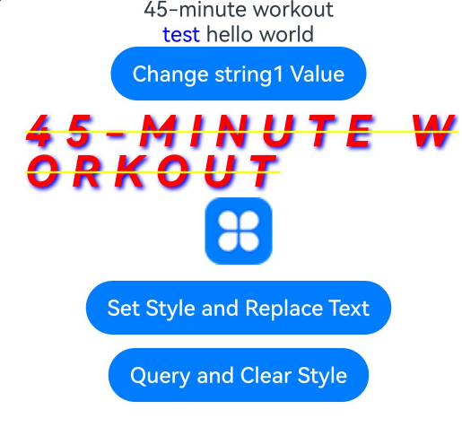
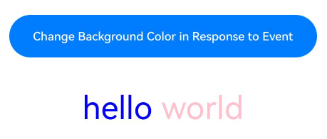
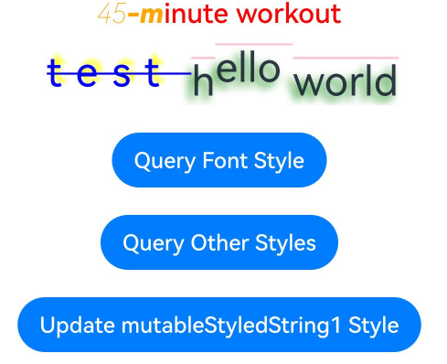
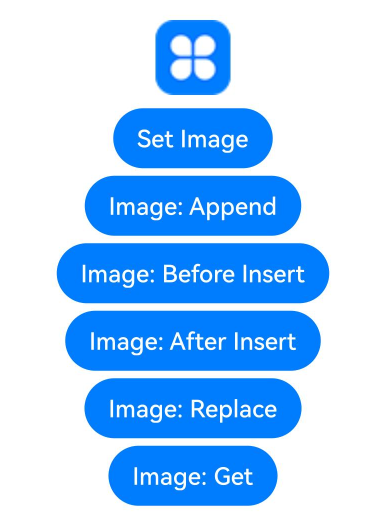
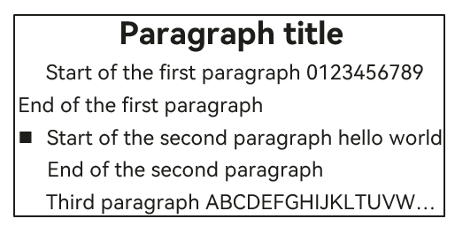

# Styled String

Styled strings are string objects that facilitate the flexible use of text styles. They can be bound to the **Text** component using the [setStyledString](./ts-basic-components-text.md#setstyledstring12) API in **TextController**, and to the **RichEditor** component using the [setStyledString](ts-basic-components-richeditor.md#setstyledstring12) API in **RichEditorStyledStringController**.

>  **NOTE**
>
>  The initial APIs of this module are supported since API version 12. Updates will be marked with a superscript to indicate their earliest API version.
>
>  Currently, styled strings cannot be used in worker threads.

## Rules of Use

* If a styled string conflicts with the current style settings in a component, the style set in the styled string takes effect.
* If a styled string conflicts with the child components in [Text](./ts-basic-components-text.md), the style set in the styled string is applied to the **Text** component, and style settings of the child components, including [Span](./ts-basic-components-span.md), are ignored.
* @State is not supported.
* To prevent the application from being inadvertently terminated while running in the background, define **StyledString** as a member variable.

## StyledString

constructor(value: string | ImageAttachment | CustomSpan , styles?: Array\<StyleOptions>)

**Atomic service API**: This API can be used in atomic services since API version 12.

**System capability**: SystemCapability.ArkUI.ArkUI.Full

**Parameters**

| Name| Type| Mandatory| Description|
| -------- | -------- | -------- | -------- |
| value | string \| [ImageAttachment](#imageattachment) \| [CustomSpan](#customspan) | Yes| Text of the styled string.<br>**NOTE**<br>If this parameter is of the ImageAttachment or CustomSpan type, the **styles** parameter does not take effect. |
| styles | Array<[StyleOptions](#styleoptions)> | No| Initialization options of the styled string.<br>**NOTE**<br>If **start** is set to an invalid value, it uses the default value **0**.<br>If the value of **start** is valid but that of **length** is invalid, the difference between the length of the styled string and the value of **start** is used as the value of **length**.<br>If **StyledStringKey** does not match **StyledStringValue**, it does not take effect.<br>The **styledKey** parameter has no default value.|

### Properties

**Atomic service API**: This API can be used in atomic services since API version 12.

**System capability**: SystemCapability.ArkUI.ArkUI.Full

| Name |   Type  |   Read Only  |   Optional  |   Description  |
| ------ | ------ | ------ | ------ | -------------- |
| length | number |  Yes  | No  | Length of the styled string.<br>**NOTE**<br>If the styled string contains an image or a custom span, its length is 1.|

### getString

getString(): string

Obtains the text of this styled string.

**Atomic service API**: This API can be used in atomic services since API version 12.

**System capability**: SystemCapability.ArkUI.ArkUI.Full

**Return value**

| Type             |Description      |
| ------- | --------------------------------- |
| string | Text of the styled string.<br>**NOTE**<br>If the styled string contains an image, the image is represented by a space in the return value.|

### equals

equals(other: StyledString): boolean

Checks whether this styled string the same as another styled string.

**Atomic service API**: This API can be used in atomic services since API version 12.

**System capability**: SystemCapability.ArkUI.ArkUI.Full

**Parameters**

| Name | Type                             | Mandatory| Description                                                        |
| ------- | --------------------------------- | ---- | ------------------------------------------------------------ |
| other | [StyledString](#styledstring) | Yes  | **StyledString** object to compare.|

**Return value**

| Type             |       Description      |
| ------- | --------------------------------- |
| boolean | Whether two styled strings are equal.<br>**NOTE**<br>The two styled strings are the same if they have the same text and style.<br>**GestureStyle** in styled strings is not compared. This means that, if two styled strings are the same except for the event configured, they are the same.<br>In comparing **CustomSpan** objects, addresses are compared. The objects that have the same address are the same.|

### subStyledString

subStyledString(start: number , length?: number): StyledString

Obtains a substring of this styled string.

**Atomic service API**: This API can be used in atomic services since API version 12.

**System capability**: SystemCapability.ArkUI.ArkUI.Full

**Parameters**

| Name | Type                             | Mandatory| Description                                                        |
| ------- | --------------------------------- | ---- | ------------------------------------------------------------ |
| start | number | Yes  | Subscript that corresponds to the start position of the styled substring.|
| length | number | No  | Length of the styled substring.|

**Return value**

| Type             |       Description      |
| ------- | --------------------------------- |
| [StyledString](#styledstring) | Styled substring.<br>**NOTE**<br>If the value of **start** is valid, the difference between the length of the styled string and the value of **start** is used as the default value of **length**.<br>If the values of **start** and **length** are out of the acceptable range or if any mandatory parameter is passed as **undefined**, an exception is thrown.|

**Error codes**

For details about the error codes, see [Universal Error Codes](../../errorcode-universal.md).

| ID| Error Message|
| ------- | -------- |
| 401      | Parameter error. Possible causes: 1. Mandatory parameters are left unspecified; 2.Incorrect parameters types; 3. Parameter verification failed.   |

### getStyles

getStyles(start: number , length: number , styledKey?: StyledStringKey): Array\<SpanStyle>

Obtains the styles in the specified range of a styled string.

**Atomic service API**: This API can be used in atomic services since API version 12.

**System capability**: SystemCapability.ArkUI.ArkUI.Full

**Parameters**

| Name | Type                             | Mandatory| Description                                                        |
| ------- | --------------------------------- | ---- | ------------------------------------------------------------ |
| start | number | Yes  | Subscript that corresponds to the target range in the styled string.|
| length | number | Yes  | Length of the target range in the styled string.|
| styledKey | [StyledStringKey](#styledstringkey12) | No  | Style key of the styled string.|

**Return value**

| Type             |       Description      |
| ------- | --------------------------------- |
| Array<[SpanStyle](#spanstyle)> | Array of styles.<br>**NOTE**<br>If no style is set for the specified range in the styled string, an empty array is returned.<br>If the values of **start** and **length** are out of the acceptable range or if any mandatory parameter is passed as **undefined**, an exception is thrown.<br>If **styledKey** is set to an invalid value or **undefined**, an exception is thrown.<br>If **styledKey** is a **CustomSpan** object, the style returned is the one passed to create the object. That is, modifying the style object also affects the actual display effect.|

**Error codes**

For details about the error codes, see [Universal Error Codes](../../errorcode-universal.md).

| ID| Error Message|
| ------- | -------- |
| 401      | Parameter error. Possible causes: 1. Mandatory parameters are left unspecified; 2.Incorrect parameters types; 3. Parameter verification failed.   |

### fromHtml

static fromHtml(html: string): Promise\<StyledString>

Converts an HTML-formatted string into a styled string. Currently, the conversion supports the following HTML tags: **\<p>**, **\<span>**, **\**. Only the styles defined by the **style** attributes of these tags can be converted into corresponding styles in styled strings.

**Atomic service API**: This API can be used in atomic services since API version 12.

**System capability**: SystemCapability.ArkUI.ArkUI.Full

**Parameters**

| Name | Type                             | Mandatory| Description                                                        |
| ------- | --------------------------------- | ---- | ------------------------------------------------------------ |
| html | string | Yes  | HTML-formatted string.|

**Return value**

| Type             |       Description      |
| ------- | --------------------------------- |
| [StyledString](#styledstring) | Styled string.|

**Error codes**

For details about the error codes, see [Universal Error Codes](../../errorcode-universal.md).

| ID| Error Message|
| ------- | -------- |
| 401      | Parameter error. Possible causes: 1. Mandatory parameters are left unspecified; 2.Incorrect parameters types; 3. Parameter verification failed.   |

### toHtml<sup>14+</sup>

static toHtml(styledString: StyledString): string

Converts a styled string into an HTML-formatted string. The supported styled string keys for conversion, as detailed in [StyledStringKey](#styledstringkey12), include: **StyledStringKey.FONT**, **StyledStringKey.DECORATION**, **StyledStringKey.LETTER_SPACING**, **StyledStringKey.TEXT_SHADOW**, **StyledStringKey.LINE_HEIGHT**, and **StyledStringKey.IMAGE**.

**Atomic service API**: This API can be used in atomic services since API version 14.

**System capability**: SystemCapability.ArkUI.ArkUI.Full

**Parameters**

| Name | Type                             | Mandatory| Description                                                        |
| ------- | --------------------------------- | ---- | ------------------------------------------------------------ |
| styledString | StyledString | Yes  | Styled string.|

**Return value**

| Type             |       Description      |
| ------- | --------------------------------- |
| string | HTML string.|

**Error codes**

For details about the error codes, see [Universal Error Codes](../../errorcode-universal.md).

| ID| Error Message|
| ------- | -------- |
| 401      | Parameter error. Possible causes: 1. Mandatory parameters are left unspecified; 2.Incorrect parameters types; 3. Parameter verification failed.   |

## MutableStyledString

Inherits from the [StyledString](#styledstring) class.

>  **An exception is thrown in the following cases:**
>
> The values of **start** and **length** are out of the acceptable range or if any mandatory parameter is passed as **undefined**.
>
> **styledKey** or **styledValue** is set to an invalid value or they do not match.
> 

### replaceString

replaceString(start: number , length: number , other: string): void

Replaces the string in the specified range of this styled string.

**Atomic service API**: This API can be used in atomic services since API version 12.

**System capability**: SystemCapability.ArkUI.ArkUI.Full

**Parameters**

| Name | Type                             | Mandatory| Description                                                        |
| ------- | --------------------------------- | ---- | ------------------------------------------------------------ |
| start | number | Yes  | Subscript of the target range.|
| length | number | Yes  | Length of the target range.|
| other | string | Yes  | String to replace the content in the target range.<br>**NOTE**<br>The string specified here uses the style of the character at the **start** position.|

**Error codes**

For details about the error codes, see [Universal Error Codes](../../errorcode-universal.md).

| ID| Error Message|
| ------- | -------- |
| 401      | Parameter error. Possible causes: 1. Mandatory parameters are left unspecified; 2.Incorrect parameters types; 3. Parameter verification failed.   |

### insertString

insertString(start: number , other: string): void

Inserts a string.

**Atomic service API**: This API can be used in atomic services since API version 12.

**System capability**: SystemCapability.ArkUI.ArkUI.Full

**Parameters**

| Name | Type                             | Mandatory| Description                                                        |
| ------- | --------------------------------- | ---- | ------------------------------------------------------------ |
| start | number | Yes  | Subscript of the position where the string will be inserted.|
| other | string | Yes  | String to insert.<br>**NOTE**<br>The string specified here uses the style of the character at the **start** - 1 position or, if that character does not have style set, the style of the character at the **start** position.|

**Error codes**

For details about the error codes, see [Universal Error Codes](../../errorcode-universal.md).

| ID| Error Message|
| ------- | -------- |
| 401      | Parameter error. Possible causes: 1. Mandatory parameters are left unspecified; 2.Incorrect parameters types; 3. Parameter verification failed.   |

### removeString

removeString(start: number , length: number): void

Removes the string in the specified range of this styled string.

This API equally works when the styled string contains an image.

**Atomic service API**: This API can be used in atomic services since API version 12.

**System capability**: SystemCapability.ArkUI.ArkUI.Full

**Parameters**

| Name | Type                             | Mandatory| Description                                                        |
| ------- | --------------------------------- | ---- | ------------------------------------------------------------ |
| start | number | Yes  | Subscript of the target range.|
| length | number | Yes  | Length of the target range.|

**Error codes**

For details about the error codes, see [Universal Error Codes](../../errorcode-universal.md).

| ID| Error Message|
| ------- | -------- |
| 401      | Parameter error. Possible causes: 1. Mandatory parameters are left unspecified; 2.Incorrect parameters types; 3. Parameter verification failed.   |

### replaceStyle

replaceStyle(spanStyle: SpanStyle): void

Replaces the style in the specified range of this styled string.

**Atomic service API**: This API can be used in atomic services since API version 12.

**System capability**: SystemCapability.ArkUI.ArkUI.Full

**Parameters**

| Name | Type                             | Mandatory| Description                                                        |
| ------- | --------------------------------- | ---- | ------------------------------------------------------------ |
| spanStyle | [SpanStyle](#spanstyle) | Yes  | Style object.<br>**NOTE**<br>By default, the original style is removed and replaced with the new style.<br>If **styledKey** of **SpanStyle** is **IMAGE** or **CUSTOM_SPAN**, this API takes effect only when an image or custom span with the length of 1 is at the **start** position.|

**Error codes**

For details about the error codes, see [Universal Error Codes](../../errorcode-universal.md).

| ID| Error Message|
| ------- | -------- |
| 401      | Parameter error. Possible causes: 1. Mandatory parameters are left unspecified; 2.Incorrect parameters types; 3. Parameter verification failed.   |

### setStyle

setStyle(spanStyle: SpanStyle): void

Sets a new style for the specified range of this styled string.

**Atomic service API**: This API can be used in atomic services since API version 12.

**System capability**: SystemCapability.ArkUI.ArkUI.Full

**Parameters**

| Name | Type                             | Mandatory| Description                                                        |
| ------- | --------------------------------- | ---- | ------------------------------------------------------------ |
| spanStyle | [SpanStyle](#spanstyle) | Yes  | Style object.<br>**NOTE**<br>By default, the new style is applied without removing the original style. If the style already exists, it is updated.<br>If **styledKey** of **SpanStyle** is **IMAGE** or **CUSTOM_SPAN**, this API takes effect only when an image or custom span with the length of 1 is at the **start** position.|

**Error codes**

For details about the error codes, see [Universal Error Codes](../../errorcode-universal.md).

| ID| Error Message|
| ------- | -------- |
| 401      |The parameter check failed.   |

### removeStyle

removeStyle(start: number , length: number , styledKey: StyledStringKey): void

Removes the style for the specified range of this styled string.

After a style is removed, the value set for the corresponding style attribute in the [Text](./ts-basic-components-text.md) component is used. If the value is not set, the default value is used.

This API equally works when the styled string contains an image.

**Atomic service API**: This API can be used in atomic services since API version 12.

**System capability**: SystemCapability.ArkUI.ArkUI.Full

**Parameters**

| Name | Type                             | Mandatory| Description                                                        |
| ------- | --------------------------------- | ---- | ------------------------------------------------------------ |
| start | number | Yes  | Subscript that corresponds to the start position of the target range.|
| length | number | Yes  | Length of the target range.|
| styledKey | [StyledStringKey](#styledstringkey12) | Yes  | Styled key.|

**Error codes**

For details about the error codes, see [Universal Error Codes](../../errorcode-universal.md).

| ID| Error Message|
| ------- | -------- |
| 401      | Parameter error. Possible causes: 1. Mandatory parameters are left unspecified; 2.Incorrect parameters types; 3. Parameter verification failed.   |

### removeStyles

removeStyles(start: number , length: number): void

Removes all styles for the specified range of this styled string.

After a style is removed, the value set for the corresponding style attribute in the [Text](./ts-basic-components-text.md) component is used. If the value is not set, the default value is used.

This API equally works when the styled string contains an image.

**Atomic service API**: This API can be used in atomic services since API version 12.

**System capability**: SystemCapability.ArkUI.ArkUI.Full

**Parameters**

| Name | Type                             | Mandatory| Description                                                        |
| ------- | --------------------------------- | ---- | ------------------------------------------------------------ |
| start | number | Yes  | Subscript that corresponds to the start position of the target range.|
| length | number | Yes  | Length of the target range.|

**Error codes**

For details about the error codes, see [Universal Error Codes](../../errorcode-universal.md).

| ID| Error Message|
| ------- | -------- |
| 401      | Parameter error. Possible causes: 1. Mandatory parameters are left unspecified; 2.Incorrect parameters types; 3. Parameter verification failed.   |

### clearStyles

clearStyles(): void

Removes all styles of this styled string.

After a style is removed, the value set for the corresponding style attribute in the [Text](./ts-basic-components-text.md) component is used. If the value is not set, the default value is used.

**Atomic service API**: This API can be used in atomic services since API version 12.

**System capability**: SystemCapability.ArkUI.ArkUI.Full

### replaceStyledString

replaceStyledString(start: number , length: number , other: StyledString): void

Replaces the styled string in the specified range.

**Atomic service API**: This API can be used in atomic services since API version 12.

**System capability**: SystemCapability.ArkUI.ArkUI.Full

**Parameters**

| Name | Type                             | Mandatory| Description                                                        |
| ------- | --------------------------------- | ---- | ------------------------------------------------------------ |
| start | number | Yes  | Subscript that corresponds to the start position of the target range.|
| length | number | Yes  | Length of the target range.|
| other | [StyledString](#styledstring) | Yes  | New styled string.|

**Error codes**

For details about the error codes, see [Universal Error Codes](../../errorcode-universal.md).

| ID| Error Message|
| ------- | -------- |
| 401      | Parameter error. Possible causes: 1. Mandatory parameters are left unspecified; 2.Incorrect parameters types; 3. Parameter verification failed.   |

### insertStyledString

insertStyledString(start: number , other: StyledString): void

Inserts a new styled string at the specified position.

**Atomic service API**: This API can be used in atomic services since API version 12.

**System capability**: SystemCapability.ArkUI.ArkUI.Full

**Parameters**

| Name | Type                             | Mandatory| Description                                                        |
| ------- | --------------------------------- | ---- | ------------------------------------------------------------ |
| start | number | Yes  | Subscript of the position to insert the styled string.|
| other | [StyledString](#styledstring) | Yes  | New styled string.|

**Error codes**

For details about the error codes, see [Universal Error Codes](../../errorcode-universal.md).

| ID| Error Message|
| ------- | -------- |
| 401      | Parameter error. Possible causes: 1. Mandatory parameters are left unspecified; 2.Incorrect parameters types; 3. Parameter verification failed.   |

### appendStyledString

appendStyledString(other: StyledString): void

Appends a styled string.

**Atomic service API**: This API can be used in atomic services since API version 12.

**System capability**: SystemCapability.ArkUI.ArkUI.Full

**Parameters**

| Name | Type                             | Mandatory| Description                                                        |
| ------- | --------------------------------- | ---- | ------------------------------------------------------------ |
| other | [StyledString](#styledstring) | Yes  | New styled string.|

## StyleOptions

**Atomic service API**: This API can be used in atomic services since API version 12.

**System capability**: SystemCapability.ArkUI.ArkUI.Full

| Name | Type                             | Mandatory| Description  |
| ------- | --------------------------------- | ---- | --------------------------------- |
| start | number | No  | Start position of the styled string style.|
| length | number | No  | Length of the styled string style.|
| styledKey | [StyledStringKey](#styledstringkey12) | Yes  | Style key.|
| styledValue | [StyledStringValue](ts-types.md#styledstringvalue12) | Yes  | Style object.|

## SpanStyle

**Atomic service API**: This API can be used in atomic services since API version 12.

**System capability**: SystemCapability.ArkUI.ArkUI.Full

| Name | Type                             | Mandatory| Description  |
| ------- | --------------------------------- | ---- | --------------------------------- |
| start | number | Yes  | Start position of the styled string style.|
| length | number | Yes  | Length of the styled string style.|
| styledKey | [StyledStringKey](#styledstringkey12) | Yes  | Style key.|
| styledValue | [StyledStringValue](ts-types.md#styledstringvalue12) | Yes  | Style object.|

## TextStyle

Describes the text font style.

**System capability**: SystemCapability.ArkUI.ArkUI.Full

### Properties

**Atomic service API**: This API can be used in atomic services since API version 12.

**System capability**: SystemCapability.ArkUI.ArkUI.Full

| Name          | Type             | Read Only  | Optional  | Description    |
| ------------ |---------------------| ---- | ---- | ------ |
| fontColor  | [ResourceColor](ts-types.md#resourcecolor) |  Yes |  Yes | Font color of the styled string.|
| fontFamily | string   | Yes   | Yes  | Font family of the styled string.|
| fontSize   | number   | Yes   | Yes   | Font size of the styled string.<br>Unit: fp|
| fontWeight   | number   | Yes   | Yes   | Font weight of the styled string.|
| fontStyle   | [FontStyle](ts-appendix-enums.md#fontstyle) | Yes   | Yes   | Font style of the styled string.|

### constructor

constructor(value?: TextStyleInterface)

**Atomic service API**: This API can be used in atomic services since API version 12.

**System capability**: SystemCapability.ArkUI.ArkUI.Full

**Parameters**

| Name | Type                             | Mandatory| Description  |
| ------- | --------------------------------- | ---- | --------------------------------- |
| value | [TextStyleInterface](#textstyleinterface) | No  | Font style options.|

## TextStyleInterface

**Atomic service API**: This API can be used in atomic services since API version 12.

**System capability**: SystemCapability.ArkUI.ArkUI.Full

| Name | Type                             | Mandatory| Description  |
| ------- | --------------------------------- | ---- | --------------------------------- |
| fontColor | [ResourceColor](ts-types.md#resourcecolor) | No  | Font color.|
| fontFamily | [ResourceStr](ts-types.md#resourcestr) | No  | Font family.|
| fontSize | [LengthMetrics](../js-apis-arkui-graphics.md#lengthmetrics12) | No  | Font size. If **unit** of **LengthMetrics** is percent, the setting does not take effect, and 16 fp is used.|
| fontWeight | number \| [FontWeight](ts-appendix-enums.md#fontweight) \| string | No  | Font weight.|
| fontStyle | [FontStyle](ts-appendix-enums.md#fontstyle) | No  | Font style.|

## GestureStyle

Describes the event gesture style.

**System capability**: SystemCapability.ArkUI.ArkUI.Full

### constructor

constructor(value?: GestureStyleInterface)

**Atomic service API**: This API can be used in atomic services since API version 12.

**System capability**: SystemCapability.ArkUI.ArkUI.Full

**Parameters**

| Name | Type                             | Mandatory| Description  |
| ------- | --------------------------------- | ---- | --------------------------------- |
| value | [GestureStyleInterface](#gesturestyleinterface) | No  | Event options.|

## GestureStyleInterface

**Atomic service API**: This API can be used in atomic services since API version 12.

**System capability**: SystemCapability.ArkUI.ArkUI.Full

| Name | Type                             | Mandatory| Description  |
| ------- | --------------------------------- | ---- | --------------------------------- |
| onClick | Callback\<[ClickEvent](ts-universal-events-click.md#clickevent)> | No  | Callback for click events.|
| onLongPress | Callback\<[GestureEvent](./ts-gesture-settings.md#gestureevent)> | No  | Callback for long press events.|

## DecorationStyle

Describes the text decorative line style.

**System capability**: SystemCapability.ArkUI.ArkUI.Full

### Properties

**Atomic service API**: This API can be used in atomic services since API version 12.

**System capability**: SystemCapability.ArkUI.ArkUI.Full

| Name          | Type             | Read Only  |Optional  | Description    |
| ------------ |---------------------| ---- | ---- | ------ |
| type  | [TextDecorationType](ts-appendix-enums.md#textdecorationtype) |  Yes |  No | Type of the text decorative line.|
| color | [ResourceColor](ts-types.md#resourcecolor)   | Yes   | Yes | Color of the text decorative line.|
| style | [TextDecorationStyle](ts-appendix-enums.md#textdecorationstyle12) | Yes   |Yes | Style of the text decorative line.|

### constructor

constructor(value: DecorationStyleInterface)

**Atomic service API**: This API can be used in atomic services since API version 12.

**System capability**: SystemCapability.ArkUI.ArkUI.Full

**Parameters**

| Name | Type                             | Mandatory| Description  |
| ------- | --------------------------------- | ---- | --------------------------------- |
| value | [DecorationStyleInterface](#decorationstyleinterface) | Yes  | Text decorative line options.|

## DecorationStyleInterface

**Atomic service API**: This API can be used in atomic services since API version 12.

**System capability**: SystemCapability.ArkUI.ArkUI.Full

| Name | Type                             | Mandatory| Description  |
| ------- | --------------------------------- | ---- | --------------------------------- |
| type | [TextDecorationType](ts-appendix-enums.md#textdecorationtype) | Yes  | Type of the text decorative line.|
| color | [ResourceColor](ts-types.md#resourcecolor) | No  | Color of the text decorative line.|
| style | [TextDecorationStyle](ts-appendix-enums.md#textdecorationstyle12) | No  | Style of the text decorative line.|

## BaselineOffsetStyle

Describes the text baseline offset style.

**System capability**: SystemCapability.ArkUI.ArkUI.Full

### Properties

**Atomic service API**: This API can be used in atomic services since API version 12.

**System capability**: SystemCapability.ArkUI.ArkUI.Full

| Name          | Type             | Read Only  | Optional  | Description    |
| ------------ |---------------------| ---- | ---- | ------ |
| baselineOffset  | number |  Yes |  No| Text baseline offset.<br>Unit: vp|

### constructor

constructor(value: LengthMetrics)

**Atomic service API**: This API can be used in atomic services since API version 12.

**System capability**: SystemCapability.ArkUI.ArkUI.Full

**Parameters**

| Name | Type                             | Mandatory| Description  |
| ------- | --------------------------------- | ---- | --------------------------------- |
| value | [LengthMetrics](../js-apis-arkui-graphics.md#lengthmetrics12) | Yes  | Text baseline offset options. This API does not work if **unit** of **LengthMetrics** is percent.|

## LetterSpacingStyle

Describes the letter spacing style.

**System capability**: SystemCapability.ArkUI.ArkUI.Full

### Properties

**Atomic service API**: This API can be used in atomic services since API version 12.

**System capability**: SystemCapability.ArkUI.ArkUI.Full

| Name          | Type             | Read Only  | Optional  | Description    |
| ------------ |---------------------| ---- | ---- | ------ |
| letterSpacing  | number |  Yes |  No | Letter spacing.<br>Unit: vp|

### constructor

constructor(value: LengthMetrics)

**Atomic service API**: This API can be used in atomic services since API version 12.

**System capability**: SystemCapability.ArkUI.ArkUI.Full

**Parameters**

| Name | Type                             | Mandatory| Description  |
| ------- | --------------------------------- | ---- | --------------------------------- |
| value | [LengthMetrics](../js-apis-arkui-graphics.md#lengthmetrics12) | Yes  | Letter spacing options. This API does not work if **unit** of **LengthMetrics** is percent.|

## LineHeightStyle

Describes the text line height style.

**System capability**: SystemCapability.ArkUI.ArkUI.Full

### Properties

**Atomic service API**: This API can be used in atomic services since API version 12.

**System capability**: SystemCapability.ArkUI.ArkUI.Full

| Name          | Type             | Read Only  | Optional  | Description    |
| ------------ |---------------------| ---- | ---- | ------ |
| lineHeight  | number |  Yes |  No | Text line height of the styled string.<br>Unit: vp|

### constructor

constructor(lineHeight: LengthMetrics)

**Atomic service API**: This API can be used in atomic services since API version 12.

**System capability**: SystemCapability.ArkUI.ArkUI.Full

**Parameters**

| Name | Type                             | Mandatory| Description  |
| ------- | --------------------------------- | ---- | --------------------------------- |
| lineHeight | [LengthMetrics](../js-apis-arkui-graphics.md#lengthmetrics12) | Yes  | Text line height options. If **value** of **LengthMetrics** is less than or equal to 0, the text line height is unlimited and automatically adapts to the font size.|

## TextShadowStyle

Describes the text shadow style.

**System capability**: SystemCapability.ArkUI.ArkUI.Full

### Properties

**Atomic service API**: This API can be used in atomic services since API version 12.

**System capability**: SystemCapability.ArkUI.ArkUI.Full

| Name          | Type             | Read Only  | Optional  | Description    |
| ------------ |---------------------| ---- | ---- | ------ |
| textShadow  | Array\<[ShadowOptions](ts-universal-attributes-image-effect.md#shadowoptions)> |  Yes |  No | Text shadow of the styled string.|

### constructor

constructor(value: ShadowOptions | Array\<ShadowOptions>)

**Atomic service API**: This API can be used in atomic services since API version 12.

**System capability**: SystemCapability.ArkUI.ArkUI.Full

**Parameters**

| Name | Type                             | Mandatory| Description  |
| ------- | --------------------------------- | ---- | --------------------------------- |
| value | [ShadowOptions](ts-universal-attributes-image-effect.md#shadowoptions) \| Array\<[ShadowOptions](ts-universal-attributes-image-effect.md#shadowoptions)>  | Yes  | Text shadow options.|

## ImageAttachment

Describes the image attachment.

**System capability**: SystemCapability.ArkUI.ArkUI.Full

### Properties

**Atomic service API**: This API can be used in atomic services since API version 12.

**System capability**: SystemCapability.ArkUI.ArkUI.Full

| Name          | Type             | Read Only  | Optional  | Description    |
| ------------ |---------------------| ---- | ---- | ------ |
| value  | [PixelMap](../../apis-image-kit/js-apis-image.md#pixelmap7) |  Yes |  No | Image data source of the styled string.|
| size  | [SizeOptions](ts-types.md#sizeoptions) |  Yes |  Yes | Image size of the styled string.|
| verticalAlign  | [ImageSpanAlignment](ts-basic-components-imagespan.md#imagespanalignment) |  Yes |  Yes | Image alignment mode of the styled string.|
| objectFit  | [ImageFit](ts-appendix-enums.md#imagefit) |  Yes |  Yes | Image scale type of the styled string.|
| layoutStyle  | [ImageAttachmentLayoutStyle](#imageattachmentlayoutstyle) |  Yes |  Yes | Image layout of the styled string.|

### constructor

constructor(value: ImageAttachmentInterface)

**Atomic service API**: This API can be used in atomic services since API version 12.

**System capability**: SystemCapability.ArkUI.ArkUI.Full

**Parameters**

| Name | Type                             | Mandatory| Description  |
| ------- | --------------------------------- | ---- | --------------------------------- |
| value | [ImageAttachmentInterface](#imageattachmentinterface) | Yes  | Image attachment options.|

## ImageAttachmentInterface

**Atomic service API**: This API can be used in atomic services since API version 12.

**System capability**: SystemCapability.ArkUI.ArkUI.Full

| Name | Type                             | Mandatory| Description  |
| ------- | --------------------------------- | ---- | --------------------------------- |
| value | [PixelMap](../../apis-image-kit/js-apis-image.md#pixelmap7) |  Yes | Image data source.|
| size | [SizeOptions](ts-types.md#sizeoptions) | No  | Image size.|
| verticalAlign | [ImageSpanAlignment](ts-basic-components-imagespan.md#imagespanalignment) | No  | Alignment mode of the image with the text.|
| objectFit | [ImageFit](ts-appendix-enums.md#imagefit) | No  | Image scale type.|
| layoutStyle | [ImageAttachmentLayoutStyle](#imageattachmentlayoutstyle) | No  | Image layout.|

## ImageAttachmentLayoutStyle

**Atomic service API**: This API can be used in atomic services since API version 12.

**System capability**: SystemCapability.ArkUI.ArkUI.Full

| Name | Type                             | Mandatory| Description  |
| ------- | --------------------------------- | ---- | --------------------------------- |
| margin | [LengthMetrics](../js-apis-arkui-graphics.md#lengthmetrics12) \| [Margin](ts-types.md#margin) | No  | Image margin.|
| padding | [LengthMetrics](../js-apis-arkui-graphics.md#lengthmetrics12) \| [Padding](ts-types.md#padding) | No  | Image padding.|
| borderRadius | [LengthMetrics](../js-apis-arkui-graphics.md#lengthmetrics12) \| [BorderRadiuses](ts-types.md#borderradiuses9) | No  | Radius of the image border corners.|

## CustomSpan

Describes the custom span. Only the base class is provided. You need to define the specific implementation.

The drag preview of a custom span is blank.

**System capability**: SystemCapability.ArkUI.ArkUI.Full

### onMeasure

abstract onMeasure(measureInfo: CustomSpanMeasureInfo): CustomSpanMetrics

Called to obtain the size of a custom span.

**Atomic service API**: This API can be used in atomic services since API version 12.

**System capability**: SystemCapability.ArkUI.ArkUI.Full

**Parameters**

| Name | Type                             | Mandatory| Description                                                        |
| ------- | --------------------------------- | ---- | ------------------------------------------------------------ |
| measureInfo | [CustomSpanMeasureInfo](#customspanmeasureinfo) | Yes  | Font size of the text.|

**Return value**

| Type             |       Description      |
| ------- | --------------------------------- |
| [CustomSpanMetrics](#customspanmetrics) | Size of the custom span.<br>**NOTE**<br>The final height of the custom span is subject to the line height of the **Text** component. If no value is specified for **height**, the custom span takes the **fontSize** value of the **Text** component as its height. If the value specified is greater than the height of other child components on the same line, the custom span takes the line height of the **Text** component as its height.|

### onDraw

abstract onDraw(context: DrawContext, drawInfo: CustomSpanDrawInfo): void

Called to draw a custom span.

**Atomic service API**: This API can be used in atomic services since API version 12.

**System capability**: SystemCapability.ArkUI.ArkUI.Full

**Parameters**

| Name | Type                             | Mandatory| Description                                                        |
| ------- | --------------------------------- | ---- | ------------------------------------------------------------ |
| context | [DrawContext](../js-apis-arkui-graphics.md#drawcontext) | Yes  | Drawing context.<br>**NOTE**<br>The **canvas** method of **DrawContext** obtains the canvas of the **Text** component. As such, the custom span does not extend beyond the area of the **Text** component.|
| drawInfo | [CustomSpanDrawInfo](#customspandrawinfo) | Yes  | Drawing information of the custom span.|

### invalidate<sup>13+<sup>

invalidate(): void

Manually triggers a refresh of the **Text** component that uses this **CustomSpan**.

**Atomic service API**: This API can be used in atomic services since API version 13.

**System capability**: SystemCapability.ArkUI.ArkUI.Full

## CustomSpanMeasureInfo

**Atomic service API**: This API can be used in atomic services since API version 12.

**System capability**: SystemCapability.ArkUI.ArkUI.Full

| Name | Type                             | Mandatory| Description  |
| ------- | --------------------------------- | ---- | --------------------------------- |
| fontSize | number |  Yes | Text font size.<br>Unit: fp|

## CustomSpanMetrics

**Atomic service API**: This API can be used in atomic services since API version 12.

**System capability**: SystemCapability.ArkUI.ArkUI.Full

| Name | Type                             | Mandatory| Description  |
| ------- | --------------------------------- | ---- | --------------------------------- |
| width | number |  Yes | Width of the custom span.<br>Unit: vp|
| height | number |  No | Height of the custom span.<br>Unit: vp|

## CustomSpanDrawInfo

**Atomic service API**: This API can be used in atomic services since API version 12.

**System capability**: SystemCapability.ArkUI.ArkUI.Full

| Name | Type                             | Mandatory| Description  |
| ------- | --------------------------------- | ---- | --------------------------------- |
| x | number |  Yes | Offset of the custom span relative to the mounted component.<br>Unit: px|
| lineTop | number |  Yes | Top margin of the custom span relative to the **Text** component.<br>Unit: px|
| lineBottom | number |  Yes | Bottom margin of the custom span relative to the **Text** component.<br>Unit: px|
| baseline | number |  Yes | Baseline offset of the line where the custom span is located.<br>Unit: px|

## ParagraphStyle

Describes the text paragraph style.

Except the first paragraph, all paragraphs are formed using the character escape '\n'.

The style of a paragraph is the one (if any) set for the first element or the paragraph style of the bound component.

**System capability**: SystemCapability.ArkUI.ArkUI.Full

### Properties

**Atomic service API**: This API can be used in atomic services since API version 12.

**System capability**: SystemCapability.ArkUI.ArkUI.Full

| Name          | Type             | Read Only  | Optional  | Description    |
| ------------ |---------------------| ---- | ---- | ------ |
| textAlign  | [TextAlign](ts-appendix-enums.md#textalign) |  Yes |  Yes | Horizontal alignment of the text paragraph.|
| textIndent | number   | Yes   | Yes   | First line indent of the text paragraph.|
| maxLines   | number   | Yes   | Yes   | Maximum number of lines in the text paragraph.|
| overflow   | [TextOverflow](ts-appendix-enums.md#textoverflow)   | Yes   | Yes  | Display mode when the text is too long in the text paragraph.|
| wordBreak   | [WordBreak](ts-appendix-enums.md#wordbreak11) | Yes   | Yes   | Word break rule of the text paragraph.|
| leadingMargin   | number \| [LeadingMarginPlaceholder](ts-basic-components-richeditor.md#leadingmarginplaceholder11) | Yes   | Yes  | Indent of the text paragraph.|

>  **NOTE**
>
>  As the **maxLines** and **overflow** attributes of the styled string take effect only in the **Text** component, you are advised to set them in the component.

### constructor

constructor(value?: ParagraphStyleInterface)

**Atomic service API**: This API can be used in atomic services since API version 12.

**System capability**: SystemCapability.ArkUI.ArkUI.Full

**Parameters**

| Name | Type                             | Mandatory| Description  |
| ------- | --------------------------------- | ---- | --------------------------------- |
| value | [ParagraphStyleInterface](#paragraphstyleinterface) | No  | Paragraph style options.|

## ParagraphStyleInterface

**Atomic service API**: This API can be used in atomic services since API version 12.

**System capability**: SystemCapability.ArkUI.ArkUI.Full

| Name | Type                             | Mandatory| Description  |
| ------- | --------------------------------- | ---- | --------------------------------- |
| textAlign  | [TextAlign](ts-appendix-enums.md#textalign) |  No | Horizontal alignment of the text paragraph.|
| textIndent | [LengthMetrics](../js-apis-arkui-graphics.md#lengthmetrics12)   | No   | First line indent of the text paragraph.|
| maxLines   | number   | No   | Maximum number of lines in the text paragraph.|
| overflow   | [TextOverflow](ts-appendix-enums.md#textoverflow)   |  No   | Display mode when the text is too long in the text paragraph.<br>This parameter must be used with **maxLines** for the settings to take effect. **TextOverflow.MARQUEE** is not supported.|
| wordBreak   | [WordBreak](ts-appendix-enums.md#wordbreak11) | No   | Word break rule of the text paragraph.|
| leadingMargin   | [LengthMetrics](../js-apis-arkui-graphics.md#lengthmetrics12) \| [LeadingMarginPlaceholder](ts-basic-components-richeditor.md#leadingmarginplaceholder11) | No   | Indent of the text paragraph.|

## UserDataSpan

Implements a **UserDataSpan** object for storing and obtaining user data. Only the base class is provided. You need to define the specific implementation.

The extended user data does not affect the display effect.

**Atomic service API**: This API can be used in atomic services since API version 12.

**System capability**: SystemCapability.ArkUI.ArkUI.Full

## StyledStringKey<sup>12+</sup>

**Atomic service API**: This API can be used in atomic services since API version 12.

**System capability**: SystemCapability.ArkUI.ArkUI.Full

| Name    |Description                          |
| ------ | ----------------------------- |
| FONT | Font style key, applicable to [TextStyle](./ts-universal-styled-string.md#textstyle).|
| DECORATION | Text decorative line style key, applicable to [DecorationStyle](./ts-universal-styled-string.md#decorationstyle).|
| BASELINE_OFFSET | Text baseline offset style key, applicable to [BaselineOffsetStyle](./ts-universal-styled-string.md#baselineoffsetstyle).|
| LETTER_SPACING | Text letter spacing style key, applicable to [LetterSpacingStyle](./ts-universal-styled-string.md#letterspacingstyle).|
| LINE_HEIGHT | Text line height style key, applicable to [LineHeightStyle](./ts-universal-styled-string.md#lineheightstyle).|
| TEXT_SHADOW | Text shadow style key, applicable to [TextShadowStyle](./ts-universal-styled-string.md#textshadowstyle).|
| BACKGROUND_COLOR<sup>14+</sup> | Text background color style key, applicable to [BackgroundColorStyle](./ts-universal-styled-string.md#backgroundcolorstyle14).|
| URL<sup>14+</sup> | Hyperlink style key, applicable to [UrlStyle](./ts-universal-styled-string.md#urlstyle14).|
| GESTURE | Gesture key, applicable to [GestureStyle](./ts-universal-styled-string.md#gesturestyle).|
| PARAGRAPH_STYLE | Paragraph style key, applicable to [ParagraphStyle](./ts-universal-styled-string.md#paragraphstyle).|
| IMAGE | Image key, applicable to [ImageAttachment](./ts-universal-styled-string.md#imageattachment).|
| CUSTOM_SPAN | Custom span key, applicable to [CustomSpan](./ts-universal-styled-string.md#customspan).|
| USER_DATA | User data span key, applicable to [UserDataSpan](./ts-universal-styled-string.md#userdataspan).|

## BackgroundColorStyle<sup>14+</sup>

Describes the text background color style.

**System capability**: SystemCapability.ArkUI.ArkUI.Full

### Properties

**Atomic service API**: This API can be used in atomic services since API version 14.

**System capability**: SystemCapability.ArkUI.ArkUI.Full

| Name          | Type             | Read Only  | Mandatory  | Description    |
| ------------ |---------------------| ---- | ---- | ------ |
| textBackgroundStyle  |  [TextBackgroundStyle](ts-basic-components-span.md#textbackgroundstyle11)  |  Yes |  Yes | Text background color of the styled string.<br>Default value:<br>{<br> color: Color.Transparent,<br>  radius: 0<br>} |

### constructor<sup>14+</sup>

constructor(textBackgroundStyle: TextBackgroundStyle)

**Atomic service API**: This API can be used in atomic services since API version 14.

**System capability**: SystemCapability.ArkUI.ArkUI.Full

**Parameters**

| Name | Type                             | Mandatory| Description  |
| ------- | --------------------------------- | ---- | --------------------------------- |
| textBackgroundStyle |  [TextBackgroundStyle](ts-basic-components-span.md#textbackgroundstyle11) | Yes  | Options of the text background color.<br>Default value:<br>{<br>  color: Color.Transparent,<br>  radius: 0<br>} |

## UrlStyle<sup>14+</sup>

Describes the hyperlink style.

The default color, font size, and font weight are **'#ff0a59f7'**, **'16fp'**, and **'FontWeight.Regular'**, respectively. If the styled string has **TextStyle** set, the **TextStyle** settings take precedence.

**System capability**: SystemCapability.ArkUI.ArkUI.Full

### Properties

**Atomic service API**: This API can be used in atomic services since API version 14.

**System capability**: SystemCapability.ArkUI.ArkUI.Full

| Name          | Type             | Read Only  | Mandatory  | Description    |
| ------------ |---------------------| ---- | ---- | ------ |
| url  | string |  Yes |  Yes | Hyperlink content of the styled string.|

### constructor<sup>14+</sup>

constructor(url: string)

**Atomic service API**: This API can be used in atomic services since API version 14.

**System capability**: SystemCapability.ArkUI.ArkUI.Full

**Parameters**

| Name | Type                             | Mandatory| Description  |
| ------- | --------------------------------- | ---- | --------------------------------- |
| url | string | Yes  | Options of the hyperlink.|

## Example

### Example 1: Processing Styled Strings

This example shows how to perform insertion, deletion, replacement, and viewing of styled strings using the **insertString**, **removeStyles**, **replaceStyle**, and **getStyles** APIs.

```ts
// xxx.ets
@Entry
@Component
struct styled_string_demo1 {
  @State height1: number = 450;
  @State fontSize1: number = 16;
  @State fontWeight1: number = 400;
  @State color1: Color = Color.Blue;
  scroll: Scroller = new Scroller();
  fontStyleAttr1: TextStyle = new TextStyle({ fontColor: Color.Blue });
  fontStyleAttr2: StyledStringValue = new TextStyle({ fontColor: Color.Orange });
  // Create a readable and writable styled string object: mutableStyledString1.
  mutableStyledString1: MutableStyledString = new MutableStyledString ("45-minute workout");
  // Create the mutableStyledString2 object whose input parameters contain strings and styles.
  mutableStyledString2: MutableStyledString = new MutableStyledString("test hello world", [{
    start: 0,
    length: 5,
    styledKey: StyledStringKey.FONT,
    styledValue: this.fontStyleAttr1
  }]);
  // Create a read-only styled string object: styledString2.
  styledString2: StyledString = new StyledString("45-minute workout");
  spanStyle1: SpanStyle = {
    start: 0,
    length: 5,
    styledKey: StyledStringKey.FONT,
    styledValue: new TextStyle({ fontColor: Color.Pink })
  };
  spanStyle2: SpanStyle = {
    start: 0,
    length: 2,
    styledKey: StyledStringKey.FONT,
    styledValue: new TextStyle({ fontColor: Color.Red })
  };
  @State string1: string = '';
  @State fontColor1: ResourceColor = Color.Red;
  controller1: TextController = new TextController();
  controller2: TextController = new TextController();
  controller3: TextController = new TextController();

  async onPageShow() {
    this.controller1.setStyledString(this.styledString2)
    this.controller2.setStyledString(this.mutableStyledString1)
    this.controller3.setStyledString(this.mutableStyledString2)
  }

  build() {
    Column() {
      Scroll(this.scroll) {
        Column() {
          // Display the styled string.
          Text(undefined, { controller: this.controller1 })
          Text(undefined, { controller: this.controller3 }).key('mutableStyledString2')
          Button('Change string1 Value')
            .onClick(() => {
              let result = this.mutableStyledString1.equals(this.styledString2);
              if (result) {
                this.string1 = this.mutableStyledString1.getString();
                console.info("mutableStyledString1 content:", this.mutableStyledString1.getString());
                console.info("mutableStyledString1 length:", this.mutableStyledString1.length);
              }
            })

          // If the styled string conflicts with the span, the span is ignored. The attributes of the Text component take effect if they do not conflict with the styled string.
          Text(undefined, { controller: this.controller2 }) {
            Span("span and styledString test")
              .fontColor(Color.Yellow)
              .decoration({ type: TextDecorationType.LineThrough })
            ImageSpan($r('app.media.icon'))
          }
          .key('styledString2')
          .fontColor(this.fontColor1)
          .letterSpacing(10)
          .fontSize(32)
          .fontWeight(600)
          .fontStyle(FontStyle.Italic)
          .lineHeight(30)
          .textShadow({ radius: 5, color: Color.Blue, offsetX: 5, offsetY: 5 })
          .textCase(TextCase.UpperCase)
          .decoration({ type: TextDecorationType.LineThrough, color: Color.Yellow })
          .baselineOffset(2)
          .copyOption(CopyOptions.InApp)
          .margin({ top: 10 })
          .draggable(true)

          // The following is for comparison with the preceding.
          Text() {
            Span(this.string1)
              .fontColor(this.color1)
              .decoration({ type: TextDecorationType.LineThrough })
            ImageSpan($r('app.media.icon'))
              .width(50).height(50)
          }
          .letterSpacing(10)
          .fontSize(32)
          .fontWeight(600)
          .fontStyle(FontStyle.Italic)
          .lineHeight(30)
          .textShadow({ radius: 5, color: Color.Blue, offsetX: 5, offsetY: 5 })
          .textCase(TextCase.UpperCase)
          .decoration({ type: TextDecorationType.LineThrough, color: Color.Yellow })
          .baselineOffset(2)

          Button('Set Style and Replace Text')
            .onClick(() => {
              this.mutableStyledString1.replaceStyle({
                start: 2,
                length: 2,
                styledKey: StyledStringKey.FONT,
                styledValue: this.fontStyleAttr1
              })
              this.mutableStyledString1.insertString(0, "Blood Pressure: 85 (High)")
              this.mutableStyledString1.setStyle({
                start: 2,
                length: 2,
                styledKey: StyledStringKey.FONT,
                styledValue: this.fontStyleAttr2
              })
              this.controller2.setStyledString(this.mutableStyledString1)
            })
            .margin({ top: 10 })

          Button('Query and Clear Style')
            .onClick(() => {
              let styles = this.mutableStyledString1.getStyles(0, this.mutableStyledString1.length)
              if (styles.length == 2) {
                for (let i = 0; i < styles.length; i++) {
                  console.info('StyledString style object start:' + styles[i].start)
                  console.info('StyledString style object length:' + styles[i].length)
                  console.info('StyledString style object key:' + styles[i].styledKey)
                  if (styles[i].styledKey === 0) {
                    let fontAttr = styles[i].styledValue as TextStyle;
                    console.info('StyledString fontColor:' + fontAttr.fontColor)
                  }
                }
              }
              if (styles[0] !== undefined) {
                this.mutableStyledString2.setStyle(styles[0]);
                this.controller3.setStyledString(this.mutableStyledString2);
              }
              this.mutableStyledString1.removeStyles(2, 3);
              this.controller2.setStyledString(this.mutableStyledString1);
            })
            .margin({ top: 10 })
        }.width('100%')

      }
      .expandSafeArea([SafeAreaType.KEYBOARD])
      .scrollable(ScrollDirection.Vertical)
      .scrollBar(BarState.On)
      .scrollBarColor(Color.Gray)
      .scrollBarWidth(10)
      .edgeEffect(EdgeEffect.None)
    }
    .width('100%')
  }
}
```



### Example 2: Binding Events

This example demonstrates how to bind events to styled strings using the **styledKey** and **styledValue** APIs.

```ts
// xxx.ets
import { promptAction } from '@kit.ArkUI';

@Entry
@Component
struct styled_string_demo2 {
  scroll: Scroller = new Scroller();
  fontStyleAttr1: TextStyle = new TextStyle({ fontColor: Color.Blue });
  clickGestureAttr: GestureStyle = new GestureStyle({
    onClick: () => {
      promptAction.showToast({ message: 'clickGestureAttr object trigger click event' })
      this.backgroundColor1 = Color.Yellow
    }
  })
  gestureStyleAttr: GestureStyle = new GestureStyle({
    onClick: () => {
      promptAction.showToast({ message: 'gestureStyleAttr object trigger click event' })
      this.backgroundColor1 = Color.Green
    },
    onLongPress: () => {
      promptAction.showToast({ message: 'gestureStyleAttr object trigger long press event' })
      this.backgroundColor1 = Color.Orange
    }
  });
  // Create the event object mutableStyledString3.
  mutableStyledString3: MutableStyledString = new MutableStyledString("hello world", [{
    start: 0,
    length: 5,
    styledKey: StyledStringKey.GESTURE,
    styledValue: this.clickGestureAttr
  },
    {
      start: 0,
      length: 5,
      styledKey: StyledStringKey.FONT,
      styledValue: this.fontStyleAttr1
    },
    {
      start: 6,
      length: 5,
      styledKey: StyledStringKey.GESTURE,
      styledValue: this.gestureStyleAttr
    },
    {
      start: 6,
      length: 5,
      styledKey: StyledStringKey.FONT,
      styledValue: new TextStyle({ fontColor: Color.Pink })
    }]);
  @State fontColor1: ResourceColor = Color.Red;
  @State backgroundColor1: ResourceColor | undefined = undefined;
  controller3: TextController = new TextController();

  async onPageShow() {
    this.controller3.setStyledString(this.mutableStyledString3)
  }

  build() {
    Column() {
      Scroll(this.scroll) {
        Column({ space: 30 }) {
          Button("Change Background Color in Response to Event").backgroundColor(this.backgroundColor1).width('80%')
          // Styled string that contains an event
          Text(undefined, { controller: this.controller3 }).fontSize(30)
            .copyOption(CopyOptions.InApp)
            .draggable(true)
            .clip(true)
        }.width('100%')
      }
      .expandSafeArea([SafeAreaType.KEYBOARD])
      .scrollable(ScrollDirection.Vertical)
      .scrollBar(BarState.On)
      .scrollBarColor(Color.Gray)
      .scrollBarWidth(10)
      .edgeEffect(EdgeEffect.None)
    }
    .width('100%')
  }
}
```



### Example 3: Setting the Text Style

This example shows how to query and set styles for styled strings using the **getStyles** and **setStyle** APIs.

```ts
// xxx.ets
import { LengthMetrics, LengthUnit } from '@kit.ArkUI'

@Entry
@Component
struct styled_string_demo3 {
  fontStyleAttr1: TextStyle = new TextStyle({ fontColor: Color.Blue });
  fontStyleAttr2: StyledStringValue = new TextStyle({
    fontColor: Color.Orange,
    fontSize: LengthMetrics.vp(20),
    fontWeight: FontWeight.Bolder,
    fontStyle: FontStyle.Italic,
    fontFamily: "Arial"
  });
  fontStyleAttr3: StyledStringValue = new TextStyle({
    fontColor: Color.Orange,
    fontSize: LengthMetrics.vp(20),
    fontWeight: FontWeight.Lighter,
    fontStyle: FontStyle.Italic,
    fontFamily: "Arial"
  });
  // Create a styled string object with multiple text styles: mutableStyledString1.
  mutableStyledString1: MutableStyledString = new MutableStyledString("45-minute workout", [{
    start: 0,
    length: 2,
    styledKey: StyledStringKey.FONT,
    styledValue: this.fontStyleAttr3
  }, {
    start: 2,
    length: 2,
    styledKey: StyledStringKey.FONT,
    styledValue: this.fontStyleAttr2
  }
  ]);
  // Create a styled string object with multiple styles: mutableStyledString2.
  mutableStyledString2: MutableStyledString = new MutableStyledString("test hello world", [{
    start: 0,
    length: 5,
    styledKey: StyledStringKey.FONT,
    styledValue: this.fontStyleAttr1
  }, {
    start: 0,
    length: 5,
    styledKey: StyledStringKey.DECORATION,
    styledValue: new DecorationStyle({ type: TextDecorationType.LineThrough, color: Color.Blue })
  }, {
    start: 0,
    length: 5,
    styledKey: StyledStringKey.TEXT_SHADOW,
    styledValue: new TextShadowStyle({
      radius: 5,
      type: ShadowType.COLOR,
      color: Color.Yellow,
      offsetX: 10,
      offsetY: -10
    })
  }, {
    start: 0,
    length: 5,
    styledKey: StyledStringKey.BASELINE_OFFSET,
    styledValue: new BaselineOffsetStyle(LengthMetrics.px(20))
  }, {
    start: 0,
    length: 5,
    styledKey: StyledStringKey.LETTER_SPACING,
    styledValue: new LetterSpacingStyle(new LengthMetrics(10, LengthUnit.VP))
  }, {
    start: 6,
    length: 5,
    styledKey: StyledStringKey.BASELINE_OFFSET,
    styledValue: new BaselineOffsetStyle(LengthMetrics.fp(10))
  }
  ]);
  @State fontColor1: ResourceColor = Color.Red;
  controller: TextController = new TextController();
  options: TextOptions = { controller: this.controller };
  controller2: TextController = new TextController();
  spanStyle1: SpanStyle = {
    start: 0,
    length: 5,
    styledKey: StyledStringKey.FONT,
    styledValue: new TextStyle({ fontColor: Color.Pink })
  };

  async onPageShow() {
    this.controller.setStyledString(this.mutableStyledString1)
    this.controller2.setStyledString(this.mutableStyledString2)
  }

  build() {
    Column() {
      Column({ space: 10 }) {
        // Display the styled string configured with various font styles. If the styled string conflicts with the style settings in the Text component, the style set in the styled string takes effect.
        Text(undefined, this.options)
          .fontColor(this.fontColor1)
          .font({ size: 20, weight: 500, style: FontStyle.Normal })
        // Display the styled string for which the text shadow, text decorative line, letter spacing, and baseline offset are configured. If the styled string conflicts with the style settings in the Text component, the style set in the styled string takes effect.
        Text(undefined, { controller: this.controller2 })
          .fontSize(30)
          .copyOption(CopyOptions.InApp)
          .draggable(true)
          .decoration({ type: TextDecorationType.Overline, color: Color.Pink })
          .textShadow({
            radius: 10,
            type: ShadowType.COLOR,
            color: Color.Green,
            offsetX: -10,
            offsetY: 10
          })
        Button('Query Font Style')
          .onClick(() => {
            let styles = this.mutableStyledString1.getStyles(0, this.mutableStyledString1.length)
            if (styles.length !== 0) {
              for (let i = 0; i < styles.length; i++) {
                console.info('mutableStyledString1 style object start:' + styles[i].start)
                console.info('mutableStyledString1 style object length:' + styles[i].length)
                console.info('mutableStyledString1 style object key:' + styles[i].styledKey)
                if (styles[i].styledKey === 0) {
                  let fontAttr = styles[i].styledValue as TextStyle;
                  console.info('mutableStyledString1 fontColor:' + fontAttr.fontColor)
                  console.info('mutableStyledString1 fontSize:' + fontAttr.fontSize)
                  console.info('mutableStyledString1 fontWeight:' + fontAttr.fontWeight)
                  console.info('mutableStyledString1 fontStyle:' + fontAttr.fontStyle)
                  console.info('mutableStyledString1 fontStyle:' + fontAttr.fontFamily)
                }
              }
            }
          })
          .margin({ top: 10 })
        Button('Query Other Styles')
          .onClick(() => {
            let styles = this.mutableStyledString2.getStyles(0, this.mutableStyledString2.length)
            if (styles.length !== 0) {
              for (let i = 0; i < styles.length; i++) {
                console.info('mutableStyledString2 style object start:' + styles[i].start)
                console.info('mutableStyledString2 style object length:' + styles[i].length)
                console.info('mutableStyledString2 style object key:' + styles[i].styledKey)
                if (styles[i].styledKey === 1) {
                  let decoAttr = styles[i].styledValue as DecorationStyle;
                  console.info('mutableStyledString2 decoration type:' + decoAttr.type)
                  console.info('mutableStyledString2 decoration color:' + decoAttr.color)
                }
                if (styles[i].styledKey === 2) {
                  let baselineAttr = styles[i].styledValue as BaselineOffsetStyle;
                  console.info('mutableStyledString2 baselineOffset:' + baselineAttr.baselineOffset)
                }
                if (styles[i].styledKey === 3) {
                  let letterAttr = styles[i].styledValue as LetterSpacingStyle;
                  console.info('mutableStyledString2 letterSpacing:' + letterAttr.letterSpacing)
                }
                if (styles[i].styledKey === 4) {
                  let textShadowAttr = styles[i].styledValue as TextShadowStyle;
                  let shadowValues = textShadowAttr.textShadow;
                  if (shadowValues.length > 0) {
                    for (let j = 0; j < shadowValues.length; j++) {
                      console.info('mutableStyledString2 textShadow type:' + shadowValues[j].type);
                      console.info('mutableStyledString2 textShadow radius:' + shadowValues[j].radius);
                      console.info('mutableStyledString2 textShadow color:' + shadowValues[j].color);
                      console.info('mutableStyledString2 textShadow offsetX:' + shadowValues[j].offsetX);
                      console.info('mutableStyledString2 textShadow offsetY:' + shadowValues[j].offsetY);
                    }
                  }
                }
              }
            }
          })
          .margin({ top: 10 })
        Button('Update mutableStyledString1 Style')
          .onClick(() => {
            this.mutableStyledString1.setStyle(this.spanStyle1)
            this.controller.setStyledString(this.mutableStyledString1)
          })
          .margin({ top: 10 })
      }.width('100%')
    }
    .width('100%')
  }
}
```


### Example 4: Setting Images

This example illustrates how to set images in styled strings using the **ImageAttachment** API.

```ts
// xxx.ets
import { image } from '@kit.ImageKit'
import { LengthMetrics } from '@kit.ArkUI'

@Entry
@Component
struct styled_string_demo4 {
  @State message: string = 'Hello World'
  imagePixelMap: image.PixelMap | undefined = undefined
  @State imagePixelMap3: image.PixelMap | undefined = undefined
  mutableStr: MutableStyledString = new MutableStyledString('123');
  controller: TextController = new TextController();
  mutableStr2: MutableStyledString = new MutableStyledString('This is set decoration line style to the mutableStr2', [{
    start: 0,
    length: 15,
    styledKey: StyledStringKey.DECORATION,
    styledValue: new DecorationStyle({
      type: TextDecorationType.Overline,
      color: Color.Orange,
      style: TextDecorationStyle.DOUBLE
    })
  }])

  async aboutToAppear() {
    console.info("aboutToAppear initial imagePixelMap")
    this.imagePixelMap = await this.getPixmapFromMedia($r('app.media.icon'))
  }

  private async getPixmapFromMedia(resource: Resource) {
    let unit8Array = await getContext(this)?.resourceManager?.getMediaContent({
      bundleName: resource.bundleName,
      moduleName: resource.moduleName,
      id: resource.id
    })
    let imageSource = image.createImageSource(unit8Array.buffer.slice(0, unit8Array.buffer.byteLength))
    let createPixelMap: image.PixelMap = await imageSource.createPixelMap({
      desiredPixelFormat: image.PixelMapFormat.RGBA_8888
    })
    await imageSource.release()
    return createPixelMap
  }

  build() {
    Row() {
      Column({ space: 5 }) {
        Text(undefined, { controller: this.controller })
          .copyOption(CopyOptions.InApp)
          .draggable(true)
          .fontSize(30)

        Button('Set Image')
          .onClick(() => {
            if (this.imagePixelMap !== undefined) {
              this.mutableStr = new MutableStyledString(new ImageAttachment({
                value: this.imagePixelMap,
                size: { width: 50, height: 50 },
                layoutStyle: { borderRadius: LengthMetrics.vp(10) },
                verticalAlign: ImageSpanAlignment.BASELINE,
                objectFit: ImageFit.Contain
              }))
              this.controller.setStyledString(this.mutableStr)
            }
          })

        Button('Image: Append')
          .onClick(() => {
            let str = new StyledString('123')
            this.mutableStr.appendStyledString(str)
            this.controller.setStyledString(this.mutableStr)
          })

        Button('Image: Before Insert')
          .onClick(() => {
            this.mutableStr.insertString(0, '123')
            this.controller.setStyledString(this.mutableStr)
          })

        Button('Image: After Insert')
          .onClick(() => {
            this.mutableStr.insertString(1, '123')
            this.controller.setStyledString(this.mutableStr)
          })

        Button('Image: Replace')
          .onClick(() => {
            this.mutableStr.replaceString(2, 5, "789")
            this.controller.setStyledString(this.mutableStr)
          })

        Button('Image: Get')
          .onClick(() => {
            let imageArray = this.mutableStr.getStyles(0, 1, StyledStringKey.IMAGE)
            for (let i = 0; i < imageArray.length; ++i) {
              console.info('mutableStr start ' + imageArray[i].start + ' length ' + imageArray[i].length + ' type ' + imageArray[i].styledKey)
              if (imageArray[i].styledKey === 300) {
                let attachment = imageArray[i].styledValue as ImageAttachment
                this.imagePixelMap3 = attachment.value
                console.info('mutableStr value ' + JSON.stringify(attachment.value))
                if (attachment.size !== undefined) {
                  console.info('mutableStr size width ' + attachment.size.width + ' height ' + attachment.size.height)
                }
                console.info('mutableStr vertical ' + attachment.verticalAlign)
                console.info('mutableStr fit ' + attachment.objectFit)
                if (attachment.layoutStyle !== undefined) {
                  let radius = attachment.layoutStyle.borderRadius as BorderRadiuses
                  console.info('mutableStr radius ' + JSON.stringify(radius))
                }
              }

            }
          })

        Image(this.imagePixelMap3).width(50).height(50)

      }
      .width('100%')
    }
    .height('100%')
  }
}
```



### Example 5: Setting the Text Line Height and Paragraph Style

This example demonstrates how to set the line height and paragraph styles for styled strings using the **LineHeightStyle** and **ParagraphStyle** APIs.

```ts
import { LengthMetrics } from '@kit.ArkUI'
const canvasWidth = 1000
const canvasHeight = 100
class LeadingMarginCreator {
  private settings: RenderingContextSettings = new RenderingContextSettings(true)
  private offscreenCanvas: OffscreenCanvas = new OffscreenCanvas(canvasWidth, canvasHeight)
  private offContext: OffscreenCanvasRenderingContext2D = this.offscreenCanvas.getContext("2d", this.settings)
  public static instance: LeadingMarginCreator = new LeadingMarginCreator()

  public genSquareMark(fontSize: number): PixelMap {
    this.offContext = this.offscreenCanvas.getContext("2d", this.settings)
    this.clearCanvas()
    const coordinate = fontSize * (1 - 1 / 1.5) / 2
    const sideLength = fontSize / 1.5
    this.offContext.fillRect(coordinate, coordinate, sideLength, sideLength)
    return this.offContext.getPixelMap(0, 0, fontSize, fontSize)
  }

  private clearCanvas() {
    this.offContext.clearRect(0, 0, canvasWidth, canvasHeight)
  }
}
@Entry
@Component
struct Index {
  private leadingMarkCreatorInstance = LeadingMarginCreator.instance
  leadingMarginPlaceholder1: LeadingMarginPlaceholder = {
    pixelMap: this.leadingMarkCreatorInstance.genSquareMark(24),
    size:[15, 15]
  }
  titleParagraphStyleAttr: ParagraphStyle = new ParagraphStyle({ textAlign: TextAlign.Center });
  // Indent the first line of the first paragraph by 15 vp.
  paragraphStyleAttr1: ParagraphStyle = new ParagraphStyle({ textIndent: LengthMetrics.vp(15) });
  // Indent the second paragraph by 15 vp, with a placeholder in the first line.
  paragraphStyleAttr2: ParagraphStyle = new ParagraphStyle({ textAlign: TextAlign.Start, leadingMargin:  this.leadingMarginPlaceholder1 });
  // Set the maximum number of lines and text overflow mode for the third paragraph, without setting the indent.
  paragraphStyleAttr3: ParagraphStyle = new ParagraphStyle({ textAlign: TextAlign.End, maxLines: 1, wordBreak: WordBreak.BREAK_ALL, overflow: TextOverflow.Ellipsis});
  // Line height style object
  lineHeightStyle1: LineHeightStyle= new LineHeightStyle(new LengthMetrics(24));
  // Create a paragraph style object paragraphStyledString1.
  paragraphStyledString1: StyledString = new StyledString("Paragraph title\nStart of the first paragraph 0123456789 End of the first paragraph\nStart of the second paragraph hello world End of the second paragraph\nThird paragraph ABCDEFGHIJKLMNOPQRSTUVWXYZ", [
    {
      start: 0,
      length: 4,
      styledKey: StyledStringKey.PARAGRAPH_STYLE,
      styledValue: this.titleParagraphStyleAttr
    },
    {
      start: 0,
      length: 4,
      styledKey: StyledStringKey.LINE_HEIGHT,
      styledValue: new LineHeightStyle(new LengthMetrics(50))
    },{
    start: 0,
    length: 4,
    styledKey: StyledStringKey.FONT,
    styledValue: new TextStyle({ fontSize: LengthMetrics.vp(24), fontWeight: FontWeight.Bolder })
  },
    {
      start: 5,
      length: 3,
      styledKey: StyledStringKey.PARAGRAPH_STYLE,
      styledValue: this.paragraphStyleAttr1
    },
    {
      start: 5,
      length: 20,
      styledKey: StyledStringKey.LINE_HEIGHT,
      styledValue: this.lineHeightStyle1
    },
    {
      start: 32,
      length: 5,
      styledKey: StyledStringKey.PARAGRAPH_STYLE,
      styledValue: this.paragraphStyleAttr2
    },
    {
      start: 32,
      length: 20,
      styledKey: StyledStringKey.LINE_HEIGHT,
      styledValue: this.lineHeightStyle1
    },
    {
      start: 60,
      length: 5,
      styledKey: StyledStringKey.PARAGRAPH_STYLE,
      styledValue: this.paragraphStyleAttr3
    },
    {
      start: 60,
      length: 5,
      styledKey: StyledStringKey.LINE_HEIGHT,
      styledValue: this.lineHeightStyle1
    }
  ]);
  controller: TextController = new TextController();
  async onPageShow() {
    this.controller.setStyledString(this.paragraphStyledString1)
  }

  build() {
    Row() {
      Column( { space : 5 }) {
        Text(undefined, { controller: this.controller })
          .width(240)
          .borderWidth(1)
          .copyOption(CopyOptions.InApp)
          .draggable(true)

        // Query the paragraph style.
        Text()
          .onClick(() => {
            let styles = this.paragraphStyledString1.getStyles(0, this.paragraphStyledString1.length)
            if (styles.length !== 0) {
              for (let i = 0; i < styles.length; i++) {
                console.info('paragraphStyledString1 style object start:' + styles[i].start)
                console.info('paragraphStyledString1 style object length:' + styles[i].length)
                console.info('paragraphStyledString1 style object key:' + styles[i].styledKey)
                if (styles[i].styledKey === 200) {
                  let paraAttr = styles[i].styledValue as ParagraphStyle;
                  console.info('paragraphStyledString1 textAlign:' + paraAttr.textAlign)
                  console.info('paragraphStyledString1 textIndent:' + paraAttr.textIndent)
                  console.info('paragraphStyledString1 maxLines:' + paraAttr.maxLines)
                  console.info('paragraphStyledString1 wordBreak:' + paraAttr.wordBreak)
                  console.info('paragraphStyledString1 leadingMargin:' + paraAttr.leadingMargin)
                  console.info('paragraphStyledString1 overflow:' + paraAttr.overflow)
                }
              }
            }
          })
          .margin({ top: 10 })
      }
      .width('100%')
    }
    .height('100%')
  }
}
```



### Example 6: Setting Custom Spans

This example shows how to set custom spans within styled strings using the **CustomSpan** API.

```ts
// xxx.ets
import { drawing } from '@kit.ArkGraphics2D'
import { LengthMetrics } from '@kit.ArkUI'

class MyCustomSpan extends CustomSpan {
  constructor(word: string, width: number, height: number) {
    super();
    this.word = word;
    this.width = width;
    this.height = height;
  }

  onMeasure(measureInfo: CustomSpanMeasureInfo): CustomSpanMetrics {
    return { width: this.width, height: this.height };
  }

  onDraw(context: DrawContext, options: CustomSpanDrawInfo) {
    let canvas = context.canvas;

    const brush = new drawing.Brush();
    brush.setColor({
      alpha: 255,
      red: 0,
      green: 74,
      blue: 175
    });
    const font = new drawing.Font();
    font.setSize(25);
    const textBlob = drawing.TextBlob.makeFromString(this.word, font, drawing.TextEncoding.TEXT_ENCODING_UTF8);
    canvas.attachBrush(brush);
    canvas.drawRect({
      left: options.x + 10,
      right: options.x + vp2px(this.width) - 10,
      top: options.lineTop + 10,
      bottom: options.lineBottom - 10
    });

    brush.setColor({
      alpha: 255,
      red: 23,
      green: 169,
      blue: 141
    });
    canvas.attachBrush(brush);
    canvas.drawTextBlob(textBlob, options.x + 20, options.lineBottom - 15);
    canvas.detachBrush();
  }

  setWord(word: string) {
    this.word = word;
  }

  width: number = 160;
  word: string = "drawing";
  height: number = 10;
}

@Entry
@Component
struct styled_string_demo6 {
  customSpan1: MyCustomSpan = new MyCustomSpan("Hello", 80, 10);
  customSpan2: MyCustomSpan = new MyCustomSpan("World", 80, 40);
  style: MutableStyledString = new MutableStyledString(this.customSpan1);
  textStyle: MutableStyledString = new MutableStyledString("123");
  textController: TextController = new TextController();
  isPageShow: boolean = true;

  async onPageShow() {
    if (!this.isPageShow) {
      return
    }
    this.isPageShow = false;

    this.style.appendStyledString(new MutableStyledString("Text drawing sample CustomSpan", [
      {
        start: 0,
        length: 5,
        styledKey: StyledStringKey.FONT,
        styledValue: new TextStyle({ fontColor: Color.Pink })
      }, {
      start: 5,
      length: 5,
      styledKey: StyledStringKey.FONT,
      styledValue: new TextStyle({ fontColor: Color.Orange, fontStyle: FontStyle.Italic })
    }, {
      start: 10,
      length: 500,
      styledKey: StyledStringKey.FONT,
      styledValue: new TextStyle({ fontColor: Color.Green, fontWeight: FontWeight.Bold })
    }
    ]))
    this.style.appendStyledString(new StyledString(this.customSpan2))
    this.style.appendStyledString(new StyledString("Custom drawing", [{
      start: 0,
      length: 5,
      styledKey: StyledStringKey.FONT,
      styledValue: new TextStyle({ fontColor: Color.Green, fontSize: LengthMetrics.px(50) })
    }]))
    this.textController.setStyledString(this.style)
  }

  build() {
    Row() {
      Column() {
        Text(undefined, { controller: this.textController })
          .copyOption(CopyOptions.InApp)
          .fontSize(30)

        Button("invalidate").onClick(() => {
          this.customSpan1.setWord("Hello")
          this.customSpan1.invalidate()
        })
      }
      .width('100%')
    }
    .height('100%')
  }
}
```


### Example 7: Storing Custom Extension Information

This example illustrates how to store custom extension information within styled strings using the **UserDataSpan** API.

```ts
// xxx.ets
class MyUserDateSpan extends UserDataSpan {
  constructor(name: string, age: number) {
    super()
    this.name = name
    this.age = age
  }

  name: string
  age: number
}

@Entry
@Component
struct styled_string_demo7 {
  @State name: string = "world"
  @State age: number = 10
  controller: TextController = new TextController()
  styleString: MutableStyledString = new MutableStyledString("hello world", [{
    start: 0,
    length: 11,
    styledKey: StyledStringKey.USER_DATA,
    styledValue: new MyUserDateSpan("hello", 21)
  }])

  onPageShow(): void {
    this.controller.setStyledString(this.styleString)
  }

  build() {
    Column() {
      Text(undefined, { controller: this.controller })
      Button("get user data").onClick(() => {
        let arr = this.styleString.getStyles(0, this.styleString.length)
        let userDataSpan = arr[0].styledValue as MyUserDateSpan
        this.name = userDataSpan.name
        this.age = userDataSpan.age
      })
      Text("name:" + this.name + "  age: " + this.age)
    }.width('100%').height(250).padding({ left: 35, right: 35, top: 35 })
  }
}
```


### Example 8: Implementing Conversion Between Styled Strings and HTML-Formatted Strings

This example demonstrates the conversion between styled strings and HTML-formatted strings using the **toHtml** and **fromHtml** APIs.

```ts
// xxx.ets
import { image } from '@kit.ImageKit'
import { LengthMetrics } from '@kit.ArkUI'

@Entry
@Component
struct styled_string_demo8 {
  imagePixelMap: image.PixelMap | undefined = undefined
  @State html : string | undefined = undefined
  @State styledString : StyledString | undefined = undefined
  controller1 : TextController = new TextController
  controller2 : TextController = new TextController

  async aboutToAppear() {
    console.info("aboutToAppear initial imagePixelMap")
    this.imagePixelMap = await this.getPixmapFromMedia($r('app.media.icon'))
  }

  private async getPixmapFromMedia(resource: Resource) {
    let unit8Array = await getContext(this)?.resourceManager?.getMediaContent({
      bundleName: resource.bundleName,
      moduleName: resource.moduleName,
      id: resource.id
    })
    let imageSource = image.createImageSource(unit8Array.buffer.slice(0, unit8Array.buffer.byteLength))
    let createPixelMap: image.PixelMap = await imageSource.createPixelMap({
      desiredPixelFormat: image.PixelMapFormat.RGBA_8888
    })
    await imageSource.release()
    return createPixelMap
  }

  build() {
    Column() {
      Text(undefined, { controller: this.controller1 }).height(100)
      Row() {
        Button("Add Styled String").onClick(() => {
          let mutableStyledString1: MutableStyledString = new MutableStyledString("Styled string", [{
            start: 0,
            length: 6,
            styledKey: StyledStringKey.FONT,
            styledValue: new TextStyle({ fontColor: Color.Green, fontSize: LengthMetrics.px(50) })
          }]);
          if (this.imagePixelMap !== undefined) {
            let mutableStyledString2 = new MutableStyledString(new ImageAttachment({
              value: this.imagePixelMap,
              size: { width: 50, height: 50 },
            }))
            mutableStyledString1.appendStyledString(mutableStyledString2)
          }
          this.styledString = mutableStyledString1
          this.controller1.setStyledString(mutableStyledString1)
        }).margin(5)
        Button("toHtml").onClick(() => {
          this.html = StyledString.toHtml(this.styledString)
        }).margin(5)
        Button("fromHtml").onClick(async () => {
          let styledString = await StyledString.fromHtml(this.html)
          this.controller2.setStyledString(styledString)
        }).margin(5)
      }
      Text(undefined, { controller: this.controller2 }).height(100)
      Text(this.html)
    }.width("100%")
  }
}
```


### Example 9: Setting a Hyperlink

This example demonstrates how to set a hyperlink within a styled string using the **UrlStyle** API.

```ts
// xxx.ets
@Entry
@Component
struct styled_string {
  urlString: StyledStringValue = new UrlStyle( "https://www.example.com" );
  mutableStyledString: MutableStyledString = new MutableStyledString("Hello World", [{
    start: 0,
    length: "Hello".length,
    styledKey: StyledStringKey.URL,
    styledValue: this.urlString
  }]);
  controller: TextController = new TextController();
  async onPageShow() {
    this.controller.setStyledString(this.mutableStyledString)
  }
  build() {
    Column() {
      Column() {
        Text(undefined, { controller: this.controller }).key('mutableStyledString').fontSize(30)
      }
    }.width('100%').height(250).padding({ left: 35, right: 35, top: 35 })
  }
}
```


<!--no_check-->