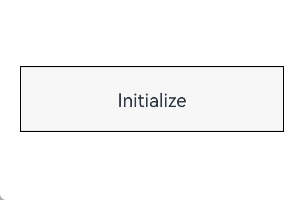

# AttributeUpdater

**AttributeUpdater** directly set attributes to a component to trigger UI re-renders, without marking them as state variables.

>  **NOTE**
>
>  The initial APIs of this module are supported since API version 12. Updates will be marked with a superscript to indicate their earliest API version.
>


## Modules to Import

```ts
import { AttributeUpdater } from '@kit.ArkUI'
```

>  **Instructions**
>  
>  1. Whenever possible, avoid using **AttributeUpdater** in conjunction with attribute methods or implementing methods like **applyNormalAttribute** in **AttributeUpdater** to update the same attribute on the same component. Doing so involves mixed use of the state management update mechanism, which can be confusing.
>  
>  2. When **AttributeUpdater** is used together with an attribute method, the one that is used later takes effect. Specifically:
>  If use of **AttributeUpdater** is followed by an attribute method call, the attribute method takes effect under the state management mechanism.
>  If use of **AttributeUpdater** follows an attribute method call, it takes effect.
>  
>  3. An **AttributeUpdater** object can only be associated with one component at a time; otherwise, the set attributes may only take effect on one component.
>  
>  4. You need to ensure the type matching of **T** and **C** in **AttributeUpdater** yourself. For example, if **T** is ImageAttribute, **C** should be ImageInterface;
>  otherwise, it may cause functionality issues when **updateConstructorParams** is used.
>  
>  5. Currently, **updateConstructorParams** supports only the **Button**, **Image**, **Text**, and **Span** components.
>  
>  6. **AttributeUpdater** does not support operations related to state management, such as switching between light and dark modes.

## Initializer
type Initializer\<T> = () => T

Defines a decorator for updating attributes.

**Atomic service API**: This API can be used in atomic services since API version 12.

**System capability**: SystemCapability.ArkUI.ArkUI.Full

## AttributeUpdater<T, C = Initializer\<T>>
Represents the implementation class of [AttributeModifier](arkui-ts/ts-universal-attributes-attribute-modifier.md#AttributeModifier). You need to customize a class to inherit **AttributeUpdater**.

**C** indicates the constructor type of the component, for example, **TextInterface** of the **Text** component and **ImageInterface** of the **Image** component. It is required only when **updateConstructorParams** is used.

**System capability**: SystemCapability.ArkUI.ArkUI.Full

### applyNormalAttribute
applyNormalAttribute?(instance: T): void

Defines the function for updating attributes in normal state.

**Atomic service API**: This API can be used in atomic services since API version 12.

**System capability**: SystemCapability.ArkUI.ArkUI.Full

**Parameters**

| Name| Type  | Mandatory| Description                                                                    |
| ------ | ------ | ---- | ------------------------------------------------------------------------ |
| instance | T | Yes| Component attribute class, which identifies the type of component to which attributes will be applied, for example, **ButtonAttribute** for the **Button** component and **TextAttribute** for the **Text** component.|

### initializeModifier
initializeModifier(instance: T): void

Initialize the attributes to the values initially set by **AttributeUpdater** for the component.

**Atomic service API**: This API can be used in atomic services since API version 12.

**System capability**: SystemCapability.ArkUI.ArkUI.Full

**Parameters**

| Name| Type  | Mandatory| Description                                                                    |
| ------ | ------ | ---- | ------------------------------------------------------------------------ |
| instance | T | Yes| Component attribute class, which identifies the type of component to which attributes will be applied, for example, **ButtonAttribute** for the **Button** component and **TextAttribute** for the **Text** component.|

**Example**

This example shows how to use **initializeModifier** to initialize attribute values.

```ts
// xxx.ets
import { AttributeUpdater } from '@kit.ArkUI'

class MyButtonModifier extends AttributeUpdater<ButtonAttribute> {
  initializeModifier(instance: ButtonAttribute): void {
    instance.backgroundColor('#ff2787d9')
      .width('50%')
      .height(30)
  }
}

@Entry
@Component
struct updaterDemo1 {
  modifier: MyButtonModifier = new MyButtonModifier()

  build() {
    Row() {
      Column() {
        Button("Button")
          .attributeModifier(this.modifier)
      }
      .width('100%')
    }
    .height('100%')
  }
}
```


### attribute
get attribute(): T | undefined

Obtains the attribute class instance corresponding to the component in **AttributeUpdater**. The instance can then be used to directly update attributes.

**Atomic service API**: This API can be used in atomic services since API version 12.

**System capability**: SystemCapability.ArkUI.ArkUI.Full

**Return value**

| Type            | Description                                                        |
| -------------------- | ------------------------------------------------------------ |
| T \| undefined |Returns the attribute class instance of the component in **AttributeUpdater** if it exists; returns **undefined** otherwise.|

**Example**

This example shows how to directly update attributes through **AttributeUpdater**.

```ts
// xxx.ets
import { AttributeUpdater } from '@kit.ArkUI'

class MyButtonModifier extends AttributeUpdater<ButtonAttribute> {
  initializeModifier(instance: ButtonAttribute): void {
    instance.backgroundColor('#ffd5d5d5')
      .width('50%')
      .height(30)
  }
}

@Entry
@Component
struct updaterDemo2 {
  modifier: MyButtonModifier = new MyButtonModifier()

  build() {
    Row() {
      Column() {
        Button("Button")
          .attributeModifier(this.modifier)
          .onClick(() => {
            this.modifier.attribute?.backgroundColor('#ff2787d9').width('30%')
          })
      }
      .width('100%')
    }
    .height('100%')
  }
}
```


### updateConstructorParams
updateConstructorParams: C

Represents construction parameters used for updating component attributes.  

**C** indicates the constructor type of the component, for example, **TextInterface** of the **Text** component and **ImageInterface** of the **Image** component.

**Atomic service API**: This API can be used in atomic services since API version 12.

**System capability**: SystemCapability.ArkUI.ArkUI.Full

**Example**

This example demonstrates how to use **updateConstructorParams**.

```ts
// xxx.ets
import { AttributeUpdater } from '@kit.ArkUI'

class MyTextModifier extends AttributeUpdater<TextAttribute, TextInterface> {
  initializeModifier(instance: TextAttribute) {
  }
}

@Entry
@Component
struct attributeDemo3 {
  private modifier: MyTextModifier = new MyTextModifier()

  build() {
    Row() {
      Column() {
        Text("Initialize")
          .attributeModifier(this.modifier)
          .fontSize(14).border({ width: 1 }).textAlign(TextAlign.Center).lineHeight(20)
          .width(200).height(50)
          .backgroundColor('#fff7f7f7')
          .onClick(() => {
            this.modifier.updateConstructorParams("Updated")
          })
      }
      .width('100%')
    }
    .height('100%')
  }
}
```


### onComponentChanged

onComponentChanged(component: T): void

Invoked to notify the application that the component bound to the same custom **Modifier** object changes.

**Atomic service API**: This API can be used in atomic services since API version 12.

**System capability**: SystemCapability.ArkUI.ArkUI.Full

**Parameters**

| Name| Type  | Mandatory| Description                                                                    |
| ------ | ------ | ---- | ------------------------------------------------------------------------ |
| component | T | Yes| Component attribute class, which identifies the type of component to which attributes will be applied, for example, **ButtonAttribute** for the **Button** component and **TextAttribute** for the **Text** component.|

**Example**

```ts
// xxx.ets
import { AttributeUpdater } from '@kit.ArkUI'

class MyButtonModifier extends AttributeUpdater<ButtonAttribute> {
  initializeModifier(instance: ButtonAttribute): void {
    instance.backgroundColor('#ff2787d9')
      .width('50%')
      .height(30)
  }

  onComponentChanged(instance: ButtonAttribute) :void {
    instance.backgroundColor('#ff2787d9')
      .width('50%')
      .height(30)
  }
}

@Entry
@Component
struct updaterDemo4 {
  @State btnState: boolean = false
  modifier: MyButtonModifier = new MyButtonModifier()

  build() {
    Row() {
      Column() {
        Button("Test")
          .onClick(() => {
          this.btnState = !this.btnState
        })

        if (this.btnState) {
          Button("Button")
            .attributeModifier(this.modifier)
        } else {
          Button("Button")
            .attributeModifier(this.modifier)
        }
      }
      .width('100%')
    }
    .height('100%')
  }
}
```
