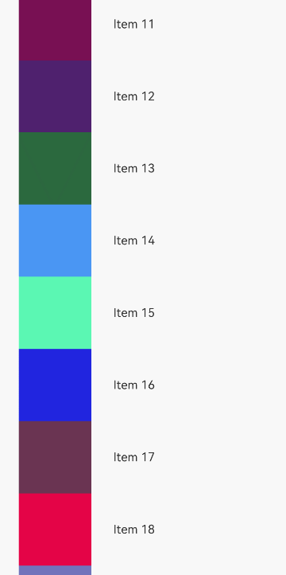

# @ohos.arkui.Prefetcher (Prefetching)
Used in conjunction with **LazyForEach**, the **Prefetcher** module provides content prefetching capabilities for container components such as **List**, **Grid**, **WaterFlow**, and **Swiper** during scrolling, to enhance the user browsing experience.

>  **NOTE**
>
>  The initial APIs of this module are supported since API version 12. Updates will be marked with a superscript to indicate their earliest API version.

## Modules to Import

```ts
import { BasicPrefetcher, IDataSourcePrefetching, IPrefetcher } from '@kit.ArkUI';
```


## IPrefetcher
Provides prefetching capabilities.

**Atomic service API**: This API can be used in atomic services since API version 12.

**System capability**: SystemCapability.ArkUI.ArkUI.Full

### setDataSource
setDataSource(dataSource: IDataSourcePrefetching): void;

Sets the prefetching-capable data source to bind to the **Prefetcher** object.

**Atomic service API**: This API can be used in atomic services since API version 12.

**System capability**: SystemCapability.ArkUI.ArkUI.Full

**Parameters**

| Name       | Type                                               | Mandatory| Description        |
|------------|---------------------------------------------------|----|------------|
| dataSource | [IDataSourcePrefetching](#idatasourceprefetching) | Yes | Prefetching-capable data source.|

```typescript
class MyPrefetcher implements IPrefetcher {
  private dataSource?: IDataSourcePrefetching;

  setDataSource(dataSource: IDataSourcePrefetching): void {
    this.dataSource = dataSource;
  }

  visibleAreaChanged(minVisible: number, maxVisible: number): void {
    this.dataSource?.prefetch(minVisible);
  }
}
```

### visibleAreaChanged
visibleAreaChanged(minVisible: number, maxVisible: number): void;

Called when the boundaries of the visible area change. This API works with the **List**, **Grid**, **WaterFlow**, and **Swiper** components.

**Atomic service API**: This API can be used in atomic services since API version 12.

**System capability**: SystemCapability.ArkUI.ArkUI.Full

**Parameters**

| Name       | Type    | Mandatory| Description       |
|------------|--------|----|-----------|
| minVisible | number | Yes | Upper bound of the visible area.|
| maxVisible | number | Yes | Lower bound of the visible area.|

```typescript
class MyPrefetcher implements IPrefetcher {
  private dataSource?: IDataSourcePrefetching;

  setDataSource(dataSource: IDataSourcePrefetching): void {
    this.dataSource = dataSource;
  }

  visibleAreaChanged(minVisible: number, maxVisible: number): void {
    this.dataSource?.prefetch(minVisible);
  }
}
```

## BasicPrefetcher
**BasicPrefetcher** is a fundamental implementation of **IPrefetcher**. It offers an intelligent data prefetching algorithm that decides the data items to prefetch based on real-time changes in the visible area on the screen and variations in the prefetch duration. It can also determine the prefetch requests to be canceled based on the user's scrolling actions.

**Atomic service API**: This API can be used in atomic services since API version 12.

**System capability**: SystemCapability.ArkUI.ArkUI.Full

### constructor
constructor(dataSource?: IDataSourcePrefetching);

A constructor used to create a data source that supports prefetching to bind to the **Prefetcher**.

**Atomic service API**: This API can be used in atomic services since API version 12.

**System capability**: SystemCapability.ArkUI.ArkUI.Full

**Parameters**

| Name       | Type                                               | Mandatory| Description        |
|------------|---------------------------------------------------|----|------------|
| dataSource | [IDataSourcePrefetching](#idatasourceprefetching) | No | Prefetching-capable data source.|

### setDataSource
setDataSource(dataSource: IDataSourcePrefetching): void;

Sets the prefetching-capable data source to bind to the **Prefetcher** object.

**Atomic service API**: This API can be used in atomic services since API version 12.

**System capability**: SystemCapability.ArkUI.ArkUI.Full

**Parameters**

| Name       | Type                                               | Mandatory| Description        |
|------------|---------------------------------------------------|----|------------|
| dataSource | [IDataSourcePrefetching](#idatasourceprefetching) | Yes | Prefetching-capable data source.|

### visibleAreaChanged
visibleAreaChanged(minVisible: number, maxVisible: number): void;

Called when the boundaries of the visible area change. This API works with the **List**, **Grid**, **WaterFlow**, and **Swiper** components.

**Atomic service API**: This API can be used in atomic services since API version 12.

**System capability**: SystemCapability.ArkUI.ArkUI.Full

**Parameters**

| Name       | Type    | Mandatory| Description       |
|------------|--------|----|-----------|
| minVisible | number | Yes | Upper bound of the visible area.|
| maxVisible | number | Yes | Lower bound of the visible area.|

## IDataSourcePrefetching

Extends the [IDataSource](./arkui-ts/ts-rendering-control-lazyforeach.md#idatasource10) API to provide a data source with prefetching capabilities.

**Atomic service API**: This API can be used in atomic services since API version 12.

**System capability**: SystemCapability.ArkUI.ArkUI.Full

### prefetch
prefetch(index: number): Promise\<void\> | void;

Prefetches a specified data item from the dataset. This API can be either synchronous or asynchronous.

**Atomic service API**: This API can be used in atomic services since API version 12.

**System capability**: SystemCapability.ArkUI.ArkUI.Full

**Parameters**

| Name  | Type    | Mandatory| Description      |
|-------|--------|----|----------|
| index | number | Yes | Index of the data item to prefetch.|

### cancel
cancel?(index: number): Promise\<void\> | void;

Cancels the prefetching of a specified data item from the dataset. This API can be either synchronous or asynchronous.

**Atomic service API**: This API can be used in atomic services since API version 12.

**System capability**: SystemCapability.ArkUI.ArkUI.Full

**Parameters**

| Name  | Type    | Mandatory| Description        |
|-------|--------|----|------------|
| index | number | Yes | Index of the data item to cancel prefetching for.|

When list content moves off the screen (for example, during fast scrolling), the prefetching algorithm identifies which off-screen items can have their prefetching canceled. This API is then called to handle the cancellation. For example, if the HTTP framework supports request cancellation, this API can be used to terminate the network requests initiated by the **prefetch** API.

## Example

This example demonstrates the prefetching capabilities of **Prefetcher**. It uses pagination with **LazyForEach** to achieve lazy loading effects and simulates the loading process with delays.

```typescript
import { BasicPrefetcher, IDataSourcePrefetching } from '@kit.ArkUI';
import { image } from '@kit.ImageKit';

const ITEMS_ON_SCREEN = 8;

@Entry
@Component
struct PrefetcherDemoComponent {
  private page: number = 1;
  private pageSize: number = 50;
  private breakPoint: number = 25;
  private readonly fetchDelayMs: number = 500;
  private readonly dataSource = new MyDataSource(this.page, this.pageSize, this.fetchDelayMs);
  private readonly prefetcher = new BasicPrefetcher(this.dataSource);

  build() {
    Column() {
      List() {
        LazyForEach(this.dataSource, (item: PictureItem, index: number) => {
          ListItem() {
            PictureItemComponent({ info: item })
              .height(`${100 / ITEMS_ON_SCREEN}%`)
          }
          .onAppear(() => {
            if (index >= this.breakPoint) {
              this.dataSource.getHttpData(++this.page, this.pageSize);
              this.breakPoint = this.dataSource.totalCount() - this.pageSize / 2;
            }
          })
        }, (item: PictureItem) => item.title)
      }
      .onScrollIndex((start: number, end: number) => {
        this.prefetcher.visibleAreaChanged(start, end);
      })
    }
  }
}

@Component
struct PictureItemComponent {
  @ObjectLink info: PictureItem;

  build() {
    Row() {
      Image(this.info.imagePixelMap)
        .objectFit(ImageFit.Contain)
        .width('40%')
      Text(this.info.title)
        .width('60%')
    }
  }
}

@Observed
class PictureItem {
  readonly color: number;
  title: string;
  imagePixelMap: image.PixelMap | undefined;
  key: string;

  constructor(color: number, title: string) {
    this.color = color;
    this.title = title;
    this.key = title;
  }
}

type ItemIndex = number;
type TimerId = number;

class MyDataSource implements IDataSourcePrefetching {
  private readonly items: PictureItem[];
  private readonly fetchDelayMs: number;
  private readonly fetches: Map<ItemIndex, TimerId> = new Map();
  private readonly listeners: DataChangeListener[] = [];

  constructor(pageNum: number, pageSize: number, fetchDelayMs: number) {
    this.items = [];
    this.fetchDelayMs = fetchDelayMs;
    this.getHttpData(pageNum, pageSize);
  }

  async prefetch(index: number): Promise<void> {
    const item = this.items[index];
    if (item.imagePixelMap) {
      return;
    }

    // Perform time-consuming operations.
    return new Promise<void>(resolve => {
      const timeoutId = setTimeout(async () => {
        this.fetches.delete(index);
        const bitmap = create10x10Bitmap(item.color);
        const imageSource: image.ImageSource = image.createImageSource(bitmap);
        item.imagePixelMap = await imageSource.createPixelMap();
        resolve();
      }, this.fetchDelayMs);

      this.fetches.set(index, timeoutId)
    });
  }

  cancel(index: number): void {
    const timerId = this.fetches.get(index);
    if (timerId) {
      this.fetches.delete(index);
      clearTimeout(timerId);
    }
  }

  // Simulate paginated data loading.
  getHttpData(pageNum: number, pageSize:number): void {
    const newItems: PictureItem[] = [];
    for (let i = (pageNum - 1) * pageSize; i < pageNum * pageSize; i++) {
      const item = new PictureItem(getRandomColor(), `Item ${i}`);
      newItems.push(item);
    }
    const startIndex = this.items.length;
    this.items.splice(startIndex, 0, ...newItems);
    this.notifyBatchUpdate([
      {
        type: DataOperationType.ADD,
        index: startIndex,
        count: newItems.length,
        key: newItems.map((item) => item.title)
      }
    ]);
  }

  private notifyBatchUpdate(operations: DataOperation[]) {
    this.listeners.forEach((listener: DataChangeListener) => {
      listener.onDatasetChange(operations);
    });
  }

  totalCount(): number {
    return this.items.length;
  }

  getData(index: number): PictureItem {
    return this.items[index];
  }

  registerDataChangeListener(listener: DataChangeListener): void {
    if (this.listeners.indexOf(listener) < 0) {
      this.listeners.push(listener);
    }
  }

  unregisterDataChangeListener(listener: DataChangeListener): void {
    const pos = this.listeners.indexOf(listener);
    if (pos >= 0) {
      this.listeners.splice(pos, 1);
    }
  }
}

function getRandomColor(): number {
  const maxColorCode = 256;
  const r = Math.floor(Math.random() * maxColorCode);
  const g = Math.floor(Math.random() * maxColorCode);
  const b = Math.floor(Math.random() * maxColorCode);

  return (r * 256 + g) * 256 + b;
}

function create10x10Bitmap(color: number): ArrayBuffer {
  const height = 10;
  const width = 10;

  const fileHeaderLength = 14;
  const bitmapInfoLength = 40;
  const headerLength = fileHeaderLength + bitmapInfoLength;
  const pixelSize = (width * 3 + 2) * height;

  let length = pixelSize + headerLength;

  const buffer = new ArrayBuffer(length);
  const view16 = new Uint16Array(buffer);

  view16[0] = 0x4D42;
  view16[1] = length & 0xffff;
  view16[2] = length >> 16;
  view16[5] = headerLength;

  let offset = 7;
  view16[offset++] = bitmapInfoLength & 0xffff;
  view16[offset++] = bitmapInfoLength >> 16;
  view16[offset++] = width & 0xffff;
  view16[offset++] = width >> 16;
  view16[offset++] = height & 0xffff;
  view16[offset++] = height >> 16;
  view16[offset++] = 1;
  view16[offset++] = 24;

  const b = color & 0xff;
  const g = (color >> 8) & 0xff;
  const r = color >> 16;
  offset = headerLength;
  const view8 = new Uint8Array(buffer);
  for (let y = 0; y < height; y++) {
    for (let x = 0; x < width; x++) {
      view8[offset++] = b;
      view8[offset++] = g;
      view8[offset++] = r;
    }
    offset += 2;
  }

  return buffer;
}
```

The following figure illustrates the effects.



## Supplementary Notes

You can also use the OpenHarmony third-party library [@netteam/prefetcher](https://ohpm.openharmony.cn/#/en/detail/@netteam%2Fprefetcher) to implement the prefetching functionality. This library provides additional APIs for more convenient and efficient data prefetching.
