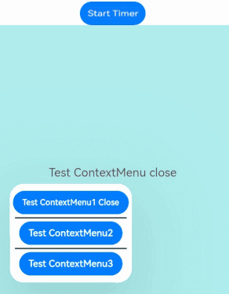

# @ohos.arkui.UIContext (UIContext)

In the stage model, a window stage or window can use the [loadContent](js-apis-window.md#loadcontent9) API to load pages, create a UI instance, and render page content to the associated window. Naturally, UI instances and windows are associated on a one-by-one basis. Some global UI APIs are executed in the context of certain UI instances. When calling these APIs, you must identify the UI context, and consequently UI instance, by tracing the call chain. If these APIs are called on a non-UI page or in some asynchronous callback, the current UI context may fail to be identified, resulting in API execution errors.

**@ohos.window** adds the [getUIContext](js-apis-window.md#getuicontext10) API in API version 10 for obtaining the **UIContext** object of a UI instance. The API provided by the **UIContext** object can be directly applied to the corresponding UI instance.

> **NOTE**
>
> The initial APIs of this module are supported since API version 10. Newly added APIs will be marked with a superscript to indicate their earliest API version.
>
> You can preview how this component looks on a real device, but not in DevEco Studio Previewer.

## UIContext

In the following API examples, you must first use [getUIContext()](js-apis-window.md#getuicontext10) in **@ohos.window** to obtain a **UIContext** instance, and then call the APIs using the obtained instance. Alternatively, you can obtain a **UIContext** instance through the built-in method [getUIContext()](arkui-ts/ts-custom-component-api.md#getuicontext) of the custom component. In this document, the **UIContext** instance is represented by **uiContext**.

### getFont

getFont(): Font

Obtains a **Font** object.

**Atomic service API**: This API can be used in atomic services since API version 11.

**System capability**: SystemCapability.ArkUI.ArkUI.Full

**Return value**

| Type           | Description         |
| ------------- | ----------- |
| [Font](#font) | **Font** object.|

**Example**

<!--code_no_check-->
```ts
uiContext.getFont();
```
### getComponentUtils

getComponentUtils(): ComponentUtils

Obtains the **ComponentUtils** object.

**Atomic service API**: This API can be used in atomic services since API version 11.

**System capability**: SystemCapability.ArkUI.ArkUI.Full

**Return value**

| Type                               | Description                   |
| --------------------------------- | --------------------- |
| [ComponentUtils](#componentutils) | **ComponentUtils** object.|

**Example**

<!--code_no_check-->
```ts
uiContext.getComponentUtils();
```

### getUIInspector

getUIInspector(): UIInspector

Obtains the **UIInspector** object.

**Atomic service API**: This API can be used in atomic services since API version 11.

**System capability**: SystemCapability.ArkUI.ArkUI.Full

**Return value**

| Type                         | Description                |
| --------------------------- | ------------------ |
| [UIInspector](#uiinspector) | **UIInspector** object.|

**Example**

<!--code_no_check-->
```ts
uiContext.getUIInspector();
```

### getUIObserver<sup>11+</sup>

getUIObserver(): UIObserver

Obtains the **UIObserver** object.

**Atomic service API**: This API can be used in atomic services since API version 12.

**System capability**: SystemCapability.ArkUI.ArkUI.Full

**Return value**

| Type                         | Description                |
| --------------------------- | ------------------ |
| [UIObserver](#uiobserver11) | **UIObserver** object.|

**Example**

<!--code_no_check-->
```ts
uiContext.getUIObserver();
```

### getMediaQuery

getMediaQuery(): MediaQuery

Obtains a **MediaQuery** object.

**Atomic service API**: This API can be used in atomic services since API version 11.

**System capability**: SystemCapability.ArkUI.ArkUI.Full

**Return value**

| Type                       | Description               |
| ------------------------- | ----------------- |
| [MediaQuery](#mediaquery) | **MediaQuery** object.|

**Example**

<!--code_no_check-->
```ts
uiContext.getMediaQuery();
```

### getRouter

getRouter(): Router

Obtains a **Router** object.

**Atomic service API**: This API can be used in atomic services since API version 11.

**System capability**: SystemCapability.ArkUI.ArkUI.Full

**Return value**

| Type               | Description           |
| ----------------- | ------------- |
| [Router](#router) | **Router** object.|

**Example**

<!--code_no_check-->
```ts
uiContext.getRouter();
```

### getPromptAction

getPromptAction(): PromptAction

Obtains a **PromptAction** object.

**Atomic service API**: This API can be used in atomic services since API version 11.

**System capability**: SystemCapability.ArkUI.ArkUI.Full

**Return value**

| Type                           | Description                 |
| ----------------------------- | ------------------- |
| [PromptAction](#promptaction) | **PromptAction** object.|

**Example**

<!--code_no_check-->
```ts
uiContext.getPromptAction();
```

### getOverlayManager<sup>12+</sup>

getOverlayManager(): OverlayManager

Obtains the **OverlayManager** object.

**Atomic service API**: This API can be used in atomic services since API version 12.

**System capability**: SystemCapability.ArkUI.ArkUI.Full

**Return value**

| Type                          | Description                |
| ----------------------------- | ------------------- |
| [OverlayManager](#overlaymanager12) | **OverlayManager** instance obtained.|

**Example**

<!--code_no_check-->
```ts
uiContext.getOverlayManager();
```

### setOverlayManagerOptions<sup>15+</sup>

setOverlayManagerOptions(options: OverlayManagerOptions): boolean

Sets the parameters for [OverlayManager](#overlaymanager12). This API initializes the parameters of the **OverlayManager** before using its capabilities, including properties such as whether to render the overlay root node. It must be called before **getOverlayManager** and takes effect only once.

**Atomic service API**: This API can be used in atomic services since API version 15.

**System capability**: SystemCapability.ArkUI.ArkUI.Full

**Parameters**

| Name  | Type                                      | Mandatory  | Description                                   |
| ----- | ---------------------------------------- | ---- | ------------------------------------- |
| options | [OverlayManagerOptions](#overlaymanageroptions15) | Yes| Parameters for **OverlayManager**.|

**Return value**

| Type   | Description          |
| ------- | -------------- |
| boolean | Whether the setting is successful.<br>Returns **true** if the setting is successful; returns **false** otherwise.|

**Example**

<!--code_no_check-->
```ts
uiContext.setOverlayManagerOptions({ renderRootOverlay: true, enableBackPressedEvent: true });
```

### getOverlayManagerOptions<sup>15+</sup>

getOverlayManagerOptions(): OverlayManagerOptions

Obtains the current parameters of [OverlayManager](#overlaymanager12).

**Atomic service API**: This API can be used in atomic services since API version 15.

**System capability**: SystemCapability.ArkUI.ArkUI.Full

**Return value**

| Type                          | Description                |
| ----------------------------- | ------------------- |
| [OverlayManagerOptions](#overlaymanageroptions15) | Current parameters of **OverlayManager**.|

**Example**

<!--code_no_check-->
```ts
uiContext.getOverlayManagerOptions();
```

### animateTo

animateTo(value: AnimateParam, event: () => void): void

Applies a transition animation for state changes.

**Atomic service API**: This API can be used in atomic services since API version 11.

**System capability**: SystemCapability.ArkUI.ArkUI.Full

**Parameters**

| Name  | Type                                      | Mandatory  | Description                                   |
| ----- | ---------------------------------------- | ---- | ------------------------------------- |
| value | [AnimateParam](arkui-ts/ts-explicit-animation.md#animateparam) | Yes   | Animation settings.                          |
| event | () => void                               | Yes   | Closure function that displays the animation. The system automatically inserts the transition animation if the state changes in the closure function.|

**Example**

```ts
// xxx.ets
@Entry
@Component
struct AnimateToExample {
  @State widthSize: number = 250
  @State heightSize: number = 100
  @State rotateAngle: number = 0
  private flag: boolean = true
  uiContext: UIContext | undefined = undefined;

  aboutToAppear() {
    this.uiContext = this.getUIContext();
    if (!this.uiContext) {
      console.warn("no uiContext");
      return;
    }
  }

  build() {
    Column() {
      Button('change size')
        .width(this.widthSize)
        .height(this.heightSize)
        .margin(30)
        .onClick(() => {
          if (this.flag) {
            this.uiContext?.animateTo({
              duration: 2000,
              curve: Curve.EaseOut,
              iterations: 3,
              playMode: PlayMode.Normal,
              onFinish: () => {
                console.info('play end')
              }
            }, () => {
              this.widthSize = 150
              this.heightSize = 60
            })
          } else {
            this.uiContext?.animateTo({}, () => {
              this.widthSize = 250
              this.heightSize = 100
            })
          }
          this.flag = !this.flag
        })
      Button('stop rotating')
        .margin(50)
        .rotate({ x: 0, y: 0, z: 1, angle: this.rotateAngle })
        .onAppear(() => {
          // The animation starts when the component appears.
          this.uiContext?.animateTo({
            duration: 1200,
            curve: Curve.Friction,
            delay: 500,
            iterations: -1, // The value -1 indicates that the animation is played for an unlimited number of times.
            playMode: PlayMode.Alternate,
            expectedFrameRateRange: {
              min: 10,
              max: 120,
              expected: 60,
            }
          }, () => {
            this.rotateAngle = 90
          })
        })
        .onClick(() => {
          this.uiContext?.animateTo({ duration: 0 }, () => {
            // The value of this.rotateAngle is 90 before the animation. In an animation with a duration of 0, changing the property stops any previous animations for that property and applies the new value immediately.
            this.rotateAngle = 0
          })
        })
    }.width('100%').margin({ top: 5 })
  }
}
```

### getSharedLocalStorage<sup>12+</sup>

getSharedLocalStorage(): LocalStorage | undefined

Obtains the **LocalStorage** instance shared by this stage.

**Atomic service API**: This API can be used in atomic services since API version 12.

**System capability**: SystemCapability.ArkUI.ArkUI.Full

**Model restriction**: This API can be used only in the stage model.

**Return value**

| Type                            | Description               |
| ------------------------------ | ----------------- |
| [LocalStorage](arkui-ts/ts-state-management.md#localstorage9) \| undefined | **LocalStorage** instance if it exists; **undefined** if it does not exist.|

**Example**

```ts
// EntryAbility.ets
import { UIAbility } from '@kit.AbilityKit';
import { window } from '@kit.ArkUI';

export default class EntryAbility extends UIAbility {
  storage: LocalStorage = new LocalStorage();

  onWindowStageCreate(windowStage: window.WindowStage) {
    windowStage.loadContent('pages/Index', this.storage);
  }
}
```

```ts
// Index.ets

@Entry
@Component
struct SharedLocalStorage {
  localStorage = this.getUIContext().getSharedLocalStorage();

  build() {
    Row() {
      Column() {
        Button("Change Local Storage to 47")
          .onClick(() => {
            this.localStorage?.setOrCreate("propA", 47);
          })
        Button("Get Local Storage")
          .onClick(() => {
            console.info(`localStorage: ${this.localStorage?.get("propA")}`);
          })
      }
      .width('100%')
    }
    .height('100%')
  }
}
```

### getHostContext<sup>12+</sup>

getHostContext(): Context | undefined

Obtains the context of this ability.

**Atomic service API**: This API can be used in atomic services since API version 12.

**System capability**: SystemCapability.ArkUI.ArkUI.Full

**Model restriction**: This API can be used only in the stage model.

**Return value**

| Type| Description                            |
| ------ | ------------------------------- |
| [Context](#context12) \| undefined | Context of the ability. The context type depends on the ability type. For example, if this API is called on a page of the UIAbility, the return value type is UIAbilityContext; if this API is called on a page of the ExtensionAbility, the return value type is ExtensionContext. If the ability context does not exist, **undefined** is returned.|

**Example**

```ts
@Entry
@Component
struct Index {
  uiContext = this.getUIContext();

  build() {
    Row() {
      Column() {
        Text("cacheDir='"+this.uiContext?.getHostContext()?.cacheDir+"'").fontSize(25)
        Text("bundleCodeDir='"+this.uiContext?.getHostContext()?.bundleCodeDir+"'").fontSize(25)
      }
      .width('100%')
    }
    .height('100%')
  }
}
```

### getFrameNodeById<sup>12+</sup>

getFrameNodeById(id: string): FrameNode | null

Obtains a FrameNode on the component tree based on the component ID.

**Atomic service API**: This API can be used in atomic services since API version 12.

**System capability**: SystemCapability.ArkUI.ArkUI.Full

**Parameters**

| Name  | Type                                      | Mandatory  | Description                                   |
| ----- | ---------------------------------------- | ---- | ------------------------------------- |
| id | string | Yes   | [Component ID](arkui-ts/ts-universal-attributes-component-id.md) of the target node.      |

**Return value**

| Type                                      | Description           |
| ---------------------------------------- | ------------- |
| [FrameNode](js-apis-arkui-frameNode.md)  \| null | FrameNode (if available) or null node.|

> **NOTE**
>
> The **getFrameNodeById** API searches for a node with a specific ID by traversing the tree, which can lead to poor performance. To deliver better performance, use the [getAttachedFrameNodeById](#getattachedframenodebyid12) API.

**Example**

<!--code_no_check-->
```ts
uiContext.getFrameNodeById("TestNode")
```

### getAttachedFrameNodeById<sup>12+</sup>

getAttachedFrameNodeById(id: string): FrameNode | null

Obtains the entity node attached to the current window based on its component ID.

**Atomic service API**: This API can be used in atomic services since API version 12.

**System capability**: SystemCapability.ArkUI.ArkUI.Full

**Parameters**

| Name  | Type                                      | Mandatory  | Description                                   |
| ----- | ---------------------------------------- | ---- | ------------------------------------- |
| id | string | Yes   | [Component ID](arkui-ts/ts-universal-attributes-component-id.md) of the target node.                         |

**Return value**

| Type                                      | Description           |
| ---------------------------------------- | ------------- |
| [FrameNode](js-apis-arkui-frameNode.md)  \| null | FrameNode (if available) or null node.|

> **NOTE**
>
> **getAttachedFrameNodeById** can only obtain nodes that are currently rendered on the screen.

**Example**

<!--code_no_check-->
```ts
uiContext.getAttachedFrameNodeById("TestNode")
```

### getFrameNodeByUniqueId<sup>12+</sup>

getFrameNodeByUniqueId(id: number): FrameNode | null

Obtains the entity node, FrameNode, of a component on the component tree using its **uniqueId**. The return value depends on the type of component associated with the **uniqueId**.
1. If the **uniqueId** corresponds to a built-in component, the associated FrameNode is returned.
2. If the **uniqueId** corresponds to a custom component: If the component has rendered content, its root node is returned, with the type __Common__; if the component has no rendered content, the FrameNode of its first child component is returned.
3. If the **uniqueId** does not correspond to any component, **null** is returned.

**Atomic service API**: This API can be used in atomic services since API version 12.

**System capability**: SystemCapability.ArkUI.ArkUI.Full

**Parameters**

| Name  | Type                                      | Mandatory  | Description                                   |
| ----- | ---------------------------------------- | ---- | ------------------------------------- |
| id | number | Yes   | Unique ID of the target node.                         |

**Return value**

| Type                                      | Description           |
| ---------------------------------------- | ------------- |
| [FrameNode](js-apis-arkui-frameNode.md)  \| null | Entity node of the component or **null** if no matching component is found.|

**Example**

```ts
import { UIContext, FrameNode } from '@kit.ArkUI';

@Entry
@Component
struct MyComponent {
  aboutToAppear() {
    let uniqueId: number = this.getUniqueId();
    let uiContext: UIContext = this.getUIContext();
    if (uiContext) {
      let node: FrameNode | null = uiContext.getFrameNodeByUniqueId(uniqueId);
    }
  }

  build() {
    // ...
  }
}
```

### getPageInfoByUniqueId<sup>12+</sup>

getPageInfoByUniqueId(id: number): PageInfo

Obtains the router or navigation destination page information corresponding to the node that matches the specified **uniqueId**.
1. If the node that matches the specified **uniqueId** is in a page, the router information (**routerPageInfo**) is returned.
2. If the node that matches the specified **uniqueId** is in a **NavDestination** component, the navigation destination page information (**navDestinationInfo**) is returned.
3. If the node that matches the specified **uniqueId** does not have the corresponding router or navigation destination page information, **undefined** is returned.
4. Modal dialog boxes are not contained within any pages. If the node that matches the specified **uniqueId** is in a modal dialog box, for example, on a modal page constructed by [CustomDialog](./arkui-ts/ts-methods-custom-dialog-box.md), [bindSheet](./arkui-ts/ts-universal-attributes-sheet-transition.md#bindsheet), or [bindContentCover](./arkui-ts/ts-universal-attributes-modal-transition.md#bindcontentcover), **undefined** is returned for **routerPageInfo**.

**Atomic service API**: This API can be used in atomic services since API version 12.

**System capability**: SystemCapability.ArkUI.ArkUI.Full

**Parameters**

| Name  | Type                                      | Mandatory  | Description                                   |
| ----- | ---------------------------------------- | ---- | ------------------------------------- |
| id | number | Yes   | Unique ID of the target node.                         |

**Return value**

| Type                                      | Description           |
| ---------------------------------------- | ------------- |
| [PageInfo](#pageinfo12) | Router or navigation destination page information corresponding to the specified node.|

**Example**

```ts
import { UIContext, PageInfo } from '@kit.ArkUI';

@Entry
@Component
struct PageInfoExample {
  @Provide('pageInfos') pageInfos: NavPathStack = new NavPathStack();

  build() {
    Column() {
      Navigation(this.pageInfos) {
        NavDestination() {
          MyComponent()
        }
      }.id('navigation')
    }
  }
}

@Component
struct MyComponent {
  @State content: string = '';

  build() {
    Column() {
      Text('PageInfoExample')
      Button('click').onClick(() => {
        const uiContext: UIContext = this.getUIContext();
        const uniqueId: number = this.getUniqueId();
        const pageInfo: PageInfo = uiContext.getPageInfoByUniqueId(uniqueId);
        console.info('pageInfo: ' + JSON.stringify(pageInfo));
        console.info('navigationInfo: ' + JSON.stringify(uiContext.getNavigationInfoByUniqueId(uniqueId)));
      })
      TextArea({
        text: this.content
      })
      .width('100%')
      .height(100)
    }
    .width('100%')
    .alignItems(HorizontalAlign.Center)
  }
}
```

### getNavigationInfoByUniqueId<sup>12+</sup>

getNavigationInfoByUniqueId(id: number): observer.NavigationInfo | undefined

Obtains the navigation information corresponding to the node that matches the specified **uniqueId**.
1. If the node that matches the specified **uniqueId** is in a **Navigation** component, the navigation information is returned.
2. If the node that matches the specified **uniqueId** does not have the corresponding navigation information, **undefined** is returned.

**Atomic service API**: This API can be used in atomic services since API version 12.

**System capability**: SystemCapability.ArkUI.ArkUI.Full

**Parameters**

| Name  | Type                                      | Mandatory  | Description                                   |
| ----- | ---------------------------------------- | ---- | ------------------------------------- |
| id | number | Yes   | Unique ID of the target node.                         |

**Return value**

| Type                                      | Description           |
| ---------------------------------------- | ------------- |
| observer.[NavigationInfo](js-apis-arkui-observer.md#navigationinfo12) \| undefined | Navigation information corresponding to the specified node.|

**Example**

See the example of [getPageInfoByUniqueId](#getpageinfobyuniqueid12).

### showAlertDialog

showAlertDialog(options: AlertDialogParamWithConfirm | AlertDialogParamWithButtons | AlertDialogParamWithOptions): void

Shows an alert dialog box.

**Atomic service API**: This API can be used in atomic services since API version 11.

**System capability**: SystemCapability.ArkUI.ArkUI.Full

**Parameters**

| Name    | Type                                      | Mandatory  | Description                 |
| ------- | ---------------------------------------- | ---- | ------------------- |
| options | [AlertDialogParamWithConfirm](arkui-ts/ts-methods-alert-dialog-box.md#alertdialogparamwithconfirm) \| [AlertDialogParamWithButtons](arkui-ts/ts-methods-alert-dialog-box.md#alertdialogparamwithbuttons) \| [AlertDialogParamWithOptions](arkui-ts/ts-methods-alert-dialog-box.md#alertdialogparamwithoptions10) | Yes   | Shows an **AlertDialog** component in the given settings.|


**Example**

<!--code_no_check-->
```ts
uiContext.showAlertDialog(
  {
    title: 'title',
    message: 'text',
    autoCancel: true,
    alignment: DialogAlignment.Bottom,
    offset: { dx: 0, dy: -20 },
    gridCount: 3,
    confirm: {
      value: 'button',
      action: () => {
        console.info('Button-clicking callback')
      }
    },
    cancel: () => {
      console.info('Closed callbacks')
    }
  }
)
```

### showActionSheet

showActionSheet(value: ActionSheetOptions): void

Shows an action sheet in the given settings.

**Atomic service API**: This API can be used in atomic services since API version 11.

**System capability**: SystemCapability.ArkUI.ArkUI.Full

**Parameters**

| Name| Type                                                        | Mandatory| Description                |
| ------ | ------------------------------------------------------------ | ---- | -------------------- |
| value  | [ActionSheetOptions](arkui-ts/ts-methods-action-sheet.md#actionsheetoptions) | Yes  | Parameters of the action sheet.|

**Example**

<!--code_no_check-->
```ts
uiContext.showActionSheet({
  title: 'ActionSheet title',
  message: 'message',
  autoCancel: true,
  confirm: {
    value: 'Confirm button',
    action: () => {
      console.info('Get Alert Dialog handled')
    }
  },
  cancel: () => {
    console.info('actionSheet canceled')
  },
  alignment: DialogAlignment.Bottom,
  offset: { dx: 0, dy: -10 },
  sheets: [
    {
      title: 'apples',
      action: () => {
        console.info('apples')
      }
    },
    {
      title: 'bananas',
      action: () => {
        console.info('bananas')
      }
    },
    {
      title: 'pears',
      action: () => {
        console.info('pears')
      }
    }
  ]
})
```

### showDatePickerDialog

showDatePickerDialog(options: DatePickerDialogOptions): void

Shows a date picker dialog box in the given settings.

**Atomic service API**: This API can be used in atomic services since API version 11.

**System capability**: SystemCapability.ArkUI.ArkUI.Full

**Parameters**

| Name | Type                                                        | Mandatory| Description                          |
| ------- | ------------------------------------------------------------ | ---- | ------------------------------ |
| options | [DatePickerDialogOptions](arkui-ts/ts-methods-datepicker-dialog.md#datepickerdialogoptions) | Yes  | Parameters of the date picker dialog box.|

**Example**

<!--code_no_check-->
```ts
let selectedDate: Date = new Date("2010-1-1")
uiContext.showDatePickerDialog({
  start: new Date("2000-1-1"),
  end: new Date("2100-12-31"),
  selected: selectedDate,
  onAccept: (value: DatePickerResult) => {
    // Use the setFullYear method to set the date when the OK button is touched. In this way, when the date picker dialog box is displayed again, the selected date is the date last confirmed.
    selectedDate.setFullYear(Number(value.year), Number(value.month), Number(value.day))
    console.info("DatePickerDialog:onAccept()" + JSON.stringify(value))
  },
  onCancel: () => {
    console.info("DatePickerDialog:onCancel()")
  },
  onChange: (value: DatePickerResult) => {
    console.info("DatePickerDialog:onChange()" + JSON.stringify(value))
  }
})
```

### showTimePickerDialog

showTimePickerDialog(options: TimePickerDialogOptions): void

Shows a time picker dialog box in the given settings.

**Atomic service API**: This API can be used in atomic services since API version 11.

**System capability**: SystemCapability.ArkUI.ArkUI.Full

**Parameters**

| Name | Type                                                        | Mandatory| Description                          |
| ------- | ------------------------------------------------------------ | ---- | ------------------------------ |
| options | [TimePickerDialogOptions](arkui-ts/ts-methods-timepicker-dialog.md#timepickerdialogoptions) | Yes  | Parameters of the time picker dialog box.|

**Example**

```ts
// xxx.ets

class SelectTime{
  selectTime: Date = new Date('2020-12-25T08:30:00')
  hours(h:number,m:number){
    this.selectTime.setHours(h,m)
  }
}

@Entry
@Component
struct TimePickerDialogExample {
  @State selectTime: Date = new Date('2023-12-25T08:30:00');

  build() {
    Column() {
      Button('showTimePickerDialog')
        .margin(30)
        .onClick(() => {
          this.getUIContext().showTimePickerDialog({
            selected: this.selectTime,
            onAccept: (value: TimePickerResult) => {
              // Set selectTime to the time when the OK button is clicked. In this way, when the dialog box is displayed again, the selected time is the time when the operation was confirmed last time.
              let time = new SelectTime()
              if(value.hour&&value.minute){
                time.hours(value.hour, value.minute)
              }
              console.info("TimePickerDialog:onAccept()" + JSON.stringify(value))
            },
            onCancel: () => {
              console.info("TimePickerDialog:onCancel()")
            },
            onChange: (value: TimePickerResult) => {
              console.info("TimePickerDialog:onChange()" + JSON.stringify(value))
            }
          })
        })
    }.width('100%').margin({ top: 5 })
  }
}
```

### showTextPickerDialog

showTextPickerDialog(options: TextPickerDialogOptions): void

Shows a text picker dialog box in the given settings.

**Atomic service API**: This API can be used in atomic services since API version 11.

**System capability**: SystemCapability.ArkUI.ArkUI.Full

**Parameters**

| Name | Type                                                        | Mandatory| Description                          |
| ------- | ------------------------------------------------------------ | ---- | ------------------------------ |
| options | [TextPickerDialogOptions](arkui-ts/ts-methods-textpicker-dialog.md#textpickerdialogoptions) | Yes  | Parameters of the text picker dialog box.|

**Example**

```ts
// xxx.ets

class SelectedValue{
  select: number = 2
  set(val:number){
    this.select = val
  }
}
class SelectedArray{
  select: number[] = []
  set(val:number[]){
    this.select = val
  }
}
@Entry
@Component
struct TextPickerDialogExample {
  @State selectTime: Date = new Date('2023-12-25T08:30:00');
  private fruits: string[] = ['apple1', 'orange2', 'peach3', 'grape4', 'banana5']
  private select : number  = 0;
  build() {
    Column() {
      Button('showTextPickerDialog')
        .margin(30)
        .onClick(() => {
          this.getUIContext().showTextPickerDialog({
            range: this.fruits,
            selected: this.select,
            onAccept: (value: TextPickerResult) => {
              // Set select to the index of the item selected when the OK button is touched. In this way, when the text picker dialog box is displayed again, the selected item is the one last confirmed.
              let selectedVal = new SelectedValue()
              let selectedArr = new SelectedArray()
              if(value.index){
                  value.index instanceof Array?selectedArr.set(value.index) : selectedVal.set(value.index)
              }
              console.info("TextPickerDialog:onAccept()" + JSON.stringify(value))
            },
            onCancel: () => {
              console.info("TextPickerDialog:onCancel()")
            },
            onChange: (value: TextPickerResult) => {
              console.info("TextPickerDialog:onChange()" + JSON.stringify(value))
            }
          })
        })
    }.width('100%').margin({ top: 5 })
  }
}
```

### createAnimator

createAnimator(options: AnimatorOptions): AnimatorResult

Creates an **Animator** object.

**Atomic service API**: This API can be used in atomic services since API version 11.

**System capability**: SystemCapability.ArkUI.ArkUI.Full

**Parameters**

| Name    | Type                                      | Mandatory  | Description     |
| ------- | ---------------------------------------- | ---- | ------- |
| options | [AnimatorOptions](js-apis-animator.md#animatoroptions) | Yes   | Animator options.|

**Return value**

| Type                                      | Description           |
| ---------------------------------------- | ------------- |
| [AnimatorResult](js-apis-animator.md#animatorresult) | Animator result.|


**Error codes**

For details about the error codes, see [Universal Error Codes](../errorcode-universal.md).

| ID| Error Message|
| ------- | -------- |
| 401      | Parameter error. Possible causes: 1. Mandatory parameters are left unspecified; 2.Incorrect parameters types; 3. Parameter verification failed.   |

**Example**

```ts
// EntryAbility.ets
import { AnimatorOptions, window } from '@kit.ArkUI';
import { hilog } from '@kit.PerformanceAnalysisKit';

// used in UIAbility
onWindowStageCreate(windowStage: window.WindowStage) {
  // Main window is created, set main page for this ability
  hilog.info(0x0000, 'testTag', '%{public}s', 'Ability onWindowStageCreate');
  windowStage.loadContent('pages/Index', (err, data) => {
    if (err.code) {
      hilog.error(0x0000, 'testTag', 'Failed to load the content. Cause: %{public}s', JSON.stringify(err) ?? '');
      return;
    }
    hilog.info(0x0000, 'testTag', 'Succeeded in loading the content. Data: %{public}s', JSON.stringify(data) ?? '');
    let uiContext = windowStage.getMainWindowSync().getUIContext();
    let options:AnimatorOptions = {
      duration: 1500,
      easing: "friction",
      delay: 0,
      fill: "forwards",
      direction: "normal",
      iterations: 3,
      begin: 200.0,
      end: 400.0
    };
    uiContext.createAnimator(options);
  });
}
```

### createAnimator<sup>18+</sup>

createAnimator(options: AnimatorOptions | SimpleAnimatorOptions): AnimatorResult

Creates an **AnimatorResult** object for animations. Compared to the previous [createAnimator](#createanimator) API, this API adds support for the [SimpleAnimatorOptions](js-apis-animator.md#simpleanimatoroptions18) type.

**Atomic service API**: This API can be used in atomic services since API version 18.

**System capability**: SystemCapability.ArkUI.ArkUI.Full

**Parameters**

| Name    | Type                                      | Mandatory  | Description     |
| ------- | ---------------------------------------- | ---- | ------- |
| options | [AnimatorOptions](js-apis-animator.md#animatoroptions) \| [SimpleAnimatorOptions](js-apis-animator.md#simpleanimatoroptions18) | Yes   | Animator options.|

**Return value**

| Type                                      | Description           |
| ---------------------------------------- | ------------- |
| [AnimatorResult](js-apis-animator.md#animatorresult) | Animator result.|

**Error codes**

For details about the error codes, see [Universal Error Codes](../errorcode-universal.md).

| ID| Error Message|
| ------- | -------- |
| 401      | Parameter error. Possible causes: 1. Mandatory parameters are left unspecified; 2.Incorrect parameters types; 3. Parameter verification failed.   |

**Example**

```ts
import { SimpleAnimatorOptions, window } from '@kit.ArkUI';
import { hilog } from '@kit.PerformanceAnalysisKit';

// used in UIAbility
onWindowStageCreate(windowStage: window.WindowStage) {
  // Main window is created, set main page for this ability
  hilog.info(0x0000, 'testTag', '%{public}s', 'Ability onWindowStageCreate');
  windowStage.loadContent('pages/Index', (err, data) => {
    if (err.code) {
      hilog.error(0x0000, 'testTag', 'Failed to load the content. Cause: %{public}s', JSON.stringify(err) ?? '');
      return;
    }
    hilog.info(0x0000, 'testTag', 'Succeeded in loading the content. Data: %{public}s', JSON.stringify(data) ?? '');
    let uiContext = windowStage.getMainWindowSync().getUIContext();
    let options: SimpleAnimatorOptions = new SimpleAnimatorOptions(100, 200).duration(2000);
    uiContext.createAnimator(options);
  });
}
```

### runScopedTask

runScopedTask(callback: () => void): void

Executes the specified callback in this UI context.

**Atomic service API**: This API can be used in atomic services since API version 11.

**System capability**: SystemCapability.ArkUI.ArkUI.Full

**Parameters**

| Name     | Type        | Mandatory  | Description  |
| -------- | ---------- | ---- | ---- |
| callback | () => void | Yes   | Callback used to return the result.|

**Example**

<!--code_no_check-->
```ts
uiContext.runScopedTask(
  () => {
    console.info('Succeeded in runScopedTask');
  }
);
```

### setKeyboardAvoidMode<sup>11+</sup>

setKeyboardAvoidMode(value: KeyboardAvoidMode): void

Sets the avoidance mode for the virtual keyboard.

**Atomic service API**: This API can be used in atomic services since API version 11.

**System capability**: SystemCapability.ArkUI.ArkUI.Full

**Parameters**

| Name     | Type        | Mandatory  | Description  |
| -------- | ---------- | ---- | ---- |
| value | [KeyboardAvoidMode](#keyboardavoidmode11)| Yes   | Avoidance mode for the virtual keyboard.<br>Default value: **KeyboardAvoidMode.OFFSET**|

**Example**

```ts
// EntryAbility.ets
import { KeyboardAvoidMode, UIContext } from '@kit.ArkUI';
import { hilog } from '@kit.PerformanceAnalysisKit';

onWindowStageCreate(windowStage: window.WindowStage) {
    // Main window is created, set main page for this ability
    hilog.info(0x0000, 'testTag', '%{public}s', 'Ability onWindowStageCreate');

    windowStage.loadContent('pages/Index', (err, data) => {
      let uiContext :UIContext = windowStage.getMainWindowSync().getUIContext();
      uiContext.setKeyboardAvoidMode(KeyboardAvoidMode.RESIZE);
      if (err.code) {
        hilog.error(0x0000, 'testTag', 'Failed to load the content. Cause: %{public}s', JSON.stringify(err) ?? '');
        return;
      }
      hilog.info(0x0000, 'testTag', 'Succeeded in loading the content. Data: %{public}s', JSON.stringify(data) ?? '');
    });
  }
```

### getKeyboardAvoidMode<sup>11+</sup>

getKeyboardAvoidMode(): KeyboardAvoidMode

Obtains the avoidance mode for the virtual keyboard.

**Atomic service API**: This API can be used in atomic services since API version 11.

**System capability**: SystemCapability.ArkUI.ArkUI.Full

**Return value**

| Type        | Description  |
| ---------- | ---- |
| [KeyboardAvoidMode](#keyboardavoidmode11)| Avoidance mode for the virtual keyboard.|

**Example**

```ts
// EntryAbility.ets
import { KeyboardAvoidMode, UIContext } from '@kit.ArkUI';
import { hilog } from '@kit.PerformanceAnalysisKit';

onWindowStageCreate(windowStage: window.WindowStage) {
    // Main window is created, set main page for this ability
    hilog.info(0x0000, 'testTag', '%{public}s', 'Ability onWindowStageCreate');

    windowStage.loadContent('pages/Index', (err, data) => {
      let uiContext :UIContext = windowStage.getMainWindowSync().getUIContext();
      let KeyboardAvoidMode = uiContext.getKeyboardAvoidMode();
      hilog.info(0x0000, "KeyboardAvoidMode:", JSON.stringify(KeyboardAvoidMode));
      if (err.code) {
        hilog.error(0x0000, 'testTag', 'Failed to load the content. Cause: %{public}s', JSON.stringify(err) ?? '');
        return;
      }
      hilog.info(0x0000, 'testTag', 'Succeeded in loading the content. Data: %{public}s', JSON.stringify(data) ?? '');
    });
  }

```

### getAtomicServiceBar<sup>11+</sup>

getAtomicServiceBar(): Nullable\<AtomicServiceBar>

Obtains an **AtomicServiceBar** object, which can be used to set the properties of the atomic service menu bar.

**Atomic service API**: This API can be used in atomic services since API version 11.

**System capability**: SystemCapability.ArkUI.ArkUI.Full

**Return value**

| Type                                             | Description                                                        |
| ------------------------------------------------- | ------------------------------------------------------------ |
| Nullable<[AtomicServiceBar](#atomicservicebar11)> | Returns the **AtomicServerBar** type if the service is an atomic service; returns **undefined** type otherwise.|

**Example**

```ts
// EntryAbility.ets
import { UIContext, AtomicServiceBar, window } from '@kit.ArkUI';
import { hilog } from '@kit.PerformanceAnalysisKit';
onWindowStageCreate(windowStage: window.WindowStage) {
  // Main window is created, set main page for this ability
  hilog.info(0x0000, 'testTag', 'Ability onWindowStageCreate');
  windowStage.loadContent('pages/Index', (err, data) => {
    let uiContext: UIContext = windowStage.getMainWindowSync().getUIContext();
    let atomicServiceBar: Nullable<AtomicServiceBar> = uiContext.getAtomicServiceBar();
    if (atomicServiceBar != undefined) {
      hilog.info(0x0000, 'testTag', 'Get AtomServiceBar Successfully.');
    } else {
      hilog.error(0x0000, 'testTag', 'Get AtomicServiceBar failed.');
    }
  });
}
```
### getDragController<sup>11+</sup>

getDragController(): DragController

Obtains the **DragController** object, which can be used to create and initiate dragging.

**Atomic service API**: This API can be used in atomic services since API version 12.

**System capability**: SystemCapability.ArkUI.ArkUI.Full

**Return value**

|Type|Description|
|----|----|
|[DragController](js-apis-arkui-dragController.md#dragController)| **DragController** object.|

**Example**

<!--code_no_check-->
```ts
uiContext.getDragController();
```

### keyframeAnimateTo<sup>11+</sup>

keyframeAnimateTo(param: KeyframeAnimateParam, keyframes: Array&lt;KeyframeState&gt;): void

Generates a key frame animation. For details about how to use this API, see [keyframeAnimateTo](arkui-ts/ts-keyframeAnimateTo.md).

**Atomic service API**: This API can be used in atomic services since API version 12.

**System capability**: SystemCapability.ArkUI.ArkUI.Full

**Parameters**

| Name| Type                                             | Mandatory| Description                     |
| ------------ | ---------------------------------------------------- | ------- | ---------------------------- |
| param        | [KeyframeAnimateParam](arkui-ts/ts-keyframeAnimateTo.md#keyframeanimateparam) | Yes     | Overall animation parameter of the keyframe animation.    |
| keyframes    | Array&lt;[KeyframeState](arkui-ts/ts-keyframeAnimateTo.md#keyframestate)&gt;  | Yes     | States of all keyframes.           |

### getFocusController<sup>12+</sup>

getFocusController(): FocusController

Obtains a [FocusController](js-apis-arkui-UIContext.md#focuscontroller12) object, which can be used to control the focus.

**Atomic service API**: This API can be used in atomic services since API version 12.

**System capability**: SystemCapability.ArkUI.ArkUI.Full

**Return value**

|Type|Description|
|----|----|
|[FocusController](js-apis-arkui-UIContext.md#focuscontroller12)| **FocusController** object.|

**Example**

<!--code_no_check-->
```ts
uiContext.getFocusController();
```

### getFilteredInspectorTree<sup>12+</sup>

getFilteredInspectorTree(filters?: Array\<string\>): string

Obtains the component tree and component attributes.

**Atomic service API**: This API can be used in atomic services since API version 12.

**System capability**: SystemCapability.ArkUI.ArkUI.Full

**Parameters**

| Name | Type           | Mandatory| Description                                                        |
| ------- | --------------- | ---- | ------------------------------------------------------------ |
| filters | Array\<string\> | No  | List of component attributes used for filtering. Currently, only the following values are supported:<br>**"id"**: unique ID of the component.<br>**"src"**: source of the resource.<br>**"content"**: information or data contained in the element, component, or object.<br>**"editable"**: whether the component is editable.<br>**"scrollable"**: whether the component is scrollable.<br>**"selectable"**: whether the component is selectable.<br>**"focusable"**: whether the component is focusable.<br>**"focused"**: whether the component is currently focused.<br>Other values are used only in test scenarios.|

**Return value**

| Type  | Description                              |
| ------ | ---------------------------------- |
| string | JSON string of the component tree and component attributes.|

**Error codes**

For details about the error codes, see [Universal Error Codes](../errorcode-universal.md).

| ID| Error Message|
| ------- | -------- |
| 401      | Parameter error. Possible causes: 1. Mandatory parameters are left unspecified; 2.Incorrect parameters types; 3. Parameter verification failed.   |

**Example**

<!--code_no_check-->
```ts
uiContext.getFilteredInspectorTree(['id', 'src', 'content']);
```

### getFilteredInspectorTreeById<sup>12+</sup>

getFilteredInspectorTreeById(id: string, depth: number, filters?: Array\<string\>): string

Obtains the attributes of the specified component and its child components.

**Atomic service API**: This API can be used in atomic services since API version 12.

**System capability**: SystemCapability.ArkUI.ArkUI.Full

**Parameters**

| Name | Type           | Mandatory| Description                                                        |
| ------- | --------------- | ---- | ------------------------------------------------------------ |
| id      | string          | Yes  | [ID](arkui-ts/ts-universal-attributes-component-id.md) of the target component.|
| depth   | number          | Yes  | Number of layers of child components. If the value is **0**, the attributes of the specified component and all its child components are obtained. If the value is **1**, only the attributes of the specified component are obtained. If the value is **2**, the attributes of the specified component and its level-1 child components are obtained. The rest can be deduced by analogy.|
| filters | Array\<string\> | No  | List of component attributes used for filtering. Currently, only the following values are supported:<br>**"id"**: unique ID of the component.<br>**"src"**: source of the resource.<br>**"content"**: information or data contained in the element, component, or object.<br>**"editable"**: whether the component is editable.<br>**"scrollable"**: whether the component is scrollable.<br>**"selectable"**: whether the component is selectable.<br>**"focusable"**: whether the component is focusable.<br>**"focused"**: whether the component is currently focused.<br>Other values are used only in test scenarios.|

**Return value**

| Type  | Description                                        |
| ------ | -------------------------------------------- |
| string | JSON string of the attributes of the specified component and its child components.|


**Error codes**

For details about the error codes, see [Universal Error Codes](../errorcode-universal.md).

| ID| Error Message|
| ------- | -------- |
| 401      | Parameter error. Possible causes: 1. Mandatory parameters are left unspecified; 2.Incorrect parameters types; 3. Parameter verification failed.   |

**Example**

<!--code_no_check-->
```ts
uiContext.getFilteredInspectorTreeById('testId', 0, ['id', 'src', 'content']);
```

### getCursorController<sup>12+</sup>

getCursorController(): CursorController

Obtains a [CursorController](js-apis-arkui-UIContext.md#cursorcontroller12) object, which can be used to control the focus.

**Atomic service API**: This API can be used in atomic services since API version 12.

**System capability**: SystemCapability.ArkUI.ArkUI.Full

**Return value**

|Type|Description|
|----|----|
|[CursorController](js-apis-arkui-UIContext.md#cursorcontroller12)| **CursorController** object.|

**Example**

<!--code_no_check-->
```ts
uiContext.CursorController();
```

### getContextMenuController<sup>12+</sup>

getContextMenuController(): ContextMenuController

Obtains a [ContextMenuController](#contextmenucontroller12) object, which can be used to control menus.

**Atomic service API**: This API can be used in atomic services since API version 12.

**System capability**: SystemCapability.ArkUI.ArkUI.Full

**Return value**

|Type|Description|
|----|----|
|[ContextMenuController](#contextmenucontroller12)| **ContextMenuController** object.|

**Example**

<!--code_no_check-->
```ts
uiContext.getContextMenuController();
```

### getMeasureUtils<sup>12+</sup>

getMeasureUtils(): MeasureUtils

Obtains a **MeasureUtils** object for text calculation.

**Atomic service API**: This API can be used in atomic services since API version 12.

**System capability**: SystemCapability.ArkUI.ArkUI.Full

**Return value**

| Type  | Description                                        |
| ------ | -------------------------------------------- |
| [MeasureUtils](js-apis-arkui-UIContext.md#measureutils12) | Text metrics, such as text height and width.|

**Example**

<!--code_no_check-->
```ts
uiContext.getMeasureUtils();
```

### getComponentSnapshot<sup>12+</sup>

getComponentSnapshot(): ComponentSnapshot

Obtains a **ComponentSnapshot** object, which can be used to obtain a component snapshot.

**Atomic service API**: This API can be used in atomic services since API version 12.

**System capability**: SystemCapability.ArkUI.ArkUI.Full

**Return value**

| Type                                                        | Description                       |
| ------------------------------------------------------------ | --------------------------- |
| [ComponentSnapshot](js-apis-arkui-UIContext.md#componentsnapshot12) | **ComponentSnapshot** object.|

**Example**

<!--code_no_check-->
```ts
uiContext.getComponentSnapshot();
```

### vp2px<sup>12+</sup>

vp2px(value : number) : number

Converts a value in units of vp to a value in units of px.

**Atomic service API**: This API can be used in atomic services since API version 12.

**System capability**: SystemCapability.ArkUI.ArkUI.Full

**Parameters**

| Name| Type  | Mandatory| Description                                  |
| ------ | ------ | ---- | -------------------------------------- |
| value | number | Yes  | Value to convert.<br>Value range: (-∞, +∞)|

**Return value**

| Type  | Description          |
| ------ | -------------- |
| number | Value after conversion.<br>Value range: (-∞, +∞)|

**Example**

<!--code_no_check-->
```ts
uiContext.vp2px(200);
```

### px2vp<sup>12+</sup>

px2vp(value : number) : number

Converts a value in units of px to a value in units of vp.

**Atomic service API**: This API can be used in atomic services since API version 12.

**System capability**: SystemCapability.ArkUI.ArkUI.Full

**Parameters**

| Name| Type  | Mandatory| Description                                  |
| ------ | ------ | ---- | -------------------------------------- |
| value | number | Yes  | Value to convert.<br>Value range: (-∞, +∞)|

**Return value**

| Type  | Description          |
| ------ | -------------- |
| number | Value after conversion.<br>Value range: (-∞, +∞)|

**Example**

<!--code_no_check-->
```ts
uiContext.px2vp(200);
```

### fp2px<sup>12+</sup>

fp2px(value : number) : number

Converts a value in units of fp to a value in units of px.

**Atomic service API**: This API can be used in atomic services since API version 12.

**System capability**: SystemCapability.ArkUI.ArkUI.Full

**Parameters**

| Name| Type  | Mandatory| Description                                  |
| ------ | ------ | ---- | -------------------------------------- |
| value | number | Yes  | Value to convert.<br>Value range: (-∞, +∞)|

**Return value**

| Type  | Description          |
| ------ | -------------- |
| number | Value after conversion.<br>Value range: (-∞, +∞)|

**Example**

<!--code_no_check-->
```ts
uiContext.fp2px(200);
```

### px2fp<sup>12+</sup>

px2fp(value : number) : number

Converts a value in units of px to a value in units of fp.

**Atomic service API**: This API can be used in atomic services since API version 12.

**System capability**: SystemCapability.ArkUI.ArkUI.Full

**Parameters**

| Name| Type  | Mandatory| Description                                  |
| ------ | ------ | ---- | -------------------------------------- |
| value | number | Yes  | Value to convert.<br>Value range: (-∞, +∞)|

**Return value**

| Type  | Description          |
| ------ | -------------- |
| number | Value after conversion.<br>Value range: (-∞, +∞)|

**Example**

<!--code_no_check-->
```ts
uiContext.px2fp(200);
```

### lpx2px<sup>12+</sup>

lpx2px(value : number) : number

Converts a value in units of lpx to a value in units of px.

**Atomic service API**: This API can be used in atomic services since API version 12.

**System capability**: SystemCapability.ArkUI.ArkUI.Full

**Parameters**

| Name| Type  | Mandatory| Description                                   |
| ------ | ------ | ---- | --------------------------------------- |
| value | number | Yes  | Value to convert.<br>Value range: (-∞, +∞)|

**Return value**

| Type  | Description          |
| ------ | -------------- |
| number | Value after conversion.<br>Value range: (-∞, +∞)|

**Example**

<!--code_no_check-->
```ts
uiContext.lpx2px(200);
```

### px2lpx<sup>12+</sup>

px2lpx(value : number) : number

Converts a value in units of px to a value in units of lpx.

**Atomic service API**: This API can be used in atomic services since API version 12.

**System capability**: SystemCapability.ArkUI.ArkUI.Full

**Parameters**

| Name| Type  | Mandatory| Description                                   |
| ------ | ------ | ---- | --------------------------------------- |
| value | number | Yes  | Value to convert.<br>Value range: (-∞, +∞)|

**Return value**

| Type  | Description          |
| ------ | -------------- |
| number | Value after conversion.<br>Value range: (-∞, +∞)|

**Example**

<!--code_no_check-->
```ts
uiContext.px2lpx(200);
```

### getWindowName<sup>12+</sup>

getWindowName(): string | undefined

Obtains the name of the window where this instance is located.

**Atomic service API**: This API can be used in atomic services since API version 12.

**System capability**: SystemCapability.ArkUI.ArkUI.Full

**Return value**

| Type  | Description                                        |
| ------ | -------------------------------------------- |
| string \| undefined | Name of the window where the current instance is located. If the window does not exist, **undefined** is returned.|

**Example**

```ts
import { window } from '@kit.ArkUI';

@Entry
@Component
struct Index {
  @State message: string = 'Hello World'

  aboutToAppear() {
    const windowName = this.getUIContext().getWindowName();
    console.info('WindowName ' + windowName);
    const currWindow = window.findWindow(windowName);
    const windowProperties = currWindow.getWindowProperties();
    console.info(`Window width ${windowProperties.windowRect.width}, height ${windowProperties.windowRect.height}`);
  }

  build() {
    Row() {
      Column() {
        Text(this.message)
          .fontSize(50)
          .fontWeight(FontWeight.Bold)
      }
      .width('100%')
    }
    .height('100%')
  }
}
```

### getWindowWidthBreakpoint<sup>13+</sup>

getWindowWidthBreakpoint(): WidthBreakpoint

Obtains the width breakpoint value of the window where this instance is located. The specific value is determined by the vp value of the window width. For details, see [WidthBreakpoint](./arkui-ts/ts-appendix-enums.md#widthbreakpoint13).

**Atomic service API**: This API can be used in atomic services since API version 13.

**System capability**: SystemCapability.ArkUI.ArkUI.Full

**Return value**

| Type  | Description                                        |
| ------ | -------------------------------------------- |
| [WidthBreakpoint](./arkui-ts/ts-appendix-enums.md#widthbreakpoint13) | Width breakpoint value of the window where the current instance is located. If the window width is 0 vp, **WIDTH_XS** is returned.|

**Example**

```ts
import { UIContext } from '@kit.ArkUI';

@Entry
@Component
struct Index {
  @State message: string = 'Hello World';

  build() {
    Row() {
      Column() {
        Text(this.message)
          .fontSize(30)
          .fontWeight(FontWeight.Bold)
        Button() {
          Text('test')
            .fontSize(30)
        }
        .onClick(() => {
          let uiContext: UIContext = this.getUIContext();
          let heightBp: HeightBreakpoint = uiContext.getWindowHeightBreakpoint();
          let widthBp: WidthBreakpoint = uiContext.getWindowWidthBreakpoint();
          console.info(`Window heightBP: ${heightBp}, widthBp: ${widthBp}`)
        })
      }
      .width('100%')
    }
    .height('100%')
  }
}
```

### getWindowHeightBreakpoint<sup>13+</sup>

getWindowHeightBreakpoint(): HeightBreakpoint

Obtains the height breakpoint value of the window where this instance is located. The specific value is determined based on the window aspect ratio. For details, see [HeightBreakpoint](./arkui-ts/ts-appendix-enums.md#heightbreakpoint13).

**Atomic service API**: This API can be used in atomic services since API version 13.

**System capability**: SystemCapability.ArkUI.ArkUI.Full

**Return value**

| Type  | Description                                        |
| ------ | -------------------------------------------- |
| [HeightBreakpoint](./arkui-ts/ts-appendix-enums.md#heightbreakpoint13) | Height breakpoint value of the window where the current instance is located. If the window aspect ratio is 0, **HEIGHT_SM** is returned.|

**Example**

```ts
import { UIContext } from '@kit.ArkUI';

@Entry
@Component
struct Index {
  @State message: string = 'Hello World';

  build() {
    Row() {
      Column() {
        Text(this.message)
          .fontSize(30)
          .fontWeight(FontWeight.Bold)
        Button() {
          Text('test')
            .fontSize(30)
        }
        .onClick(() => {
          let uiContext: UIContext = this.getUIContext();
          let heightBp: HeightBreakpoint = uiContext.getWindowHeightBreakpoint();
          let widthBp: WidthBreakpoint = uiContext.getWindowWidthBreakpoint();
          console.info(`Window heightBP: ${heightBp}, widthBp: ${widthBp}`)
        })
      }
      .width('100%')
    }
    .height('100%')
  }
}
```

### postFrameCallback<sup>12+</sup>

postFrameCallback(frameCallback: FrameCallback): void

Registers a callback that is executed when the next frame is rendered.

**Atomic service API**: This API can be used in atomic services since API version 12.

**System capability**: SystemCapability.ArkUI.ArkUI.Full

**Parameters**

| Name| Type  | Mandatory| Description                                   |
| ------ | ------ | ---- | --------------------------------------- |
| frameCallback | [FrameCallback](#framecallback12) | Yes  | Callback to be executed for the next frame.|

**Example**

```ts
import {FrameCallback } from '@kit.ArkUI';

class MyFrameCallback extends FrameCallback {
  private tag: string;

  constructor(tag: string) {
    super()
    this.tag = tag;
  }

  onFrame(frameTimeNanos: number) {
    console.info('MyFrameCallback ' + this.tag + ' ' + frameTimeNanos.toString());
  }
}

@Entry
@Component
struct Index {
  build() {
    Row() {
      Button('Invoke postFrameCallback')
        .onClick(() => {
          this.getUIContext().postFrameCallback(new MyFrameCallback("normTask"));
        })
    }
  }
}
```

### postDelayedFrameCallback<sup>12+</sup>

postDelayedFrameCallback(frameCallback: FrameCallback, delayTime: number): void

Registers a callback to be executed on the next frame after a delay.

**Atomic service API**: This API can be used in atomic services since API version 12.

**System capability**: SystemCapability.ArkUI.ArkUI.Full

**Parameters**

| Name| Type  | Mandatory| Description                                   |
| ------ | ------ | ---- | --------------------------------------- |
| frameCallback | [FrameCallback](#framecallback12) | Yes  | Callback to be executed for the next frame.|
| delayTime | number | Yes  | Delay time, in milliseconds. If a **null**, **undefined**, or value less than 0 is passed in, it will be treated as **0**.|

**Example**

```ts
import {FrameCallback } from '@kit.ArkUI';

class MyFrameCallback extends FrameCallback {
  private tag: string;

  constructor(tag: string) {
    super()
    this.tag = tag;
  }

  onFrame(frameTimeNanos: number) {
    console.info('MyFrameCallback ' + this.tag + ' ' + frameTimeNanos.toString());
  }
}

@Entry
@Component
struct Index {
  build() {
    Row() {
      Button('Invoke postDelayedFrameCallback')
        .onClick(() => {
          this.getUIContext().postDelayedFrameCallback(new MyFrameCallback("delayTask"), 5);
        })
    }
  }
}
```

### requireDynamicSyncScene<sup>12+</sup>

requireDynamicSyncScene(id: string): Array&lt;DynamicSyncScene&gt;

Requests the dynamic sync scene of a component for customizing related frame rate configuration.

**Atomic service API**: This API can be used in atomic services since API version 12.

**System capability**: SystemCapability.ArkUI.ArkUI.Full

**Parameters**

| Name| Type  | Mandatory| Description                                   |
| ------ | ------ | ---- | --------------------------------------- |
| id | string | Yes   | [Component ID](arkui-ts/ts-universal-attributes-component-id.md) of the target node.|

**Return value**

| Type  | Description                                        |
| ------ | -------------------------------------------- |
| Array&lt;DynamicSyncScene&gt; | **DynamicSyncScene** object array.|

**Example**

<!--code_no_check-->
```ts
uiContext.DynamicSyncScene("dynamicSyncScene")
```

### openBindSheet<sup>12+</sup>

openBindSheet\<T extends Object>(bindSheetContent: ComponentContent\<T>, sheetOptions?: SheetOptions, targetId?: number): Promise&lt;void&gt;

Creates a sheet whose content is as defined in **bindSheetContent** and displays the sheet. This API uses a promise to return the result.  

> **NOTE**
>
> 1. When calling this API, if you don't provide a valid value for **targetId**, you won't be able to set **SheetOptions.preferType** to **POPUP** or **SheetOptions.mode** to **EMBEDDED**.
>
> 2. Since [updateBindSheet](#updatebindsheet12) and [closeBindSheet](#closebindsheet12) depend on **bindSheetContent**, you need to maintain the passed **bindSheetContent** yourself.
>
> 3. Setting **SheetOptions.UIContext** is not supported.
>

**Atomic service API**: This API can be used in atomic services since API version 12.

**System capability**: SystemCapability.ArkUI.ArkUI.Full

**Parameters**

| Name    | Type                                      | Mandatory  | Description     |
| ------- | ---------------------------------------- | ---- | ------- |
| bindSheetContent | [ComponentContent\<T>](./js-apis-arkui-ComponentContent.md) | Yes| Content to display on the sheet.|
| sheetOptions | [SheetOptions](arkui-ts/ts-universal-attributes-sheet-transition.md#sheetoptions) | No   |   Style of the sheet.<br>**NOTE**<br>1. **SheetOptions.uiContext** cannot be set. Its value is fixed to the **UIContext** object of the current instance.<br>2. If **targetId** is not passed in, **SheetOptions.preferType** cannot be set to **POPUP**; if **POPUP** is set, it will be replaced with **CENTER**.<br>3. If **targetId** is not passed in, **SheetOptions.mode** cannot be set to **EMBEDDED**; the default mode is **OVERLAY**.<br>4. For the default values of other attributes, see [SheetOptions](arkui-ts/ts-universal-attributes-sheet-transition.md#sheetoptions).|
| targetId | number | No   |   ID of the component to be bound. If this parameter is not set, no component is bound.|

**Return value**

| Type                                      | Description     |
| ---------------------------------------- | ------- |
|   Promise&lt;void&gt;           |    Promise used to return the result.|

**Error codes**

For details about the error codes, see [Universal Error Codes](../errorcode-universal.md) and [Sheet Error Codes](errorcode-bindSheet.md).

| ID | Error Message                              |
| ------ | ---------------------------------- |
| 401      | Parameter error. Possible causes: 1. Mandatory parameters are left unspecified; 2.Incorrect parameters types; 3. Parameter verification failed.   |
| 120001 | The bindSheetContent is incorrect. |
| 120002 | The bindSheetContent already exists. |
| 120004 | The targetId does not exist. |
| 120005 | The node of targetId is not in the component tree. |
| 120006 | The node of targetId is not a child of the page node or NavDestination node. |

**Example**

```ts
import { FrameNode, ComponentContent } from "@kit.ArkUI";
import { BusinessError } from '@kit.BasicServicesKit';

class Params {
  text: string = ""

  constructor(text: string) {
    this.text = text;
  }
}

let contentNode: ComponentContent<Params>;
let gUIContext: UIContext;

@Builder
function buildText(params: Params) {
  Column() {
    Text(params.text)
    Button('Update BindSheet')
      .fontSize(20)
      .onClick(() => {
        gUIContext.updateBindSheet(contentNode, {
          backgroundColor: Color.Pink,
        }, true)
          .then(() => {
            console.info('updateBindSheet success');
          })
          .catch((err: BusinessError) => {
            console.info('updateBindSheet error: ' + err.code + ' ' + err.message);
          })
      })

    Button('Close BindSheet')
      .fontSize(20)
      .onClick(() => {
        gUIContext.closeBindSheet(contentNode)
          .then(() => {
            console.info('closeBindSheet success');
          })
          .catch((err: BusinessError) => {
            console.info('closeBindSheet error: ' + err.code + ' ' + err.message);
          })
      })
  }
}

@Entry
@Component
struct UIContextBindSheet {
  @State message: string = 'BindSheet';

  aboutToAppear() {
    gUIContext = this.getUIContext();
    contentNode = new ComponentContent(this.getUIContext(), wrapBuilder(buildText), new Params(this.message));
  }

  build() {
    RelativeContainer() {
      Column() {
        Button('Open BindSheet')
          .fontSize(20)
          .onClick(() => {
            let uiContext = this.getUIContext();
            let uniqueId = this.getUniqueId();
            let frameNode: FrameNode | null = uiContext.getFrameNodeByUniqueId(uniqueId);
            let targetId = frameNode?.getFirstChild()?.getUniqueId();
            uiContext.openBindSheet(contentNode, {
              height: SheetSize.MEDIUM,
              backgroundColor: Color.Green,
              title: { title: "Title", subtitle: "subtitle" }
            }, targetId)
              .then(() => {
                console.info('openBindSheet success');
              })
              .catch((err: BusinessError) => {
                console.info('openBindSheet error: ' + err.code + ' ' + err.message);
              })
          })
      }
    }
    .height('100%')
    .width('100%')
  }
}
```

### updateBindSheet<sup>12+</sup>

updateBindSheet\<T extends Object>(bindSheetContent: ComponentContent\<T>, sheetOptions: SheetOptions, partialUpdate?: boolean ): Promise&lt;void&gt;

Updates the style of the sheet corresponding to the provided **bindSheetContent**. This API uses a promise to return the result.

> **NOTE**
>
> **SheetOptions.UIContext**, **SheetOptions.mode**, and callback functions cannot be updated.
>

**Atomic service API**: This API can be used in atomic services since API version 12.

**System capability**: SystemCapability.ArkUI.ArkUI.Full

**Parameters**

| Name    | Type                                      | Mandatory  | Description     |
| ------- | ---------------------------------------- | ---- | ------- |
| bindSheetContent | [ComponentContent\<T>](./js-apis-arkui-ComponentContent.md) | Yes| Content to display on the sheet.|
| sheetOptions | [SheetOptions](arkui-ts/ts-universal-attributes-sheet-transition.md#sheetoptions) | Yes   |   Style of the sheet.<br>**NOTE**<br>**SheetOptions.UIContext** and **SheetOptions.mode** cannot be updated.|
| partialUpdate | boolean | No   |   Whether to update the sheet in incremental mode.<br>Default value: **false**<br>**NOTE**<br>1. **true**: incremental update, where the specified properties in **SheetOptions** are updated, and other properties stay at their current value.<br>2. **false**: full update, where all properties except those specified in **SheetOptions** are restored to default values.|

**Return value**

| Type                                      | Description     |
| ---------------------------------------- | ------- |
|   Promise&lt;void&gt;           |    Promise used to return the result.|

**Error codes**

For details about the error codes, see [Universal Error Codes](../errorcode-universal.md) and [Sheet Error Codes](errorcode-bindSheet.md).

| ID | Error Message                              |
| ------ | ---------------------------------- |
| 401      | Parameter error. Possible causes: 1. Mandatory parameters are left unspecified; 2.Incorrect parameters types; 3. Parameter verification failed.   |
| 120001 | The bindSheetContent is incorrect. |
| 120003 | The bindSheetContent cannot be found. |

**Example**

```ts
import { FrameNode, ComponentContent } from "@kit.ArkUI";
import { BusinessError } from '@kit.BasicServicesKit';

class Params {
  text: string = ""

  constructor(text: string) {
    this.text = text;
  }
}

let contentNode: ComponentContent<Params>;
let gUIContext: UIContext;

@Builder
function buildText(params: Params) {
  Column() {
    Text(params.text)
    Button('Update BindSheet')
      .fontSize(20)
      .onClick(() => {
        gUIContext.updateBindSheet(contentNode, {
          backgroundColor: Color.Pink,
        }, true)
          .then(() => {
            console.info('updateBindSheet success');
          })
          .catch((err: BusinessError) => {
            console.info('updateBindSheet error: ' + err.code + ' ' + err.message);
          })
      })

    Button('Close BindSheet')
      .fontSize(20)
      .onClick(() => {
        gUIContext.closeBindSheet(contentNode)
          .then(() => {
            console.info('closeBindSheet success');
          })
          .catch((err: BusinessError) => {
            console.info('closeBindSheet error: ' + err.code + ' ' + err.message);
          })
      })
  }
}

@Entry
@Component
struct UIContextBindSheet {
  @State message: string = 'BindSheet';

  aboutToAppear() {
    gUIContext = this.getUIContext();
    contentNode = new ComponentContent(this.getUIContext(), wrapBuilder(buildText), new Params(this.message));
  }

  build() {
    RelativeContainer() {
      Column() {
        Button('Open BindSheet')
          .fontSize(20)
          .onClick(() => {
            let uiContext = this.getUIContext();
            let uniqueId = this.getUniqueId();
            let frameNode: FrameNode | null = uiContext.getFrameNodeByUniqueId(uniqueId);
            let targetId = frameNode?.getFirstChild()?.getUniqueId();
            uiContext.openBindSheet(contentNode, {
              height: SheetSize.MEDIUM,
              backgroundColor: Color.Green,
              title: { title: "Title", subtitle: "subtitle" }
            }, targetId)
              .then(() => {
                console.info('openBindSheet success');
              })
              .catch((err: BusinessError) => {
                console.info('openBindSheet error: ' + err.code + ' ' + err.message);
              })
          })
      }
    }
    .height('100%')
    .width('100%')
  }
}
```

### closeBindSheet<sup>12+</sup>

closeBindSheet\<T extends Object>(bindSheetContent: ComponentContent\<T>): Promise&lt;void&gt;

Closes the sheet corresponding to **bindSheetContent**. This API uses a promise to return the result.

> **NOTE**
>
> Closing a sheet using this API will not invoke the **shouldDismiss** callback.
>

**Atomic service API**: This API can be used in atomic services since API version 12.

**System capability**: SystemCapability.ArkUI.ArkUI.Full

**Parameters**

| Name    | Type                                      | Mandatory  | Description     |
| ------- | ---------------------------------------- | ---- | ------- |
| bindSheetContent | [ComponentContent\<T>](./js-apis-arkui-ComponentContent.md) | Yes| Content to display on the sheet.|

**Return value**

| Type                                      | Description     |
| ---------------------------------------- | ------- |
|   Promise&lt;void&gt;           |    Promise used to return the result.|

**Error codes**

For details about the error codes, see [Universal Error Codes](../errorcode-universal.md) and [Sheet Error Codes](errorcode-bindSheet.md).

| ID | Error Message                              |
| ------ | ---------------------------------- |
| 401      | Parameter error. Possible causes: 1. Mandatory parameters are left unspecified; 2.Incorrect parameters types; 3. Parameter verification failed.   |
| 120001 | The bindSheetContent is incorrect. |
| 120003 | The bindSheetContent cannot be found. |

**Example**

```ts
import { FrameNode, ComponentContent } from "@kit.ArkUI";
import { BusinessError } from '@kit.BasicServicesKit';

class Params {
  text: string = ""

  constructor(text: string) {
    this.text = text;
  }
}

let contentNode: ComponentContent<Params>;
let gUIContext: UIContext;

@Builder
function buildText(params: Params) {
  Column() {
    Text(params.text)
    Button('Update BindSheet')
      .fontSize(20)
      .onClick(() => {
        gUIContext.updateBindSheet(contentNode, {
          backgroundColor: Color.Pink,
        }, true)
          .then(() => {
            console.info('updateBindSheet success');
          })
          .catch((err: BusinessError) => {
            console.info('updateBindSheet error: ' + err.code + ' ' + err.message);
          })
      })

    Button('Close BindSheet')
      .fontSize(20)
      .onClick(() => {
        gUIContext.closeBindSheet(contentNode)
          .then(() => {
            console.info('closeBindSheet success');
          })
          .catch((err: BusinessError) => {
            console.info('closeBindSheet error: ' + err.code + ' ' + err.message);
          })
      })
  }
}

@Entry
@Component
struct UIContextBindSheet {
  @State message: string = 'BindSheet';

  aboutToAppear() {
    gUIContext = this.getUIContext();
    contentNode = new ComponentContent(this.getUIContext(), wrapBuilder(buildText), new Params(this.message));
  }

  build() {
    RelativeContainer() {
      Column() {
        Button('Open BindSheet')
          .fontSize(20)
          .onClick(() => {
            let uiContext = this.getUIContext();
            let uniqueId = this.getUniqueId();
            let frameNode: FrameNode | null = uiContext.getFrameNodeByUniqueId(uniqueId);
            let targetId = frameNode?.getFirstChild()?.getUniqueId();
            uiContext.openBindSheet(contentNode, {
              height: SheetSize.MEDIUM,
              backgroundColor: Color.Green,
              title: { title: "Title", subtitle: "subtitle" }
            }, targetId)
              .then(() => {
                console.info('openBindSheet success');
              })
              .catch((err: BusinessError) => {
                console.info('openBindSheet error: ' + err.code + ' ' + err.message);
              })
          })
      }
    }
    .height('100%')
    .width('100%')
  }
}
```

### isFollowingSystemFontScale<sup>13+</sup>

isFollowingSystemFontScale(): boolean

Checks whether this UI context follows the system font scale settings.

**Atomic service API**: This API can be used in atomic services since API version 13.

**System capability**: SystemCapability.ArkUI.ArkUI.Full

**Return value**

| Type     | Description           |
|---------|---------------|
| boolean | Whether the current UI context follows the system font scale settings.|

**Example**

<!--code_no_check-->
```ts
uiContext.isFollowingSystemFontScale()
```

### getMaxFontScale<sup>13+</sup>

getMaxFontScale(): number

Obtains the maximum font scale of this UI context.

**Atomic service API**: This API can be used in atomic services since API version 13.

**System capability**: SystemCapability.ArkUI.ArkUI.Full

**Return value**

| Type     | Description       |
|---------|-----------|
| number | Maximum font scale of the current UI context.|

**Example**

<!--code_no_check-->
```ts
uiContext.getMaxFontScale()
```

### bindTabsToScrollable<sup>13+</sup>

bindTabsToScrollable(tabsController: TabsController, scroller: Scroller): void;

Binds a **Tabs** component with a scrollable container, which can be a [List](./arkui-ts/ts-container-list.md), [Scroll](./arkui-ts/ts-container-scroll.md), [Grid](./arkui-ts/ts-container-grid.md), or [WaterFlow](./arkui-ts/ts-container-waterflow.md) component. This way, scrolling the scrollable container triggers the display and hide animations of the tab bar for all **Tabs** components that are bound to it – scrolling up triggers the hide animation, and scrolling down triggers the show animation. A **TabsController** instance can be bound with multiple **Scroller** instances, and conversely, a **Scroller** instance can be bound with multiple **TabsController** instances.

>  **NOTE**
>
>  When multiple scrollable containers are bound to the same **Tabs** component, scrolling any of the bound containers will trigger the appearance and disappearance animations of the tab bar. In addition, when any scrollable container reaches the bottom, the tab bar immediately triggers the appearance animation. Therefore, avoid scrolling multiple scrollable containers simultaneously whenever possible.

**Atomic service API**: This API can be used in atomic services since API version 13.

**System capability**: SystemCapability.ArkUI.ArkUI.Full

**Parameters**

| Name    | Type                                      | Mandatory  | Description     |
| ------- | ---------------------------------------- | ---- | ------- |
| tabsController | [TabsController](./arkui-ts/ts-container-tabs.md#tabscontroller) | Yes| Controller of the target **Tabs** component.|
| scroller | [Scroller](./arkui-ts/ts-container-scroll.md#scroller) | Yes| Controller of the target scrollable container.|

**Example**

```ts
@Entry
@Component
struct TabsExample {
  private arr: string[] = []
  private parentTabsController: TabsController = new TabsController()
  private childTabsController: TabsController = new TabsController()
  private listScroller: Scroller = new Scroller()
  private parentScroller: Scroller = new Scroller()
  private childScroller: Scroller = new Scroller()

  aboutToAppear(): void {
    for (let i = 0; i < 20; i++) {
      this.arr.push(i.toString())
    }
    let context = this.getUIContext()
    context.bindTabsToScrollable(this.parentTabsController, this.listScroller)
    context.bindTabsToScrollable(this.childTabsController, this.listScroller)
    context.bindTabsToNestedScrollable(this.parentTabsController, this.parentScroller, this.childScroller)
  }

  aboutToDisappear(): void {
    let context = this.getUIContext()
    context.unbindTabsFromScrollable(this.parentTabsController, this.listScroller)
    context.unbindTabsFromScrollable(this.childTabsController, this.listScroller)
    context.unbindTabsFromNestedScrollable(this.parentTabsController, this.parentScroller, this.childScroller)
  }

  build() {
    Tabs({ barPosition: BarPosition.End, controller: this.parentTabsController }) {
      TabContent() {
        Tabs({ controller: this.childTabsController }) {
          TabContent() {
            List({ space: 20, initialIndex: 0, scroller: this.listScroller }) {
              ForEach(this.arr, (item: string) => {
                ListItem() {
                  Text(item)
                    .width('100%')
                    .height(100)
                    .fontSize(16)
                    .textAlign(TextAlign.Center)
                    .borderRadius(10)
                    .backgroundColor(Color.Gray)
                }
              }, (item: string) => item)
            }
            .scrollBar(BarState.Off)
            .width('90%')
            .height('100%')
            .contentStartOffset(56)
            .contentEndOffset(52)
          }.tabBar(SubTabBarStyle.of('Top tab'))
        }
        .width('100%')
        .height('100%')
        .barOverlap (true) // Make the tab bar overlap the TabContent component. This means that when the tab bar is hidden upwards or downwards, the area it occupies will not appear empty.
        .clip (true) // Clip any child components that extend beyond the Tabs component's boundaries, preventing accidental touches on the tab bar when it is hidden.
      }.tabBar(BottomTabBarStyle.of($r('app.media.startIcon'), 'Scroller linked with TabsControllers'))

      TabContent() {
        Scroll(this.parentScroller) {
            List({ space: 20, initialIndex: 0, scroller: this.childScroller }) {
              ForEach(this.arr, (item: string) => {
                ListItem() {
                  Text(item)
                    .width('100%')
                    .height(100)
                    .fontSize(16)
                    .textAlign(TextAlign.Center)
                    .borderRadius(10)
                    .backgroundColor(Color.Gray)
                }
              }, (item: string) => item)
            }
            .scrollBar(BarState.Off)
            .width('90%')
            .height('100%')
            .contentEndOffset(52)
            .nestedScroll({ scrollForward: NestedScrollMode.SELF_FIRST, scrollBackward: NestedScrollMode.SELF_FIRST })
        }
        .width('100%')
        .height('100%')
        .scrollBar(BarState.Off)
        .scrollable(ScrollDirection.Vertical)
        .edgeEffect(EdgeEffect.Spring)
      }.tabBar(BottomTabBarStyle.of($r('app.media.startIcon'), 'Nested Scroller linked with TabsController'))
    }
    .width('100%')
    .height('100%')
    .barOverlap (true) // Make the tab bar overlap the TabContent component. This means that when the tab bar is hidden upwards or downwards, the area it occupies will not appear empty.
    .clip (true) // Clip any child components that extend beyond the Tabs component's boundaries, preventing accidental touches on the tab bar when it is hidden.
  }
}
```


### unbindTabsFromScrollable<sup>13+</sup>

unbindTabsFromScrollable(tabsController: TabsController, scroller: Scroller): void;

Unbinds a **Tabs** component from a scrollable container.

**Atomic service API**: This API can be used in atomic services since API version 13.

**System capability**: SystemCapability.ArkUI.ArkUI.Full

**Parameters**

| Name    | Type                                      | Mandatory  | Description     |
| ------- | ---------------------------------------- | ---- | ------- |
| tabsController | [TabsController](./arkui-ts/ts-container-tabs.md#tabscontroller) | Yes| Controller of the target **Tabs** component.|
| scroller | [Scroller](./arkui-ts/ts-container-scroll.md#scroller) | Yes| Controller of the target scrollable container.|

**Example**

See the example for [bindTabsToScrollable](#bindtabstoscrollable13).

### bindTabsToNestedScrollable<sup>13+</sup>

bindTabsToNestedScrollable(tabsController: TabsController, parentScroller: Scroller, childScroller: Scroller): void;

Binds a **Tabs** component with a nested scrollable container, which can be a [List](./arkui-ts/ts-container-list.md), [Scroll](./arkui-ts/ts-container-scroll.md), [Grid](./arkui-ts/ts-container-grid.md), or [WaterFlow](./arkui-ts/ts-container-waterflow.md) component. This way, scrolling the parent or child component triggers the display and hide animations of the tab bar for all **Tabs** components that are bound to it – scrolling up triggers the hide animation, and scrolling down triggers the show animation. A **TabsController** instance can be bound with multiple nested **Scroller** instances, and conversely, a nested **Scroller** instance can be bound with multiple **TabsController** instances.

**Atomic service API**: This API can be used in atomic services since API version 13.

**System capability**: SystemCapability.ArkUI.ArkUI.Full

**Parameters**

| Name    | Type                                      | Mandatory  | Description     |
| ------- | ---------------------------------------- | ---- | ------- |
| tabsController | [TabsController](./arkui-ts/ts-container-tabs.md#tabscontroller) | Yes| Controller of the target **Tabs** component.|
| parentScroller | [Scroller](./arkui-ts/ts-container-scroll.md#scroller) | Yes| Controller of the target parent scrollable container.|
| childScroller | [Scroller](./arkui-ts/ts-container-scroll.md#scroller) | Yes| Controller of the target child scrollable container, which is a nested child component of the component corresponding to **parentScroller**.|

**Example**

See the example for [bindTabsToScrollable](#bindtabstoscrollable13).

### unbindTabsFromNestedScrollable<sup>13+</sup>

unbindTabsFromNestedScrollable(tabsController: TabsController, parentScroller: Scroller, childScroller: Scroller): void;

Unbinds a **Tabs** component from a nested scrollable container.

**Atomic service API**: This API can be used in atomic services since API version 13.

**System capability**: SystemCapability.ArkUI.ArkUI.Full

**Parameters**

| Name    | Type                                      | Mandatory  | Description     |
| ------- | ---------------------------------------- | ---- | ------- |
| tabsController | [TabsController](./arkui-ts/ts-container-tabs.md#tabscontroller) | Yes| Controller of the target **Tabs** component.|
| parentScroller | [Scroller](./arkui-ts/ts-container-scroll.md#scroller) | Yes| Controller of the target parent scrollable container.|
| childScroller | [Scroller](./arkui-ts/ts-container-scroll.md#scroller) | Yes| Controller of the target child scrollable container, which is a nested child component of the component corresponding to **parentScroller**.|

**Example**

See the example for [bindTabsToScrollable](#bindtabstoscrollable13).

### enableSwipeBack<sup>18+</sup>

enableSwipeBack(enabled: Optional\<boolean\>): void

Sets whether to enable the horizontal swipe-to-go-back gesture within the application.

**Atomic service API**: This API can be used in atomic services since API version 18.

**System capability**: SystemCapability.ArkUI.ArkUI.Circle

**Parameters**

| Name    | Type   | Mandatory  | Description     |
| --- | --- | --- | --- |
| isEnabled | boolean | Yes| Whether to enable the horizontal swipe-to-go-back gesture.<br>Default value: **true**|

**Example**

```js
@Entry
@Component
struct Index {
  @State isEnable: boolean = true;

  build() {
    RelativeContainer() {
      Button(`enable swipe back: ${this.isEnable}`).onClick(() => {
        this.isEnable = !this.isEnable;
        this.getUIContext().enableSwipeBack(this.isEnable);
      })
    }
    .height('100%')
    .width('100%')
  }
}
```

### getTextMenuController<sup>16+</sup>

getTextMenuController(): TextMenuController

Obtains a [TextMenuController](#textmenucontroller16) object, which can be used to control the context menu on selection.

**Atomic service API**: This API can be used in atomic services since API version 16.

**System capability**: SystemCapability.ArkUI.ArkUI.Full

**Return value**

|Type|Description|
|----|----|
|[TextMenuController](#textmenucontroller16)| Obtained **TextMenuController** object.|

**Example**

See the example for the [TextMenuController](#textmenucontroller16) API .

### createUIContextWithoutWindow<sup>18+</sup>

static createUIContextWithoutWindow(context: common.UIAbilityContext | common.ExtensionContext) : UIContext | undefined

Creates a UI instance that does not depend on a window and returns its UI context. The created UI instance is a singleton.

> **NOTE**
>
> The returned UI context can only be used to create [custom nodes](../../ui/arkts-user-defined-node.md). It cannot be used for other UI operations.

**Atomic service API**: This API can be used in atomic services since API version 18.

**System capability**: SystemCapability.ArkUI.ArkUI.Full

**Parameters**

| Name | Type                                    | Mandatory| Description       |
| ------- | ---------------------------------------- | ---- | ----------- |
| context | common.[UIAbilityContext](../apis-ability-kit/js-apis-inner-application-uiAbilityContext.md) \| common.[ExtensionContext](../apis-ability-kit/js-apis-inner-application-extensionContext.md) | Yes   | Context corresponding to [UIAbility](../apis-ability-kit/js-apis-app-ability-uiAbility.md) or [ExtensionAbility](../apis-ability-kit/js-apis-app-ability-extensionAbility.md).|

**Return value**

|Type|Description|
|----|----|
| UIContext \| undefined | Context of the created UI instance, or **undefined** if creation fails.|

**Error codes**

For details about the error codes, see [Universal Error Codes](../errorcode-universal.md) and [UI Context Error Codes](errorcode-uicontext.md).

| ID | Error Message                       |
| ------ | ---------------------------------- |
| 401    | Parameter error. Possible causes: <br> 1. The number of parameters is incorrect.<br> 2. Invalid parameter type of context. |
| 100001 | Internal error. |


**Example**
```ts
import { UIContext } from '@kit.ArkUI';

export default class EntryAbility extends UIAbility {
  onCreate(want: Want, launchParam: AbilityConstant.LaunchParam): void {
    hilog.info(0x0000, 'testTag', '%{public}s', 'Ability onCreate');
    let uiContext : UIContext | undefined = UIContext.createUIContextWithoutWindow(this.context);
  }

  // ......
}
```

### destroyUIContextWithoutWindow<sup>18+</sup>

static destroyUIContextWithoutWindow(): void

Destroys the UI instance created using [createUIContextWithoutWindow](#createuicontextwithoutwindow18).

**Atomic service API**: This API can be used in atomic services since API version 18.

**System capability**: SystemCapability.ArkUI.ArkUI.Full

**Example**
```ts
UIContext.destroyUIContextWithoutWindow();
```

### dispatchKeyEvent<sup>15+</sup>

dispatchKeyEvent(node: number | string, event: KeyEvent): boolean

Dispatches a key event to the specified component. To ensure predictable behavior, the target component must be within the subtree of the dispatching component.

**Atomic service API**: This API can be used in atomic services since API version 15.

**System capability**: SystemCapability.ArkUI.ArkUI.Full

| Name| Type                         | Mandatory| Description              |
| ------ | ----------------------------- | ---- | ------------------ |
| node  | number \| string | Yes  | ID or unique ID of the target component.|
| event  |[KeyEvent](./arkui-ts/ts-universal-events-key.md#keyevent) | Yes  | **KeyEvent** object.|

**Example**

```ts
@Entry
@Component
struct Index {
  build() {
    Row() {
      Row() {
        Button('Button1').id('Button1').onKeyEvent((event) => {
          console.log("Button1");
          return true
        })
        Button('Button2').id('Button2').onKeyEvent((event) => {
          console.log("Button2");
          return true
        })
      }
      .width('100%')
      .height('100%')
      .id('Row1')
      .onKeyEventDispatch((event) => {
        let context = this.getUIContext();
        context.getFocusController().requestFocus('Button1');
        return context.dispatchKeyEvent('Button1', event);
      })

    }
    .height('100%')
    .width('100%')
    .onKeyEventDispatch((event) => {
      if (event.type == KeyType.Down) {
        let context = this.getUIContext();
        context.getFocusController().requestFocus('Row1');
        return context.dispatchKeyEvent('Row1', event);
      }
      return true;
    })
  }
}
```
## Font

In the following API examples, you must first use [getFont()](#getfont) in **UIContext** to obtain a **Font** instance, and then call the APIs using the obtained instance.

### registerFont

registerFont(options: font.FontOptions): void

Registers a custom font with the font manager.

**Atomic service API**: This API can be used in atomic services since API version 11.

**System capability**: SystemCapability.ArkUI.ArkUI.Full

**Parameters**

| Name    | Type                                      | Mandatory  | Description         |
| ------- | ---------------------------------------- | ---- | ----------- |
| options | [font.FontOptions](js-apis-font.md#fontoptions) | Yes   | Information about the custom font to register.|

**Example**

<!--code_no_check-->
```ts
import { Font } from '@kit.ArkUI';

let font:Font = uiContext.getFont();
font.registerFont({
  familyName: 'medium',
  familySrc: '/font/medium.ttf'
});
```
### getSystemFontList

getSystemFontList(): Array\<string> 

Obtains the list of supported fonts.

**Atomic service API**: This API can be used in atomic services since API version 11.

**System capability**: SystemCapability.ArkUI.ArkUI.Full

**Return value**

| Type            | Description       |
| -------------- | --------- |
| Array\<string> | List of supported fonts.|

>  **NOTE**
>
>  This API takes effect only on 2-in-1 devices.

**Example**

<!--code_no_check-->
```ts
import { Font } from '@kit.ArkUI';

let font:Font|undefined = uiContext.getFont();
if(font){
  font.getSystemFontList()
}
```

### getFontByName

getFontByName(fontName: string): font.FontInfo

Obtains information about a system font based on the font name.

**Atomic service API**: This API can be used in atomic services since API version 11.

**System capability**: SystemCapability.ArkUI.ArkUI.Full

**Parameters**

| Name     | Type    | Mandatory  | Description     |
| -------- | ------ | ---- | ------- |
| fontName | string | Yes   | System font name.|

**Return value**

| Type                                     | Description          |
| ----------------------------------------- | -------------- |
| [font.FontInfo](js-apis-font.md#fontinfo) | Information about the system font.|

**Example**

<!--code_no_check-->
```ts
import { Font } from '@kit.ArkUI';

let font:Font|undefined = uiContext.getFont();
if(font){
  font.getFontByName('Sans Italic')
}
```

## Context<sup>12+</sup>

type Context = common.Context

Defines the context of the current ability.

**Atomic service API**: This API can be used in atomic services since API version 12.

**System capability**: SystemCapability.Ability.AbilityRuntime.Core

**Model restriction**: This API can be used only in the stage model.

| Type|Description  |
| ------ | ------------------- |
| [common.Context](../apis-ability-kit/js-apis-app-ability-common.md#context) |Context object associated with the current ability.|

## ComponentUtils

In the following API examples, you must first use [getComponentUtils()](#getcomponentutils) in **UIContext** to obtain a **ComponentUtils** instance, and then call the APIs using the obtained instance.

### getRectangleById

getRectangleById(id: string): componentUtils.ComponentInfo

Obtains the size, position, translation, scaling, rotation, and affine matrix information of the specified component.

**Atomic service API**: This API can be used in atomic services since API version 11.

**System capability**: SystemCapability.ArkUI.ArkUI.Full

**Parameters**

| Name | Type    | Mandatory  | Description       |
| ---- | ------ | ---- | --------- |
| id   | string | Yes   | Unique component ID.|

**Return value**

| Type                                                        | Description                                            |
| ------------------------------------------------------------ | ------------------------------------------------ |
| [componentUtils.ComponentInfo](js-apis-arkui-componentUtils.md#componentinfo) | Size, position, translation, scaling, rotation, and affine matrix information of the component.|

**Error codes**

For details about the error codes, see [Universal Error Codes](../errorcode-universal.md).

| ID | Error Message               |
| ------ | ------------------- |
| 100001 | UI execution context not found. |

**Example**

<!--code_no_check-->
```ts
import { ComponentUtils } from '@kit.ArkUI';

let componentUtils:ComponentUtils = uiContext.getComponentUtils();
let modePosition = componentUtils.getRectangleById("onClick");
let localOffsetWidth = modePosition.size.width;
let localOffsetHeight = modePosition.size.height;
```

## UIInspector

In the following API examples, you must first use [getUIInspector()](#getuiinspector) in **UIContext** to obtain a **UIInspector** instance, and then call the APIs using the obtained instance.

### createComponentObserver

createComponentObserver(id: string): inspector.ComponentObserver

Registers a callback for layout and rendering completion notifications for a specific component.

**Atomic service API**: This API can be used in atomic services since API version 11.

**System capability**: SystemCapability.ArkUI.ArkUI.Full

**Parameters**

| Name | Type    | Mandatory  | Description     |
| ---- | ------ | ---- | ------- |
| id   | string | Yes   | ID of the target component, set using the universal attributes [id](./arkui-ts/ts-universal-attributes-component-id.md#id) or [key](./arkui-ts/ts-universal-attributes-component-id.md#key12).|

**Return value**

| Type                                                        | Description                                              |
| ------------------------------------------------------------ | -------------------------------------------------- |
| [inspector.ComponentObserver](js-apis-arkui-inspector.md#componentobserver) | Component observer, which is used to register or unregister listeners for completion of component layout or drawing.|

**Example**

<!--code_no_check-->
```ts
import { UIInspector } from '@kit.ArkUI';

let inspector: UIInspector = uiContext.getUIInspector();
let listener = inspector.createComponentObserver('COMPONENT_ID');
```

## PageInfo<sup>12+</sup>
Represents the page information of the router or navigation destination. If there is no related page information, **undefined** is returned.

**Atomic service API**: This API can be used in atomic services since API version 12.

**System capability**: SystemCapability.ArkUI.ArkUI.Full

| Name| Type| Mandatory| Description|
| -------- | -------- | -------- | -------- |
| routerPageInfo | observer.[RouterPageInfo](js-apis-arkui-observer.md#routerpageinfo) | No| Router information.|
| navDestinationInfo | observer.[NavDestinationInfo](js-apis-arkui-observer.md#navdestinationinfo) | No| Navigation destination information.|

## UIObserver<sup>11+</sup>

In the following API examples, you must first use [getUIObserver()](#getuiobserver11) in **UIContext** to obtain a **UIObserver** instance, and then call the APIs using the obtained instance.

### on('navDestinationUpdate')<sup>11+</sup>

on(type: 'navDestinationUpdate', callback: Callback\<observer.NavDestinationInfo\>): void

Subscribes to status changes of this **NavDestination** component.

**Atomic service API**: This API can be used in atomic services since API version 12.

**System capability**: SystemCapability.ArkUI.ArkUI.Full

**Parameters**

| Name  | Type                                                 | Mandatory| Description                                                        |
| -------- | ----------------------------------------------------- | ---- | ------------------------------------------------------------ |
| type     | string                                                | Yes  | Event type. The value is fixed at **'navDestinationUpdate'**, which indicates the state change event of the **NavDestination** component.|
| callback | Callback\<observer.[NavDestinationInfo](js-apis-arkui-observer.md#navdestinationinfo)\> | Yes  | Callback used to return the current state of the **NavDestination** component.                |

**Example**

<!--code_no_check-->
```ts
// Index.ets
// Example usage of uiObserver.on('navDestinationUpdate', callback)
// uiObserver.off('navDestinationUpdate', callback)

@Component
struct PageOne {
  build() {
    NavDestination() {
      Text("pageOne")
    }.title("pageOne")
  }
}

@Entry
@Component
struct Index {
  private stack: NavPathStack = new NavPathStack();

  @Builder
  PageBuilder(name: string) {
    PageOne()
  }

  aboutToAppear() {
    this.getUIContext().getUIObserver().on('navDestinationUpdate', (info) => {
      console.info('NavDestination state update', JSON.stringify(info));
    });
  }

  aboutToDisappear() {
    this.getUIContext().getUIObserver().off('navDestinationUpdate');
  }

  build() {
    Column() {
      Navigation(this.stack) {
        Button("push").onClick(() => {
          this.stack.pushPath({ name: "pageOne" });
        })
      }
      .title("Navigation")
      .navDestination(this.PageBuilder)
    }
    .width('100%')
    .height('100%')
  }
}
```

### off('navDestinationUpdate')<sup>11+</sup>

off(type: 'navDestinationUpdate', callback?: Callback\<observer.NavDestinationInfo\>): void

Unsubscribes from state changes of this **NavDestination** component.

**Atomic service API**: This API can be used in atomic services since API version 12.

**System capability**: SystemCapability.ArkUI.ArkUI.Full

**Parameters**

| Name  | Type                                                 | Mandatory| Description                                                        |
| -------- | ----------------------------------------------------- | ---- | ------------------------------------------------------------ |
| type     | string                                                | Yes  | Event type. The value is fixed at **'navDestinationUpdate'**, which indicates the state change event of the **NavDestination** component.|
| callback | Callback\<observer.[NavDestinationInfo](js-apis-arkui-observer.md#navdestinationinfo)\> | No  | Callback used to return the current state of the **NavDestination** component.                |

**Example**

See the example for [uiObserver.on('navDestinationUpdate')](#onnavdestinationupdate11).

### on('navDestinationUpdate')<sup>11+</sup>

on(type: 'navDestinationUpdate', options: { navigationId: ResourceStr }, callback: Callback\<observer.NavDestinationInfo\>): void

Subscribes to state changes of this **NavDestination** component.

**Atomic service API**: This API can be used in atomic services since API version 12.

**System capability**: SystemCapability.ArkUI.ArkUI.Full

**Parameters**

| Name  | Type                                                        | Mandatory| Description                                                        |
| -------- | ------------------------------------------------------------ | ---- | ------------------------------------------------------------ |
| type     | string                                                       | Yes  | Event type. The value is fixed at **'navDestinationUpdate'**, which indicates the state change event of the **NavDestination** component.|
| options  | { navigationId: [ResourceStr](arkui-ts/ts-types.md#resourcestr) } | Yes  | ID of the target **NavDestination** component.                                  |
| callback | Callback\<observer.[NavDestinationInfo](js-apis-arkui-observer.md#navdestinationinfo)\>        | Yes  | Callback used to return the current state of the **NavDestination** component.                |

**Example**

<!--code_no_check-->
```ts
// Index.ets
// Example usage of uiObserver.on('navDestinationUpdate', navigationId, callback)
// uiObserver.off('navDestinationUpdate', navigationId, callback)
@Component
struct PageOne {
  build() {
    NavDestination() {
      Text("pageOne")
    }.title("pageOne")
  }
}

@Entry
@Component
struct Index {
  private stack: NavPathStack = new NavPathStack();

  @Builder
  PageBuilder(name: string) {
    PageOne()
  }

  aboutToAppear() {
    this.getUIContext().getUIObserver().on('navDestinationUpdate', { navigationId: "testId" }, (info) => {
      console.info('NavDestination state update', JSON.stringify(info));
    });
  }

  aboutToDisappear() {
    this.getUIContext().getUIObserver().off('navDestinationUpdate', { navigationId: "testId" });
  }

  build() {
    Column() {
      Navigation(this.stack) {
        Button("push").onClick(() => {
          this.stack.pushPath({ name: "pageOne" });
        })
      }
      .id("testId")
      .title("Navigation")
      .navDestination(this.PageBuilder)
    }
    .width('100%')
    .height('100%')
  }
}
```

### off('navDestinationUpdate')<sup>11+</sup>

off(type: 'navDestinationUpdate', options: { navigationId: ResourceStr }, callback?: Callback\<observer.NavDestinationInfo\>): void

Unsubscribes from state changes of the **NavDestination** component.

**Atomic service API**: This API can be used in atomic services since API version 12.

**System capability**: SystemCapability.ArkUI.ArkUI.Full

**Parameters**

| Name  | Type                                                        | Mandatory| Description                                                        |
| -------- | ------------------------------------------------------------ | ---- | ------------------------------------------------------------ |
| type     | string                                                       | Yes  | Event type. The value is fixed at **'navDestinationUpdate'**, which indicates the state change event of the **NavDestination** component.|
| options  | { navigationId: [ResourceStr](arkui-ts/ts-types.md#resourcestr) } | Yes  | ID of the target **NavDestination** component.                                  |
| callback | Callback\<observer.[NavDestinationInfo](js-apis-arkui-observer.md#navdestinationinfo)\>        | No  | Callback used to return the current state of the **NavDestination** component.                |

**Example**

See the example for [uiObserver.on('navDestinationUpdate')](#onnavdestinationupdate11-1).

### on('scrollEvent')<sup>12+</sup>

on(type: 'scrollEvent', callback: Callback\<observer.ScrollEventInfo\>): void

Subscribes to the start and end of a scroll event.

**Atomic service API**: This API can be used in atomic services since API version 12.

**System capability**: SystemCapability.ArkUI.ArkUI.Full

**Parameters**

| Name  | Type                                                 | Mandatory| Description                                                        |
| -------- | ----------------------------------------------------- | ---- | ------------------------------------------------------------ |
| type     | string                                                | Yes  | Event type. The value **'scrollEvent'** indicates the start and end of a scroll event.     |
| callback | Callback\<observer.[ScrollEventInfo](js-apis-arkui-observer.md#scrolleventinfo12)\> | Yes  | Callback used to return the Callback used to return the information about the scroll event.  |

**Example**

See [offscrollevent Example](#offscrollevent12-1).

### off('scrollEvent')<sup>12+</sup>

off(type: 'scrollEvent', callback?: Callback\<observer.ScrollEventInfo\>): void

Unsubscribes from the start and end of a scroll event.

**Atomic service API**: This API can be used in atomic services since API version 12.

**System capability**: SystemCapability.ArkUI.ArkUI.Full

**Parameters**

| Name  | Type                                                 | Mandatory| Description                                                        |
| -------- | ----------------------------------------------------- | ---- | ------------------------------------------------------------ |
| type     | string                                                | Yes  | Event type. The value **'scrollEvent'** indicates the start and end of a scroll event.     |
| callback | Callback\<observer.[ScrollEventInfo](js-apis-arkui-observer.md#scrolleventinfo12)\> | No  | Callback used to return the Callback used to return the information about the scroll event.  |

**Example**

See [offscrollevent Example](#offscrollevent12-1).

### on('scrollEvent')<sup>12+</sup>

on(type: 'scrollEvent', options: observer.ObserverOptions, callback: Callback\<observer.ScrollEventInfo\>): void

Subscribes to the start and end of a scroll event.

**Atomic service API**: This API can be used in atomic services since API version 12.

**System capability**: SystemCapability.ArkUI.ArkUI.Full

**Parameters**

| Name  | Type                                                        | Mandatory| Description                                                        |
| -------- | ------------------------------------------------------------ | ---- | ------------------------------------------------------------ |
| type     | string                                                       | Yes  | Event type. The value **'scrollEvent'** indicates the start and end of a scroll event.|
| options  | [observer.ObserverOptions](js-apis-arkui-observer.md#observeroptions12) | Yes  | Observer options, including the ID of the target scrollable component.                   |
| callback | Callback\<observer.[ScrollEventInfo](js-apis-arkui-observer.md#scrolleventinfo12)\>        | Yes  | Callback used to return the Callback used to return the information about the scroll event.                |

**Example**

See [offscrollevent Example](#offscrollevent12-1).

### off('scrollEvent')<sup>12+</sup>

off(type: 'scrollEvent', options: observer.ObserverOptions, callback?: Callback\<observer.ScrollEventInfo\>): void

Unsubscribes from the start and end of a scroll event.

**Atomic service API**: This API can be used in atomic services since API version 12.

**System capability**: SystemCapability.ArkUI.ArkUI.Full

**Parameters**

| Name  | Type                                                        | Mandatory| Description                                                        |
| -------- | ------------------------------------------------------------ | ---- | ------------------------------------------------------------ |
| type     | string                                                       | Yes  | Event type. The value **'scrollEvent'** indicates the start and end of a scroll event.|
| options  | [observer.ObserverOptions](js-apis-arkui-observer.md#observeroptions12) | Yes  | Observer options, including the ID of the target scrollable component.                   |
| callback | Callback\<observer.[ScrollEventInfo](js-apis-arkui-observer.md#scrolleventinfo12)\>        | No  | Callback used to return the Callback used to return the information about the scroll event.                |

**Example**

```ts
import { UIObserver } from '@kit.ArkUI'

@Entry
@Component
struct Index {
  scroller: Scroller = new Scroller()
  observer: UIObserver = new UIObserver()
  private arr: number[] = [0, 1, 2, 3, 4, 5, 6, 7]

  build() {
    Row() {
      Column() {
        Scroll(this.scroller) {
          Column() {
            ForEach(this.arr, (item: number) => {
              Text(item.toString())
                .width('90%')
                .height(150)
                .backgroundColor(0xFFFFFF)
                .borderRadius(15)
                .fontSize(16)
                .textAlign(TextAlign.Center)
                .margin({ top: 10 })
            }, (item: string) => item)
          }.width('100%')
        }
        .id("testId")
        .height('80%')
      }
      .width('100%')

      Row() {
        Button('UIObserver on')
          .onClick(() => {
            this.observer.on('scrollEvent', (info) => {
              console.info('scrollEventInfo', JSON.stringify(info));
            });
          })
        Button('UIObserver off')
          .onClick(() => {
            this.observer.off('scrollEvent');
          })
      }

      Row() {
        Button('UIObserverWithId on')
          .onClick(() => {
            this.observer.on('scrollEvent', { id:"testId" }, (info) => {
              console.info('scrollEventInfo', JSON.stringify(info));
            });
          })
        Button('UIObserverWithId off')
          .onClick(() => {
            this.observer.off('scrollEvent', { id:"testId" });
          })
      }
    }
    .height('100%')
  }
}
```

### on('routerPageUpdate')<sup>11+</sup>

on(type: 'routerPageUpdate', callback: Callback\<observer.RouterPageInfo\>): void

Subscribes to state changes of the page in the router.

**Atomic service API**: This API can be used in atomic services since API version 12.

**System capability**: SystemCapability.ArkUI.ArkUI.Full

**Parameters**

| Name  | Type                                                        | Mandatory| Description                                                        |
| -------- | ------------------------------------------------------------ | ---- | ------------------------------------------------------------ |
| type     | string                                                       | Yes  | Event type. The value is fixed at **'routerPageUpdate'**, which indicates the state change event of the page in the router.|
| callback | Callback\<observer.[RouterPageInfo](js-apis-arkui-observer.md#routerpageinfo)\>        | Yes  | Callback used to return the If **pageInfo** is passed, the current page state is returned.                |

**Example**

```ts
import { UIContext, UIObserver } from '@kit.ArkUI';

let observer:UIObserver = this.getUIContext().getUIObserver();
observer.on('routerPageUpdate', (info) => {
    console.info('RouterPage state updated, called by ' + `${info.name}`);
});
```

### off('routerPageUpdate')<sup>11+</sup>

off(type: 'routerPageUpdate', callback?: Callback\<observer.RouterPageInfo\>): void

Unsubscribes to state changes of the page in the router.

**Atomic service API**: This API can be used in atomic services since API version 12.

**System capability**: SystemCapability.ArkUI.ArkUI.Full

**Parameters**

| Name  | Type                                                        | Mandatory| Description                                                        |
| -------- | ------------------------------------------------------------ | ---- | ------------------------------------------------------------ |
| type     | string                                                       | Yes  | Event type. The value is fixed at **'routerPageUpdate'**, which indicates the state change event of the page in the router.|
| callback | Callback\<observer.[RouterPageInfo](js-apis-arkui-observer.md#routerpageinfo)\>        | No  | Callback to be unregistered.                |

**Example**

```ts
import { UIContext, UIObserver } from '@kit.ArkUI';

let observer:UIObserver = this.getUIContext().getUIObserver();
function callBackFunc(info:observer.RouterPageInfo) {};
// callBackFunc is defined and used before
observer.off('routerPageUpdate', callBackFunc);
```

### on('densityUpdate')<sup>12+</sup>

on(type: 'densityUpdate', callback: Callback\<observer.DensityInfo\>): void

Subscribes to the pixel density changes of the screen.

**Atomic service API**: This API can be used in atomic services since API version 12.

**System capability**: SystemCapability.ArkUI.ArkUI.Full

**Parameters**

| Name  | Type                                                        | Mandatory| Description                                                        |
| -------- | ------------------------------------------------------------ | ---- | ------------------------------------------------------------ |
| type     | string                                                       | Yes  | Event type. The value **'densityUpdate'** indicates the pixel density changes of the screen.|
| callback | Callback\<observer.[DensityInfo](./js-apis-arkui-observer.md#densityinfo12)\>        | Yes  | Callback used to return the screen pixel density after the change.                |

```ts
import { uiObserver } from '@kit.ArkUI';

@Entry
@Component
struct Index {
  @State density: number = 0;
  @State message: string = 'No listener registered'

  densityUpdateCallback = (info: uiObserver.DensityInfo) => {
    this.density = info.density;
    this.message = 'DPI after change:' + this.density.toString();
  }

  build() {
    Column() {
      Text(this.message)
        .fontSize(24)
        .fontWeight(FontWeight.Bold)
      Button('Subscribe to Screen Pixel Density Changes')
        .onClick(() => {
          this.message = 'Listener registered'
          this.getUIContext().getUIObserver().on('densityUpdate', this.densityUpdateCallback);
        })
    }
  }
}
```

### off('densityUpdate')<sup>12+</sup>

off(type: 'densityUpdate', callback?: Callback\<observer.DensityInfo\>): void

Unsubscribes from the pixel density changes of the screen.

**Atomic service API**: This API can be used in atomic services since API version 12.

**System capability**: SystemCapability.ArkUI.ArkUI.Full

**Parameters**

| Name  | Type                                                                | Mandatory| Description                                                                                        |
| -------- | -------------------------------------------------------------------- | ---- | -------------------------------------------------------------------------------------------- |
| type     | string                                                               | Yes  | Event type. The value **'densityUpdate'** indicates the pixel density changes of the screen.                                       |
| callback | Callback\<observer.[DensityInfo](./js-apis-arkui-observer.md#densityinfo12)\> | No  | Callback to be unregistered. If this parameter is not specified, this API unregisters all callbacks for the **densityUpdate** event under the current UI context.|

```ts
import { uiObserver } from '@kit.ArkUI';

@Entry
@Component
struct Index {
  @State density: number = 0;
  @State message: string = 'No listener registered'

  densityUpdateCallback = (info: uiObserver.DensityInfo) => {
    this.density = info.density;
    this.message = 'DPI after change:' + this.density.toString();
  }

  build() {
    Column() {
      Text(this.message)
        .fontSize(24)
        .fontWeight(FontWeight.Bold)
      Button('Subscribe to Screen Pixel Density Changes')
        .margin({ bottom: 10 })
        .onClick(() => {
          this.message = 'Listener registered'
          this.getUIContext().getUIObserver().on('densityUpdate', this.densityUpdateCallback);
        })
      Button('Unsubscribe from Screen Pixel Density Changes')
        .onClick(() => {
          this.message = 'Listener not registered'
          this.getUIContext().getUIObserver().off('densityUpdate', this.densityUpdateCallback);
        })
    }
  }
}
```

### on('willDraw')<sup>12+</sup>

on(type: 'willDraw', callback: Callback\<void\>): void

Subscribes to the dispatch of drawing instructions in each frame.

**Atomic service API**: This API can be used in atomic services since API version 12.

**System capability**: SystemCapability.ArkUI.ArkUI.Full

**Parameters**

| Name  | Type                                                        | Mandatory| Description                                                        |
| -------- | ------------------------------------------------------------ | ---- | ------------------------------------------------------------ |
| type     | string                                                       | Yes  | Event event. The value **'willDraw'** indicates whether drawing is about to occur.|
| callback | Callback\<void\>        | Yes  | Callback used to return the result.                |

```ts
import { uiObserver } from '@kit.ArkUI';

@Entry
@Component
struct Index {
  willDrawCallback = () => {
    console.info("willDraw instruction dispatched.")
  }
  build() {
    Column() {
      Button('Subscribe to Drawing Instruction Dispatch')
        .onClick(() => {
          this.getUIContext().getUIObserver().on('willDraw', this.willDrawCallback);
        })
    }
  }
}
```

### off('willDraw')<sup>12+</sup>

off(type: 'willDraw', callback?: Callback\<void\>): void

Unsubscribes from the dispatch of drawing instructions in each frame.

**Atomic service API**: This API can be used in atomic services since API version 12.

**System capability**: SystemCapability.ArkUI.ArkUI.Full

**Parameters**

| Name  | Type                                                        | Mandatory| Description                                                        |
| -------- | ------------------------------------------------------------ | ---- | ------------------------------------------------------------ |
| type     | string                                                       | Yes  | Event event. The value **'willDraw'** indicates whether drawing is about to occur.|
| callback | Callback\<void\>        | No  | Callback to be unregistered.                 |

```ts
import { uiObserver } from '@kit.ArkUI';

@Entry
@Component
struct Index {
  willDrawCallback = () => {
    console.info("willDraw instruction dispatched.")
  }

  build() {
    Column() {
      Button('Subscribe to Drawing Instruction Dispatch')
        .margin({ bottom: 10 })
        .onClick(() => {
          this.getUIContext().getUIObserver().on('willDraw', this.willDrawCallback);
        })
      Button('Unsubscribe from Drawing Instruction Dispatch')
        .onClick(() => {
          this.getUIContext().getUIObserver().off('willDraw', this.willDrawCallback);
        })
    }
  }
}
```

### on('didLayout')<sup>12+</sup>

on(type: 'didLayout', callback: Callback\<void\>): void

Subscribes to layout completion status in each frame.

**Atomic service API**: This API can be used in atomic services since API version 12.

**System capability**: SystemCapability.ArkUI.ArkUI.Full

**Parameters**

| Name  | Type                                                        | Mandatory| Description                                                        |
| -------- | ------------------------------------------------------------ | ---- | ------------------------------------------------------------ |
| type     | string                                                       | Yes  | Event type. The value **'didLayout'** indicates whether the layout has been completed.|
| callback | Callback\<void\>        | Yes  | Callback used to return the result.                |

```ts
import { uiObserver } from '@kit.ArkUI';

@Entry
@Component
struct Index {
  didLayoutCallback = () => {
    console.info("Layout completed.");
  }
  build() {
    Column() {
      Button('Subscribe to Layout Completion')
        .onClick(() => {
          this.getUIContext().getUIObserver().on('didLayout', this.didLayoutCallback);
        })
    }
  }
}
```

### off('didLayout')<sup>12+</sup>

off(type: 'didLayout', callback?: Callback\<void\>): void

Unsubscribes from layout completion status in each frame.

**Atomic service API**: This API can be used in atomic services since API version 12.

**System capability**: SystemCapability.ArkUI.ArkUI.Full

**Parameters**

| Name  | Type                                                        | Mandatory| Description                                                        |
| -------- | ------------------------------------------------------------ | ---- | ------------------------------------------------------------ |
| type     | string                                                       | Yes  | Event event. The value **'didLayout'** indicates whether the layout has been completed.|
| callback | Callback\<void\>        | No  | Callback to be unregistered.                 |

```ts
import { uiObserver } from '@kit.ArkUI';

@Entry
@Component
struct Index {
  didLayoutCallback = () => {
    console.info("Layout completed.")
  }

  build() {
    Column() {
      Button('Subscribe to Layout Completion')
        .margin({ bottom: 10 })
        .onClick(() => {
          this.getUIContext().getUIObserver().on('didLayout', this.didLayoutCallback);
        })
      Button('Unsubscribe from Layout Completion')
        .onClick(() => {
          this.getUIContext().getUIObserver().off('didLayout', this.didLayoutCallback);
        })
    }
  }
}
```

### on('navDestinationSwitch')<sup>12+</sup>

on(type: 'navDestinationSwitch', callback: Callback\<observer.NavDestinationSwitchInfo\>): void

Subscribes to the page switching event of the **Navigation** component.

**Atomic service API**: This API can be used in atomic services since API version 12.

**System capability**: SystemCapability.ArkUI.ArkUI.Full

**Parameters**

| Name  | Type                                                        | Mandatory| Description                                                        |
| -------- | ------------------------------------------------------------ | ---- | ------------------------------------------------------------ |
| type     | string                                                       | Yes  | Event type. The value **'navDestinationSwitch'** indicates the page switching event of the **Navigation** component.|
| callback | Callback\<observer.[NavDestinationSwitchInfo](js-apis-arkui-observer.md#navdestinationswitchinfo12)\>        | Yes  | Callback used to return the information about the page switching event.                |

**Example**

```ts
// Index.ets
// UIObserver.on('navDestinationSwitch', callback) demo
// UIObserver.off('navDestinationSwitch', callback)
import { uiObserver } from '@kit.ArkUI';

@Component
struct PageOne {
  build() {
    NavDestination() {
      Text("pageOne")
    }.title("pageOne")
  }
}

function callBackFunc(info: uiObserver.NavDestinationSwitchInfo) {
  console.info(`testTag navDestinationSwitch from: ${JSON.stringify(info.from)} to: ${JSON.stringify(info.to)}`)
}

@Entry
@Component
struct Index {
  private stack: NavPathStack = new NavPathStack();

  @Builder
  PageBuilder(name: string) {
    PageOne()
  }

  aboutToAppear() {
    let obs = this.getUIContext().getUIObserver();
    obs.on('navDestinationSwitch', callBackFunc);
  }

  aboutToDisappear() {
    let obs = this.getUIContext().getUIObserver();
    obs.off('navDestinationSwitch', callBackFunc);
  }

  build() {
    Column() {
      Navigation(this.stack) {
        Button("push").onClick(() => {
          this.stack.pushPath({name: "pageOne"});
        })
      }
      .title("Navigation")
      .navDestination(this.PageBuilder)
    }
    .width('100%')
    .height('100%')
  }
}
```

### off('navDestinationSwitch')<sup>12+</sup>

off(type: 'navDestinationSwitch', callback?: Callback\<observer.NavDestinationSwitchInfo\>): void

Unsubscribes from the page switching event of the **Navigation** component.

**Atomic service API**: This API can be used in atomic services since API version 12.

**System capability**: SystemCapability.ArkUI.ArkUI.Full

**Parameters**

| Name  | Type                                                        | Mandatory| Description                                                        |
| -------- | ------------------------------------------------------------ | ---- | ------------------------------------------------------------ |
| type     | string                                                       | Yes  | Event type. The value **'navDestinationSwitch'** indicates the page switching event of the **Navigation** component.|
| callback | Callback\<observer.[NavDestinationSwitchInfo](js-apis-arkui-observer.md#navdestinationswitchinfo12)\>        | No  | Callback to be unregistered.                |

For the sample code, see the sample code of the **UIObserver.on('navDestinationSwitch')** API.

### on('navDestinationSwitch')<sup>12+</sup>

on(type: 'navDestinationSwitch', observerOptions: observer.NavDestinationSwitchObserverOptions, callback: Callback\<observer.NavDestinationSwitchInfo\>): void

Subscribes to the page switching event of the **Navigation** component.

**Atomic service API**: This API can be used in atomic services since API version 12.

**System capability**: SystemCapability.ArkUI.ArkUI.Full

**Parameters**

| Name  | Type                                                        | Mandatory| Description                                                        |
| -------- | ------------------------------------------------------------ | ---- | ------------------------------------------------------------ |
| type     | string                                                       | Yes  | Event type. The value **'navDestinationSwitch'** indicates the page switching event of the **Navigation** component.|
| observerOptions | observer.[NavDestinationSwitchObserverOptions](js-apis-arkui-observer.md#navdestinationswitchobserveroptions12)        | Yes  | Observer options.  |
| callback | Callback\<observer.[NavDestinationSwitchInfo](js-apis-arkui-observer.md#navdestinationswitchinfo12)\>        | Yes  | Callback used to return the information about the page switching event.                |

**Example**

```ts
// Index.ets
// Demo UIObserver.on('navDestinationSwitch', NavDestinationSwitchObserverOptions, callback)
// UIObserver.off('navDestinationSwitch', NavDestinationSwitchObserverOptions, callback)
import { uiObserver } from '@kit.ArkUI';

@Component
struct PageOne {
  build() {
    NavDestination() {
      Text("pageOne")
    }.title("pageOne")
  }
}

function callBackFunc(info: uiObserver.NavDestinationSwitchInfo) {
  console.info(`testTag navDestinationSwitch from: ${JSON.stringify(info.from)} to: ${JSON.stringify(info.to)}`)
}

@Entry
@Component
struct Index {
  private stack: NavPathStack = new NavPathStack();

  @Builder
  PageBuilder(name: string) {
    PageOne()
  }

  aboutToAppear() {
    let obs = this.getUIContext().getUIObserver();
    obs.on('navDestinationSwitch', { navigationId: "myNavId" }, callBackFunc)
  }

  aboutToDisappear() {
    let obs = this.getUIContext().getUIObserver();
    obs.off('navDestinationSwitch', { navigationId: "myNavId" }, callBackFunc)
  }

  build() {
    Column() {
      Navigation(this.stack) {
        Button("push").onClick(() => {
          this.stack.pushPath({name: "pageOne"});
        })
      }
      .id("myNavId")
      .title("Navigation")
      .navDestination(this.PageBuilder)
    }
    .width('100%')
    .height('100%')
  }
}
```

### off('navDestinationSwitch')<sup>12+</sup>

off(type: 'navDestinationSwitch', observerOptions: observer.NavDestinationSwitchObserverOptions, callback?: Callback\<observer.NavDestinationSwitchInfo\>): void

Unsubscribes from the page switching event of the **Navigation** component.

**Atomic service API**: This API can be used in atomic services since API version 12.

**System capability**: SystemCapability.ArkUI.ArkUI.Full

**Parameters**

| Name  | Type                                                        | Mandatory| Description                                                        |
| -------- | ------------------------------------------------------------ | ---- | ------------------------------------------------------------ |
| type     | string                                                       | Yes  | Event type. The value **'navDestinationSwitch'** indicates the page switching event of the **Navigation** component.|
| observerOptions | observer.[NavDestinationSwitchObserverOptions](js-apis-arkui-observer.md#navdestinationswitchobserveroptions12)        | Yes  | Observer options.  |
| callback | Callback\<observer.[NavDestinationSwitchInfo](js-apis-arkui-observer.md#navdestinationswitchinfo12)\>        | No  | Callback to be unregistered.                |

For the sample code, see the sample code of the **UIObserver.on('navDestinationSwitch')** API.

### on('willClick')<sup>12+</sup>

on(type: 'willClick', callback: GestureEventListenerCallback): void

Subscribes to the dispatch of click event instructions. Currently, the screen reader touch exploration mode is not supported.

**Atomic service API**: This API can be used in atomic services since API version 12.

**System capability**: SystemCapability.ArkUI.ArkUI.Full

**Parameters**

| Name  | Type                                                        | Mandatory| Description                                                        |
| -------- | ------------------------------------------------------------ | ---- | ------------------------------------------------------------ |
| type     | string                                                       | Yes  | Event type. The value **'willClick'** indicates the dispatch of click event instructions. The registered callback is triggered when the click event is about to occur.|
| callback | [GestureEventListenerCallback](#gestureeventlistenercallback12) | Yes  | Callback used to return the **GestureEvent** object of the click event and the FrameNode of the component. |

**Example**

```ts
// Used in page components.
import { UIContext, UIObserver, FrameNode } from '@kit.ArkUI';

// callback is a callback defined by you.
let callback = (event: GestureEvent, frameNode?: FrameNode) => {};
let observer: UIObserver = this.getUIContext().getUIObserver();
observer.on('willClick', callback);
```

### off('willClick')<sup>12+</sup>

off(type: 'willClick', callback?: GestureEventListenerCallback): void

Unsubscribes from the dispatch of click event instructions. Currently, the screen reader touch exploration mode is not supported.

**Atomic service API**: This API can be used in atomic services since API version 12.

**System capability**: SystemCapability.ArkUI.ArkUI.Full

**Parameters**

| Name  | Type                                                        | Mandatory| Description                                                 |
| -------- | ------------------------------------------------------------ | ---- | ----------------------------------------------------- |
| type     | string                                                       | Yes  | Event type. The value **'willClick'** indicates the dispatch of click event instructions.|
| callback | [GestureEventListenerCallback](#gestureeventlistenercallback12) | No  | Callback to be unregistered.                               |

**Example**

```ts
// Used in page components.
import { UIContext, UIObserver, FrameNode } from '@kit.ArkUI';

// callback is a callback defined by you.
let callback = (event: GestureEvent, frameNode?: FrameNode) => {};
let observer: UIObserver = this.getUIContext().getUIObserver();
observer.off('willClick', callback);
```

### on('didClick')<sup>12+</sup>

on(type: 'didClick', callback: GestureEventListenerCallback): void

Subscribes to the dispatch of click event instructions. Currently, the screen reader touch exploration mode is not supported.

**Atomic service API**: This API can be used in atomic services since API version 12.

**System capability**: SystemCapability.ArkUI.ArkUI.Full

**Parameters**

| Name  | Type                                                        | Mandatory| Description                                                        |
| -------- | ------------------------------------------------------------ | ---- | ------------------------------------------------------------ |
| type     | string                                                       | Yes  | Event type. The value **'didClick'** indicates the dispatch of click event instructions. The registered callback is triggered after the click event is about to occur.|
| callback | [GestureEventListenerCallback](#gestureeventlistenercallback12) | Yes  | Callback used to return the **GestureEvent** object of the click event and the FrameNode of the component. |

**Example**

```ts
// Used in page components.
import { UIContext, UIObserver, FrameNode } from '@kit.ArkUI';

// callback is a callback defined by you.
let callback = (event: GestureEvent, frameNode?: FrameNode) => {};
let observer: UIObserver = this.getUIContext().getUIObserver();
observer.on('didClick', callback);
```

### off('didClick')<sup>12+</sup>

off(type: 'didClick', callback?: GestureEventListenerCallback): void

Unsubscribes from the dispatch of click event instructions. Currently, the screen reader touch exploration mode is not supported.

**Atomic service API**: This API can be used in atomic services since API version 12.

**System capability**: SystemCapability.ArkUI.ArkUI.Full

**Parameters**

| Name  | Type                                                        | Mandatory| Description                                                |
| -------- | ------------------------------------------------------------ | ---- | ---------------------------------------------------- |
| type     | string                                                       | Yes  | Event type. The value **'didClick'** indicates the dispatch of click event instructions.|
| callback | [GestureEventListenerCallback](#gestureeventlistenercallback12) | No  | Callback to be unregistered.                              |

**Example**

```ts
// Used in page components.
import { UIContext, UIObserver, FrameNode } from '@kit.ArkUI';

// callback is a callback defined by you.
let callback = (event: GestureEvent, frameNode?: FrameNode) => {};
let observer: UIObserver = this.getUIContext().getUIObserver();
observer.off('didClick', callback);
```

### on('willClick')<sup>12+</sup>

on(type: 'willClick', callback: ClickEventListenerCallback): void

Subscribes to the dispatch of click event instructions. Currently, the screen reader touch exploration mode is not supported.

**Atomic service API**: This API can be used in atomic services since API version 12.

**System capability**: SystemCapability.ArkUI.ArkUI.Full

**Parameters**

| Name  | Type                                                       | Mandatory| Description                                                        |
| -------- | ----------------------------------------------------------- | ---- | ------------------------------------------------------------ |
| type     | string                                                      | Yes  | Event type. The value **'willClick'** indicates the dispatch of click event instructions. The registered callback is triggered when the click event is about to occur.|
| callback | [ClickEventListenerCallback](#clickeventlistenercallback12) | Yes  | Callback used to return the **ClickEvent** object and the FrameNode of the component.   |

**Example**

```ts
// Used in page components.
import { UIContext, UIObserver, FrameNode } from '@kit.ArkUI';

// callback is a callback defined by you.
let callback = (event: ClickEvent, frameNode?: FrameNode) => {};
let observer: UIObserver = this.getUIContext().getUIObserver();
observer.on('willClick', callback);
```

### off('willClick')<sup>12+</sup>

off(type: 'willClick', callback?: ClickEventListenerCallback): void

Unsubscribes from the dispatch of click event instructions. Currently, the screen reader touch exploration mode is not supported.

**Atomic service API**: This API can be used in atomic services since API version 12.

**System capability**: SystemCapability.ArkUI.ArkUI.Full

**Parameters**

| Name  | Type                                                       | Mandatory| Description                                                 |
| -------- | ----------------------------------------------------------- | ---- | ----------------------------------------------------- |
| type     | string                                                      | Yes  | Event type. The value **'willClick'** indicates the dispatch of click event instructions.|
| callback | [ClickEventListenerCallback](#clickeventlistenercallback12) | No  | Callback to be unregistered.                               |

**Example**

```ts
// Used in page components.
import { UIContext, UIObserver, FrameNode } from '@kit.ArkUI';

// callback is a callback defined by you.
let callback = (event: ClickEvent, frameNode?: FrameNode) => {};
let observer: UIObserver = this.getUIContext().getUIObserver();
observer.off('willClick', callback);
```

### on('didClick')<sup>12+</sup>

on(type: 'didClick', callback: ClickEventListenerCallback): void

Subscribes to the dispatch of click event instructions. Currently, the screen reader touch exploration mode is not supported.

**Atomic service API**: This API can be used in atomic services since API version 12.

**System capability**: SystemCapability.ArkUI.ArkUI.Full

**Parameters**

| Name  | Type                                                       | Mandatory| Description                                                        |
| -------- | ----------------------------------------------------------- | ---- | ------------------------------------------------------------ |
| type     | string                                                      | Yes  | Event type. The value **'didClick'** indicates the dispatch of click event instructions. The registered callback is triggered after the click event is about to occur.|
| callback | [ClickEventListenerCallback](#clickeventlistenercallback12) | Yes  | Callback used to return the **ClickEvent** object and the FrameNode of the component.   |

**Example**

```ts
// Used in page components.
import { UIContext, UIObserver, FrameNode } from '@kit.ArkUI';

// callback is a callback defined by you.
let callback = (event: ClickEvent, frameNode?: FrameNode) => {};
let observer: UIObserver = this.getUIContext().getUIObserver();
observer.on('didClick', callback);
```

### off('didClick')<sup>12+</sup>

off(type: 'didClick', callback?: ClickEventListenerCallback): void

Unsubscribes from the dispatch of click event instructions. Currently, the screen reader touch exploration mode is not supported.

**Atomic service API**: This API can be used in atomic services since API version 12.

**System capability**: SystemCapability.ArkUI.ArkUI.Full

**Parameters**

| Name  | Type                                                       | Mandatory| Description                                                |
| -------- | ----------------------------------------------------------- | ---- | ---------------------------------------------------- |
| type     | string                                                      | Yes  | Event type. The value **'didClick'** indicates the dispatch of click event instructions.|
| callback | [ClickEventListenerCallback](#clickeventlistenercallback12) | No  | Callback to be unregistered.                              |

**Example**

```ts
// Used in page components.
import { UIContext, UIObserver, FrameNode } from '@kit.ArkUI';

// callback is a callback defined by you.
let callback = (event: ClickEvent, frameNode?: FrameNode) => {};
let observer: UIObserver = this.getUIContext().getUIObserver();
observer.off('didClick', callback);
```

### on('tabContentUpdate')<sup>12+</sup>

on(type: 'tabContentUpdate', callback: Callback\<observer.TabContentInfo\>): void

Subscribes to the **TabContent** switching event.

**Atomic service API**: This API can be used in atomic services since API version 12.

**System capability**: SystemCapability.ArkUI.ArkUI.Full

**Parameters**

| Name  | Type                                                        | Mandatory| Description                                                        |
| -------- | ------------------------------------------------------------ | ---- | ------------------------------------------------------------ |
| type     | string                                                       | Yes  | Event type. The value **'tabContentUpdate'** indicates the **TabContent** switching event.|
| callback | Callback\<observer.[TabContentInfo](js-apis-arkui-observer.md#tabcontentinfo12)\> | Yes  | Callback used to return the information about the **TabContent** switching event.|

**Example**

```ts
import { uiObserver } from '@kit.ArkUI';

function callbackFunc(info: uiObserver.TabContentInfo) {
  console.info('tabContentUpdate', JSON.stringify(info));
}

@Entry
@Component
struct TabsExample {

  aboutToAppear(): void {
    let observer = this.getUIContext().getUIObserver();
    observer.on('tabContentUpdate', callbackFunc);
  }

  aboutToDisappear(): void {
    let observer = this.getUIContext().getUIObserver();
    observer.off('tabContentUpdate', callbackFunc);
  }

  build() {
    Column() {
      Tabs() {
        TabContent() {
          Column().width('100%').height('100%').backgroundColor('#00CB87')
        }.tabBar('green').id('tabContentId0')

        TabContent() {
          Column().width('100%').height('100%').backgroundColor('#007DFF')
        }.tabBar('blue').id('tabContentId1')

        TabContent() {
          Column().width('100%').height('100%').backgroundColor('#FFBF00')
        }.tabBar('yellow').id('tabContentId2')

        TabContent() {
          Column().width('100%').height('100%').backgroundColor('#E67C92')
        }.tabBar('pink').id('tabContentId3')
      }
      .width(360)
      .height(296)
      .backgroundColor('#F1F3F5')
      .id('tabsId')
    }.width('100%')
  }
}
```

### off('tabContentUpdate')<sup>12+</sup>

off(type: 'tabContentUpdate', callback?: Callback\<observer.TabContentInfo\>): void

Unsubscribes from the **TabContent** switching event.

**Atomic service API**: This API can be used in atomic services since API version 12.

**System capability**: SystemCapability.ArkUI.ArkUI.Full

**Parameters**

| Name  | Type                                                        | Mandatory| Description                                                        |
| -------- | ------------------------------------------------------------ | ---- | ------------------------------------------------------------ |
| type     | string                                                       | Yes  | Event type. The value **'tabContentUpdate'** indicates the **TabContent** switching event.|
| callback | Callback\<observer.[TabContentInfo](js-apis-arkui-observer.md#tabcontentinfo12)\> | No  | Callback to be unregistered.|

**Example**

See the example of [on('tabContentUpdate')](#ontabcontentupdate12).

### on('tabContentUpdate')<sup>12+</sup>

on(type: 'tabContentUpdate', options: observer.ObserverOptions, callback: Callback\<observer.TabContentInfo\>): void

Subscribes to the **TabContent** switching event.

**Atomic service API**: This API can be used in atomic services since API version 12.

**System capability**: SystemCapability.ArkUI.ArkUI.Full

**Parameters**

| Name  | Type                                                        | Mandatory| Description                                                        |
| -------- | ------------------------------------------------------------ | ---- | ------------------------------------------------------------ |
| type     | string                                                       | Yes  | Event type. The value **'tabContentUpdate'** indicates the **TabContent** switching event.|
| options  | observer.[ObserverOptions](js-apis-arkui-observer.md#observeroptions12) | Yes  | ID of the target **Tabs** component.|
| callback | Callback\<observer.[TabContentInfo](js-apis-arkui-observer.md#tabcontentinfo12)\> | Yes  | Callback used to return the information about the **TabContent** switching event.|

**Example**

```ts
import { uiObserver } from '@kit.ArkUI';

function callbackFunc(info: uiObserver.TabContentInfo) {
  console.info('tabContentUpdate', JSON.stringify(info));
}

@Entry
@Component
struct TabsExample {

  aboutToAppear(): void {
    let observer = this.getUIContext().getUIObserver();
    observer.on('tabContentUpdate', { id: 'tabsId' }, callbackFunc);
  }

  aboutToDisappear(): void {
    let observer = this.getUIContext().getUIObserver();
    observer.off('tabContentUpdate', { id: 'tabsId' }, callbackFunc);
  }

  build() {
    Column() {
      Tabs() {
        TabContent() {
          Column().width('100%').height('100%').backgroundColor('#00CB87')
        }.tabBar('green').id('tabContentId0')

        TabContent() {
          Column().width('100%').height('100%').backgroundColor('#007DFF')
        }.tabBar('blue').id('tabContentId1')

        TabContent() {
          Column().width('100%').height('100%').backgroundColor('#FFBF00')
        }.tabBar('yellow').id('tabContentId2')

        TabContent() {
          Column().width('100%').height('100%').backgroundColor('#E67C92')
        }.tabBar('pink').id('tabContentId3')
      }
      .width(360)
      .height(296)
      .backgroundColor('#F1F3F5')
      .id('tabsId')
    }.width('100%')
  }
}
```

### off('tabContentUpdate')<sup>12+</sup>

off(type: 'tabContentUpdate', options: observer.ObserverOptions, callback?: Callback\<observer.TabContentInfo\>): void

Unsubscribes from the **TabContent** switching event.

**Atomic service API**: This API can be used in atomic services since API version 12.

**System capability**: SystemCapability.ArkUI.ArkUI.Full

**Parameters**

| Name  | Type                                                        | Mandatory| Description                                                        |
| -------- | ------------------------------------------------------------ | ---- | ------------------------------------------------------------ |
| type     | string                                                       | Yes  | Event type. The value **'tabContentUpdate'** indicates the **TabContent** switching event.|
| options  | observer.[ObserverOptions](js-apis-arkui-observer.md#observeroptions12) | Yes  | ID of the target **Tabs** component.|
| callback | Callback\<observer.[TabContentInfo](js-apis-arkui-observer.md#tabcontentinfo12)\> | No  | Callback to be unregistered.|

**Example**

See the example of [on('tabContentUpdate')](#ontabcontentupdate12-1).

### on('beforePanStart')<sup>18+</sup>

on(type: 'beforePanStart', callback: PanListenerCallback): void

Subscribes to the [onActionStart](arkui-ts/ts-basic-gestures-pangesture.md#events) event for the pan gesture, executing the callback before the **onActionStart** event is triggered. It works for finger swiping, mouse dragging, mouse wheel scrolling, and touchpad movements, but not for screen reader touch mode.

**Atomic service API**: This API can be used in atomic services since API version 18.

**System capability**: SystemCapability.ArkUI.ArkUI.Full

**Parameters**

| Name  | Type                                                       | Mandatory| Description                                                        |
| -------- | ----------------------------------------------------------- | ---- | ------------------------------------------------------------ |
| type     | string                                                      | Yes  | Event type. The value is fixed at **'beforePanStart'**, which triggers the callback before the **onActionStart** event of the pan gesture.|
| callback | [PanListenerCallback](#panlistenercallback18) | Yes  | Callback used to return the **GestureEvent** and **GestureRecognizer** of the pan gesture event and the FrameNode of the component.  |

**Example**

```ts
// Used in page components.
import { uiObserver } from '@kit.ArkUI';
import router from '@ohos.router';

let TEST_TAG: string = 'node'

function callbackFunc() {
  console.info('on == beforePanStart');
}

function afterPanCallBack() {
  console.info('on == afterPanStart')
}

function beforeEndCallBack() {
  console.info('on == beforeEnd')
}

function afterEndCallBack() {
  console.info('on == afterEnd')
}

function beforeStartCallBack() {
  console.info('bxq on == beforeStartCallBack')
}

function panGestureCallBack(event: GestureEvent, current: GestureRecognizer, node?: FrameNode) {
  TEST_TAG = 'panGestureEvent';
  console.info('===' + TEST_TAG + '=== event.repeat is ' + event.repeat);
  console.info('===' + TEST_TAG + '=== event target is ' + event.target.id);
  TEST_TAG = 'panGestureCurrent';
  console.info('===' + TEST_TAG + '=== current.getTag() is ' + current.getTag());
  TEST_TAG = 'panGestureNode';
  console.info('===' + TEST_TAG + '=== node?.getId() is ' + node?.getId());
}


@Entry
@Component
struct PanExample {
  @State offsetX: number = 0
  @State offsetY: number = 0
  @State positionX: number = 0
  @State positionY: number = 0
  private panOption: PanGestureOptions = new PanGestureOptions({direction: PanDirection.All })

  aboutToAppear(): void {
    let observer = this.getUIContext().getUIObserver();
    observer.on('beforePanStart', callbackFunc);
    observer.on('beforePanStart', panGestureCallBack);
    observer.on('beforePanStart', beforeStartCallBack);
    observer.on('afterPanStart', afterPanCallBack);
    observer.on('beforePanEnd', beforeEndCallBack);
    observer.on('afterPanEnd', afterEndCallBack)
  }

  aboutToDisappear(): void {
    let observer = this.getUIContext().getUIObserver();
    observer.off('beforePanStart', callbackFunc);
    observer.off('beforePanStart');
    observer.off('afterPanStart', afterPanCallBack);
    observer.off('beforePanEnd');
    observer.off('afterPanEnd');
  }
  build() {
    Column(){
      Column(){
        Text('PanGesture :\nX: ' + this.offsetX + '\n' + 'Y: ' + this.offsetY)
      }
      .height(200)
      .width(300)
      .padding(20)
      .border({ width: 3 })
      .margin(50)
      .translate({ x: this.offsetX, y: this.offsetY, z: 0 })
      .id('columnOuter')
      .gesture(
        PanGesture(this.panOption)
          .onActionStart((event: GestureEvent) => {
            console.info('Pan start')
          })
          .onActionUpdate((event: GestureEvent) => {
            if (event) {
              this.offsetX = this.positionX + event.offsetX
              this.offsetY = this.positionY + event.offsetY
            }
          })
          .onActionEnd((event: GestureEvent) => {
            this.positionX = this.offsetX
            this.positionY = this.offsetY
            console.info('Pan end')
            }))
          }
  }
}
```

### off('beforePanStart')<sup>18+</sup>

off(type: 'beforePanStart', callback?: PanListenerCallback): void

Unsubscribes from the [onActionStart](arkui-ts/ts-basic-gestures-pangesture.md#events) for the pan gesture. This cancels the callback that is set to be executed before the **onActionStart** event of the pan gesture.

**Atomic service API**: This API can be used in atomic services since API version 18.

**System capability**: SystemCapability.ArkUI.ArkUI.Full

**Parameters**

| Name  | Type                                                       | Mandatory| Description                                                |
| -------- | ----------------------------------------------------------- | ---- | ---------------------------------------------------- |
| type     | string                                                      | Yes  | Event type. The value is fixed at **'beforePanStart'**.|
| callback | [PanListenerCallback](#panlistenercallback18) | No  | Callback to be unregistered.                              |

**Example**

```ts
// Used in page components.
import { UIContext, UIObserver, FrameNode } from '@kit.ArkUI';

// callback is a callback defined by you.
let callback = (event: GestureEvent, current: GestureRecognizer, node?: FrameNode) => {};
let observer: UIObserver = this.getUIContext().getUIObserver();
observer.off('beforePanStart', callback);
```

### on('afterPanStart')<sup>18+</sup>

on(type: 'afterPanStart', callback: PanListenerCallback): void

Subscribes to the [onActionStart](arkui-ts/ts-basic-gestures-pangesture.md#events) event for the pan gesture, executing the callback after the **afterPanStart** event is triggered. It works for finger swiping, mouse dragging, mouse wheel scrolling, and touchpad movements, but not for screen reader touch mode.

**Atomic service API**: This API can be used in atomic services since API version 18.

**System capability**: SystemCapability.ArkUI.ArkUI.Full

**Parameters**

| Name  | Type                                                       | Mandatory| Description                                                        |
| -------- | ----------------------------------------------------------- | ---- | ------------------------------------------------------------ |
| type     | string                                                      | Yes  | Event type. The value is fixed at **'afterPanStart'**, which triggers the callback after the **onActionStart** event of the pan gesture.|
| callback | [PanListenerCallback](#panlistenercallback18) | Yes  | Callback used to return the **GestureEvent** and **GestureRecognizer** of the pan gesture event and the FrameNode of the component.  |

**Example**

See the example for [on('beforePanStart')](#onbeforepanstart18).

### off('afterPanStart')<sup>18+</sup>

off(type: 'afterPanStart', callback?: PanListenerCallback): void

Unsubscribes from the [onActionStart](arkui-ts/ts-basic-gestures-pangesture.md#events) for the pan gesture. This cancels the callback that is set to be executed after the **onActionStart** event of the pan gesture.

**Atomic service API**: This API can be used in atomic services since API version 18.

**System capability**: SystemCapability.ArkUI.ArkUI.Full

**Parameters**

| Name  | Type                                                       | Mandatory| Description                                                |
| -------- | ----------------------------------------------------------- | ---- | ---------------------------------------------------- |
| type     | string                                                      | Yes  | Event type. The value is fixed at **'afterPanStart'**.|
| callback | [PanListenerCallback](#panlistenercallback18) | No  | Callback to be unregistered.                              |

**Example**

See the example for [on('beforePanStart')](#onbeforepanstart18).

### on('beforePanEnd')<sup>18+</sup>

on(type: 'beforePanEnd', callback: PanListenerCallback): void

Subscribes to the [onActionEnd](arkui-ts/ts-basic-gestures-pangesture.md#events) event for the pan gesture, executing the callback before the **onActionEnd** event is triggered. It works for finger swiping, mouse dragging, mouse wheel scrolling, and touchpad movements, but not for screen reader touch mode.

**Atomic service API**: This API can be used in atomic services since API version 18.

**System capability**: SystemCapability.ArkUI.ArkUI.Full

**Parameters**

| Name  | Type                                                       | Mandatory| Description                                                        |
| -------- | ----------------------------------------------------------- | ---- | ------------------------------------------------------------ |
| type     | string                                                      | Yes  | Event type. The value is fixed at **'beforePanEnd'**, which triggers the callback before the **onActionEnd** event of the pan gesture.|
| callback | [PanListenerCallback](#panlistenercallback18) | Yes  | Callback used to return the **GestureEvent** and **GestureRecognizer** of the pan gesture event and the FrameNode of the component.  |

**Example**

See the example for [on('beforePanStart')](#onbeforepanstart18).

### off('beforePanEnd')<sup>18+</sup>

off(type: 'beforePanEnd', callback?: PanListenerCallback): void

Unsubscribes from the [onActionEnd](arkui-ts/ts-basic-gestures-pangesture.md#events) for the pan gesture. This cancels the callback that is set to be executed before the **onActionEnd** event of the pan gesture.

**Atomic service API**: This API can be used in atomic services since API version 18.

**System capability**: SystemCapability.ArkUI.ArkUI.Full

**Parameters**

| Name  | Type                                                       | Mandatory| Description                                                |
| -------- | ----------------------------------------------------------- | ---- | ---------------------------------------------------- |
| type     | string                                                      | Yes  | Event type. The value is fixed at **'beforePanEnd'**.|
| callback | [PanListenerCallback](#panlistenercallback18) | No  | Callback to be unregistered.                              |

**Example**

See the example for [on('beforePanStart')](#onbeforepanstart18).

### on('afterPanEnd')<sup>18+</sup>

on(type: 'afterPanEnd', callback: PanListenerCallback): void

Subscribes to the [onActionEnd](arkui-ts/ts-basic-gestures-pangesture.md#events) event for the pan gesture, executing the callback after the **onActionEnd** event is triggered. It works for finger swiping, mouse dragging, mouse wheel scrolling, and touchpad movements, but not for screen reader touch mode.

**Atomic service API**: This API can be used in atomic services since API version 18.

**System capability**: SystemCapability.ArkUI.ArkUI.Full

**Parameters**

| Name  | Type                                                       | Mandatory| Description                                                        |
| -------- | ----------------------------------------------------------- | ---- | ------------------------------------------------------------ |
| type     | string                                                      | Yes  | Event type. The value is fixed at **'beforePanEnd'**, which triggers the callback after the **onActionEnd** event of the pan gesture.|
| callback | [PanListenerCallback](#panlistenercallback18) | Yes  | Callback used to return the **GestureEvent** and **GestureRecognizer** of the pan gesture event and the FrameNode of the component.  |

**Example**

See the example for [on('beforePanStart')](#onbeforepanstart18).

### off('afterPanEnd')<sup>18+</sup>

off(type: 'afterPanEnd', callback?: PanListenerCallback): void

Unsubscribes from the [onActionEnd](arkui-ts/ts-basic-gestures-pangesture.md#events) for the pan gesture. This cancels the callback that is set to be executed after the **onActionEnd** event of the pan gesture.

**Atomic service API**: This API can be used in atomic services since API version 18.

**System capability**: SystemCapability.ArkUI.ArkUI.Full

**Parameters**

| Name  | Type                                                       | Mandatory| Description                                                |
| -------- | ----------------------------------------------------------- | ---- | ---------------------------------------------------- |
| type     | string                                                      | Yes  | Event type. The value is fixed at **'afterPanEnd'**.|
| callback | [PanListenerCallback](#panlistenercallback18) | No  | Callback to be unregistered.                              |

**Example**

See the example for [on('beforePanStart')](#onbeforepanstart18).


## PanListenerCallback<sup>18+</sup>
type PanListenerCallback = (event: GestureEvent, current: GestureRecognizer, node?: FrameNode) => void

Defines a callback for pan gesture events.

**Atomic service API**: This API can be used in atomic services since API version 18.

**System capability**: SystemCapability.ArkUI.ArkUI.Full

**Parameters**

| Name | Type             | Mandatory| Description                               |
| ------- | ----------------- | ---- | --------------------------------- |
| event   | [GestureEvent](../apis-arkui/arkui-ts/ts-gesture-settings.md#gestureevent)     | Yes  | Information about the gesture event that triggers the callback.  |
| current | [GestureRecognizer](arkui-ts/ts-gesture-blocking-enhancement.md#gesturerecognizer) | Yes  | Information about the gesture recognizer that detects the event. |
| node    | [FrameNode](js-apis-arkui-frameNode.md#framenode)         | No  | Component bound to the gesture event.|

## GestureEventListenerCallback<sup>12+</sup>
type GestureEventListenerCallback = (event: GestureEvent, node?: FrameNode) => void

Defines a callback for gesture events in ArkTS.

**Atomic service API**: This API can be used in atomic services since API version 12.

**System capability**: SystemCapability.ArkUI.ArkUI.Full

**Parameters**

| Name | Type  | Mandatory| Description                         |
| ------- | ------ | ---- | --------------------------- |
| event | [GestureEvent](../apis-arkui/arkui-ts/ts-gesture-settings.md#gestureevent)| Yes| Information about the gesture event that triggers the callback.|
| node | [FrameNode](js-apis-arkui-frameNode.md#framenode) | No| Component bound to the gesture event.|

## ClickEventListenerCallback<sup>12+</sup>
type ClickEventListenerCallback = (event: ClickEvent, node?: FrameNode) => void

Defines a callback for click events in ArkTS.

**Atomic service API**: This API can be used in atomic services since API version 12.

**System capability**: SystemCapability.ArkUI.ArkUI.Full

**Parameters**

| Name | Type  | Mandatory| Description                         |
| ------- | ------ | ---- | --------------------------- |
| event | [ClickEvent](../apis-arkui/arkui-ts/ts-universal-events-click.md#clickevent)| Yes| Information about the click event that triggers the callback.|
| node | [FrameNode](js-apis-arkui-frameNode.md#framenode) | No| Component bound to the click event.|

## MediaQuery

In the following API examples, you must first use [getMediaQuery()](#getmediaquery) in **UIContext** to obtain a **MediaQuery** instance, and then call the APIs using the obtained instance.

### matchMediaSync

matchMediaSync(condition: string): mediaQuery.MediaQueryListener

Sets the media query criteria and returns the corresponding listening handle.

**Atomic service API**: This API can be used in atomic services since API version 11.

**System capability**: SystemCapability.ArkUI.ArkUI.Full

**Parameters**

| Name      | Type    | Mandatory  | Description                                      |
| --------- | ------ | ---- | ---------------------------------------- |
| condition | string | Yes   | Media query condition. For details, see [Syntax](../../ui/arkts-layout-development-media-query.md#syntax).|

**Return value**

| Type                                                        | Description                                        |
| ------------------------------------------------------------ | -------------------------------------------- |
| [mediaQuery.MediaQueryListener](js-apis-mediaquery.md#mediaquerylistener) | Listening handle to a media event, which is used to register or unregister the listening callback.|

**Example**

<!--code_no_check-->
```ts
import { MediaQuery } from '@kit.ArkUI';

let mediaquery: MediaQuery = uiContext.getMediaQuery();
let listener = mediaquery.matchMediaSync('(orientation: landscape)'); // Listen for landscape events.
```

## Router

In the following API examples, you must first use [getRouter()](#getrouter) in **UIContext** to obtain a **Router** instance, and then call the APIs using the obtained instance.

### pushUrl

pushUrl(options: router.RouterOptions): Promise&lt;void&gt;

Navigates to a specified page in the application. This API uses a promise to return the result.

**Atomic service API**: This API can be used in atomic services since API version 11.

**System capability**: SystemCapability.ArkUI.ArkUI.Full

**Parameters**

| Name    | Type                                      | Mandatory  | Description       |
| ------- | ---------------------------------------- | ---- | --------- |
| options | [router.RouterOptions](js-apis-router.md#routeroptions) | Yes   | Page routing parameters.|

**Return value**

| Type                 | Description     |
| ------------------- | ------- |
| Promise&lt;void&gt; | Promise used to return the result.|

**Error codes**

For details about the error codes, see [Universal Error Codes](../errorcode-universal.md) and [Router Error Codes](errorcode-router.md).

| ID | Error Message                              |
| ------ | ---------------------------------- |
| 401      | Parameter error. Possible causes: 1. Mandatory parameters are left unspecified; 2.Incorrect parameters types; 3. Parameter verification failed.   |
| 100001 | Internal error. |
| 100002 | Uri error. The URI of the page to redirect is incorrect or does not exist.           |
| 100003 | Page stack error. Too many pages are pushed.  |

**Example**

```ts
import { BusinessError } from '@kit.BasicServicesKit'

@Entry
@Component
struct Index {
  async routePage() {
    this.getUIContext().getRouter().pushUrl({
        url: 'pages/routerpage2',
        params: {
          data1: 'message',
          data2: {
            data3: [123, 456, 789]
          }
        }
      })
      .then(() => {
        console.info('succeeded')
      })
      .catch((error: BusinessError) => {
        console.error(`pushUrl failed, code is ${error.code}, message is ${error.message}`);
      })
  }

  build() {
    Flex({ direction: FlexDirection.Column, alignItems: ItemAlign.Center, justifyContent: FlexAlign.Center }) {
      Button() {
        Text('next page')
          .fontSize(25)
          .fontWeight(FontWeight.Bold)
      }.type(ButtonType.Capsule)
      .margin({ top: 20 })
      .backgroundColor('#ccc')
      .onClick(() => {
        this.routePage()
      })
    }
    .width('100%')
    .height('100%')
  }
}
```

### pushUrl

pushUrl(options: router.RouterOptions, callback: AsyncCallback&lt;void&gt;): void

Navigates to a specified page in the application.

**Atomic service API**: This API can be used in atomic services since API version 11.

**System capability**: SystemCapability.ArkUI.ArkUI.Full

**Parameters**

| Name     | Type                                      | Mandatory  | Description       |
| -------- | ---------------------------------------- | ---- | --------- |
| options  | [router.RouterOptions](js-apis-router.md#routeroptions) | Yes   | Page routing parameters.|
| callback | AsyncCallback&lt;void&gt;                | Yes   | Callback used to return the result.  |

**Error codes**

For details about the error codes, see [Universal Error Codes](../errorcode-universal.md) and [Router Error Codes](errorcode-router.md).

| ID | Error Message                              |
| ------ | ---------------------------------- |
| 401      | Parameter error. Possible causes: 1. Mandatory parameters are left unspecified; 2.Incorrect parameters types; 3. Parameter verification failed.   |
| 100001 | Internal error. |
| 100002 | Uri error. The URI of the page to redirect is incorrect or does not exist.           |
| 100003 | Page stack error. Too many pages are pushed.  |

**Example**

```ts
import { BusinessError } from '@kit.BasicServicesKit'

@Entry
@Component
struct Index {
  async routePage() {
    this.getUIContext().getRouter().pushUrl({
      url: 'pages/routerpage2',
      params: {
        data1: 'message',
        data2: {
          data3: [123, 456, 789]
        }
      }
    }, (err: Error) => {
      if (err) {
        let message = (err as BusinessError).message;
        let code = (err as BusinessError).code;
        console.error(`pushUrl failed, code is ${code}, message is ${message}`);
        return;
      }
      console.info('pushUrl success');
    })
  }

  build() {
    Flex({ direction: FlexDirection.Column, alignItems: ItemAlign.Center, justifyContent: FlexAlign.Center }) {
      Button() {
        Text('next page')
          .fontSize(25)
          .fontWeight(FontWeight.Bold)
      }.type(ButtonType.Capsule)
      .margin({ top: 20 })
      .backgroundColor('#ccc')
      .onClick(() => {
        this.routePage()
      })
    }
    .width('100%')
    .height('100%')
  }
}
```

### pushUrl

pushUrl(options: router.RouterOptions, mode: router.RouterMode): Promise&lt;void&gt;

Navigates to a specified page in the application. This API uses a promise to return the result.

**Atomic service API**: This API can be used in atomic services since API version 11.

**System capability**: SystemCapability.ArkUI.ArkUI.Full

**Parameters**

| Name    | Type                                      | Mandatory  | Description        |
| ------- | ---------------------------------------- | ---- | ---------- |
| options | [router.RouterOptions](js-apis-router.md#routeroptions) | Yes   | Page routing parameters. |
| mode    | [router.RouterMode](js-apis-router.md#routermode9) | Yes   | Routing mode.|

**Return value**

| Type                 | Description     |
| ------------------- | ------- |
| Promise&lt;void&gt; | Promise used to return the result.|

**Error codes**

For details about the error codes, see [Universal Error Codes](../errorcode-universal.md) and [Router Error Codes](errorcode-router.md).

| ID | Error Message                              |
| ------ | ---------------------------------- |
| 401      | Parameter error. Possible causes: 1. Mandatory parameters are left unspecified; 2.Incorrect parameters types; 3. Parameter verification failed.   |
| 100001 | Internal error. |
| 100002 | Uri error. The URI of the page to redirect is incorrect or does not exist.           |
| 100003 | Page stack error. Too many pages are pushed.  |

**Example**

```ts
import { router } from '@kit.ArkUI';
import { BusinessError } from '@kit.BasicServicesKit'

class RouterTmp {
  Standard: router.RouterMode = router.RouterMode.Standard
}

let rtm: RouterTmp = new RouterTmp()

@Entry
@Component
struct Index {
  async routePage() {
    this.getUIContext().getRouter().pushUrl({
        url: 'pages/routerpage2',
        params: {
          data1: 'message',
          data2: {
            data3: [123, 456, 789]
          }
        }
      }, rtm.Standard)
      .then(() => {
        console.info('succeeded')
      })
      .catch((error: BusinessError) => {
        console.error(`pushUrl failed, code is ${error.code}, message is ${error.message}`);
      })
  }

  build() {
    Flex({ direction: FlexDirection.Column, alignItems: ItemAlign.Center, justifyContent: FlexAlign.Center }) {
      Button() {
        Text('next page')
          .fontSize(25)
          .fontWeight(FontWeight.Bold)
      }.type(ButtonType.Capsule)
      .margin({ top: 20 })
      .backgroundColor('#ccc')
      .onClick(() => {
        this.routePage()
      })
    }
    .width('100%')
    .height('100%')
  }
}
```

### pushUrl

pushUrl(options: router.RouterOptions, mode: router.RouterMode, callback: AsyncCallback&lt;void&gt;): void

Navigates to a specified page in the application.

**Atomic service API**: This API can be used in atomic services since API version 11.

**System capability**: SystemCapability.ArkUI.ArkUI.Full

**Parameters**

| Name     | Type                                      | Mandatory  | Description        |
| -------- | ---------------------------------------- | ---- | ---------- |
| options  | [router.RouterOptions](js-apis-router.md#routeroptions) | Yes   | Page routing parameters. |
| mode     | [router.RouterMode](js-apis-router.md#routermode9) | Yes   | Routing mode.|
| callback | AsyncCallback&lt;void&gt;                | Yes   | Callback used to return the result.   |

**Error codes**

For details about the error codes, see [Universal Error Codes](../errorcode-universal.md) and [Router Error Codes](errorcode-router.md).

| ID | Error Message                              |
| ------ | ---------------------------------- |
| 401      | Parameter error. Possible causes: 1. Mandatory parameters are left unspecified; 2.Incorrect parameters types; 3. Parameter verification failed.   |
| 100001 | Internal error. |
| 100002 | Uri error. The URI of the page to redirect is incorrect or does not exist.           |
| 100003 | Page stack error. Too many pages are pushed.  |

**Example**

```ts
import { router } from '@kit.ArkUI';
import { BusinessError } from '@kit.BasicServicesKit'

class RouterTmp {
  Standard: router.RouterMode = router.RouterMode.Standard
}

let rtm: RouterTmp = new RouterTmp()

@Entry
@Component
struct Index {
  async routePage() {
    this.getUIContext().getRouter().pushUrl({
      url: 'pages/routerpage2',
      params: {
        data1: 'message',
        data2: {
          data3: [123, 456, 789]
        }
      }
    }, rtm.Standard, (err) => {
      if (err) {
        let message = (err as BusinessError).message;
        let code = (err as BusinessError).code;
        console.error(`pushUrl failed, code is ${code}, message is ${message}`);
        return;
      }
      console.info('pushUrl success');
    })
  }

  build() {
    Flex({ direction: FlexDirection.Column, alignItems: ItemAlign.Center, justifyContent: FlexAlign.Center }) {
      Button() {
        Text('next page')
          .fontSize(25)
          .fontWeight(FontWeight.Bold)
      }.type(ButtonType.Capsule)
      .margin({ top: 20 })
      .backgroundColor('#ccc')
      .onClick(() => {
        this.routePage()
      })
    }
    .width('100%')
    .height('100%')
  }
}
```

### replaceUrl

replaceUrl(options: router.RouterOptions): Promise&lt;void&gt;

Replaces the current page with another one in the application and destroys the current page. This API uses a promise to return the result.

**Atomic service API**: This API can be used in atomic services since API version 11.

**System capability**: SystemCapability.ArkUI.ArkUI.Full

**Parameters**

| Name    | Type                                      | Mandatory  | Description       |
| ------- | ---------------------------------------- | ---- | --------- |
| options | [router.RouterOptions](js-apis-router.md#routeroptions) | Yes   | Description of the new page.|

**Return value**

| Type                 | Description     |
| ------------------- | ------- |
| Promise&lt;void&gt; | Promise used to return the result.|

**Error codes**

For details about the error codes, see [Universal Error Codes](../errorcode-universal.md) and [Router Error Codes](errorcode-router.md).

| ID | Error Message                                    |
| ------ | ---------------------------------------- |
| 401      | Parameter error. Possible causes: 1. Mandatory parameters are left unspecified; 2.Incorrect parameters types; 3. Parameter verification failed.   |
| 100001 | The UI execution context is not found. This error code is thrown only in the standard system. |
| 200002 | Uri error. The URI of the page to be used for replacement is incorrect or does not exist.                 |

**Example**

```ts
import { BusinessError } from '@kit.BasicServicesKit'

@Entry
@Component
struct Index {
  async routePage() {
    this.getUIContext().getRouter().replaceUrl({
        url: 'pages/detail',
        params: {
          data1: 'message'
        }
      })
      .then(() => {
        console.info('succeeded')
      })
      .catch((error: BusinessError) => {
        console.error(`pushUrl failed, code is ${error.code}, message is ${error.message}`);
      })
  }

  build() {
    Flex({ direction: FlexDirection.Column, alignItems: ItemAlign.Center, justifyContent: FlexAlign.Center }) {
      Button() {
        Text('next page')
          .fontSize(25)
          .fontWeight(FontWeight.Bold)
      }.type(ButtonType.Capsule)
      .margin({ top: 20 })
      .backgroundColor('#ccc')
      .onClick(() => {
        this.routePage()
      })
    }
    .width('100%')
    .height('100%')
  }
}
```

### replaceUrl

replaceUrl(options: router.RouterOptions, callback: AsyncCallback&lt;void&gt;): void

Replaces the current page with another one in the application and destroys the current page.

**Atomic service API**: This API can be used in atomic services since API version 11.

**System capability**: SystemCapability.ArkUI.ArkUI.Full

**Parameters**

| Name     | Type                                      | Mandatory  | Description       |
| -------- | ---------------------------------------- | ---- | --------- |
| options  | [router.RouterOptions](js-apis-router.md#routeroptions) | Yes   | Description of the new page.|
| callback | AsyncCallback&lt;void&gt;                | Yes   | Callback used to return the result.  |

**Error codes**

For details about the error codes, see [Universal Error Codes](../errorcode-universal.md) and [Router Error Codes](errorcode-router.md).

| ID | Error Message                                    |
| ------ | ---------------------------------------- |
| 401      | Parameter error. Possible causes: 1. Mandatory parameters are left unspecified; 2.Incorrect parameters types; 3. Parameter verification failed.   |
| 100001 | The UI execution context is not found. This error code is thrown only in the standard system. |
| 200002 | Uri error. The URI of the page to be used for replacement is incorrect or does not exist. |

**Example**

```ts
import { BusinessError } from '@kit.BasicServicesKit'

@Entry
@Component
struct Index {
  async routePage() {
    this.getUIContext().getRouter().replaceUrl({
      url: 'pages/detail',
      params: {
        data1: 'message'
      }
    }, (err: Error) => {
      if (err) {
        let message = (err as BusinessError).message;
        let code = (err as BusinessError).code;
        console.error(`replaceUrl failed, code is ${code}, message is ${message}`);
        return;
      }
      console.info('replaceUrl success');
    })
  }

  build() {
    Flex({ direction: FlexDirection.Column, alignItems: ItemAlign.Center, justifyContent: FlexAlign.Center }) {
      Button() {
        Text('next page')
          .fontSize(25)
          .fontWeight(FontWeight.Bold)
      }.type(ButtonType.Capsule)
      .margin({ top: 20 })
      .backgroundColor('#ccc')
      .onClick(() => {
        this.routePage()
      })
    }
    .width('100%')
    .height('100%')
  }
}
```

### replaceUrl

replaceUrl(options: router.RouterOptions, mode: router.RouterMode): Promise&lt;void&gt;

Replaces the current page with another one in the application and destroys the current page. This API uses a promise to return the result.

**Atomic service API**: This API can be used in atomic services since API version 11.

**System capability**: SystemCapability.ArkUI.ArkUI.Full

**Parameters**

| Name    | Type                                      | Mandatory  | Description        |
| ------- | ---------------------------------------- | ---- | ---------- |
| options | [router.RouterOptions](js-apis-router.md#routeroptions) | Yes   | Description of the new page. |
| mode    | [router.RouterMode](js-apis-router.md#routermode9) | Yes   | Routing mode.|

**Return value**

| Type                 | Description     |
| ------------------- | ------- |
| Promise&lt;void&gt; | Promise used to return the result.|

**Error codes**

For details about the error codes, see [Universal Error Codes](../errorcode-universal.md) and [Router Error Codes](errorcode-router.md).

| ID | Error Message                                    |
| ------ | ---------------------------------------- |
| 401      | Parameter error. Possible causes: 1. Mandatory parameters are left unspecified; 2.Incorrect parameters types; 3. Parameter verification failed.   |
| 100001 | Failed to get the delegate. This error code is thrown only in the standard system. |
| 200002 | Uri error. The URI of the page to be used for replacement is incorrect or does not exist.                 |

**Example**

```ts
import { router } from '@kit.ArkUI';
import { BusinessError } from '@kit.BasicServicesKit'

class RouterTmp {
  Standard: router.RouterMode = router.RouterMode.Standard
}

let rtm: RouterTmp = new RouterTmp()

@Entry
@Component
struct Index {
  async routePage() {
    this.getUIContext().getRouter().replaceUrl({
        url: 'pages/detail',
        params: {
          data1: 'message'
        }
      }, rtm.Standard)
      .then(() => {
        console.info('succeeded')
      })
      .catch((error: BusinessError) => {
        console.error(`pushUrl failed, code is ${error.code}, message is ${error.message}`);
      })
  }

  build() {
    Flex({ direction: FlexDirection.Column, alignItems: ItemAlign.Center, justifyContent: FlexAlign.Center }) {
      Button() {
        Text('next page')
          .fontSize(25)
          .fontWeight(FontWeight.Bold)
      }.type(ButtonType.Capsule)
      .margin({ top: 20 })
      .backgroundColor('#ccc')
      .onClick(() => {
        this.routePage()
      })
    }
    .width('100%')
    .height('100%')
  }
}
```

### replaceUrl

replaceUrl(options: router.RouterOptions, mode: router.RouterMode, callback: AsyncCallback&lt;void&gt;): void

Replaces the current page with another one in the application and destroys the current page.

**Atomic service API**: This API can be used in atomic services since API version 11.

**System capability**: SystemCapability.ArkUI.ArkUI.Full

**Parameters**

| Name     | Type                                      | Mandatory  | Description        |
| -------- | ---------------------------------------- | ---- | ---------- |
| options  | [router.RouterOptions](js-apis-router.md#routeroptions) | Yes   | Description of the new page. |
| mode     | [router.RouterMode](js-apis-router.md#routermode9) | Yes   | Routing mode.|
| callback | AsyncCallback&lt;void&gt;                | Yes   | Callback used to return the result.   |

**Error codes**

For details about the error codes, see [Universal Error Codes](../errorcode-universal.md) and [Router Error Codes](errorcode-router.md).

| ID | Error Message                                    |
| ------ | ---------------------------------------- |
| 401      | Parameter error. Possible causes: 1. Mandatory parameters are left unspecified; 2.Incorrect parameters types; 3. Parameter verification failed.   |
| 100001 | The UI execution context is not found. This error code is thrown only in the standard system. |
| 200002 | Uri error. The URI of the page to be used for replacement is incorrect or does not exist.               |

**Example**

```ts
import { router } from '@kit.ArkUI';
import { BusinessError } from '@kit.BasicServicesKit';

class RouterTmp {
  Standard: router.RouterMode = router.RouterMode.Standard
}

let rtm: RouterTmp = new RouterTmp()

@Entry
@Component
struct Index {
  async routePage() {
    this.getUIContext().getRouter().replaceUrl({
      url: 'pages/detail',
      params: {
        data1: 'message'
      }
    }, rtm.Standard, (err: Error) => {
      if (err) {
        let message = (err as BusinessError).message;
        let code = (err as BusinessError).code;
        console.error(`replaceUrl failed, code is ${code}, message is ${message}`);
        return;
      }
      console.info('replaceUrl success');
    });
  }

  build() {
    Flex({ direction: FlexDirection.Column, alignItems: ItemAlign.Center, justifyContent: FlexAlign.Center }) {
      Button() {
        Text('next page')
          .fontSize(25)
          .fontWeight(FontWeight.Bold)
      }.type(ButtonType.Capsule)
      .margin({ top: 20 })
      .backgroundColor('#ccc')
      .onClick(() => {
        this.routePage()
      })
    }
    .width('100%')
    .height('100%')
  }
}
```

### pushNamedRoute

pushNamedRoute(options: router.NamedRouterOptions): Promise&lt;void&gt;

Navigates to a page using the named route. This API uses a promise to return the result.

**Atomic service API**: This API can be used in atomic services since API version 11.

**System capability**: SystemCapability.ArkUI.ArkUI.Full

**Parameters**

| Name    | Type                                      | Mandatory  | Description       |
| ------- | ---------------------------------------- | ---- | --------- |
| options | [router.NamedRouterOptions](js-apis-router.md#namedrouteroptions10) | Yes   | Page routing parameters.|

**Return value**

| Type                 | Description     |
| ------------------- | ------- |
| Promise&lt;void&gt; | Promise used to return the result.|

**Error codes**

For details about the error codes, see [Universal Error Codes](../errorcode-universal.md) and [Router Error Codes](errorcode-router.md).

| ID | Error Message                              |
| ------ | ---------------------------------- |
| 401      | Parameter error. Possible causes: 1. Mandatory parameters are left unspecified; 2.Incorrect parameters types; 3. Parameter verification failed.   |
| 100001 | Internal error. |
| 100003 | Page stack error. Too many pages are pushed.  |
| 100004 | Named route error. The named route does not exist.   |

**Example**

```ts
import { BusinessError } from '@kit.BasicServicesKit'

@Entry
@Component
struct Index {
  async routePage() {
    this.getUIContext().getRouter().pushNamedRoute({
        name: 'myPage',
        params: {
          data1: 'message',
          data2: {
            data3: [123, 456, 789]
          }
        }
      })
      .then(() => {
        console.info('succeeded')
      })
      .catch((error: BusinessError) => {
        console.error(`pushUrl failed, code is ${error.code}, message is ${error.message}`);
      })
  }

  build() {
    Flex({ direction: FlexDirection.Column, alignItems: ItemAlign.Center, justifyContent: FlexAlign.Center }) {
      Button() {
        Text('next page')
          .fontSize(25)
          .fontWeight(FontWeight.Bold)
      }.type(ButtonType.Capsule)
      .margin({ top: 20 })
      .backgroundColor('#ccc')
      .onClick(() => {
        this.routePage()
      })
    }
    .width('100%')
    .height('100%')
  }
}
```

### pushNamedRoute

pushNamedRoute(options: router.NamedRouterOptions, callback: AsyncCallback&lt;void&gt;): void

Navigates to a page using the named route. This API uses a promise to return the result.

**Atomic service API**: This API can be used in atomic services since API version 11.

**System capability**: SystemCapability.ArkUI.ArkUI.Full

**Parameters**

| Name     | Type                                      | Mandatory  | Description       |
| -------- | ---------------------------------------- | ---- | --------- |
| options  | [router.NamedRouterOptions](js-apis-router.md#namedrouteroptions10) | Yes   | Page routing parameters.|
| callback | AsyncCallback&lt;void&gt;                | Yes   | Callback used to return the result.  |

**Error codes**

For details about the error codes, see [Universal Error Codes](../errorcode-universal.md) and [Router Error Codes](errorcode-router.md).

| ID | Error Message                              |
| ------ | ---------------------------------- |
| 401      | Parameter error. Possible causes: 1. Mandatory parameters are left unspecified; 2.Incorrect parameters types; 3. Parameter verification failed.   |
| 100001 | Internal error. |
| 100003 | Page stack error. Too many pages are pushed.  |
| 100004 | Named route error. The named route does not exist.  |

**Example**

```ts
import { BusinessError } from '@kit.BasicServicesKit';

@Entry
@Component
struct Index {
  async routePage() {
    this.getUIContext().getRouter().pushNamedRoute({
      name: 'myPage',
      params: {
        data1: 'message',
        data2: {
          data3: [123, 456, 789]
        }
      }
    }, (err: Error) => {
      if (err) {
        let message = (err as BusinessError).message;
        let code = (err as BusinessError).code;
        console.error(`pushNamedRoute failed, code is ${code}, message is ${message}`);
        return;
      }
      console.info('pushNamedRoute success');
    })
  }

  build() {
    Flex({ direction: FlexDirection.Column, alignItems: ItemAlign.Center, justifyContent: FlexAlign.Center }) {
      Button() {
        Text('next page')
          .fontSize(25)
          .fontWeight(FontWeight.Bold)
      }.type(ButtonType.Capsule)
      .margin({ top: 20 })
      .backgroundColor('#ccc')
      .onClick(() => {
        this.routePage()
      })
    }
    .width('100%')
    .height('100%')
  }
}
```
### pushNamedRoute

pushNamedRoute(options: router.NamedRouterOptions, mode: router.RouterMode): Promise&lt;void&gt;

Navigates to a page using the named route. This API uses a promise to return the result.

**Atomic service API**: This API can be used in atomic services since API version 11.

**System capability**: SystemCapability.ArkUI.ArkUI.Full

**Parameters**

| Name    | Type                                      | Mandatory  | Description        |
| ------- | ---------------------------------------- | ---- | ---------- |
| options | [router.NamedRouterOptions](js-apis-router.md#namedrouteroptions10) | Yes   | Page routing parameters. |
| mode    | [router.RouterMode](js-apis-router.md#routermode9) | Yes   | Routing mode.|

**Return value**

| Type                 | Description     |
| ------------------- | ------- |
| Promise&lt;void&gt; | Promise used to return the result.|

**Error codes**

For details about the error codes, see [Universal Error Codes](../errorcode-universal.md) and [Router Error Codes](errorcode-router.md).

| ID | Error Message                              |
| ------ | ---------------------------------- |
| 401      | Parameter error. Possible causes: 1. Mandatory parameters are left unspecified; 2.Incorrect parameters types; 3. Parameter verification failed.   |
| 100001 | Internal error. |
| 100003 | Page stack error. Too many pages are pushed.  |
| 100004 | Named route error. The named route does not exist.  |

**Example**

```ts
import { router } from '@kit.ArkUI';
import { BusinessError } from '@kit.BasicServicesKit';

class RouterTmp{
  Standard:router.RouterMode = router.RouterMode.Standard
}
let rtm:RouterTmp = new RouterTmp()

@Entry
@Component
struct Index {
  async routePage() {
    this.getUIContext().getRouter().pushNamedRoute({
        name: 'myPage',
        params: {
          data1: 'message',
          data2: {
            data3: [123, 456, 789]
          }
        }
      }, rtm.Standard)
      .then(() => {
        console.info('succeeded')
      })
      .catch((error: BusinessError) => {
        console.error(`pushUrl failed, code is ${error.code}, message is ${error.message}`);
      })
  }

  build() {
    Flex({ direction: FlexDirection.Column, alignItems: ItemAlign.Center, justifyContent: FlexAlign.Center }) {
      Button() {
        Text('next page')
          .fontSize(25)
          .fontWeight(FontWeight.Bold)
      }.type(ButtonType.Capsule)
      .margin({ top: 20 })
      .backgroundColor('#ccc')
      .onClick(() => {
        this.routePage()
      })
    }
    .width('100%')
    .height('100%')
  }
}
```

### pushNamedRoute

pushNamedRoute(options: router.NamedRouterOptions, mode: router.RouterMode, callback: AsyncCallback&lt;void&gt;): void

Navigates to a page using the named route. This API uses a promise to return the result.

**Atomic service API**: This API can be used in atomic services since API version 11.

**System capability**: SystemCapability.ArkUI.ArkUI.Full

**Parameters**

| Name     | Type                                      | Mandatory  | Description        |
| -------- | ---------------------------------------- | ---- | ---------- |
| options  | [router.NamedRouterOptions](js-apis-router.md#namedrouteroptions10) | Yes   | Page routing parameters. |
| mode     | [router.RouterMode](js-apis-router.md#routermode9) | Yes   | Routing mode.|
| callback | AsyncCallback&lt;void&gt;                | Yes   | Callback used to return the result.   |

**Error codes**

For details about the error codes, see [Universal Error Codes](../errorcode-universal.md) and [Router Error Codes](errorcode-router.md).

| ID | Error Message                              |
| ------ | ---------------------------------- |
| 401      | Parameter error. Possible causes: 1. Mandatory parameters are left unspecified; 2.Incorrect parameters types; 3. Parameter verification failed.   |
| 100001 | Internal error. |
| 100003 | Page stack error. Too many pages are pushed.  |
| 100004 | Named route error. The named route does not exist.   |

**Example**

```ts
import { router } from '@kit.ArkUI';
import { BusinessError } from '@kit.BasicServicesKit';

class RouterTmp {
  Standard: router.RouterMode = router.RouterMode.Standard
}

let rtm: RouterTmp = new RouterTmp()

@Entry
@Component
struct Index {
  async routePage() {
    this.getUIContext().getRouter().pushNamedRoute({
      name: 'myPage',
      params: {
        data1: 'message',
        data2: {
          data3: [123, 456, 789]
        }
      }
    }, rtm.Standard, (err: Error) => {
      if (err) {
        let message = (err as BusinessError).message;
        let code = (err as BusinessError).code;
        console.error(`pushNamedRoute failed, code is ${code}, message is ${message}`);
        return;
      }
      console.info('pushNamedRoute success');
    })
  }

  build() {
    Flex({ direction: FlexDirection.Column, alignItems: ItemAlign.Center, justifyContent: FlexAlign.Center }) {
      Button() {
        Text('next page')
          .fontSize(25)
          .fontWeight(FontWeight.Bold)
      }.type(ButtonType.Capsule)
      .margin({ top: 20 })
      .backgroundColor('#ccc')
      .onClick(() => {
        this.routePage()
      })
    }
    .width('100%')
    .height('100%')
  }
}
```

### replaceNamedRoute

replaceNamedRoute(options: router.NamedRouterOptions): Promise&lt;void&gt;

Replaces the current page with another one using the named route and destroys the current page. This API uses a promise to return the result.

**Atomic service API**: This API can be used in atomic services since API version 11.

**System capability**: SystemCapability.ArkUI.ArkUI.Full

**Parameters**

| Name    | Type                                      | Mandatory  | Description       |
| ------- | ---------------------------------------- | ---- | --------- |
| options | [router.NamedRouterOptions](js-apis-router.md#namedrouteroptions10) | Yes   | Description of the new page.|

**Return value**

| Type                 | Description     |
| ------------------- | ------- |
| Promise&lt;void&gt; | Promise used to return the result.|

**Error codes**

For details about the error codes, see [Universal Error Codes](../errorcode-universal.md) and [Router Error Codes](errorcode-router.md).

| ID | Error Message                                    |
| ------ | ---------------------------------------- |
| 401      | if the number of parameters is less than 1 or the type of the url parameter is not string. |
| 100001 | The UI execution context is not found. This error code is thrown only in the standard system. |
| 100004 | Named route error. The named route does not exist.        |

**Example**

```ts
import { BusinessError } from '@kit.BasicServicesKit';

@Entry
@Component
struct Index {
  async routePage() {
    this.getUIContext().getRouter().replaceNamedRoute({
        name: 'myPage',
        params: {
          data1: 'message'
        }
      })
      .then(() => {
        console.info('succeeded')
      })
      .catch((error: BusinessError) => {
        console.error(`pushUrl failed, code is ${error.code}, message is ${error.message}`);
      })
  }

  build() {
    Flex({ direction: FlexDirection.Column, alignItems: ItemAlign.Center, justifyContent: FlexAlign.Center }) {
      Button() {
        Text('next page')
          .fontSize(25)
          .fontWeight(FontWeight.Bold)
      }.type(ButtonType.Capsule)
      .margin({ top: 20 })
      .backgroundColor('#ccc')
      .onClick(() => {
        this.routePage()
      })
    }
    .width('100%')
    .height('100%')
  }
}
```

### replaceNamedRoute

replaceNamedRoute(options: router.NamedRouterOptions, callback: AsyncCallback&lt;void&gt;): void

Replaces the current page with another one using the named route and destroys the current page. This API uses a promise to return the result.

**Atomic service API**: This API can be used in atomic services since API version 11.

**System capability**: SystemCapability.ArkUI.ArkUI.Full

**Parameters**

| Name     | Type                                      | Mandatory  | Description       |
| -------- | ---------------------------------------- | ---- | --------- |
| options  | [router.NamedRouterOptions](js-apis-router.md#namedrouteroptions10) | Yes   | Description of the new page.|
| callback | AsyncCallback&lt;void&gt;                | Yes   | Callback used to return the result.  |

**Error codes**

For details about the error codes, see [Universal Error Codes](../errorcode-universal.md) and [Router Error Codes](errorcode-router.md).

| ID | Error Message                                    |
| ------ | ---------------------------------------- |
| 401      | Parameter error. Possible causes: 1. Mandatory parameters are left unspecified; 2.Incorrect parameters types; 3. Parameter verification failed.   |
| 100001 | The UI execution context is not found. This error code is thrown only in the standard system. |
| 100004 | Named route error. The named route does not exist.         |

**Example**

```ts
import { BusinessError } from '@kit.BasicServicesKit';

@Entry
@Component
struct Index {
  async routePage() {
    this.getUIContext().getRouter().replaceNamedRoute({
      name: 'myPage',
      params: {
        data1: 'message'
      }
    }, (err: Error) => {
      if (err) {
        let message = (err as BusinessError).message;
        let code = (err as BusinessError).code;
        console.error(`replaceNamedRoute failed, code is ${code}, message is ${message}`);
        return;
      }
      console.info('replaceNamedRoute success');
    })
  }

  build() {
    Flex({ direction: FlexDirection.Column, alignItems: ItemAlign.Center, justifyContent: FlexAlign.Center }) {
      Button() {
        Text('next page')
          .fontSize(25)
          .fontWeight(FontWeight.Bold)
      }.type(ButtonType.Capsule)
      .margin({ top: 20 })
      .backgroundColor('#ccc')
      .onClick(() => {
        this.routePage()
      })
    }
    .width('100%')
    .height('100%')
  }
}
```

### replaceNamedRoute

replaceNamedRoute(options: router.NamedRouterOptions, mode: router.RouterMode): Promise&lt;void&gt;

Replaces the current page with another one using the named route and destroys the current page. This API uses a promise to return the result.

**Atomic service API**: This API can be used in atomic services since API version 11.

**System capability**: SystemCapability.ArkUI.ArkUI.Full

**Parameters**

| Name    | Type                                      | Mandatory  | Description        |
| ------- | ---------------------------------------- | ---- | ---------- |
| options | [router.NamedRouterOptions](js-apis-router.md#namedrouteroptions10) | Yes   | Description of the new page. |
| mode    | [router.RouterMode](js-apis-router.md#routermode9) | Yes   | Routing mode.|


**Return value**

| Type                 | Description     |
| ------------------- | ------- |
| Promise&lt;void&gt; | Promise used to return the result.|

**Error codes**

For details about the error codes, see [Universal Error Codes](../errorcode-universal.md) and [Router Error Codes](errorcode-router.md).

| ID | Error Message                                    |
| ------ | ---------------------------------------- |
| 401      | Parameter error. Possible causes: 1. Mandatory parameters are left unspecified; 2.Incorrect parameters types; 3. Parameter verification failed.   |
| 100001 | Failed to get the delegate. This error code is thrown only in the standard system. |
| 100004 | Named route error. The named route does not exist.       |

**Example**

```ts
import { router } from '@kit.ArkUI';
import { BusinessError } from '@kit.BasicServicesKit';

class RouterTmp {
  Standard: router.RouterMode = router.RouterMode.Standard
}

let rtm: RouterTmp = new RouterTmp()

@Entry
@Component
struct Index {
  async routePage() {
    this.getUIContext().getRouter().replaceNamedRoute({
        name: 'myPage',
        params: {
          data1: 'message'
        }
      }, rtm.Standard)
      .then(() => {
        console.info('succeeded')
      })
      .catch((error: BusinessError) => {
        console.error(`pushUrl failed, code is ${error.code}, message is ${error.message}`);
      })
  }

  build() {
    Flex({ direction: FlexDirection.Column, alignItems: ItemAlign.Center, justifyContent: FlexAlign.Center }) {
      Button() {
        Text('next page')
          .fontSize(25)
          .fontWeight(FontWeight.Bold)
      }.type(ButtonType.Capsule)
      .margin({ top: 20 })
      .backgroundColor('#ccc')
      .onClick(() => {
        this.routePage()
      })
    }
    .width('100%')
    .height('100%')
  }
}
```

### replaceNamedRoute

replaceNamedRoute(options: router.NamedRouterOptions, mode: router.RouterMode, callback: AsyncCallback&lt;void&gt;): void

Replaces the current page with another one using the named route and destroys the current page. This API uses a promise to return the result.

**Atomic service API**: This API can be used in atomic services since API version 11.

**System capability**: SystemCapability.ArkUI.ArkUI.Full

**Parameters**

| Name     | Type                                      | Mandatory  | Description        |
| -------- | ---------------------------------------- | ---- | ---------- |
| options  | [router.NamedRouterOptions](js-apis-router.md#namedrouteroptions10) | Yes   | Description of the new page. |
| mode     | [router.RouterMode](js-apis-router.md#routermode9) | Yes   | Routing mode.|
| callback | AsyncCallback&lt;void&gt;                | Yes   | Callback used to return the result.   |

**Error codes**

For details about the error codes, see [Universal Error Codes](../errorcode-universal.md) and [Router Error Codes](errorcode-router.md).

| ID | Error Message                                    |
| ------ | ---------------------------------------- |
| 401      | if the number of parameters is less than 1 or the type of the url parameter is not string. |
| 100001 | The UI execution context is not found. This error code is thrown only in the standard system. |
| 100004 | Named route error. The named route does not exist.        |

**Example**

```ts
import { router } from '@kit.ArkUI';
import { BusinessError } from '@kit.BasicServicesKit';

class RouterTmp {
  Standard: router.RouterMode = router.RouterMode.Standard
}

let rtm: RouterTmp = new RouterTmp()

@Entry
@Component
struct Index {
  async routePage() {
    this.getUIContext().getRouter().replaceNamedRoute({
      name: 'myPage',
      params: {
        data1: 'message'
      }
    }, rtm.Standard, (err: Error) => {
      if (err) {
        let message = (err as BusinessError).message;
        let code = (err as BusinessError).code;
        console.error(`replaceNamedRoute failed, code is ${code}, message is ${message}`);
        return;
      }
      console.info('replaceNamedRoute success');
    })
  }

  build() {
    Flex({ direction: FlexDirection.Column, alignItems: ItemAlign.Center, justifyContent: FlexAlign.Center }) {
      Button() {
        Text('next page')
          .fontSize(25)
          .fontWeight(FontWeight.Bold)
      }.type(ButtonType.Capsule)
      .margin({ top: 20 })
      .backgroundColor('#ccc')
      .onClick(() => {
        this.routePage()
      })
    }
    .width('100%')
    .height('100%')
  }
}
```

### back

back(options?: router.RouterOptions ): void

Returns to the previous page or a specified page.

**Atomic service API**: This API can be used in atomic services since API version 11.

**System capability**: SystemCapability.ArkUI.ArkUI.Full

**Parameters**

| Name    | Type                                      | Mandatory  | Description                                      |
| ------- | ---------------------------------------- | ---- | ---------------------------------------- |
| options | [router.RouterOptions](js-apis-router.md#routeroptions) | No   | Description of the page. The **url** parameter indicates the URL of the page to return to. If the specified page does not exist in the page stack, the application does not respond. If no URL is set, the application returns to the previous page, and the page is not rebuilt. The page in the page stack is not reclaimed. It will be reclaimed after being popped up.|

**Example**

```ts
import { Router } from '@kit.ArkUI';
let router: Router = uiContext.getRouter();
router.back({url:'pages/detail'});    
```

### back<sup>12+</sup>

back(index: number, params?: Object): void;

Returns to the specified page.

**Atomic service API**: This API can be used in atomic services since API version 12.

**System capability**: SystemCapability.ArkUI.ArkUI.Full

**Parameters**

| Name    | Type                             | Mandatory  | Description        |
| ------- | ------------------------------- | ---- | ---------- |
| index | number | Yes   | Index of the target page to navigate to. |
| params    | Object      | No   | Parameters carried when returning to the page.|

**Example**

```ts
import { Router } from '@kit.ArkUI';

let router: Router = uiContext.getRouter();
router.back(1);
```

```ts
import { Router } from '@kit.ArkUI';

let router: Router = uiContext.getRouter();
router.back(1, {info:'From Home'}); // Returning with parameters.
```

### clear

clear(): void

Clears all historical pages in the stack and retains only the current page at the top of the stack.

**Atomic service API**: This API can be used in atomic services since API version 11.

**System capability**: SystemCapability.ArkUI.ArkUI.Full

**Example**

```ts
import { Router } from '@kit.ArkUI';

let router: Router = uiContext.getRouter();
router.clear();    
```

### getLength

getLength(): string

Obtains the number of pages in the current stack.

**Atomic service API**: This API can be used in atomic services since API version 11.

**System capability**: SystemCapability.ArkUI.ArkUI.Full

**Return value**

| Type    | Description                |
| ------ | ------------------ |
| string | Number of pages in the stack. The maximum value is **32**.|

**Example**

```ts
import { Router } from '@kit.ArkUI';

let router: Router = uiContext.getRouter();
let size = router.getLength();        
console.info('pages stack size = ' + size);    
```

### getState

getState(): router.RouterState

Obtains state information about the current page.

**Atomic service API**: This API can be used in atomic services since API version 11.

**System capability**: SystemCapability.ArkUI.ArkUI.Full

**Return value**

| Type                                      | Description     |
| ---------------------------------------- | ------- |
| router.[RouterState](js-apis-router.md#routerstate) | Page routing state.|

**Example**

<!--code_no_check-->
```ts
import { Router } from '@kit.ArkUI';

let router: Router = uiContext.getRouter();
let page = router.getState();
console.info('current index = ' + page.index);
console.info('current name = ' + page.name);
console.info('current path = ' + page.path);
```

### getStateByIndex<sup>12+</sup>

getStateByIndex(index: number): router.RouterState | undefined

Obtains the status information about a page by its index.

**Atomic service API**: This API can be used in atomic services since API version 12.

**System capability**: SystemCapability.ArkUI.ArkUI.Full

**Parameters**

| Name    | Type                             | Mandatory  | Description        |
| ------- | ------------------------------- | ---- | ---------- |
| index    | number | Yes  | Index of the target page. |

**Return value**

| Type                         | Description     |
| --------------------------- | ------- |
| router.[RouterState](js-apis-router.md#outerstate) \| undefined | State information about the target page. **undefined** if the specified index does not exist.|

**Example**

<!--code_no_check-->
```ts
import { Router } from '@kit.ArkUI';

let router: Router = uiContext.getRouter();
let options: router.RouterState | undefined = router.getStateByIndex(1);
if (options != undefined) {
  console.info('index = ' + options.index);
  console.info('name = ' + options.name);
  console.info('path = ' + options.path);
  console.info('params = ' + options.params);
}
```
### getStateByUrl<sup>12+</sup>

getStateByUrl(url: string): Array<router.[RouterState](js-apis-router.md#outerstate)>

Obtains the status information about a page by its URL.

**Atomic service API**: This API can be used in atomic services since API version 12.

**System capability**: SystemCapability.ArkUI.ArkUI.Full

**Parameters**

| Name    | Type                             | Mandatory  | Description        |
| ------- | ------------------------------- | ---- | ---------- |
| url    | string | Yes  | URL of the target page. |

**Return value**

| Type                         | Description     |
| --------------------------- | ------- |
| Array<router.[RouterState](js-apis-router.md#outerstate)> | Page routing state.|

**Example**

<!--code_no_check-->
```ts
import { Router } from '@kit.ArkUI';
let router: Router = uiContext.getRouter();
let options:Array<router.RouterState> = router.getStateByUrl('pages/index');
for (let i: number = 0; i < options.length; i++) {
  console.info('index = ' + options[i].index);
  console.info('name = ' + options[i].name);
  console.info('path = ' + options[i].path);
  console.info('params = ' + options[i].params);
}
```

### showAlertBeforeBackPage

showAlertBeforeBackPage(options: router.EnableAlertOptions): void

Enables the display of a confirm dialog box before returning to the previous page.

**Atomic service API**: This API can be used in atomic services since API version 11.

**System capability**: SystemCapability.ArkUI.ArkUI.Full

**Parameters**

| Name    | Type                                      | Mandatory  | Description       |
| ------- | ---------------------------------------- | ---- | --------- |
| options | [router.EnableAlertOptions](js-apis-router.md#enablealertoptions) | Yes   | Description of the dialog box.|

**Error codes**

For details about the error codes, see [Universal Error Codes](../errorcode-universal.md) and [Router Error Codes](errorcode-router.md).

| ID | Error Message                              |
| ------ | ---------------------------------- |
| 401      | Parameter error. Possible causes: 1. Mandatory parameters are left unspecified; 2.Incorrect parameters types; 3. Parameter verification failed.   |
| 100001 | Internal error. |

**Example**

<!--code_no_check-->
```ts
import { Router } from '@kit.ArkUI';
import { BusinessError } from '@kit.BasicServicesKit';

let router: Router = uiContext.getRouter();
try {
  router.showAlertBeforeBackPage({            
    message: 'Message Info'        
  });
} catch(error) {
  let message = (error as BusinessError).message;
  let code = (error as BusinessError).code;
  console.error(`showAlertBeforeBackPage failed, code is ${code}, message is ${message}`);
}
```

### hideAlertBeforeBackPage

hideAlertBeforeBackPage(): void

Disables the display of a confirm dialog box before returning to the previous page.

**Atomic service API**: This API can be used in atomic services since API version 11.

**System capability**: SystemCapability.ArkUI.ArkUI.Full

**Example**

<!--code_no_check-->
```ts
import { Router } from '@kit.ArkUI';

let router: Router = uiContext.getRouter();
router.hideAlertBeforeBackPage();    
```

### getParams

getParams(): Object

Obtains the parameters passed from the page that initiates redirection to the current page.

**Atomic service API**: This API can be used in atomic services since API version 11.

**System capability**: SystemCapability.ArkUI.ArkUI.Full

**Return value**

| Type    | Description               |
| ------ | ----------------- |
| Object | Parameters passed from the page that initiates redirection to the current page.|

**Example**

<!--code_no_check-->

```ts
import { Router } from '@kit.ArkUI';

let router: Router = uiContext.getRouter();
router.getParams();
```

## CustomBuilderWithId<sup>18+</sup>

type CustomBuilderWithId = (id: number) =&gt; void

The **CustomBuilderWithId** type is used as a parameter for component attribute methods to customize the UI description and generate custom components by specifying the component ID.

**Atomic service API**: This API can be used in atomic services since API version 18.

**System capability**: SystemCapability.ArkUI.ArkUI.Full

**Parameters**

| Name| Type| Mandatory| Description|
| -------- | -------- | -------- | -------- |
| id | number | Yes| Component ID.|

## TargetInfo<sup>18+</sup>

Specifies the target node for component binding.

**Atomic service API**: This API can be used in atomic services since API version 18.

**System capability**: SystemCapability.ArkUI.ArkUI.Full

**Parameters**

| Name| Type| Mandatory| Description|
| -------- | -------- | -------- | -------- |
| id | string \| number | Yes| Target node for binding popups or menus.<br>**NOTE**<br>1. When **id** is a number, it corresponds to the component's **UniqueID**, whose uniqueness is guaranteed by the system.<br>2. When **id** is a string, it corresponds to the component specified by the universal attribute [id](arkui-ts/ts-universal-attributes-component-id.md#id). You must ensure the uniqueness of this ID, although there may be multiple instances.|
| componentId | number | No| Unique ID of the custom component where the target node is located. When the above **id** is specified as a string, this property can be used to narrow down the scope, helping you ensure the uniqueness of **id: string** within a certain range.|

## PromptAction

In the following API examples, you must first use [getPromptAction()](#getpromptaction) in **UIContext** to obtain a **PromptAction** instance, and then call the APIs using the obtained instance.

### showToast

showToast(options: promptAction.ShowToastOptions): void

Shows a toast in the given settings.

**Atomic service API**: This API can be used in atomic services since API version 11.

**System capability**: SystemCapability.ArkUI.ArkUI.Full

**Parameters**

| Name    | Type                                      | Mandatory  | Description     |
| ------- | ---------------------------------------- | ---- | ------- |
| options | [promptAction.ShowToastOptions](js-apis-promptAction.md#showtoastoptions) | Yes   | Toast options.|

**Error codes**

For details about the error codes, see [Universal Error Codes](../errorcode-universal.md) and [promptAction Error Codes](errorcode-promptAction.md).

| ID | Error Message                              |
| ------ | ---------------------------------- |
| 401      | Parameter error. Possible causes: 1. Mandatory parameters are left unspecified; 2.Incorrect parameters types; 3. Parameter verification failed.   |
| 100001 | Internal error. |

**Example**

<!--code_no_check-->
```ts
import { PromptAction } from '@kit.ArkUI';
import { BusinessError } from '@kit.BasicServicesKit';

let promptAction: PromptAction = uiContext.getPromptAction();
try {
  promptAction.showToast({            
    message: 'Message Info',
    duration: 2000 
  });
} catch (error) {
  let message = (error as BusinessError).message;
  let code = (error as BusinessError).code;
  console.error(`showToast args error code is ${code}, message is ${message}`);
};
```

### openToast<sup>18+</sup>

openToast(options: ShowToastOptions): Promise&lt;number&gt;

**Atomic service API**: This API can be used in atomic services since API version 18.

**System capability**: SystemCapability.ArkUI.ArkUI.Full

**Parameters**

| Name | Type                                                        | Mandatory| Description          |
| ------- | ------------------------------------------------------------ | ---- | -------------- |
| options | [promptAction.ShowToastOptions](js-apis-promptAction.md#showtoastoptions) | Yes  | Toast options.|

**Return value**

| Type            | Description                                |
| ---------------- | ------------------------------------ |
| Promise&lt;number&gt; | ID of the toast, which is required in **closeToast**.|

**Error codes**

For details about the error codes, see [Universal Error Codes](../errorcode-universal.md) and [promptAction Error Codes](errorcode-promptAction.md).

| ID| Error Message                                                    |
| -------- | ------------------------------------------------------------ |
| 401      | Parameter error. Possible causes: 1. Mandatory parameters are left unspecified; 2.Incorrect parameters types; 3. Parameter verification failed. |
| 100001   | Internal error.                                              |

**Example**

```ts
import { PromptAction } from '@kit.ArkUI';
import { BusinessError } from '@kit.BasicServicesKit';

@Entry
@Component
struct toastExample {
  @State toastId: number = 0;
  promptAction: PromptAction = this.getUIContext().getPromptAction()

  build() {
    Column() {
      Button('Open Toast')
        .height(100)
        .onClick(() => {
          this.promptAction.openToast({
            message: 'Toast Massage',
            duration: 10000,
          }).then((toastId: number) => {
            this.toastId = toastId;
          })
            .catch((error: BusinessError) => {
              console.error(`openToast error code is ${error.code}, message is ${error.message}`)
            })
        })
      Blank().height(50);
      Button('Close Toast')
        .height(100)
        .onClick(() => {
          try {
            this.promptAction.closeToast(this.toastId);
          } catch (error) {
            let message = (error as BusinessError).message;
            let code = (error as BusinessError).code;
            console.error(`CloseToast error code is ${code}, message is ${message}`);
          };
        })
    }.height('100%').width('100%').justifyContent(FlexAlign.Center)
  }
}
```

### closeToast<sup>18+</sup>

closeToast(toastId: number): void

**Atomic service API**: This API can be used in atomic services since API version 18.

**System capability**: SystemCapability.ArkUI.ArkUI.Full

**Parameters**

| Name | Type  | Mandatory| Description                         |
| ------- | ------ | ---- | ----------------------------- |
| toastId | number | Yes  | ID of the toast to close, which is returned by **openToast**.|

**Error codes**

For details about the error codes, see [Universal Error Codes](../errorcode-universal.md) and [promptAction Error Codes](errorcode-promptAction.md).

| ID| Error Message                                                    |
| -------- | ------------------------------------------------------------ |
| 401      | Parameter error. Possible causes: 1. Mandatory parameters are left unspecified; 2.Incorrect parameters types; 3. Parameter verification failed. |
| 100001   | Internal error.                                              |

**Example**

See the example for [openToaset18](#opentoast18).

### showDialog

showDialog(options: promptAction.ShowDialogOptions, callback: AsyncCallback&lt;promptAction.ShowDialogSuccessResponse&gt;): void

Shows a dialog box in the given settings. This API uses an asynchronous callback to return the result.

**Atomic service API**: This API can be used in atomic services since API version 11.

**System capability**: SystemCapability.ArkUI.ArkUI.Full

**Parameters**

| Name     | Type                                      | Mandatory  | Description          |
| -------- | ---------------------------------------- | ---- | ------------ |
| options  | [promptAction.ShowDialogOptions](js-apis-promptAction.md#showdialogoptions) | Yes   | Dialog box options.|
| callback | AsyncCallback&lt;[promptAction.ShowDialogSuccessResponse](js-apis-promptAction.md#showdialogsuccessresponse)&gt; | Yes   | Callback used to return the dialog box response result.  |

**Error codes**

For details about the error codes, see [Universal Error Codes](../errorcode-universal.md) and [promptAction Error Codes](errorcode-promptAction.md).

| ID | Error Message                              |
| ------ | ---------------------------------- |
| 401      | Parameter error. Possible causes: 1. Mandatory parameters are left unspecified; 2.Incorrect parameters types; 3. Parameter verification failed.   |
| 100001 | Internal error. |

**Example**

<!--code_no_check-->

```ts
import { PromptAction } from '@kit.ArkUI';
import { BusinessError } from '@kit.BasicServicesKit';

let promptAction: PromptAction = uiContext.getPromptAction();
try {
  promptAction.showDialog({
    title: 'showDialog Title Info',
    message: 'Message Info',
    buttons: [
      {
        text: 'button1',
        color: '#000000'
      },
      {
        text: 'button2',
        color: '#000000'
      }
    ]
  }, (err, data) => {
    if (err) {
      console.error('showDialog err: ' + err);
      return;
    }
    console.info('showDialog success callback, click button: ' + data.index);
  });
} catch (error) {
  let message = (error as BusinessError).message;
  let code = (error as BusinessError).code;
  console.error(`showDialog args error code is ${code}, message is ${message}`);
};
```

### showDialog

showDialog(options: promptAction.ShowDialogOptions): Promise&lt;promptAction.ShowDialogSuccessResponse&gt;

Shows a dialog box. This API uses a promise to return the result.

**Atomic service API**: This API can be used in atomic services since API version 11.

**System capability**: SystemCapability.ArkUI.ArkUI.Full

**Parameters**

| Name    | Type                                      | Mandatory  | Description    |
| ------- | ---------------------------------------- | ---- | ------ |
| options | [promptAction.ShowDialogOptions](js-apis-promptAction.md#showdialogoptions) | Yes   | Dialog box options.|

**Return value**

| Type                                      | Description      |
| ---------------------------------------- | -------- |
| Promise&lt;[promptAction.ShowDialogSuccessResponse](js-apis-promptAction.md#showdialogsuccessresponse)&gt; | Promise used to return the dialog box response result.|

**Error codes**

For details about the error codes, see [Universal Error Codes](../errorcode-universal.md) and [promptAction Error Codes](errorcode-promptAction.md).

| ID | Error Message                              |
| ------ | ---------------------------------- |
| 401      | Parameter error. Possible causes: 1. Mandatory parameters are left unspecified; 2.Incorrect parameters types; 3. Parameter verification failed.   |
| 100001 | Internal error. |

**Example**

<!--code_no_check-->
```ts
import { PromptAction } from '@kit.ArkUI';

let promptAction: PromptAction = uiContext.getPromptAction();
promptAction.showDialog({
  title: 'Title Info',
  message: 'Message Info',
  buttons: [
    {
      text: 'button1',
      color: '#000000'
    },
    {
      text: 'button2',
      color: '#000000'
    }
  ],
})
  .then(data => {
    console.info('showDialog success, click button: ' + data.index);
  })
  .catch((err: Error) => {
    console.error('showDialog error: ' + err);
  })
```

### showActionMenu<sup>11+</sup>

showActionMenu(options: promptAction.ActionMenuOptions, callback: AsyncCallback&lt;[promptAction.ActionMenuSuccessResponse](js-apis-promptAction.md#actionmenusuccessresponse)&gt;):void

Shows an action menu in the given settings. This API uses an asynchronous callback to return the result.

**Atomic service API**: This API can be used in atomic services since API version 11.

**System capability**: SystemCapability.ArkUI.ArkUI.Full

**Parameters**

| Name  | Type                                                        | Mandatory| Description              |
| -------- | ------------------------------------------------------------ | ---- | ------------------ |
| options  | [promptAction.ActionMenuOptions](js-apis-promptAction.md#actionmenuoptions) | Yes  | Action menu options.    |
| callback | AsyncCallback&lt;[promptAction.ActionMenuSuccessResponse](js-apis-promptAction.md#actionmenusuccessresponse)&gt; | Yes  | Callback used to return the action menu response result.|

**Error codes**

For details about the error codes, see [Universal Error Codes](../errorcode-universal.md) and [promptAction Error Codes](errorcode-promptAction.md).

| ID| Error Message                          |
| -------- | ---------------------------------- |
| 401      | Parameter error. Possible causes: 1. Mandatory parameters are left unspecified; 2.Incorrect parameters types; 3. Parameter verification failed.   |
| 100001   | Internal error. |

**Example**

<!--code_no_check-->
```ts
import { PromptAction, promptAction  } from '@kit.ArkUI';
import { BusinessError } from '@kit.BasicServicesKit';

let promptActionF: PromptAction = uiContext.getPromptAction();
try {
  promptActionF.showActionMenu({
    title: 'Title Info',
    buttons: [
      {
        text: 'item1',
        color: '#666666'
      },
      {
        text: 'item2',
        color: '#000000'
      }
    ]
  }, (err:BusinessError, data:promptAction.ActionMenuSuccessResponse) => {
    if (err) {
      console.error('showDialog err: ' + err);
      return;
    }
    console.info('showDialog success callback, click button: ' + data.index);
  });
} catch (error) {
  let message = (error as BusinessError).message;
  let code = (error as BusinessError).code;
  console.error(`showActionMenu args error code is ${code}, message is ${message}`);
};
```

### showActionMenu<sup>(deprecated)</sup>

showActionMenu(options: promptAction.ActionMenuOptions, callback: [promptAction.ActionMenuSuccessResponse](js-apis-promptAction.md#actionmenusuccessresponse)):void

Shows an action menu in the given settings. This API uses an asynchronous callback to return the result.

This API is deprecated since API version 11. You are advised to use [showActionMenu](#showactionmenu11) instead.

**System capability**: SystemCapability.ArkUI.ArkUI.Full

**Parameters**

| Name  | Type                                                        | Mandatory| Description              |
| -------- | ------------------------------------------------------------ | ---- | ------------------ |
| options  | [promptAction.ActionMenuOptions](js-apis-promptAction.md#actionmenuoptions) | Yes  | Action menu options.    |
| callback | [promptAction.ActionMenuSuccessResponse](js-apis-promptAction.md#actionmenusuccessresponse) | Yes  | Callback used to return the action menu response result.|

**Error codes**

For details about the error codes, see [Universal Error Codes](../errorcode-universal.md) and [promptAction Error Codes](errorcode-promptAction.md).

| ID | Error Message                              |
| ------ | ---------------------------------- |
| 401      | Parameter error. Possible causes: 1. Mandatory parameters are left unspecified; 2.Incorrect parameters types; 3. Parameter verification failed.   |
| 100001 | Internal error. |

**Example**

<!--code_no_check-->
```ts
import { PromptAction,promptAction  } from '@kit.ArkUI';
import { BusinessError } from '@kit.BasicServicesKit';

let promptActionF: PromptAction = uiContext.getPromptAction();
try {
  promptActionF.showActionMenu({
    title: 'Title Info',
    buttons: [
      {
        text: 'item1',
        color: '#666666'
      },
      {
        text: 'item2',
        color: '#000000'
      }
    ]
  }, { index:0 });
} catch (error) {
  let message = (error as BusinessError).message;
  let code = (error as BusinessError).code;
  console.error(`showActionMenu args error code is ${code}, message is ${message}`);
};
```

### showActionMenu

showActionMenu(options: promptAction.ActionMenuOptions): Promise&lt;promptAction.ActionMenuSuccessResponse&gt;

Shows an action menu. This API uses a promise to return the result.

**Atomic service API**: This API can be used in atomic services since API version 11.

**System capability**: SystemCapability.ArkUI.ArkUI.Full

**Parameters**

| Name    | Type                                      | Mandatory  | Description     |
| ------- | ---------------------------------------- | ---- | ------- |
| options | [promptAction.ActionMenuOptions](js-apis-promptAction.md#actionmenuoptions) | Yes   | Action menu options.|

**Return value**

| Type                                      | Description     |
| ---------------------------------------- | ------- |
| Promise&lt;[promptAction.ActionMenuSuccessResponse](js-apis-promptAction.md#actionmenusuccessresponse)&gt; | Promise used to return the action menu response result.|

**Error codes**

For details about the error codes, see [Universal Error Codes](../errorcode-universal.md) and [promptAction Error Codes](errorcode-promptAction.md).

| ID | Error Message                              |
| ------ | ---------------------------------- |
| 401      | Parameter error. Possible causes: 1. Mandatory parameters are left unspecified; 2.Incorrect parameters types; 3. Parameter verification failed.   |
| 100001 | Internal error. |

**Example**

<!--code_no_check-->
```ts
import { PromptAction } from '@kit.ArkUI';

let promptAction: PromptAction = uiContext.getPromptAction();
promptAction.showActionMenu({
  title: 'showActionMenu Title Info',
  buttons: [
    {
      text: 'item1',
      color: '#666666'
    },
    {
      text: 'item2',
      color: '#000000'
    },
  ]
})
  .then(data => {
    console.info('showActionMenu success, click button: ' + data.index);
  })
  .catch((err: Error) => {
    console.error('showActionMenu error: ' + err);
  })
```

### openCustomDialog<sup>12+</sup>

openCustomDialog\<T extends Object>(dialogContent: ComponentContent\<T>, options?: promptAction.BaseDialogOptions): Promise&lt;void&gt;

Opens a custom dialog box corresponding to **dialogContent**. This API uses a promise to return the result. The dialog box displayed through this API has its content fully following style settings of **dialogContent**. It is displayed in the same way where **customStyle** is set to **true**. Note that using **[isModal](js-apis-promptAction.md#basedialogoptions11) = true** and **[showInSubWindow](js-apis-promptAction.md#basedialogoptions11) = true** together is not supported.

**Atomic service API**: This API can be used in atomic services since API version 12.

**System capability**: SystemCapability.ArkUI.ArkUI.Full

**Parameters**

| Name    | Type                                      | Mandatory  | Description     |
| ------- | ---------------------------------------- | ---- | ------- |
| dialogContent | [ComponentContent\<T>](./js-apis-arkui-ComponentContent.md) | Yes| Content of the custom dialog box.|
| options | [promptAction.BaseDialogOptions](js-apis-promptAction.md#basedialogoptions11) | No   |   Dialog box style.|

**Return value**

| Type                                      | Description     |
| ---------------------------------------- | ------- |
|   Promise&lt;void&gt;           |    Promise used to return the result.|

**Error codes**

For details about the error codes, see [Universal Error Codes](../errorcode-universal.md) and [promptAction Error Codes](errorcode-promptAction.md).

| ID | Error Message                              |
| ------ | ---------------------------------- |
| 401      | Parameter error. Possible causes: 1. Mandatory parameters are left unspecified; 2.Incorrect parameters types; 3. Parameter verification failed.   |
| 103301 | The ComponentContent is incorrect. |
| 103302 | Dialog content already exists.|

**Example**

```ts
import { BusinessError } from '@kit.BasicServicesKit';
import { ComponentContent } from '@kit.ArkUI';

class Params {
  text: string = ""

  constructor(text: string) {
    this.text = text;
  }
}

@Builder
function buildText(params: Params) {
  Column() {
    Text(params.text)
      .fontSize(50)
      .fontWeight(FontWeight.Bold)
      .margin({ bottom: 36 })
  }.backgroundColor('#FFF0F0F0')
}

@Entry
@Component
struct Index {
  @State message: string = "hello"

  build() {
    Row() {
      Column() {
        Button("click me")
          .onClick(() => {
            let uiContext = this.getUIContext();
            let promptAction = uiContext.getPromptAction();
            let contentNode = new ComponentContent(uiContext, wrapBuilder(buildText), new Params(this.message));
            promptAction.openCustomDialog(contentNode)
              .then(() => {
                console.info('succeeded')
              })
              .catch((error: BusinessError) => {
                console.error(`OpenCustomDialog args error code is ${error.code}, message is ${error.message}`);
              })
          })
      }
      .width('100%')
      .height('100%')
    }
    .height('100%')
  }
}
```

### openCustomDialogWithController<sup>18+</sup>

openCustomDialogWithController\<T extends Object>(dialogContent: ComponentContent\<T>, controller: promptAction.DialogController, options?: promptAction.BaseDialogOptions): Promise&lt;void&gt;

Opens a custom dialog box corresponding to **dialogContent**. This API uses a promise to return the result. A dialog box controller can be bound to the custom dialog box, allowing for subsequent control of the dialog box through the controller.

The dialog box displayed through this API has its content fully following style settings of **dialogContent**. It is displayed in the same way where **customStyle** is set to **true**.

Note that using **[isModal](js-apis-promptAction.md#basedialogoptions11) = true** and **[showInSubWindow](js-apis-promptAction.md#basedialogoptions11) = true** together is not supported.

**Atomic service API**: This API can be used in atomic services since API version 18.

**System capability**: SystemCapability.ArkUI.ArkUI.Full

**Parameters**

| Name    | Type                                      | Mandatory  | Description     |
| ------- | ---------------------------------------- | ---- | ------- |
| dialogContent | [ComponentContent\<T>](./js-apis-arkui-ComponentContent.md) | Yes| Content of the custom dialog box.|
| controller | [promptAction.DialogController](js-apis-promptAction.md#dialogcontroller18) | Yes| Controller of the custom dialog box.|
| options | [promptAction.BaseDialogOptions](js-apis-promptAction.md#basedialogoptions11) | No   | Style of the custom dialog box.|

**Return value**

| Type                                      | Description     |
| ---------------------------------------- | ------- |
|   Promise&lt;void&gt;           |    Promise used to return the result.|

**Error codes**

For details about the error codes, see [Universal Error Codes](../errorcode-universal.md) and [promptAction Error Codes](errorcode-promptAction.md).

| ID | Error Message                              |
| ------ | ---------------------------------- |
| 401      | Parameter error. Possible causes: 1. Mandatory parameters are left unspecified; 2.Incorrect parameters types; 3. Parameter verification failed.   |
| 103301 | The ComponentContent is incorrect. |
| 103302 | Dialog content already exists.|

**Example**

```ts
import { BusinessError } from '@kit.BasicServicesKit';
import { ComponentContent, promptAction } from '@kit.ArkUI';

class Params {
  text: string = ""
  dialogController: promptAction.DialogController = new promptAction.DialogController();

  constructor(text: string, dialogController: promptAction.DialogController) {
    this.text = text;
    this.dialogController = dialogController;
  }
}

@Builder
function buildText(params: Params) {
  Column() {
    Text(params.text)
      .fontSize(50)
      .fontWeight(FontWeight.Bold)
      .margin({ bottom: 36 })
    Button('Close by DialogController')
      .onClick(() => {
        if (params.dialogController != undefined) {
          params.dialogController.close()
        }
      })
  }.backgroundColor('#FFF0F0F0')
}

@Entry
@ComponentV2
struct Index {
  @Local message: string = "hello"
  private dialogController: promptAction.DialogController = new promptAction.DialogController()

  build() {
    Row() {
      Column() {
        Button("click me")
          .onClick(() => {
            let uiContext = this.getUIContext();
            let promptAction = uiContext.getPromptAction();
            let contentNode = new ComponentContent(uiContext, wrapBuilder(buildText),
              new Params(this.message, this.dialogController));
            promptAction.openCustomDialogWithController(contentNode, this.dialogController)
              .then(() => {
                console.info('succeeded')
              })
              .catch((error: BusinessError) => {
                console.error(`OpenCustomDialogWithController args error code is ${error.code}, message is ${error.message}`);
              })
          })
      }
      .width('100%')
      .height('100%')
    }
    .height('100%')
  }
}
```

### closeCustomDialog<sup>12+</sup>

closeCustomDialog\<T extends Object>(dialogContent: ComponentContent\<T>): Promise&lt;void&gt;

Closes a custom dialog box corresponding to **dialogContent**. This API uses a promise to return the result.

**Atomic service API**: This API can be used in atomic services since API version 12.

**System capability**: SystemCapability.ArkUI.ArkUI.Full

**Parameters**

| Name    | Type                                      | Mandatory  | Description     |
| ------- | ---------------------------------------- | ---- | ------- |
| dialogContent | [ComponentContent\<T>](./js-apis-arkui-ComponentContent.md) | Yes| Content of the custom dialog box.|

**Return value**

| Type                                      | Description     |
| ---------------------------------------- | ------- |
|   Promise&lt;void&gt;           |    Promise used to return the result.|

**Error codes**

For details about the error codes, see [Universal Error Codes](../errorcode-universal.md) and [promptAction Error Codes](errorcode-promptAction.md).

| ID | Error Message                              |
| ------ | ---------------------------------- |
| 401      | Parameter error. Possible causes: 1. Mandatory parameters are left unspecified; 2.Incorrect parameters types; 3. Parameter verification failed.   |
| 103301 | The ComponentContent is incorrect. |
| 103303 | The ComponentContent cannot be found. |

**Example**

```ts
import { BusinessError } from '@kit.BasicServicesKit';
import { ComponentContent } from '@kit.ArkUI';

class Params {
  text: string = ""

  constructor(text: string) {
    this.text = text;
  }
}

@Builder
function buildText(params: Params) {
  Column() {
    Text(params.text)
      .fontSize(50)
      .fontWeight(FontWeight.Bold)
      .margin({ bottom: 36 })
  }.backgroundColor('#FFF0F0F0')
}

@Entry
@Component
struct Index {
  @State message: string = "hello"

  build() {
    Row() {
      Column() {
        Button("click me")
          .onClick(() => {
            let uiContext = this.getUIContext();
            let promptAction = uiContext.getPromptAction();
            let contentNode = new ComponentContent(uiContext, wrapBuilder(buildText), new Params(this.message));
            promptAction.openCustomDialog(contentNode)
              .then(() => {
                console.info('succeeded')
              })
              .catch((error: BusinessError) => {
                console.error(`OpenCustomDialog args error code is ${error.code}, message is ${error.message}`);
              })
            setTimeout(() => {
              promptAction.closeCustomDialog(contentNode)
                .then(() => {
                  console.info('succeeded')
                })
                .catch((error: BusinessError) => {
                  console.error(`OpenCustomDialog args error code is ${error.code}, message is ${error.message}`);
                })
            }, 2000); // Automatically close the dialog box after 2 seconds.
          })
      }
      .width('100%')
      .height('100%')
    }
    .height('100%')
  }
}
```

### updateCustomDialog<sup>12+</sup>

updateCustomDialog\<T extends Object>(dialogContent: ComponentContent\<T>, options: promptAction.BaseDialogOptions): Promise&lt;void&gt;

Updates a custom dialog box corresponding to **dialogContent**. This API uses a promise to return the result.

**Atomic service API**: This API can be used in atomic services since API version 12.

**System capability**: SystemCapability.ArkUI.ArkUI.Full

**Parameters**

| Name    | Type                                      | Mandatory  | Description     |
| ------- | ---------------------------------------- | ---- | ------- |
| dialogContent | [ComponentContent\<T>](./js-apis-arkui-ComponentContent.md) | Yes| Content of the custom dialog box.|
| options | [promptAction.BaseDialogOptions](js-apis-promptAction.md#basedialogoptions11) | Yes   |   Dialog box style. Currently, only **alignment**, **offset**, **autoCancel**, and **maskColor** can be updated.|

**Return value**

| Type                                      | Description     |
| ---------------------------------------- | ------- |
|   Promise&lt;void&gt;           |    Promise used to return the result.|

**Error codes**

For details about the error codes, see [Universal Error Codes](../errorcode-universal.md) and [promptAction Error Codes](errorcode-promptAction.md).

| ID | Error Message                              |
| ------ | ---------------------------------- |
| 401      | Parameter error. Possible causes: 1. Mandatory parameters are left unspecified; 2.Incorrect parameters types; 3. Parameter verification failed.   |
| 103301 | The ComponentContent is incorrect. |
| 103303 | The ComponentContent cannot be found. |

**Example**

```ts
import { BusinessError } from '@kit.BasicServicesKit';
import { ComponentContent } from '@kit.ArkUI';

class Params {
  text: string = ""

  constructor(text: string) {
    this.text = text;
  }
}

@Builder
function buildText(params: Params) {
  Column() {
    Text(params.text)
      .fontSize(50)
      .fontWeight(FontWeight.Bold)
      .margin({ bottom: 36 })
  }.backgroundColor('#FFF0F0F0')
}

@Entry
@Component
struct Index {
  @State message: string = "hello"

  build() {
    Row() {
      Column() {
        Button("click me")
          .onClick(() => {
            let uiContext = this.getUIContext();
            let promptAction = uiContext.getPromptAction();
            let contentNode = new ComponentContent(uiContext, wrapBuilder(buildText), new Params(this.message))
            promptAction.openCustomDialog(contentNode)
              .then(() => {
                console.info('succeeded')
              })
              .catch((error: BusinessError) => {
                console.error(`updateCustomDialog args error code is ${error.code}, message is ${error.message}`)
              })

            setTimeout(() => {
              promptAction.updateCustomDialog(contentNode, { alignment: DialogAlignment.CenterEnd })
                .then(() => {
                  console.info('succeeded')
                })
                .catch((error: BusinessError) => {
                  console.error(`updateCustomDialog args error code is ${error.code}, message is ${error.message}`)
                })
            }, 2000); // Automatically update the dialog box position after 2 seconds.
          })
      }
      .width('100%')
      .height('100%')
    }
    .height('100%')
  }
}
```

### openCustomDialog<sup>12+</sup>

openCustomDialog(options: promptAction.CustomDialogOptions): Promise\<number>

Creates and displays a custom dialog box. This API uses a promise to return the dialog box ID, which can be used with **closeCustomDialog**. **isModal = true** and **showInSubWindow = true** cannot be used at the same time.

**Atomic service API**: This API can be used in atomic services since API version 12.

**System capability**: SystemCapability.ArkUI.ArkUI.Full

**Parameters**

| Name | Type                                                        | Mandatory| Description              |
| ------- | ------------------------------------------------------------ | ---- | ------------------ |
| options | [promptAction.CustomDialogOptions](js-apis-promptAction.md#customdialogoptions11) | Yes  | Content of the custom dialog box.|

**Return value**

| Type               | Description                                   |
| ------------------- | --------------------------------------- |
| Promise&lt;void&gt; | ID of the custom dialog box, which can be used with **closeCustomDialog**.|

**Error codes**

For details about the error codes, see [Universal Error Codes](../errorcode-universal.md) and [promptAction Error Codes](errorcode-promptAction.md).

| ID| Error Message                                                    |
| -------- | ------------------------------------------------------------ |
| 401      | Parameter error. Possible causes: 1. Mandatory parameters are left unspecified; 2.Incorrect parameters types; 3. Parameter verification failed. |
| 100001   | Internal error.                                              |

### presentCustomDialog<sup>18+</sup>

presentCustomDialog(builder: CustomBuilder \| CustomBuilderWithId, controller?: promptAction.DialogController, options?: promptAction.DialogOptions): Promise\<number>

Creates and displays a custom dialog box. This API uses a promise to return the dialog box ID, which can be used with **closeCustomDialog**.

The dialog box ID can be included in the dialog box content for related operations. A dialog box controller can be bound to the custom dialog box, allowing for subsequent control of the dialog box through the controller.

**isModal = true** and **showInSubWindow = true** cannot be used at the same time.

**Atomic service API**: This API can be used in atomic services since API version 18.

**System capability**: SystemCapability.ArkUI.ArkUI.Full

**Parameters**

| Name | Type                                                        | Mandatory| Description              |
| ------- | ------------------------------------------------------------ | ---- | ------------------ |
| builder | [CustomBuilder](arkui-ts/ts-types.md#custombuilder8) \| [CustomBuilderWithId](#custombuilderwithid18) | Yes  | Content of the custom dialog box.|
| controller | [promptAction.DialogController](js-apis-promptAction.md#dialogcontroller18) | No| Controller of the custom dialog box.|
| options | [promptAction.DialogOptions](js-apis-promptAction.md#dialogoptions18) | No| Style of the custom dialog box.|

**Return value**

| Type               | Description                                   |
| ------------------- | --------------------------------------- |
| Promise&lt;number&gt; | Promise used to return the custom dialog box ID.|

**Error codes**

For details about the error codes, see [Universal Error Codes](../errorcode-universal.md) and [promptAction Error Codes](errorcode-promptAction.md).

| ID| Error Message                                                    |
| -------- | ------------------------------------------------------------ |
| 401      | Parameter error. Possible causes: 1. Mandatory parameters are left unspecified; 2.Incorrect parameters types; 3. Parameter verification failed. |
| 100001   | Internal error.                                              |

**Example**

```ts
import { BusinessError } from '@kit.BasicServicesKit';
import { PromptAction, promptAction } from '@kit.ArkUI';

@Entry
@ComponentV2
struct Index {
  @Local message: string = "hello"
  private ctx: UIContext = this.getUIContext()
  private promptAction: PromptAction = this.ctx.getPromptAction()
  private dialogController: promptAction.DialogController = new promptAction.DialogController()

  private customDialogComponentId: number = 0
  @Builder customDialogComponent() {
    Column() {
      Text(this.message).fontSize(30)
      Row({ space: 10 }) {
        Button("Close by DialogId").onClick(() => {
          this.promptAction.closeCustomDialog(this.customDialogComponentId)
        })
        Button("Close by DialogController").onClick(() => {
          this.dialogController.close()
        })
      }
    }.height(200).padding(5).justifyContent(FlexAlign.SpaceBetween)
  }

  @Builder customDialogComponentWithId(dialogId: number) {
    Column() {
      Text(this.message).fontSize(30)
      Row({ space: 10 }) {
        Button("Close by DialogId").onClick(() => {
          this.promptAction.closeCustomDialog(dialogId)
        })
        Button("Close by DialogController").onClick(() => {
          this.dialogController.close()
        })
      }
    }.height(200).padding(5).justifyContent(FlexAlign.SpaceBetween)
  }

  build() {
    Row() {
      Column({ space: 10 }) {
        Button('presentCustomDialog')
          .fontSize(20)
          .onClick(() => {
            this.promptAction.presentCustomDialog(() => {
              this.customDialogComponent()
            }, this.dialogController)
              .then((dialogId: number) => {
                this.customDialogComponentId = dialogId
              })
              .catch((err: BusinessError) => {
                console.error("presentCustomDialog error: " + err.code + " " + err.message)
              })
          })
        Button('presentCustomDialog with id')
          .fontSize(20)
          .onClick(() => {
            this.promptAction.presentCustomDialog((dialogId: number) => {
              this.customDialogComponentWithId(dialogId)
            }, this.dialogController)
              .catch((err: BusinessError) => {
                console.error("presentCustomDialog with id error: " + err.code + " " + err.message)
              })
          })
      }
      .width('100%')
      .height('100%')
    }
    .height('100%')
  }
}
```

### closeCustomDialog<sup>12+</sup>

closeCustomDialog(dialogId: number): void

Closes the specified custom dialog box.

**Atomic service API**: This API can be used in atomic services since API version 12.

**System capability**: SystemCapability.ArkUI.ArkUI.Full

**Parameters**

| Name  | Type  | Mandatory| Description                            |
| -------- | ------ | ---- | -------------------------------- |
| dialogId | number | Yes  | ID of the custom dialog box to close. It is returned from **openCustomDialog**.|

**Error codes**

For details about the error codes, see [Universal Error Codes](../errorcode-universal.md) and [promptAction Error Codes](errorcode-promptAction.md).

| ID| Error Message                                                    |
| -------- | ------------------------------------------------------------ |
| 401      | Parameter error. Possible causes: 1. Mandatory parameters are left unspecified; 2.Incorrect parameters types; 3. Parameter verification failed. |
| 100001   | Internal error.                                              |

**Example**

```ts
import { PromptAction } from '@kit.ArkUI';

@Entry
@Component
struct Index {
  promptAction: PromptAction = this.getUIContext().getPromptAction()
  private customDialogComponentId: number = 0

  @Builder
  customDialogComponent() {
    Column() {
      Text('Dialog box').fontSize(30)
      Row({ space: 50 }) {
        Button("OK").onClick(() => {
          this.promptAction.closeCustomDialog(this.customDialogComponentId)
        })
        Button("Cancel").onClick(() => {
          this.promptAction.closeCustomDialog(this.customDialogComponentId)
        })
      }
    }.height(200).padding(5).justifyContent(FlexAlign.SpaceBetween)
  }

  build() {
    Row() {
      Column() {
        Button("click me")
          .onClick(() => {
            this.promptAction.openCustomDialog({
              builder: () => {
                this.customDialogComponent()
              },
              onWillDismiss: (dismissDialogAction: DismissDialogAction) => {
                console.info("reason" + JSON.stringify(dismissDialogAction.reason))
                console.log("dialog onWillDismiss")
                if (dismissDialogAction.reason == DismissReason.PRESS_BACK) {
                  dismissDialogAction.dismiss()
                }
                if (dismissDialogAction.reason == DismissReason.TOUCH_OUTSIDE) {
                  dismissDialogAction.dismiss()
                }
              }
            }).then((dialogId: number) => {
              this.customDialogComponentId = dialogId
            })
          })
      }
      .width('100%')
      .height('100%')
    }
    .height('100%')
  }
}
```

### getTopOrder<sup>18+</sup>

getTopOrder(): LevelOrder

Obtains the order of the topmost dialog box.

This API returns the order of the dialog box currently at the top layer. This information can be used to specify the desired order for subsequent dialog boxes.

**Atomic service API**: This API can be used in atomic services since API version 18.

**System capability**: SystemCapability.ArkUI.ArkUI.Full

**Return value**

| Type               | Description                                   |
| ------------------- | --------------------------------------- |
| [LevelOrder](js-apis-promptAction.md#levelorder18) | Order of the topmost dialog box.|

**Example**

This example shows how to use **getTopOrder** to obtain the order of the dialog box currently at the top layer.

```ts
import { ComponentContent, PromptAction, LevelOrder, promptAction, UIContext } from '@kit.ArkUI';
import { BusinessError } from '@kit.BasicServicesKit';

class Params {
  text: string = ""
  constructor(text: string) {
    this.text = text;
  }
}

@Builder
function buildText(params: Params) {
  Column({ space: 20 }) {
    Text(params.text)
      .fontSize(50)
      .fontWeight(FontWeight.Bold)
      .margin({ bottom: 36 })
  }.backgroundColor('#FFF0F0F0')
}

@Entry
@Component
struct Index {
  @State message: string = 'Dialog box'
  private ctx: UIContext = this.getUIContext()
  private promptAction: PromptAction = this.ctx.getPromptAction()
  private contentNode: ComponentContent<Object> =
    new ComponentContent(this.ctx, wrapBuilder(buildText), new Params(this.message))

  private baseDialogOptions: promptAction.BaseDialogOptions = {
    showInSubWindow: false,
    levelOrder: LevelOrder.clamp(30.1),
  }

  build() {
    Row() {
      Column({ space: 10 }) {
        Button('Open Dialog Box')
          .fontSize(20)
          .onClick(() => {
            this.promptAction.openCustomDialog(this.contentNode, this.baseDialogOptions)
              .catch((err: BusinessError) => {
                console.error("openCustomDialog error: " + err.code + " " + err.message)
              })
              .then(() => {
                let topOrder: LevelOrder = this.promptAction.getTopOrder();
                if (topOrder !== undefined) {
                  console.error('topOrder: ' + topOrder.getOrder());
                }
              })
          })
      }.width('100%')
    }.height('100%')
  }
}
```

### getBottomOrder<sup>18+</sup>

getBottomOrder(): LevelOrder

Obtains the order of the bottommost dialog box.

This API returns the order of the dialog box currently at the bottom layer. This information can be used to specify the desired order for subsequent dialog boxes.

**Atomic service API**: This API can be used in atomic services since API version 18.

**System capability**: SystemCapability.ArkUI.ArkUI.Full

**Return value**

| Type               | Description                                   |
| ------------------- | --------------------------------------- |
| [LevelOrder](js-apis-promptAction.md#levelorder18) | Order of the topmost dialog box.|

**Example**

This example shows how to use **getBottomOrder** to obtain the order of the dialog box currently at the bottom layer.

```ts
import { ComponentContent, PromptAction, LevelOrder, promptAction, UIContext } from '@kit.ArkUI';
import { BusinessError } from '@kit.BasicServicesKit';

class Params {
  text: string = ""
  constructor(text: string) {
    this.text = text;
  }
}

@Builder
function buildText(params: Params) {
  Column({ space: 20 }) {
    Text(params.text)
      .fontSize(50)
      .fontWeight(FontWeight.Bold)
      .margin({ bottom: 36 })
  }.backgroundColor('#FFF0F0F0')
}

@Entry
@Component
struct Index {
  @State message: string = 'Dialog box'
  private ctx: UIContext = this.getUIContext()
  private promptAction: PromptAction = this.ctx.getPromptAction()
  private contentNode: ComponentContent<Object> =
    new ComponentContent(this.ctx, wrapBuilder(buildText), new Params(this.message))

  private baseDialogOptions: promptAction.BaseDialogOptions = {
    showInSubWindow: false,
    levelOrder: LevelOrder.clamp(30.1),
  }

  build() {
    Row() {
      Column({ space: 10 }) {
        Button('Open Dialog Box')
          .fontSize(20)
          .onClick(() => {
            this.promptAction.openCustomDialog(this.contentNode, this.baseDialogOptions)
              .catch((err: BusinessError) => {
                console.error("openCustomDialog error: " + err.code + " " + err.message)
              })
              .then(() => {
                let bottomOrder: LevelOrder = this.promptAction.getBottomOrder();
                if (bottomOrder !== undefined) {
                  console.error('bottomOrder: ' + bottomOrder.getOrder());
                }
              })
          })
      }.width('100%')
    }.height('100%')
  }
}
```

### openPopup<sup>18+</sup>

openPopup\<T extends Object>(content: ComponentContent\<T>, target: TargetInfo, options?: PopupCommonOptions): Promise&lt;void&gt;

Opens a popup with the specified content. This API uses a promise to return the result.

> **NOTE**
>
> 1. If an invalid **target** is provided, the popup will not be displayed.
>
> 2. You must maintain the provided **content**, on which [updatePopup](#updatepopup18) and [closePopup](#closepopup18) rely to identify the target popup.
>
> 3. If your **wrapBuilder** includes other components (such as [Popup](arkui-ts/ohos-arkui-advanced-Popup.md#popup) or [Chip](arkui-ts/ohos-arkui-advanced-Chip.md#chip)), the [ComponentContent](./js-apis-arkui-ComponentContent.md#componentcontent-1) constructor must include four parameters, and the **options** parameter must be **{ nestingBuilderSupported: true }**.

**Atomic service API**: This API can be used in atomic services since API version 18.

**System capability**: SystemCapability.ArkUI.ArkUI.Full

**Parameters**

| Name    | Type                                      | Mandatory  | Description     |
| ------- | ---------------------------------------- | ---- | ------- |
| content | [ComponentContent\<T>](./js-apis-arkui-ComponentContent.md) | Yes| Content displayed in the popup.|
| target | [TargetInfo](#targetinfo18) | Yes| Information about the target component to be bound to the popup.|
| options | [PopupCommonOptions](arkui-ts/ts-universal-attributes-popup.md#popupcommonoptions18) | No| Style of the popup.|

**Return value**

| Type                                      | Description     |
| ---------------------------------------- | ------- |
|   Promise&lt;void&gt;           |    Promise used to return the result.|

**Error codes**

For details about the error codes, see [Universal Error Codes](../errorcode-universal.md) and [promptAction Error Codes](errorcode-promptAction.md).

| ID | Error Message                              |
| ------ | ---------------------------------- |
| 401      | Parameter error. Possible causes: 1. Mandatory parameters are left unspecified; 2.Incorrect parameters types; 3. Parameter verification failed.   |
| 103301 | The ComponentContent is incorrect. |
| 103302 | The ComponentContent already exists. |
| 103304 | The targetId does not exist. |
| 103305 | The node of targetId is not in the component tree. |

**Example**

```ts
import { ComponentContent, FrameNode } from '@kit.ArkUI';
import { BusinessError } from '@kit.BasicServicesKit';

interface PopupParam {
  updateFunc?: () => void
  closeFunc?: () => void
}

export function showPopup(context: UIContext, uniqueId: number, contentNode: ComponentContent<PopupParam>,
  popupParam: PopupParam) {
  const promptAction = context.getPromptAction();
  let frameNode: FrameNode | null = context.getFrameNodeByUniqueId(uniqueId);
  let targetId = frameNode?.getFirstChild()?.getUniqueId();
  promptAction.openPopup(contentNode, { id: targetId }, {
    radius: 16,
    enableArrow: true
  })
    .then(() => {
      console.info('openPopup success');
    })
    .catch((err: BusinessError) => {
      console.info('openPopup error: ' + err.code + ' ' + err.message);
    })
  popupParam.updateFunc = () => {
    promptAction.updatePopup(contentNode, {
      enableArrow: false
    }, true)
      .then(() => {
        console.info('updatePopup success');
      })
      .catch((err: BusinessError) => {
        console.info('updatePopup error: ' + err.code + ' ' + err.message);
      })
  }
  popupParam.closeFunc = () => {
    promptAction.closePopup(contentNode)
      .then(() => {
        console.info('closePopup success');
      })
      .catch((err: BusinessError) => {
        console.info('closePopup error: ' + err.code + ' ' + err.message);
      })
  }
}

@Builder
function buildText(param?: PopupParam) {
  Column() {
    Text('popup')
    Button('Update Popup')
      .fontSize(20)
      .onClick(() => {
        param?.updateFunc?.();
      })
    Button('Close Popup')
      .fontSize(20)
      .onClick(() => {
        param?.closeFunc?.();
      })
  }
}

@Entry
@Component
struct Index {
  build() {
    Column() {
      Button('Open Popup')
        .fontSize(20)
        .onClick(() => {
          let context = this.getUIContext()
          const popupParam: PopupParam = {};
          const contentNode = new ComponentContent(context, wrapBuilder(buildText), popupParam);
          showPopup(context, this.getUniqueId(), contentNode, popupParam)
        })
    }
  }
}
```

### updatePopup<sup>18+</sup>

updatePopup\<T extends Object>(content: ComponentContent\<T>, options: PopupCommonOptions, partialUpdate?: boolean ): Promise&lt;void&gt;

Updates the style of the popup corresponding to the provided **content**. This API uses a promise to return the result.

> **NOTE**
>
> Updating the following properties is not supported: **showInSubWindow**, **focusable**, **onStateChange**, **onWillDismiss**, and **transition**.
>

**Atomic service API**: This API can be used in atomic services since API version 18.

**System capability**: SystemCapability.ArkUI.ArkUI.Full

**Parameters**

| Name    | Type                                      | Mandatory  | Description     |
| ------- | ---------------------------------------- | ---- | ------- |
| content | [ComponentContent\<T>](./js-apis-arkui-ComponentContent.md) | Yes| Content displayed in the popup.|
| options | [PopupCommonOptions](arkui-ts/ts-universal-attributes-popup.md#popupcommonoptions18) | Yes| Style of the popup.<br>**NOTE**<br>Updating the following properties is not supported: **showInSubWindow**, **focusable**, **onStateChange**, **onWillDismiss**, and **transition**.|
| partialUpdate | boolean | No| Whether to update the popup in incremental mode.<br>Default value: **false**<br>**NOTE**<br>1. **true**: incremental update, where the specified properties in **options** are updated, and other properties stay at their current value.<br>2. **false**: full update, where all properties except those specified in **options** are restored to default values.|

**Return value**

| Type                                      | Description     |
| ---------------------------------------- | ------- |
|   Promise&lt;void&gt;           |    Promise used to return the result.|

**Error codes**

For details about the error codes, see [Universal Error Codes](../errorcode-universal.md) and [promptAction Error Codes](errorcode-promptAction.md).

| ID | Error Message                              |
| ------ | ---------------------------------- |
| 401      | Parameter error. Possible causes: 1. Mandatory parameters are left unspecified; 2.Incorrect parameters types; 3. Parameter verification failed.   |
| 103301 | The ComponentContent is incorrect. |
| 103303 | The ComponentContent cannot be found. |

**Example**

See the example for [openPopup](#openpopup18).

### closePopup<sup>18+</sup>

closePopup\<T extends Object>(content: ComponentContent\<T>): Promise&lt;void&gt;

Closes the popup corresponding to the provided **content**. This API uses a promise to return the result.

**Atomic service API**: This API can be used in atomic services since API version 18.

**System capability**: SystemCapability.ArkUI.ArkUI.Full

**Parameters**

| Name    | Type                                      | Mandatory  | Description     |
| ------- | ---------------------------------------- | ---- | ------- |
| content | [ComponentContent\<T>](./js-apis-arkui-ComponentContent.md) | Yes| Content displayed in the popup.|

**Return value**

| Type                                      | Description     |
| ---------------------------------------- | ------- |
|   Promise&lt;void&gt;           |    Promise used to return the result.|

**Error codes**

For details about the error codes, see [Universal Error Codes](../errorcode-universal.md) and [promptAction Error Codes](errorcode-promptAction.md).

| ID | Error Message                              |
| ------ | ---------------------------------- |
| 401      | Parameter error. Possible causes: 1. Mandatory parameters are left unspecified; 2.Incorrect parameters types; 3. Parameter verification failed.   |
| 103301 | The ComponentContent is incorrect. |
| 103303 | The ComponentContent cannot be found. |

**Example**

See the example for [openPopup](#openpopup18).

### openMenu<sup>18+</sup>

openMenu\<T extends Object>(content: ComponentContent\<T>, target: TargetInfo, options?: MenuOptions): Promise&lt;void&gt;

Opens a menu with the specified content. This API uses a promise to return the result.

> **NOTE**
>
> 1. If an invalid **target** is provided, the menu will not be displayed.
>
> 2. You must maintain the provided **content**, on which [updateMenu](#updatemenu18) and [closeMenu](#closemenu18) rely to identify the target menu.
>
> 3. If your **wrapBuilder** includes other components (such as [Popup](arkui-ts/ohos-arkui-advanced-Popup.md#popup) or [Chip](arkui-ts/ohos-arkui-advanced-Chip.md#chip)), the [ComponentContent](./js-apis-arkui-ComponentContent.md#componentcontent-1) constructor must include four parameters, and the **options** parameter must be **{ nestingBuilderSupported: true }**.

**Atomic service API**: This API can be used in atomic services since API version 18.

**System capability**: SystemCapability.ArkUI.ArkUI.Full

**Parameters**

| Name    | Type                                      | Mandatory  | Description     |
| ------- | ---------------------------------------- | ---- | ------- |
| content | [ComponentContent\<T>](./js-apis-arkui-ComponentContent.md) | Yes| Content displayed in the menu.|
| target | [TargetInfo](#targetinfo18) | Yes| Information about the target component to be bound to the popup.|
| options | [MenuOptions](./arkui-ts/ts-universal-attributes-menu.md#menuoptions10) | No| Style of the menu.<br>**NOTE**<br>The **title** property is not effective.<br>The **preview** parameter supports only the **MenuPreviewMode** type.|

**Return value**

| Type                                      | Description     |
| ---------------------------------------- | ------- |
|   Promise&lt;void&gt;           |    Promise used to return the result.|

**Error codes**

For details about the error codes, see [Universal Error Codes](../errorcode-universal.md) and [promptAction Error Codes](errorcode-promptAction.md).

| ID | Error Message                              |
| ------ | ---------------------------------- |
| 401      | Parameter error. Possible causes: 1. Mandatory parameters are left unspecified; 2.Incorrect parameters types; 3. Parameter verification failed.   |
| 103301 | The ComponentContent is incorrect. |
| 103302 | The ComponentContent already exists. |
| 103304 | The targetId does not exist. |
| 103305 | The node of targetId is not in the component tree. |

**Example**

```ts
import { ComponentContent, FrameNode } from '@kit.ArkUI';

export function doSomething(context: UIContext, uniqueId: number, contentNode: ComponentContent<Object>) {
  showMenu(context, uniqueId, contentNode);
}

@Builder

function MyMenu() {
  Column() {
    Menu(){
      MenuItem({ startIcon: $r("app.media.startIcon"), content: "Menu item 1" })
      MenuItem({ startIcon: $r("app.media.startIcon"), content: "Menu item 2" })
    }
  }
  .width('80%')
  .padding('20lpx')
}

export function showMenu(context: UIContext, uniqueId: number, contentNode: ComponentContent<Object>) {

  const promptAction = context.getPromptAction();
  let frameNode: FrameNode | null = context.getFrameNodeByUniqueId(uniqueId);
  let frameNodeTarget = frameNode?.getFirstChild();
  frameNodeTarget = frameNodeTarget?.getChild(0);
  let targetId = frameNodeTarget?.getUniqueId();

  promptAction.openMenu(contentNode, {id: targetId},{
    enableArrow: true,
  });
}

@Entry
@Component
struct Index {
  build() {
    Column(){
      Button('OpenMenu', { type: ButtonType.Normal, stateEffect: true })
        .borderRadius('16lpx')
        .width('80%')
        .margin(10)
        .onClick(() => {
          let context = this.getUIContext()
          const contentNode = new ComponentContent(context, wrapBuilder(MyMenu));
          doSomething(context, this.getUniqueId(), contentNode)
        })
    }
  }
}
```

### updateMenu<sup>18+</sup>

updateMenu\<T extends Object>(content: ComponentContent\<T>, options: MenuOptions, partialUpdate?: boolean ): Promise&lt;void&gt;

Updates the style of the menu corresponding to the provided **content**. This API uses a promise to return the result.

> **NOTE**
>
> Updating the following properties is not supported: **showInSubWindow**, **preview**, **previewAnimationOptions**, **transition**, **onAppear**, **aboutToAppear**, **onDisappear **and **aboutToDisappear**.
>

**Atomic service API**: This API can be used in atomic services since API version 18.

**System capability**: SystemCapability.ArkUI.ArkUI.Full

**Parameters**

| Name    | Type                                      | Mandatory  | Description     |
| ------- | ---------------------------------------- | ---- | ------- |
| content | [ComponentContent\<T>](./js-apis-arkui-ComponentContent.md) | Yes| Content displayed in the menu.|
| options | [MenuOptions](./arkui-ts/ts-universal-attributes-menu.md#menuoptions10) | Yes| Style of the menu.<br>**NOTE**<br>Updating the following properties is not supported: **showInSubWindow**, **preview**, **previewAnimationOptions**, **transition**, **onAppear**, **aboutToAppear**, **onDisappear **and **aboutToDisappear**.|
| partialUpdate | boolean | No| Whether to update the menu in incremental mode.<br>Default value: **false**<br>**NOTE**<br>1. **true**: incremental update, where the specified properties in **options** are updated, and other properties stay at their current value.<br>2. **false**: full update, where all properties except those specified in **options** are restored to default values.|

**Return value**

| Type                                      | Description     |
| ---------------------------------------- | ------- |
|   Promise&lt;void&gt;           |    Promise used to return the result.|

**Error codes**

For details about the error codes, see [Universal Error Codes](../errorcode-universal.md) and [promptAction Error Codes](errorcode-promptAction.md).

| ID | Error Message                              |
| ------ | ---------------------------------- |
| 401      | Parameter error. Possible causes: 1. Mandatory parameters are left unspecified; 2.Incorrect parameters types; 3. Parameter verification failed.   |
| 103301 | The ComponentContent is incorrect. |
| 103303 | The ComponentContent cannot be found. |

**Example**

```ts
import { ComponentContent, FrameNode } from '@kit.ArkUI';

export function doSomething(context: UIContext, uniqueId: number, contentNode: ComponentContent<Object>) {
  showMenu(context, uniqueId, contentNode);
}

@Builder

function MyMenu() {
  Column() {
    Menu(){
      MenuItem({ startIcon: $r("app.media.startIcon"), content: "Menu item 1" })
      MenuItem({ startIcon: $r("app.media.startIcon"), content: "Menu item 2" })
    }
  }
  .width('80%')
  .padding('20lpx')
}

export function showMenu(context: UIContext, uniqueId: number, contentNode: ComponentContent<Object>) {

  const promptAction = context.getPromptAction();
  let frameNode: FrameNode | null = context.getFrameNodeByUniqueId(uniqueId);
  let frameNodeTarget = frameNode?.getFirstChild();
  frameNodeTarget = frameNodeTarget?.getChild(0);
  let targetId = frameNodeTarget?.getUniqueId();

  promptAction.openMenu(contentNode, {id: targetId},{
    enableArrow: true,
  });

  setTimeout(() => {
    promptAction.updateMenu(contentNode, {
      enableArrow: false,
    });
  }, 2000)
}

@Entry
@Component
struct Index {
  build() {
    Column(){
      Button('OpenMenu', { type: ButtonType.Normal, stateEffect: true })
        .borderRadius('16lpx')
        .width('80%')
        .margin(10)
        .onClick(() => {
          let context = this.getUIContext()
          const contentNode = new ComponentContent(context, wrapBuilder(MyMenu));
          doSomething(context, this.getUniqueId(), contentNode)
        })
    }
  }
}
```

### closeMenu<sup>18+</sup>

closeMenu\<T extends Object>(content: ComponentContent\<T>): Promise&lt;void&gt;

Closes the menu corresponding to the provided content. This API uses a promise to return the result.

**Atomic service API**: This API can be used in atomic services since API version 18.

**System capability**: SystemCapability.ArkUI.ArkUI.Full

**Parameters**

| Name    | Type                                      | Mandatory  | Description     |
| ------- | ---------------------------------------- | ---- | ------- |
| content | [ComponentContent\<T>](./js-apis-arkui-ComponentContent.md) | Yes| Content displayed in the menu.|

**Return value**

| Type                                      | Description     |
| ---------------------------------------- | ------- |
|   Promise&lt;void&gt;           |    Promise used to return the result.|

**Error codes**

For details about the error codes, see [Universal Error Codes](../errorcode-universal.md) and [promptAction Error Codes](errorcode-promptAction.md).

| ID | Error Message                              |
| ------ | ---------------------------------- |
| 401      | Parameter error. Possible causes: 1. Mandatory parameters are left unspecified; 2.Incorrect parameters types; 3. Parameter verification failed.   |
| 103301 | The ComponentContent is incorrect. |
| 103303 | The ComponentContent cannot be found. |

**Example**

```ts
import { ComponentContent, FrameNode } from '@kit.ArkUI';

export function doSomething(context: UIContext, uniqueId: number, contentNode: ComponentContent<Object>) {
  showMenu(context, uniqueId, contentNode);
}

@Builder

function MyMenu() {
  Column() {
    Menu(){
      MenuItem({ startIcon: $r("app.media.startIcon"), content: "Menu item 1" })
      MenuItem({ startIcon: $r("app.media.startIcon"), content: "Menu item 2" })
    }
  }
  .width('80%')
  .padding('20lpx')
}

export function showMenu(context: UIContext, uniqueId: number, contentNode: ComponentContent<Object>) {

  const promptAction = context.getPromptAction();
  let frameNode: FrameNode | null = context.getFrameNodeByUniqueId(uniqueId);
  let frameNodeTarget = frameNode?.getFirstChild();
  frameNodeTarget = frameNodeTarget?.getChild(0);
  let targetId = frameNodeTarget?.getUniqueId();

  promptAction.openMenu(contentNode, {id: targetId},{
    enableArrow: true,
  });

  setTimeout(() => {
    promptAction.closeMenu(contentNode);
  }, 2000)
}

@Entry
@Component
struct Index {
  build() {
    Column(){
      Button('OpenMenu', { type: ButtonType.Normal, stateEffect: true })
        .borderRadius('16lpx')
        .width('80%')
        .margin(10)
        .onClick(() => {
          let context = this.getUIContext()
          const contentNode = new ComponentContent(context, wrapBuilder(MyMenu));
          doSomething(context, this.getUniqueId(), contentNode)
        })
    }
  }
}
```

## DragController<sup>11+</sup>
In the following API examples, you must first use [getDragController()](js-apis-arkui-UIContext.md#getdragcontroller11) in **UIContext** to obtain a **UIContext** instance, and then call the APIs using the obtained instance.

### executeDrag<sup>11+</sup>

executeDrag(custom: CustomBuilder | DragItemInfo, dragInfo: dragController.DragInfo, callback: AsyncCallback&lt;dragController.DragEventParam&gt;): void

Executes dragging, by passing in the object to be dragged and the dragging information. This API uses a callback to return the drag event result.

**Atomic service API**: This API can be used in atomic services since API version 12.

**System capability**: SystemCapability.ArkUI.ArkUI.Full

**Parameters**

| Name  | Type                                                        | Mandatory| Description                                                        |
| -------- | ------------------------------------------------------------ | ---- | ------------------------------------------------------------ |
| custom   | [CustomBuilder](arkui-ts/ts-types.md#custombuilder8) \| [DragItemInfo](arkui-ts/ts-universal-events-drag-drop.md#dragiteminfo) | Yes  | Object to be dragged.<br> **NOTE**<br>The global builder is not supported. If the [Image](arkui-ts/ts-basic-components-image.md) component is used in the builder, enable synchronous loading, that is, set the [syncLoad](arkui-ts/ts-basic-components-image.md#syncload8) attribute of the component to **true**. The builder is used only to generate the image displayed during the current dragging. Changes to the builder, if any, apply to the next dragging, but not to the current dragging.|
| dragInfo | [dragController.DragInfo](js-apis-arkui-dragController.md#draginfo) | Yes  | Dragging information.                                                  |
| callback | [AsyncCallback](../apis-basic-services-kit/js-apis-base.md#asynccallback)&lt;[dragController.DragEventParam](js-apis-arkui-dragController.md#drageventparam12)&gt; | Yes  | Callback used to return the result.<br>- **event**: drag event information that includes only the drag result.<br>- **extraParams**: extra information about the drag event.|

**Error codes**
For details about the error codes, see [Universal Error Codes](../errorcode-universal.md).

| ID| Error Message     |
| -------- | ------------- |
| 401      | Parameter error. Possible causes: 1. Mandatory parameters are left unspecified; 2.Incorrect parameters types; 3. Parameter verification failed. |
| 100001   | Internal handling failed. |

**Example**

```ts
import { dragController } from "@kit.ArkUI"
import { unifiedDataChannel } from '@kit.ArkData';

@Entry
@Component
struct DragControllerPage {
  @Builder DraggingBuilder() {
    Column() {
      Text("DraggingBuilder")
    }
    .width(100)
    .height(100)
    .backgroundColor(Color.Blue)
  }

  build() {
    Column() {
      Button('touch to execute drag')
        .onTouch((event?:TouchEvent) => {
          if(event){
            if (event.type == TouchType.Down) {
              let text = new unifiedDataChannel.Text()
              let unifiedData = new unifiedDataChannel.UnifiedData(text)

              let dragInfo: dragController.DragInfo = {
                pointerId: 0,
                data: unifiedData,
                extraParams: ''
              }
              class tmp{
                event:DragEvent|undefined = undefined
                extraParams:string = ''
              }
              let eve:tmp = new tmp()
              dragController.executeDrag(()=>{this.DraggingBuilder()}, dragInfo, (err, eve) => {
                if(eve.event){
                  if (eve.event.getResult() == DragResult.DRAG_SUCCESSFUL) {
                  // ...
                  } else if (eve.event.getResult() == DragResult.DRAG_FAILED) {
                  // ...
                  }
                }
              })
            }
          }
        })
    }
  }
}
```

### executeDrag<sup>11+</sup>

executeDrag(custom: CustomBuilder | DragItemInfo, dragInfo: dragController.DragInfo): Promise&lt;dragController.DragEventParam&gt;

Executes dragging, by passing in the object to be dragged and the dragging information. This API uses a promise to return the drag event result.

**Atomic service API**: This API can be used in atomic services since API version 12.

**System capability**: SystemCapability.ArkUI.ArkUI.Full

**Parameters**

| Name  | Type                                                        | Mandatory| Description                            |
| -------- | ------------------------------------------------------------ | ---- | -------------------------------- |
| custom   | [CustomBuilder](arkui-ts/ts-types.md#custombuilder8) \| [DragItemInfo](arkui-ts/ts-universal-events-drag-drop.md#dragiteminfo) | Yes  | Object to be dragged.|
| dragInfo | [dragController.DragInfo](js-apis-arkui-dragController.md#draginfo)                                        | Yes  | Dragging information.                      |

**Return value**

| Type                                                        | Description                                                        |
| ------------------------------------------------------------ | ------------------------------------------------------------ |
| Promise&lt;[dragController.DragEventParam](js-apis-arkui-dragController.md#drageventparam12)&gt; | Callback used to return the result.<br>- **event**: drag event information that includes only the drag result.<br>- **extraParams**: extra information about the drag event.|

**Error codes**
For details about the error codes, see [Universal Error Codes](../errorcode-universal.md).

| ID| Error Message     |
| -------- | ------------- |
| 401      | Parameter error. Possible causes: 1. Mandatory parameters are left unspecified; 2.Incorrect parameters types; 3. Parameter verification failed. |
| 100001   | Internal handling failed. |

**Example**

```ts
import { dragController, componentSnapshot } from "@kit.ArkUI"
import { image } from '@kit.ImageKit';
import { unifiedDataChannel } from '@kit.ArkData';

@Entry
@Component
struct DragControllerPage {
  @State pixmap: image.PixelMap|null = null

  @Builder DraggingBuilder() {
    Column() {
      Text("DraggingBuilder")
    }
    .width(100)
    .height(100)
    .backgroundColor(Color.Blue)
  }

  @Builder PixmapBuilder() {
    Column() {
      Text("PixmapBuilder")
    }
    .width(100)
    .height(100)
    .backgroundColor(Color.Blue)
  }

  build() {
    Column() {
      Button('touch to execute drag')
        .onTouch((event?:TouchEvent) => {
          if(event){
            if (event.type == TouchType.Down) {
              let text = new unifiedDataChannel.Text()
              let unifiedData = new unifiedDataChannel.UnifiedData(text)

              let dragInfo: dragController.DragInfo = {
                pointerId: 0,
                data: unifiedData,
                extraParams: ''
              }
              let pb:CustomBuilder = ():void=>{this.PixmapBuilder()}
              componentSnapshot.createFromBuilder(pb).then((pix: image.PixelMap) => {
                this.pixmap = pix;
                let dragItemInfo: DragItemInfo = {
                  pixelMap: this.pixmap,
                  builder: ()=>{this.DraggingBuilder()},
                  extraInfo: "DragItemInfoTest"
                }

                class tmp{
                  event:DragResult|undefined = undefined
                  extraParams:string = ''
                }
                let eve:tmp = new tmp()
                dragController.executeDrag(dragItemInfo, dragInfo)
                  .then((eve) => {
                    if (eve.event.getResult() == DragResult.DRAG_SUCCESSFUL) {
                      // ...
                    } else if (eve.event.getResult() == DragResult.DRAG_FAILED) {
                      // ...
                    }
                  })
                  .catch((err:Error) => {
                  })
              })
            }
          }
        })
    }
    .width('100%')
    .height('100%')
  }
}
```

### createDragAction<sup>11+</sup>

createDragAction(customArray: Array&lt;CustomBuilder \| DragItemInfo&gt;, dragInfo: dragController.DragInfo): dragController.DragAction

Creates a drag action object for initiating drag and drop operations. You need to explicitly specify one or more drag previews, the drag data, and the drag handle point. If a drag operation initiated by an existing drag action object is not completed, no new object can be created, and calling the API will throw an exception. After the lifecycle of the drag action object ends, the callback functions registered on this object become invalid. Therefore, it is necessary to hold this object within a longer scope and replace the old value with a new object returned by **createDragAction** before each drag initiation.

**NOTE**<br>You are advised to control the number of drag previews. If too many previews are passed in, the drag efficiency may be affected.

**Atomic service API**: This API can be used in atomic services since API version 12.

**System capability**: SystemCapability.ArkUI.ArkUI.Full

**Parameters**

| Name  | Type                                                        | Mandatory| Description                            |
| --------      | ------------------------------------------------------------ | ---- | -------------------------------- |
| customArray  | Array&lt;[CustomBuilder](arkui-ts/ts-types.md#custombuilder8) \| [DragItemInfo](arkui-ts/ts-universal-events-drag-drop.md#dragiteminfo)&gt; | Yes  | Object to be dragged.|
| dragInfo | [dragController.DragInfo](js-apis-arkui-dragController.md#draginfo)                                | Yes  | Dragging information.                      |

**Return value**

| Type                                                  | Description              |
| ------------------------------------------------------ | ------------------ |
| [dragController.DragAction](js-apis-arkui-dragController.md#dragaction11)| **DragAction** object, which is used to subscribe to drag state change events and start the dragging service.|

**Error codes**
For details about the error codes, see [Universal Error Codes](../errorcode-universal.md).

| ID| Error Message     |
| -------- | ------------- |
| 401      | Parameter error. Possible causes: 1. Mandatory parameters are left unspecified; 2.Incorrect parameters types; 3. Parameter verification failed. |
| 100001   | Internal handling failed. |

**Example**
1. In the **EntryAbility.ets** file, obtain the UI context and save it to LocalStorage.
```ts
import { AbilityConstant, UIAbility, Want } from '@kit.AbilityKit';
import { hilog } from '@kit.PerformanceAnalysisKit';
import { window, UIContext } from '@kit.ArkUI';

let uiContext: UIContext;
let localStorage: LocalStorage = new LocalStorage('uiContext');

export default class EntryAbility extends UIAbility {
  storage: LocalStorage = localStorage;
  onCreate(want: Want, launchParam: AbilityConstant.LaunchParam): void {
    hilog.info(0x0000, 'testTag', '%{public}s', 'Ability onCreate');
  }

  onDestroy(): void {
    hilog.info(0x0000, 'testTag', '%{public}s', 'Ability onDestroy');
  }

  onWindowStageCreate(windowStage: window.WindowStage): void {
    // Main window is created, set main page for this ability
    let storage: LocalStorage = new LocalStorage();
    hilog.info(0x0000, 'testTag', '%{public}s', 'Ability onWindowStageCreate');

    windowStage.loadContent('pages/Index', storage, (err, data) => {
      if (err.code) {
        hilog.error(0x0000, 'testTag', 'Failed to load the content. Cause: %{public}s', JSON.stringify(err) ?? '');
        return;
      }
      hilog.info(0x0000, 'testTag', 'Succeeded in loading the content. Data: %{public}s', JSON.stringify(data) ?? '');
      windowStage.getMainWindow((err, data) =>
      {
        if (err.code) {
          console.error('Failed to abtain the main window. Cause:' + err.message);
          return;
        }
        let windowClass: window.Window = data;
        uiContext = windowClass.getUIContext();
        this.storage.setOrCreate<UIContext>('uiContext', uiContext);
        // Obtain a UIContext instance.
      })
    });
  }

  onWindowStageDestroy(): void {
    // Main window is destroyed, release UI related resources
    hilog.info(0x0000, 'testTag', '%{public}s', 'Ability onWindowStageDestroy');
  }

  onForeground(): void {
    // Ability has brought to foreground
    hilog.info(0x0000, 'testTag', '%{public}s', 'Ability onForeground');
  }

  onBackground(): void {
    // Ability has back to background
    hilog.info(0x0000, 'testTag', '%{public}s', 'Ability onBackground');
  }
}
```
2. Call **LocalStorage.getShared()** to obtain the UI context and then use the **DragController** object obtained to perform subsequent operations.
```ts
import { dragController, componentSnapshot, UIContext, DragController } from "@kit.ArkUI"
import { image } from '@kit.ImageKit';
import { unifiedDataChannel } from '@kit.ArkData';

let storages = LocalStorage.getShared();

@Entry(storages)
@Component
struct DragControllerPage {
  @State pixmap: image.PixelMap|null = null
  private dragAction: dragController.DragAction|null = null;
  customBuilders:Array<CustomBuilder | DragItemInfo> = new Array<CustomBuilder | DragItemInfo>();
  @Builder DraggingBuilder() {
    Column() {
      Text("DraggingBuilder")
    }
    .width(100)
    .height(100)
    .backgroundColor(Color.Blue)
  }

  build() {
    Column() {

      Column() {
        Text("Test")
      }
      .width(100)
      .height(100)
      .backgroundColor(Color.Red)

      Button('Drag Multiple Objects').onTouch((event?:TouchEvent) => {
        if(event){
          if (event.type == TouchType.Down) {
            console.info("muti drag Down by listener");
            this.customBuilders.push(()=>{this.DraggingBuilder()});
            this.customBuilders.push(()=>{this.DraggingBuilder()});
            this.customBuilders.push(()=>{this.DraggingBuilder()});
            let text = new unifiedDataChannel.Text()
            let unifiedData = new unifiedDataChannel.UnifiedData(text)
            let dragInfo: dragController.DragInfo = {
              pointerId: 0,
              data: unifiedData,
              extraParams: ''
            }
            try{
              let uiContext: UIContext = storages.get<UIContext>('uiContext') as UIContext;
              this.dragAction = uiContext.getDragController().createDragAction(this.customBuilders, dragInfo)
              if(!this.dragAction){
                console.info("listener dragAction is null");
                return
              }
              this.dragAction.on('statusChange', (dragAndDropInfo)=>{
                if (dragAndDropInfo.status == dragController.DragStatus.STARTED) {
                  console.info("drag has start");
                } else if (dragAndDropInfo.status == dragController.DragStatus.ENDED){
                  console.info("drag has end");
                  if (!this.dragAction) {
                    return
                  }
                  this.customBuilders.splice(0, this.customBuilders.length)
                  this.dragAction.off('statusChange')
                }
              })
              this.dragAction.startDrag().then(()=>{}).catch((err:Error)=>{
                console.error("start drag Error:" + err.message);
              })
            } catch(err) {
              console.error("create dragAction Error:" + err.message);
            }
          }
        }
      }).margin({top:20})
    }
  }
}
```

### getDragPreview<sup>11+</sup>

getDragPreview(): dragController.DragPreview

Obtains the **DragPreview** object, which represents the preview displayed during a drag.

**Atomic service API**: This API can be used in atomic services since API version 12.

**System capability**: SystemCapability.ArkUI.ArkUI.Full

**Return value**

| Type                                                        | Description                                                        |
| ------------------------------------------------------------ | ------------------------------------------------------------ |
| [dragController.DragPreview](js-apis-arkui-dragController.md#dragpreview11) | **DragPreview** object. It provides the API for setting the preview style. It does not work in the **OnDrop** and **OnDragEnd** callbacks.|

**Error codes**: For details about universal error codes, see [Universal Error Codes](../errorcode-universal.md).

**Example**

For details, see [animate](js-apis-arkui-dragController.md#animate11).

### setDragEventStrictReportingEnabled<sup>12+</sup>

setDragEventStrictReportingEnabled(enable: boolean): void

Sets whether the **onDragLeave** callback of the parent component is triggered when an item is dragged from the parent to the child component.

**Atomic service API**: This API can be used in atomic services since API version 12.

**System capability**: SystemCapability.ArkUI.ArkUI.Full

**Parameters**

| Name| Type   | Mandatory| Description                                                        |
| ------ | ------- | ---- | ------------------------------------------------------------ |
| enable | boolean | Yes  | Whether the **onDragLeave** callback of the parent component is triggered when an item is dragged from the parent to the child component. The value **true** means the **onDragLeave** callback of the parent component is triggered, and **false** means the opposite.|

**Example**

```ts
import { UIAbility } from '@kit.AbilityKit';
import { window, UIContext } from '@kit.ArkUI';

 export default class EntryAbility extends UIAbility {
   onWindowStageCreate(windowStage: window.WindowStage): void {
       windowStage.loadContent('pages/Index', (err, data) => {
         if (err.code) {
         return;
       }
       windowStage.getMainWindow((err, data) => {
         if (err.code) {
           return;
         }
         let windowClass: window.Window = data;
         let uiContext: UIContext = windowClass.getUIContext();
         uiContext.getDragController().setDragEventStrictReportingEnabled(true);
     });
   });
 }
}
```

### cancelDataLoading<sup>15+</sup>

cancelDataLoading(key: string): void

Cancels the data loading initiated by the [startDataLoading](arkui-ts/ts-universal-events-drag-drop.md#dragevent7) API.

**Atomic service API**: This API can be used in atomic services since API version 15.

**System capability**: SystemCapability.ArkUI.ArkUI.Full

**Parameters**

| Name| Type   | Mandatory| Description                                                        |
| ------ | ------- | ---- | ------------------------------------------------------------ |
| key | string | Yes  | Identifier for the drag data. It is used to distinguish between different drag operations. The key can be obtained through the **startDataLoading** API.|

**Error codes**

For details about the error codes, see [Universal Error Codes](../errorcode-universal.md) and [Drag Event Error Codes](./errorcode-drag-event.md).

| ID| Error Message                                                    |
| -------- | ------------------------------------------------------------ |
| 401      | Parameter error. |
| 190004      | Operation failed. |

### notifyDragStartRequest<sup>18+</sup>

notifyDragStartRequest(requestStatus: dragController.DragStartRequestStatus): void

Controls whether the application can initiate a drag operation.

**Atomic service API**: This API can be used in atomic services since API version 18.

**System capability**: SystemCapability.ArkUI.ArkUI.Full

**Parameters**

| Name| Type  | Mandatory| Description                                                       |
| ------ | ------- | ---- | ------------------------------------------------------------ |
| requestStatus  | [dragController.DragStartRequestStatus](js-apis-arkui-dragController.md#dragstartrequeststatus18)    | Yes |Whether the application can initiate a drag operation.|

**Example**

```ts
import { unifiedDataChannel } from '@kit.ArkData';
import { image } from '@kit.ImageKit';
import { dragController } from "@kit.ArkUI";

// xxx.ets
@Entry
@Component
struct NormalEts {
  @State finished: boolean = false
  @State timeout1: number = 1
  @State pixmap: image.PixelMap | undefined = undefined
  @State unifiedData1: unifiedDataChannel.UnifiedData | undefined = undefined
  @State previewData: DragItemInfo | undefined = undefined

  loadData() {
    let timeout = setTimeout(() => {
      this.getUIContext().getComponentSnapshot().get("image1", (error: Error, pixmap: image.PixelMap) => {
        this.pixmap = pixmap
        this.previewData = {
          pixelMap: this.pixmap
        }
      })

      let data: unifiedDataChannel.Image = new unifiedDataChannel.Image();
      data.imageUri = "app.media.startIcon";
      let unifiedData = new unifiedDataChannel.UnifiedData(data);
      this.unifiedData1 = unifiedData

      this.getUIContext().getDragController().notifyDragStartRequest(dragController.DragStartRequestStatus.READY)
    }, 4000);
    this.timeout1 = timeout
  }


    build() {
      Column({space: 20}) {
        Image($r("app.media.startIcon"))
          .width(300)
          .height(200)
          .id("image1")
          .draggable(true)
          .dragPreview(this.previewData)
          .onPreDrag((status: PreDragStatus) => {
            if (status == PreDragStatus.PREPARING_FOR_DRAG_DETECTION) {
              this.loadData()
            } else {
              clearTimeout(this.timeout1);
            }
          })
          .onDragStart((event: DragEvent) => {
            if (this.finished == false) {
              this.getUIContext().getDragController().notifyDragStartRequest(dragController.DragStartRequestStatus.WAITING)
            } else {
              event.setData(this.unifiedData1);
            }
          })
          .onDragEnd(()=>{
            this.finished = false
          })
      }
      .height(400)
      .backgroundColor(Color.Pink)
    }
}
```

## OverlayManager<sup>12+</sup>

In the following API examples, you must first use [getOverlayManager()](#getoverlaymanager12) in **UIContext** to obtain an **OverlayManager** instance, and then call the APIs using the obtained instance.
> **NOTE**
>
> The nodes on **OverlayManager** are above the page level, but below such components as created through **Dialog**, **Popup**, **Menu**, **BindSheet**, **BindContentCover**, and **Toast**.
>
> The drawing method inside and outside the safe area of nodes on **OverlayManager** is consistent with that of the page, and the keyboard avoidance method is also the same as that of the page.
>
> For properties related to **OverlayManager**, you are advised to use AppStorage for global storage across the application to prevent changes in property values when switching pages, which could lead to service errors.

### addComponentContent<sup>12+</sup>

addComponentContent(content: ComponentContent, index?: number): void

Adds a specified **ComponentContent** node to the **OverlayManager**.

**Atomic service API**: This API can be used in atomic services since API version 12.

**System capability**: SystemCapability.ArkUI.ArkUI.Full

**Parameters**

| Name    | Type                                      | Mandatory  | Description         |
| ------- | ---------------------------------------- | ---- | ----------- |
| content | [ComponentContent](js-apis-arkui-ComponentContent.md) | Yes   | Content to add to the new node on the **OverlayManager**.<br>**NOTE**<br> By default, the new node is centered on the page and stacked according to its stacking level.|
| index | number | No   | Stacking level of the new node on the **OverlayManager**.<br>**NOTE**<br> If the value is greater than or equal to 0, a larger value indicates a higher stacking level; for those that have the same index, the one that is added at a later time has a higher stacking level.<br> If the value is less than 0 or is **null** or **undefined**, the **ComponentContent** node is added at the highest level by default.<br>If the same **ComponentContent** node is added multiple times, only the last added one is retained.<br>

**Example**

```ts
import { ComponentContent, OverlayManager, router } from '@kit.ArkUI';

class Params {
  text: string = ""
  offset: Position
  constructor(text: string, offset: Position) {
    this.text = text
    this.offset = offset
  }
}
@Builder
function builderText(params: Params) {
  Column() {
    Text(params.text)
      .fontSize(30)
      .fontWeight(FontWeight.Bold)
  }.offset(params.offset)
}

@Entry
@Component
struct OverlayExample {
  @State message: string = 'ComponentContent';
  private uiContext: UIContext = this.getUIContext()
  private overlayNode: OverlayManager = this.uiContext.getOverlayManager()
  @StorageLink('contentArray') contentArray: ComponentContent<Params>[] = []
  @StorageLink('componentContentIndex') componentContentIndex: number = 0
  @StorageLink('arrayIndex') arrayIndex: number = 0
  @StorageLink("componentOffset") componentOffset: Position = {x: 0, y: 80}

  build() {
    Column() {
      Button("++componentContentIndex: " + this.componentContentIndex).onClick(()=>{
        ++this.componentContentIndex
      })
      Button("--componentContentIndex: " + this.componentContentIndex).onClick(()=>{
        --this.componentContentIndex
      })
      Button("Add ComponentContent" + this.contentArray.length).onClick(()=>{
        let componentContent = new ComponentContent(
          this.uiContext, wrapBuilder<[Params]>(builderText),
          new Params(this.message + (this.contentArray.length), this.componentOffset)
        )
        this.contentArray.push(componentContent)
        this.overlayNode.addComponentContent(componentContent, this.componentContentIndex)
      })
      Button("++arrayIndex: " + this.arrayIndex).onClick(()=>{
        ++this.arrayIndex
      })
      Button("--arrayIndex: " + this.arrayIndex).onClick(()=>{
        --this.arrayIndex
      })
      Button("Delete ComponentContent" + this.arrayIndex).onClick(()=>{
        if (this.arrayIndex >= 0 && this.arrayIndex < this.contentArray.length) {
          let componentContent = this.contentArray.splice(this.arrayIndex, 1)
          this.overlayNode.removeComponentContent(componentContent.pop())
        } else {
          console.info("Invalid arrayIndex.")
        }
      })
      Button("Show ComponentContent" + this.arrayIndex).onClick(()=>{
        if (this.arrayIndex >= 0 && this.arrayIndex < this.contentArray.length) {
          let componentContent = this.contentArray[this.arrayIndex]
          this.overlayNode.showComponentContent(componentContent)
        } else {
          console.info("Invalid arrayIndex.")
        }
      })
      Button("Hide ComponentContent" + this.arrayIndex).onClick(()=>{
        if (this.arrayIndex >= 0 && this.arrayIndex < this.contentArray.length) {
          let componentContent = this.contentArray[this.arrayIndex]
          this.overlayNode.hideComponentContent(componentContent)
        } else {
          console.info("Invalid arrayIndex.")
        }
      })
      Button("Show All ComponentContent").onClick(()=>{
          this.overlayNode.showAllComponentContents()
      })
      Button("Hide All ComponentContent").onClick(()=>{
        this.overlayNode.hideAllComponentContents()
      })

      Button("Go").onClick(()=>{
        router.pushUrl({
          url: 'pages/Second'
        })
      })
    }
    .width('100%')
    .height('100%')
  }
}
```

### addComponentContentWithOrder<sup>18+</sup>

addComponentContentWithOrder(content: ComponentContent, levelOrder?: LevelOrder): void

Creates a floating layer node with the specified display order.

This API allows you to define the stacking order of the nodes when they are created.

**Atomic service API**: This API can be used in atomic services since API version 18.

**System capability**: SystemCapability.ArkUI.ArkUI.Full

**Parameters**

| Name    | Type                                      | Mandatory  | Description         |
| ------- | ---------------------------------------- | ---- | ----------- |
| content | [ComponentContent](js-apis-arkui-ComponentContent.md) | Yes   | Content to add to the new node on the **OverlayManager**.<br>**NOTE**<br> By default, the new node is centered on the page and stacked according to its stacking level.|
| levelOrder | [LevelOrder](js-apis-promptAction.md#levelorder18) | No   | Display order of the new floating layer node.<br>**NOTE**<br>- Default value: **LevelOrder.clamp(0)**|

**Example**

This example demonstrates how to use **addComponentContentWithOrder** to create a floating layer node with the specified display order.

```ts
import { ComponentContent, PromptAction, LevelOrder, UIContext, OverlayManager } from '@kit.ArkUI';

class Params {
  text: string = ""
  offset: Position
  constructor(text: string, offset: Position) {
    this.text = text
    this.offset = offset
  }
}
@Builder
function builderText(params: Params) {
  Column() {
    Text(params.text)
      .fontSize(30)
      .fontWeight(FontWeight.Bold)
  }.offset(params.offset)
}

@Entry
@Component
struct Index {
  @State message: string = 'Dialog box'
  private ctx: UIContext = this.getUIContext()
  private promptAction: PromptAction = this.ctx.getPromptAction()
  private overlayNode: OverlayManager = this.ctx.getOverlayManager()
  @StorageLink('contentArray') contentArray: ComponentContent<Params>[] = []
  @StorageLink('componentContentIndex') componentContentIndex: number = 0
  @StorageLink('arrayIndex') arrayIndex: number = 0
  @StorageLink("componentOffset") componentOffset: Position = {x: 0, y: 80}

  build() {
    Row() {
      Column({ space: 10 }) {
        Button('OverlayManager Bottom Overlay')
          .fontSize(20)
          .onClick(() => {
            let componentContent = new ComponentContent(
              this.ctx, wrapBuilder<[Params]>(builderText),
              new Params(this.message + (this.contentArray.length), this.componentOffset)
            )
            this.contentArray.push(componentContent)
            this.overlayNode.addComponentContentWithOrder(componentContent, LevelOrder.clamp(100.1))
            let topOrder: LevelOrder = this.promptAction.getTopOrder();
            if (topOrder !== undefined) {
              console.error('topOrder: ' + topOrder.getOrder());
            }
            let bottomOrder: LevelOrder = this.promptAction.getBottomOrder();
            if (bottomOrder !== undefined) {
              console.error('bottomOrder: ' + bottomOrder.getOrder());
            }
          })
        Button('OverlayManager Top Overlay')
          .fontSize(20)
          .onClick(() => {
            let componentContent = new ComponentContent(
              this.ctx, wrapBuilder<[Params]>(builderText),
              new Params(this.message + (this.contentArray.length), this.componentOffset)
            )
            this.contentArray.push(componentContent)
            this.overlayNode.addComponentContentWithOrder(componentContent, LevelOrder.clamp(100.2))
            let topOrder: LevelOrder = this.promptAction.getTopOrder();
            if (topOrder !== undefined) {
              console.error('topOrder: ' + topOrder.getOrder());
            }
            let bottomOrder: LevelOrder = this.promptAction.getBottomOrder();
            if (bottomOrder !== undefined) {
              console.error('bottomOrder: ' + bottomOrder.getOrder());
            }
          })
      }.width('100%')
    }.height('100%')
  }
}
```

### removeComponentContent<sup>12+</sup>

removeComponentContent(content: ComponentContent): void

Removes a specified **ComponentContent** node from the **OverlayManager**

**Atomic service API**: This API can be used in atomic services since API version 12.

**System capability**: SystemCapability.ArkUI.ArkUI.Full

**Parameters**

| Name    | Type                                      | Mandatory  | Description         |
| ------- | ---------------------------------------- | ---- | ----------- |
| content | [ComponentContent](js-apis-arkui-ComponentContent.md) | Yes   | Content to remove from the **OverlayManager**.|

**Example**

See [addComponentContent Example](#addcomponentcontent12).

### showComponentContent<sup>12+</sup>

showComponentContent(content: ComponentContent): void

Shows a specified **ComponentContent** node on the **OverlayManager**.

**Atomic service API**: This API can be used in atomic services since API version 12.

**System capability**: SystemCapability.ArkUI.ArkUI.Full

**Parameters**

| Name    | Type                                      | Mandatory  | Description         |
| ------- | ---------------------------------------- | ---- | ----------- |
| content | [ComponentContent](js-apis-arkui-ComponentContent.md) | Yes   | Content to show on the **OverlayManager**.|

**Example**

See [addComponentContent Example](#addcomponentcontent12).

### hideComponentContent<sup>12+</sup>

hideComponentContent(content: ComponentContent): void

Hides a specified **ComponentContent** node on the **OverlayManager**.

**Atomic service API**: This API can be used in atomic services since API version 12.

**System capability**: SystemCapability.ArkUI.ArkUI.Full

**Parameters**

| Name    | Type                                      | Mandatory  | Description         |
| ------- | ---------------------------------------- | ---- | ----------- |
| content | [ComponentContent](js-apis-arkui-ComponentContent.md) | Yes   | Content to hide on the **OverlayManager**.|

**Example**

See [addComponentContent Example](#addcomponentcontent12).

### showAllComponentContents<sup>12+</sup>

showAllComponentContents(): void

Shows all **ComponentContent** nodes on the **OverlayManager**.

**Atomic service API**: This API can be used in atomic services since API version 12.

**System capability**: SystemCapability.ArkUI.ArkUI.Full

**Example**

See [addComponentContent Example](#addcomponentcontent12).

### hideAllComponentContents<sup>12+</sup>

hideAllComponentContents(): void

Hides all **ComponentContent** nodes on the **OverlayManager**.

**Atomic service API**: This API can be used in atomic services since API version 12.

**System capability**: SystemCapability.ArkUI.ArkUI.Full

**Example**

See [addComponentContent Example](#addcomponentcontent12).

## OverlayManagerOptions<sup>15+</sup>

Defines the options used to initialize the [OverlayManager](#overlaymanager12).

**Atomic service API**: This API can be used in atomic services since API version 15.

**System capability**: SystemCapability.ArkUI.ArkUI.Full

| Name            | Type               | Mandatory    | Description                    |
| --------------- | ---------------------- | ------------ | --------------------- |
| renderRootOverlay   | boolean | No| Whether to render the overlay root node. The value **true** means to render the overlay root node, and **false** means the opposite. The default value is **true**.|
| enableBackPressedEvent<sup>18+</sup>   | boolean | No| Whether to enable the ComponentContent under **OverlayManager** to be closed through a swipe gesture. The default value is **false**.|

## AtomicServiceBar<sup>11+</sup>

In the following API examples, you must first use [getAtomicServiceBar](#getatomicservicebar11) in **UIContext** to obtain an **AtomicServiceBar** instance, and then call the APIs using the obtained instance.
> **NOTE**
>
> Since API version 12, the atomic service menu bar style is changed, and the following APIs are obsolete:

### setVisible<sup>11+</sup>

setVisible(visible: boolean): void

Sets whether the atomic service menu bar is visible.
> **NOTE**
>
> The atomic service menu bar is hidden by default and replaced with a floating button since API version 12; it cannot be changed to visible using this API.

**Atomic service API**: This API can be used in atomic services since API version 11.

**System capability**: SystemCapability.ArkUI.ArkUI.Full

**Parameters**

| Name| Type| Mandatory| Description|
| ------- | ------- | ------- | ------- |
| visible | boolean | Yes| Whether the atomic service menu bar is visible. The value **true** means the atomic service menu bar is visible, and **false** means the opposite.|


**Example**

```ts
import {UIContext, AtomicServiceBar, window } from '@kit.ArkUI';
import { hilog } from '@kit.PerformanceAnalysisKit';

onWindowStageCreate(windowStage: window.WindowStage) {
  // Main window is created, set main page for this ability
  hilog.info(0x0000, 'testTag', 'Ability onWindowStageCreate');
  windowStage.loadContent('pages/Index', (err, data) => {
    let uiContext: UIContext = windowStage.getMainWindowSync().getUIContext();
    let atomicServiceBar: Nullable<AtomicServiceBar> = uiContext.getAtomicServiceBar();
    if (atomicServiceBar != undefined) {
      hilog.info(0x0000, 'testTag', 'Get AtomServiceBar Successfully.');
      atomicServiceBar.setVisible(false);
    } else {
      hilog.info(0x0000, 'testTag', 'Get AtomicServiceBar failed.');
    }
  });
}
```

### setBackgroundColor<sup>11+</sup>

setBackgroundColor(color:Nullable<Color | number | string>): void

Sets the background color of the atomic service menu bar.
> **NOTE**
>
> The background of the atomic service menu bar is hidden by default since API version 12; its color cannot be set using this API.

**Atomic service API**: This API can be used in atomic services since API version 12.

**System capability**: SystemCapability.ArkUI.ArkUI.Full

**Parameters**

| Name| Type| Mandatory| Description|
| ------ | ------ | ------ | ------ |
| color | Nullable\<[Color](arkui-ts/ts-appendix-enums.md#color) \| number \| string> | Yes| Background color of the atomic service menu bar. The value **undefined** means to use the default color. A number value indicates a HEX color in RGB or ARGB format, for example, **0xffffff**. A string value indicates a color in RGB or ARGB format, for example, **'#ffffff'**.|

**Example**

```ts
import {UIContext, AtomicServiceBar,window } from '@kit.ArkUI';
import { hilog } from '@kit.PerformanceAnalysisKit';
onWindowStageCreate(windowStage: window.WindowStage) {
  // Main window is created, set main page for this ability
  hilog.info(0x0000, 'testTag', 'Ability onWindowStageCreate');
  windowStage.loadContent('pages/Index', (err, data) => {
    let uiContext: UIContext = windowStage.getMainWindowSync().getUIContext();
    let atomicServiceBar: Nullable<AtomicServiceBar> = uiContext.getAtomicServiceBar();
    if (atomicServiceBar != undefined) {
      hilog.info(0x0000, 'testTag', 'Get AtomServiceBar Successfully.');
      atomicServiceBar.setBackgroundColor(0x88888888);
    } else {
      hilog.error(0x0000, 'testTag', 'Get AtomicServiceBar failed.');
    }
  });
}
```

### setTitleContent<sup>11+</sup>

setTitleContent(content:string): void

Sets the title content of the atomic service menu bar.
> **NOTE**
>
> The title of the atomic service menu bar is hidden by default since API version 12; its content cannot be set using this API.

**Atomic service API**: This API can be used in atomic services since API version 12.

**System capability**: SystemCapability.ArkUI.ArkUI.Full

**Parameters**

|Name|Type|Mandatory|Description|
| ------- | ------- | ------- | ------- |
| content | string | Yes| Title content of the atomic service menu bar.|

**Example**

```ts
import {UIContext, AtomicServiceBar,window } from '@kit.ArkUI';
import { hilog } from '@kit.PerformanceAnalysisKit';

onWindowStageCreate(windowStage: window.WindowStage) {
  // Main window is created, set main page for this ability
  hilog.info(0x0000, 'testTag', 'Ability onWindowStageCreate');
  windowStage.loadContent('pages/Index', (err, data) => {
    let uiContext: UIContext = windowStage.getMainWindowSync().getUIContext();
    let atomicServiceBar: Nullable<AtomicServiceBar> = uiContext.getAtomicServiceBar();
    if (atomicServiceBar != undefined) {
      hilog.info(0x0000, 'testTag', 'Get AtomServiceBar Successfully.');
      atomicServiceBar.setTitleContent('text2');
    } else {
      hilog.info(0x0000, 'testTag', 'Get AtomicServiceBar failed.');
    }
  });
}
```

### setTitleFontStyle<sup>11+</sup>

setTitleFontStyle(font:FontStyle):void

Sets the font style of the atomic service menu bar.
> **NOTE**
>
> The title of the atomic service menu bar is hidden by default since API version 12; its font style cannot be set using this API.

**Atomic service API**: This API can be used in atomic services since API version 12.

**System capability**: SystemCapability.ArkUI.ArkUI.Full

**Parameters**

| Name| Type| Mandatory| Description|
| ------ | ------ | ------ | ------ |
| font | [FontStyle](arkui-ts/ts-appendix-enums.md#fontstyle) | Yes| Font style of the atomic service menu bar.|

**Example**

```ts
import {UIContext, Font, AtomicServiceBar } from '@kit.ArkUI';
import { hilog } from '@kit.PerformanceAnalysisKit';

onWindowStageCreate(windowStage: window.WindowStage) {
  // Main window is created, set main page for this ability
  hilog.info(0x0000, 'testTag', 'Ability onWindowStageCreate');
  windowStage.loadContent('pages/Index', (err, data) => {
    let uiContext: UIContext = windowStage.getMainWindowSync().getUIContext();
    let atomicServiceBar: Nullable<AtomicServiceBar> = uiContext.getAtomicServiceBar();
    if (atomicServiceBar != undefined) {
      hilog.info(0x0000, 'testTag', 'Get AtomServiceBar Successfully.');
      atomicServiceBar.setTitleFontStyle(FontStyle.Normal);
    } else {
      hilog.info(0x0000, 'testTag', 'Get AtomicServiceBar failed.');
    }
  });
}
```

### setIconColor<sup>11+</sup>

setIconColor(color:Nullable<Color | number | string>): void

Sets the color of the atomic service icon.
> **NOTE**
>
> The atomic service menu bar is hidden by default and replaced with a floating button since API version 12; the icon color cannot be changed using this API.

**Atomic service API**: This API can be used in atomic services since API version 12.

**System capability**: SystemCapability.ArkUI.ArkUI.Full

**Parameters**

| Name| Type| Mandatory| Description|
| ------- | ------- | ------- | ------- |
| color | Nullable\<[Color](arkui-ts/ts-appendix-enums.md#color) \| number \| string> | Yes| Color of the atomic service icon. The value **undefined** means to use the default color. A number value indicates a HEX color in RGB or ARGB format, for example, **0xffffff**. A string value indicates a color in RGB or ARGB format, for example, **'#ffffff'**.|


**Example**

```ts
import {UIContext, Font, window } from '@kit.ArkUI';
import { hilog } from '@kit.PerformanceAnalysisKit';

onWindowStageCreate(windowStage: window.WindowStage) {
  // Main window is created, set main page for this ability
  hilog.info(0x0000, 'testTag', 'Ability onWindowStageCreate');
  windowStage.loadContent('pages/Index', (err, data) => {
    let uiContext: UIContext = windowStage.getMainWindowSync().getUIContext();
    let atomicServiceBar: Nullable<AtomicServiceBar> = uiContext.getAtomicServiceBar();
    if (atomicServiceBar != undefined) {
      hilog.info(0x0000, 'testTag', 'Get AtomServiceBar Successfully.');
      atomicServiceBar.setIconColor(0x12345678);
    } else {
      hilog.info(0x0000, 'testTag', 'Get AtomicServiceBar failed.');
    }
  });
}
```

### getBarRect<sup>15+</sup>

getBarRect(): Frame

Obtains the layout information of the atomic service menu bar relative to the window.
> **NOTE**
>
> The layout information includes the left and right margins of the atomic service menu bar.

**Atomic service API**: This API can be used in atomic services since API version 15.

**System capability**: SystemCapability.ArkUI.ArkUI.Full

**Return value**

| Type               | Description           |
| ----------------- | ------------- |
| [Frame](./js-apis-arkui-graphics.md#frame) | Size and position of the atomic service menu bar.|

**Example**

```ts
import { AtomicServiceBar } from '@kit.ArkUI';
import { hilog } from '@kit.PerformanceAnalysisKit';
@Entry
@Component
struct Index {
  build() {
    Button("getBarRect")
      .onClick(() => {
        let uiContext: UIContext = this.getUIContext();
        let currentBar: Nullable<AtomicServiceBar> = uiContext.getAtomicServiceBar();
        if (currentBar != undefined) {
          let rect = currentBar.getBarRect();
          hilog.info(0x0000, 'testTag', 'Get AtomServiceBar Successfully. x:' +
            rect.x + ' y:' + rect.y + ' width:' + rect.width + ' height:' + rect.height);
        } else {
          hilog.info(0x0000, 'testTag', 'Get AtomServiceBar failed.');
        }
      })
  }
}
```

## KeyboardAvoidMode<sup>11+</sup>

Enumerates the modes in which the layout responds when the keyboard is displayed.

**System capability**: SystemCapability.ArkUI.ArkUI.Full

| Name  | Value  | Description      |
| ------ | ---- | ---------- |
| OFFSET | 0    | The layout moves up.<br>**Atomic service API**: This API can be used in atomic services since API version 11.|
| RESIZE | 1    | The layout is resized.<br>**Atomic service API**: This API can be used in atomic services since API version 11.|
| OFFSET_WITH_CARET<sup>14+</sup>  | 2 | The layout moves up, and this adjustment also occurs if the caret position in the text box changes.<br>**Atomic service API**: This API can be used in atomic services since API version 14.|
| RESIZE_WITH_CARET<sup>14+</sup>  | 3 | The layout is resized, and this adjustment also occurs if the caret position in the text box changes.<br>**Atomic service API**: This API can be used in atomic services since API version 14.|
| NONE<sup>14+</sup>  | 4 | The layout is not adjusted to avoid the keyboard.<br>**Atomic service API**: This API can be used in atomic services since API version 14.|


## FocusController<sup>12+</sup>
In the following API examples, you must first use [getFocusController()](js-apis-arkui-UIContext.md#getFocusController12) in **UIContext** to obtain a **UIContext** instance, and then call the APIs using the obtained instance.

### clearFocus<sup>12+</sup>

clearFocus(): void

Clears the focus and forcibly moves the focus to the root container node of the page, causing other nodes in the focus chain to lose focus.

**Atomic service API**: This API can be used in atomic services since API version 12.

**System capability**: SystemCapability.ArkUI.ArkUI.Full

**Example**

```ts
@Entry
@Component
struct ClearFocusExample {
  @State inputValue: string = ''
  @State btColor: Color = Color.Blue

  build() {
    Column({ space: 20 }) {
      Column({ space: 5 }) {
        Button('button1')
          .width(200)
          .height(70)
          .fontColor(Color.White)
          .focusOnTouch(true)
          .backgroundColor(Color.Blue)
        Button('button2')
          .width(200)
          .height(70)
          .fontColor(Color.White)
          .focusOnTouch(true)
          .backgroundColor(this.btColor)
          .defaultFocus(true)
          .onFocus(() => {
            this.btColor = Color.Red
          })
          .onBlur(() => {
            this.btColor = Color.Blue
          })
        Button('clearFocus')
          .width(200)
          .height(70)
          .fontColor(Color.White)
          .backgroundColor(Color.Blue)
          .onClick(() => {
            this.getUIContext().getFocusController().clearFocus()
          })
      }
    }
    .width('100%')
    .height('100%')
  }
}
```

### requestFocus<sup>12+</sup>

requestFocus(key: string): void

Sets focus on the specified entity node in the component tree based on the component ID. This API takes effect in the current frame.

**Atomic service API**: This API can be used in atomic services since API version 12.

**System capability**: SystemCapability.ArkUI.ArkUI.Full

**Parameters**

| Name| Type| Mandatory| Description|
| ------- | ------- | ------- | ------- |
| key | string | Yes| [Component ID](arkui-ts/ts-universal-attributes-component-id.md) of the target node.|

**Error codes**

For details about the error codes, see [Focus Error Codes](errorcode-focus.md).

| ID| Error Message                                       |
| -------- | ----------------------------------------------- |
| 150001   | the component cannot be focused.                |
| 150002   | This component has an unfocusable ancestor.     |
| 150003   | the component is not on tree or does not exist. |

**Example**

```ts
@Entry
@Component
struct RequestExample {
  @State btColor: Color = Color.Blue

  build() {
    Column({ space: 20 }) {
      Column({ space: 5 }) {
        Button('Button')
          .width(200)
          .height(70)
          .fontColor(Color.White)
          .focusOnTouch(true)
          .backgroundColor(this.btColor)
          .onFocus(() => {
            this.btColor = Color.Red
          })
          .onBlur(() => {
            this.btColor = Color.Blue
          })
          .id("testButton")

        Divider()
          .vertical(false)
          .width("80%")
          .backgroundColor(Color.Black)
          .height(10)

        Button('requestFocus')
          .width(200)
          .height(70)
          .onClick(() => {
            this.getUIContext().getFocusController().requestFocus("testButton")
          })

        Button('requestFocus fail')
          .width(200)
          .height(70)
          .onClick(() => {
            try {
              this.getUIContext().getFocusController().requestFocus("eee")
            } catch (error) {
              console.error('requestFocus failed code is ' + error.code + ' message is ' + error.message)
            }
          })
      }
    }
    .width('100%')
    .height('100%')
  }
}
```

### activate<sup>14+</sup>

activate(isActive: boolean, autoInactive?: boolean): void

Sets the [focus activation state](../../ui/arkts-common-events-focus-event.md) of this page.

**Atomic service API**: This API can be used in atomic services since API version 14.

**System capability**: SystemCapability.ArkUI.ArkUI.Full

**Parameters**

| Name| Type| Mandatory| Description|
| ------- | ------- | ------- | ------- |
| isActive| boolean| Yes| Whether to enter or exit the focus activation state.<br>The value **true** means to enter the focus activation state, and **false** means to exit the focus activation state.|
| autoInactive | boolean | No| Logic for exiting the focus activation state.<br>The value **true** means the focus activation state will be exited automatically when touch or mouse events are triggered, and **false** means the state is controlled solely by API calls.<br>Default value: **true**|

```ts
// This example demonstrates how to enter the focus activation state when the page loading is completed. In this state, arrow keys can be used for focus navigation.
@Entry
@Component
struct ActivateExample {
  aboutToAppear() {
    this.getUIContext().getFocusController().activate(true, false)
  }

  aboutToDisappear() {
    this.getUIContext().getFocusController().activate(false)
  }

  build() {
    Row() {
      Button('Button1')
        .width(200)
        .height(70)
        .defaultFocus(true)

      Button('Button2')
        .width(200)
        .height(70)

      Button('Button3')
        .width(200)
        .height(70)
    }
    .padding(10)
    .justifyContent(FlexAlign.SpaceBetween)
    .width(800)
  }
}
```

### setAutoFocusTransfer<sup>14+</sup>

setAutoFocusTransfer(isAutoFocusTransfer: boolean): void;

Sets whether the new page automatically obtains focus during page switching.

**Atomic service API**: This API can be used in atomic services since API version 14.

**System capability**: SystemCapability.ArkUI.ArkUI.Full

**Parameters**

| Name| Type| Mandatory| Description|
| ------- | ------- | ------- | ------- |
| isAutoFocusTransfer | boolean| Yes| Whether the new page automatically obtains focus during page switching using navigation components or APIs, such as [Router](js-apis-router.md#routerpushurl9), [Navigation](arkui-ts/ts-basic-components-navigation.md#navigation), [Menu](arkui-ts/ts-basic-components-menu.md#menu), [Dialog](arkui-ts/ohos-arkui-advanced-Dialog.md), and [Popup](arkui-ts/ohos-arkui-advanced-Popup.md#popup).<br> The value **true** means the new page automatically obtains focus, and **false** means the opposite. Default value: **true**|

```ts
@CustomDialog
struct CustomDialogExample {
  controller?: CustomDialogController
  build() {
    Column() {
      Text('This is a custom dialog box')
        .fontSize(30)
        .height(100)
      Text('The dialog box should not automatically acquire focus')
        .fontSize(20)
        .height(100)
      Button('Close Dialog Box')
        .onClick(() => {
          if (this.controller != undefined) {
            this.getUIContext().getFocusController().setAutoFocusTransfer(true)
            this.controller.close()
          }
        })
        .margin(20)
    }
  }
}
@Entry
@Component
struct CustomDialogUser {
  dialogController: CustomDialogController | null = new CustomDialogController({
    builder: CustomDialogExample({
    }),
  })
  aboutToDisappear() {
    this.dialogController = null
  }

  build() {
    Column() {
      Button('click me')
        .onClick(() => {
          if (this.dialogController != null) {
            this.getUIContext().getFocusController().setAutoFocusTransfer(false)
            this.dialogController.open()
          }
        }).backgroundColor(0x317aff)
    }.width('100%').margin({ top: 5 })
  }
}
```

### setKeyProcessingMode<sup>15+</sup>

setKeyProcessingMode(mode: KeyProcessingMode): void

Sets the mode for processing key events.

**Atomic service API**: This API can be used in atomic services since API version 15.

**System capability**: SystemCapability.ArkUI.ArkUI.Full

**Parameters**

| Name| Type| Mandatory| Description|
| ------- | ------- | ------- | ------- |
| mode | [KeyProcessingMode](./arkui-ts/ts-universal-attributes-focus.md#keyprocessingmode15)| Yes| Mode for processing key events.|

```ts

// This example demonstrates how to set the focus behavior after the page is loaded.
@Entry
@Component
struct Index {

  aboutToAppear() {
    this.getUIContext().getFocusController().setKeyProcessingMode(KeyProcessingMode.ANCESTOR_EVENT)
  }

  build() {
    Row() {
      Row() {
        Button('Button1').id('Button1').onKeyEvent((event) => {
          console.log("Button1");
          return true
        })
        Button('Button2').id('Button2').onKeyEvent((event) => {
          console.log("Button2");
          return true
        })
      }
      .width('100%')
      .height('100%')
      .id('Row1')
      .onKeyEventDispatch((event) => {
        let context = this.getUIContext();
        context.getFocusController().requestFocus('Button1');
        return context.dispatchKeyEvent('Button1', event);
      })
    }
    .height('100%')
    .width('100%')
    .onKeyEventDispatch((event) => {
      if (event.type == KeyType.Down) {
        let context = this.getUIContext();
        context.getFocusController().requestFocus('Row1');
        return context.dispatchKeyEvent('Row1', event);
      }
      return true;
    })
  }
}
```

## PointerStyle<sup>12+</sup>

type PointerStyle = pointer.PointerStyle

Defines the pointer style.

**Atomic service API**: This API can be used in atomic services since API version 12.

**System capability**: SystemCapability.MultimodalInput.Input.Pointer

|Type|Description|
| -- | -- |
|[pointer.PointerStyle](../apis-input-kit/js-apis-pointer.md#pointerstyle) |Pointer style.|

## CursorController<sup>12+</sup>
In the following API examples, you must first use [getCursorController()](js-apis-arkui-UIContext.md#getcursorcontroller12) in **UIContext** to obtain a **CursorController** instance, and then call the APIs using the obtained instance.

### restoreDefault<sup>12+</sup>

restoreDefault(): void

Restores the default cursor style.

**Atomic service API**: This API can be used in atomic services since API version 12.

**System capability**: SystemCapability.ArkUI.ArkUI.Full

**Example**
In this example, the **restoreDefault** API of **CursorController** is used to restore the cursor style when the cursor moves out of the green frame.

```ts
import { pointer } from '@kit.InputKit';
import { UIContext, CursorController } from '@kit.ArkUI';

@Entry
@Component
struct CursorControlExample {
  @State text: string = ''
  cursorCustom: CursorController = this.getUIContext().getCursorController();

  build() {
    Column() {
      Row().height(200).width(200).backgroundColor(Color.Green).position({x: 150 ,y:70})
        .onHover((flag) => {
          if (flag) {
            this.cursorCustom.setCursor(pointer.PointerStyle.EAST)
          } else {
            console.info("restoreDefault");
            this.cursorCustom.restoreDefault();
          }
        })
    }.width('100%')
  }
}
```


### setCursor<sup>12+</sup>

setCursor(value: PointerStyle): void

Sets the cursor style.

**Atomic service API**: This API can be used in atomic services since API version 12.

**System capability**: SystemCapability.ArkUI.ArkUI.Full

**Parameters**

| Name    | Type                                      | Mandatory  | Description     |
| ------- | ---------------------------------------- | ---- | ------- |
| value | [PointerStyle](#pointerstyle12) | Yes   | Cursor style.|

**Example**
In this example, the **setCursor** API of **CursorController** is used to set the cursor style to **PointerStyle.WEST** when the cursor moves into the blue frame.

```ts
import { pointer } from '@kit.InputKit';
import { UIContext, CursorController } from '@kit.ArkUI';

@Entry
@Component
struct CursorControlExample {
  @State text: string = ''
  cursorCustom: CursorController = this.getUIContext().getCursorController();

  build() {
    Column() {
      Row().height(200).width(200).backgroundColor(Color.Blue).position({x: 100 ,y:70})
        .onHover((flag) => {
          if (flag) {
            this.cursorCustom.setCursor(pointer.PointerStyle.WEST)
          } else {
            this.cursorCustom.restoreDefault();
          }
        })
    }.width('100%')
  }
}
```


## ContextMenuController<sup>12+</sup>
In the following API examples, you must first use [getContextMenuController()](js-apis-arkui-UIContext.md#getcontextmenucontroller12) in **UIContext** to obtain a **ContextMenuController** instance, and then call the APIs using the obtained instance.

### close<sup>12+</sup>

close(): void

Closes this menu.

**Atomic service API**: This API can be used in atomic services since API version 12.

**System capability**: SystemCapability.ArkUI.ArkUI.Full

**Example**
This example triggers the **close** API of **ContextMenuController** by a time to close the menu.

```ts
import { ContextMenuController } from '@kit.ArkUI';

@Entry
@Component
struct Index {
  menu: ContextMenuController = this.getUIContext().getContextMenuController();

  @Builder MenuBuilder() {
    Flex({ direction: FlexDirection.Column, alignItems: ItemAlign.Center, justifyContent: FlexAlign.Center }) {
      Button('Test ContextMenu1 Close')
      Divider().strokeWidth(2).margin(5).color(Color.Black)
      Button('Test ContextMenu2')
      Divider().strokeWidth(2).margin(5).color(Color.Black)
      Button('Test ContextMenu3')
    }
    .width(200)
    .height(160)
  }

  build() {
    Flex({ direction: FlexDirection.Column, alignItems: ItemAlign.Center, justifyContent: FlexAlign.Center }) {
      Button("Start Timer").onClick(()=>
      {
        setTimeout(() => {
          this.menu.close();
        }, 10000);
      })

      Column() {
        Text("Test ContextMenu close")
          .fontSize(20)
          .width('100%')
          .height(500)
          .backgroundColor(0xAFEEEE)
          .textAlign(TextAlign.Center)
      }
      .bindContextMenu(this.MenuBuilder, ResponseType.LongPress)
    }
    .width('100%')
    .height('100%')
  }
}
```



## MeasureUtils<sup>12+</sup>

In the following API examples, you must first use [getMeasureUtils()](js-apis-arkui-UIContext.md#getmeasureutils12) in **UIContext** to obtain a **MeasureUtils** instance, and then call the APIs using the obtained instance.

### measureText<sup>12+</sup>

measureText(options: MeasureOptions): number

Measures the width of the given single-line text.

**Atomic service API**: This API can be used in atomic services since API version 12.

**System capability**: SystemCapability.ArkUI.ArkUI.Full

**Parameters**

| Name    | Type                             | Mandatory  | Description       |
| ------- | ------------------------------- | ---- | --------- |
| options | [MeasureOptions](js-apis-measure.md#measureoptions) | Yes   | Options of the target text.|

**Return value**

| Type         | Description      |
| ------------  | --------- |
| number        | Text width.<br>**NOTE**<br>Unit: px|


**Example**
This example uses the **measureText** API of **MeasureUtils** to obtain the width of the **"Hello World"** text.

```ts
import { MeasureUtils } from '@kit.ArkUI';

@Entry
@Component
struct Index {
  @State uiContext: UIContext = this.getUIContext();
  @State uiContextMeasure: MeasureUtils = this.uiContext.getMeasureUtils();
  @State textWidth: number = this.uiContextMeasure.measureText({
    textContent: "Hello World",
    fontSize: '50px'
  })

  build() {
    Row() {
      Column() {
        Text(`The width of 'Hello World': ${this.textWidth}`)
      }
      .width('100%')
    }
    .height('100%')
  }
}
```

### measureTextSize<sup>12+</sup>

measureTextSize(options: MeasureOptions): SizeOptions

Measures the width and height of the given single-line text.

**Atomic service API**: This API can be used in atomic services since API version 12.

**System capability**: SystemCapability.ArkUI.ArkUI.Full

**Parameters**

| Name    | Type                             | Mandatory  | Description       |
| ------- | ------------------------------- | ---- | --------- |
| options | [MeasureOptions](js-apis-measure.md#measureoptions) | Yes   | Options of the target text.|

**Return value**

| Type         | Description      |
| ------------  | --------- |
| [SizeOption](arkui-ts/ts-types.md#sizeoptions)   | Width and height of the text.<br>**NOTE**<br> The return values for text width and height are both in px.|


**Example**
This example uses the **measureTextSize** API of **MeasureUtils** to obtain the width and height of the **"Hello World"** text.

```ts
import { MeasureUtils } from '@kit.ArkUI';

@Entry
@Component
struct Index {
  @State uiContext: UIContext = this.getUIContext();
  @State uiContextMeasure: MeasureUtils = this.uiContext.getMeasureUtils();
  textSize : SizeOptions = this.uiContextMeasure.measureTextSize({
    textContent: "Hello World",
    fontSize: '50px'
  })
  build() {
    Row() {
      Column() {
        Text(`The width of 'Hello World': ${this.textSize.width}`)
        Text(`The height of 'Hello World': ${this.textSize.height}`)
      }
      .width('100%')
    }
    .height('100%')
  }
}
```

## ComponentSnapshot<sup>12+</sup>

In the following API examples, you must first use [getComponentSnapshot()](js-apis-arkui-UIContext.md#getcomponentsnapshot12) in **UIContext** to obtain a **ComponentSnapshot** instance, and then call the APIs using the obtained instance.

### get<sup>12+</sup>

get(id: string, callback: AsyncCallback<image.PixelMap>, options?: componentSnapshot.SnapshotOptions): void

Obtains the snapshot of a component that has been loaded. This API uses an asynchronous callback to return the result.

> **NOTE**
>
> The snapshot captures content rendered in the last frame. If a snapshot is taken at the same time as the component triggers an update, the updated rendering content will not be captured in the snapshot; instead, the snapshot will return the rendering content from the previous frame.

**Atomic service API**: This API can be used in atomic services since API version 12.

**System capability**: SystemCapability.ArkUI.ArkUI.Full

**Parameters**

| Name  | Type                                                        | Mandatory| Description                                                        |
| -------- | ------------------------------------------------------------ | ---- | ------------------------------------------------------------ |
| id       | string                                                       | Yes  | [ID](arkui-ts/ts-universal-attributes-component-id.md) of the target component.|
| callback | [AsyncCallback](../apis-basic-services-kit/js-apis-base.md#asynccallback)&lt;image.[PixelMap](../apis-image-kit/js-apis-image.md#pixelmap7)&gt; | Yes  | Callback used to return the result.                                        |
| options<sup>12+</sup>       | [componentSnapshot.SnapshotOptions](js-apis-arkui-componentSnapshot.md#snapshotoptions12)            | No   | Custom settings of the snapshot.|

**Error codes**

For details about the error codes, see [Universal Error Codes](../errorcode-universal.md).

| ID| Error Message                                                    |
| -------- | ------------------------------------------------------------ |
| 401      | Parameter error. Possible causes: 1. Mandatory parameters are left unspecified; 2.Incorrect parameters types; 3. Parameter verification failed. |
| 100001   | Invalid ID.                                                  |

**Example**

```ts
import { image } from '@kit.ImageKit';
import { UIContext } from '@kit.ArkUI';

@Entry
@Component
struct SnapshotExample {
  @State pixmap: image.PixelMap | undefined = undefined
  uiContext: UIContext = this.getUIContext();
  build() {
    Column() {
      Row() {
        Image(this.pixmap).width(150).height(150).border({ color: Color.Black, width: 2 }).margin(5)
        Image($r('app.media.img')).autoResize(true).width(150).height(150).margin(5).id("root")
      }
      Button("click to generate UI snapshot")
        .onClick(() => {
          this.uiContext.getComponentSnapshot().get("root", (error: Error, pixmap: image.PixelMap) => {
            if (error) {
              console.error("error: " + JSON.stringify(error))
              return;
            }
            this.pixmap = pixmap
          }, {scale : 2, waitUntilRenderFinished : true})
        }).margin(10)
    }
    .width('100%')
    .height('100%')
    .alignItems(HorizontalAlign.Center)
  }
}
```

### get<sup>12+</sup>

get(id: string, options?: componentSnapshot.SnapshotOptions): Promise<image.PixelMap>

Obtains the snapshot of a component that has been loaded. This API uses a promise to return the result.

> **NOTE**
>
> The snapshot captures content rendered in the last frame. If a snapshot is taken at the same time as the component triggers an update, the updated rendering content will not be captured in the snapshot; instead, the snapshot will return the rendering content from the previous frame.

**Atomic service API**: This API can be used in atomic services since API version 12.

**System capability**: SystemCapability.ArkUI.ArkUI.Full

**Parameters**

| Name| Type  | Mandatory| Description                                                        |
| ------ | ------ | ---- | ------------------------------------------------------------ |
| id     | string | Yes  | [ID](arkui-ts/ts-universal-attributes-component-id.md) of the target component.|
| options<sup>12+</sup>       | [componentSnapshot.SnapshotOptions](js-apis-arkui-componentSnapshot.md#snapshotoptions12)            | No   | Custom settings of the snapshot.|

**Return value**

| Type                                                        | Description            |
| ------------------------------------------------------------ | ---------------- |
| Promise&lt;image.[PixelMap](../apis-image-kit/js-apis-image.md#pixelmap7)&gt; | Promise used to return the result.|

**Error codes**

For details about the error codes, see [Universal Error Codes](../errorcode-universal.md).

| ID| Error Message                                                    |
| -------- | ------------------------------------------------------------ |
| 401      | Parameter error. Possible causes: 1. Mandatory parameters are left unspecified; 2.Incorrect parameters types; 3. Parameter verification failed. |
| 100001   | Invalid ID.                                                  |

**Example**

```ts
import { image } from '@kit.ImageKit';
import { UIContext } from '@kit.ArkUI';

@Entry
@Component
struct SnapshotExample {
  @State pixmap: image.PixelMap | undefined = undefined
  uiContext: UIContext = this.getUIContext();

  build() {
    Column() {
      Row() {
        Image(this.pixmap).width(150).height(150).border({ color: Color.Black, width: 2 }).margin(5)
        Image($r('app.media.icon')).autoResize(true).width(150).height(150).margin(5).id("root")
      }
      Button("click to generate UI snapshot")
        .onClick(() => {
          this.uiContext.getComponentSnapshot()
            .get("root", {scale : 2, waitUntilRenderFinished : true})
            .then((pixmap: image.PixelMap) => {
              this.pixmap = pixmap
            })
            .catch((err: Error) => {
              console.error("error: " + err)
            })
        }).margin(10)
    }
    .width('100%')
    .height('100%')
    .alignItems(HorizontalAlign.Center)
  }
}
```

### createFromBuilder<sup>12+</sup>

createFromBuilder(builder: CustomBuilder, callback: AsyncCallback<image.PixelMap>, delay?: number, checkImageStatus?: boolean, options?: componentSnapshot.SnapshotOptions): void

Renders a custom component from [CustomBuilder](arkui-ts/ts-types.md#custombuilder8) in the background of the application and outputs its snapshot. This API uses an asynchronous callback to return the result.
> **NOTE**
>
> Due to the need to wait for the component to be built and rendered, there is a delay of up to 500 ms in the callback for offscreen snapshot capturing.
>
> If a component is on a time-consuming task, for example, an [Image](arkui-ts/ts-basic-components-image.md) or [Web](../apis-arkweb/ts-basic-components-web.md) component that is loading online images, its loading may be still in progress when this API is called. In this case, the output snapshot does not represent the component in the way it looks when the loading is successfully completed.

**Atomic service API**: This API can be used in atomic services since API version 12.

**System capability**: SystemCapability.ArkUI.ArkUI.Full

**Parameters**

| Name  | Type                                                        | Mandatory| Description                                                        |
| -------- | ------------------------------------------------------------ | ---- | ------------------------------------------------------------ |
| builder  | [CustomBuilder](arkui-ts/ts-types.md#custombuilder8)         | Yes  | Builder for the custom component.<br>**NOTE**<br>The global builder is not supported.     |
| callback | [AsyncCallback](../apis-basic-services-kit/js-apis-base.md#asynccallback)&lt;image.[PixelMap](../apis-image-kit/js-apis-image.md#pixelmap7)&gt; | Yes  | Callback used to return the result. The coordinates and size of the offscreen component's drawing area can be obtained through the callback.|
| delay<sup>12+</sup>   | number | No   | Delay time for triggering the screenshot command. When the layout includes an **Image** component, it is necessary to set a delay time to allow the system to decode the image resources. The decoding time is subject to the resource size. In light of this, whenever possible, use pixel map resources that do not require decoding.<br> When pixel map resources are used or when **syncload** to **true** for the **Image** component, you can set **delay** to **0** to forcibly capture snapshots without waiting. This delay time does not refer to the time from the API call to the return: As the system needs to temporarily construct the passed-in **builder** offscreen, the return time is usually longer than this delay.<br>**NOTE**<br>In the **builder** passed in, state variables should not be used to control the construction of child components. If they are used, they should not change when the API is called, so as to avoid unexpected snapshot results.<br> Default value: **300**<br> Unit: ms<br> Value range: [0, +∞). If the value is less than 0, the default value is used.|
| checkImageStatus<sup>12+</sup>  | boolean | No   | Whether to check the image decoding status before taking a snapshot. If the value is **true**, the system checks whether all **Image** components have been decoded before taking the snapshot. If the check is not completed, the system aborts the snapshot and returns an exception.<br>Default value: **false**|
| options<sup>12+</sup>       | [componentSnapshot.SnapshotOptions](js-apis-arkui-componentSnapshot.md#snapshotoptions12) | No   | Custom settings of the snapshot.|

**Error codes**

For details about the error codes, see [Universal Error Codes](../errorcode-universal.md).

| ID| Error Message                                                    |
| -------- | ------------------------------------------------------------ |
| 401      | Parameter error. Possible causes: 1. Mandatory parameters are left unspecified; 2.Incorrect parameters types; 3. Parameter verification failed. |
| 100001   | The builder is not a valid build function.                   |
| 160001   | An image component in builder is not ready for taking a snapshot. The check for the ready state is required when the checkImageStatus option is enabled. |

**Example**

```ts
import { image } from '@kit.ImageKit';
import { UIContext } from '@kit.ArkUI';

@Entry
@Component
struct ComponentSnapshotExample {
  @State pixmap: image.PixelMap | undefined = undefined
  uiContext: UIContext = this.getUIContext();
  @Builder
  RandomBuilder() {
    Flex({ direction: FlexDirection.Column, justifyContent: FlexAlign.Center, alignItems: ItemAlign.Center }) {
      Text('Test menu item 1')
        .fontSize(20)
        .width(100)
        .height(50)
        .textAlign(TextAlign.Center)
      Divider().height(10)
      Text('Test menu item 2')
        .fontSize(20)
        .width(100)
        .height(50)
        .textAlign(TextAlign.Center)
    }
    .width(100)
    .id("builder")
  }

  build() {
    Column() {
      Button("click to generate UI snapshot")
        .onClick(() => {
          this.uiContext.getComponentSnapshot().createFromBuilder(() => {
            this.RandomBuilder()
          },
            (error: Error, pixmap: image.PixelMap) => {
              if (error) {
                console.error("error: " + JSON.stringify(error))
                return;
              }
              this.pixmap = pixmap
            }, 320, true, {scale : 2, waitUntilRenderFinished : true})
        })
      Image(this.pixmap)
        .margin(10)
        .height(200)
        .width(200)
        .border({ color: Color.Black, width: 2 })
    }.width('100%').margin({ left: 10, top: 5, bottom: 5 }).height(300)
  }
}
```

### createFromBuilder<sup>12+</sup>

createFromBuilder(builder: CustomBuilder, delay?: number, checkImageStatus?: boolean, options?: componentSnapshot.SnapshotOptions): Promise<image.PixelMap>

Renders a custom component from [CustomBuilder](arkui-ts/ts-types.md#custombuilder8) in the background of the application and outputs its snapshot. This API uses a promise to return the result.

> **NOTE**
>
> Due to the need to wait for the component to be built and rendered, there is a delay of up to 500 ms in the callback for offscreen snapshot capturing.
>
> If a component is on a time-consuming task, for example, an [Image](arkui-ts/ts-basic-components-image.md) or [Web](../apis-arkweb/ts-basic-components-web.md) component that is loading online images, its loading may be still in progress when this API is called. In this case, the output snapshot does not represent the component in the way it looks when the loading is successfully completed.

**Atomic service API**: This API can be used in atomic services since API version 12.

**System capability**: SystemCapability.ArkUI.ArkUI.Full

**Parameters**

| Name | Type                                                | Mandatory| Description                                                   |
| ------- | ---------------------------------------------------- | ---- | ------------------------------------------------------- |
| builder | [CustomBuilder](arkui-ts/ts-types.md#custombuilder8) | Yes  | Builder for the custom component.<br>**NOTE**<br>The global builder is not supported.|
| delay<sup>12+</sup>   | number | No   | Delay time for triggering the screenshot command. When the layout includes an **Image** component, it is necessary to set a delay time to allow the system to decode the image resources. The decoding time is subject to the resource size. In light of this, whenever possible, use pixel map resources that do not require decoding.<br> When pixel map resources are used or when **syncload** to **true** for the **Image** component, you can set **delay** to **0** to forcibly capture snapshots without waiting. This delay time does not refer to the time from the API call to the return: As the system needs to temporarily construct the passed-in **builder** offscreen, the return time is usually longer than this delay.<br>**NOTE**<br>In the **builder** passed in, state variables should not be used to control the construction of child components. If they are used, they should not change when the API is called, so as to avoid unexpected snapshot results.<br> Default value: **300**<br> Unit: ms|
| checkImageStatus<sup>12+</sup>  | boolean | No   | Whether to check the image decoding status before taking a snapshot. If the value is **true**, the system checks whether all **Image** components have been decoded before taking the snapshot. If the check is not completed, the system aborts the snapshot and returns an exception.<br>Default value: **false**|
| options<sup>12+</sup>       | [SnapshotOptions](js-apis-arkui-componentSnapshot.md#snapshotoptions12)           | No   | Custom settings of the snapshot.|

**Return value**

| Type                                                        | Description            |
| ------------------------------------------------------------ | ---------------- |
| Promise&lt;image.[PixelMap](../apis-image-kit/js-apis-image.md#pixelmap7)&gt; | Promise used to return the result.|

**Error codes**

For details about the error codes, see [Universal Error Codes](../errorcode-universal.md).

| ID| Error Message                                                    |
| -------- | ------------------------------------------------------------ |
| 401      | Parameter error. Possible causes: 1. Mandatory parameters are left unspecified; 2.Incorrect parameters types; 3. Parameter verification failed. |
| 100001   | The builder is not a valid build function.                   |
| 160001   | An image component in builder is not ready for taking a snapshot. The check for the ready state is required when the checkImageStatus option is enabled. |

**Example**

```ts
import { image } from '@kit.ImageKit';
import { UIContext } from '@kit.ArkUI';

@Entry
@Component
struct ComponentSnapshotExample {
  @State pixmap: image.PixelMap | undefined = undefined
  uiContext: UIContext = this.getUIContext();
  @Builder
  RandomBuilder() {
    Flex({ direction: FlexDirection.Column, justifyContent: FlexAlign.Center, alignItems: ItemAlign.Center }) {
      Text('Test menu item 1')
        .fontSize(20)
        .width(100)
        .height(50)
        .textAlign(TextAlign.Center)
      Divider().height(10)
      Text('Test menu item 2')
        .fontSize(20)
        .width(100)
        .height(50)
        .textAlign(TextAlign.Center)
    }
    .width(100)
    .id("builder")
  }
  build() {
    Column() {
      Button("click to generate UI snapshot")
        .onClick(() => {
          this.uiContext.getComponentSnapshot()
            .createFromBuilder(() => {
              this.RandomBuilder()
            }, 320, true, {scale : 2, waitUntilRenderFinished : true})
            .then((pixmap: image.PixelMap) => {
              this.pixmap = pixmap
            })
            .catch((err: Error) => {
              console.error("error: " + err)
            })
        })
      Image(this.pixmap)
        .margin(10)
        .height(200)
        .width(200)
        .border({ color: Color.Black, width: 2 })
    }.width('100%').margin({ left: 10, top: 5, bottom: 5 }).height(300)
  }
}
```

### getSync<sup>12+</sup>

getSync(id: string, options?: componentSnapshot.SnapshotOptions): image.PixelMap

Obtains the snapshot of a component that has been loaded. This API synchronously waits for the snapshot to complete and returns a [PixelMap](../apis-image-kit/js-apis-image.md#pixelmap7) object.

> **NOTE**
>
> The snapshot captures content rendered in the last frame. If a snapshot is taken at the same time as the component triggers an update, the updated rendering content will not be captured in the snapshot; instead, the snapshot will return the rendering content from the previous frame.

**Atomic service API**: This API can be used in atomic services since API version 12.

**System capability**: SystemCapability.ArkUI.ArkUI.Full

**Parameters**

| Name | Type    | Mandatory  | Description                                      |
| ---- | ------ | ---- | ---------------------------------------- |
| id   | string | Yes   | [ID](arkui-ts/ts-universal-attributes-component-id.md) of the target component.|
| options       | [componentSnapshot.SnapshotOptions](js-apis-arkui-componentSnapshot.md#snapshotoptions12)            | No   | Custom settings of the snapshot.|

**Return value**

| Type                           | Description      |
| ----------------------------- | -------- |
| image.[PixelMap](../apis-image-kit/js-apis-image.md#pixelmap7) | Promise used to return the result.|

**Error codes**

For details about the error codes, see [Universal Error Codes](../errorcode-universal.md).

| ID | Error Message               |
| ------ | ------------------- |
| 401      | Parameter error. Possible causes: 1. Mandatory parameters are left unspecified; 2.Incorrect parameters types; 3. Parameter verification failed.   |
| 100001 | Invalid ID. |
| 160002 | Timeout. |

**Example**

```ts
import { image } from '@kit.ImageKit';
import { UIContext } from '@kit.ArkUI';

@Entry
@Component
struct SnapshotExample {
  @State pixmap: image.PixelMap | undefined = undefined

  build() {
    Column() {
      Row() {
        Image(this.pixmap).width(200).height(200).border({ color: Color.Black, width: 2 }).margin(5)
        Image($r('app.media.img')).autoResize(true).width(200).height(200).margin(5).id("root")
      }
      Button("click to generate UI snapshot")
        .onClick(() => {
          try {
            let pixelmap = this.getUIContext().getComponentSnapshot().getSync("root", {scale : 2, waitUntilRenderFinished : true})
            this.pixmap = pixelmap
          } catch (error) {
            console.error("getSync errorCode: " + error.code + " message: " + error.message)
          }
        }).margin(10)
    }
    .width('100%')
    .height('100%')
    .alignItems(HorizontalAlign.Center)
  }
}
```

### getWithUniqueId<sup>15+</sup>

getWithUniqueId(uniqueId: number, options?: componentSnapshot.SnapshotOptions): Promise<image.PixelMap>

Obtains the snapshot of a component that has been loaded based on the provided [uniqueId](js-apis-arkui-frameNode.md#getuniqueid12). This API uses a promise to return the result.

> **NOTE**
>
> The snapshot captures content rendered in the last frame. If a snapshot is taken at the same time as the component triggers an update, the updated rendering content will not be captured in the snapshot; instead, the snapshot will return the rendering content from the previous frame.

**Atomic service API**: This API can be used in atomic services since API version 15.

**System capability**: SystemCapability.ArkUI.ArkUI.Full

**Parameters**

| Name | Type    | Mandatory  | Description                                      |
| ---- | ------ | ---- | ---------------------------------------- |
| uniqueId   | number | Yes   | [Unique ID](js-apis-arkui-frameNode.md#getuniqueid12) of the target component.|
| options       | [componentSnapshot.SnapshotOptions](js-apis-arkui-componentSnapshot.md#snapshotoptions12)            | No   | Custom settings of the snapshot.|

**Return value**

| Type                                                        | Description            |
| ------------------------------------------------------------ | ---------------- |
| Promise&lt;image.[PixelMap](../apis-image-kit/js-apis-image.md#pixelmap7)&gt; | Promise used to return the result.|

**Error codes**

For details about the error codes, see [Universal Error Codes](../errorcode-universal.md).

| ID| Error Message                                                    |
| -------- | ------------------------------------------------------------ |
| 401      | Parameter error. Possible causes: 1. Mandatory parameters are left unspecified; 2.Incorrect parameters types; 3. Parameter verification failed. |
| 100001   | Invalid ID.                                                  |

**Example**

```ts
import { NodeController, FrameNode, typeNode } from '@kit.ArkUI';
import { image } from '@kit.ImageKit';
import { UIContext } from '@kit.ArkUI';

class MyNodeController extends NodeController {
  public node: FrameNode | null = null;

  public imageNode: FrameNode | null = null;

  makeNode(uiContext: UIContext): FrameNode | null {
    this.node = new FrameNode(uiContext);
    this.node.commonAttribute.width('100%').height('100%')

    let image = typeNode.createNode(uiContext, 'Image');
    image.initialize($r('app.media.img')).width('100%').height('100%').autoResize(true)
    this.imageNode = image;

    this.node.appendChild(image);
    return this.node;
  }
}

@Entry
@Component
struct SnapshotExample {
  private myNodeController: MyNodeController = new MyNodeController();

  @State pixmap: image.PixelMap | undefined = undefined

  build() {
    Column() {
      Row() {
        Image(this.pixmap).width(200).height(200).border({ color: Color.Black, width: 2 }).margin(5)
        NodeContainer(this.myNodeController).width(200).height(200).margin(5)
      }
      Button("UniqueId get snapshot")
        .onClick(() => {
          try {
            this.getUIContext()
              .getComponentSnapshot()
              .getWithUniqueId(this.myNodeController.imageNode?.getUniqueId(), {scale: 2, waitUntilRenderFinished: true})
              .then((pixmap: image.PixelMap) => {
                this.pixmap = pixmap
              })
              .catch((err: Error) => {
                console.log("error: " + err)
              })
          } catch (error) {
            console.error("UniqueId get snapshot Error: " + JSON.stringify(error))
          }
        }).margin(10)
    }
    .width('100%')
    .height('100%')
    .alignItems(HorizontalAlign.Center)
  }
}
```

### getSyncWithUniqueId<sup>15+</sup>

getSyncWithUniqueId(uniqueId: number, options?: componentSnapshot.SnapshotOptions): image.PixelMap

Obtains the snapshot of a component that has been loaded based on the provided [uniqueId](js-apis-arkui-frameNode.md#getuniqueid12). This API synchronously waits for the snapshot to complete and returns a [PixelMap](../apis-image-kit/js-apis-image.md#pixelmap7) object.

> **NOTE**
>
> The snapshot captures content rendered in the last frame. If a snapshot is taken at the same time as the component triggers an update, the updated rendering content will not be captured in the snapshot; instead, the snapshot will return the rendering content from the previous frame.

**Atomic service API**: This API can be used in atomic services since API version 15.

**System capability**: SystemCapability.ArkUI.ArkUI.Full

**Parameters**

| Name | Type    | Mandatory  | Description                                      |
| ---- | ------ | ---- | ---------------------------------------- |
| uniqueId   | number | Yes   | [Unique ID](js-apis-arkui-frameNode.md#getuniqueid12) of the target component.|
| options       | [componentSnapshot.SnapshotOptions](js-apis-arkui-componentSnapshot.md#snapshotoptions12)            | No   | Custom settings of the snapshot.|

**Return value**

| Type                           | Description      |
| ----------------------------- | -------- |
| image.[PixelMap](../apis-image-kit/js-apis-image.md#pixelmap7) | Promise used to return the result.|

**Error codes**

For details about the error codes, see [Universal Error Codes](../errorcode-universal.md).

| ID | Error Message               |
| ------ | ------------------- |
| 401      | Parameter error. Possible causes: 1. Mandatory parameters are left unspecified; 2.Incorrect parameters types; 3. Parameter verification failed.   |
| 100001 | Invalid ID. |
| 160002 | Timeout. |

**Example**

```ts
import { NodeController, FrameNode, typeNode } from '@kit.ArkUI';
import { image } from '@kit.ImageKit';
import { UIContext } from '@kit.ArkUI';

class MyNodeController extends NodeController {
  public node: FrameNode | null = null;

  public imageNode: FrameNode | null = null;

  makeNode(uiContext: UIContext): FrameNode | null {
    this.node = new FrameNode(uiContext);
    this.node.commonAttribute.width('100%').height('100%')

    let image = typeNode.createNode(uiContext, 'Image');
    image.initialize($r('app.media.img')).width('100%').height('100%').autoResize(true)
    this.imageNode = image;

    this.node.appendChild(image);
    return this.node;
  }
}

@Entry
@Component
struct SnapshotExample {
  private myNodeController: MyNodeController = new MyNodeController();

  @State pixmap: image.PixelMap | undefined = undefined

  build() {
    Column() {
      Row() {
        Image(this.pixmap).width(200).height(200).border({ color: Color.Black, width: 2 }).margin(5)
        NodeContainer(this.myNodeController).width(200).height(200).margin(5)
      }
      Button("UniqueId getSync snapshot")
        .onClick(() => {
          try {
            this.pixmap = this.getUIContext()
              .getComponentSnapshot()
              .getSyncWithUniqueId(this.myNodeController.imageNode?.getUniqueId(), {scale: 2, waitUntilRenderFinished: true})
          } catch (error) {
            console.error("UniqueId getSync snapshot Error: " + JSON.stringify(error))
          }
        }).margin(10)
    }
    .width('100%')
    .height('100%')
    .alignItems(HorizontalAlign.Center)
  }
}
```

### createFromComponent<sup>18+</sup>

createFromComponent\<T extends Object>(content: ComponentContent\<T>, delay?: number, checkImageStatus?: boolean, options?: componentSnapshot.SnapshotOptions): Promise<image.PixelMap>

Takes a snapshot of the provided **content** object. This API uses a promise to return the result.

**Atomic service API**: This API can be used in atomic services since API version 18.

**System capability**: SystemCapability.ArkUI.ArkUI.Full

**Parameters**

| Name  | Type                                                        | Mandatory| Description                                                        |
| -------- | ------------------------------------------------------------ | ---- | ------------------------------------------------------------ |
| content  | [ComponentContent\<T>](./js-apis-arkui-ComponentContent.md)         | Yes  | Component content to be captured. This is the content currently displayed in the **UIContext**.     |
| delay   | number | No   | Delay time for triggering the screenshot command. When the layout includes an **Image** component, it is necessary to set a delay time to allow the system to decode the image resources. The decoding time is subject to the resource size. In light of this, whenever possible, use pixel map resources that do not require decoding.<br> When pixel map resources are used or when **syncload** to **true** for the **Image** component, you can set **delay** to **0** to forcibly capture snapshots without waiting. This delay time does not refer to the time from the API call to the return: As the system needs to temporarily construct the passed-in **builder** offscreen, the return time is usually longer than this delay.<br>**NOTE**<br>In the **builder** passed in, state variables should not be used to control the construction of child components. If they are used, they should not change when the API is called, so as to avoid unexpected snapshot results.<br> Value range: [0, +∞). If the value is less than 0, the default value is used.<br>Default value: **300**<br> Unit: ms|
| checkImageStatus  | boolean | No   | Whether to check the image decoding status before taking a snapshot. If the value is **true**, the system checks whether all **Image** components have been decoded before taking the snapshot. If the check is not completed, the system aborts the snapshot and returns an exception.<br>Default value: **false**|
| options       | [componentSnapshot.SnapshotOptions](js-apis-arkui-componentSnapshot.md#snapshotoptions12) | No   | Custom settings of the snapshot. You can specify the scale ratio for the pixelmap during rendering and whether to force the system to complete all rendering commands before taking the snapshot.|

**Error codes**

For details about the error codes, see [Universal Error Codes](../errorcode-universal.md) and [Snapshot Error Codes](errorcode-snapshot.md).

| ID| Error Message                                                    |
| -------- | ------------------------------------------------------------ |
| 401      | Parameter error. Possible causes: 1. Mandatory parameters are left unspecified; 2.Incorrect parameters types; 3. Parameter verification failed. |
| 100001   | The builder is not a valid build function.                   |
| 160001   | An image component in builder is not ready for taking a snapshot. The check for the ready state is required when the checkImageStatus option is enabled. |

**Example**

```ts
import { image } from '@kit.ImageKit';
import { ComponentContent } from '@kit.ArkUI';

class Params {
  text: string | undefined | null  = "";

  constructor(text: string | undefined | null ) {
    this.text = text;
  }
}

@Builder
function buildText(params: Params) {
  ReusableChildComponent({ text: params.text });
}

@Component
struct ReusableChildComponent {
  @Prop text: string | undefined | null  = "";

  aboutToReuse(params: Record<string, object>) {
    console.log("ReusableChildComponent Reusable " + JSON.stringify(params));
  }

  aboutToRecycle(): void {
    console.log("ReusableChildComponent aboutToRecycle " + this.text);
  }

  build() {
    Column() {
      Text(this.text)
        .fontSize(90)
        .fontWeight(FontWeight.Bold)
        .margin({ bottom: 36 })
        .width('100%')
        .height('100%')
    }.backgroundColor('#FFF0F0F0')
  }
}

@Entry
@Component
struct Index {
  @State pixmap: image.PixelMap | undefined = undefined
  @State message: string | undefined | null = "hello"
  uiContext: UIContext = this.getUIContext();

  build() {
    Row() {
      Column() {
        Button("Create Component Snapshot")
          .onClick(() => {
            let uiContext = this.getUIContext();
            let contentNode = new ComponentContent(uiContext, wrapBuilder(buildText), new Params(this.message));
            this.uiContext.getComponentSnapshot()
              .createFromComponent(contentNode
                , 320, true, {scale : 2, waitUntilRenderFinished : true})
              .then((pixmap: image.PixelMap) => {
                this.pixmap = pixmap
              })
              .catch((err: Error) => {
                console.error("error: " + err)
              })
          })
        Image(this.pixmap)
          .margin(10)
          .height(200)
          .width(200)
          .border({ color: Color.Black, width: 2 })
      }.width('100%').margin({ left: 10, top: 5, bottom: 5 }).height(300)
    }
    .width('100%')
    .height('100%')
  }
}
```

## FrameCallback<sup>12+</sup>

Implements the API for setting the task that needs to be executed during the next frame rendering. It must be used together with [postFrameCallback](#postframecallback12) and [postDelayedFrameCallback](#postdelayedframecallback12) in [UIContext](#uicontext). Extend this class and override either the [onFrame](#onframe12) or [onIdle](#onidle12) method to implement specific service logic.

### onFrame<sup>12+</sup>

onFrame(frameTimeInNano: number): void

Called when the next frame is rendered.

**Atomic service API**: This API can be used in atomic services since API version 12.

**System capability**: SystemCapability.ArkUI.ArkUI.Full

**Parameters**

| Name | Type                                                | Mandatory| Description                                                   |
| ------- | ---------------------------------------------------- | ---- | ------------------------------------------------------- |
| frameTimeInNano | number | Yes  | Time when the rendering of the next frame starts, in nanoseconds.<br>Value range: [0, +∞)|

**Example**

```ts
import {FrameCallback } from '@kit.ArkUI';

class MyFrameCallback extends FrameCallback {
  private tag: string;

  constructor(tag: string) {
    super()
    this.tag = tag;
  }

  onFrame(frameTimeNanos: number) {
    console.info('MyFrameCallback ' + this.tag + ' ' + frameTimeNanos.toString());
  }
}

@Entry
@Component
struct Index {
  build() {
    Row() {
      Column() {
        Button('Invoke postFrameCallback')
          .onClick(() => {
            this.getUIContext().postFrameCallback(new MyFrameCallback("normTask"));
          })
        Button('Invoke postDelayedFrameCallback')
          .onClick(() => {
            this.getUIContext().postDelayedFrameCallback(new MyFrameCallback("delayTask"), 5);
          })
      }
      .width('100%')
    }
    .height('100%')
  }
}
```

### onIdle<sup>12+</sup>

onIdle(timeLeftInNano: number): void

Called after the rendering of the subsequent frame has finished and there is more than 1 millisecond left before the next VSync signal. If the time left is not more than 1 millisecond, the execution of this API will be deferred to a later frame.

**Atomic service API**: This API can be used in atomic services since API version 12.

**System capability**: SystemCapability.ArkUI.ArkUI.Full

**Parameters**

| Name | Type                                                | Mandatory| Description                                                   |
| ------- | ---------------------------------------------------- | ---- | ------------------------------------------------------- |
| timeLeftInNano | number | Yes  | Remaining idle time for the current frame, in nanoseconds.<br>Value range: [0, +∞)|

**Example**

```ts
import { FrameCallback } from '@ohos.arkui.UIContext';

class MyIdleCallback extends FrameCallback {
  private tag: string;

  constructor(tag: string) {
    super()
    this.tag = tag;
  }

  onIdle(timeLeftInNano: number) {
    console.info('MyIdleCallback ' + this.tag + ' ' + timeLeftInNano.toString());
  }
}

@Entry
@Component
struct Index {
  build() {
    Row() {
      Column() {
        Button('Invoke postFrameCallback')
          .onClick(() => {
            this.getUIContext().postFrameCallback(new MyIdleCallback("normTask"));
          })
        Button('Invoke postDelayedFrameCallback')
          .onClick(() => {
            this.getUIContext().postDelayedFrameCallback(new MyIdleCallback("delayTask"), 5);
          })
      }
      .width('100%')
    }
    .height('100%')
  }
}
```

## DynamicSyncScene<sup>12+</sup>

In the following API examples, you must first use **requireDynamicSyncScene()** in **UIContext** to obtain a **DynamicSyncScene** instance, and then call the APIs using the obtained instance.

### setFrameRateRange<sup>12+</sup>

setFrameRateRange(range: ExpectedFrameRateRange): void

Sets the expected frame rate range.

While you can specify a target frame rate for your application, the actual frame rate may vary. The system will take into account its capabilities and make decisions to optimize performance. It will aim to deliver a frame rate as close as possible to your setting, but this might not always be achievable.

**Atomic service API**: This API can be used in atomic services since API version 12.

**System capability**: SystemCapability.ArkUI.ArkUI.Full

**Parameters**

| Name     | Type        | Mandatory  | Description  |
| -------- | ---------- | ---- | ---- |
| range | [ExpectedFrameRateRange](../apis-arkui/arkui-ts/ts-explicit-animation.md#expectedframeraterange11)| Yes   | Expected frame rate range.<br>Default value: **{min:0, max:120, expected: 120}**|

**Example**

```ts
import { SwiperDynamicSyncSceneType, SwiperDynamicSyncScene } from '@kit.ArkUI'

@Entry
@Component
struct Frame {
  @State ANIMATION:ExpectedFrameRateRange = {min:0, max:120, expected: 90}
  @State GESTURE:ExpectedFrameRateRange = {min:0, max:120, expected: 30}
  private scenes: SwiperDynamicSyncScene[] = []

  build() {
    Column() {
      Text("Animation"+ JSON.stringify(this.ANIMATION))
      Text("Responsive"+ JSON.stringify(this.GESTURE))
      Row(){
        Swiper() {
          Text("one")
          Text("two")
          Text("three")
        }
        .width('100%')
        .height('300vp')
        .id("dynamicSwiper")
        .backgroundColor(Color.Blue)
        .autoPlay(true)
        .onAppear(()=>{
          this.scenes = this.getUIContext().requireDynamicSyncScene("dynamicSwiper") as SwiperDynamicSyncScene[]
        })
      }

      Button("set frame")
        .onClick(()=>{
          this.scenes.forEach((scenes: SwiperDynamicSyncScene) => {

            if (scenes.type == SwiperDynamicSyncSceneType.ANIMATION) {
              scenes.setFrameRateRange(this.ANIMATION)
            }

            if (scenes.type == SwiperDynamicSyncSceneType.GESTURE) {
              scenes.setFrameRateRange(this.GESTURE)
            }
          });
        })
    }
  }
}
```

### getFrameRateRange<sup>12+</sup>

getFrameRateRange(): ExpectedFrameRateRange

Obtains the expected frame rate range.

**Atomic service API**: This API can be used in atomic services since API version 12.

**System capability**: SystemCapability.ArkUI.ArkUI.Full

**Return value**

| Type                 | Description     |
| ------------------- | ------- |
| [ExpectedFrameRateRange](../apis-arkui/arkui-ts/ts-explicit-animation.md#expectedframeraterange11) | Expected frame rate range.|

**Example**

```ts
import { SwiperDynamicSyncSceneType, SwiperDynamicSyncScene } from '@kit.ArkUI'

@Entry
@Component
struct Frame {
  @State ANIMATION:ExpectedFrameRateRange = {min:0, max:120, expected: 90}
  @State GESTURE:ExpectedFrameRateRange = {min:0, max:120, expected: 30}
  private scenes: SwiperDynamicSyncScene[] = []

  build() {
    Column() {
      Text("Animation"+ JSON.stringify(this.ANIMATION))
      Text("Responsive"+ JSON.stringify(this.GESTURE))
      Row(){
        Swiper() {
          Text("one")
          Text("two")
          Text("three")
        }
        .width('100%')
        .height('300vp')
        .id("dynamicSwiper")
        .backgroundColor(Color.Blue)
        .autoPlay(true)
        .onAppear(()=>{
          this.scenes = this.getUIContext().requireDynamicSyncScene("dynamicSwiper") as SwiperDynamicSyncScene[]
        })
      }

      Button("set frame")
        .onClick(()=>{
          this.scenes.forEach((scenes: SwiperDynamicSyncScene) => {

            if (scenes.type == SwiperDynamicSyncSceneType.ANIMATION) {
              scenes.setFrameRateRange(this.ANIMATION)
              scenes.getFrameRateRange()
            }

            if (scenes.type == SwiperDynamicSyncSceneType.GESTURE) {
              scenes.setFrameRateRange(this.GESTURE)
              scenes.getFrameRateRange()
            }
          });
        })
      }
  }
}
```
## SwiperDynamicSyncScene<sup>12+</sup>

Inherits from [DynamicSyncScene](#dynamicsyncscene12) and represents the dynamic sync scene of the **Swiper** component.

**Atomic service API**: This API can be used in atomic services since API version 12.

**System capability**: SystemCapability.ArkUI.ArkUI.Full

| Name      | Type                                                     | Read Only| Optional| Description                               |
| --------- | --------------------------------------------------------- | ---- | ---- | ---------------------------------- |
| type      | [SwiperDynamicSyncSceneType](#swiperdynamicsyncscenetype12) | Yes  | No  | Dynamic sync scene of the **Swiper** component.            |

## SwiperDynamicSyncSceneType<sup>12+</sup>

Enumerates the dynamic sync scene types.

**Atomic service API**: This API can be used in atomic services since API version 12.

**System capability**: SystemCapability.ArkUI.ArkUI.Full

| Name    | Value  | Description                  |
| -------- | ---- | ---------------------- |
| GESTURE | 0   | Gesture operation.|
| ANIMATION | 1   | Animation transition.|

## MarqueeDynamicSyncScene<sup>14+</sup>

Inherits from [DynamicSyncScene](#dynamicsyncscene12) and represents the dynamic sync scene of the [Marquee](arkui-ts/ts-basic-components-marquee.md) component.

**Atomic service API**: This API can be used in atomic services since API version 14.

**System capability**: SystemCapability.ArkUI.ArkUI.Full

| Name      | Type                                                     | Read Only| Optional| Description                               |
| --------- | --------------------------------------------------------- | ---- | ---- | ---------------------------------- |
| type      | [MarqueeDynamicSyncSceneType](#marqueedynamicsyncscenetype14) | Yes  | No  | Dynamic sync scene of the **Marquee** component.            |

## MarqueeDynamicSyncSceneType<sup>14+</sup>

Enumerates the dynamic sync scene types for the **Marquee** component.

**Atomic service API**: This API can be used in atomic services since API version 14.

**System capability**: SystemCapability.ArkUI.ArkUI.Full

| Name    | Value  | Description                  |
| -------- | ---- | ---------------------- |
| ANIMATION | 1   | Animation transition.|

**Example**

```ts
import { MarqueeDynamicSyncSceneType, MarqueeDynamicSyncScene } from '@kit.ArkUI';

@Entry
@Component
struct MarqueeExample {
  @State start: boolean = false
  @State src: string = ''
  @State marqueeText: string = 'Running Marquee'
  private fromStart: boolean = true
  private step: number = 10
  private loop: number = Number.POSITIVE_INFINITY
  controller: TextClockController = new TextClockController()
  convert2time(value: number): string{
    let date = new Date(Number(value+'000'));
    let hours = date.getHours().toString().padStart(2, '0');
    let minutes = date.getMinutes().toString().padStart(2, '0');
    let seconds = date.getSeconds().toString().padStart(2, '0');
    return hours+ ":" + minutes + ":" + seconds;
  }
  @State ANIMATION: ExpectedFrameRateRange = {min:0, max:120, expected:30}
  private scenes: MarqueeDynamicSyncScene[] = []

  build() {
    Flex({ direction: FlexDirection.Column, alignItems: ItemAlign.Center, justifyContent: FlexAlign.Center }) {
      Marquee({
        start: this.start,
        step: this.step,
        loop: this.loop,
        fromStart: this.fromStart,
        src: this.marqueeText + this.src
      })
        .marqueeUpdateStrategy(MarqueeUpdateStrategy.PRESERVE_POSITION)
        .width(300)
        .height(80)
        .fontColor('#FFFFFF')
        .fontSize(48)
        .fontWeight(700)
        .backgroundColor('#182431')
        .margin({ bottom: 40 })
        .id('dynamicMarquee')
        .onAppear(()=>{
          this.scenes = this.getUIContext().requireDynamicSyncScene('dynamicMarquee') as MarqueeDynamicSyncScene[]
        })
      Button('Start')
        .onClick(() => {
          this.start = true
          this.controller.start()
          this.scenes.forEach((scenes: MarqueeDynamicSyncScene) => {
            if (scenes.type == MarqueeDynamicSyncSceneType.ANIMATION) {
              scenes.setFrameRateRange(this.ANIMATION)
            }
          });
        })
        .width(120)
        .height(40)
        .fontSize(16)
        .fontWeight(500)
        .backgroundColor('#007DFF')
      TextClock({ timeZoneOffset: -8, controller: this.controller })
        .format('hms')
        .onDateChange((value: number) => {
          this.src = this.convert2time(value);
        })
        .margin(20)
        .fontSize(30)
    }
    .width('100%')
    .height('100%')
  }
}
```
## TextMenuController<sup>16+</sup>
In the following API examples, you must first use [getTextMenuController()](js-apis-arkui-UIContext.md#gettextmenucontroller16) in **UIContext** to obtain a **TextMenuController** instance, and then call the APIs using the obtained instance.

### setMenuOptions<sup>16+</sup>

setMenuOptions(options: TextMenuOptions): void

Sets menu options.

**Atomic service API**: This API can be used in atomic services since API version 16.

**System capability**: SystemCapability.ArkUI.ArkUI.Full

**Parameters**

| Name     | Type        | Mandatory  | Description  |
| -------- | ---------- | ---- | ---- |
| options | [TextMenuOptions](../apis-arkui/arkui-ts/ts-text-common.md#textmenuoptions16)| Yes   | Menu options.<br>Default value: **{showMode: TextMenuShowMode.DEFAULT}**|

**Example**

```ts
// xxx.ets
@Entry
@Component
struct Index {
  aboutToAppear(): void {
    // Set the UIContext to preferentially display the context menu on selection in a separate window.
    this.getUIContext()
      .getTextMenuController()
      .setMenuOptions(
        {
          showMode: TextMenuShowMode.PREFER_WINDOW
        }
      )
  }

  build() {
    Row() {
      Column() {
        TextInput({ text: "This is a TextInput. Long press to display the context menu on selection." })
          .height(60)
          .fontStyle(FontStyle.Italic)
          .fontWeight(FontWeight.Bold)
          .textAlign(TextAlign.Center)
          .caretStyle({ width: '4vp' })

        Text("This is a Text. Long press to display the context menu on selection.")
          .height(60)
          .copyOption(CopyOptions.InApp)
          .fontStyle(FontStyle.Italic)
          .fontWeight(FontWeight.Bold)
          .textAlign(TextAlign.Center)
      }.width('100%')
    }
    .height('100%')
  }
}
```
