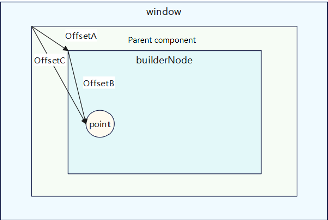

# BuilderNode

The **BuilderNode** module provides APIs for a BuilderNode – a custom node that can be used to mount built-in components. A BuilderNode can be used only as a leaf node. For details, see [BuilderNode Development](../../ui/arkts-user-defined-arktsNode-builderNode.md).

> **NOTE**
>
> The initial APIs of this module are supported since API version 11. Newly added APIs will be marked with a superscript to indicate their earliest API version.
> 
> If you encounter display issues when reusing a BuilderNode across pages, see [Cross-Page Reuse Considerations](../../ui/arkts-user-defined-arktsNode-builderNode.md#cross-page-reuse-considerations) for guidance.
> 
> **BuilderNode** is not available in DevEco Studio Previewer.

## Modules to Import

```ts
import { BuilderNode, RenderOptions, NodeRenderType } from "@kit.ArkUI";
```

## NodeRenderType

Enumerates the node rendering types.

**Atomic service API**: This API can be used in atomic services since API version 12.

**System capability**: SystemCapability.ArkUI.ArkUI.Full

| Name               | Value | Description                        |
| ------------------- | --- | ---------------------------- |
| RENDER_TYPE_DISPLAY | 0   | The node is displayed on the screen.|
| RENDER_TYPE_TEXTURE | 1   | The node is exported as a texture.  |

> **NOTE**
>
> Currently, the **RENDER_TYPE_TEXTURE** type takes effect only for the [XComponentNode](./js-apis-arkui-xcomponentNode.md) and the [BuilderNode](#buildernode-1) holding a component tree whose root node is a custom component.
>
> In the case of [BuilderNode](#buildernode-1), the following custom components that function as the root node support texture export: Badge, Blank, Button, CanvasGradient, CanvasPattern, CanvasRenderingContext2D, Canvas, CheckboxGroup, Checkbox, Circle, ColumnSplit, Column, ContainerSpan, Counter, DataPanel, Divider, Ellipse, Flex, Gauge, Hyperlink, ImageBitmap, ImageData, Image, Line, LoadingProgress, Marquee, Matrix2D, OffscreenCanvasRenderingContext2D, OffscreenCanvas, Path2D, Path, PatternLock, Polygon, Polyline, Progress, QRCode, Radio, Rating, Rect, RelativeContainer, RowSplit, Row, Shape, Slider, Span, Stack, TextArea, TextClock, TextInput, TextTimer, Text, Toggle, Video (without support for full-screen playback), Web, XComponent
>
> The following components support texture export since API version 12: DatePicker, ForEach, Grid, IfElse, LazyForEach, List, Scroll, Swiper, TimePicker, @Component decorated custom components, NodeContainer, and FrameNode and RenderNode mounted to a NodeContainer.
>
> For details, see [Rendering and Drawing Video and Button Components at the Same Layer](../../web/web-same-layer.md).

## RenderOptions

Provides optional parameters for creating a BuilderNode.

**Atomic service API**: This API can be used in atomic services since API version 12.

**System capability**: SystemCapability.ArkUI.ArkUI.Full

| Name         | Type                                  | Mandatory| Description                                                        |
| ------------- | -------------------------------------- | ---- | ------------------------------------------------------------ |
| selfIdealSize | [Size](js-apis-arkui-graphics.md#size) | No  | Ideal size of the node.                                            |
| type          | [NodeRenderType](#noderendertype)      | No  | Rendering type of the node.                                            |
| surfaceId     | string                                 | No  | Surface ID of the texture receiver. Generally, the texture receiver is an [OH_NativeImage](../apis-arkgraphics2d/_o_h___native_image.md#oh_nativeimage) instance.|

## BuilderNode

class BuilderNode\<Args extends Object[]>

Implements a BuilderNode, which can create a component tree through the stateless UI method [@Builder](../../ui/state-management/arkts-builder.md) and hold the root node of the component tree. A BuilderNode cannot be defined as a state variable. The FrameNode held in the BuilderNode is only used to mount the BuilderNode to other FrameNodes as a child node. Undefined behavior may occur if you set attributes or perform operations on subnodes of the FrameNode held by the BuilderNode. Therefore, after you have obtained a [RenderNode](js-apis-arkui-renderNode.md#rendernode) through the [getFrameNode](#getframenode) method of the BuilderNode and the [getRenderNode](js-apis-arkui-frameNode.md#getrendernode) method of the [FrameNode](js-apis-arkui-frameNode.md#framenode), avoid setting the attributes or operating the subnodes through APIs of the [RenderNode](js-apis-arkui-renderNode.md#rendernode).

**Atomic service API**: This API can be used in atomic services since API version 12.

**System capability**: SystemCapability.ArkUI.ArkUI.Full

### constructor

constructor(uiContext: UIContext, options?: RenderOptions)

Constructor for creating a BuilderNode. When the content generated by the BuilderNode is embedded in another RenderNode for display, that is, the RenderNode corresponding to the BuilderNode is mounted to another RenderNode for display, **selfIdealSize** in **RenderOptions** must be explicitly specified. If **selfIdealSize** is not set, the node in the builder follows the default parent component layout constraint [0, 0], which means that the size of the root node of the subtree in BuilderNode is [0, 0].

**Atomic service API**: This API can be used in atomic services since API version 12.

**System capability**: SystemCapability.ArkUI.ArkUI.Full

| Name   | Type                                   | Mandatory| Description                                                             |
| --------- | --------------------------------------- | ---- | ----------------------------------------------------------------- |
| uiContext | [UIContext](js-apis-arkui-UIContext.md) | Yes  | UI context. For details about how to obtain it, see [Obtaining UI Context](./js-apis-arkui-node.md#obtaining-ui-context).|
| options   | [RenderOptions](#renderoptions)         | No  | Parameters for creating a BuilderNode. Default value: **undefined**  |

> **NOTE**
> The input parameter for **uiContext** must be a valid value, that is, the UI context must be correct. If an invalid value is passed in or if no value is specified, creation will fail.

### build

build(builder: WrappedBuilder\<Args>, arg?: Object): void

Creates a component tree based on the passed object and holds the root node of the component tree. The stateless UI method [@Builder](../../ui/state-management/arkts-builder.md) has at most one root node.
Custom components are allowed. Yet, the custom components cannot use decorators, such as [@Reusable](../../ui/state-management/arkts-create-custom-components.md#basic-structure-of-a-custom-component), [@Link](../../ui/state-management/arkts-link.md), [@Provide](../../ui/state-management/arkts-provide-and-consume.md), and [@Consume](../../ui/state-management/arkts-provide-and-consume.md), for state synchronization with the page to which the BuilderNode is mounted.
Since API version 12, custom components can receive [LocalStorage](../../ui/state-management/arkts-localstorage.md) instances. You can use LocalStorage related decorators such as [@LocalStorageProp](../../ui/state-management/arkts-localstorage.md#localstorageprop) and [@LocalStorageLink](../../ui/state-management/arkts-localstorage.md#localstoragelink) by [passing LocalStorage instances](../../ui/state-management/arkts-localstorage.md#example-of-providing-a-custom-component-with-access-to-a-localstorage-instance).

> **NOTE**
> 
> When nesting @Builder, ensure that the input objects for the inner and outer @Builder methods are consistent.
>
> The outermost @Builder supports only one input argument.
> 
> To operate objects in a BuilderNode, ensure that the reference to the BuilderNode is not garbage collected. Once a BuilderNode object is collected by the virtual machine, its FrameNode and RenderNode objects will also be dereferenced from the backend nodes. This means that any FrameNode objects obtained from a BuilderNode will no longer correspond to any actual node if the BuilderNode is garbage collected.

**Atomic service API**: This API can be used in atomic services since API version 12.

**System capability**: SystemCapability.ArkUI.ArkUI.Full

**Parameters**

| Name | Type                                                           | Mandatory| Description                                                                                  |
| ------- | --------------------------------------------------------------- | ---- | -------------------------------------------------------------------------------------- |
| builder | [WrappedBuilder\<Args>](../../ui/state-management/arkts-wrapBuilder.md) | Yes  | Stateless UI method [@Builder](../../ui/state-management/arkts-builder.md) required for creating a component tree.|
| arg     | Object                                                          | No  | Argument of the builder. Only one input argument is supported, and the type of the input argument must be consistent with the type defined by @Builder.                                         |


### BuildOptions<sup>12+</sup>

Defines the optional build options.

**Atomic service API**: This API can be used in atomic services since API version 12.

**System capability**: SystemCapability.ArkUI.ArkUI.Full

| Name         | Type                                  | Mandatory| Description                                                        |
| ------------- | -------------------------------------- | ---- | ------------------------------------------------------------ |
| nestingBuilderSupported |boolean | No  | Whether to support nesting **@Builder** within **@Builder**. The value **false** means that the input arguments for **@Builder** are consistent, and **true** means the opposite.<br> Default value: **false**                                         |

### build<sup>12+</sup>

build(builder: WrappedBuilder\<Args>, arg: Object, options: [BuildOptions](#buildoptions12)): void

Creates a component tree based on the passed object and holds the root node of the component tree. The stateless UI method [@Builder](../../ui/state-management/arkts-builder.md) has at most one root node.
Custom components are allowed. Yet, the custom components cannot use decorators, such as [@Reusable](../../ui/state-management/arkts-create-custom-components.md#basic-structure-of-a-custom-component), [@Link](../../ui/state-management/arkts-link.md), [@Provide](../../ui/state-management/arkts-provide-and-consume.md), and [@Consume](../../ui/state-management/arkts-provide-and-consume.md), for state synchronization with the current page.
Since API version 12, custom components can receive [LocalStorage](../../ui/state-management/arkts-localstorage.md) instances. You can use LocalStorage related decorators such as [@LocalStorageProp](../../ui/state-management/arkts-localstorage.md#localstorageprop) and [@LocalStorageLink](../../ui/state-management/arkts-localstorage.md#localstoragelink) by [passing LocalStorage instances](../../ui/state-management/arkts-localstorage.md#example-of-providing-a-custom-component-with-access-to-a-localstorage-instance).

> **NOTE**
> 
> For details about the creation and update using @Builder, see [@Builder](../../ui/state-management/arkts-builder.md).
> 
> The outermost @Builder supports only one input argument.

**Atomic service API**: This API can be used in atomic services since API version 12.

**System capability**: SystemCapability.ArkUI.ArkUI.Full

**Parameters**

| Name | Type                                                           | Mandatory| Description                                                                                   |
| ------- | --------------------------------------------------------------- | ---- | -------------------------------------------------------------------------------------- |
| builder | [WrappedBuilder\<Args>](../../ui/state-management/arkts-wrapBuilder.md) | Yes  | Stateless UI method [@Builder](../../ui/state-management/arkts-builder.md) required for creating a component tree.  |
| arg     | Object                                                          | Yes  | Argument of the builder. Only one input argument is supported, and the type of the input argument must be consistent with the type defined by @Builder.                                                           |
| options | BuildOptions                                                    | Yes  | Build options, which determine whether to support nesting **@Builder** within **@Builder**.                                        |

**Example**
```ts
import { BuilderNode, NodeContent } from "@kit.ArkUI";

interface ParamsInterface {
  text: string;
  func: Function;
}

@Builder
function buildTextWithFunc(fun: Function) {
  Text(fun())
    .fontSize(50)
    .fontWeight(FontWeight.Bold)
    .margin({ bottom: 36 })
}

@Builder
function buildText(params: ParamsInterface) {
  Column() {
    Text(params.text)
      .fontSize(50)
      .fontWeight(FontWeight.Bold)
      .margin({ bottom: 36 })
    buildTextWithFunc(params.func)
  }
}


@Entry
@Component
struct Index {
  @State message: string = "HELLO"
  private content: NodeContent = new NodeContent();

  build() {
    Row() {
      Column() {
        Button('addBuilderNode')
          .onClick(() => {
            let buildNode = new BuilderNode<[ParamsInterface]>(this.getUIContext());
            buildNode.build(wrapBuilder<[ParamsInterface]>(buildText), {
              text: this.message, func: () => {
                return "FUNCTION"
              }
            }, { nestingBuilderSupported: true });
            this.content.addFrameNode(buildNode.getFrameNode());
            buildNode.dispose();
          })
        ContentSlot(this.content)
      }
      .id("column")
      .width('100%')
      .height('100%')
    }
    .height('100%')
  }
}
```


### getFrameNode

getFrameNode(): FrameNode | null

Obtains the FrameNode in the BuilderNode. The FrameNode is generated only after the BuilderNode executes the build operation.

**Atomic service API**: This API can be used in atomic services since API version 12.

**System capability**: SystemCapability.ArkUI.ArkUI.Full

**Return value**

| Type                                                     | Description                                                                 |
| --------------------------------------------------------- | --------------------------------------------------------------------- |
| [FrameNode](js-apis-arkui-frameNode.md#framenode) \| null | **FrameNode** object. If no such object is held by the **BuilderNode** instance, null is returned.|

**Example 1**

In this example, the BuilderNode is returned as the root node of the **NodeContainer**.

```ts
import { NodeController, BuilderNode, FrameNode, UIContext } from "@kit.ArkUI";

class Params {
  text: string = ""
  constructor(text: string) {
    this.text = text;
  }
}

@Builder
function buildText(params: Params) {
  Column() {
    Text(params.text)
      .fontSize(50)
      .fontWeight(FontWeight.Bold)
      .margin({bottom: 36})
  }
}

class TextNodeController extends NodeController {
  private textNode: BuilderNode<[Params]> | null = null;
  private message: string = "DEFAULT";

  constructor(message: string) {
    super();
    this.message = message;
  }

  makeNode(context: UIContext): FrameNode | null {
    this.textNode = new BuilderNode(context);
    this.textNode.build(wrapBuilder<[Params]>(buildText), new Params(this.message))

    return this.textNode.getFrameNode();
  }
}

@Entry
@Component
struct Index {
  @State message: string = "hello"

  build() {
    Row() {
      Column() {
        NodeContainer(new TextNodeController(this.message))
          .width('100%')
          .height(100)
          .backgroundColor('#FFF0F0F0')
      }
      .width('100%')
      .height('100%')
    }
    .height('100%')
  }
}
```

**Example 2**

This example shows how to mount a FrameNode within a BuilderNode to another FrameNode.

```ts
import { NodeController, BuilderNode, FrameNode, UIContext } from "@kit.ArkUI";

class Params {
  text: string = ""

  constructor(text: string) {
    this.text = text;
  }
}

@Builder
function buildText(params: Params) {
  Column() {
    Text(params.text)
      .fontSize(50)
      .fontWeight(FontWeight.Bold)
      .margin({ bottom: 36 })
  }
}

class TextNodeController extends NodeController {
  private rootNode: FrameNode | null = null;
  private textNode: BuilderNode<[Params]> | null = null;
  private message: string = "DEFAULT";

  constructor(message: string) {
    super();
    this.message = message;
  }

  makeNode(context: UIContext): FrameNode | null {
    this.rootNode = new FrameNode(context);
    this.textNode = new BuilderNode(context, { selfIdealSize: { width: 150, height: 150 } });
    this.textNode.build(wrapBuilder<[Params]>(buildText), new Params(this.message));
    if (this.rootNode !== null) {
      this.rootNode.appendChild(this.textNode?.getFrameNode());
    }

    return this.rootNode;
  }
}

@Entry
@Component
struct Index {
  @State message: string = "hello"

  build() {
    Row() {
      Column() {
        NodeContainer(new TextNodeController(this.message))
          .width('100%')
          .height(100)
          .backgroundColor('#FFF0F0F0')
      }
      .width('100%')
      .height('100%')
    }
    .height('100%')
  }
}
```

**Example 3**

This example shows how to mount a BuilderNode's RenderNode under another RenderNode. Since the RenderNode does not pass layout constraints, this mode of mounting nodes is not recommended.

```ts
import { NodeController, BuilderNode, FrameNode, UIContext, RenderNode } from "@kit.ArkUI";

class Params {
  text: string = ""

  constructor(text: string) {
    this.text = text;
  }
}

@Builder
function buildText(params: Params) {
  Column() {
    Text(params.text)
      .fontSize(50)
      .fontWeight(FontWeight.Bold)
      .margin({ bottom: 36 })
  }
}

class TextNodeController extends NodeController {
  private rootNode: FrameNode | null = null;
  private textNode: BuilderNode<[Params]> | null = null;
  private message: string = "DEFAULT";

  constructor(message: string) {
    super();
    this.message = message;
  }

  makeNode(context: UIContext): FrameNode | null {
    this.rootNode = new FrameNode(context);
    let renderNode = new RenderNode();
    renderNode.clipToFrame = false;
    this.textNode = new BuilderNode(context, { selfIdealSize: { width: 150, height: 150 } });
    this.textNode.build(wrapBuilder<[Params]>(buildText), new Params(this.message));
    const textRenderNode = this.textNode?.getFrameNode()?.getRenderNode();

    const rootRenderNode = this.rootNode.getRenderNode();
    if (rootRenderNode !== null) {
      rootRenderNode.appendChild(renderNode);
      renderNode.appendChild(textRenderNode);
    }

    return this.rootNode;
  }
}

@Entry
@Component
struct Index {
  @State message: string = "hello"

  build() {
    Row() {
      Column() {
        NodeContainer(new TextNodeController(this.message))
          .width('100%')
          .height(100)
          .backgroundColor('#FFF0F0F0')
      }
      .width('100%')
      .height('100%')
    }
    .height('100%')
  }
}
```

### update

update(arg: Object): void

Updates this BuilderNode based on the provided parameter, which is of the same type as the input parameter passed to the [build](#build) API. To call this API on a custom component, the variable used in the component must be defined as the @Prop type.

**Atomic service API**: This API can be used in atomic services since API version 12.

**System capability**: SystemCapability.ArkUI.ArkUI.Full

**Parameters**

| Name| Type  | Mandatory| Description                                                                    |
| ------ | ------ | ---- | ------------------------------------------------------------------------ |
| arg    | Object | Yes  | Parameter used to update the BuilderNode. It is of the same type as the parameter passed to the [build](#build) API.|

**Example**
```ts
import { NodeController, BuilderNode, FrameNode, UIContext } from "@kit.ArkUI";

class Params {
  text: string = ""
  constructor(text: string) {
    this.text = text;
  }
}

// Custom component
@Component
struct TextBuilder {
  @Prop message: string = "TextBuilder";

  build() {
    Row() {
      Column() {
        Text(this.message)
          .fontSize(50)
          .fontWeight(FontWeight.Bold)
          .margin({bottom: 36})
          .backgroundColor(Color.Gray)
      }
    }
  }
}

@Builder
function buildText(params: Params) {
  Column() {
    Text(params.text)
      .fontSize(50)
      .fontWeight(FontWeight.Bold)
      .margin({ bottom: 36 })
    TextBuilder({message: params.text}) // Custom component
  }
}

class TextNodeController extends NodeController {
  private rootNode: FrameNode | null = null;
  private textNode: BuilderNode<[Params]> | null = null;
  private message: string = "";

  constructor(message: string) {
    super()
    this.message = message
  }

  makeNode(context: UIContext): FrameNode | null {
    this.textNode = new BuilderNode(context);
    this.textNode.build(wrapBuilder<[Params]>(buildText), new Params(this.message))
    return this.textNode.getFrameNode();
  }

  update(message: string) {
    if (this.textNode !== null) {
      this.textNode.update(new Params(message));
    }
  }
}

@Entry
@Component
struct Index {
  @State message: string = "hello"
  private textNodeController: TextNodeController = new TextNodeController(this.message);
  private count = 0;

  build() {
    Row() {
      Column() {
        NodeContainer(this.textNodeController)
          .width('100%')
          .height(200)
          .backgroundColor('#FFF0F0F0')
        Button('Update')
          .onClick(() => {
            this.count += 1;
            const message = "Update " + this.count.toString();
            this.textNodeController.update(message);
          })
      }
      .width('100%')
      .height('100%')
    }
    .height('100%')
  }
}
```

### postTouchEvent

postTouchEvent(event: TouchEvent): boolean

Posts a raw touch event to the FrameNode created by this BuilderNode.

**postTouchEvent** dispatches the event from a middle node in the component tree downwards. To ensure the event is dispatched correctly, it needs to be transformed into the coordinate system of the parent component, as shown in the figure below.

**OffsetA** indicates the offset of the BuildNode relative to the parent component. You can obtain this offset by calling [getPositionToParent](js-apis-arkui-frameNode.md#getpositiontoparent12) in the FrameNode. **OffsetB** indicates the offset of the touch point relative to the BuildNode. You can obtain this offset from the [TouchEvent](arkui-ts/ts-universal-events-touch.md#touchevent) object. **OffsetC** is the sum of **OffsetA** and **OffsetB**. It represents the final offset that you need to pass to **postTouchEvent**.



> **NOTE**
>
> The coordinates you pass in need to be converted to pixel values (px). If the BuilderNode has any affine transformations applied to it, they must be taken into account and combined with the touch event coordinates.
>
> In [Webview](../apis-arkweb/js-apis-webview.md), coordinate system transformations are already handled internally, so you can directly dispatch the touch event without additional adjustments.
>
> The **postTouchEvent** API can be called only once for the same timestamp.<!--Del-->
>
> [UIExtensionComponent](arkui-ts/ts-container-ui-extension-component-sys.md) is not supported.
<!--DelEnd-->

**Atomic service API**: This API can be used in atomic services since API version 12.

**System capability**: SystemCapability.ArkUI.ArkUI.Full

**Parameters**

| Name| Type                                                                     | Mandatory| Description      |
| ------ | ------------------------------------------------------------------------- | ---- | ---------- |
| event  | [TouchEvent](arkui-ts/ts-universal-events-touch.md#touchevent) | Yes  | Touch event.|

**Return value**

| Type   | Description              |
| ------- | ------------------ |
| boolean | Whether the event is successfully dispatched. The value **true** means the event is consumed by a component that responds to the event, and **false** means that no component responds to the event.<br>**NOTE**<br>If the event does not hit the expected component, ensure the following:<br>1. The coordinate system has been correctly transformed<br>2. The component is in an interactive state.<br>3. The event has been bound to the component.|

**Example**

```ts
import { NodeController, BuilderNode, FrameNode, UIContext } from '@kit.ArkUI';

class Params {
  text: string = "this is a text"
}

@Builder
function ButtonBuilder(params: Params) {
  Column() {
    Button(`button ` + params.text)
      .borderWidth(2)
      .backgroundColor(Color.Orange)
      .width("100%")
      .height("100%")
      .gesture(
        TapGesture()
          .onAction((event: GestureEvent) => {
            console.log("TapGesture");
          })
      )
  }
  .width(500)
  .height(300)
  .backgroundColor(Color.Gray)
}

class MyNodeController extends NodeController {
  private rootNode: BuilderNode<[Params]> | null = null;
  private wrapBuilder: WrappedBuilder<[Params]> = wrapBuilder(ButtonBuilder);

  makeNode(uiContext: UIContext): FrameNode | null {
    this.rootNode = new BuilderNode(uiContext);
    this.rootNode.build(this.wrapBuilder, { text: "this is a string" })
    return this.rootNode.getFrameNode();
  }

  // Coordinate system transformation
  postTouchEvent(event: TouchEvent, uiContext: UIContext): boolean {
    if (this.rootNode == null) {
      return false;
    }
    let node: FrameNode | null = this.rootNode.getFrameNode();
    let offsetX: number | null | undefined = node?.getPositionToParent().x;
    let offsetY: number | null | undefined = node?.getPositionToParent().y;
    
    let changedTouchLen = event.changedTouches.length;
    for (let i = 0; i < changedTouchLen; i++) {
      if (offsetX != null && offsetY != null && offsetX != undefined && offsetY != undefined) {
        event.changedTouches[i].x = uiContext.vp2px(offsetX + event.changedTouches[i].x);
        event.changedTouches[i].y = uiContext.vp2px(offsetY + event.changedTouches[i].y);
      }
    }
    let result = this.rootNode.postTouchEvent(event);
    console.log("result " + result);
    return result;
  }
}

@Entry
@Component
struct MyComponent {
  private nodeController: MyNodeController = new MyNodeController();

  build() {
    Column() {
      NodeContainer(this.nodeController)
        .height(300)
        .width(500)

      Column()
        .width(500)
        .height(300)
        .backgroundColor(Color.Pink)
        .onTouch((event) => {
          if (event != undefined) {
            this.nodeController.postTouchEvent(event, this.getUIContext());
          }
        })
    }
  }
}
```

### dispose<sup>12+</sup>

dispose(): void

Releases this BuilderNode immediately. Calling **dispose** on a **BuilderNode** object breaks its reference to the backend entity node, and also simultaneously severs the references of its contained FrameNode and RenderNode to their respective entity nodes.

> **NOTE**
>
> Calling **dispose** on a **BuilderNode** object breaks its reference to the backend entity node, and also simultaneously severs the references of its contained FrameNode and RenderNode to their respective entity nodes.
>
> If the frontend object BuilderNode cannot be released, memory leaks may occur. To avoid this, be sure to call **dispose** on the BuilderNode when you no longer need it. This reduces the complexity of reference relationships and lowers the risk of memory leaks.

**Atomic service API**: This API can be used in atomic services since API version 12.

**System capability**: SystemCapability.ArkUI.ArkUI.Full

```ts
import { RenderNode, FrameNode, NodeController, BuilderNode } from "@kit.ArkUI";

@Component
struct TestComponent {
  build() {
    Column() {
      Text('This is a BuilderNode.')
        .fontSize(16)
        .fontWeight(FontWeight.Bold)
    }
    .width('100%')
    .backgroundColor(Color.Gray)
  }

  aboutToAppear() {
    console.error('aboutToAppear');
  }

  aboutToDisappear() {
    console.error('aboutToDisappear');
  }
}

@Builder
function buildComponent() {
  TestComponent()
}

class MyNodeController extends NodeController {
  private rootNode: FrameNode | null = null;
  private builderNode: BuilderNode<[]> | null = null;

  makeNode(uiContext: UIContext): FrameNode | null {
    this.rootNode = new FrameNode(uiContext);
    this.builderNode = new BuilderNode(uiContext, { selfIdealSize: { width: 200, height: 100 } });
    this.builderNode.build(new WrappedBuilder(buildComponent));

    const rootRenderNode = this.rootNode!.getRenderNode();
    if (rootRenderNode !== null) {
      rootRenderNode.size = { width: 200, height: 200 };
      rootRenderNode.backgroundColor = 0xff00ff00;
      rootRenderNode.appendChild(this.builderNode!.getFrameNode()!.getRenderNode());
    }

    return this.rootNode;
  }

  dispose() {
    if (this.builderNode !== null) {
      this.builderNode.dispose();
    }
  }

  removeBuilderNode() {
    const rootRenderNode = this.rootNode!.getRenderNode();
    if (rootRenderNode !== null && this.builderNode !== null && this.builderNode.getFrameNode() !== null) {
      rootRenderNode.removeChild(this.builderNode!.getFrameNode()!.getRenderNode());
    }
  }
}

@Entry
@Component
struct Index {
  private myNodeController: MyNodeController = new MyNodeController();

  build() {
    Column({ space: 4 }) {
      NodeContainer(this.myNodeController)
      Button('BuilderNode dispose')
        .onClick(() => {
          this.myNodeController.removeBuilderNode();
          this.myNodeController.dispose();
        })
        .width('100%')
    }
  }
}
```

### reuse<sup>12+</sup>

reuse(param?: Object): void

Passes the reuse event to the custom component in this BuilderNode.

**Atomic service API**: This API can be used in atomic services since API version 12.

**System capability**: SystemCapability.ArkUI.ArkUI.Full

**Parameters**

| Name| Type  | Mandatory| Description                                                                    |
| ------ | ------ | ---- | ------------------------------------------------------------------------ |
| param  | Object | No  | Parameter used to reuse the BuilderNode. It is of the same type as the parameter passed to the [build](#build) API.|

### recycle<sup>12+</sup>

recycle(): void

Passes the recycle event to the custom component in this BuilderNode.

**Atomic service API**: This API can be used in atomic services since API version 12.

**System capability**: SystemCapability.ArkUI.ArkUI.Full

```ts
import { FrameNode, NodeController, BuilderNode, UIContext } from "@kit.ArkUI";

const TEST_TAG: string = "Reuse+Recycle";

class MyDataSource {
  private dataArray: string[] = [];
  private listener: DataChangeListener | null = null

  public totalCount(): number {
    return this.dataArray.length;
  }

  public getData(index: number) {
    return this.dataArray[index];
  }

  public pushData(data: string) {
    this.dataArray.push(data);
  }

  public reloadListener(): void {
    this.listener?.onDataReloaded();
  }

  public registerDataChangeListener(listener: DataChangeListener): void {
    this.listener = listener;
  }

  public unregisterDataChangeListener(): void {
    this.listener = null;
  }
}

class Params {
  item: string = '';

  constructor(item: string) {
    this.item = item;
  }
}

@Builder
function buildNode(param: Params = new Params("hello")) {
  Row() {
    Text(`C${param.item} -- `)
    ReusableChildComponent2({ item: param.item }) // This custom component cannot be correctly reused in the BuilderNode.
  }
}

class MyNodeController extends NodeController {
  public builderNode: BuilderNode<[Params]> | null = null;
  public item: string = "";

  makeNode(uiContext: UIContext): FrameNode | null {
    if (this.builderNode == null) {
      this.builderNode = new BuilderNode(uiContext, { selfIdealSize: { width: 300, height: 200 } });
      this.builderNode.build(wrapBuilder<[Params]>(buildNode), new Params(this.item));
    }
    return this.builderNode.getFrameNode();
  }
}

// The custom component that is reused and recycled will have its state variables updated, and the state variables of the nested custom component ReusableChildComponent3 will also be updated. However, the BuilderNode will block this propagation process.
@Reusable
@Component
struct ReusableChildComponent {
  @Prop item: string = '';
  @Prop switch: string = '';
  private controller: MyNodeController = new MyNodeController();

  aboutToAppear() {
    this.controller.item = this.item;
  }

  aboutToRecycle(): void {
    console.log(`${TEST_TAG} ReusableChildComponent aboutToRecycle ${this.item}`);

    // When the switch is open, pass the recycle event to the nested custom component, such as ReusableChildComponent2, through the BuilderNode's recycle API to complete recycling.
    if (this.switch === 'open') {
      this.controller?.builderNode?.recycle();
    }
  }

  aboutToReuse(params: object): void {
    console.log(`${TEST_TAG} ReusableChildComponent aboutToReuse ${JSON.stringify(params)}`);

    // When the switch is open, pass the reuse event to the nested custom component, such as ReusableChildComponent2, through the BuilderNode's reuse API to complete reuse.
    if (this.switch === 'open') {
      this.controller?.builderNode?.reuse(params);
    }
  }

  build() {
    Row() {
      Text(`A${this.item}--`)
      ReusableChildComponent3({ item: this.item })
      NodeContainer(this.controller);
    }
  }
}

@Component
struct ReusableChildComponent2 {
  @Prop item: string = "false";

  aboutToReuse(params: Record<string, object>) {
    console.log(`${TEST_TAG} ReusableChildComponent2 aboutToReuse ${JSON.stringify(params)}`);
  }

  aboutToRecycle(): void {
    console.log(`${TEST_TAG} ReusableChildComponent2 aboutToRecycle ${this.item}`);
  }

  build() {
    Row() {
      Text(`D${this.item}`)
        .fontSize(20)
        .backgroundColor(Color.Yellow)
        .margin({ left: 10 })
    }.margin({ left: 10, right: 10 })
  }
}

@Component
struct ReusableChildComponent3 {
  @Prop item: string = "false";

  aboutToReuse(params: Record<string, object>) {
    console.log(`${TEST_TAG} ReusableChildComponent3 aboutToReuse ${JSON.stringify(params)}`);
  }

  aboutToRecycle(): void {
    console.log(`${TEST_TAG} ReusableChildComponent3 aboutToRecycle ${this.item}`);
  }

  build() {
    Row() {
      Text(`B${this.item}`)
        .fontSize(20)
        .backgroundColor(Color.Yellow)
        .margin({ left: 10 })
    }.margin({ left: 10, right: 10 })
  }
}


@Entry
@Component
struct Index {
  @State data: MyDataSource = new MyDataSource();

  aboutToAppear() {
    for (let i = 0; i < 100; i++) {
      this.data.pushData(i.toString());
    }
  }

  build() {
    Column() {
      List({ space: 3 }) {
        LazyForEach(this.data, (item: string) => {
          ListItem() {
            ReusableChildComponent({
              item: item,
              switch: 'open' // Changing open to close can be used to observe the behavior of custom components inside the BuilderNode when reuse and recycle events are not passed through the BuilderNode's reuse and recycle APIs.
            })
          }
        }, (item: string) => item)
      }
      .width('100%')
      .height('100%')
    }
  }
}
```

### updateConfiguration<sup>12+</sup>

updateConfiguration(): void  

Updates the configuration of the entire node by passing in a [system environment change](../apis-ability-kit/js-apis-app-ability-configuration.md) event.

**Atomic service API**: This API can be used in atomic services since API version 12.

**System capability**: SystemCapability.ArkUI.ArkUI.Full

> **NOTE**
>
> The **updateConfiguration** API is used to instruct an object to update, with the system environment used for the update being determined by the changes in the application's current system environment.

**Example**
```ts
import { NodeController, BuilderNode, FrameNode, UIContext } from "@kit.ArkUI";
import { AbilityConstant, Configuration, ConfigurationConstant, EnvironmentCallback } from '@kit.AbilityKit';

class Params {
  text: string = ""

  constructor(text: string) {
    this.text = text;
  }
}

// Custom component
@Component
struct TextBuilder {
  // The @Prop decorated attribute is the attribute to be updated in the custom component. It is a basic attribute.
  @Prop message: string = "TextBuilder";

  build() {
    Row() {
      Column() {
        Text(this.message)
          .fontSize(50)
          .fontWeight(FontWeight.Bold)
          .margin({ bottom: 36 })
      }
    }
  }
}

@Builder
function buildText(params: Params) {
  Column() {
    Text(params.text)
      .fontSize(50)
      .fontWeight(FontWeight.Bold)
      .margin({ bottom: 36 })
    TextBuilder({ message: params.text }) // Custom component
  }.backgroundColor($r('sys.color.ohos_id_color_background'))
}

class TextNodeController extends NodeController {
  private textNode: BuilderNode<[Params]> | null = null;
  private message: string = "";

  constructor(message: string) {
    super()
    this.message = message;
  }

  makeNode(context: UIContext): FrameNode | null {
    return this.textNode?.getFrameNode() ? this.textNode?.getFrameNode() : null;
  }

  createNode(context: UIContext) {
    this.textNode = new BuilderNode(context);
    this.textNode.build(wrapBuilder<[Params]>(buildText), new Params(this.message));
    builderNodeMap.push(this.textNode);
  }

  deleteNode() {
    let node = builderNodeMap.pop();
    node?.dispose();
  }

  update(message: string) {
    if (this.textNode !== null) {
      // Call update to perform an update.
      this.textNode.update(new Params(message));
    }
  }
}

// Record the created custom node object.
const builderNodeMap: Array<BuilderNode<[Params]>> = new Array();

function updateColorMode() {
  builderNodeMap.forEach((value, index) => {
    // Notify BuilderNode of the environment changes.
    value.updateConfiguration();
  })
}

@Entry
@Component
struct Index {
  @State message: string = "hello"
  private textNodeController: TextNodeController = new TextNodeController(this.message);
  private count = 0;

  aboutToAppear(): void {
    let environmentCallback: EnvironmentCallback = {
      onMemoryLevel: (level: AbilityConstant.MemoryLevel): void => {
        console.log('onMemoryLevel');
      },
      onConfigurationUpdated: (config: Configuration): void => {
        console.log('onConfigurationUpdated ' + JSON.stringify(config));
        updateColorMode();
      }
    }
    // Register a callback.
    this.getUIContext().getHostContext()?.getApplicationContext().on('environment', environmentCallback);
    // Set the application color mode to follow the system settings.
    this.getUIContext()
      .getHostContext()?.getApplicationContext().setColorMode(ConfigurationConstant.ColorMode.COLOR_MODE_NOT_SET);
    // Create a custom node and add it to the map.
    this.textNodeController.createNode(this.getUIContext());
  }

  aboutToDisappear(): void {
    // Remove the reference to the custom node from the map and release the node.
    this.textNodeController.deleteNode();
  }

  build() {
    Row() {
      Column() {
        NodeContainer(this.textNodeController)
          .width('100%')
          .height(200)
          .backgroundColor('#FFF0F0F0')
        Button('Update')
          .onClick(() => {
            this.count += 1;
            const message = "Update " + this.count.toString();
            this.textNodeController.update(message);
          })
        Button('Switch to Dark Mode')
          .onClick(() => {
            this.getUIContext()
              .getHostContext()?.getApplicationContext().setColorMode(ConfigurationConstant.ColorMode.COLOR_MODE_DARK);
          })
        Button('Switch to Light Mode')
          .onClick(() => {
            this.getUIContext()
              .getHostContext()?.getApplicationContext().setColorMode(ConfigurationConstant.ColorMode.COLOR_MODE_LIGHT);
          })
      }
      .width('100%')
      .height('100%')
    }
    .height('100%')
  }
}
```
