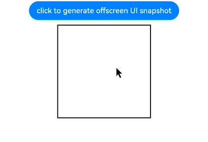

# @ohos.arkui.componentSnapshot (Component Snapshot)

The **componentSnapshot** module provides APIs for obtaining component snapshots, including snapshots of components that have been loaded and snapshots of components that have not been loaded yet. Note that a component snapshot does not contain content drawn outside the area of the owning component or the parent component. If sibling nodes are stacked in the component area, they are not displayed in the screenshot.

> **NOTE**
>
> The initial APIs of this module are supported since API version 10. Newly added APIs will be marked with a superscript to indicate their earliest API version.
>
>In scenarios where [XComponent](arkui-ts/ts-basic-components-xcomponent.md) is used to, for example, display video or camera streams, obtain images through [surface](../apis-image-kit/js-apis-image.md#imagecreatepixelmapfromsurface11), instead of through an API in this module.
>
>If the content of a component does not fill the entire area allocated for it, any remaining space in the snapshot will be rendered as transparent pixels. In addition, if the component uses [image effects](arkui-ts/ts-universal-attributes-image-effect.md) or other effect-related attributes, the resulting snapshot may not be as expected. To address these potential issues, check whether to fill the component's transparent content area or to use an alternative method such as taking a [window screenshot](js-apis-window.md#snapshot9).
>
> You can preview how this component looks on a real device, but not in DevEco Studio Previewer.


## Modules to Import

```ts
import { componentSnapshot } from '@kit.ArkUI';
```

## componentSnapshot.get

get(id: string, callback: AsyncCallback<image.PixelMap>, options?: SnapshotOptions): void

Obtains the snapshot of a component that has been loaded. This API uses an asynchronous callback to return the result.

> **NOTE**
>
> The snapshot captures content rendered in the last frame. If this API is called when the component triggers an update, the re-rendered content will not be included in the obtained snapshot.

**Atomic service API**: This API can be used in atomic services since API version 12.

**System capability**: SystemCapability.ArkUI.ArkUI.Full

**Parameters**

| Name     | Type                                 | Mandatory  | Description                                      |
| -------- | ----------------------------------- | ---- | ---------------------------------------- |
| id       | string                              | Yes   | [ID](arkui-ts/ts-universal-attributes-component-id.md) of the target component.|
| callback | [AsyncCallback](../apis-basic-services-kit/js-apis-base.md#asynccallback)&lt;image.[PixelMap](../apis-image-kit/js-apis-image.md#pixelmap7)&gt; | Yes   | Callback used to return the result.                              |
| options<sup>12+</sup>       | [SnapshotOptions](#snapshotoptions12)                              | No   | Custom settings of the snapshot.|

**Error codes**

For details about the error codes, see [Universal Error Codes](../errorcode-universal.md).

| ID| Error Message           |
| -------- | ------------------- |
| 401      | Parameter error. Possible causes: 1. Mandatory parameters are left unspecified; 2.Incorrect parameters types; 3. Parameter verification failed.   |
| 100001   | Invalid ID. |

**Example**

> **NOTE**
> 
> To avoid confusion with **componentSnapshot** instances, it is recommended that you obtain a **UIContext** instance using the [getUIContext](js-apis-arkui-UIContext.md#uicontext) API, and then obtain the **componentSnapshot** instance bound to the context through the [getComponentSnapshot](js-apis-arkui-UIContext.md#getcomponentsnapshot12) API.

```ts
import { componentSnapshot } from '@kit.ArkUI';
import { image } from '@kit.ImageKit';

@Entry
@Component
struct SnapshotExample {
  @State pixmap: image.PixelMap | undefined = undefined

  build() {
    Column() {
      Row() {
        Image(this.pixmap).width(200).height(200).border({ color: Color.Black, width: 2 }).margin(5)
        Image($r('app.media.img')).autoResize(true).width(200).height(200).margin(5).id("root")
      }
      Button("click to generate UI snapshot")
        .onClick(() => {
          // You are advised to use this.getUIContext().getComponentSnapshot().get().
          componentSnapshot.get("root", (error: Error, pixmap: image.PixelMap) => {
            if (error) {
              console.log("error: " + JSON.stringify(error))
              return;
            }
            this.pixmap = pixmap
          }, {scale : 2, waitUntilRenderFinished : true})
        }).margin(10)
    }
    .width('100%')
    .height('100%')
    .alignItems(HorizontalAlign.Center)
  }
}
```

 

## componentSnapshot.get

get(id: string, options?: SnapshotOptions): Promise<image.PixelMap>

Obtains the snapshot of a component that has been loaded. This API uses a promise to return the result.

> **NOTE**
>
> The snapshot captures content rendered in the last frame. If this API is called when the component triggers an update, the re-rendered content will not be included in the obtained snapshot.

**Atomic service API**: This API can be used in atomic services since API version 12.

**System capability**: SystemCapability.ArkUI.ArkUI.Full

**Parameters**

| Name | Type    | Mandatory  | Description                                      |
| ---- | ------ | ---- | ---------------------------------------- |
| id   | string | Yes   | [ID](arkui-ts/ts-universal-attributes-component-id.md) of the target component.|
| options<sup>12+</sup>       | [SnapshotOptions](#snapshotoptions12)                              | No   | Custom settings of the snapshot.|

**Return value**

| Type                           | Description      |
| ----------------------------- | -------- |
| Promise&lt;image.[PixelMap](../apis-image-kit/js-apis-image.md#pixelmap7)&gt; | Promise used to return the result.|

**Error codes**

For details about the error codes, see [Universal Error Codes](../errorcode-universal.md).

| ID | Error Message               |
| ------ | ------------------- |
| 401      | Parameter error. Possible causes: 1. Mandatory parameters are left unspecified; 2.Incorrect parameters types; 3. Parameter verification failed.   |
| 100001 | Invalid ID. |

**Example**

> **NOTE**
> 
> To avoid confusion with **componentSnapshot** instances, it is recommended that you obtain a **UIContext** instance using the [getUIContext](js-apis-arkui-UIContext.md#uicontext) API, and then obtain the **componentSnapshot** instance bound to the context through the [getComponentSnapshot](js-apis-arkui-UIContext.md#getcomponentsnapshot12) API.

```ts
import { componentSnapshot } from '@kit.ArkUI';
import { image } from '@kit.ImageKit';

@Entry
@Component
struct SnapshotExample {
  @State pixmap: image.PixelMap | undefined = undefined

  build() {
    Column() {
      Row() {
        Image(this.pixmap).width(200).height(200).border({ color: Color.Black, width: 2 }).margin(5)
        Image($r('app.media.img')).autoResize(true).width(200).height(200).margin(5).id("root")
      }
      Button("click to generate UI snapshot")
        .onClick(() => {
          // You are advised to use this.getUIContext().getComponentSnapshot().get().
          componentSnapshot.get("root", {scale : 2, waitUntilRenderFinished : true})
            .then((pixmap: image.PixelMap) => {
              this.pixmap = pixmap
            }).catch((err:Error) => {
            console.log("error: " + err)
          })
        }).margin(10)
    }
    .width('100%')
    .height('100%')
    .alignItems(HorizontalAlign.Center)
  }
}
```

 

## componentSnapshot.createFromBuilder

createFromBuilder(builder: CustomBuilder, callback: AsyncCallback<image.PixelMap>, delay?: number, checkImageStatus?: boolean, options?: SnapshotOptions): void

Renders a custom component in the application background and outputs its snapshot. This API uses an asynchronous callback to return the result. The coordinates and size of the offscreen component's drawing area can be obtained through the callback.

> **NOTE**
>
> To account for the time spent in awaiting component building and rendering, the callback of offscreen snapshots has a delay of less than 500 ms.
>
> Components in the builder do not support the setting of animation-related attributes, such as [transition](arkui-ts/ts-transition-animation-component.md).
>
> If a component is on a time-consuming task, for example, an [Image](arkui-ts/ts-basic-components-image.md) or [Web](../apis-arkweb/ts-basic-components-web.md) component that is loading online images, its loading may be still in progress when this API is called. In this case, the output snapshot does not represent the component in the way it looks when the loading is successfully completed.

**Atomic service API**: This API can be used in atomic services since API version 12.

**System capability**: SystemCapability.ArkUI.ArkUI.Full

**Parameters**

| Name     | Type                                      | Mandatory  | Description        |
| -------- | ---------------------------------------- | ---- | ---------- |
| builder  | [CustomBuilder](arkui-ts/ts-types.md#custombuilder8) | Yes   | Builder of the custom component.<br>**NOTE**<br>The global builder is not supported.|
| callback | [AsyncCallback](../apis-basic-services-kit/js-apis-base.md#asynccallback)&lt;image.[PixelMap](../apis-image-kit/js-apis-image.md#pixelmap7)&gt;      | Yes   | Callback used to return the result. The coordinates and size of the offscreen component's drawing area can be obtained through the callback.|
| delay<sup>12+</sup>   | number | No   | Delay time for triggering the screenshot command. When the layout includes an image component, it is necessary to set a delay time to allow the system to decode the image resources. The decoding time is subject to the resource size. In light of this, whenever possible, use pixel map resources that do not require decoding.<br> When pixel map resources are used or when **syncload** to **true** for the **Image** component, you can set **delay** to **0** to forcibly capture snapshots without waiting. This delay time does not refer to the time from the API call to the return: As the system needs to temporarily construct the passed-in **builder** offscreen, the return time is usually longer than this delay.<br>**NOTE**<br>In the **builder** passed in, state variables should not be used to control the construction of child components. If they are used, they should not change when the API is called, so as to avoid unexpected snapshot results.<br> Default value: **300**<br> Unit: ms|
| checkImageStatus<sup>12+</sup>  | boolean | No   | Whether to check the image decoding status before taking a snapshot. If the value is **true**, the system checks whether all **Image** components have been decoded before taking the snapshot. If the check is not completed, the system aborts the snapshot and returns an exception.<br>Default value: **false**|
| options<sup>12+</sup>       | [SnapshotOptions](#snapshotoptions12)           | No   | Custom settings of the snapshot.|

**Error codes**

For details about the error codes, see [Universal Error Codes](../errorcode-universal.md).

| ID| Error Message                                                    |
| -------- | ------------------------------------------------------------ |
| 401      | Parameter error. Possible causes: 1. Mandatory parameters are left unspecified; 2.Incorrect parameters types; 3. Parameter verification failed. |
| 100001   | The builder is not a valid build function.                   |
| 160001   | An image component in builder is not ready for taking a snapshot. The check for the ready state is required when the checkImageStatus option is enabled. |

**Example**

> **NOTE**
> 
> To avoid confusion with **componentSnapshot** instances, it is recommended that you obtain a **UIContext** instance using the [getUIContext](js-apis-arkui-UIContext.md#uicontext) API, and then obtain the **componentSnapshot** instance bound to the context through the [getComponentSnapshot](js-apis-arkui-UIContext.md#getcomponentsnapshot12) API.

```ts
import { componentSnapshot } from '@kit.ArkUI';
import { image } from '@kit.ImageKit';

@Entry
@Component
struct OffscreenSnapshotExample {
  @State pixmap: image.PixelMap | undefined = undefined

  @Builder
  RandomBuilder() {
    Flex({ direction: FlexDirection.Column, justifyContent: FlexAlign.Center, alignItems: ItemAlign.Center }) {
      Text('Test menu item 1')
        .fontSize(20)
        .width(100)
        .height(50)
        .textAlign(TextAlign.Center)
      Divider().height(10)
      Text('Test menu item 2')
        .fontSize(20)
        .width(100)
        .height(50)
        .textAlign(TextAlign.Center)
    }
    .width(100)
    .id("builder")
  }

  build() {
    Column() {
      Button("click to generate offscreen UI snapshot")
        .onClick(() => {
          // You are advised to use this.getUIContext().getComponentSnapshot().createFromBuilder().
          componentSnapshot.createFromBuilder(()=>{this.RandomBuilder()},
            (error: Error, pixmap: image.PixelMap) => {
              if(error){
                console.log("error: " + JSON.stringify(error))
                return;
              }
              this.pixmap = pixmap
              // save pixmap to file
              // ....
              // get component size and location
              let info = this.getUIContext().getComponentUtils().getRectangleById("builder")
              console.log(info.size.width + ' ' + info.size.height + ' ' + info.localOffset.x + ' ' + info.localOffset.y + ' ' + info.windowOffset.x + ' ' + info.windowOffset.y)
            }, 320, true, {scale : 2, waitUntilRenderFinished : true})
        })
      Image(this.pixmap)
        .margin(10)
        .height(200)
        .width(200)
        .border({ color: Color.Black, width: 2 })
    }.width('100%').margin({ left: 10, top: 5, bottom: 5 }).height(300)
  }
}
```

 

## componentSnapshot.createFromBuilder

createFromBuilder(builder: CustomBuilder, delay?: number, checkImageStatus?: boolean, options?: SnapshotOptions): Promise<image.PixelMap>

Renders a custom component in the application background and outputs its snapshot. This API uses a promise to return the result. The coordinates and size of the offscreen component's drawing area can be obtained through the callback.

> **NOTE**
>
> To account for the time spent in awaiting component building and rendering, the callback of offscreen snapshots has a delay of less than 500 ms.
>
> Components in the builder do not support the setting of animation-related attributes, such as [transition](arkui-ts/ts-transition-animation-component.md).
>
> If a component is on a time-consuming task, for example, an [Image](arkui-ts/ts-basic-components-image.md) or [Web](../apis-arkweb/ts-basic-components-web.md) component that is loading online images, its loading may be still in progress when this API is called. In this case, the output snapshot does not represent the component in the way it looks when the loading is successfully completed.

**Atomic service API**: This API can be used in atomic services since API version 12.

**System capability**: SystemCapability.ArkUI.ArkUI.Full

**Parameters**

| Name    | Type                                      | Mandatory  | Description        |
| ------- | ---------------------------------------- | ---- | ---------- |
| builder | [CustomBuilder](arkui-ts/ts-types.md#custombuilder8) | Yes   | Builder of the custom component.<br>**NOTE**<br>The global builder is not supported.|
| delay<sup>12+</sup>   | number | No   | Delay time for triggering the screenshot command. When the layout includes an image component, it is necessary to set a delay time to allow the system to decode the image resources. The decoding time is subject to the resource size. In light of this, whenever possible, use pixel map resources that do not require decoding.<br> When pixel map resources are used or when **syncload** to **true** for the **Image** component, you can set **delay** to **0** to forcibly capture snapshots without waiting. This delay time does not refer to the time from the API call to the return: As the system needs to temporarily construct the passed-in **builder** offscreen, the return time is usually longer than this delay.<br>**NOTE**<br>In the **builder** passed in, state variables should not be used to control the construction of child components. If they are used, they should not change when the API is called, so as to avoid unexpected snapshot results.<br> Default value: **300**<br> Unit: ms|
| checkImageStatus<sup>12+</sup>  | boolean | No   | Whether to check the image decoding status before taking a snapshot. If the value is **true**, the system checks whether all **Image** components have been decoded before taking the snapshot. If the check is not completed, the system aborts the snapshot and returns an exception.<br>Default value: **false**|
| options<sup>12+</sup>       | [SnapshotOptions](#snapshotoptions12)           | No   | Custom settings of the snapshot.|

**Return value**

| Type                           | Description      |
| ----------------------------- | -------- |
| Promise&lt;image.[PixelMap](../apis-image-kit/js-apis-image.md#pixelmap7)&gt; | Promise used to return the result.|

**Error codes**
For details about the error codes, see [Universal Error Codes](../errorcode-universal.md).

| ID | Error Message                                    |
| ------ | ---------------------------------------- |
| 401     | Parameter error. Possible causes: 1. Mandatory parameters are left unspecified; 2.Incorrect parameters types; 3. Parameter verification failed.   |
| 100001 | The builder is not a valid build function. |
| 160001 | An image component in builder is not ready for taking a snapshot. The check for the ready state is required when the checkImageStatus option is enabled. |

**Example**

> **NOTE**
> 
> To avoid confusion with **componentSnapshot** instances, it is recommended that you obtain a **UIContext** instance using the [getUIContext](js-apis-arkui-UIContext.md#uicontext) API, and then obtain the **componentSnapshot** instance bound to the context through the [getComponentSnapshot](js-apis-arkui-UIContext.md#getcomponentsnapshot12) API.

```ts
import { componentSnapshot } from '@kit.ArkUI'
import { image } from '@kit.ImageKit'

@Entry
@Component
struct OffscreenSnapshotExample {
  @State pixmap: image.PixelMap | undefined = undefined

  @Builder
  RandomBuilder() {
    Flex({ direction: FlexDirection.Column, justifyContent: FlexAlign.Center, alignItems: ItemAlign.Center }) {
      Text('Test menu item 1')
        .fontSize(20)
        .width(100)
        .height(50)
        .textAlign(TextAlign.Center)
      Divider().height(10)
      Text('Test menu item 2')
        .fontSize(20)
        .width(100)
        .height(50)
        .textAlign(TextAlign.Center)
    }
    .width(100)
    .id("builder")
  }

  build() {
    Column() {
      Button("click to generate offscreen UI snapshot")
        .onClick(() => {
          // You are advised to use this.getUIContext().getComponentSnapshot().createFromBuilder().
          componentSnapshot.createFromBuilder(()=>{this.RandomBuilder()}, 320, true, {scale : 2, waitUntilRenderFinished : true})
            .then((pixmap: image.PixelMap) => {
              this.pixmap = pixmap
              // save pixmap to file
              // ....
              // get component size and location
              let info = this.getUIContext().getComponentUtils().getRectangleById("builder")
              console.log(info.size.width + ' ' + info.size.height + ' ' + info.localOffset.x + ' ' + info.localOffset.y + ' ' + info.windowOffset.x + ' ' + info.windowOffset.y)
            }).catch((err:Error) => {
            console.log("error: " + err)
          })
        })
      Image(this.pixmap)
        .margin(10)
        .height(200)
        .width(200)
        .border({ color: Color.Black, width: 2 })
    }.width('100%').margin({ left: 10, top: 5, bottom: 5 }).height(300)
  }
}
```

 

## componentSnapshot.getSync<sup>12+</sup>

getSync(id: string, options?: SnapshotOptions): image.PixelMap

Obtains the snapshot of a component that has been loaded. This API synchronously waits for the snapshot to complete and returns a [PixelMap](../apis-image-kit/js-apis-image.md#pixelmap7) object.

> **NOTE**
>
> The snapshot captures content rendered in the last frame. If this API is called when the component triggers an update, the re-rendered content will not be included in the obtained snapshot.

**Atomic service API**: This API can be used in atomic services since API version 12.

**System capability**: SystemCapability.ArkUI.ArkUI.Full

**Parameters**

| Name | Type    | Mandatory  | Description                                      |
| ---- | ------ | ---- | ---------------------------------------- |
| id   | string | Yes   | [ID](arkui-ts/ts-universal-attributes-component-id.md) of the target component.|
| options       | [SnapshotOptions](#snapshotoptions12)                              | No   | Custom settings of the snapshot.|

**Return value**

| Type                           | Description      |
| ----------------------------- | -------- |
| image.[PixelMap](../apis-image-kit/js-apis-image.md#pixelmap7) | Promise used to return the result.|

**Error codes**

For details about the error codes, see [Universal Error Codes](../errorcode-universal.md).

| ID       | Error Message                                                     |
| -------- | ------------------------------------------------------------ |
| 401      | Parameter error. Possible causes: 1. Mandatory parameters are left unspecified; 2.Incorrect parameters types; 3. Parameter verification failed. |
| 100001   | Invalid ID.                                                  |
| 160002   | Timeout.                                                     |

**Example**

> **NOTE**
> 
> To avoid confusion with **componentSnapshot** instances, it is recommended that you obtain a **UIContext** instance using the [getUIContext](js-apis-arkui-UIContext.md#uicontext) API, and then obtain the **componentSnapshot** instance bound to the context through the [getComponentSnapshot](js-apis-arkui-UIContext.md#getcomponentsnapshot12) API.

```ts
import { componentSnapshot } from '@kit.ArkUI';
import { image } from '@kit.ImageKit';

@Entry
@Component
struct SnapshotExample {
  @State pixmap: image.PixelMap | undefined = undefined

  build() {
    Column() {
      Row() {
        Image(this.pixmap).width(200).height(200).border({ color: Color.Black, width: 2 }).margin(5)
        Image($r('app.media.img')).autoResize(true).width(200).height(200).margin(5).id("root")
      }
      Button("click to generate UI snapshot")
        .onClick(() => {
          try {
          // You are advised to use this.getUIContext().getComponentSnapshot().getSync().
            let pixelmap = componentSnapshot.getSync("root", {scale : 2, waitUntilRenderFinished : true})
            this.pixmap = pixelmap
          } catch (error) {
            console.error("getSync errorCode: " + error.code + " message: " + error.message)
          }
        }).margin(10)
    }
    .width('100%')
    .height('100%')
    .alignItems(HorizontalAlign.Center)
  }
}
```

 

## SnapshotOptions<sup>12+</sup>

**System capability**: SystemCapability.ArkUI.ArkUI.Full

**Atomic service API**: This API can be used in atomic services since API version 12.

| Name          | Type            | Mandatory          | Description                        |
| ---------------|------------     | -----------------------------| -----------------------------|
| scale           | number | No| Scale ratio for rendering pixel maps during a snapshot. Note that a high scale ratio may increase the time taken for the snapshot or even result in a snapshot failure.<br> Default value: **1**<br>**NOTE**<br>Avoid capturing images that are excessively large, ideally not larger than the screen size. If the dimensions of the image to capture exceed device-specific underlying limits, the snapshot will fail.   |
| waitUntilRenderFinished    | boolean | No| Whether to enforce waiting for all rendering commands to complete before the system takes the snapshot. This option can ensure that the content of the snapshot is in the most up-to-date state and should be enabled whenever possible. However, it's important to note that enabling this option may result in a longer response time from the API. The specific duration depends on the amount of redraw area required by the page at that particular moment.<br> Default value: **false**        |
