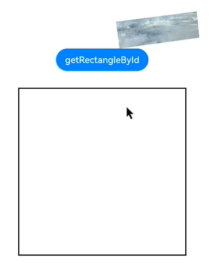

# @ohos.arkui.componentUtils (componentUtils)

The **componentUtils** module provides API for obtaining the coordinates and size of the drawing area of a component.

> **NOTE**
>
> The APIs of this module are supported since API version 10. Updates will be marked with a superscript to indicate their earliest API version.
>
> The functionality of this module depends on UI context. This means that the APIs of this module cannot be used where the UI context is unclear. For details, see [UIContext](./js-apis-arkui-UIContext.md#uicontext). 
>
> Since API version 10, you can use the [getComponentUtils](./js-apis-arkui-UIContext.md#getcomponentutils) API in **UIContext** to obtain the **ComponentUtils** object associated with the current UI context. For this API to work correctly, call it after the notification indicating completion of component layout is received through [@ohos.arkui.inspector (layout callback)](js-apis-arkui-inspector.md).

## Modules to Import

```ts
import { componentUtils } from '@kit.ArkUI';
```
## componentUtils.getRectangleById

getRectangleById(id: string): ComponentInfo

Obtains a **ComponentInfo** object based on the component ID.

**Atomic service API**: This API can be used in atomic services since API version 11.

**System capability**: SystemCapability.ArkUI.ArkUI.Full

**Parameters** 

| Name | Type  | Mandatory | Description      |
| ------ | ------ | ---- | ---------- |
| id     | string | Yes  | Component ID. |

**Return value** 

| Type  | Description      |
| ------ | ---------- |
| [ComponentInfo](#componentinfo) | **ComponentInfo** object, which provides the size, position, translation, scaling, rotation, and affine matrix information of the component. |

**Example**

```ts
import { componentUtils } from '@kit.ArkUI';
let modePosition:componentUtils.ComponentInfo = componentUtils.getRectangleById("onClick");
```

## ComponentInfo

**Atomic service API**: This API can be used in atomic services since API version 11.

**System capability**: SystemCapability.ArkUI.ArkUI.Full

| Name          | Type            | Mandatory          | Description                        |
| ---------------|------------     | -----------------------------| -----------------------------|
| size           | [Size](#size) | Yes | Component size.                   |
| localOffset    | [Offset](#offset) | Yes | Offset of the component relative to the parent component.        |
| windowOffset   | [Offset](#offset) | Yes | Offset of the component relative to the window.          |
| screenOffset   | [Offset](#offset) | Yes | Offset of the component relative to the screen.          |
| translate      | [TranslateResult](#translateresult) | Yes | Translation of the component.               |
| scale          | [ScaleResult](#scaleresult) | Yes | Scaling of the component.               |
| rotate         | [RotateResult](#rotateresult) | Yes | Rotation of the component.               |
| transform      | [Matrix4Result](#matrix4result) | Yes | Affine matrix of the component, which is a 4x4 matrix object created based on the input parameter. |

### Size 

**Atomic service API**: This API can be used in atomic services since API version 11.

**System capability**: SystemCapability.ArkUI.ArkUI.Full

| Name    | Type | Mandatory | Description                              |
| -------- | ---- | ----------------------------------| ----------------------------------|
| width    | number | Yes | Component width.<br>Unit: px                     |
| height   | number | Yes | Component height.<br>Unit: px                     |

### Offset

**Atomic service API**: This API can be used in atomic services since API version 11.

**System capability**: SystemCapability.ArkUI.ArkUI.Full

| Name    | Type | Mandatory | Description                              |
| --------| ---- | -----------------------------------| -----------------------------------|
| x       | number | Yes | X coordinate.<br>Unit: px                          |
| y       | number | Yes | Y coordinate.<br>Unit: px                          |

### TranslateResult

**Atomic service API**: This API can be used in atomic services since API version 11.

**System capability**: SystemCapability.ArkUI.ArkUI.Full

| Name    | Type | Mandatory | Description                              |
| --------| ---- | -----------------------------------| -----------------------------------|
| x       | number | Yes | Translation distance along the x-axis.<br>Unit: px                      |
| y       | number | Yes | Translation distance along the y-axis.<br>Unit: px                      |
| z       | number | Yes | Translation distance along the z-axis.<br>Unit: px                      |

### ScaleResult

**Atomic service API**: This API can be used in atomic services since API version 11.

**System capability**: SystemCapability.ArkUI.ArkUI.Full

| Name    | Type | Mandatory | Description                              |
| --------| ---- | -----------------------------------| -----------------------------------|
| x       | number | Yes | Scale factor along the x-axis.<br>Unit: px                      |
| y       | number | Yes | Scale factor along the y-axis.<br>Unit: px                      |
| z       | number | Yes | Scale factor along the z-axis.<br>Unit: px                      |
| centerX | number | Yes | X coordinate of the center point.<br>Unit: px                 |
| centerY | number | Yes | Y coordinate of the center point.<br>Unit: px               |

### RotateResult

**Atomic service API**: This API can be used in atomic services since API version 11.

**System capability**: SystemCapability.ArkUI.ArkUI.Full

| Name    | Type | Mandatory | Description                              |
| --------| ---- | -----------------------------------| -----------------------------------|
| x       | number | Yes | X coordinate of the rotation vector.<br>Unit: px                  |
| y       | number | Yes | Y coordinate of the rotation vector.<br>Unit: px                  |
| z       | number | Yes | Z coordinate of the rotation vector.<br>Unit: px                  |
| angle   | number | Yes | Rotation angle.<br>Unit: px                         |
| centerX | number | Yes | X coordinate of the center point.<br>Unit: px                |
| centerY | number | Yes | Y coordinate of the center point.<br>Unit: px                |

### Matrix4Result

type Matrix4Result = [number,number,number,number,number,number,number,number,number,number,number,number,number,number,number,number]

**Atomic service API**: This API can be used in atomic services since API version 11.

**System capability**: SystemCapability.ArkUI.ArkUI.Full

| Type | Description                              |
| --------| -----------------------------------|
| [number,number,number,number,<br>number,number,number,number,<br>number,number,number,number,<br>number,number,number,number] | A number array whose length is 16 (4 x 4). The unit is px. For details, see **4 x 4 matrix description**. |

**4 x 4 matrix description**

| Name | Type  | Mandatory | Description                                |
| ------ | ------ | ---- | ------------------------------------ |
| m00    | number | Yes  | Scale factor along the x-axis. Defaults to **1** for the identity matrix.        |
| m01    | number | Yes  | The second value, which is affected by the rotation of the x, y, and z axes.    |
| m02    | number | Yes  | The third value, which is affected by the rotation of the x, y, and z axes.    |
| m03    | number | Yes  | Meaningless value.                        |
| m10    | number | Yes  | The fifth value, which is affected by the rotation of the x, y, and z axes.    |
| m11    | number | Yes  | Scale factor along the y-axis. Defaults to **1** for the identity matrix.        |
| m12    | number | Yes  | The seventh value, which is affected by the rotation of the x, y, and z axes.    |
| m13    | number | Yes  | Meaningless value.                        |
| m20    | number | Yes  | The ninth value, which is affected by the rotation of the x, y, and z axes.    |
| m21    | number | Yes  | The tenth value, which is affected by the rotation of the x, y, and z axes.   |
| m22    | number | Yes  | Scale factor along the z-axis. Defaults to **1** for the identity matrix.        |
| m23    | number | Yes  | Meaningless value.                        |
| m30    | number | Yes  | Translation value of the x-axis, in px. Defaults to **0** for the unit matrix. |
| m31    | number | Yes  | Translation value of the y-axis, in px. The default value is **0** for the identity matrix. |
| m32    | number | Yes  | Translation value of the z-axis, in px. The default value is **0** for the identity matrix. |
| m33    | number | Yes  | Valid in homogeneous coordinates, presenting the perspective projection effect.  |

**Example**

  ```ts
import { matrix4, componentUtils } from '@kit.ArkUI';

@Entry
@Component
struct Utils {
  @State x: number = 120;
  @State y: number = 10;
  @State z: number = 100;
  @State value: string = '';
  private matrix1 = matrix4.identity().translate({ x: this.x, y: this.y, z: this.z });

  build() {
    Column() {
      Image($r("app.media.img"))
        .transform(this.matrix1)
        .translate({ x: 20, y: 20, z: 20 })
        .scale({ x: 0.5, y: 0.5, z: 1 })
        .rotate({
          x: 1,
          y: 1,
          z: 1,
          centerX: '50%',
          centerY: '50%',
          angle: 300
        })
        .width(300)
        .height(100)
        .key("image_01")
      Button('getRectangleById')
      .onClick(() => {
        this.value = JSON.stringify(componentUtils.getRectangleById("image_01"))
      }).margin(10).id('onClick')
      Text(this.value)
        .margin(20)
        .width(300)
        .height(300)
        .borderWidth(2)
    }.margin({left: 50})
  }
}
  ```

   
