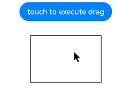
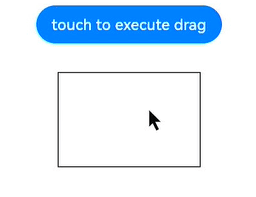
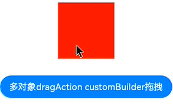
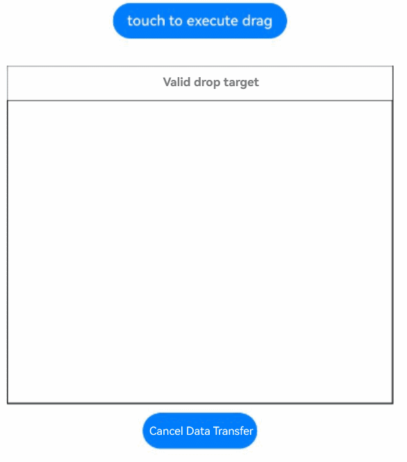

# @ohos.arkui.dragController (DragController)
<!--Kit: ArkUI-->
<!--Subsystem: ArkUI-->
<!--Owner: @jiangtao92-->
<!--Designer: @piggyguy-->
<!--Tester: @songyanhong-->
<!--Adviser: @HelloCrease-->

The **dragController** module provides APIs for initiating drag actions. When receiving a gesture event, such as a touch or long-press event, an application can initiate a drag action and carry drag information therein.

> **NOTE**
>
> The initial APIs of this module are supported since API version 10. Newly added APIs will be marked with a superscript to indicate their earliest API version.
> The functionality of this module depends on UI context. This means that the APIs of this module cannot be used where [the UI context is ambiguous](../../ui/arkts-global-interface.md#ambiguous-ui-context). For details, see [UIContext](arkts-apis-uicontext-uicontext.md).
> You can preview how this component looks on a real device, but not in DevEco Studio Previewer.

## Modules to Import

```ts
import { dragController } from '@kit.ArkUI';
```

## dragController.executeDrag<sup>(deprecated)</sup>

executeDrag(custom: CustomBuilder | DragItemInfo, dragInfo: DragInfo,callback:AsyncCallback\<DragEventParam>): void

Initiates a drag action, with the object to be dragged and the drag information passed in. This API uses an asynchronous callback to return the result.

> **NOTE**
>
> This API is deprecated since API version 18. You are advised to use [executeDrag](arkts-apis-uicontext-dragcontroller.md#executedrag11) instead on the obtained [DragController](arkts-apis-uicontext-dragcontroller.md) object.
>
> Since API version 11, you can use the [getDragController](arkts-apis-uicontext-uicontext.md#getdragcontroller11) API in [UIContext](arkts-apis-uicontext-uicontext.md) to obtain the [DragController](arkts-apis-uicontext-dragcontroller.md) object associated with the current UI context.

**Atomic service API**: This API can be used in atomic services since API version 12.

**System capability**: SystemCapability.ArkUI.ArkUI.Full

**Parameters**

| Name  | Type                                                        | Mandatory| Description                                                        |
| -------- | ------------------------------------------------------------ | ---- | ------------------------------------------------------------ |
| custom   | [CustomBuilder](arkui-ts/ts-types.md#custombuilder8) \| [DragItemInfo](arkui-ts/ts-universal-events-drag-drop.md#dragiteminfo) | Yes  | Object to be dragged.<br>**NOTE**<br>The global builder is not supported. If the [Image](arkui-ts/ts-basic-components-image.md) component is used in the builder, enable synchronous loading, that is, set the [syncLoad](arkui-ts/ts-basic-components-image.md#syncload8) attribute of the component to **true**. The builder is used only to generate the image displayed during the current dragging. If the root component of the builder has zero width or height, it will cause failure in drag image generation, which in turn breaks the entire drag operation. Changes to the builder, if any, apply to the next dragging, but not to the current dragging.|
| dragInfo | [DragInfo](#draginfo)                                        | Yes  | Drag information.                                                  |
| callback | [AsyncCallback](../apis-basic-services-kit/js-apis-base.md#asynccallback)&lt;[DragEventParam](#drageventparam12)&gt; | Yes  | Callback used to return the result.                                    |

**Error codes**

For details about the error codes, see [Universal Error Codes](../errorcode-universal.md).

| ID| Error Message     |
| -------- | ------------- |
| 401      | Parameter error. Possible causes: 1. Mandatory parameters are left unspecified; 2.Incorrect parameters types; 3. Parameter verification failed.   |
| 100001   | Internal handling failed. |

**Example**

> **NOTE**
>
> You are advised to use the [getDragController](arkts-apis-uicontext-uicontext.md#getdragcontroller11) to obtain the **DragController** object associated with the current UI context.

```ts
import { dragController } from '@kit.ArkUI';
import { unifiedDataChannel } from '@kit.ArkData';

@Entry
@Component
struct DragControllerPage {
  @State text: string = ''

  @Builder DraggingBuilder() {
    Column() {
      Text("DraggingBuilder")
        .fontColor(Color.White)
        .fontSize(12)
    }
    .width(100)
    .height(100)
    .backgroundColor(Color.Blue)
  }

  build() {
    Column() {
      Button('touch to execute drag')
        .margin(10)
        .onTouch((event?:TouchEvent) => {
          if(event){
            if (event.type == TouchType.Down) {
              let text = new unifiedDataChannel.PlainText()
              text.textContent = 'drag text'
              text.abstract = 'abstract'
              let unifiedData = new unifiedDataChannel.UnifiedData(text)

              let dragInfo: dragController.DragInfo = {
                pointerId: 0,
                data: unifiedData,
                extraParams: ''
              }
              class tmp{
                event:DragEvent|undefined = undefined
                extraParams:string = ''
              }
              let eve:tmp = new tmp()
              this.getUIContext().getDragController().executeDrag(()=>{this.DraggingBuilder()}, dragInfo, (err, eve) => { // You are advised to use this.getUIContext().getDragController().executeDrag().
                if(eve.event){
                  if (eve.event.getResult() == DragResult.DRAG_SUCCESSFUL) {
                    // ...
                  } else if (eve.event.getResult() == DragResult.DRAG_FAILED) {
                    // ...
                  }
                }
              })
            }
          }
        })
      Text(this.text)
        .height(100)
        .width(150)
        .margin({top:20})
        .border({color:Color.Black,width:1})
        .onDrop((dragEvent?:DragEvent)=>{
          if(dragEvent){
            let records: Array<unifiedDataChannel.UnifiedRecord> = dragEvent.getData().getRecords();
            let plainText: unifiedDataChannel.PlainText = records[0] as unifiedDataChannel.PlainText;
            this.text = plainText.textContent;
          }
        })
    }
    .width('100%')
    .height('100%')
  }
}
```
  
## dragController.executeDrag<sup>(deprecated)</sup>

executeDrag(custom: CustomBuilder | DragItemInfo, dragInfo: DragInfo): Promise\<DragEventParam>

Initiates a drag action, with the object to be dragged and the drag information passed in. This API uses a promise to return the result.

> **NOTE**
>
> This API is deprecated since API version 18. You are advised to use [executeDrag](arkts-apis-uicontext-dragcontroller.md#executedrag11-1) instead on the obtained [DragController](arkts-apis-uicontext-dragcontroller.md) object.
>
> Since API version 11, you can use the [getDragController](arkts-apis-uicontext-uicontext.md#getdragcontroller11) API in [UIContext](arkts-apis-uicontext-uicontext.md) to obtain the [DragController](arkts-apis-uicontext-dragcontroller.md) object associated with the current UI context.

**Atomic service API**: This API can be used in atomic services since API version 12.

**System capability**: SystemCapability.ArkUI.ArkUI.Full

**Parameters**

| Name  | Type                                                        | Mandatory| Description                            |
| -------- | ------------------------------------------------------------ | ---- | -------------------------------- |
| custom   | [CustomBuilder](arkui-ts/ts-types.md#custombuilder8) \| [DragItemInfo](arkui-ts/ts-universal-events-drag-drop.md#dragiteminfo) | Yes  | Object to be dragged.|
| dragInfo | [DragInfo](#draginfo)                                        | Yes  | Drag information.                      |

**Return value**

| Type                                              | Description                    |
| -------------------------------------------------- | ------------------------ |
| Promise&lt;[DragEventParam](#drageventparam12)&gt; | Promise used to return the result.|

**Error codes**
For details about the error codes, see [Universal Error Codes](../errorcode-universal.md).
| ID| Error Message     |
| -------- | ------------- |
| 401      | Parameter error. Possible causes: 1. Mandatory parameters are left unspecified; 2.Incorrect parameters types; 3. Parameter verification failed.   |
| 100001   | Internal handling failed. |

**Example**

> **NOTE**
>
> You are advised to use the [getDragController](arkts-apis-uicontext-uicontext.md#getdragcontroller11) to obtain the **DragController** object associated with the current UI context.

```ts
import { dragController } from '@kit.ArkUI';
import { image } from '@kit.ImageKit';
import { unifiedDataChannel } from '@kit.ArkData';

@Entry
@Component
struct DragControllerPage {
  @State pixmap: image.PixelMap|undefined = undefined
  @State text: string = ''

  @Builder DraggingBuilder() {
    Column() {
      Text("DraggingBuilder")
        .fontColor(Color.White)
    }
    .width(100)
    .height(100)
    .backgroundColor(Color.Blue)
  }

  @Builder PixmapBuilder() {
    Column() {
      Text("PixmapBuilder")
        .fontColor(Color.White)
        .fontSize(15)
    }
    .width(100)
    .height(100)
    .backgroundColor(Color.Blue)
  }

  aboutToAppear() {
    let pb: CustomBuilder = (): void => {
      this.PixmapBuilder()
    }
    this.getUIContext().getComponentSnapshot().createFromBuilder(pb).then((pix: image.PixelMap) => {
      this.pixmap = pix;
    })
  }

  build() {
    Column() {
      Button('touch to execute drag')
        .margin(10)
        .onTouch((event?:TouchEvent) => {
          if(event){
            if (event.type == TouchType.Down) {
              let text = new unifiedDataChannel.PlainText()
              text.textContent = 'drag text'
              text.abstract = 'abstract'
              let unifiedData = new unifiedDataChannel.UnifiedData(text)

              let dragInfo: dragController.DragInfo = {
                pointerId: 0,
                data: unifiedData,
                extraParams: ''
              }
              let dragItemInfo: DragItemInfo = {
                pixelMap: this.pixmap,
                builder: ()=>{this.DraggingBuilder()},
                extraInfo: "DragItemInfoTest"
              }

              class tmp{
                event:DragResult|undefined = undefined
                extraParams:string = ''
              }
              let eve:tmp = new tmp()
              this.getUIContext().getDragController().executeDrag(dragItemInfo, dragInfo) // You are advised to use this.getUIContext().getDragController().executeDrag().
                .then((eve) => {
                  if (eve.event.getResult() == DragResult.DRAG_SUCCESSFUL) {
                    // ...
                  } else if (eve.event.getResult() == DragResult.DRAG_FAILED) {
                    // ...
                  }
                })
                .catch((err:Error) => {
                })
            }
          }
        })
      Text(this.text)
        .height(100)
        .width(150)
        .margin({top:20})
        .border({color:Color.Black,width:1})
        .onDrop((dragEvent?:DragEvent)=>{
          if(dragEvent){
            let records: Array<unifiedDataChannel.UnifiedRecord> = dragEvent.getData().getRecords();
            let plainText: unifiedDataChannel.PlainText = records[0] as unifiedDataChannel.PlainText;
            this.text = plainText.textContent;
          }
        })
    }
    .width('100%')
    .height('100%')
  }
}
```
  
## DragInfo

Defines the attributes required for initiating a drag action and information carried in the dragging process.

**System capability**: SystemCapability.ArkUI.ArkUI.Full

| Name       | Type                                                  | Mandatory| Description                                    |
| ----------- | ------------------------------------------------------ | ---- | ---------------------------------------- |
| pointerId   | number                                                 | Yes  | ID of the touch point on the screen when dragging is started. The value is an integer ranging from 0 to 9.<br>**Atomic service API**: This API can be used in atomic services since API version 12.        |
| data        | [unifiedDataChannel.UnifiedData](../apis-arkdata/js-apis-data-unifiedDataChannel.md#unifieddata) | No  | Data carried in the dragging process.<br>**Atomic service API**: This API can be used in atomic services since API version 12.              |
| extraParams | string                                                 | No  | Additional information about the drag action. Not supported currently. The default value is null.<br>**Atomic service API**: This API can be used in atomic services since API version 12.|
| touchPoint<sup>11+</sup>    | [TouchPoint](arkui-ts/ts-types.md#touchpoint11)  | No  | Coordinates of the touch point. If this parameter is not set, the touch point is centered horizontally and shifted downward by 20% from the top.<br>**Atomic service API**: This API can be used in atomic services since API version 12.|
| previewOptions<sup>11+</sup>| [DragPreviewOptions](arkui-ts/ts-universal-attributes-drag-drop.md#dragpreviewoptions11)                                | No  | Processing mode of the drag preview and the display of the number badge during dragging.<br>**Atomic service API**: This API can be used in atomic services since API version 12.|
| dataLoadParams<sup>20+</sup>| [unifiedDataChannel.DataLoadParams](../apis-arkdata/js-apis-data-unifiedDataChannel.md#dataloadparams20)                                | No  | Parameters for deferred data loading from the drag source. This API provides data loading parameters to the system instead of directly providing complete data objects. When the user drops data on the target application, the system will use these parameters to request the actual data from the drag source. If set together with **data**, **dataLoadParams** takes effect. The default value is null.<br>**Atomic service API**: This API can be used in atomic services since API version 20.|

## dragController.createDragAction<sup>(deprecated)</sup>

createDragAction(customArray: Array&lt;CustomBuilder \| DragItemInfo&gt;, dragInfo: DragInfo): DragAction

Creates a drag action object for initiating drag and drop operations. You need to explicitly specify one or more drag previews, the drag data, and the drag handle point. If a drag operation initiated by an existing drag action object is not completed, no new object can be created, and calling the API will throw an exception. After the lifecycle of the drag action object ends, the callback functions registered on this object become invalid. Therefore, it is necessary to hold this object within a longer scope and replace the old value with a new object returned by **createDragAction** before each drag initiation.

> **NOTE**
>
> This API is supported since API version 11 and deprecated since API version 18. You are advised to use [createDragAction](arkts-apis-uicontext-dragcontroller.md#createdragaction11) instead on the obtained [DragController](arkts-apis-uicontext-dragcontroller.md) object.
>
> Since API version 11, you can use the [getDragController](arkts-apis-uicontext-uicontext.md#getdragcontroller11) API in [UIContext](arkts-apis-uicontext-uicontext.md) to obtain the [DragController](arkts-apis-uicontext-dragcontroller.md) object associated with the current UI context.
>
> For optimal drag and drop performance, limit the number of drag previews.

**Atomic service API**: This API can be used in atomic services since API version 12.

**System capability**: SystemCapability.ArkUI.ArkUI.Full

**Parameters**

| Name  | Type                                                        | Mandatory| Description                            |
| --------      | ------------------------------------------------------------ | ---- | -------------------------------- |
| customArray  | Array&lt;[CustomBuilder](arkui-ts/ts-types.md#custombuilder8) \| [DragItemInfo](arkui-ts/ts-universal-events-drag-drop.md#dragiteminfo)&gt; | Yes  | Object to be dragged.|
| dragInfo | [DragInfo](#draginfo)                                        | Yes  | Drag information.                      |

**Return value**

| Type                                                  | Description              |
| ------------------------------------------------------ | ------------------ |
| [DragAction](#dragaction11)| **DragAction** object, which is used to subscribe to drag state changes and start the drag service.|

**Error codes**

For details about the error codes, see [Universal Error Codes](../errorcode-universal.md).
| ID| Error Message     |
| -------- | ------------- |
| 401      | Parameter error. Possible causes: 1. Mandatory parameters are left unspecified; 2.Incorrect parameters types; 3. Parameter verification failed.   |
| 100001   | Internal handling failed. |

**Example**

> **NOTE**
>
> You are advised to use the [getDragController](arkts-apis-uicontext-uicontext.md#getdragcontroller11) to obtain the **DragController** object associated with the current UI context.

```ts
import { dragController } from '@kit.ArkUI';
import { image } from '@kit.ImageKit';
import { unifiedDataChannel } from '@kit.ArkData';

@Entry
@Component
struct DragControllerPage {
  @State pixmap: image.PixelMap | null = null
  @State text: string = ''
  private dragAction: dragController.DragAction | null = null;
  customBuilders:Array<CustomBuilder | DragItemInfo> = new Array<CustomBuilder | DragItemInfo>();
  @Builder DraggingBuilder() {
    Column() {
      Text("DraggingBuilder")
        .fontColor(Color.White)
        .fontSize(12)
    }
    .width(100)
    .height(100)
    .backgroundColor(Color.Blue)
  }

  build() {
    Column() {

      Column() {
        Text(this.text)
          .width('100%')
          .height('100%')
          .fontColor(Color.White)
          .fontSize(18)
          .onDrop((dragEvent?:DragEvent)=>{
            if(dragEvent){
              let records: Array<unifiedDataChannel.UnifiedRecord> = dragEvent.getData().getRecords();
              let plainText: unifiedDataChannel.PlainText = records[0] as unifiedDataChannel.PlainText;
              this.text = plainText.textContent;
            }
          })
      }
      .width(100)
      .height(100)
      .backgroundColor(Color.Red)
      .margin(10)

      Button('Drag Multiple Objects').onTouch((event?:TouchEvent) => {
        if(event){
          if (event.type == TouchType.Down) {
            console.info("multi drag Down by listener");
            this.customBuilders.splice(0, this.customBuilders.length);
            this.customBuilders.push(()=>{this.DraggingBuilder()});
            this.customBuilders.push(()=>{this.DraggingBuilder()});
            this.customBuilders.push(()=>{this.DraggingBuilder()});
            let text = new unifiedDataChannel.PlainText()
            text.textContent = 'drag text'
            let unifiedData = new unifiedDataChannel.UnifiedData(text)
            let dragInfo: dragController.DragInfo = {
              pointerId: 0,
              data: unifiedData,
              extraParams: ''
            }
            try{
              this.dragAction = this.getUIContext().getDragController().createDragAction(this.customBuilders, dragInfo) // You are advised to use this.getUIContext().getDragController().createDragAction().
              if(!this.dragAction){
                console.info("listener dragAction is null");
                return
              }
              this.dragAction.on('statusChange', (dragAndDropInfo: dragController.DragAndDropInfo)=>{
                if (dragAndDropInfo.status == dragController.DragStatus.STARTED) {
                  console.info("drag has start");
                } else if (dragAndDropInfo.status == dragController.DragStatus.ENDED){
                  console.info("drag has end");
                  if (!this.dragAction) {
                    return
                  }
                  this.dragAction.off('statusChange')
                }
              })
              this.dragAction.startDrag().then(()=>{}).catch((err:Error)=>{
                console.info("start drag Error:" + err.message);
              })
            } catch(err) {
              console.info("create dragAction Error:" + err.message);
            }
          }
        }
      }).margin({top:20})
    }
  }
}
```
  
## DragAction<sup>11+</sup>

Implements a **DragAction** object to subscribe to drag state changes and start the drag service.

**Atomic service API**: This API can be used in atomic services since API version 12.

**System capability**: SystemCapability.ArkUI.ArkUI.Full

### startDrag<sup>11+</sup>

startDrag(): Promise&lt;void&gt;

Starts the drag service. This API uses a promise to return the result.

**Atomic service API**: This API can be used in atomic services since API version 12.

**System capability**: SystemCapability.ArkUI.ArkUI.Full

**Return value**

| Type| Description|
| -------- | -------- |
| Promise&lt;void&gt; | Promise that returns no value.|

**Error codes**

| ID| Error Message     |
| -------- | ------------- |
| 100001   | Internal handling failed. |

**Example 1**

> **NOTE**
>
> You are advised to use the [getDragController](arkts-apis-uicontext-uicontext.md#getdragcontroller11) to obtain the **DragController** object associated with the current UI context.

```ts
import { dragController } from '@kit.ArkUI';
import { unifiedDataChannel } from '@kit.ArkData';

@Entry
@Component
struct DragControllerPage {
  private dragAction: dragController.DragAction | null = null;
  customBuilders:Array<CustomBuilder | DragItemInfo> = new Array<CustomBuilder | DragItemInfo>();
  @Builder DraggingBuilder() {
    Column() {
      Text("DraggingBuilder")
        .fontColor(Color.White)
        .fontSize(12)
    }
    .width(100)
    .height(100)
    .backgroundColor(Color.Blue)
  }

  build() {
    Column() {
      Button('touch to execute drag').onTouch((event?:TouchEvent) => {
        if(event){
          if (event.type == TouchType.Down) {
            this.customBuilders.splice(0, this.customBuilders.length);
            this.customBuilders.push(()=>{this.DraggingBuilder()});
            let text = new unifiedDataChannel.PlainText()
            text.textContent = 'drag text'
            let unifiedData = new unifiedDataChannel.UnifiedData(text)
            let dragInfo: dragController.DragInfo = {
              pointerId: 0,
              data: unifiedData,
              extraParams: ''
            }
            try{
              this.dragAction = this.getUIContext().getDragController().createDragAction(this.customBuilders, dragInfo) // You are advised to use this.getUIContext().getDragController().createDragAction().
              if(!this.dragAction){
                console.info("listener dragAction is null");
                return;
              }
              this.dragAction.startDrag().then(()=>{}).catch((err:Error)=>{
                console.info("start drag Error:" + err.message);
              })
            } catch(err) {
              console.info("create dragAction Error:" + err.message);
            }
          }
        }
      }).margin({top:20})
    }
  }
}
```

**Example 2**

This example shows how to configure **dataLoadParams** in [DragInfo](#draginfo) to enable deferred data loading from the drag source.

```ts
import { unifiedDataChannel, uniformTypeDescriptor, uniformDataStruct } from '@kit.ArkData';
import { fileUri, fileIo as fs } from '@kit.CoreFileKit';
import { common } from '@kit.AbilityKit';
import { dragController } from '@kit.ArkUI';

@Entry
@Component
struct ImageExample {
  private dragAction: dragController.DragAction | null = null;
  customBuilders: Array<CustomBuilder | DragItemInfo> = new Array<CustomBuilder | DragItemInfo>();
  @State uri: string = "";
  @State blockArr: string[] = [];
  uiContext = this.getUIContext();
  udKey: string = '';

  @Builder
  DraggingBuilder() {
    Video({ src: $rawfile('test1.mp4'), controller: new VideoController() })
      .width(100)
      .height(100)
  }

  build() {
    Column() {
      Flex({ direction: FlexDirection.Row, alignItems: ItemAlign.Center, justifyContent: FlexAlign.SpaceAround }) {
        Button('touch to execute drag')
          .margin(10)
          .onTouch((event?: TouchEvent) => {
            if (event) {
              if (event.type == TouchType.Down) {
                this.customBuilders.splice(0, this.customBuilders.length);
                this.customBuilders.push(() => {
                  this.DraggingBuilder()
                });
                const context: Context | undefined = this.uiContext.getHostContext();
                if (context) {
                  let loadHandler: unifiedDataChannel.DataLoadHandler = () => {
                    let data =
                      context.resourceManager.getRawFdSync('test1.mp4');
                    let filePath = context.filesDir + '/test1.mp4';
                    let file = fs.openSync(filePath, fs.OpenMode.CREATE | fs.OpenMode.READ_WRITE);
                    let bufferSize = data.length as number;
                    let buf = new ArrayBuffer(bufferSize);
                    fs.readSync(data.fd, buf, { offset: data.offset, length: bufferSize });
                    fs.writeSync(file.fd, buf, { offset: 0, length: bufferSize });
                    fs.closeSync(file.fd);
                    context.resourceManager.closeRawFdSync('test1.mp4')
                    this.uri = fileUri.getUriFromPath(filePath);
                    let videoMp: uniformDataStruct.FileUri = {
                      uniformDataType: 'general.file-uri',
                      oriUri: this.uri,
                      fileType: 'general.video',
                    }
                    let unifiedRecord = new unifiedDataChannel.UnifiedRecord();
                    let unifiedData = new unifiedDataChannel.UnifiedData();
                    unifiedRecord.addEntry(uniformTypeDescriptor.UniformDataType.FILE_URI, videoMp);
                    unifiedData.addRecord(unifiedRecord);
                    return unifiedData;
                  }

                  let dragInfo: dragController.DragInfo = {
                    pointerId: 0,
                    extraParams: '',
                    dataLoadParams: {
                      loadHandler: loadHandler,
                      dataLoadInfo: { types: new Set([uniformTypeDescriptor.UniformDataType.VIDEO]), recordCount: 1 }
                    }
                  }

                  let func = (dragAndDropInfo: dragController.DragAndDropInfo) => {
                    console.info("ndq Register to listen on drag status", JSON.stringify(dragAndDropInfo));
                  }
                  try {
                    this.dragAction = this.getUIContext()
                      .getDragController()
                      .createDragAction(this.customBuilders,
                        dragInfo)
                    if (!this.dragAction) {
                      console.info("listener dragAction is null");
                      return;
                    }
                    this.dragAction.on('statusChange', func);
                    this.dragAction.startDrag().then(() => {
                    }).catch((err: Error) => {
                      console.error("start drag Error:" + err.message);
                    })
                  } catch (err) {
                    console.error("create dragAction Error:" + err.message);
                  }
                }
              }
            }
          })
      }
      .margin({ bottom: 20 })

      Row() {
        Column() {
          Text('Valid drop target')
            .fontSize('15dp')
            .height('10%')
          List() {
            ForEach(this.blockArr, (item: string, index) => {
              ListItem() {
                Video({ src: item, controller: new VideoController() })
                  .width(100)
                  .height(100)
                  .border({ width: 1 })
              }
              .margin({ left: 30, top: 30 })
            }, (item: string) => item)
          }
          .border({ width: 1 })
          .height('90%')
          .width('100%')
          .allowDrop([uniformTypeDescriptor.UniformDataType.VIDEO])
          .onDrop((event?: DragEvent, extraParams?: string) => {
            let context = this.uiContext.getHostContext() as common.UIAbilityContext;
            let pathDir: string = context.distributedFilesDir;
            let destUri = fileUri.getUriFromPath(pathDir);
            let progressListener: unifiedDataChannel.DataProgressListener =
              (progress: unifiedDataChannel.ProgressInfo, dragData: UnifiedData | null) => {
                if (dragData != null) {
                  let arr: Array<unifiedDataChannel.UnifiedRecord> = dragData.getRecords();
                  if (arr.length > 0) {
                    if (arr[0].getType() === uniformTypeDescriptor.UniformDataType.VIDEO) {
                      this.blockArr.splice(JSON.parse(extraParams as string).insertIndex, 0, this.uri);
                    }
                  } else {
                    console.info('dragData arr is null');
                  }
                } else {
                  console.info('dragData is undefined');
                }
                console.info(`percentage: ${progress.progress}`);
              };
            let options: DataSyncOptions = {
              destUri: destUri,
              fileConflictOptions: unifiedDataChannel.FileConflictOptions.OVERWRITE,
              progressIndicator: unifiedDataChannel.ProgressIndicator.DEFAULT,
              dataProgressListener: progressListener,
            }
            try {
              this.udKey = (event as DragEvent).startDataLoading(options);
              console.info('udKey: ', this.udKey);
            } catch (e) {
              console.error(`startDataLoading errorCode: ${e.code}, errorMessage: ${e.message}`);
            }
          }, { disableDataPrefetch: true })
        }
        .height("50%")
        .width("90%")
        .border({ width: 1 })
      }

      Button('Cancel Data Transfer')
        .onClick(() => {
          try {
            this.getUIContext().getDragController().cancelDataLoading(this.udKey);
          } catch (e) {
            console.error(`cancelDataLoading errorCode: ${e.code}, errorMessage: ${e.message}`);
          }
        })
        .margin({ top: 10 })
    }.width('100%')
  }
}
```


### on('statusChange')<sup>11+</sup>

on(type: 'statusChange', callback: Callback&lt;[DragAndDropInfo](#draganddropinfo11)&gt;): void

Subscribes to drag state changes.

**Atomic service API**: This API can be used in atomic services since API version 12.

**System capability**: SystemCapability.ArkUI.ArkUI.Full

**Parameters**
| Name    | Type | Mandatory   | Description            |
| ------ | ------ | ------- | ---------------- |
|  type  | string | Yes     | Event type. The value is fixed at **'statusChange'**, which indicates the drag state change event.|
|  callback  | Callback&lt;[DragAndDropInfo](#draganddropinfo11)&gt; | Yes     | Callback used to return a [DragAndDropInfo](#draganddropinfo11) instance.|

**Example**

> **NOTE**
>
> You are advised to use the [getDragController](arkts-apis-uicontext-uicontext.md#getdragcontroller11) to obtain the **DragController** object associated with the current UI context.

```ts
import { dragController } from '@kit.ArkUI';
import { unifiedDataChannel } from '@kit.ArkData';

@Entry
@Component
struct DragControllerPage {
  private dragAction: dragController.DragAction | null = null;
  customBuilders:Array<CustomBuilder | DragItemInfo> = new Array<CustomBuilder | DragItemInfo>();
  @Builder DraggingBuilder() {
    Column() {
      Text("DraggingBuilder")
        .fontColor(Color.White)
        .fontSize(12)
    }
    .width(100)
    .height(100)
    .backgroundColor(Color.Blue)
  }

  build() {
    Column() {
      Button('touch to execute drag').onTouch((event?:TouchEvent) => {
        if(event){
          if (event.type == TouchType.Down) {
            this.customBuilders.splice(0, this.customBuilders.length);
            this.customBuilders.push(()=>{this.DraggingBuilder()});
            let text = new unifiedDataChannel.PlainText()
            text.textContent = 'drag text'
            let unifiedData = new unifiedDataChannel.UnifiedData(text)
            let dragInfo: dragController.DragInfo = {
              pointerId: 0,
              data: unifiedData,
              extraParams: ''
            }
            let func = (dragAndDropInfo: dragController.DragAndDropInfo) => {
              console.info("Register to listen on drag status", JSON.stringify(dragAndDropInfo));
            }
            try{
              this.dragAction = this.getUIContext().getDragController().createDragAction(this.customBuilders, dragInfo) // You are advised to use this.getUIContext().getDragController().createDragAction().
              if(!this.dragAction){
                console.info("listener dragAction is null");
                return;
              }
              // Subscribe to drag state changes. The information in func will be logged once a change is detected.
              this.dragAction.on('statusChange', func);
              this.dragAction.startDrag().then(()=>{}).catch((err:Error)=>{
                console.info("start drag Error:" + err.message);
              })
            } catch(err) {
              console.info("create dragAction Error:" + err.message);
            }
          }
        }
      }).margin({top:20})
    }
  }
}
```

### off('statusChange')<sup>11+</sup>

 off(type: 'statusChange', callback?: Callback&lt;[DragAndDropInfo](#draganddropinfo11)&gt;): void

Unsubscribes from drag state changes.

**Atomic service API**: This API can be used in atomic services since API version 12.

**System capability**: SystemCapability.ArkUI.ArkUI.Full

**Parameters**
| Name    | Type | Mandatory   | Description            |
| ------ | ------ | ------- | ---------------- |
|  type  | string | Yes     | Event type. The value is fixed at **'statusChange'**, which indicates the drag state change event.|
|  callback  | Callback&lt;[DragAndDropInfo](#draganddropinfo11)&gt; | No     | Callback to unregister. If this parameter is not specified, this API unregisters all callbacks for the specified event.|

**Example**

> **NOTE**
>
> You are advised to use the [getDragController](arkts-apis-uicontext-uicontext.md#getdragcontroller11) to obtain the **DragController** object associated with the current UI context.

```ts
import { dragController } from '@kit.ArkUI';
import { unifiedDataChannel } from '@kit.ArkData';

@Entry
@Component
struct DragControllerPage {
  private dragAction: dragController.DragAction | null = null;
  customBuilders:Array<CustomBuilder | DragItemInfo> = new Array<CustomBuilder | DragItemInfo>();
  @Builder DraggingBuilder() {
    Column() {
      Text("DraggingBuilder")
        .fontColor(Color.White)
        .fontSize(12)
    }
    .width(100)
    .height(100)
    .backgroundColor(Color.Blue)
  }

  build() {
    Column() {
      Button('touch to execute drag').onTouch((event?:TouchEvent) => {
        if(event){
          if (event.type == TouchType.Down) {
            this.customBuilders.splice(0, this.customBuilders.length);
            this.customBuilders.push(()=>{this.DraggingBuilder()});
            let text = new unifiedDataChannel.PlainText()
            text.textContent = 'drag text'
            let unifiedData = new unifiedDataChannel.UnifiedData(text)
            let dragInfo: dragController.DragInfo = {
              pointerId: 0,
              data: unifiedData,
              extraParams: ''
            }
            let func = (dragAndDropInfo: dragController.DragAndDropInfo) => {
              console.info("Register to listen on drag status", JSON.stringify(dragAndDropInfo));
            }
            try{
              this.dragAction = this.getUIContext().getDragController().createDragAction(this.customBuilders, dragInfo) // You are advised to use this.getUIContext().getDragController().createDragAction().
              if(!this.dragAction){
                console.info("listener dragAction is null");
                return;
              }
              this.dragAction.on('statusChange', func);
              // Unsubscribe from drag state changes. The information in func will not be logged after a drag operation starts.
              this.dragAction.off('statusChange', func);
              this.dragAction.startDrag().then(()=>{}).catch((err:Error)=>{
                console.info("start drag Error:" + err.message);
              })
            } catch(err) {
              console.info("create dragAction Error:" + err.message);
            }
          }
        }
      }).margin({top:20})
    }
  }
}
```

## DragAndDropInfo<sup>11+</sup>

Provides the data reported when the state changes during dragging.

**Atomic service API**: This API can be used in atomic services since API version 12.

**System capability**: SystemCapability.ArkUI.ArkUI.Full

| Name         | Type                                                  | Mandatory| Description                                    |
| -----------   | ------------------------------------------------------ | ---- | ---------------------------------------- |
| status       | [DragStatus](#dragstatus11)                                                 | Yes  | Current dragging state (started or ended).        |
| event        | [DragEvent](arkui-ts/ts-universal-events-drag-drop.md#dragevent7) | Yes  | Drag event corresponding to the current state. The drag event initiated by **dragController** only supports the APIs for obtaining the result and behavior, and is used exclusively for the dragging end state.|
| extraParams| string                                                 | No  | Additional information about the drag action. Not supported currently. The default value is null.|

## DragStatus<sup>11+</sup>

Describes the dragging start and end states.

**Atomic service API**: This API can be used in atomic services since API version 12.

**System capability**: SystemCapability.ArkUI.ArkUI.Full

| Name         | Value                                                  | Description                                    |
| -----------   | ------------------------------------------------------| ---------------------------------------- |
| STARTED       | 0                                                  | Dragging is started.        |
| ENDED        | 1                                                  | Dragging ends.              |

## AnimationOptions<sup>11+</sup>

Defines parameters related to drag-and-drop animation effects.

**Atomic service API**: This API can be used in atomic services since API version 12.

**System capability**: SystemCapability.ArkUI.ArkUI.Full

| Name       | Type                                                  | Mandatory| Description                                    |
| ----------- | ------------------------------------------------------ | ---- | ---------------------------------------- |
| duration    | number                                                 | No  | Animation duration, in ms.<br>Default value: **1000**<br>**NOTE**<br>- If this parameter is set to a value less than 0, the value **0** is used.<br>- Floating-point values will be rounded down to integers. For example, if the value set is 1.2, **1** will be used.|
| curve       | [Curve](arkui-ts/ts-appendix-enums.md#curve) \| [ICurve](js-apis-curve.md#icurve9) | No   | Animation curve.<br>Default value: **Curve.EaseInOut**|                          |

## DragEventParam<sup>12+</sup>

Callback used to return the result.

**Atomic service API**: This API can be used in atomic services since API version 12.

**System capability**: SystemCapability.ArkUI.ArkUI.Full

| Name       | Type                                                        | Mandatory| Description                          |
| ----------- | ------------------------------------------------------------ | ---- | ------------------------------ |
| event<sup>10+</sup>       | [DragEvent](arkui-ts/ts-universal-events-drag-drop.md#dragevent7) | Yes  | Drag event information that includes only the drag result.|
| extraParams<sup>10+</sup> | string                                                       | Yes  | Additional information about the drag event.            |

## dragController.getDragPreview<sup>(deprecated)</sup>

getDragPreview(): DragPreview

Obtains the **DragPreview** object, which represents the preview displayed during a drag operation.

> **NOTE**
>
> This API is supported since API version 11 and deprecated since API version 18. You are advised to use [getDragPreview](arkts-apis-uicontext-dragcontroller.md#getdragpreview11) instead on the obtained [DragController](arkts-apis-uicontext-dragcontroller.md) object.
>
> Since API version 11, you can use the [getDragController](arkts-apis-uicontext-uicontext.md#getdragcontroller11) API in [UIContext](arkts-apis-uicontext-uicontext.md) to obtain the [DragController](arkts-apis-uicontext-dragcontroller.md) object associated with the current UI context.

**Atomic service API**: This API can be used in atomic services since API version 12.

**System capability**: SystemCapability.ArkUI.ArkUI.Full

**Return value**

| Type       | Description                                           |
| ------------| ------------------------------------------------|
| [DragPreview](#dragpreview11) | **DragPreview** object. It provides the API for setting the preview style. It does not work in the **OnDrop** and **OnDragEnd** callbacks.|

**Example**

For details, see [animate](#animate11).

## DragPreview<sup>11+</sup>

Implements a **DragPreview** object. This API does not work in the **OnDrop** and **OnDragEnd** callbacks.

**Atomic service API**: This API can be used in atomic services since API version 12.

**System capability**: SystemCapability.ArkUI.ArkUI.Full

### setForegroundColor<sup>11+</sup>

setForegroundColor(color: ResourceColor): void

Sets the foreground color of the drag preview. This API does not work in the **OnDrop** and **OnDragEnd** callbacks. It can only be used on the object obtained through the [getDragPreview()](arkts-apis-uicontext-dragcontroller.md#getdragpreview11) API.

**Atomic service API**: This API can be used in atomic services since API version 12.

**System capability**: SystemCapability.ArkUI.ArkUI.Full

**Parameters**

| Name  | Type                            | Mandatory| Description                    |
| -------- | -------------------------------- | ---- | ------------------------ |
| color    | [ResourceColor](arkui-ts/ts-types.md#resourcecolor) | Yes  |      Foreground color of the drag preview.                   |

**Example**

For details, see [animate](#animate11).

### animate<sup>11+</sup>

animate(options: AnimationOptions, handler: () => void): void

Applies a foreground color animation to the drag preview. This API does not work in the **OnDrop** and **OnDragEnd** callbacks. It can only be used on the object obtained through the [getDragPreview()](arkts-apis-uicontext-dragcontroller.md#getdragpreview11) API.

**Atomic service API**: This API can be used in atomic services since API version 12.

**System capability**: SystemCapability.ArkUI.ArkUI.Full

**Parameters**

| Name  | Type                            | Mandatory| Description                              |
| -------- | -------------------------------- | ---- | -----------------------------------|
| options  | [AnimationOptions](#animationoptions11)                | Yes  | Animation settings.                          |
| handler  | () => void                         | Yes  | Callback used to change attributes such as the background mask color. |

**Example**

> **NOTE**
>
> You are advised to use the [getDragController](arkts-apis-uicontext-uicontext.md#getdragcontroller11) to obtain the **DragController** object associated with the current UI context.

1. In the **EntryAbility.ets** file, obtain the UI context and save it to LocalStorage.
  ```ts
import { AbilityConstant, UIAbility, Want } from '@kit.AbilityKit';
import { hilog } from '@kit.PerformanceAnalysisKit';
import { window, UIContext } from '@kit.ArkUI';

let uiContext: UIContext;
let localStorage: LocalStorage = new LocalStorage('uiContext');

export default class EntryAbility extends UIAbility {
  storage: LocalStorage = localStorage;

  onCreate(want: Want, launchParam: AbilityConstant.LaunchParam): void {
    hilog.info(0x0000, 'testTag', '%{public}s', 'Ability onCreate');
  }

  onDestroy(): void {
    hilog.info(0x0000, 'testTag', '%{public}s', 'Ability onDestroy');
  }

  onWindowStageCreate(windowStage: window.WindowStage): void {
    hilog.info(0x0000, 'testTag', '%{public}s', 'Ability onWindowStageCreate');

    windowStage.loadContent('pages/Index', this.storage, (err, data) => {
      if (err.code) {
        hilog.error(0x0000, 'testTag', 'Failed to load the content. Cause: %{public}s', `Code is ${err.code}, message is ${err.message}`);
        return;
      }
      hilog.info(0x0000, 'testTag', 'Succeeded in loading the content. Data: %{public}s',  `Code is ${err.code}, message is ${err.message}`);
      windowStage.getMainWindow((err, data) => {
        if (err.code) {
          hilog.error(0x0000, `Failed to obtain the main window. Cause: ${err.message}`, '');
          return;
        }
        let windowClass: window.Window = data;
        uiContext = windowClass.getUIContext();
        this.storage.setOrCreate<UIContext>('uiContext', uiContext);
      })
    });
  }
}
  ```
2. In the **Index.ets** file, call **this.getUIContext().getSharedLocalStorage()** to obtain the UI context and then use the **DragController** object obtained to perform subsequent operations.
  ```ts

import { unifiedDataChannel } from '@kit.ArkData';
import { hilog } from '@kit.PerformanceAnalysisKit';
import { dragController, curves, promptAction, UIContext } from '@kit.ArkUI';
import { image } from '@kit.ImageKit';
import { BusinessError } from '@kit.BasicServicesKit';

@Entry()
@Component
struct DragControllerPage {
  @State pixmap: image.PixelMap|null = null;
  storages = this.getUIContext().getSharedLocalStorage();

  @Builder DraggingBuilder() {
    Column() {
      Text("DraggingBuilder")
        .fontColor(Color.White)
        .fontSize(12)
    }
    .width(100)
    .height(100)
    .backgroundColor(Color.Blue)
  }

  @Builder PixmapBuilder() {
    Column() {
      Text("PixmapBuilder")
    }
    .width(100)
    .height(100)
    .backgroundColor(Color.Blue)
  }

  build() {
    Column() {
      Button('Drag Here')
        .margin(10)
        .onDragEnter(() => {
        try {
          let uiContext: UIContext = this.storages?.get<UIContext>('uiContext') as UIContext;
          let previewObj: dragController.DragPreview = uiContext.getDragController().getDragPreview();
          let foregroundColor: ResourceColor = Color.Green;

          let previewAnimation: dragController.AnimationOptions = {
            curve: curves.cubicBezierCurve(0.2,0,0,1),
          }
          previewObj.animate(previewAnimation, () => {
            previewObj.setForegroundColor(foregroundColor);
          });
        } catch (error) {
          let msg = (error as BusinessError).message;
          let code = (error as BusinessError).code;
          hilog.error(0x0000, `show error code is ${code}, message is ${msg}`, '');
        }
      })
        .onDrop(() => {
          this.getUIContext().getPromptAction().showToast({duration: 100, message: 'Drag Success', bottom: 400})
        })
      Button('Drag').onTouch((event?:TouchEvent) => {
        if(event){
          if (event.type == TouchType.Down) {
            let text = new unifiedDataChannel.Text()
            let unifiedData = new unifiedDataChannel.UnifiedData(text)
            let dragInfo: dragController.DragInfo = {
              pointerId: 0,
              data: unifiedData,
              extraParams: ''
            }
            class tmp{
              event:DragEvent|undefined = undefined
              extraParams:string = ''
            }
            let eve:tmp = new tmp()
            this.getUIContext().getDragController().executeDrag(() => { // You are advised to usethis.getUIContext().getDragController().executeDrag().
              this.DraggingBuilder()
            }, dragInfo, (err , eve) => {
              hilog.info(0x0000, `${JSON.stringify(err)}`, '')
              if (eve && eve.event) {
                if (eve.event.getResult() == DragResult.DRAG_SUCCESSFUL) {
                  hilog.info(0x0000, 'success', '');
                } else if (eve.event.getResult() == DragResult.DRAG_FAILED) {
                  hilog.info(0x0000, 'failed', '');
                }
              }
            })
          }
        }
      }).margin({top:100})
    }
    .width('100%')
    .height('100%')
  }
}
  ```
  

## DragStartRequestStatus<sup>18+</sup>

Enumerates the states defining whether an application can initiate a drag operation.

**Atomic service API**: This API can be used in atomic services since API version 18.

**System capability**: SystemCapability.ArkUI.ArkUI.Full

| Name    | Value| Description                                                        |
| -------- | -- | ------------------------------------------------------------ |
| WAITING   | 0 | The application is preparing data and cannot initiate a drag operation yet.|
| READY | 1 | The application has completed data preparation and is ready to initiate a drag operation.|

## DragSpringLoadingState<sup>20+</sup>

Enumerates hover detection states during drag operations.

**Atomic service API**: This API can be used in atomic services since API version 20.

**System capability**: SystemCapability.ArkUI.ArkUI.Full


| Name| Value|Description                                                         |
| ------ | --------------------- |--------------------------------------- |
| BEGIN  | - |Initial state when a dragged item enters the component boundary and remains stationary for the specified duration.                 |
| UPDATE | - |Periodic notification state during sustained hover detection.|
| END    | - |Final state indicating completion of the hover detection cycle, which is triggered when the dragged item remains stationary after the last update notification. Hover detection will only restart after the dragged item exits and re-enters the component boundary or enters a child component.|
| CANCEL | - |Interruption state of hover detection triggered by termination events, which include the following: finger or mouse release, window switching, screen off, exiting the component boundary, entering child components, or exceeding the movement threshold within the component.|

## DragSpringLoadingConfiguration<sup>20+</sup>

Defines the configuration parameters for drag hover detection.

**Atomic service API**: This API can be used in atomic services since API version 20.

**System capability**: SystemCapability.ArkUI.ArkUI.Full

| Name                | Type  |Read-Only| Optional| Description                                  |	
| :--------------------- | ------ | ---- | --- | ---------------------------------------------------- |	
| stillTimeLimit         | number | No  |    Yes  |Time (in ms) required to remain stationary to enter the BEGIN state of hover detection. Value range: integer from 0 to 2<sup>31</sup> - 1. Floating-point number inputs will be truncated to integers. Invalid values (negative numbers, **null**, **undefined**, **NaN**) are treated as the default value **500**.|
| updateInterval         | number | No  |    Yes  |Time interval (in ms) at which update notifications are sent after hover detection enters the UPDATE state. Value range: integer from 0 to 2<sup>31</sup> - 1. Floating-point number inputs will be truncated to integers. Invalid values (negative numbers, **null**, **undefined**, **NaN**) are treated as the default value **100**.|
| updateNotifyCount      | number | No  |    Yes  |Maximum number of update notifications after hover detection enters the UPDATE state. Value range: integer from 0 to 2<sup>31</sup> - 1. Floating-point number inputs will be truncated to integers. Invalid values (negative numbers, **null**, **undefined**, **NaN**) are treated as the default value **3**.|
| updateToFinishInterval | number | No  |    Yes  |Maximum waiting time (in ms) from the UPDATE state to the END state. Value range: integer from 0 to 2<sup>31</sup> - 1. Floating-point number inputs will be truncated to integers. Invalid values (negative numbers, **null**, **undefined**, **NaN**) are treated as the default value **100**.|

## SpringLoadingDragInfos<sup>20+</sup>

Defines the drag event information when hover detection is triggered.

**Atomic service API**: This API can be used in atomic services since API version 20.

**System capability**: SystemCapability.ArkUI.ArkUI.Full

| Name     | Type      | Mandatory| Description                     |
| :-------- | ------- | ---- |--------------------------------------------- |
| dataSummary | [unifiedDataChannel.Summary](../apis-arkdata/js-apis-data-unifiedDataChannel.md#summary) |No  | Summary of the dragged data. The default value is null.|
| extraInfos  | string    |No  | Additional information about the drag event. The default value is an empty string.  |

## SpringLoadingContext<sup>20+</sup>

Defines the callback context information, which is passed to the application in the hover detection callback to allow the application to access the drag status.

### Properties

**Atomic service API**: This API can be used in atomic services since API version 20.

**System capability**: SystemCapability.ArkUI.ArkUI.Full

| Name       | Type         | Read-only  |Optional   | Description                        |
| :----- | -------- | ---- | ---- | ---------------------------------------- |
| state                 | [DragSpringLoadingState](#dragspringloadingstate20)    |No    |No  | Current state of hover detection.        |
| currentNotifySequence | number  |No     |No  |Callback notification sequence number in the current hover detection cycle. The value is zero-based.|
| dragInfos             | [SpringLoadingDragInfos](#springloadingdraginfos20)  |No   |Yes  | Drag information. If the value provided is **undefined**, the default value of [SpringLoadingDragInfos](#springloadingdraginfos20) is used.     |
| currentConfig         | [DragSpringLoadingConfiguration](#dragspringloadingconfiguration20)   |No   |Yes  | Configuration information in the current callback. If the value provided is **undefined**, the default value of [DragSpringLoadingConfiguration](#dragspringloadingconfiguration20) is used.   |

### abort<sup>20+</sup>

abort(): void

Terminates subsequent hover detection.

**Atomic service API**: This API can be used in atomic services since API version 20.

**System capability**: SystemCapability.ArkUI.ArkUI.Full

### updateConfiguration<sup>20+</sup>

updateConfiguration(config: DragSpringLoadingConfiguration): void

Updates the configuration for subsequent hover detection.

**Atomic service API**: This API can be used in atomic services since API version 20.

**System capability**: SystemCapability.ArkUI.ArkUI.Full

**Parameters**

| Name    | Type         | Mandatory     | Description                        |
| :----- | -------- | ---- | --------------------------------------------- |
| config | [DragSpringLoadingConfiguration](#dragspringloadingconfiguration20)         |Yes  | New configuration for hover detection.  |
