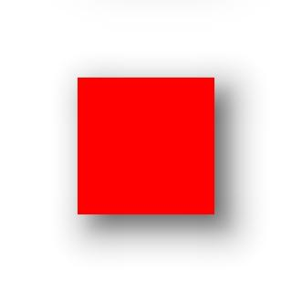

# RenderNode

The **RenderNode** module provides APIs for creating a RenderNode in custom drawing settings with C APIs.

> **NOTE**
>
> The initial APIs of this module are supported since API version 11. Newly added APIs will be marked with a superscript to indicate their earliest API version.
> 
> **RenderNode** is not available in DevEco Studio Previewer.
>
> You are not advised to modify RenderNodes in BuilderNodes.

## Modules to Import

```ts
import { RenderNode } from '@kit.ArkUI';
```

## RenderNode

### constructor

constructor()

Constructor used to create a RenderNode.

**Atomic service API**: This API can be used in atomic services since API version 12.

**System capability**: SystemCapability.ArkUI.ArkUI.Full

**Example**

```ts
import {  RenderNode, FrameNode, NodeController } from '@kit.ArkUI';

const renderNode = new RenderNode();
renderNode.frame = { x: 0, y: 0, width: 100, height: 100 };
renderNode.backgroundColor = 0xffff0000;

class MyNodeController extends NodeController {
  private rootNode: FrameNode | null = null;

  makeNode(uiContext: UIContext): FrameNode | null {
    this.rootNode = new FrameNode(uiContext);

    const rootRenderNode = this.rootNode.getRenderNode();
    if (rootRenderNode !== null) {
      rootRenderNode.appendChild(renderNode);
    }

    return this.rootNode;
  }
}

@Entry
@Component
struct Index {
  private myNodeController: MyNodeController = new MyNodeController();

  build() {
    Row() {
      NodeContainer(this.myNodeController)
    }
  }
}
```

### appendChild

appendChild(node: RenderNode): void

Appends a child node to this RenderNode.

**Atomic service API**: This API can be used in atomic services since API version 12.

**System capability**: SystemCapability.ArkUI.ArkUI.Full

**Parameters**

| Name| Type                     | Mandatory| Description                  |
| ------ | ------------------------- | ---- | ---------------------- |
| node   | [RenderNode](#rendernode) | Yes  | Child node to append.|

**Example**

```ts
import {  RenderNode, FrameNode, NodeController } from '@kit.ArkUI';

const renderNode = new RenderNode();
renderNode.frame = { x: 0, y: 0, width: 100, height: 100 };
renderNode.backgroundColor = 0xffff0000;
const child = new RenderNode();
child.frame = { x: 10, y: 10, width: 50, height: 50 };
child.backgroundColor = 0xff00ff00;
renderNode.appendChild(child);

class MyNodeController extends NodeController {
  private rootNode: FrameNode | null = null;

  makeNode(uiContext: UIContext): FrameNode | null {
    this.rootNode = new FrameNode(uiContext);

    const rootRenderNode = this.rootNode.getRenderNode();
    if (rootRenderNode !== null) {
      rootRenderNode.appendChild(renderNode);
    }

    return this.rootNode;
  }
}

@Entry
@Component
struct Index {
  private myNodeController: MyNodeController = new MyNodeController();

  build() {
    Row() {
      NodeContainer(this.myNodeController)
    }
  }
}
```

### insertChildAfter

insertChildAfter(child: RenderNode, sibling: RenderNode | null): void

Inserts a child node after the specified child node of this RenderNode.

**Atomic service API**: This API can be used in atomic services since API version 12.

**System capability**: SystemCapability.ArkUI.ArkUI.Full

**Parameters**

| Name | Type                                       | Mandatory| Description                                                                        |
| ------- | ------------------------------------------- | ---- | ---------------------------------------------------------------------------- |
| child   | [RenderNode](#rendernode)                   | Yes  | Child node to add.                                                          |
| sibling | [RenderNode](#rendernode) \| null | Yes  | Node after which the new child node will be inserted. If this parameter is left empty, the new node is inserted before the first subnode.|

**Example**

```ts
import {  RenderNode, FrameNode, NodeController } from '@kit.ArkUI';

const renderNode = new RenderNode();
renderNode.frame = { x: 0, y: 0, width: 200, height: 350 };
renderNode.backgroundColor = 0xffff0000;
for (let i = 0; i < 5; i++) {
  const node = new RenderNode();
  node.frame = { x: 10, y: 10 + 60 * i, width: 50, height: 50 };
  node.backgroundColor = 0xff00ff00;
  renderNode.appendChild(node);
}

const child = new RenderNode();
child.frame = { x: 70, y: 70, width: 50, height: 50 };
child.backgroundColor = 0xffffff00;
const sibling = renderNode.getChild(1);
renderNode.insertChildAfter(child, sibling);

class MyNodeController extends NodeController {
  private rootNode: FrameNode | null = null;

  makeNode(uiContext: UIContext): FrameNode | null {
    this.rootNode = new FrameNode(uiContext);

    const rootRenderNode = this.rootNode.getRenderNode();
    if (rootRenderNode !== null) {
      rootRenderNode.appendChild(renderNode);
    }

    return this.rootNode;
  }
}

@Entry
@Component
struct Index {
  private myNodeController: MyNodeController = new MyNodeController();

  build() {
    Row() {
      NodeContainer(this.myNodeController)
    }
  }
}
```

### removeChild

removeChild(node: RenderNode): void

Deletes the specified child node from this RenderNode.

**Atomic service API**: This API can be used in atomic services since API version 12.

**System capability**: SystemCapability.ArkUI.ArkUI.Full

**Parameters**

| Name| Type                     | Mandatory| Description              |
| ------ | ------------------------- | ---- | ------------------ |
| node   | [RenderNode](#rendernode) | Yes  | Child node to delete.|

**Example**
```ts
import {  RenderNode, FrameNode, NodeController } from '@kit.ArkUI';

const renderNode = new RenderNode();
renderNode.frame = { x: 0, y: 0, width: 200, height: 350 };
renderNode.backgroundColor = 0xffff0000;
for (let i = 0; i < 5; i++) {
  const node = new RenderNode();
  node.frame = { x: 10, y: 10 + 60 * i, width: 50, height: 50 };
  node.backgroundColor = 0xff00ff00;
  renderNode.appendChild(node);
}

const node = renderNode.getChild(1);
renderNode.removeChild(node);

class MyNodeController extends NodeController {
  private rootNode: FrameNode | null = null;

  makeNode(uiContext: UIContext): FrameNode | null {
    this.rootNode = new FrameNode(uiContext);

    const rootRenderNode = this.rootNode.getRenderNode();
    if (rootRenderNode !== null) {
      rootRenderNode.appendChild(renderNode);
    }

    return this.rootNode;
  }
}

@Entry
@Component
struct Index {
  private myNodeController: MyNodeController = new MyNodeController();

  build() {
    Row() {
      NodeContainer(this.myNodeController)
    }
  }
}
```
### clearChildren

clearChildren(): void

Clears all child nodes of this RenderNode.

**Atomic service API**: This API can be used in atomic services since API version 12.

**System capability**: SystemCapability.ArkUI.ArkUI.Full

**Example**

```ts
import {  RenderNode, FrameNode, NodeController } from '@kit.ArkUI';

const renderNode = new RenderNode();
for (let i = 0; i < 10; i++) {
  let childNode = new RenderNode();
  childNode.size = {width: i*10 ,height : i*10};
  childNode.position = {x: i*10 ,y : i*10};
  childNode.backgroundColor = 0xFF0000FF - 0X11 * i;
  renderNode.appendChild(childNode);
}

class MyNodeController extends NodeController {
  private rootNode: FrameNode | null = null;

  makeNode(uiContext: UIContext): FrameNode | null {
    this.rootNode = new FrameNode(uiContext);

    const rootRenderNode = this.rootNode.getRenderNode();
    if (rootRenderNode !== null) {
      rootRenderNode.appendChild(renderNode);
    }

    return this.rootNode;
  }
}

@Entry
@Component
struct Index {
  private myNodeController: MyNodeController = new MyNodeController();
  build() {
    Column() {
      NodeContainer(this.myNodeController)
        .borderWidth(1)
        .width(200)
        .height(300)
      Button("clearChildren")
        .onClick(()=>{
          renderNode.clearChildren();
        })
    }.width("100%")
  }
}
```

### getChild

getChild(index: number): RenderNode | null

Obtains the child node in the specified position of this RenderNode.

**Atomic service API**: This API can be used in atomic services since API version 12.

**System capability**: SystemCapability.ArkUI.ArkUI.Full

**Parameters**

| Name | Type   | Mandatory| Description              |
| ------- | ------- | ---- | ------------------ |
| index | number | Yes  | Index of the child node to obtain.|

**Return value**

| Type                             | Description                                                      |
| --------------------------------- | ---------------------------------------------------------- |
| [RenderNode](#rendernode) \| null | Child node obtained. If the RenderNode does not contain the specified child node, null is returned.|

**Example**

```ts
import {  RenderNode, FrameNode, NodeController } from '@kit.ArkUI';

const renderNode = new RenderNode();
for (let i = 0; i < 10; i++) {
  let childNode = new RenderNode();
  childNode.size = {width: i*10 ,height : i*10};
  childNode.position = {x: i*10 ,y : i*10};
  childNode.backgroundColor = 0xFF0000FF - 0X11 * i;
  renderNode.appendChild(childNode);
}

class MyNodeController extends NodeController {
  private rootNode: FrameNode | null = null;

  makeNode(uiContext: UIContext): FrameNode | null {
    this.rootNode = new FrameNode(uiContext);

    const rootRenderNode = this.rootNode.getRenderNode();
    if (rootRenderNode !== null) {
      rootRenderNode.appendChild(renderNode);
    }

    return this.rootNode;
  }
}

@Entry
@Component
struct Index {
  private myNodeController: MyNodeController = new MyNodeController();
  build() {
    Column() {
      NodeContainer(this.myNodeController)
        .borderWidth(1)
        .width(200)
        .height(300)
      Button("getChild")
        .onClick(()=>{
          for (let i = 0; i < 11; i++) {
            let childNode : RenderNode | null = renderNode.getChild(i);
            if(childNode == null){
              console.log(`the ${i} of renderNode's childNode is null`);
            } else {
              console.log(`the ${i} of renderNode's childNode has a size of {${childNode.size.width},${childNode.size.height}}`);
            }
          }

        })
    }.width("100%")
  }
}
```

### getFirstChild

getFirstChild(): RenderNode | null

Obtains the first child node of this RenderNode.

**Atomic service API**: This API can be used in atomic services since API version 12.

**System capability**: SystemCapability.ArkUI.ArkUI.Full

**Return value**

| Type                             | Description                                                      |
| --------------------------------- | ---------------------------------------------------------- |
| [RenderNode](#rendernode) \| null | First child node. If the RenderNode does not contain any child node, null is returned.|

**Example**

```ts
import {  RenderNode, FrameNode, NodeController } from '@kit.ArkUI';

const renderNode = new RenderNode();
renderNode.frame = { x: 0, y: 0, width: 200, height: 350 };
renderNode.backgroundColor = 0xffff0000;
for (let i = 0; i < 5; i++) {
  const node = new RenderNode();
  node.frame = { x: 10, y: 10 + 60 * i, width: 50, height: 50 };
  node.backgroundColor = 0xff00ff00;
  renderNode.appendChild(node);
}

class MyNodeController extends NodeController {
  private rootNode: FrameNode | null = null;

  makeNode(uiContext: UIContext): FrameNode | null {
    this.rootNode = new FrameNode(uiContext);

    const rootRenderNode = this.rootNode.getRenderNode();
    if (rootRenderNode !== null) {
      rootRenderNode.appendChild(renderNode);
    }

    return this.rootNode;
  }
}

@Entry
@Component
struct Index {
  private myNodeController: MyNodeController = new MyNodeController();

  build() {
    Row() {
      NodeContainer(this.myNodeController)
        .width(200)
        .height(350)
      Button('getFirstChild')
        .onClick(() => {
          const firstChild = renderNode.getFirstChild();
          if (firstChild === null) {
            console.log('the fist child is null');
          } else {
            console.log(`the position of fist child is x: ${firstChild.position.x}, y: ${firstChild.position.y}`);
          }
        })
    }
  }
}
```

### getNextSibling

getNextSibling(): RenderNode | null

Obtains the next sibling node of this RenderNode.

**Atomic service API**: This API can be used in atomic services since API version 12.

**System capability**: SystemCapability.ArkUI.ArkUI.Full

**Return value**

| Type                             | Description                                                                                  |
| --------------------------------- | -------------------------------------------------------------------------------------- |
| [RenderNode](#rendernode) \| null | Next sibling node of the current RenderNode. If the RenderNode does not have the next sibling node, null is returned.|

**Example**
```ts
import {  RenderNode, FrameNode, NodeController } from '@kit.ArkUI';

const renderNode = new RenderNode();
renderNode.frame = { x: 0, y: 0, width: 200, height: 350 };
renderNode.backgroundColor = 0xffff0000;
for (let i = 0; i < 5; i++) {
  const node = new RenderNode();
  node.frame = { x: 10, y: 10 + 60 * i, width: 50, height: 50 };
  node.backgroundColor = 0xff00ff00;
  renderNode.appendChild(node);
}

class MyNodeController extends NodeController {
  private rootNode: FrameNode | null = null;

  makeNode(uiContext: UIContext): FrameNode | null {
    this.rootNode = new FrameNode(uiContext);

    const rootRenderNode = this.rootNode.getRenderNode();
    if (rootRenderNode !== null) {
      rootRenderNode.appendChild(renderNode);
    }

    return this.rootNode;
  }
}

@Entry
@Component
struct Index {
  private myNodeController: MyNodeController = new MyNodeController();

  build() {
    Row() {
      NodeContainer(this.myNodeController)
        .width(200)
        .height(350)
      Button('getNextSibling')
        .onClick(() => {
          const child = renderNode.getChild(1);
          const nextSibling = child!.getNextSibling()
          if (child === null || nextSibling === null) {
            console.log('the child or nextChild is null');
          } else {
            console.log(`the position of child is x: ${child.position.x}, y: ${child.position.y}, ` +
              `the position of nextSibling is x: ${nextSibling.position.x}, y: ${nextSibling.position.y}`);
          }
        })
    }
  }
}
```

### getPreviousSibling

getPreviousSibling(): RenderNode | null

Obtains the previous sibling node of this RenderNode.

**Atomic service API**: This API can be used in atomic services since API version 12.

**System capability**: SystemCapability.ArkUI.ArkUI.Full

**Return value**

| Type                             | Description                                                                                  |
| --------------------------------- | -------------------------------------------------------------------------------------- |
| [RenderNode](#rendernode) \| null | Previous sibling node of the current RenderNode. If the RenderNode does not have the previous sibling node, null is returned.|

**Example**
```ts
import {  RenderNode, FrameNode, NodeController } from '@kit.ArkUI';

const renderNode = new RenderNode();
renderNode.frame = { x: 0, y: 0, width: 200, height: 350 };
renderNode.backgroundColor = 0xffff0000;
for (let i = 0; i < 5; i++) {
  const node = new RenderNode();
  node.frame = { x: 10, y: 10 + 60 * i, width: 50, height: 50 };
  node.backgroundColor = 0xff00ff00;
  renderNode.appendChild(node);
}

class MyNodeController extends NodeController {
  private rootNode: FrameNode | null = null;

  makeNode(uiContext: UIContext): FrameNode | null {
    this.rootNode = new FrameNode(uiContext);

    const rootRenderNode = this.rootNode.getRenderNode();
    if (rootRenderNode !== null) {
      rootRenderNode.appendChild(renderNode);
    }

    return this.rootNode;
  }
}

@Entry
@Component
struct Index {
  private myNodeController: MyNodeController = new MyNodeController();

  build() {
    Row() {
      NodeContainer(this.myNodeController)
        .width(200)
        .height(350)
      Button('getPreviousSibling')
        .onClick(() => {
          const child = renderNode.getChild(1);
          const previousSibling = child!.getPreviousSibling()
          if (child === null || previousSibling === null) {
            console.log('the child or previousChild is null');
          } else {
            console.log(`the position of child is x: ${child.position.x}, y: ${child.position.y}, ` +
              `the position of previousSibling is x: ${previousSibling.position.x}, y: ${previousSibling.position.y}`);
          }
        })
    }
  }
}
```

### backgroundColor

set backgroundColor(color: number)

Sets the background color for this RenderNode.

**Atomic service API**: This API can be used in atomic services since API version 12.

**System capability**: SystemCapability.ArkUI.ArkUI.Full

**Parameters**

| Name| Type  | Mandatory| Description                  |
| ------ | ------ | ---- | ---------------------- |
| color  | number | Yes  | Background color value, in ARGB format.|

get backgroundColor(): number

Obtains the background color of this RenderNode.

**Atomic service API**: This API can be used in atomic services since API version 12.

**System capability**: SystemCapability.ArkUI.ArkUI.Full

**Return value**

| Type  | Description                                          |
| ------ | ---------------------------------------------- |
| number | Background color of the current RenderNode. The default value is **0X00000000**.|

**Example**
```ts
import {  RenderNode, FrameNode, NodeController } from '@kit.ArkUI';

const renderNode = new RenderNode();
renderNode.frame = { x: 0, y: 0, width: 100, height: 100 };
renderNode.backgroundColor = 0XFF00FF00;
const backgroundColor = renderNode.backgroundColor;

class MyNodeController extends NodeController {
  private rootNode: FrameNode | null = null;

  makeNode(uiContext: UIContext): FrameNode | null {
    this.rootNode = new FrameNode(uiContext);

    const rootRenderNode = this.rootNode.getRenderNode();
    if (rootRenderNode !== null) {
      rootRenderNode.appendChild(renderNode);
    }

    return this.rootNode;
  }
}

@Entry
@Component
struct Index {
  private myNodeController: MyNodeController = new MyNodeController();
  build() {
    Row() {
      NodeContainer(this.myNodeController)
    }
  }
}
```

### clipToFrame

set clipToFrame(useClip: boolean)

Sets whether to clip this RenderNode. The value **true** means to clip the RenderNode to its set size.

**Atomic service API**: This API can be used in atomic services since API version 12.

**System capability**: SystemCapability.ArkUI.ArkUI.Full

**Parameters**

| Name | Type   | Mandatory| Description              |
| ------- | ------- | ---- | ------------------ |
| useClip | boolean | Yes  | Whether to clip the RenderNode.|

get clipToFrame(): boolean

Obtains whether this RenderNode needs to be clipped.

**Atomic service API**: This API can be used in atomic services since API version 12.

**System capability**: SystemCapability.ArkUI.ArkUI.Full

**Return value**

| Type   | Description                                               |
| ------- | --------------------------------------------------- |
| boolean | Whether the current RenderNode needs to be clipped. The default value is **true**.|

**Example**
```ts
import {  RenderNode, FrameNode, NodeController } from '@kit.ArkUI';

const renderNode = new RenderNode();
renderNode.frame = { x: 0, y: 0, width: 100, height: 100 };
renderNode.backgroundColor = 0xffff0000;
renderNode.clipToFrame = true;
const clipToFrame = renderNode.clipToFrame;

const childNode = new RenderNode();
childNode.frame = { x: 10, y: 10, width: 150, height: 50 };
childNode.backgroundColor = 0xffffff00;
renderNode.appendChild(childNode);

class MyNodeController extends NodeController {
  private rootNode: FrameNode | null = null;

  makeNode(uiContext: UIContext): FrameNode | null {
    this.rootNode = new FrameNode(uiContext);

    const rootRenderNode = this.rootNode.getRenderNode();
    if (rootRenderNode !== null) {
      rootRenderNode.appendChild(renderNode);
    }

    return this.rootNode;
  }
}

@Entry
@Component
struct Index {
  private myNodeController: MyNodeController = new MyNodeController();

  build() {
    Row() {
      NodeContainer(this.myNodeController)
    }
  }
}
```

### opacity

set opacity(value: number)

Sets the opacity for this RenderNode. If the value passed in is less than **0**, the opacity is set to **0**. If the value passed in is greater than **1**, the opacity is set to **1**.

**Atomic service API**: This API can be used in atomic services since API version 12.

**System capability**: SystemCapability.ArkUI.ArkUI.Full

**Parameters**

| Name| Type  | Mandatory| Description                                  |
| ------ | ------ | ---- | -------------------------------------- |
| value  | number | Yes  | Opacity to set.<br>Value range: [0, 1]|

get opacity(): number

Obtains the opacity of this RenderNode.

**Atomic service API**: This API can be used in atomic services since API version 12.

**System capability**: SystemCapability.ArkUI.ArkUI.Full

**Return value**

| Type  | Description                                     |
| ------ | ----------------------------------------- |
| number | Opacity of the current RenderNode. The default value is **1**.|

**Example**
```ts
import {  RenderNode, FrameNode, NodeController } from '@kit.ArkUI';

const renderNode = new RenderNode();
renderNode.frame = { x: 0, y: 0, width: 100, height: 100 };
renderNode.backgroundColor = 0xffff0000;
renderNode.opacity = 0.5;
const opacity = renderNode.opacity;

class MyNodeController extends NodeController {
  private rootNode: FrameNode | null = null;

  makeNode(uiContext: UIContext): FrameNode | null {
    this.rootNode = new FrameNode(uiContext);

    const rootRenderNode = this.rootNode.getRenderNode();
    if (rootRenderNode !== null) {
      rootRenderNode.appendChild(renderNode);
    }

    return this.rootNode;
  }
}

@Entry
@Component
struct Index {
  private myNodeController: MyNodeController = new MyNodeController();

  build() {
    Row() {
      NodeContainer(this.myNodeController)
    }
  }
}
```

### size

set size(size: Size)

Sets the size for this RenderNode.

**Atomic service API**: This API can be used in atomic services since API version 12.

**System capability**: SystemCapability.ArkUI.ArkUI.Full

**Parameters**

| Name| Type                                    | Mandatory| Description                        |
| ------ | ---------------------------------------- | ---- | ---------------------------- |
| size   | [Size](./js-apis-arkui-graphics.md#size) | Yes  | Size to set.|

get size(): Size

Obtains the size of this RenderNode.

**Atomic service API**: This API can be used in atomic services since API version 12.

**System capability**: SystemCapability.ArkUI.ArkUI.Full

**Return value**

| Name                                    | Description                                           |
| ---------------------------------------- | ----------------------------------------------- |
| [Size](./js-apis-arkui-graphics.md#size) | Size of the current RenderNode. The default width and height are **0**.|

**Example**
```ts
import {  RenderNode, FrameNode, NodeController } from '@kit.ArkUI';

const renderNode = new RenderNode();
renderNode.backgroundColor = 0xffff0000;
renderNode.size = { width: 100, height: 100 };
const size = renderNode.size;

class MyNodeController extends NodeController {
  private rootNode: FrameNode | null = null;

  makeNode(uiContext: UIContext): FrameNode | null {
    this.rootNode = new FrameNode(uiContext);

    const rootRenderNode = this.rootNode.getRenderNode();
    if (rootRenderNode !== null) {
      rootRenderNode.appendChild(renderNode);
    }

    return this.rootNode;
  }
}

@Entry
@Component
struct Index {
  private myNodeController: MyNodeController = new MyNodeController();

  build() {
    Row() {
      NodeContainer(this.myNodeController)
    }
  }
}
```

### position

set position(position: Position)

Sets the position for this RenderNode.

**Atomic service API**: This API can be used in atomic services since API version 12.

**System capability**: SystemCapability.ArkUI.ArkUI.Full

**Parameters**

| Name  | Type                                            | Mandatory| Description                        |
| -------- | ------------------------------------------------ | ---- | ---------------------------- |
| position | [Position](./js-apis-arkui-graphics.md#position) | Yes  | Position to set.|

get position(): Position

Obtains the position of this RenderNode.

**Atomic service API**: This API can be used in atomic services since API version 12.

**System capability**: SystemCapability.ArkUI.ArkUI.Full

**Return value**

| Type                                            | Description                                                |
| ------------------------------------------------ | ---------------------------------------------------- |
| [Position](./js-apis-arkui-graphics.md#position) | Position of the current RenderNode. The default value is **{ x: 0, y: 0 }**.|

**Example**
```ts
import {  RenderNode, FrameNode, NodeController } from '@kit.ArkUI';

const renderNode = new RenderNode();
renderNode.backgroundColor = 0xffff0000;
renderNode.size = { width: 100, height: 100 };
renderNode.position = { x: 10, y: 10 };
const position = renderNode.position;

class MyNodeController extends NodeController {
  private rootNode: FrameNode | null = null;

  makeNode(uiContext: UIContext): FrameNode | null {
    this.rootNode = new FrameNode(uiContext);

    const rootRenderNode = this.rootNode.getRenderNode();
    if (rootRenderNode !== null) {
      rootRenderNode.appendChild(renderNode);
    }

    return this.rootNode;
  }
}

@Entry
@Component
struct Index {
  private myNodeController: MyNodeController = new MyNodeController();

  build() {
    Row() {
      NodeContainer(this.myNodeController)
    }
  }
}
```

### frame

set frame(frame: Frame)

Sets the size and position for this RenderNode. When this parameter is used together with [position](#position) and [size](#size), the one that is set later in time is prioritized.

**Atomic service API**: This API can be used in atomic services since API version 12.

**System capability**: SystemCapability.ArkUI.ArkUI.Full

**Parameters**

| Name| Type                                      | Mandatory| Description                            |
| ------ | ------------------------------------------ | ---- | -------------------------------- |
| frame  | [Frame](./js-apis-arkui-graphics.md#frame) | Yes  | Size and position to set.|

get frame(): Frame

Obtains the size and position of this RenderNode.

**Atomic service API**: This API can be used in atomic services since API version 12.

**System capability**: SystemCapability.ArkUI.ArkUI.Full

**Return value**

| Type           | Description                                                                         |
| --------------- | ----------------------------------------------------------------------------- |
| [Frame](#frame) | Size and position of the current RenderNode. The default value is **{ x: 0, y: 0, width: 0, height: 0 }**.|

**Example**
```ts
import {  RenderNode, FrameNode, NodeController } from '@kit.ArkUI';

const renderNode = new RenderNode();
renderNode.backgroundColor = 0xffff0000;
renderNode.frame = { x: 10, y: 10, width: 100, height: 100 };
const frame = renderNode.frame;

class MyNodeController extends NodeController {
  private rootNode: FrameNode | null = null;

  makeNode(uiContext: UIContext): FrameNode | null {
    this.rootNode = new FrameNode(uiContext);

    const rootRenderNode = this.rootNode.getRenderNode();
    if (rootRenderNode !== null) {
      rootRenderNode.appendChild(renderNode);
    }

    return this.rootNode;
  }
}

@Entry
@Component
struct Index {
  private myNodeController: MyNodeController = new MyNodeController();

  build() {
    Row() {
      NodeContainer(this.myNodeController)
    }
  }
}
```

### pivot

set pivot(pivot: Pivot)

Sets the pivot for this RenderNode, which affects the scaling and rotation effects of the RenderNode.

**Atomic service API**: This API can be used in atomic services since API version 12.

**System capability**: SystemCapability.ArkUI.ArkUI.Full

**Parameters**

| Name| Type                                      | Mandatory| Description                        |
| ------ | ------------------------------------------ | ---- | ---------------------------- |
| pivot  | [Pivot](./js-apis-arkui-graphics.md#pivot) | Yes  | Pivot to set.|

get pivot(): Pivot

Obtains the pivot of this RenderNode.

**Atomic service API**: This API can be used in atomic services since API version 12.

**System capability**: SystemCapability.ArkUI.ArkUI.Full

**Return value**

| Type                                      | Description                                                 |
| ------------------------------------------ | ----------------------------------------------------- |
| [Pivot](./js-apis-arkui-graphics.md#pivot) | Pivot of the current RenderNode. The default value is **{ x: 0.5, y: 0.5}**.|

**Example**
```ts
import {  RenderNode, FrameNode, NodeController } from '@kit.ArkUI';

const renderNode = new RenderNode();
renderNode.backgroundColor = 0xffff0000;
renderNode.frame = { x: 10, y: 10, width: 100, height: 100 };
renderNode.pivot = { x: 0.5, y: 0.6 };
const pivot = renderNode.pivot;

renderNode.rotation = { x: 15, y: 0, z: 0 };

class MyNodeController extends NodeController {
  private rootNode: FrameNode | null = null;

  makeNode(uiContext: UIContext): FrameNode | null {
    this.rootNode = new FrameNode(uiContext);

    const rootRenderNode = this.rootNode.getRenderNode();
    if (rootRenderNode !== null) {
      rootRenderNode.appendChild(renderNode);
    }

    return this.rootNode;
  }
}

@Entry
@Component
struct Index {
  private myNodeController: MyNodeController = new MyNodeController();

  build() {
    Row() {
      NodeContainer(this.myNodeController)
    }
  }
}
```

### scale

set scale(scale: Scale)

Sets the scale factor for this RenderNode.

**Atomic service API**: This API can be used in atomic services since API version 12.

**System capability**: SystemCapability.ArkUI.ArkUI.Full

**Parameters**

| Name| Type                                      | Mandatory| Description                            |
| ------ | ------------------------------------------ | ---- | -------------------------------- |
| scale  | [Scale](./js-apis-arkui-graphics.md#scale) | Yes  | Scale factor to set.|

get scale(): Scale

Obtains the scale factor of this RenderNode.

**Atomic service API**: This API can be used in atomic services since API version 12.

**System capability**: SystemCapability.ArkUI.ArkUI.Full

**Return value**

| Type                                      | Description                                              |
| ------------------------------------------ | -------------------------------------------------- |
| [Scale](./js-apis-arkui-graphics.md#scale) | Scale factor of the current RenderNode. The default value is **{ x: 1, y: 1 }**.|

**Example**
```ts
import {  RenderNode, FrameNode, NodeController } from '@kit.ArkUI';

const renderNode = new RenderNode();
renderNode.backgroundColor = 0xffff0000;
renderNode.frame = { x: 10, y: 10, width: 100, height: 100 };
renderNode.scale = { x: 0.5, y: 1 };
const scale = renderNode.scale;

class MyNodeController extends NodeController {
  private rootNode: FrameNode | null = null;

  makeNode(uiContext: UIContext): FrameNode | null {
    this.rootNode = new FrameNode(uiContext);

    const rootRenderNode = this.rootNode.getRenderNode();
    if (rootRenderNode !== null) {
      rootRenderNode.appendChild(renderNode);
    }

    return this.rootNode;
  }
}

@Entry
@Component
struct Index {
  private myNodeController: MyNodeController = new MyNodeController();

  build() {
    Row() {
      NodeContainer(this.myNodeController)
    }
  }
}
```

### translation

set translation(translation: Translation)

Sets the translation amount for this RenderNode.

**Atomic service API**: This API can be used in atomic services since API version 12.

**System capability**: SystemCapability.ArkUI.ArkUI.Full

**Parameters**

| Name     | Type                                                  | Mandatory| Description                          |
| ----------- | ------------------------------------------------------ | ---- | ------------------------------ |
| translation | [Translation](./js-apis-arkui-graphics.md#translation) | Yes  | Translation amount to set.|

get translation(): Translation

Obtains the translation amount of this RenderNode.

**Atomic service API**: This API can be used in atomic services since API version 12.

**System capability**: SystemCapability.ArkUI.ArkUI.Full

**Return value**

| Type                                                  | Description                                                |
| ------------------------------------------------------ | ---------------------------------------------------- |
| [Translation](./js-apis-arkui-graphics.md#translation) | Translation amount of the current RenderNode. The default value is **{ x: 0, y: 0 }**.|

**Example**
```ts
import {  RenderNode, FrameNode, NodeController } from '@kit.ArkUI';

const renderNode = new RenderNode();
renderNode.backgroundColor = 0xffff0000;
renderNode.frame = { x: 10, y: 10, width: 100, height: 100 };
renderNode.translation = { x: 100, y: 0 };
const translation = renderNode.translation;

class MyNodeController extends NodeController {
  private rootNode: FrameNode | null = null;

  makeNode(uiContext: UIContext): FrameNode | null {
    this.rootNode = new FrameNode(uiContext);

    const rootRenderNode = this.rootNode.getRenderNode();
    if (rootRenderNode !== null) {
      rootRenderNode.appendChild(renderNode);
    }

    return this.rootNode;
  }
}

@Entry
@Component
struct Index {
  private myNodeController: MyNodeController = new MyNodeController();

  build() {
    Row() {
      NodeContainer(this.myNodeController)
    }
  }
}
```

### rotation

set rotation(rotation: Rotation)

Sets the rotation angle for this RenderNode.

**Atomic service API**: This API can be used in atomic services since API version 12.

**System capability**: SystemCapability.ArkUI.ArkUI.Full

**Parameters**

| Name  | Type                                            | Mandatory| Description                            |
| -------- | ------------------------------------------------ | ---- | -------------------------------- |
| rotation | [Rotation](./js-apis-arkui-graphics.md#rotation) | Yes  | Rotation angle to set.|

get rotation(): Rotation

Obtains the rotation angle of this RenderNode.

**Atomic service API**: This API can be used in atomic services since API version 12.

**System capability**: SystemCapability.ArkUI.ArkUI.Full

**Return value**

| Type                                            | Description                                                   |
| ------------------------------------------------ | ------------------------------------------------------- |
| [Rotation](./js-apis-arkui-graphics.md#rotation) | Rotation angle of the current RenderNode. The default value is **{ x: 0, y: 0, z: 0}**.|

**Example**
```ts
import {  RenderNode, FrameNode, NodeController } from '@kit.ArkUI';

const renderNode = new RenderNode();
renderNode.backgroundColor = 0xffff0000;
renderNode.frame = { x: 10, y: 10, width: 100, height: 100 };
renderNode.rotation = { x: 45, y: 0, z: 0 };
const rotation = renderNode.rotation;

class MyNodeController extends NodeController {
  private rootNode: FrameNode | null = null;

  makeNode(uiContext: UIContext): FrameNode | null {
    this.rootNode = new FrameNode(uiContext);

    const rootRenderNode = this.rootNode.getRenderNode();
    if (rootRenderNode !== null) {
      rootRenderNode.appendChild(renderNode);
    }

    return this.rootNode;
  }
}

@Entry
@Component
struct Index {
  private myNodeController: MyNodeController = new MyNodeController();

  build() {
    Row() {
      NodeContainer(this.myNodeController)
    }
  }
}
```

### transform

set transform(transform: Matrix4)

Sets the transformation matrix for this RenderNode.

**Atomic service API**: This API can be used in atomic services since API version 12.

**System capability**: SystemCapability.ArkUI.ArkUI.Full

**Parameters**

| Name   | Type                                          | Mandatory| Description                            |
| --------- | ---------------------------------------------- | ---- | -------------------------------- |
| transform | [Matrix4](./js-apis-arkui-graphics.md#matrix4) | Yes  | Transformation matrix to set.|

get transform(): Matrix4

Obtains the transformation matrix of this RenderNode. The default value is as follows:
```ts
[
  1, 0, 0, 0,
  0, 1, 0, 0,
  0, 0, 1, 0,
  0, 0, 0, 1
]
```

**Atomic service API**: This API can be used in atomic services since API version 12.

**System capability**: SystemCapability.ArkUI.ArkUI.Full

**Return value**

| Type                                          | Description                      |
| ---------------------------------------------- | -------------------------- |
| [Matrix4](./js-apis-arkui-graphics.md#matrix4) | Transformation matrix of the current RenderNode.|

**Example**
```ts
import {  RenderNode, FrameNode, NodeController } from '@kit.ArkUI';

const renderNode = new RenderNode();
renderNode.backgroundColor = 0xffff0000;
renderNode.frame = { x: 10, y: 10, width: 100, height: 100 };
renderNode.transform = [
  1, 0, 0, 0,
  0, 2, 0, 0,
  0, 0, 1, 0,
  0, 0, 0, 1
];
const transform = renderNode.transform;

class MyNodeController extends NodeController {
  private rootNode: FrameNode | null = null;

  makeNode(uiContext: UIContext): FrameNode | null {
    this.rootNode = new FrameNode(uiContext);

    const rootRenderNode = this.rootNode.getRenderNode();
    if (rootRenderNode !== null) {
      rootRenderNode.appendChild(renderNode);
    }

    return this.rootNode;
  }
}

@Entry
@Component
struct Index {
  private myNodeController: MyNodeController = new MyNodeController();

  build() {
    Row() {
      NodeContainer(this.myNodeController)
    }
  }
}
```

### shadowColor

set shadowColor(color: number)

Sets the shadow color for this RenderNode, in ARGB format. If [shadowAlpha](#shadowalpha) is set, the opacity is subject to **shadowAlpha**.

**Atomic service API**: This API can be used in atomic services since API version 12.

**System capability**: SystemCapability.ArkUI.ArkUI.Full

**Parameters**

| Name| Type  | Mandatory| Description                                      |
| ------ | ------ | ---- | ------------------------------------------ |
| color  | number | Yes  | Shadow color to set, in ARGB format.|

get shadowColor(): number

Obtains the shadow color of this RenderNode.

**Atomic service API**: This API can be used in atomic services since API version 12.

**System capability**: SystemCapability.ArkUI.ArkUI.Full

**Return value**

| Type  | Description                                                    |
| ------ | -------------------------------------------------------- |
| number | Shadow color of the current RenderNode, in ARGB format. The default value is **0X00000000**.|

**Example**
```ts
import {  RenderNode, FrameNode, NodeController } from '@kit.ArkUI';

const renderNode = new RenderNode();
renderNode.backgroundColor = 0xffff0000;
renderNode.frame = { x: 10, y: 10, width: 100, height: 100 };
renderNode.shadowElevation = 10;
renderNode.shadowColor = 0XFF00FF00;
const shadowColor = renderNode.shadowColor;

class MyNodeController extends NodeController {
  private rootNode: FrameNode | null = null;

  makeNode(uiContext: UIContext): FrameNode | null {
    this.rootNode = new FrameNode(uiContext);

    const rootRenderNode = this.rootNode.getRenderNode();
    if (rootRenderNode !== null) {
      rootRenderNode.appendChild(renderNode);
    }

    return this.rootNode;
  }
}

@Entry
@Component
struct Index {
  private myNodeController: MyNodeController = new MyNodeController();

  build() {
    Row() {
      NodeContainer(this.myNodeController)
    }
  }
}
```

### shadowOffset

set shadowOffset(offset: Offset)

Sets the shadow offset for this RenderNode.

**Atomic service API**: This API can be used in atomic services since API version 12.

**System capability**: SystemCapability.ArkUI.ArkUI.Full

**Parameters**

| Name| Type                                        | Mandatory| Description                            |
| ------ | -------------------------------------------- | ---- | -------------------------------- |
| offset | [Offset](./js-apis-arkui-graphics.md#offset) | Yes  | Shadow offset to set.|

get shadowOffset(): Offset

Obtains the shadow offset of this RenderNode.

**Atomic service API**: This API can be used in atomic services since API version 12.

**System capability**: SystemCapability.ArkUI.ArkUI.Full

**Return value**

| Type                                        | Description                                              |
| -------------------------------------------- | -------------------------------------------------- |
| [Offset](./js-apis-arkui-graphics.md#offset) | Shadow offset of the current RenderNode. The default value is **{ x: 0, y: 0 }**.|

**Example**

```ts
import {  RenderNode, FrameNode, NodeController } from '@kit.ArkUI';

const renderNode = new RenderNode();
renderNode.backgroundColor = 0xffff0000;
renderNode.frame = { x: 10, y: 10, width: 100, height: 100 };
renderNode.shadowElevation = 10;
renderNode.shadowColor = 0XFF00FF00;
renderNode.shadowOffset = { x: 10, y: 10 };
const shadowOffset = renderNode.shadowOffset;

class MyNodeController extends NodeController {
  private rootNode: FrameNode | null = null;

  makeNode(uiContext: UIContext): FrameNode | null {
    this.rootNode = new FrameNode(uiContext);

    const rootRenderNode = this.rootNode.getRenderNode();
    if (rootRenderNode !== null) {
      rootRenderNode.appendChild(renderNode);
    }

    return this.rootNode;
  }
}

@Entry
@Component
struct Index {
  private myNodeController: MyNodeController = new MyNodeController();

  build() {
    Row() {
      NodeContainer(this.myNodeController)
    }
  }
}
```

### label<sup>12+</sup>

set label(label: string)

Sets the label for this RenderNode. If the RenderNode was created with **new**, the set label will appear in the node Inspector information.

**Atomic service API**: This API can be used in atomic services since API version 12.

**System capability**: SystemCapability.ArkUI.ArkUI.Full

**Parameters**

| Name| Type  | Mandatory| Description                                     |
| ------ | ------ | ---- | ----------------------------------------- |
| label  | string | Yes  | Label of the RenderNode to set.|

get label(): string

Obtains the label of this RenderNode.

**Atomic service API**: This API can be used in atomic services since API version 12.

**System capability**: SystemCapability.ArkUI.ArkUI.Full

**Return value**

| Type  | Description                                          |
| ------ | ---------------------------------------------- |
| string | Label of the current RenderNode.<br>Default value: **""**|

**Example**

```ts
import {  RenderNode, FrameNode, NodeController, UIContext } from '@kit.ArkUI';

class MyNodeController extends NodeController {
  private rootNode: FrameNode | null = null;

  makeNode(uiContext: UIContext): FrameNode | null {
    this.rootNode = new FrameNode(uiContext);
    const renderNode: RenderNode | null = this.rootNode.getRenderNode();
    if (renderNode !== null) {
      const renderChildNode: RenderNode = new RenderNode();
      renderChildNode.frame = { x: 0, y: 0, width: 100, height: 100 };
      renderChildNode.backgroundColor = 0xffff0000;
      renderChildNode.label = 'customRenderChildNode';
      console.log('label:', renderChildNode.label);
      renderNode.appendChild(renderChildNode);
    }

    return this.rootNode;
  }
}

@Entry
@Component
struct Index {
  private myNodeController: MyNodeController = new MyNodeController();

  build() {
    Column() {
      NodeContainer(this.myNodeController)
        .width(300)
        .height(700)
        .backgroundColor(Color.Gray)
    }
  }
}
```
### shadowAlpha

set shadowAlpha(alpha: number)

Sets the alpha value of the shadow color for this RenderNode.

**Atomic service API**: This API can be used in atomic services since API version 12.

**System capability**: SystemCapability.ArkUI.ArkUI.Full

**Parameters**

| Name| Type  | Mandatory| Description                                     |
| ------ | ------ | ---- | ----------------------------------------- |
| alpha  | number | Yes  | Alpha value of the shadow color to set.|

get shadowAlpha(): number

Obtains the alpha value of the shadow color of this RenderNode.

**Atomic service API**: This API can be used in atomic services since API version 12.

**System capability**: SystemCapability.ArkUI.ArkUI.Full

**Return value**

| Type  | Description                                          |
| ------ | ---------------------------------------------- |
| number | Alpha value of the shadow color of the current RenderNode. The default value is **0**.|

**Example**

```ts
import {  RenderNode, FrameNode, NodeController } from '@kit.ArkUI';

const renderNode = new RenderNode();
renderNode.backgroundColor = 0xffff0000;
renderNode.frame = { x: 10, y: 10, width: 100, height: 100 };
renderNode.shadowElevation = 10;
renderNode.shadowColor = 0XFF00FF00;
renderNode.shadowOffset = { x: 10, y: 10 };
renderNode.shadowAlpha = 0.1;
const shadowAlpha = renderNode.shadowAlpha;

class MyNodeController extends NodeController {
  private rootNode: FrameNode | null = null;

  makeNode(uiContext: UIContext): FrameNode | null {
    this.rootNode = new FrameNode(uiContext);

    const rootRenderNode = this.rootNode.getRenderNode();
    if (rootRenderNode !== null) {
      rootRenderNode.appendChild(renderNode);
    }

    return this.rootNode;
  }
}

@Entry
@Component
struct Index {
  private myNodeController: MyNodeController = new MyNodeController();

  build() {
    Row() {
      NodeContainer(this.myNodeController)
    }
  }
}
```

### shadowElevation

set shadowElevation(elevation: number)

Sets the shadow elevation for this RenderNode.

**Atomic service API**: This API can be used in atomic services since API version 12.

**System capability**: SystemCapability.ArkUI.ArkUI.Full

**Parameters**

| Name   | Type  | Mandatory| Description                            |
| --------- | ------ | ---- | -------------------------------- |
| elevation | number | Yes  | Shadow elevation to set.|

get shadowElevation(): number

Obtains the shadow elevation of this RenderNode.

**Atomic service API**: This API can be used in atomic services since API version 12.

**System capability**: SystemCapability.ArkUI.ArkUI.Full

**Return value**

| Type  | Description                                 |
| ------ | ------------------------------------- |
| number | Shadow elevation of the current RenderNode. The default value is **0**.|

**Example**

```ts
import {  RenderNode, FrameNode, NodeController } from '@kit.ArkUI';

const renderNode = new RenderNode();
renderNode.backgroundColor = 0xffff0000;
renderNode.frame = { x: 0, y: 0, width: 100, height: 100 };
renderNode.shadowOffset = { x: 10, y: 10 };
renderNode.shadowAlpha = 0.7
renderNode.shadowElevation = 30;
const shadowElevation = renderNode.shadowElevation;

class MyNodeController extends NodeController {
  private rootNode: FrameNode | null = null;

  makeNode(uiContext: UIContext): FrameNode | null {
    this.rootNode = new FrameNode(uiContext);

    const rootRenderNode = this.rootNode.getRenderNode();
    if (rootRenderNode !== null) {
      rootRenderNode.appendChild(renderNode);
    }

    return this.rootNode;
  }
}

@Entry
@Component
struct Index {
  private myNodeController: MyNodeController = new MyNodeController();

  build() {
    Row() {
      NodeContainer(this.myNodeController)
    }
  }
}
```



### shadowRadius

set shadowRadius(radius: number)

Sets the shadow blur radius for this RenderNode.

**Atomic service API**: This API can be used in atomic services since API version 12.

**System capability**: SystemCapability.ArkUI.ArkUI.Full

**Parameters**

| Name| Type  | Mandatory| Description                                |
| ------ | ------ | ---- | ------------------------------------ |
| radius | number | Yes  | Shadow blur radius to set.|

get shadowRadius(): number

Obtains the shadow blur radius of this RenderNode.

**Atomic service API**: This API can be used in atomic services since API version 12.

**System capability**: SystemCapability.ArkUI.ArkUI.Full

**Return value**

| Type  | Description                                     |
| ------ | ----------------------------------------- |
| number | Shadow blur radius of the current RenderNode. The default value is **0**.|

**Example**

```ts
import {  RenderNode, FrameNode, NodeController } from '@kit.ArkUI';

const renderNode = new RenderNode();
renderNode.backgroundColor = 0xff00ff00;
renderNode.frame = { x: 0, y: 0, width: 100, height: 100 };
renderNode.shadowOffset = { x: 10, y: 10 };
renderNode.shadowAlpha = 0.7
renderNode.shadowRadius = 30;
const shadowRadius = renderNode.shadowRadius;

class MyNodeController extends NodeController {
  private rootNode: FrameNode | null = null;

  makeNode(uiContext: UIContext): FrameNode | null {
    this.rootNode = new FrameNode(uiContext);

    const rootRenderNode = this.rootNode.getRenderNode();
    if (rootRenderNode !== null) {
      rootRenderNode.appendChild(renderNode);
    }

    return this.rootNode;
  }
}

@Entry
@Component
struct Index {
  private myNodeController: MyNodeController = new MyNodeController();

  build() {
    Row() {
      NodeContainer(this.myNodeController)
    }
  }
}
```


### draw

draw(context: DrawContext): void

Performs drawing. You need to implement this API. It is called when the RenderNode performs drawing.

**Atomic service API**: This API can be used in atomic services since API version 12.

**System capability**: SystemCapability.ArkUI.ArkUI.Full

**Parameters**

| Name | Type                                                  | Mandatory| Description            |
| ------- | ------------------------------------------------------ | ---- | ---------------- |
| context | [DrawContext](./js-apis-arkui-graphics.md#drawcontext) | Yes  | Graphics drawing context.|

**Example**

Code in ArkTS:

```ts
// Index.ets
import bridge from "libentry.so" // This .so file is compiled and generated by you using the Node-API.
import { RenderNode, FrameNode, NodeController, DrawContext } from '@kit.ArkUI';

class MyRenderNode extends RenderNode {
  draw(context: DrawContext) {
    // The width and height in the context need to be converted from vp to px.
    bridge.nativeOnDraw(0, context, vp2px(context.size.height), vp2px(context.size.width));
  }
}

class MyNodeController extends NodeController {
  private rootNode: FrameNode | null = null;

  makeNode(uiContext: UIContext): FrameNode | null {
    this.rootNode = new FrameNode(uiContext);

    const rootRenderNode = this.rootNode.getRenderNode();
    if (rootRenderNode !== null) {
      const renderNode = new MyRenderNode();
      renderNode.size = { width: 100, height: 100 }
      rootRenderNode.appendChild(renderNode);
    }

    return this.rootNode;
  }
}

@Entry
@Component
struct Index {
  private myNodeController: MyNodeController = new MyNodeController();
  build() {
    Row() {
      NodeContainer(this.myNodeController)
    }
  }
}
```

The C++ side can obtain the canvas through the Node-API and perform subsequent custom drawing operations.

```c++
// native_bridge.cpp
#include "napi/native_api.h"
#include <native_drawing/drawing_canvas.h>
#include <native_drawing/drawing_color.h>
#include <native_drawing/drawing_path.h>
#include <native_drawing/drawing_pen.h>

static napi_value OnDraw(napi_env env, napi_callback_info info)
{
    size_t argc = 4;
    napi_value args[4] = { nullptr };
    napi_get_cb_info(env, info, &argc, args, nullptr, nullptr);

    int32_t id;
    napi_get_value_int32(env, args[0], &id);
    
    // Obtain the pointer to the canvas.
    void* temp = nullptr;
    napi_unwrap(env, args[1], &temp);
    OH_Drawing_Canvas *canvas = reinterpret_cast<OH_Drawing_Canvas*>(temp);
    
    // Obtain the canvas width.
    int32_t width;
    napi_get_value_int32(env, args[2], &width);
    
    // Obtain the canvas height.
    int32_t height;
    napi_get_value_int32(env, args[3], &height);
    
    // Pass in information such as the canvas, height, and width to the drawing API for custom drawing.
    auto path = OH_Drawing_PathCreate();
    OH_Drawing_PathMoveTo(path, width / 4, height / 4);
    OH_Drawing_PathLineTo(path, width * 3 / 4, height / 4);
    OH_Drawing_PathLineTo(path, width * 3 / 4, height * 3 / 4);
    OH_Drawing_PathLineTo(path, width / 4, height * 3 / 4);
    OH_Drawing_PathLineTo(path, width / 4, height / 4);
    OH_Drawing_PathClose(path);
    
    auto pen = OH_Drawing_PenCreate();
    OH_Drawing_PenSetWidth(pen, 10);
    OH_Drawing_PenSetColor(pen, OH_Drawing_ColorSetArgb(0xFF, 0xFF, 0x00, 0x00));
    OH_Drawing_CanvasAttachPen(canvas, pen);
    
    OH_Drawing_CanvasDrawPath(canvas, path);

    return nullptr;
}

EXTERN_C_START
static napi_value Init(napi_env env, napi_value exports)
{
    napi_property_descriptor desc[] = {
        { "nativeOnDraw", nullptr, OnDraw, nullptr, nullptr, nullptr, napi_default, nullptr }
    };
    napi_define_properties(env, exports, sizeof(desc) / sizeof(desc[0]), desc);
    return exports;
}
EXTERN_C_END

static napi_module demoModule = {
    .nm_version =1,
    .nm_flags = 0,
    .nm_filename = nullptr,
    .nm_register_func = Init,
    .nm_modname = "entry",
    .nm_priv = ((void*)0),
    .reserved = { 0 },
};

extern "C" __attribute__((constructor)) void RegisterEntryModule(void)
{
    napi_module_register(&demoModule);
}
```

Add the following content to the **src/main/cpp/CMakeLists.txt** file of the project:

<!--code_no_check-->

```cmake
# the minimum version of CMake.
cmake_minimum_required(VERSION 3.4.1)
project(NapiTest)

set(NATIVERENDER_ROOT_PATH ${CMAKE_CURRENT_SOURCE_DIR})

include_directories(${NATIVERENDER_ROOT_PATH}
                    ${NATIVERENDER_ROOT_PATH}/include)

add_library(entry SHARED native_bridge.cpp)
target_link_libraries(entry PUBLIC libace_napi.z.so)
target_link_libraries(entry PUBLIC libace_ndk.z.so)
target_link_libraries(entry PUBLIC libnative_drawing.so)
```

In addition, add the definition of the custom drawing API on the ArkTs side to the **src/main/cpp/types/libentry/index.d.ts** file of the project. The following is an example:

<!--code_no_check-->

```ts
import { DrawContext } from '@kit.ArkUI';

export const nativeOnDraw: (id: number, context: DrawContext, width: number, height: number) => number;
```

### invalidate

invalidate(): void

Triggers the re-rendering of this RenderNode.

**Atomic service API**: This API can be used in atomic services since API version 12.

**System capability**: SystemCapability.ArkUI.ArkUI.Full

**Example**

```ts
import bridge from "libentry.so" // This .so file is compiled and generated by you using the Node-API.
import { RenderNode, FrameNode, NodeController, DrawContext } from '@kit.ArkUI';

class MyRenderNode extends RenderNode {
  draw(context: DrawContext) {
    // The width and height in the context need to be converted from vp to px.
    bridge.nativeOnDraw(0, context, vp2px(context.size.height), vp2px(context.size.width));
  }
}

const newNode = new MyRenderNode();
newNode.size = { width: 100, height: 100 };

class MyNodeController extends NodeController {
  private rootNode: FrameNode | null = null;

  makeNode(uiContext: UIContext): FrameNode | null {
    this.rootNode = new FrameNode(uiContext);
    const renderNode = this.rootNode.getRenderNode();
    if (renderNode === null) {
      return this.rootNode;
    }
    renderNode.appendChild(newNode);
    return this.rootNode;
  }
}

@Entry
@Component
struct Index {
  build() {
    Column() {
      Column() {
        NodeContainer(new MyNodeController())
          .width('100%')
        Button('Invalidate')
          .onClick(() => {
            newNode.invalidate()
          })
      }
      .width('100%')
      .height('100%')
    }
    .height('100%')
  }
}
```

For details about how to build **libentry.so**, see the example of the **draw** API.

### borderStyle<sup>12+</sup>

set borderStyle(style: Edges\<BorderStyle>)

Sets the border style for this RenderNode.

**Atomic service API**: This API can be used in atomic services since API version 12.

**System capability**: SystemCapability.ArkUI.ArkUI.Full

**Parameters**

| Name| Type                                                                                                  | Mandatory| Description                  |
| ------ | ------------------------------------------------------------------------------------------------------ | ---- | ---------------------- |
| style  | [Edges](./js-apis-arkui-graphics.md#edgest12)<[BorderStyle](./arkui-ts/ts-appendix-enums.md#borderstyle)> | Yes  | Border style of the RenderNode.|

get borderStyle(): Edges\<BorderStyle>

Obtains the border style of this RenderNode.

**Atomic service API**: This API can be used in atomic services since API version 12.

**System capability**: SystemCapability.ArkUI.ArkUI.Full

**Return value**

| Type                                                                                                  | Description                  |
| ------------------------------------------------------------------------------------------------------ | ---------------------- |
| [Edges](./js-apis-arkui-graphics.md#edgest12)<[BorderStyle](./arkui-ts/ts-appendix-enums.md#borderstyle)> | Border style of the RenderNode.|

**Example**
```ts
import { RenderNode, FrameNode, NodeController } from '@kit.ArkUI';

const renderNode = new RenderNode();
renderNode.frame = { x: 0, y: 0, width: 150, height: 150 };
renderNode.backgroundColor = 0XFF00FF00;
renderNode.borderWidth = { left: 8, top: 8, right: 8, bottom: 8 };
renderNode.borderStyle = {
  left: BorderStyle.Solid,
  top: BorderStyle.Dotted,
  right: BorderStyle.Dashed,
  bottom: BorderStyle.Solid
}
const borderStyle = renderNode.borderStyle;


class MyNodeController extends NodeController {
  private rootNode: FrameNode | null = null;

  makeNode(uiContext: UIContext): FrameNode | null {
    this.rootNode = new FrameNode(uiContext);

    const rootRenderNode = this.rootNode.getRenderNode();
    if (rootRenderNode !== null) {
      rootRenderNode.appendChild(renderNode);
    }

    return this.rootNode;
  }
}

@Entry
@Component
struct Index {
  private myNodeController: MyNodeController = new MyNodeController();

  build() {
    Row() {
      NodeContainer(this.myNodeController)
    }
  }
}
```

### borderWidth<sup>12+</sup>

set borderWidth(width: Edges\<number>)

Sets the border width for this RenderNode.

**Atomic service API**: This API can be used in atomic services since API version 12.

**System capability**: SystemCapability.ArkUI.ArkUI.Full

**Parameters**

| Name| Type                                               | Mandatory| Description                  |
| ------ | --------------------------------------------------- | ---- | ---------------------- |
| width  | [Edges\<number>](./js-apis-arkui-graphics.md#edgest12) | Yes  | Border width of the RenderNode, in vp.|

get borderWidth(): Edges\<number>

Obtains the border width of this RenderNode.

**Atomic service API**: This API can be used in atomic services since API version 12.

**System capability**: SystemCapability.ArkUI.ArkUI.Full

**Return value**

| Type                                               | Description                  |
| --------------------------------------------------- | ---------------------- |
| [Edges\<number>](./js-apis-arkui-graphics.md#edgest12) | Border width of the RenderNode. The default width of all borders is 0 vp.|

**Example**

```ts
import { RenderNode, FrameNode, NodeController } from '@kit.ArkUI';

const renderNode = new RenderNode();
renderNode.frame = { x: 0, y: 0, width: 150, height: 150 };
renderNode.backgroundColor = 0XFF00FF00;
renderNode.borderWidth = { left: 8, top: 8, right: 8, bottom: 8 };
const borderWidth = renderNode.borderWidth;


class MyNodeController extends NodeController {
  private rootNode: FrameNode | null = null;

  makeNode(uiContext: UIContext): FrameNode | null {
    this.rootNode = new FrameNode(uiContext);

    const rootRenderNode = this.rootNode.getRenderNode();
    if (rootRenderNode !== null) {
      rootRenderNode.appendChild(renderNode);
    }

    return this.rootNode;
  }
}

@Entry
@Component
struct Index {
  private myNodeController: MyNodeController = new MyNodeController();

  build() {
    Row() {
      NodeContainer(this.myNodeController)
    }
  }
}
```

### borderColor<sup>12+</sup>

set borderColor(color: Edges\<number>)

Sets the border color for this RenderNode.

**Atomic service API**: This API can be used in atomic services since API version 12.

**System capability**: SystemCapability.ArkUI.ArkUI.Full

**Parameters**

| Name| Type                                               | Mandatory| Description                  |
| ------ | --------------------------------------------------- | ---- | ---------------------- |
| color  | [Edges\<number>](./js-apis-arkui-graphics.md#edgest12) | Yes  | Border color of the RenderNode.|

get borderColor(): Edges\<number>

Obtains the border color of this RenderNode.

**Atomic service API**: This API can be used in atomic services since API version 12.

**System capability**: SystemCapability.ArkUI.ArkUI.Full

**Return value**

| Type                                               | Description                  |
| --------------------------------------------------- | ---------------------- |
| [Edges\<number>](./js-apis-arkui-graphics.md#edgest12) | Border color of the RenderNode. By default, the color of all borders is 0XFF000000.|

**Example**

```ts
import { RenderNode, FrameNode, NodeController } from '@kit.ArkUI';

const renderNode = new RenderNode();
renderNode.frame = { x: 0, y: 0, width: 150, height: 150 };
renderNode.backgroundColor = 0XFF00FF00;
renderNode.borderWidth = { left: 8, top: 8, right: 8, bottom: 8 };
renderNode.borderColor = { left: 0xFF0000FF, top: 0xFF0000FF, right: 0xFF0000FF, bottom: 0xFF0000FF };
const borderColor = renderNode.borderColor;


class MyNodeController extends NodeController {
  private rootNode: FrameNode | null = null;

  makeNode(uiContext: UIContext): FrameNode | null {
    this.rootNode = new FrameNode(uiContext);

    const rootRenderNode = this.rootNode.getRenderNode();
    if (rootRenderNode !== null) {
      rootRenderNode.appendChild(renderNode);
    }

    return this.rootNode;
  }
}

@Entry
@Component
struct Index {
  private myNodeController: MyNodeController = new MyNodeController();

  build() {
    Row() {
      NodeContainer(this.myNodeController)
    }
  }
}
```

### borderRadius<sup>12+</sup>

set borderRadius(radius: BorderRadiuses)

Sets the border corner radius for this RenderNode.

**Atomic service API**: This API can be used in atomic services since API version 12.

**System capability**: SystemCapability.ArkUI.ArkUI.Full

**Parameters**

| Name| Type                                                        | Mandatory| Description                  |
| ------ | ------------------------------------------------------------ | ---- | ---------------------- |
| radius | [BorderRadiuses](./js-apis-arkui-graphics.md#borderradiuses12) | Yes  | Border corner radius of the RenderNode, in vp.|


get borderRadius(): BorderRadiuses

Obtains the border corner radius of this RenderNode.

**Atomic service API**: This API can be used in atomic services since API version 12.

**System capability**: SystemCapability.ArkUI.ArkUI.Full

**Return value**

| Type                                                        | Description                  |
| ------------------------------------------------------------ | ---------------------- |
| [BorderRadiuses](./js-apis-arkui-graphics.md#borderradiuses12) | Border corner radius of the RenderNode. By default, the corner radius of all borders is 0 vp.|

**Example**

```ts
import { RenderNode, FrameNode, NodeController } from '@kit.ArkUI';

const renderNode = new RenderNode();
renderNode.frame = { x: 0, y: 0, width: 150, height: 150 };
renderNode.backgroundColor = 0XFF00FF00;
renderNode.borderRadius = { topLeft: 32, topRight: 32, bottomLeft: 32, bottomRight: 32 };
const borderRadius = renderNode.borderRadius;


class MyNodeController extends NodeController {
  private rootNode: FrameNode | null = null;

  makeNode(uiContext: UIContext): FrameNode | null {
    this.rootNode = new FrameNode(uiContext);

    const rootRenderNode = this.rootNode.getRenderNode();
    if (rootRenderNode !== null) {
      rootRenderNode.appendChild(renderNode);
    }

    return this.rootNode;
  }
}

@Entry
@Component
struct Index {
  private myNodeController: MyNodeController = new MyNodeController();

  build() {
    Row() {
      NodeContainer(this.myNodeController)
    }
  }
}
```

### shapeMask<sup>12+</sup>

set shapeMask(shapeMask: ShapeMask)

Sets the mask for this RenderNode.

**Atomic service API**: This API can be used in atomic services since API version 12.

**System capability**: SystemCapability.ArkUI.ArkUI.Full

**Parameters**

| Name   | Type                                              | Mandatory| Description              |
| --------- | -------------------------------------------------- | ---- | ------------------ |
| shapeMask | [ShapeMask](./js-apis-arkui-graphics.md#shapemask12) | Yes  | Shape mask of the RenderNode.|

get shapeMask(): ShapeMask

Obtains the shape mask of this RenderNode.

**System capability**: SystemCapability.ArkUI.ArkUI.Full

**Return value**

| Type                                              | Description                  |
| -------------------------------------------------- | ---------------------- |
| [ShapeMask](./js-apis-arkui-graphics.md#shapemask12) | Shape mask of the RenderNode.|

**Example**

```ts
import { RenderNode, FrameNode, NodeController, ShapeMask } from '@kit.ArkUI';

const mask = new ShapeMask();
mask.setRectShape({ left: 0, right: 150, top: 0, bottom: 150 });
mask.fillColor = 0X55FF0000;
mask.strokeColor = 0XFFFF0000;
mask.strokeWidth = 24;

const renderNode = new RenderNode();
renderNode.frame = { x: 0, y: 0, width: 150, height: 150 };
renderNode.backgroundColor = 0XFF00FF00;
renderNode.shapeMask = mask;
const shapeMask = renderNode.shapeMask;


class MyNodeController extends NodeController {
  private rootNode: FrameNode | null = null;

  makeNode(uiContext: UIContext): FrameNode | null {
    this.rootNode = new FrameNode(uiContext);

    const rootRenderNode = this.rootNode.getRenderNode();
    if (rootRenderNode !== null) {
      rootRenderNode.appendChild(renderNode);
    }

    return this.rootNode;
  }
}

@Entry
@Component
struct Index {
  private myNodeController: MyNodeController = new MyNodeController();

  build() {
    Row() {
      NodeContainer(this.myNodeController)
    }
  }
}
```

### shapeClip<sup>12+</sup>

set shapeClip(shapeClip: ShapeClip)

Sets the clipping shape for this RenderNode.

**Atomic service API**: This API can be used in atomic services since API version 12.

**System capability**: SystemCapability.ArkUI.ArkUI.Full

**Parameters**

| Name   | Type                                              | Mandatory| Description              |
| --------- | -------------------------------------------------- | ---- | ------------------ |
| shapeClip | [ShapeClip](./js-apis-arkui-graphics.md#shapeclip12) | Yes  | Clipping shape of the RenderNode.|

get shapeClip(): ShapeClip

Obtains the clipping shape for this RenderNode.

**Atomic service API**: This API can be used in atomic services since API version 12.

**System capability**: SystemCapability.ArkUI.ArkUI.Full

**Return value**

| Type                                              | Description                  |
| -------------------------------------------------- | ---------------------- |
| [ShapeClip](./js-apis-arkui-graphics.md#shapeclip12) | Clipping shape of the RenderNode.|

**Example**

```ts
import { RenderNode, FrameNode, NodeController, ShapeMask, ShapeClip } from '@kit.ArkUI';

const clip = new ShapeClip();
clip.setCommandPath({ commands: "M100 0 L0 100 L50 200 L150 200 L200 100 Z" });

const renderNode = new RenderNode();
renderNode.frame = {
  x: 0,
  y: 0,
  width: 150,
  height: 150
};
renderNode.backgroundColor = 0XFF00FF00;
renderNode.shapeClip = clip;
const shapeClip = renderNode.shapeClip;

class MyNodeController extends NodeController {
  private rootNode: FrameNode | null = null;

  makeNode(uiContext: UIContext): FrameNode | null {
    this.rootNode = new FrameNode(uiContext);

    const rootRenderNode = this.rootNode.getRenderNode();
    if (rootRenderNode !== null) {
      rootRenderNode.appendChild(renderNode);
    }

    return this.rootNode;
  }
}

@Entry
@Component
struct Index {
  private myNodeController: MyNodeController = new MyNodeController();

  build() {
    Column() {
      NodeContainer(this.myNodeController)
        .borderWidth(1)
      Button("setRectShape")
        .onClick(() => {
          shapeClip.setRectShape({
            left: 0,
            right: 150,
            top: 0,
            bottom: 150
          });
          renderNode.shapeClip = shapeClip;
        })
      Button("setRoundRectShape")
        .onClick(() => {
          renderNode.shapeClip.setRoundRectShape({
            rect: {
              left: 0,
              top: 0,
              right: vp2px(150),
              bottom: vp2px(150)
            },
            corners: {
              topLeft: { x: 32, y: 32 },
              topRight: { x: 32, y: 32 },
              bottomLeft: { x: 32, y: 32 },
              bottomRight: { x: 32, y: 32 }
            }
          });
          renderNode.shapeClip = renderNode.shapeClip;
        })
      Button("setCircleShape")
        .onClick(() => {
          renderNode.shapeClip.setCircleShape({ centerY: 75, centerX: 75, radius: 75 });
          renderNode.shapeClip = renderNode.shapeClip;

        })
      Button("setOvalShape")
        .onClick(() => {
          renderNode.shapeClip.setOvalShape({
            left: 0,
            right: vp2px(150),
            top: 0,
            bottom: vp2px(100)
          });
          renderNode.shapeClip = renderNode.shapeClip;
        })
      Button("setCommandPath")
        .onClick(() => {
          renderNode.shapeClip.setCommandPath({ commands: "M100 0 L0 100 L50 200 L150 200 L200 100 Z" });
          renderNode.shapeClip = renderNode.shapeClip;
        })
    }
  }
}
```

### dispose<sup>12+</sup>

dispose(): void

Releases this RenderNode immediately.

**Atomic service API**: This API can be used in atomic services since API version 12.

**System capability**: SystemCapability.ArkUI.ArkUI.Full

**Example**

```ts
import { RenderNode, FrameNode, NodeController } from '@kit.ArkUI';

const renderNode = new RenderNode();
renderNode.frame = { x: 0, y: 100, width: 100, height: 100 };
renderNode.backgroundColor = 0xffff0000;

class MyNodeController extends NodeController {
  private rootNode: FrameNode | null = null;

  makeNode(uiContext: UIContext): FrameNode | null {
    this.rootNode = new FrameNode(uiContext);

    const rootRenderNode = this.rootNode!.getRenderNode();
    if (rootRenderNode !== null) {
      rootRenderNode.size = { width: 200, height: 200 };
      rootRenderNode.backgroundColor = 0xff00ff00;
      rootRenderNode.appendChild(renderNode);
    }

    return this.rootNode;
  }

  disposeRenderNode() {
    const rootRenderNode = this.rootNode!.getRenderNode();
    if (rootRenderNode !== null) {
      rootRenderNode.removeChild(renderNode);
    }
    renderNode.dispose();
  }
}

@Entry
@Component
struct Index {
  private myNodeController: MyNodeController = new MyNodeController();

  build() {
    Column({ space: 4 }) {
      NodeContainer(this.myNodeController)
      Button('RenderNode dispose')
        .onClick(() => {
          this.myNodeController.disposeRenderNode();
        })
        .width('100%')
    }
  }
}
```

### markNodeGroup<sup>12+</sup>

set markNodeGroup(isNodeGroup: boolean)

Sets whether to prioritize the drawing of this RenderNode and its childe nodes. If the input parameter is set to **true**, attributes such as opacity will be composited after the node has been drawn. The configuration result is as follows.


**Atomic service API**: This API can be used in atomic services since API version 12.

**System capability**: SystemCapability.ArkUI.ArkUI.Full

**Parameters**

| Name   | Type                                              | Mandatory| Description              |
| --------- | -------------------------------------------------- | ---- | ------------------ |
| isNodeGroup | boolean | Yes  | Whether to prioritize the drawing of the current RenderNode and its childe nodes.|

get markNodeGroup(): boolean

Obtains whether to prioritize the drawing of this RenderNode and its childe nodes.

**System capability**: SystemCapability.ArkUI.ArkUI.Full

**Return value**

| Type   | Description                                       |
| ------- | ------------------------------------------- |
| boolean | Whether to prioritize the drawing of the current RenderNode and its childe nodes. The default value is **false**.|

**Example**

```ts
import { RenderNode, FrameNode, NodeController, DrawContext } from '@kit.ArkUI';
import { drawing } from '@kit.ArkGraphics2D';

class MyRenderNode extends RenderNode {
  draw(context: DrawContext) {
    const canvas = context.canvas;
    const brush = new drawing.Brush();
    brush.setColor({ alpha: 255, red: 255, green: 0, blue: 0 });
    canvas.attachBrush(brush);
    canvas.drawRect({ left: 0, right: 200, top: 0, bottom: 200 });
    canvas.detachBrush();

    brush.setColor({ alpha: 255, red: 0, green: 255, blue: 0 });
    canvas.attachBrush(brush);
    canvas.drawRect({ left: 100, right: 300, top: 100, bottom: 300 });
    canvas.detachBrush();
  }
}

const renderNode = new MyRenderNode();
renderNode.frame = { x: 100, y: 100, width: 200, height: 200 };
renderNode.backgroundColor = 0xff0000ff;
renderNode.markNodeGroup = true;
renderNode.opacity = 0.5;

const isNodeGroup = renderNode.markNodeGroup;

class MyNodeController extends NodeController {
  private rootNode: FrameNode | null = null;

  makeNode(uiContext: UIContext): FrameNode | null {
    this.rootNode = new FrameNode(uiContext);

    const rootRenderNode = this.rootNode.getRenderNode();
    if (rootRenderNode !== null) {
      rootRenderNode.appendChild(renderNode);
    }

    return this.rootNode;
  }
}

@Entry
@Component
struct Index {
  private myNodeController: MyNodeController = new MyNodeController();

  build() {
    Row() {
      NodeContainer(this.myNodeController)
    }
  }
}
```

### lengthMetricsUnit<sup>12+</sup>

set lengthMetricsUnit(unit: LengthMetricsUnit)

Sets the metric unit used by attributes of this RenderNode.

**Atomic service API**: This API can be used in atomic services since API version 12.

**System capability**: SystemCapability.ArkUI.ArkUI.Full

**Parameters**

| Name| Type                                                                | Mandatory| Description                              |
| ------ | -------------------------------------------------------------------- | ---- | ---------------------------------- |
| unit   | [LengthMetricsUnit](./js-apis-arkui-graphics.md#lengthmetricsunit12) | Yes  | Metric unit used by attributes of the current RenderNode.|

get lengthMetricsUnit(): LengthMetricsUnit

Obtains the metric unit used by attributes of this RenderNode.

**System capability**: SystemCapability.ArkUI.ArkUI.Full

**Return value**

| Type   | Description                                       |
| ------- | ------------------------------------------- |
| [LengthMetricsUnit](./js-apis-arkui-graphics.md#lengthmetricsunit12) | Metric unit used by attributes of this RenderNode. The default value is **LengthMetricsUnit.DEFAULT**.|

**Example**

```ts
import { RenderNode, FrameNode, NodeController, DrawContext } from '@kit.ArkUI';
import { drawing } from '@kit.ArkGraphics2D';
import { LengthMetricsUnit } from '@ohos.arkui.node';

class BaseRenderNode extends RenderNode {
  constructor() {
    super();
    this.lengthMetricsUnit = LengthMetricsUnit.PX;
  }
}

class MyRenderNode extends BaseRenderNode {
  draw(context: DrawContext) {
    const canvas = context.canvas;
    const brush = new drawing.Brush();
    brush.setColor({ alpha: 255, red: 255, green: 0, blue: 0 });
    canvas.attachBrush(brush);
    canvas.drawRect({ left: 0, right: 200, top: 0, bottom: 200 });
    canvas.detachBrush();
  }
}

const renderNode = new MyRenderNode();
renderNode.frame = { x: 100, y: 100, width: 200, height: 200 };
renderNode.backgroundColor = 0xff0000ff;
renderNode.rotation = { x: 0, y: 0, z: 45 };

class MyNodeController extends NodeController {
  private rootNode: FrameNode | null = null;

  makeNode(uiContext: UIContext): FrameNode | null {
    this.rootNode = new FrameNode(uiContext);
    const rootRenderNode = this.rootNode.getRenderNode();
    if (rootRenderNode !== null) {
      rootRenderNode.appendChild(renderNode);
    }
    return this.rootNode;
  }
}

@Entry
@Component
struct Index {
  private myNodeController: MyNodeController = new MyNodeController();

  build() {
    Row() {
      NodeContainer(this.myNodeController)
    }
  }
}
```
