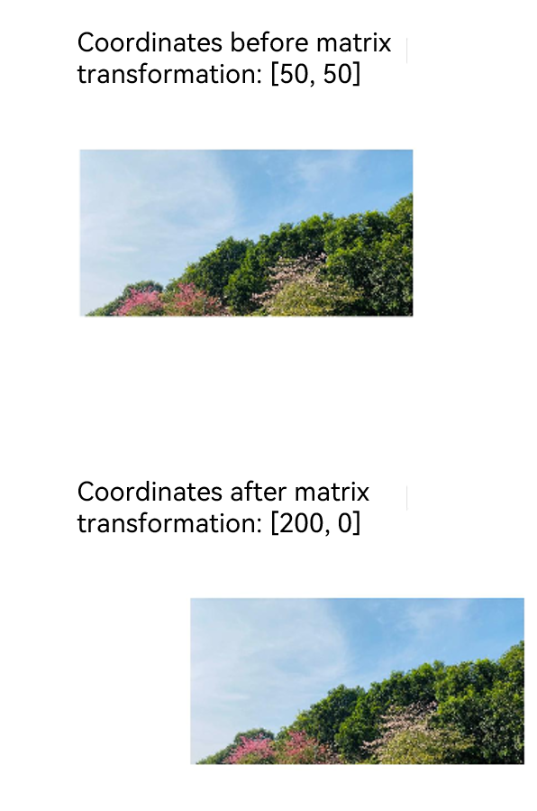

# @ohos.matrix4 (Matrix Transformation)

The **matrix4** module provides APIs for matrix transformation. You can use these APIs to translate, rotate, and scale images.

> **NOTE**
>
> The initial APIs of this module are supported since API version 7. Updates will be marked with a superscript to indicate their earliest API version.


## Modules to Import

```ts
import { matrix4 } from '@kit.ArkUI';
```


## matrix4.init

init(options: [number,number,number,number,number,number,number,number,number,number,number,number,number,number,number,number]): Matrix4Transit

Matrix constructor, which is used to create a 4 x 4 matrix with the input parameters. Column-major order is used.

**Atomic service API**: This API can be used in atomic services since API version 11.

**System capability**: SystemCapability.ArkUI.ArkUI.Full

**Parameters**

| Name| Type                                                        | Mandatory| Description                                                        |
| ------ | ------------------------------------------------------------ | ---- | ------------------------------------------------------------ |
| options | [number,number,number,number,<br>number,number,number,number,<br>number,number,number,number,<br>number,number,number,number] | Yes  | A number array whose length is 16 (4 x 4). For details, see **4 x 4 matrix description**.<br>Value range of each number: (-∞, +∞)<br>Default value:<br>[1, 0, 0, 0,<br>0, 1, 0, 0,<br>0, 0, 1, 0,<br>0, 0, 0, 1] |

**Return value**

| Type                             | Description                        |
| --------------------------------- | ---------------------------- |
| [Matrix4Transit](#matrix4transit) | 4 x 4 matrix object created based on the input parameters.|

**4 x 4 matrix description**

| Name | Type    | Mandatory  | Description                  |
| ---- | ------ | ---- | -------------------- |
| m00  | number | Yes   | Scaling value of the x-axis. The default value is **1** for the identity matrix.     |
| m01  | number | Yes   | The second value, which is affected by the rotation or tilt of the x, y, and z axes.  |
| m02  | number | Yes   | The third value, which is affected by the rotation of the x, y, and z axes.  |
| m03  | number | Yes   | The fourth value, which is affected by perspective projection.              |
| m10  | number | Yes   | The fifth value, which is affected by the rotation or tilt of the x, y, and z axes.  |
| m11  | number | Yes   | Scaling value of the y-axis. The default value is **1** for the identity matrix.     |
| m12  | number | Yes   | The seventh value, which is affected by the rotation of the x, y, and z axes.  |
| m13  | number | Yes   | The eighth value, which is affected by perspective projection.              |
| m20  | number | Yes   | The ninth value, which is affected by the rotation of the x, y, and z axes.  |
| m21  | number | Yes   | The tenth value, which is affected by the rotation of the x, y, and z axes. |
| m22  | number | Yes   | Scaling value of the z-axis. The default value is **1** for the identity matrix.     |
| m23  | number | Yes   | The 12th value, which is affected by perspective projection.              |
| m30  | number | Yes   | Translation value of the x-axis, in px. The default value is **0** for the identity matrix.|
| m31  | number | Yes   | Translation value of the y-axis, in px. The default value is **0** for the identity matrix.|
| m32  | number | Yes   | Translation value of the z-axis, in px. The default value is **0** for the identity matrix.|
| m33  | number | Yes   | Valid in homogeneous coordinates, presenting the perspective projection effect.   |

**Example**

```ts
import { matrix4 } from '@kit.ArkUI';

// Create a 4 x 4 matrix.
let matrix = matrix4.init(
  [1.0, 0.0, 0.0, 0.0,
    0.0, 1.0, 0.0, 0.0,
    0.0, 0.0, 1.0, 0.0,
    0.0, 0.0, 0.0, 1.0])

@Entry
@Component
struct Tests {
  build() {
    Column() {
      Image($r("app.media.zh"))
        .width("40%")
        .height(100)
        .transform(matrix)
    }
  }
}
```


## matrix4.identity

identity(): Matrix4Transit

Constructs an identity matrix.

**Atomic service API**: This API can be used in atomic services since API version 11.

**System capability**: SystemCapability.ArkUI.ArkUI.Full

**Return value**

| Type                             | Description          |
| --------------------------------- | -------------- |
| [Matrix4Transit](#matrix4transit) | Identity matrix object.|

**Example**

```ts
// The effect of matrix 1 is the same as that of matrix 2.
import { matrix4 } from '@kit.ArkUI';

let matrix1 = matrix4.init(
  [1.0, 0.0, 0.0, 0.0,
    0.0, 1.0, 0.0, 0.0,
    0.0, 0.0, 1.0, 0.0,
    0.0, 0.0, 0.0, 1.0])
let matrix2 = matrix4.identity()

@Entry
@Component
struct Tests {
  build() {
    Column() {
      Image($r("app.media.zh"))
        .width("40%")
        .height(100)
        .transform(matrix1)
      Image($r("app.media.zh"))
        .width("40%")
        .height(100)
        .margin({ top: 150 })
        .transform(matrix2)
    }
  }
}
```

## Matrix4Transit

Implements a **Matrix4Transit** object.

**Atomic service API**: This API can be used in atomic services since API version 11.

**System capability**: SystemCapability.ArkUI.ArkUI.Full

### copy

copy(): Matrix4Transit

Copies this matrix object.

**Atomic service API**: This API can be used in atomic services since API version 11.

**System capability**: SystemCapability.ArkUI.ArkUI.Full

**Return value**

| Type                             | Description                |
| --------------------------------- | -------------------- |
| [Matrix4Transit](#matrix4transit) | Copy object of the current matrix.|


**Example**

```ts
// xxx.ets
import { matrix4 } from '@kit.ArkUI';

@Entry
@Component
struct Test {
  private matrix1 = matrix4.identity().scale({ x: 1.5 })
  private matrix2 = this.matrix1.copy().translate({ x: 200 })
  imageSize: Length = '300px'

  build() {
    Column({ space: "50px" }) {
      Image($r("app.media.testImage"))
        .width(this.imageSize)
        .height(this.imageSize)
      Image($r("app.media.testImage"))
        .width(this.imageSize)
        .height(this.imageSize)
        .transform(this.matrix1)
      Image($r("app.media.testImage"))
        .width(this.imageSize)
        .height(this.imageSize)
        .transform(this.matrix2)
    }.alignItems(HorizontalAlign.Center)
    .height('100%').width("100%")
    .justifyContent(FlexAlign.Center)
  }
}
```


### combine

combine(options: Matrix4Transit): Matrix4Transit

Combines the effects of two matrices to generate a new matrix object. The original matrix that calls this API will be changed.

**Atomic service API**: This API can be used in atomic services since API version 11.

**System capability**: SystemCapability.ArkUI.ArkUI.Full

**Parameters**

| Name| Type                             | Mandatory| Description              |
| ------ | --------------------------------- | ---- | ------------------ |
| options | [Matrix4Transit](#matrix4transit) | Yes  | Matrix object to be combined.|

**Return value**

| Type                             | Description              |
| --------------------------------- | ------------------ |
| [Matrix4Transit](#matrix4transit) | Object after matrix combination.|

**Example**

```ts
// xxx.ets
import { matrix4 } from '@kit.ArkUI';

@Entry
@Component
struct Test {
  private matrix1 = matrix4.identity().translate({ x: 200 })
  private matrix2 = matrix4.identity().scale({ x: 2 })

  build() {
    Column() {
      // Before matrix transformation
      Image($r("app.media.icon"))
        .width("40%")
        .height(100)
        .margin({ top: 50 })
      // Translate the x-axis by 200px, and then scale it twice to obtain the resultant matrix.
      Image($r("app.media.icon"))
        .transform(this.matrix1.copy().combine(this.matrix2))
        .width("40%")
        .height(100)
        .margin({ top: 50 })
    }
  }
}
```


### invert

invert(): Matrix4Transit

Inverts this matrix object. The original matrix that calls this API will be changed.

**Atomic service API**: This API can be used in atomic services since API version 11.

**System capability**: SystemCapability.ArkUI.ArkUI.Full

**Return value**

| Type                             | Description                  |
| --------------------------------- | ---------------------- |
| [Matrix4Transit](#matrix4transit) | Inverse matrix object of the current matrix.|

**Example**

```ts
import { matrix4 } from '@kit.ArkUI';

// The effect of matrix 1 (width scaled up by 2x) is opposite to that of matrix 2 (width scaled down by 2x).
let matrix1 = matrix4.identity().scale({ x: 2 })
let matrix2 = matrix1.copy().invert()

@Entry
@Component
struct Tests {
  build() {
    Column() {
      Image($r("app.media.zh"))
        .width(200)
        .height(100)
        .transform(matrix1)
        .margin({ top: 100 })
      Image($r("app.media.zh"))
        .width(200)
        .height(100)
        .margin({ top: 150 })
        .transform(matrix2)
    }
  }
}
```


### translate

translate(options: TranslateOption): Matrix4Transit

Translates this matrix object along the x, y, and z axes. The original matrix that calls this API will be changed.

**Atomic service API**: This API can be used in atomic services since API version 11.

**System capability**: SystemCapability.ArkUI.ArkUI.Full

**Parameters**

| Name| Type                               | Mandatory| Description          |
| ------ | ----------------------------------- | ---- | -------------- |
| options | [TranslateOption](#translateoption) | Yes  | Translation configuration.|

**Return value**

| Type                             | Description                        |
| --------------------------------- | ---------------------------- |
| [Matrix4Transit](#matrix4transit) | Matrix object after the translation.|

**Example**

```ts
// xxx.ets
import { matrix4 } from '@kit.ArkUI';

@Entry
@Component
struct Test {
  private matrix1 = matrix4.identity().translate({ x: 100, y: 200, z: 30 })

  build() {
    Column() {
      Image($r("app.media.bg1")).transform(this.matrix1)
        .width("40%")
        .height(100)
    }
  }
}
```


### scale

scale(options: ScaleOption): Matrix4Transit

Scales this matrix object along the x, y, and z axes. The matrix that calls this API will be changed.

**Atomic service API**: This API can be used in atomic services since API version 11.

**System capability**: SystemCapability.ArkUI.ArkUI.Full

**Parameters**

| Name| Type                       | Mandatory| Description          |
| ------ | --------------------------- | ---- | -------------- |
| options | [ScaleOption](#scaleoption) | Yes  | Scaling configuration.|

**Return value**

| Type                             | Description                        |
| --------------------------------- | ---------------------------- |
| [Matrix4Transit](#matrix4transit) | Matrix object after the scaling.|

**Example**

```ts
// xxx.ets
import { matrix4 } from '@kit.ArkUI';

@Entry
@Component
struct Test {
  private matrix1 = matrix4.identity()
    .scale({
      x: 2,
      y: 3,
      z: 4,
      centerX: 50,
      centerY: 50
    })

  build() {
    Column() {
      Image($r("app.media.testImage")).transform(this.matrix1)
        .width("300px")
        .height("300px")
    }.width("100%").height("100%").justifyContent(FlexAlign.Center)
  }
}
```


### skew<sup>12+</sup>

skew(x: number, y: number): Matrix4Transit

Skews this matrix object along the x and y axes. The matrix that calls this API will be changed.

**Atomic service API**: This API can be used in atomic services since API version 12.

**System capability**: SystemCapability.ArkUI.ArkUI.Full

**Parameters**

| Name| Type                       | Mandatory| Description          |
| ------ | --------------------------- | ---- | -------------- |
| x | number | Yes  | Amount of skewing on the x-axis.|
| y | number | Yes  | Amount of skewing on the y-axis.|

**Return value**

| Type                             | Description                        |
| --------------------------------- | ---------------------------- |
| [Matrix4Transit](#matrix4transit) | Matrix object after the skewing.|

**Example**

```ts
// xxx.ets
import { matrix4 } from '@kit.ArkUI';

@Entry
@Component
struct Test {
  private matrix1 = matrix4.identity().skew(2, 3)

  build() {
    Column() {
      Image($r("app.media.bg1")).transform(this.matrix1)
        .height(100)
        .margin({
          top: 300
        })
    }
    .width("100%")
    .height("100%")
  }
}
```


### rotate

rotate(options: RotateOption): Matrix4Transit

Rotates this matrix object along the x, y, and z axes. The matrix that calls this API will be changed.

**Atomic service API**: This API can be used in atomic services since API version 11.

**System capability**: SystemCapability.ArkUI.ArkUI.Full

**Parameters**

| Name| Type                         | Mandatory| Description          |
| ------ | ----------------------------- | ---- | -------------- |
| options | [RotateOption](#rotateoption) | Yes  | Rotation configuration.|

**Return value**

| Type                             | Description                        |
| --------------------------------- | ---------------------------- |
| [Matrix4Transit](#matrix4transit) | Matrix object after the rotation.|

**Example**

```ts
// xxx.ets
import { matrix4 } from '@kit.ArkUI';

@Entry
@Component
struct Test {
  private matrix1 = matrix4.identity()
    .rotate({
      x: 1,
      y: 1,
      z: 2,
      angle: 30
    })

  build() {
    Column() {
      Image($r("app.media.bg1")).transform(this.matrix1)
        .width("40%")
        .height(100)
    }.width("100%").margin({ top: 50 })
  }
}
```


### transformPoint

transformPoint(options: [number, number]): [number, number]

Applies the current transformation effect to a coordinate point.

**Atomic service API**: This API can be used in atomic services since API version 11.

**System capability**: SystemCapability.ArkUI.ArkUI.Full

**Parameters**

| Name | Type            | Mandatory| Description              |
| ------- | ---------------- | ---- | ------------------ |
| options | [number, number] | Yes  | Point to be transformed.|

**Return value**

| Type            | Description                       |
| ---------------- | --------------------------- |
| [number, number] | Point object after matrix transformation|

**Example**

```ts
// xxx.ets
import { matrix4 } from '@kit.ArkUI';

@Entry
@Component
struct Test {
  private originPoint: number[] = [50, 50]
  private matrix_1 = matrix4.identity().translate({ x: 150, y: -50 })
  private transformPoint = this.matrix_1.transformPoint([this.originPoint[0], this.originPoint[1]])
  private matrix_2 = matrix4.identity().translate({ x: this.transformPoint[0], y: this.transformPoint[1] })

  build() {
    Column() {
      Text(`Coordinates before matrix transformation: [${this.originPoint}]`)
        .fontSize(16)
      Image($r("app.media.image"))
        .width('600px')
        .height('300px')
        .margin({ top: 50 })
      Text(`Coordinates after matrix transformation: [${this.transformPoint}]`)
        .fontSize(16)
        .margin({ top: 100 })
      Image($r("app.media.image"))
        .width('600px')
        .height('300px')
        .margin({ top: 50 })
        .transform(this.matrix_2)
    }.width("100%").padding(50)
  }
}
```



### setPolyToPoly<sup>12+</sup>

setPolyToPoly(options: PolyToPolyOptions): Matrix4Transit

Maps the vertex coordinates of a polygon to those of another polygon.

**Atomic service API**: This API can be used in atomic services since API version 12.

**System capability**: SystemCapability.ArkUI.ArkUI.Full

**Parameters**

| Name| Type            | Mandatory| Description              |
| ------ | ---------------- | ---- | ------------------ |
| options | [PolyToPolyOptions](#polytopolyoptions12)  | Yes  | Parameters for mapping.|

**Return value**

| Type                             | Description                |
| --------------------------------- | -------------------- |
| [Matrix4Transit](#matrix4transit) | Matrix object after the mapping.|

> **NOTE**
>
> This API must be used with **scale({centerX:0,centerY:0,x:1})** to ensure that the transformation is centered at the upper left corner of the component.

**Example**

```ts
import { matrix4 } from '@kit.ArkUI'

@Entry
@Component
struct Index {
  private matrix1 = matrix4.identity().setPolyToPoly({
    src: [{ x: 0, y: 0 }, { x: 500, y: 0 }, { x: 0, y: 500 }, { x: 500, y: 500 }],
    dst: [{ x: 0, y: 0 }, { x: 500, y: 0 }, { x: 0, y: 500 }, { x: 750, y: 1000 }], pointCount: 4
  })

  build() {
    Stack() {
      Column().backgroundColor(Color.Blue)
        .width('500px')
        .height('500px')
      Image($r('app.media.transition_image1'))
        .scale({ centerX: 0, centerY: 0, x: 1 })
        .transform(this.matrix1)
        .width('500px')
        .height('500px')
    }.width("100%").height("100%").opacity(0.5)
  }
}
```

## TranslateOption

**Atomic service API**: This API can be used in atomic services since API version 11.

**System capability**: SystemCapability.ArkUI.ArkUI.Full

| Name| Type  | Mandatory| Description                                                       |
| ---- | ------ | ---- | ----------------------------------------------------------- |
| x    | number | No  | Translation distance along the x-axis.<br>Unit: px<br>Default value: **0**<br>Value range: (-∞, +∞)|
| y    | number | No  | Translation distance along the y-axis.<br>Unit: px<br>Default value: **0**<br>Value range: (-∞, +∞)|
| z    | number | No  | Translation distance along the z-axis.<br>Unit: px<br>Default value: **0**<br>Value range: (-∞, +∞)|

## ScaleOption

**Atomic service API**: This API can be used in atomic services since API version 11.

**System capability**: SystemCapability.ArkUI.ArkUI.Full

| Name   | Type  | Mandatory| Description                                                        |
| ------- | ------ | ---- | ------------------------------------------------------------ |
| x       | number | No  | Scaling multiple along the x-axis. x > 1: The image is scaled up along the x-axis.<br>0 < x < 1: The image is scaled down along the x-axis.<br>x < 0: The image is scaled in the reverse direction of the x-axis.<br>Default value: **1**<br>Value range: (-∞, +∞)|
| y       | number | No  | Scaling multiple along the y-axis. y > 1: The image is scaled up along the y-axis.<br>0 < y < 1: The image is scaled down along the y-axis.<br>y < 0: The image is scaled in the reverse direction of the y-axis.<br>Default value: **1**<br>Value range: (-∞, +∞)|
| z       | number | No  | Scaling multiple along the z-axis. z > 1: The image is scaled up along the z-axis.<br>0 < z < 1: The image is scaled down along the z-axis.<br>z < 0: The image is scaled in the reverse direction of the z-axis.<br>Default value: **1**<br>Value range: (-∞, +∞)|
| centerX | number | No  | X coordinate of the center point.<br>Unit: px<br>Default value: X-coordinate of the component center<br>Value range: (-∞, +∞)   |
| centerY | number | No  | Y coordinate of the center point.<br>Unit: px<br>Default value: Y-coordinate of the component center<br>Value range: (-∞, +∞)   |

## RotateOption

**Atomic service API**: This API can be used in atomic services since API version 11.

**System capability**: SystemCapability.ArkUI.ArkUI.Full

| Name   | Type  | Mandatory| Description                                                        |
| ------- | ------ | ---- | ------------------------------------------------------------ |
| x       | number | No  | X coordinate of the rotation axis vector.<br>Default value: **0**<br>Value range: (-∞, +∞)     |
| y       | number | No  | Y coordinate of the rotation axis vector.<br>Default value: **0**<br>Value range: (-∞, +∞)     |
| z       | number | No  | Z coordinate of the rotation axis vector.<br>Default value: **0**<br>Value range: (-∞, +∞)<br>**NOTE**<br>The rotation axis vector is valid only when at least one of **x**, **y**, and **z** is not 0.|
| angle   | number | No  | Rotation angle.<br>Default value: **0**                                    |
| centerX | number | No  | Additional x-axis offset of the transformation center relative to the component's anchor.<br>Unit: px<br>Default value: **0**<br>**NOTE**<br>The value **0** indicates that the transformation center coincides with the component's x-axis anchor. For details about the implementation, see [Example 3: Implementing Rotation Around a Center Point](arkui-ts/ts-universal-attributes-transformation.md#example-3-implementing-rotation-around-a-center-point).|
| centerY | number | No  | Additional y-axis offset of the transformation center relative to the component's anchor.<br>Unit: px<br>Default value: **0**<br>**NOTE**<br>The value **0** indicates that the transformation center coincides with the component's y-axis anchor. For details about the implementation, see [Example 3: Implementing Rotation Around a Center Point](arkui-ts/ts-universal-attributes-transformation.md#example-3-implementing-rotation-around-a-center-point).|

## PolyToPolyOptions<sup>12+</sup>

**Atomic service API**: This API can be used in atomic services since API version 12.

**System capability**: SystemCapability.ArkUI.ArkUI.Full

| Name| Type  | Mandatory| Description                                                       |
| ---- | ------ | ---- | ----------------------------------------------------------- |
| src    |  Array<[Point](#point12)> | Yes  | Coordinates of the source point.|
| srcIndex    | number | No  | Start index of the source point coordinates.<br>Default value: **0**.<br> Value range: [0, +∞).|
| dst    |  Array<[Point](#point12)>  | Yes  | Coordinates of the destination point.|
| dstIndex    | number | No  |  Start index of the destination point coordinates.<br>Default value: **0**.<br> Value range: [0, +∞).|
| pointCount    | number | No  | Number of used points.<br>Default value: **src.length/2**.<br> Value range: [0, +∞).|

## Point<sup>12+</sup>

**Atomic service API**: This API can be used in atomic services since API version 12.

**System capability**: SystemCapability.ArkUI.ArkUI.Full

| Name| Type  | Mandatory| Description                                                       |
| ---- | ------ | ---- | ----------------------------------------------------------- |
| x    |  number | Yes  | X-coordinate.<br>Value range: (-∞, +∞)|
| y    | number | Yes  | Y-coordinate.<br>Value range: (-∞, +∞)|

## matrix4.copy<sup>(deprecated)</sup>

copy(): Matrix4Transit


Copies this matrix object.

> **NOTE**
>
> This API is deprecated since API version 10. You are advised to use [Matrix4Transit.copy](#copy) instead.


**System capability**: SystemCapability.ArkUI.ArkUI.Full

**Return value**

| Type                             | Description                |
| --------------------------------- | -------------------- |
| [Matrix4Transit](#matrix4transit) | Copy object of the current matrix.|

**Example**

```ts
// xxx.ets
import { matrix4 } from '@kit.ArkUI';

@Entry
@Component
struct Test {
  private matrix1 = matrix4.identity().translate({ x: 100 })
  // Perform the scale operation on the copy matrix of matrix1, which does not affect matrix1.
  private matrix2 = this.matrix1.copy().scale({ x: 2 })

  build() {
    Column() {
      Image($r("app.media.bg1"))
        .width("40%")
        .height(100)
        .transform(this.matrix1)
      Image($r("app.media.bg2"))
        .width("40%")
        .height(100)
        .margin({ top: 50 })
        .transform(this.matrix2)
    }
  }
}
```


## matrix4.invert<sup>(deprecated)</sup>

invert(): Matrix4Transit

Inverts this matrix object.

> **NOTE**
>
> This API is deprecated since API version 10. You are advised to use [Matrix4Transit.invert](#invert) instead.

**System capability**: SystemCapability.ArkUI.ArkUI.Full

**Return value**

| Type                             | Description                  |
| --------------------------------- | ---------------------- |
| [Matrix4Transit](#matrix4transit) | Inverse matrix object of the current matrix.|

## matrix4.combine<sup>(deprecated)</sup>

combine(options: Matrix4Transit): Matrix4Transit

Combines the effects of two matrices to generate a new matrix object.

> **NOTE**
>
> This API is deprecated since API version 10. You are advised to use [Matrix4Transit.combine](#combine) instead.

**System capability**: SystemCapability.ArkUI.ArkUI.Full

**Parameters**

| Name | Type                             | Mandatory| Description              |
| ------- | --------------------------------- | ---- | ------------------ |
| options | [Matrix4Transit](#matrix4transit) | Yes  | Matrix object to be combined.|

**Return value**

| Type                             | Description                  |
| --------------------------------- | ---------------------- |
| [Matrix4Transit](#matrix4transit) | Matrix object after combination.|

## matrix4.translate<sup>(deprecated)</sup>

translate(options: TranslateOption): Matrix4Transit

Translates this matrix object along the x, y, and z axes.

> **NOTE**
>
> This API is deprecated since API version 10. You are advised to use [Matrix4Transit.translate](#translate) instead.

**System capability**: SystemCapability.ArkUI.ArkUI.Full

**Parameters**

| Name | Type                               | Mandatory| Description          |
| ------- | ----------------------------------- | ---- | -------------- |
| options | [TranslateOption](#translateoption) | Yes  | Translation configuration.|

**Return value**

| Type                             | Description                  |
| --------------------------------- | ---------------------- |
| [Matrix4Transit](#matrix4transit) | Matrix object after translation.|

## matrix4.scale<sup>(deprecated)</sup>

scale(options: ScaleOption): Matrix4Transit

Scales this matrix object along the x, y, and z axes.

> **NOTE**
>
> This API is deprecated since API version 10. You are advised to use [Matrix4Transit.scale](#scale) instead.

**System capability**: SystemCapability.ArkUI.ArkUI.Full

**Parameters**

| Name | Type                       | Mandatory| Description          |
| ------- | --------------------------- | ---- | -------------- |
| options | [ScaleOption](#scaleoption) | Yes  | Scaling configuration.|

**Return value**

| Type                             | Description                  |
| --------------------------------- | ---------------------- |
| [Matrix4Transit](#matrix4transit) | Matrix object after scaling.|

## matrix4.rotate<sup>(deprecated)</sup>

rotate(options: RotateOption): Matrix4Transit

Rotates this matrix object along the x, y, and z axes.

> **NOTE**
>
> This API is deprecated since API version 10. You are advised to use [Matrix4Transit.rotate](#rotate) instead.

**System capability**: SystemCapability.ArkUI.ArkUI.Full

**Parameters**

| Name | Type                         | Mandatory| Description          |
| ------- | ----------------------------- | ---- | -------------- |
| options | [RotateOption](#rotateoption) | Yes  | Rotation configuration.|

**Return value**

| Type                             | Description                  |
| --------------------------------- | ---------------------- |
| [Matrix4Transit](#matrix4transit) | Matrix object after rotation.|

## matrix4.transformPoint<sup>(deprecated)</sup>

transformPoint(options: [number, number]): [number, number]

Applies the current transformation effect to a coordinate point.

> **NOTE**
>
> This API is deprecated since API version 10. You are advised to use [Matrix4Transit.transformPoint](#transformpoint) instead.

**System capability**: SystemCapability.ArkUI.ArkUI.Full

**Parameters**

| Name | Type            | Mandatory| Description              |
| ------- | ---------------- | ---- | ------------------ |
| options | [number, number] | Yes  | Point to be transformed.|

**Return value**

| Type            | Description                       |
| ---------------- | --------------------------- |
| [number, number] | Point object after matrix transformation|
