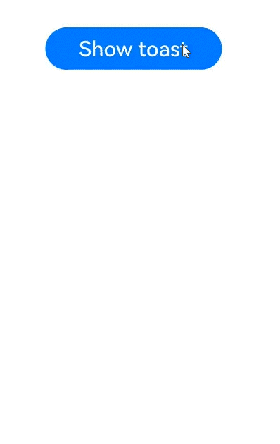
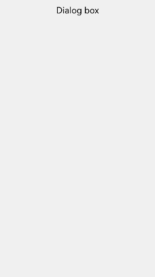
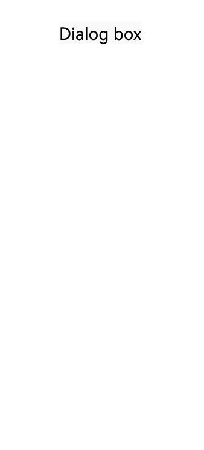

# @ohos.promptAction (Prompt)

The **PromptAction** module provides APIs for creating and showing toasts, dialog boxes, and action menus.

> **NOTE**
>
> The initial APIs of this module are supported since API version 9. Newly added APIs will be marked with a superscript to indicate their earliest API version.
>
> This module cannot be used in the file declaration of the [UIAbility](../apis-ability-kit/js-apis-app-ability-uiAbility.md). In other words, the APIs of this module can be used only after a component instance is created; they cannot be called in the lifecycle of the UIAbility.
>
> The functionality of this module depends on UI context. This means that the APIs of this module cannot be used where the UI context is unclear. For details, see [UIContext](js-apis-arkui-UIContext.md#uicontext).
>
> Since API version 10, you can use the [getPromptAction](js-apis-arkui-UIContext.md#getpromptaction) API in [UIContext](js-apis-arkui-UIContext.md#uicontext) to obtain the [PromptAction](js-apis-arkui-UIContext.md#promptaction) object associated with the current UI context.

## Modules to Import

```ts
import promptAction from '@ohos.promptAction';
```

## promptAction.showToast

showToast(options: ShowToastOptions): void

Shows a toast.

**Atomic service API**: This API can be used in atomic services since API version 11.

**System capability**: SystemCapability.ArkUI.ArkUI.Full

**Parameters**

| Name    | Type                                   | Mandatory  | Description     |
| ------- | ------------------------------------- | ---- | ------- |
| options | [ShowToastOptions](#showtoastoptions) | Yes   | Toast options.|

**Error codes**

For details about the error codes, see [Universal Error Codes](../errorcode-universal.md) and [promptAction Error Codes](errorcode-promptAction.md).

| ID  | Error Message|
| --------- | ------- |
| 401      | Parameter error. Possible causes: 1. Mandatory parameters are left unspecified; 2.Incorrect parameter types; 3. Parameter verification failed.   |
| 100001    | if UI execution context not found. |

**Example**

```ts
import promptAction from '@ohos.promptAction'
import { BusinessError } from '@ohos.base';
@Entry
@Component
struct toastExample {
  build() {
    Column() {
      Button('Show toast').fontSize(20)
        .onClick(() => {
          try {
            promptAction.showToast({
              message: 'Hello World',
              duration: 2000
            });
          } catch (error) {
            let message = (error as BusinessError).message
            let code = (error as BusinessError).code
            console.error(`showToast args error code is ${code}, message is ${message}`);
          };
        })
    }.height('100%').width('100%').justifyContent(FlexAlign.Center)
  }
}
```
Below is a toast in API version 11 and earlier versions.



Below is a toast in API version 12 and later versions.


## promptAction.showDialog

showDialog(options: ShowDialogOptions): Promise&lt;ShowDialogSuccessResponse&gt;

Shows a dialog box. This API uses a promise to return the result asynchronously.

**Atomic service API**: This API can be used in atomic services since API version 11.

**System capability**: SystemCapability.ArkUI.ArkUI.Full

**Parameters**

| Name    | Type                                     | Mandatory  | Description    |
| ------- | --------------------------------------- | ---- | ------ |
| options | [ShowDialogOptions](#showdialogoptions) | Yes   | Dialog box options.|

**Return value**

| Type                                      | Description      |
| ---------------------------------------- | -------- |
| Promise&lt;[ShowDialogSuccessResponse](#showdialogsuccessresponse)&gt; | Promise used to return the dialog box response result.|

**Error codes**

For details about the error codes, see [Universal Error Codes](../errorcode-universal.md) and [promptAction Error Codes](errorcode-promptAction.md).

| ID  | Error Message|
| --------- | ------- |
| 401      | Parameter error. Possible causes: 1. Mandatory parameters are left unspecified; 2.Incorrect parameter types; 3. Parameter verification failed.   |
| 100001    | if UI execution context not found. |

**Example**

```ts
import promptAction from '@ohos.promptAction'
import { BusinessError } from '@ohos.base';
try {
  promptAction.showDialog({
    title: 'Title Info',
    message: 'Message Info',
    buttons: [
      {
        text: 'button1',
        color: '#000000'
      },
      {
        text: 'button2',
        color: '#000000'
      }
    ],
  })
    .then(data => {
      console.info('showDialog success, click button: ' + data.index);
    })
    .catch((err:Error) => {
      console.info('showDialog error: ' + err);
    })
} catch (error) {
  let message = (error as BusinessError).message
  let code = (error as BusinessError).code
  console.error(`showDialog args error code is ${code}, message is ${message}`);
};
```



## promptAction.showDialog

showDialog(options: ShowDialogOptions, callback: AsyncCallback&lt;ShowDialogSuccessResponse&gt;):void

Shows a dialog box. This API uses an asynchronous callback to return the result.

**Atomic service API**: This API can be used in atomic services since API version 11.

**System capability**: SystemCapability.ArkUI.ArkUI.Full

**Parameters**

| Name     | Type                                      | Mandatory  | Description          |
| -------- | ---------------------------------------- | ---- | ------------ |
| options  | [ShowDialogOptions](#showdialogoptions)  | Yes   | Dialog box options.|
| callback | AsyncCallback&lt;[ShowDialogSuccessResponse](#showdialogsuccessresponse)&gt; | Yes   | Callback used to return the dialog box response result.  |

**Error codes**

For details about the error codes, see [Universal Error Codes](../errorcode-universal.md) and [promptAction Error Codes](errorcode-promptAction.md).

| ID  | Error Message|
| --------- | ------- |
| 401      | Parameter error. Possible causes: 1. Mandatory parameters are left unspecified; 2.Incorrect parameter types; 3. Parameter verification failed.   |
| 100001    | if UI execution context not found. |

**Example**

```ts
import promptAction from '@ohos.promptAction';
import { BusinessError } from '@ohos.base';
try {
  promptAction.showDialog({
    title: 'showDialog Title Info',
    message: 'Message Info',
    buttons: [
      {
        text: 'button1',
        color: '#000000'
      },
      {
        text: 'button2',
        color: '#000000'
      }
    ]
  }, (err, data) => {
    if (err) {
      console.info('showDialog err: ' + err);
      return;
    }
    console.info('showDialog success callback, click button: ' + data.index);
  });
} catch (error) {
  let message = (error as BusinessError).message
  let code = (error as BusinessError).code
  console.error(`showDialog args error code is ${code}, message is ${message}`);
};
```


When the **showInSubWindow** attribute is set to **true**, the toast can be displayed outside the window.

```ts
import promptAction from '@ohos.promptAction';
import { BusinessError } from '@ohos.base';
try {
  promptAction.showDialog({
    title: 'showDialog Title Info',
    message: 'Message Info',
    isModal: true,
    showInSubWindow: true,
    buttons: [
      {
        text: 'button1',
        color: '#000000'
      },
      {
        text: 'button2',
        color: '#000000'
      }
    ]
  }, (err, data) => {
    if (err) {
      console.info('showDialog err: ' + err);
      return;
    }
    console.info('showDialog success callback, click button: ' + data.index);
  });
} catch (error) {
  let message = (error as BusinessError).message
  let code = (error as BusinessError).code
  console.error(`showDialog args error code is ${code}, message is ${message}`);
};
```


## promptAction.showActionMenu

showActionMenu(options: ActionMenuOptions, callback: AsyncCallback&lt;ActionMenuSuccessResponse&gt;):void

Shows an action menu. This API uses a callback to return the result asynchronously.

**Atomic service API**: This API can be used in atomic services since API version 11.

**System capability**: SystemCapability.ArkUI.ArkUI.Full

**Parameters**

| Name     | Type                                      | Mandatory  | Description       |
| -------- | ---------------------------------------- | ---- | --------- |
| options  | [ActionMenuOptions](#actionmenuoptions)  | Yes   | Action menu options.  |
| callback | AsyncCallback&lt;[ActionMenuSuccessResponse](#actionmenusuccessresponse)> | Yes   | Callback used to return the action menu response result.|

**Error codes**

For details about the error codes, see [Universal Error Codes](../errorcode-universal.md) and [promptAction Error Codes](errorcode-promptAction.md).

| ID  | Error Message|
| --------- | ------- |
| 401      | Parameter error. Possible causes: 1. Mandatory parameters are left unspecified; 2.Incorrect parameter types; 3. Parameter verification failed.   |
| 100001    | if UI execution context not found. |

**Example**

```ts
import promptAction from '@ohos.promptAction';
import { BusinessError } from '@ohos.base';
try {
  promptAction.showActionMenu({
    title: 'Title Info',
    buttons: [
      {
        text: 'item1',
        color: '#666666'
      },
      {
        text: 'item2',
        color: '#000000'
      },
    ]
  }, (err, data) => {
    if (err) {
      console.info('showActionMenu err: ' + err);
      return;
    }
    console.info('showActionMenu success callback, click button: ' + data.index);
  })
} catch (error) {
  let message = (error as BusinessError).message
  let code = (error as BusinessError).code
  console.error(`showActionMenu args error code is ${code}, message is ${message}`);
};
```



## promptAction.showActionMenu

showActionMenu(options: ActionMenuOptions): Promise&lt;ActionMenuSuccessResponse&gt;

Shows an action menu. This API uses a promise to return the result asynchronously.

**Atomic service API**: This API can be used in atomic services since API version 11.

**System capability**: SystemCapability.ArkUI.ArkUI.Full

**Parameters**

| Name    | Type                                     | Mandatory  | Description     |
| ------- | --------------------------------------- | ---- | ------- |
| options | [ActionMenuOptions](#actionmenuoptions) | Yes   | Action menu options.|

**Return value**

| Type                                      | Description     |
| ---------------------------------------- | ------- |
| Promise&lt;[ActionMenuSuccessResponse](#actionmenusuccessresponse)&gt; | Promise used to return the action menu response result.|

**Error codes**

For details about the error codes, see [Universal Error Codes](../errorcode-universal.md) and [promptAction Error Codes](errorcode-promptAction.md).

| ID  | Error Message|
| --------- | ------- |
| 401      | Parameter error. Possible causes: 1. Mandatory parameters are left unspecified; 2.Incorrect parameter types; 3. Parameter verification failed.   |
| 100001    | if UI execution context not found. |

**Example**

```ts
import promptAction from '@ohos.promptAction';
import { BusinessError } from '@ohos.base';
try {
  promptAction.showActionMenu({
    title: 'showActionMenu Title Info',
    buttons: [
      {
        text: 'item1',
        color: '#666666'
      },
      {
        text: 'item2',
        color: '#000000'
      },
    ]
  })
    .then(data => {
      console.info('showActionMenu success, click button: ' + data.index);
    })
    .catch((err:Error) => {
      console.info('showActionMenu error: ' + err);
    })
} catch (error) {
  let message = (error as BusinessError).message
  let code = (error as BusinessError).code
  console.error(`showActionMenu args error code is ${code}, message is ${message}`);
};
```


## promptAction.openCustomDialog<sup>11+</sup>

openCustomDialog(options: CustomDialogOptions): Promise&lt;number&gt;

Opens a custom dialog box.

This API cannot be used in **ServiceExtension**.

**isModal = true** and **showInSubWindow = true** cannot be used at the same time.

By default, the width of the dialog box in portrait mode is the width of the window where it is located minus the left and right margins (40 vp for 2-in-1 devices and 16 vp for other devices), and the maximum width is 400 vp.

**Atomic service API**: This API can be used in atomic services since API version 12.

**System capability**: SystemCapability.ArkUI.ArkUI.Full

**Parameters**

| Name | Type                                         | Mandatory| Description              |
| ------- | --------------------------------------------- | ---- | ------------------ |
| options | [CustomDialogOptions](#customdialogoptions11) | Yes  | Content of the custom dialog box.|

**Return value**

| Type                 | Description                                 |
| --------------------- | ------------------------------------- |
| Promise&lt;number&gt; | ID of the custom dialog box, which can be used in **closeCustomDialog**.|

**Error codes**

For details about the error codes, see [Universal Error Codes](../errorcode-universal.md) and [promptAction Error Codes](errorcode-promptAction.md).

| ID| Error Message                          |
| -------- | ---------------------------------- |
| 401      | Parameter error. Possible causes: 1. Mandatory parameters are left unspecified; 2.Incorrect parameter types; 3. Parameter verification failed.   |
| 100001   | if UI execution context not found. |

**Example**

```ts
import promptAction from '@ohos.promptAction'
let customDialogId: number = 0
@Builder
function customDialogBuilder() {
  Column() {
    Text('Custom dialog Message').fontSize(10)
    Row() {
      Button ("OK").onClick () => {
        promptAction.closeCustomDialog(customDialogId)
      })
      Blank().width(50)
      Button ("Cancel").onClick () => {
        promptAction.closeCustomDialog(customDialogId)
      })
    }
  }.height(200).padding(5)
}

@Entry
@Component
struct Index {
  @State message: string = 'Hello World'

  build() {
    Row() {
      Column() {
        Text(this.message)
          .fontSize(50)
          .fontWeight(FontWeight.Bold)
          .onClick(() => {
            promptAction.openCustomDialog({
              builder: customDialogBuilder.bind(this),
              onWillDismiss:(dismissDialogAction: DismissDialogAction)=> {
                console.info("reason" + JSON.stringify(dismissDialogAction.reason))
                console.log("dialog onWillDismiss")
                if (dismissDialogAction.reason == DismissReason.PRESS_BACK) {
                  dismissDialogAction.dismiss()
                }
                if (dismissDialogAction.reason == DismissReason.TOUCH_OUTSIDE) {
                  dismissDialogAction.dismiss()
                }
              }
            }).then((dialogId: number) => {
              customDialogId = dialogId
            })
          })
      }
      .width('100%')
    }
    .height('100%')
  }
}
```

## promptAction.closeCustomDialog<sup>11+</sup>

closeCustomDialog(dialogId: number): void

Closes the specified custom dialog box.

**Atomic service API**: This API can be used in atomic services since API version 12.

**System capability**: SystemCapability.ArkUI.ArkUI.Full

**Parameters**

| Name  | Type  | Mandatory| Description                            |
| -------- | ------ | ---- | -------------------------------- |
| dialogId | number | Yes  | ID of the custom dialog box to close. It is returned from **openCustomDialog**.|

**Error codes**

For details about the error codes, see [Universal Error Codes](../errorcode-universal.md) and [promptAction Error Codes](errorcode-promptAction.md).

| ID| Error Message                          |
| -------- | ---------------------------------- |
| 401      | Parameter error. Possible causes: 1. Mandatory parameters are left unspecified; 2.Incorrect parameter types; 3. Parameter verification failed.   |
| 100001   | if UI execution context not found. |

**Example**

See the example of [promptAction.openCustomDialog](#promptactionopencustomdialog11).

## ShowToastOptions

Describes the options for showing the toast.

**System capability**: SystemCapability.ArkUI.ArkUI.Full

| Name                   | Type                                                        | Mandatory| Description                                                        |
| ----------------------- | ------------------------------------------------------------ | ---- | ------------------------------------------------------------ |
| message                 | string \| [Resource](arkui-ts/ts-types.md#resource)<sup>9+</sup> | Yes  | Text to display.<br>**NOTE**<br>The default font is **'Harmony Sans'**. Other fonts are not supported.<br>**Atomic service API**: This API can be used in atomic services since API version 11.|
| duration                | number                                                       | No  | Duration that the toast will remain on the screen. The default value is 1500 ms. The value range is 1500 ms to 10000 ms. If a value less than 1500 ms is set, the default value is used. If the value greater than 10000 ms is set, the upper limit 10000 ms is used.<br>**Atomic service API**: This API can be used in atomic services since API version 11.|
| bottom                  | string \| number                                   | No  | Distance between the toast border and the bottom of the screen.<br>Default value: **80vp**<br>**Atomic service API**: This API can be used in atomic services since API version 11.|
| showMode<sup>11+</sup>  | [ToastShowMode](#toastshowmode11)                            | No  | Whether to show the toast above the application.<br>Default value: **ToastShowMode.DEFAULT**, which means to show the toast in the application.<br>**Atomic service API**: This API can be used in atomic services since API version 12.|
| alignment<sup>12+</sup> | [Alignment](arkui-ts/ts-appendix-enums.md#alignment)         | No  | Alignment mode.<br>Default value: **undefined**, indicating bottom start        |
| offset<sup>12+</sup>    | [Offset](arkui-ts/ts-types.md#offset)                        | No  | Offset in the specified alignment mode.<br>Default value: **{dx:0, dy:0}**, indicating no offset|

### ToastShowMode<sup>11+</sup>

Describes the mode in which the toast is shown.

**Atomic service API**: This API can be used in atomic services since API version 12.

**System capability**: SystemCapability.ArkUI.ArkUI.Full

| Name    | Value  | Description                  |
| -------- | ---- | ---------------------- |
| DEFAULT  | 0    | The toast is shown within the application.  |
| TOP_MOST | 1    | The toast is shown above the application.|

## ShowDialogOptions

Describes the options for showing the dialog box.

**System capability**: SystemCapability.ArkUI.ArkUI.Full

| Name                             | Type                                                        | Mandatory| Description                                                        |
| --------------------------------- | ------------------------------------------------------------ | ---- | ------------------------------------------------------------ |
| title                             | string \| [Resource](arkui-ts/ts-types.md#resource)<sup>9+</sup> | No  | Title of the dialog box.<br>**Atomic service API**: This API can be used in atomic services since API version 11.|
| message                           | string \| [Resource](arkui-ts/ts-types.md#resource)<sup>9+</sup> | No  | Text body.<br>**Atomic service API**: This API can be used in atomic services since API version 11.|
| buttons                           | Array&lt;[Button](#button)&gt;                               | No  | Array of buttons in the dialog box. The array structure is {text:'button', color: '\#666666'}. More than one button is supported.<br>**Atomic service API**: This API can be used in atomic services since API version 11.|
| alignment<sup>10+</sup>           | [DialogAlignment](arkui-ts/ts-methods-alert-dialog-box.md#dialogalignment) | No  | Alignment mode of the dialog box in the vertical direction.<br>Default value: **DialogAlignment.Default**<br>**NOTE**<br>If **showInSubWindow** is set to **true** in **UIExtension**, the dialog box is aligned with the host window based on **UIExtension**.<br>**Atomic service API**: This API can be used in atomic services since API version 11.|
| offset<sup>10+</sup>              | [Offset](arkui-ts/ts-types.md#offset)                        | No  | Offset of the dialog box based on the **alignment** settings.<br>Default value: **{ dx: 0 , dy: 0 }**<br>**Atomic service API**: This API can be used in atomic services since API version 11.|
| maskRect<sup>10+</sup>            | [Rectangle](arkui-ts/ts-methods-alert-dialog-box.md#rectangle8) | No  | Mask area of the dialog box. Events outside the mask area are transparently transmitted, and events within the mask area are not.<br>Default value: **{ x: 0, y: 0, width: '100%', height: '100%' }**<br>**NOTE**<br>**maskRect** does not take effect when **showInSubWindow** is set to **true**.<br>**Atomic service API**: This API can be used in atomic services since API version 11.|
| showInSubWindow<sup>11+</sup>     | boolean                                                      | No  | Whether to show the dialog box in a sub-window.<br>Default value: **false**<br>**NOTE**<br>A dialog box whose **showInSubWindow** attribute is **true** cannot trigger the display of another dialog box whose **showInSubWindow** attribute is also **true**.<br>**Atomic service API**: This API can be used in atomic services since API version 11.|
| isModal<sup>11+</sup>             | boolean                                                      | No  | Whether the dialog box is a modal. A modal dialog box has a mask applied, while a non-modal dialog box does not.<br>Default value: **true**<br>**Atomic service API**: This API can be used in atomic services since API version 11.|
| backgroundColor<sup>12+</sup>     | [ResourceColor](arkui-ts/ts-types.md#resourcecolor)          | No  | Background color of the dialog box.<br>Default value: **Color.Transparent**                |
| backgroundBlurStyle<sup>12+</sup> | [BlurStyle](arkui-ts/ts-appendix-enums.md#blurstyle9)        | No  | Background blur style of the dialog box.<br>Default value: **BlurStyle.COMPONENT_ULTRA_THICK**|
| shadow<sup>12+</sup>              | [ShadowOptions](arkui-ts/ts-universal-attributes-image-effect.md#shadowoptions) \| [ShadowStyle](arkui-ts/ts-universal-attributes-image-effect.md#shadowstyle10) | No  | Shadow of the dialog box.<br> Default value on 2-in-1 devices: **ShadowStyle.OUTER_FLOATING_MD** when the dialog box is focused and **ShadowStyle.OUTER_FLOATING_SM** otherwise|

## ShowDialogSuccessResponse

Describes the dialog box response result.

**Atomic service API**: This API can be used in atomic services since API version 11.

**System capability**: SystemCapability.ArkUI.ArkUI.Full

| Name | Type  | Mandatory| Description                           |
| ----- | ------ | ---- | ------------------------------- |
| index | number | No  | Index of the selected button in the **buttons** array.|

## ActionMenuOptions

Describes the options for showing the action menu.

**System capability**: SystemCapability.ArkUI.ArkUI.Full

| Name                         | Type                                                        | Mandatory| Description                                                        |
| ----------------------------- | ------------------------------------------------------------ | ---- | ------------------------------------------------------------ |
| title                         | string \| [Resource](arkui-ts/ts-types.md#resource)<sup>9+</sup> | No  | Title of the dialog box.<br>**Atomic service API**: This API can be used in atomic services since API version 11.|
| buttons                       | [[Button](#button),[Button](#button)?,[Button](#button)?,[Button](#button)?,[Button](#button)?,[Button](#button)?] | Yes  | Array of menu item buttons. The array structure is **{text:'button', color: '\#666666'}**. Up to six buttons are supported. If there are more than six buttons, only the first six buttons will be displayed.<br>**Atomic service API**: This API can be used in atomic services since API version 11.|
| showInSubWindow<sup>11+</sup> | boolean                                                      | No  | Whether to show the dialog box in a sub-window.<br>Default value: **false**, indicating that the dialog box is not displayed in the subwindow<br>**NOTE**<br> - A dialog box whose **showInSubWindow** attribute is **true** cannot trigger the display of another dialog box whose **showInSubWindow** attribute is also **true**.<br> If **showInSubWindow** is set to **true** in **UIExtension**, the dialog box is aligned with the host window based on **UIExtension**.|
| isModal<sup>11+</sup>         | boolean                                                      | No  | Whether the dialog box is a modal. A modal dialog box has a mask applied, while a non-modal dialog box does not.<br>Default value: **true**|

## ActionMenuSuccessResponse

Describes the action menu response result.

**Atomic service API**: This API can be used in atomic services since API version 11.

**System capability**: SystemCapability.ArkUI.ArkUI.Full

| Name | Type  | Mandatory| Description                                    |
| ----- | ------ | ---- | ---------------------------------------- |
| index | number | No  | Index of the selected button in the **buttons** array, starting from **0**.|

## CustomDialogOptions<sup>11+</sup>

Defines the options of the custom dialog box. This API extends [BaseDialogOptions](#basedialogoptions11).

**System capability**: SystemCapability.ArkUI.ArkUI.Full

| Name   | Type                                                   | Mandatory| Description                                                        |
| ------- | ------------------------------------------------------- | ---- | ------------------------------------------------------------ |
| builder | [CustomBuilder](arkui-ts/ts-types.md#custombuilder8) | No  | Content of the custom dialog box.<br>**NOTE**<br>**bind(this)** must be used for the builder.<br>The aspect ratio of the root node is relative to the size of the dialog box container.<br>The aspect ratio of a non-root node is relative to the size of the parent node.<br>**Atomic service API**: This API can be used in atomic services since API version 12.|
| backgroundColor <sup>12+</sup>| [ResourceColor](arkui-ts/ts-types.md#resourcecolor)  | No| Background color of the dialog box.|
| cornerRadius<sup>12+</sup>| [BorderRadiuses](arkui-ts/ts-types.md#borderradiuses9)  \|  [Dimension](arkui-ts/ts-types.md#dimension10) | No| Radius of the rounded corners of the background.<br>You can set separate radiuses for the four rounded corners.<br>Default value: **{ topLeft: '32vp', topRight: '32vp', bottomLeft: '32vp', bottomRight: '32vp' }**<br> The radius of the rounded corners is subject to the component size. Its maximum value is half of the component width or height. If the value is negative, the default value is used.<br> When set to a percentage, the value defines the radius as a percentage of the parent component's width or height.|
| borderWidth<sup>12+</sup>| [Dimension](arkui-ts/ts-types.md#dimension10) \| [EdgeWidths](arkui-ts/ts-types.md#edgewidths9)  | No| Border width of the dialog box.<br>You can set the width for all four sides or set separate widths for individual sides.<br>Default value: **0**<br> When set to a percentage, the value defines the border width as a percentage of the parent dialog box's width.<br>If the left and right borders are greater than its width, or the top and bottom borders are greater than its height, the dialog box may not display as expected.|
| borderColor<sup>12+</sup> | [ResourceColor](arkui-ts/ts-types.md#resourcecolor) \| [EdgeColors](arkui-ts/ts-types.md#edgecolors9)  | No| Border color of the dialog box.<br>Default value: **Color.Black**<br> **borderColor** must be used with **borderWidth** in pairs.|
| borderStyle<sup>12+</sup> | [BorderStyle](arkui-ts/ts-appendix-enums.md#borderstyle) \| [EdgeStyles](arkui-ts/ts-types.md#edgestyles9)  | No| Border style of the dialog box.<br>Default value: **BorderStyle.Solid**<br> **borderStyle** must be used with **borderWidth** in pairs.|
| width<sup>12+</sup> | [Dimension](arkui-ts/ts-types.md#dimension10) | No  | Width of the dialog box.<br>**NOTE**<br>- Default maximum width of the dialog box: 400 vp<br>- When this parameter is set to a percentage, the reference width of the dialog box is the width of the window where the dialog box is located. You can decrease or increase the width as needed.|
| height<sup>12+</sup> | [Dimension](arkui-ts/ts-types.md#dimension10)  | No  | Height of the dialog box.<br>**NOTE**<br>- Default maximum height of the dialog box: 0.9 x (Window height – Safe area)<br>- When this parameter is set to a percentage, the reference height of the dialog box is the height of the window where the dialog box is located minus the safe area. You can decrease or increase the height as needed.|
| shadow<sup>12+</sup>| [ShadowOptions](arkui-ts/ts-universal-attributes-image-effect.md#shadowoptions) \| [ShadowStyle](arkui-ts/ts-universal-attributes-image-effect.md#shadowstyle10)   | No| Shadow of the dialog box.<br>Default value on 2-in-1 devices: **ShadowStyle.OUTER_FLOATING_MD** when the dialog box is focused and **ShadowStyle.OUTER_FLOATING_SM** otherwise|
| backgroundBlurStyle<sup>12+</sup> | [BlurStyle](arkui-ts/ts-appendix-enums.md#blurstyle9)                 | No  | Background blur style of the dialog box.<br>Default value: **BlurStyle.COMPONENT_ULTRA_THICK**|

## BaseDialogOptions<sup>11+</sup>

Defines the options of the dialog box.

**System capability**: SystemCapability.ArkUI.ArkUI.Full

| Name           | Type                                                        | Mandatory| Description                                                        |
| --------------- | ------------------------------------------------------------ | ---- | ------------------------------------------------------------ |
| maskRect        | [Rectangle](arkui-ts/ts-methods-alert-dialog-box.md#rectangle8) | No  | Mask area.<br>Default value: **{ x: 0, y: 0, width: '100%', height: '100%' }**<br>**NOTE**<br>**maskRect** does not take effect when **showInSubWindow** is set to **true**.<br>**Atomic service API**: This API can be used in atomic services since API version 12.|
| alignment       | [DialogAlignment](arkui-ts/ts-methods-alert-dialog-box.md#dialogalignment) | No  | Alignment mode of the dialog box in the vertical direction.<br>Default value: **DialogAlignment.Default**<br>**Atomic service API**: This API can be used in atomic services since API version 12.<br>**NOTE**<br>If **showInSubWindow** is set to **true** in **UIExtension**, the dialog box is aligned with the host window based on **UIExtension**.|
| offset          | [Offset](arkui-ts/ts-types.md#offset)                     | No  | Offset of the dialog box based on the **alignment** settings.<br>Default value: **{ dx: 0 , dy: 0 }**<br>**Atomic service API**: This API can be used in atomic services since API version 12.|
| isModal         | boolean                                                      | No  | Whether the dialog box is a modal. A modal dialog box has a mask applied, while a non-modal dialog box does not.<br>Default value: **true**<br>**Atomic service API**: This API can be used in atomic services since API version 12.|
| showInSubWindow | boolean                                                      | No  | Whether to show the dialog box in a sub-window.<br>Default value: **false**<br>**Atomic service API**: This API can be used in atomic services since API version 12.|
| onWillDismiss<sup>12+</sup> | Callback<[DismissDialogAction](arkui-ts/ts-methods-alert-dialog-box.md#dismissdialogaction12)> | No| Callback for interactive closure of the dialog box.<br>**NOTE**<br>1. If this callback is registered, the dialog box will not be closed immediately after the user touches the mask or the Back button, presses the Esc key, or swipes left or right on the screen. The **reason** parameter in the callback is used to determine whether the dialog box can be closed. The reason returned by the component does not support the value **CLOSE_BUTTON**.<br>2. In the **onWillDismiss** callback, another **onWillDismiss** callback is not allowed.|
|  autoCancel<sup>12+</sup> |       boolean                                   | No  | Whether to close the dialog box when the mask is touched. The value **true** means to close the dialog box when the mask is touched, and **false** means the opposite.<br>Default value: **true**|
|  maskColor<sup>12+</sup> |        [ResourceColor](arkui-ts/ts-types.md#resourcecolor) | No   | Mask color.<br>Default value: **0x33000000**             |
| transition<sup>12+</sup>          | [TransitionEffect](arkui-ts/ts-transition-animation-component.md#transitioneffect10) | No  | Transition effect for the entrance and exit of the dialog box.<br>**NOTE**<br> 1. If this parameter is not set, the default effect is used.<br> 2. Touching the Back button during the entrance animation pauses the entrance animation and starts the exit animation. The final effect is one obtained after the curves of the entrance and exit animations are combined.<br> 3. Touching the Back button during the exit animation does not affect the animation playback. Touching the Back button again closes the application.                              |
| onDidAppear<sup>12+</sup> | () => void | No| Event callback when the dialog box appears.<br>**NOTE**<br>1. The normal timing sequence is as follows: OnWillAppear > onDidAppear > (onDateAccept/onCancel/onDateChange) > OnWillDisappear > OnDidDisappear.<br>2. You can set the callback event for changing the dialog box display effect in **onDidAppear**. The settings take effect next time the dialog box appears.<br>3. If the user closes the dialog box immediately after it appears, **OnWillDisappear** is invoked before **onDidAppear**.<br>4. If the dialog box is closed before its entrance animation is finished, this callback is not invoked. |
| OnDidDisappear<sup>12+</sup> | () => void | No| Event callback when the dialog box disappears.<br>**NOTE**<br>The normal timing sequence is as follows: OnWillAppear > onDidAppear > (onDateAccept/onCancel/onDateChange) > OnWillDisappear > OnDidDisappear.|
| OnWillAppear<sup>12+</sup> | () => void | No| Event callback when the dialog box is about to appear.<br>**NOTE**<br>1. The normal timing sequence is as follows: OnWillAppear > onDidAppear > (onDateAccept/onCancel/onDateChange) > OnWillDisappear > OnDidDisappear.<br>2. You can set the callback event for changing the dialog box display effect in **OnWillAppear**. The settings take effect next time the dialog box appears.|
| OnWillDisappear<sup>12+</sup> | () => void | No| Event callback when the dialog box is about to disappear.<br>**NOTE**<br>1. The normal timing sequence is as follows: OnWillAppear > onDidAppear > (onDateAccept/onCancel/onDateChange) > OnWillDisappear > OnDidDisappear.<br>2. If the user closes the dialog box immediately after it appears, **OnWillDisappear** is invoked before **onDidAppear**.|

## Button

Describes the menu item button in the action menu.

**Atomic service API**: This API can be used in atomic services since API version 11.

**System capability**: SystemCapability.ArkUI.ArkUI.Full

| Name   | Type                                      | Mandatory  | Description     |
| ----- | ---------------------------------------- | ---- | ------- |
| text  | string \|  [Resource](arkui-ts/ts-types.md#resource)<sup>9+</sup> | Yes   | Button text.|
| color | string \|  [Resource](arkui-ts/ts-types.md#resource)<sup>9+</sup> | Yes   | Text color of the button.|
| primary<sup>12+</sup> | boolean | No   | Whether the button responds to the **Enter** key by default when the dialog box has focus and the **Tab** key is not pressed for sequential focus navigation. If there are multiple buttons, set this parameter to **true** for only one button. Otherwise, no button will respond.|
