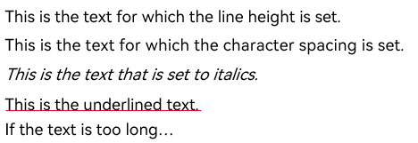

# text


The **\<text>** component is used to display a piece of textual information.

> **NOTE**
>
> The APIs of this module are supported since API version 8. Updates will be marked with a superscript to indicate their earliest API version.


## Child Components

The child component **[\<span>](js-service-widget-basic-span.md)** is supported.


## Attributes

The [universal attributes](js-service-widget-common-attributes.md) are supported.


## Styles

In addition to the [universal styles](js-service-widget-common-styles.md), the following styles are supported.

| Name| Type| Default Value| Mandatory| Description|
| -------- | -------- | -------- | -------- | -------- |
| color | &lt;color&gt; | - | No| Font color.|
| font-size | &lt;length&gt; | 16px | No| Font size.|
| letter-spacing | &lt;length&gt; | 0px | No| Character spacing (px).|
| font-style | string | normal | No| Font style. Available values are as follows:<br>- **normal**: standard font style<br>- **italic**: italic font style|
| font-weight | number \| string | normal | No| Font weight. For the number type, the value ranges from 100 to 900. The default value is 400. A larger value indicates a heavier font weight.<br>The value of the number type must be an integer multiple of 100.<br>The value of the string type can be **lighter**, **normal**, **bold**, or **bolder**.|
| text-decoration | string | none | No| Text decoration. Available values are as follows:<br>- **underline**: An underline is used.<br>- **line-through**: A strikethrough is used.<br>- **none**: The standard text is used.|
| text-align | string | start | No| Text alignment mode. Available values are as follows:<br>- **left**: The text is left-aligned.<br>- **center**: The text is center-aligned.<br>- **right**: The text is right-aligned.<br>- **start**: The text is aligned with the direction in which the text is written.<br>- **end**: The text is aligned with the opposite direction in which the text is written.<br>If the text width is not specified, the alignment effect may not be obvious when the text width is the same as the width of the parent container.|
| line-height | &lt;length&gt; | 0px | No| Text line height. When this parameter is set to **0px**, the text line height is not limited and the font size is adaptive.|
| text-overflow | string | clip | No| Takes effect when the maximum number of lines is specified. Available values are as follows:<br>- **clip**: The text is clipped and displayed based on the size of the parent container.<br>- **ellipsis**: The text is displayed based on the size of the parent container. The text that cannot be displayed is replaced with ellipsis. This style must be used together with **max-lines**.|
| font-family | string | sans-serif<br><br>| No| Font family, in which fonts are separated by commas (,). Each font is set using a font name or font family name. The first font in the family or the specified [custom font](js-service-widget-common-customizing-font.md) is used for the text.|
| max-lines | number | - | No| Maximum number of lines in the text.|
| min-font-size | &lt;length&gt; | - | No| Minimum font size in the text. This style must be used together with **max-font-size**. The font size can be changed dynamically. After the maximum and minimum font sizes are set, **font-size** does not take effect.|
| max-font-size | &lt;length&gt; | - | No| Maximum font size in the text. This style must be used together with **min-font-size**. The font size can be changed dynamically. After the maximum and minimum font sizes are set, **font-size** does not take effect.|
| font-size-step | &lt;length&gt; | 1px | No| Step for dynamically adjusting the font size in the text. The minimum and maximum font sizes must be set.|
| prefer-font-sizes | &lt;array&gt; | - | No| Preset preferred font sizes. For dynamic font size adjustment, the preset sizes are used to match the maximum number of lines in the text. If the preferred font sizes were not set, the font size will be adjusted based on the maximum and minimum font sizes and the step you have set. If the text cannot be displayed in full in the maximum number of lines, **text-overflow** is used to clip the text. If this parameter is set, **font-size**, **max-font-size**, **min-font-size**, and **font-size-step** do not take effect.<br>Example values: **12px,14px,16px**|
| word-break | string | normal | No| Text line breaking mode. The options are as follows:<br>**normal**: Allows text line breaks between words as appropriate to the relevant language writing systems. This is the default mode.<br>**break-all**: Allows text line breaks between any characters for writing systems other than Chinese, Japanese, and Korean.<br>**break-word**: Works in the same way as **break-all**, except that it does not break unbreakable words.|

> **NOTE**
> - In dynamic font adjustment, both the preset size set and the minimum/maximum font sizes are used to adjust the font size to display the text within the maximum number of lines. The preset size set is checked from left to right, and the minimum/maximum font sizes are checked from large to small, to find a size meeting the requirement.
> 
> - Use the escape character **\r\n** for newline.
> 
> - The following escape characters are supported: **\a**, **\b**, **\f**, **\n**, **\r**, **\t**, **\v**, **\'**, **\"**, and **\0**.
> 
> - When you use **\<span>** as a child component to form a text paragraph, note that if a **\<span>** style is abnormal, the text paragraph cannot be displayed.
> 
> - The **letter-spacing**, **text-align**, **line-height**, **text-overflow**, and **max-lines** styles take effect on text content held by the **\<text>** component and its child components (**\<span>**).
> 
> - The **<text>** component cannot contain both the text and the child component **\<span>**. If both of them exist, only the content in **\<span>** is displayed.


## Events

The [universal events](js-service-widget-common-events.md) are supported.

## Example

```html
<div class="container">
    <text class="line_height">
        <span>This is the text for which the line height is set. </span>
    </text>
    <text class="letter_spacing">This is the text for which the character spacing is set. </text>
    <text class="font_style">This is the text that is set to italics. </text>
    <text class="text_decoration_style">This is the underlined text. </text>
    <text class="text_over_flow">If the text is too long, the text can be clipped. </text>
</div>
```

```css
.container{
    flex-direction: column;
    width: 100%;
    height: 100%;
    margin-top: 10px;
    margin-left: 30px;
}
.line_height{
    font-size: 20px;
    line-height: 40px;
}
.letter_spacing{
    font-size: 20px;
    letter-spacing: 5px;
}
.font_style{
    font-size: 20px;
    font-style: italic;
}
.text_decoration_style{
    font-size: 20px;
    text-decoration: underline;
    text-decoration-color: red;
}
.text_over_flow{
    font-size: 20px;
    width: 40%;
    max-lines: 1;
    text-overflow: ellipsis;
}
```

**4 x 4 widget**


