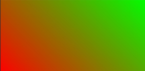
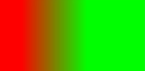

# Gradient Styles

Gradient styles are commonly supported and can be set in the **style** attribute or a **.css** file. Gradients enable smooth transition between two or more specified colors.

> **NOTE**
>
> The APIs of this module are supported since API version 8. Updates will be marked with a superscript to indicate their earliest API version.

The development framework supports two gradient styles: linear gradient and repeating linear gradient.


## Linear Gradient/Repeating Linear Gradient

To use the gradient style, you must specify the transition direction and transition color.


### Transition Direction

  You can specify the transition direction through **direction** or **angle**.

- **direction**: gradient by direction.

- **angle**: gradient by angle.


```css
background: linear-gradient(direction/angle, color, color, ...);
background: repeating-linear-gradient(direction/angle, color, color, ...);
```


### Transition Color

The color can be specified in any of the following formats: \#ff0000, \#ffff0000, rgb(255, 0, 0), and rgba(255, 0, 0, 1). At least two colors must be specified.

**Parameters**

| Name       | Type                                      | Default Value                         | Mandatory  | Description                                      |
| --------- | ---------------------------------------- | ---------------------------- | ---- | ---------------------------------------- |
| direction | to &lt;side-or-corner&gt;  &lt;side-or-corner&gt; = [left \| right] \|\| [top \| bottom] | to bottom (gradient from top to bottom)| No   | Transition direction. For example, **to left** (gradient from right to left) or **to bottom right** (gradient from upper left corner to lower right corner).|
| angle     | &lt;deg&gt;                              | 180deg                       | No   | Transition direction, which is the angle between the gradient line and the y-axis (in the clockwise direction), with the geometric center of the element being the origin of coordinates and the horizontal axis being the x-axis.|
| color     | &lt;color&gt; [&lt;length&gt;\|&lt;percentage&gt;] | -                            | Yes   | Colors among which smooth transitions are rendered.                     |

**Example**

1. Gradient from top to bottom (default)

   ```css
   #gradient {
     height: 300px;
     width: 600px;
     /* Gradient starts from red at the top to green at the bottom. */
     background: linear-gradient(red, #00ff00);
   }
   ```

   

2. Gradient at an angle of 45°

   ```css
   /* Gradient at an angle of 45°, changing from red to green */
     background: linear-gradient(45deg, rgb(255, 0, 0),rgb(0, 255, 0));
   ```

      

3. Gradient from left to right

   ```css
   /* Gradient from left to right, which is available in the 270 px width between the left 90 px and the left 360 px (600*0.6) */
   background: linear-gradient(to right, rgb(255, 0, 0) 90px, rgb(0, 255, 0) 60%);
   ```

    

4. Repeating gradient

   ```css
     /* Repeating gradient from left to right, the area of which is 30 px (60 – 30) and the opacity is 0.5 */
     background: repeating-linear-gradient(to right, rgba(255, 255, 0, 1) 30vp,rgba(0, 0, 255, .5) 60vp);
   ```

   
