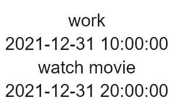

# list


The **\<list>** component provides a list container that presents a series of list items arranged in a column with the same width. It supports presentations of the same type of data in a multiple and coherent row style, for example, images or text.

> **NOTE**
>
> The APIs of this module are supported since API version 8. Updates will be marked with a superscript to indicate their earliest API version.
>
> Limit the number of items in a list to 30 to improve user experience.


## Child Components

Only the **[\<list-item>](js-service-widget-container-list-item.md)** child component is supported.


## Attributes

In addition to the [universal attributes](js-service-widget-common-attributes.md), the following attributes are supported.

| Name           | Type            | Default Value    | Mandatory  | Description                                      |
| ------------- | -------------- | ------- | ---- | ---------------------------------------- |
| cachedcount   | number         | 0       | No   | Minimum number of cached list items when a long list is loaded with delay.                |
| scrollbar     | string         | off     | No   | Display mode of the side scrollbar. (Currently, only the vertical scrollbar is supported.)<br>- **off**: no display.<br>- **auto**: displayed on demand (The side scrollbar is displayed when touched and disappears 2s later.).<br>- **on**: always on display. |
| scrolleffect  | string         | spring  | No   | Scroll effect. Available values are as follows:<br>- **spring**: Similar to the physical dynamic effect of a spring. When the scrollbar reaches the edge, it can continue to scroll for a distance based on the initial speed or a touch event. It rebounds after being released.<br>- **fade**: Similar to the physical dynamic effect of fade. When you scroll to the edge, a wave shape fades. The fade changes according to the speed and scrolling distance.<br>- **none**: No effect when the scrollbar reaches the edge.|
| divider       | boolean        | false   | No   | Whether list items are separated by dividers.<br>For details, see **divider-color**, **divider-height**, **divider-length**, and **divider-origin** in [Styles](#styles).|
| shapemode     | string         | default | No   | Shape of the side scrollbar.<br>- **default**: not specified (following the theme).<br>- **rect**: rectangle.<br>- **round**: circle.|
| updateeffect  | boolean        | false   | No   | Whether a dynamic effect is displayed when an item in the list is deleted or added.<br>- **false**: No dynamic effect is displayed.<br>- **true**: A dynamic effect is displayed when an item is added or deleted.|
| initialindex  | number         | 0       | No   | Item displayed at the start position of the viewport when the list is loaded for the first time. The default value is **0**, indicating that the first item is displayed. If the number you set is greater than the index of the last item, the setting does not take effect. When the **initialoffset** attribute is set, this attribute does not take effect. |
| initialoffset | &lt;length&gt; | 0       | No   | Start offset of the viewport when the list is loaded for the first time. The offset must not exceed the scrolling range of the list. If exceeded, the offset is truncated to the maximum value of the scrolling range. |
| selected      | string         | -       | No   | Selected item in the list. The value can be a **section** value of any list items. |


## Styles

In addition to the [universal styles](js-service-widget-common-styles.md), the following styles are supported.

| Name              | Type                                      | Default Value        | Mandatory  | Description                                      |
| ---------------- | ---------------------------------------- | ----------- | ---- | ---------------------------------------- |
| divider-color    | &lt;color&gt;                            | transparent | No   | Item divider color. This style is valid only when the **divider** attribute of **\<list>** is set to **true**.     |
| divider-height   | &lt;length&gt;                           | 1           | No   | Item divider height. This style is valid only when the **divider** attribute of **\<list>** is set to **true**.     |
| divider-length   | &lt;length&gt;                           | The main axis width       | No   | Item divider length. If this style is not set, the maximum length is the width of the main axis, and the actual length depends on the **divider-origin** parameter. This style is valid only when the **divider** attribute of **\<list>** is set to **true**.|
| divider-origin   | &lt;length&gt;                           | 0           | No   | Item divider offset relative to the start point of the main axis. This style is valid only when the **divider** attribute of **\<list>** is set to **true**.|
| flex-direction   | string                                   | column      | No   | Main axis direction of the flex container. It specifies how items are placed in the flex container.<br>- **column**: The y-axis is the main axis.<br>- **row**: The x-axis is the main axis.<br>For the **\<list>** component, the default value is **column**. For other components, the default value is **row**.|
| columns          | number                                   | 1           | No   | Number of columns displayed in the cross axis direction of the list. The default value is **1**.<br>When multiple columns are set, the columns are evenly distributed on the cross axis of the **\<list>** component. The size of each column is the same.|
| align-items      | string                                   | stretch     | No   | Alignment of items in each column on the cross axis. Available values are as follows:<br>- **stretch**: Items are stretched to the same height or width as the container along the cross axis.<br>- **flex-start**: Items are packed toward the start edge of the cross axis.<br>- **flex-end**: Items are packed toward the end edge of the cross axis.<br>- **center**: Items are packed toward the center of the cross axis.<br>This style takes effect only on items of each column. Columns are evenly distributed.|
| item-extent      | &lt;length&gt; \| &lt;percentage&gt; | -           | No   | Size of an internal item. When a percentage is set, the value indicates the percentage of the length in the main axis direction relative to the list viewpoint.|
| fade-color       | &lt;color&gt;                            | grey        | No   | Color of the physical dynamic effect. This attribute is valid only when **scrolleffect** is set to **fade**.          |
| scrollbar-color  | &lt;color&gt;                            | -           | No   | Color of the scrollbar.                               |
| scrollbar-width  | &lt;length&gt;                           | -           | No   | Width of the scrollbar.                               |
| scrollbar-offset | &lt;length&gt;                           | 0           | No   | Offset between the scrollbar and the default position of the list. The value must be a positive number. The default position is on the right edge of the list. You can adjust the horizontal position of the scrollbar by setting this offset. If the scrollbar is drawn outside the list and the parent component of the list is capable of cropping, the scrollbar will be cropped.|


## Events

The [universal events](js-service-widget-common-events.md) are supported.


## Example


```html
<!-- index.hml -->
<div class="container">
  <list class="todo-wraper">
    <list-item for="{{todolist}}" class="todo-item">
      <text class="todo-title">{{$item.title}}</text>
      <text class="todo-title">{{$item.date}}</text>
    </list-item>
  </list>
</div>
```


```json
{
  "data": {
    "todolist": [{
      "title": "work",
      "date": "2021-12-31 10:00:00"
    }, {
      "title": "watch movie",
      "date": "2021-12-31 20:00:00"
    }]
  }
}
```


```css
/* index.css */
.container {
  display: flex;
  justify-content: center;
  align-items: center;
  left: 0px;
  top: 0px;
  width: 454px;
  height: 454px;
}
.todo-wraper {
  width: 454px;
  height: 300px;
}
.todo-item {
  width: 454px;
  height: 80px;
  flex-direction: column;
}
.todo-title {
  width: 454px;
  height: 40px;
  text-align: center;
}
```
**4 x 4 widget**


