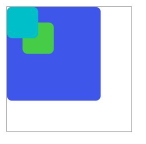

# stack


The **\<stack>** component provides a stack container where child components are successively stacked and the latter one overwrites the previous one.

> **NOTE**
>
>The APIs of this module are supported since API version 8. Updates will be marked with a superscript to indicate their earliest API version.


## Child Components

Supported


## Attributes

The [universal attributes](js-service-widget-common-attributes.md) are supported.


## Styles

The [universal styles](js-service-widget-common-styles.md) are supported.


## Events

The [universal events](js-service-widget-common-events.md) are supported.


## Example


```html
<!-- xxx.hml -->
<stack class="stack-parent">
  <div class="back-child bd-radius"></div>
  <div class="positioned-child bd-radius"></div>
  <div class="front-child bd-radius"></div>
</stack>
```


```css
/* xxx.css */
.stack-parent {
  width: 400px;
  height: 400px;
  margin: 50px;
  background-color: #ffffff;
  border-width: 1px;
  border-style: solid;
}
.back-child {
  width: 300px;
  height: 300px;
  background-color: #3f56ea;
}
.front-child {
  width: 100px;
  height: 100px;
  background-color: #00bfc9;
}
.positioned-child {
  width: 100px;
  height: 100px;
  left: 50px;
  top: 50px;
  background-color: #47cc47;
}
.bd-radius {
  border-radius: 16px;
}
```
**4 x 4 widget**


