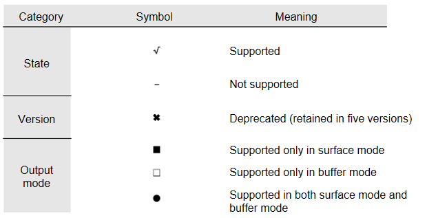
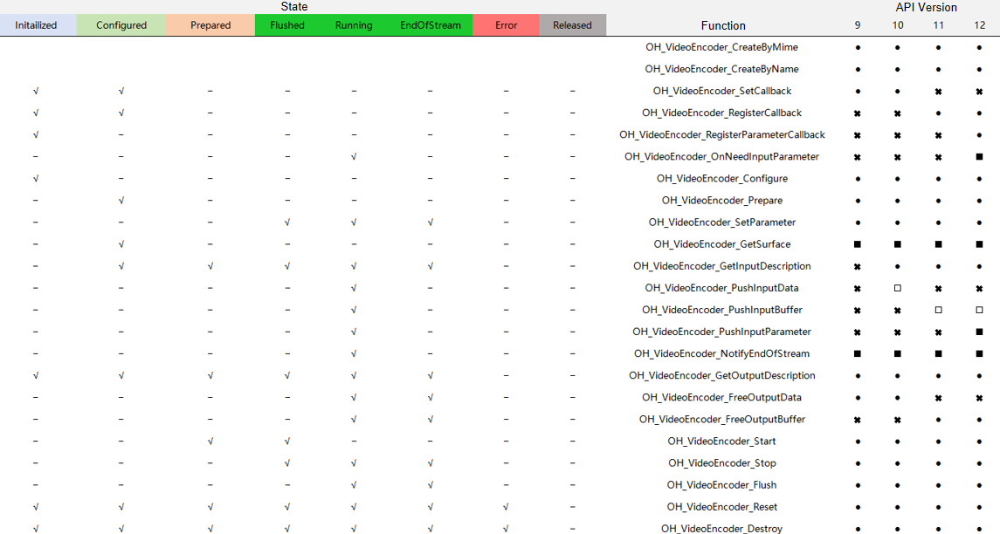

# VideoEncoder


## Overview

The VideoEncoder module provides the APIs for video encoding.

**System capability**: SystemCapability.Multimedia.VideoEncoder

**Since**: 9

The following figures show the APIs supported by each version and the APIs that can be called in different states.





## Summary


### Files

| Name| Description| 
| -------- | -------- |
| [native_avcodec_videoencoder.h](native__avcodec__videoencoder_8h.md) | Declares the APIs used for video encoding. |


### Types

| Name| Description| 
| -------- | -------- |
| typedef void(\* [OH_VideoEncoder_OnNeedInputParameter](#oh_videoencoder_onneedinputparameter)) ([OH_AVCodec](_codec_base.md#oh_avcodec) \*codec, uint32_t index, OH_AVFormat \*parameter, void \*userData) | Defines the pointer to the function that is called when new input parameters are required for a frame with the specified index. It takes effect only in surface mode. | 

### Enums

| Name| Description| 
| -------- | -------- |
| [OH_VideoEncodeBitrateMode](#oh_videoencodebitratemode) { CBR = 0, VBR = 1, CQ = 2 } | Enumerates the bit rate modes of a video encoder. | 


### Functions

| Name| Description| 
| -------- | -------- |
| [OH_AVCodec](_codec_base.md#oh_avcodec) \* [OH_VideoEncoder_CreateByMime](#oh_videoencoder_createbymime) (const char \*mime) | Creates a video encoder instance based on a Multipurpose Internet Mail Extension (MIME) type. This function is recommended. |
| [OH_AVCodec](_codec_base.md#oh_avcodec) \* [OH_VideoEncoder_CreateByName](#oh_videoencoder_createbyname) (const char \*name) | Creates a video encoder instance based on an encoder name. |
| [OH_AVErrCode](_core.md#oh_averrcode) [OH_VideoEncoder_Destroy](#oh_videoencoder_destroy) ([OH_AVCodec](_codec_base.md#oh_avcodec) \*codec) | Clears the internal resources of a video encoder and destroys the encoder instance. | 
| [OH_AVErrCode](_core.md#oh_averrcode) [OH_VideoEncoder_SetCallback](#oh_videoencoder_setcallback) ([OH_AVCodec](_codec_base.md#oh_avcodec) \*codec, [OH_AVCodecAsyncCallback](_o_h___a_v_codec_async_callback.md) callback, void \*userData) | Sets an OH_AVCodecCallback callback so that your application can respond to events generated by a video encoder. (This function is deprecated in API version 11.) |
| [OH_AVErrCode](_core.md#oh_averrcode) [OH_VideoEncoder_RegisterCallback](#oh_videoencoder_registercallback) ([OH_AVCodec](_codec_base.md#oh_avcodec) \*codec, [OH_AVCodecCallback](_o_h___a_v_codec_callback.md) callback, void \*userData) | Registers an OH_AVCodecCallback callback so that your application can respond to events generated by a video encoder. | 
| [OH_AVErrCode](_core.md#oh_averrcode) [OH_VideoEncoder_RegisterParameterCallback](#oh_videoencoder_registerparametercallback) ([OH_AVCodec](_codec_base.md#oh_avcodec) \*codec, [OH_VideoEncoder_OnNeedInputParameter](#oh_videoencoder_onneedinputparameter) onInputParameter, void \*userData) | Registers an OH_AVCodecCallback input parameter callback so that your application can respond to events generated by a video encoder. | 
| [OH_AVErrCode](_core.md#oh_averrcode) [OH_VideoEncoder_Configure](#oh_videoencoder_configure) ([OH_AVCodec](_codec_base.md#oh_avcodec) \*codec, OH_AVFormat \*format) | Configures a video encoder. Typically, you need to configure the description information about the video track to be encoded, such as the width, height, and pixel format. |
| [OH_AVErrCode](_core.md#oh_averrcode) [OH_VideoEncoder_Prepare](#oh_videoencoder_prepare) ([OH_AVCodec](_codec_base.md#oh_avcodec) \*codec) | Prepares internal resources for a video encoder. | 
| [OH_AVErrCode](_core.md#oh_averrcode) [OH_VideoEncoder_Start](#oh_videoencoder_start) ([OH_AVCodec](_codec_base.md#oh_avcodec) \*codec) | Starts a video encoder. This function should be called after a successful call of **OH_VideoEncoder_Prepare**. |
| [OH_AVErrCode](_core.md#oh_averrcode) [OH_VideoEncoder_Stop](#oh_videoencoder_stop) ([OH_AVCodec](_codec_base.md#oh_avcodec) \*codec) | Stops a video encoder and releases the input and output buffers. |
| [OH_AVErrCode](_core.md#oh_averrcode) [OH_VideoEncoder_Flush](#oh_videoencoder_flush) ([OH_AVCodec](_codec_base.md#oh_avcodec) \*codec) | Clears the input and output data and parameters, for example, H.264 PPS/SPS, cached in a video encoder. |
| [OH_AVErrCode](_core.md#oh_averrcode) [OH_VideoEncoder_Reset](#oh_videoencoder_reset) ([OH_AVCodec](_codec_base.md#oh_avcodec) \*codec) | Resets a video encoder. The encoder returns to the initial state. |
| OH_AVFormat \* [OH_VideoEncoder_GetOutputDescription](#oh_videoencoder_getoutputdescription) ([OH_AVCodec](_codec_base.md#oh_avcodec) \*codec) | Obtains the OH_AVFormat information about the output data of a video encoder. |
| [OH_AVErrCode](_core.md#oh_averrcode) [OH_VideoEncoder_SetParameter](#oh_videoencoder_setparameter) ([OH_AVCodec](_codec_base.md#oh_avcodec) \*codec, OH_AVFormat \*format) | Set the OH_AVFormat information when a video encoder is running. | 
| [OH_AVErrCode](_core.md#oh_averrcode) [OH_VideoEncoder_GetSurface](#oh_videoencoder_getsurface) ([OH_AVCodec](_codec_base.md#oh_avcodec) \*codec, [OHNativeWindow](_codec_base.md#ohnativewindow) \*\*window) | Obtains the input surface from a video encoder. |
| [OH_AVErrCode](_core.md#oh_averrcode) [OH_VideoEncoder_FreeOutputData](#oh_videoencoder_freeoutputdata) ([OH_AVCodec](_codec_base.md#oh_avcodec) \*codec, uint32_t index) | Frees an output buffer of a video encoder. (This function is deprecated in API version 11.)  |
| [OH_AVErrCode](_core.md#oh_averrcode) [OH_VideoEncoder_NotifyEndOfStream](#oh_videoencoder_notifyendofstream) ([OH_AVCodec](_codec_base.md#oh_avcodec) \*codec) | Notifies a video encoder that input streams end. | 
| [OH_AVErrCode](_core.md#oh_averrcode) [OH_VideoEncoder_PushInputData](#oh_videoencoder_pushinputdata) ([OH_AVCodec](_codec_base.md#oh_avcodec) \*codec, uint32_t index, [OH_AVCodecBufferAttr](_o_h___a_v_codec_buffer_attr.md) attr) | Pushes the input buffer filled with data to a video encoder. (This function is deprecated in API version 11.)  |
| [OH_AVErrCode](_core.md#oh_averrcode) [OH_VideoEncoder_PushInputBuffer](#oh_videoencoder_pushinputbuffer) ([OH_AVCodec](_codec_base.md#oh_avcodec) \*codec, uint32_t index) | Pushes the OH_AVBuffer corresponding to the index to a video encoder in buffer mode. |
| [OH_AVErrCode](_core.md#oh_averrcode) [OH_VideoEncoder_PushInputParameter](#oh_videoencoder_pushinputparameter) ([OH_AVCodec](_codec_base.md#oh_avcodec) \*codec, uint32_t index) | Pushes the parameter configured for a frame with the given index to a video encoder in surface mode. | 
| [OH_AVErrCode](_core.md#oh_averrcode) [OH_VideoEncoder_FreeOutputBuffer](#oh_videoencoder_freeoutputbuffer) ([OH_AVCodec](_codec_base.md#oh_avcodec) \*codec, uint32_t index) | Returns the processed OH_AVBuffer corresponding to the index to a video encoder. | 
| OH_AVFormat \* [OH_VideoEncoder_GetInputDescription](#oh_videoencoder_getinputdescription) ([OH_AVCodec](_codec_base.md#oh_avcodec) \*codec) | Obtains the description of the image received by a video encoder. |
| [OH_AVErrCode](_core.md#oh_averrcode) [OH_VideoEncoder_IsValid](#oh_videoencoder_isvalid) ([OH_AVCodec](_codec_base.md#oh_avcodec) \*codec, bool \*isValid) | Checks whether a video encoder instance is valid. | 


## Type Description

### OH_VideoEncoder_OnNeedInputParameter

```
typedef void(* OH_VideoEncoder_OnNeedInputParameter) (OH_AVCodec *codec, uint32_t index, OH_AVFormat *parameter, void *userData)
```

**Description**

Defines the pointer to the function that is called when new input parameters are required for a frame with the specified index.

This callback can be used only in surface mode after it is registered by calling OH_VideoEncoder_RegisterParameterCallback.

In buffer mode, OH_AVBuffer can directly carry the encoding parameter associated with each frame. Currently, it can manage parameters, including **QPMin**, **QPMax**, and reference frames for Long Term Reference (LTR), on a per-frame basis.

**System capability**: SystemCapability.Multimedia.Media.VideoEncoder

**Since**: 12

**Parameters**

| Name| Description| 
| -------- | -------- |
| codec | Pointer to a video encoder instance. | 
| index | Index of the frame to encode. | 
| parameter | Pointer to the encoding parameter | 
| userData | Pointer to the data on which the caller depends when executing the callback. |


## Enum Description


### OH_VideoEncodeBitrateMode

```
enum OH_VideoEncodeBitrateMode
```

**Description**

Enumerates the bit rate modes of a video encoder.

**System capability**: SystemCapability.Multimedia.Media.VideoEncoder

**Since**: 9

| Value| Description| 
| -------- | -------- |
| CBR  | Constant bit rate.  | 
| VBR  | Variable bit rate.  | 
| CQ  | Constant quality.  | 


## Function Description


### OH_VideoEncoder_Configure()

```
OH_AVErrCode OH_VideoEncoder_Configure (OH_AVCodec *codec, OH_AVFormat *format )
```

**Description**

Configures a video encoder. Typically, you need to configure the description information about the video track to be encoded, such as the width, height, and pixel format. This function must be called prior to **OH_VideoEncoder_Prepare**.

This function is used to verify the validity of configuration parameters. Some invalid parameters are not forcibly verified. The default values are used or discarded. Some invalid parameters are forcibly verified. The rules are as follows:

The value ranges of the following parameters can be obtained from [Capability Query](../../media/avcodec/obtain-supported-codecs.md). All the values of **OH_MD_KEY_I_FRAME_INTERVAL** are supported.

If the current platform does not support **OH_MD_KEY_VIDEO_ENCODER_ENABLE_TEMPORAL_SCALABILITY** or **OH_MD_KEY_VIDEO_ENCODER_LTR_FRAME_COUNT**, no error is reported and the normal encoding process is used.

Parameter verification rules are as follows:

| Key                                                                       | Value Within the Range| Value Out of Range| No Value Configured|
| ------------------------------------------------------------------------- | -------- | -------- | ------ |
| OH_MD_KEY_WIDTH                                                           | AV_ERR_OK       | AV_ERR_INVALID_VAL       | AV_ERR_INVALID_VAL     |
| OH_MD_KEY_HEIGHT                                                          | AV_ERR_OK       | AV_ERR_INVALID_VAL       | AV_ERR_INVALID_VAL     |
| OH_MD_KEY_PIXEL_FORMAT<br>For details, see [OH_AVPixelFormat](_core.md#oh_avpixelformat).| AV_ERR_OK       | AV_ERR_UNSUPPORT       | AV_ERR_OK    |
| OH_MD_KEY_FRAME_RATE                                                       | AV_ERR_OK       | AV_ERR_INVALID_VAL       |AV_ERR_OK        |
| OH_MD_KEY_PROFILE<br>For details, see [OH_MD_KEY_PROFILE](_codec_base.md#oh_md_key_profile).   | AV_ERR_OK       | AV_ERR_INVALID_VAL       |AV_ERR_OK       |
| OH_MD_KEY_I_FRAME_INTERVAL                                                 | AV_ERR_OK       | \\       | AV_ERR_OK       |

| OH_MD_KEY_<br>BITRATE | OH_MD_KEY_<br>QUALITY | OH_MD_KEY_<br>VIDEO_ENCODER_BITRATE_MODE | Return Value| Description                    |
| :-------------------- | :-------------------- | :--------------------------------------- | ---- | ---------------------- |
| \\                    | \\                    | \\                                       |  AV_ERR_OK    | The default value of the encoder is used.              |
| Out of range                 | Out of range                 | Unsupported mode                                  | AV_ERR_INVALID_VAL   | An error is reported for all abnormal values.                |
| Normal value                  | Normal value                  | \\                                       | AV_ERR_INVALID_VAL   | The bit rate conflicts with the quality.  |
| Normal value                  | \\                    | \\                                       | AV_ERR_OK     | The default bit rate control mode is enabled.              |
| Normal value                  | \\                    | VBR and CBR                                 | AV_ERR_OK     |                        |
| Normal value                  | \\                    | CQ                                       | AV_ERR_INVALID_VAL   | The bit rate conflicts with the CQ mode.     |
| \\                    | Normal value                  | \\                                       | AV_ERR_OK     | The CQ mode is enabled.              |
| \\                    | Normal value                  | CQ                                       | AV_ERR_OK     |                        |
| \\                    | Normal value                  | VBR and CBR                                 | AV_ERR_INVALID_VAL   | The quality conflicts with the VBR or CBR mode.|
| \\                    | \\                    | VBR and CBR                                 | AV_ERR_OK     | The default bit rate of the encoder is used.             |
| \\                    | \\                    | CQ                                       | AV_ERR_OK    | The default quality is used. |


**System capability**: SystemCapability.Multimedia.Media.VideoEncoder

**Since**: 9

**Parameters**

| Name| Description| 
| -------- | -------- |
| codec | Pointer to a video encoder instance. | 
| format | Pointer to an **OH_AVFormat** instance, which provides the description information about the video track to be encoded. | 

**Returns**

Returns any of the following result codes:

**AV_ERR_OK**: The operation is successful.

**AV_ERR_NO_MEMORY**: An internal exception occurs in the encoder instance, for example, a null pointer internally.

**AV_ERR_INVALID_VAL**:

    1. The value of **codec** is a null pointer or does not point to an encoder instance.
    2. The format is not supported.

**AV_ERR_UNKNOWN**: An unknown error occurs.

**AV_ERR_OPERATE_NOT_PERMIT**: An internal execution error occurs.

**AV_ERR_INVALID_STATE**: The function is not called prior to **OH_VideoEncoder_Prepare**.


### OH_VideoEncoder_CreateByMime()

```
OH_AVCodec* OH_VideoEncoder_CreateByMime (const char *mime)
```

**Description**

Creates a video encoder instance based on a MIME type. This function is recommended.

**System capability**: SystemCapability.Multimedia.Media.VideoEncoder

**Since**: 9

**Parameters**

| Name| Description| 
| -------- | -------- |
| mime | Pointer to a string that describes the MIME type. For details, see [AVCODEC_MIMETYPE](_codec_base.md#variables).| 

**Returns**

Returns the pointer to the video encoder instance created if the operation is successful; returns NULL if the encoder type is not supported or the memory is insufficient.


### OH_VideoEncoder_CreateByName()

```
OH_AVCodec* OH_VideoEncoder_CreateByName (const char *name)
```

**Description**

Creates a video encoder instance based on an encoder name. Tho use this function, you must know the exact name of the encoder. The encoder name can be obtained through capability query.

**System capability**: SystemCapability.Multimedia.Media.VideoEncoder

**Since**: 9

**Parameters**

| Name| Description| 
| -------- | -------- |
| name | Pointer to a video encoder name. | 

**Returns**

Returns the pointer to the video encoder instance created if the operation is successful; returns NULL if the encoder name is not supported or the memory is insufficient.


### OH_VideoEncoder_Destroy()

```
OH_AVErrCode OH_VideoEncoder_Destroy (OH_AVCodec *codec)
```

**Description**

Clears the internal resources of a video encoder and destroys the encoder instance. You only need to call the function once.

**System capability**: SystemCapability.Multimedia.Media.VideoEncoder

**Since**: 9

**Parameters**

| Name| Description| 
| -------- | -------- |
| codec | Pointer to a video encoder instance. | 

**Returns**

Returns any of the following result codes:

**AV_ERR_OK**: The operation is successful.

**AV_ERR_NO_MEMORY**: An internal exception occurs in the encoder instance, for example, a null pointer internally.

**AV_ERR_INVALID_VAL**: The value of **codec** is a null pointer or does not point to an encoder instance.

**AV_ERR_UNKNOWN**: An unknown error occurs.

**AV_ERR_OPERATE_NOT_PERMIT**: An internal execution error occurs.


### OH_VideoEncoder_Flush()

```
OH_AVErrCode OH_VideoEncoder_Flush (OH_AVCodec *codec)
```

**Description**

Clears the input and output data and parameters, for example, H.264 PPS/SPS, cached in a video encoder.

This function invalidates the indexes of all buffers previously reported through the asynchronous callback. Therefore, before calling this function, ensure that the buffers with the specified indexes are no longer required. This function cannot be called consecutively.

**System capability**: SystemCapability.Multimedia.Media.VideoEncoder

**Since**: 9

**Parameters**

| Name| Description| 
| -------- | -------- |
| codec | Pointer to a video encoder instance. | 

**Returns**

Returns any of the following result codes:

**AV_ERR_OK**: The operation is successful.

**AV_ERR_NO_MEMORY**: An internal exception occurs in the encoder instance, for example, a null pointer internally.

**AV_ERR_INVALID_VAL**: The value of **codec** is a null pointer or does not point to an encoder instance.

**AV_ERR_UNKNOWN**: An unknown error occurs.

**AV_ERR_OPERATE_NOT_PERMIT**: An internal execution error occurs.

**AV_ERR_INVALID_STATE**: The function is called in an incorrect state.


### OH_VideoEncoder_FreeOutputBuffer()

```
OH_AVErrCode OH_VideoEncoder_FreeOutputBuffer (OH_AVCodec *codec, uint32_t index )
```

**Description**

Returns the processed OH_AVBuffer corresponding to the index to a video encoder. You need to call this function to release the output buffer in a timely manner. Otherwise, the encoding process is blocked.

**System capability**: SystemCapability.Multimedia.Media.VideoEncoder

**Since**: 11

**Parameters**

| Name| Description| 
| -------- | -------- |
| codec | Pointer to a video encoder instance. | 
| index | Index of the output buffer. The index is obtained from [OH_AVCodecOnNewOutputBuffer](_codec_base.md#oh_avcodeconnewoutputbuffer).|

**Returns**

Returns any of the following result codes:

**AV_ERR_OK**: The operation is successful.

**AV_ERR_NO_MEMORY**: An internal exception occurs in the encoder instance, for example, a null pointer internally.

**AV_ERR_INVALID_VAL**:

    1. The value of **codec** is a null pointer or does not point to an encoder instance.
    2. The format is not supported.
    3. The index is invalid or the same index is used consecutively. This error does not affect the subsequent encoding process.

**AV_ERR_UNKNOWN**: An unknown error occurs.

**AV_ERR_OPERATE_NOT_PERMIT**: An internal execution error occurs.

**AV_ERR_INVALID_STATE**: The function is called in an incorrect state.


### OH_VideoEncoder_GetInputDescription()

```
OH_AVFormat* OH_VideoEncoder_GetInputDescription (OH_AVCodec *codec)
```

**Description**

Obtains the description of the image received by a video encoder. This function must be called after [OH_VideoEncoder_Configure](#oh_videoencoder_configure) is called.

The caller must call [OH_AVFormat_Destroy](_core.md#oh_avformat_destroy) to manually release the **OH_AVFormat** instance in the return value.

**System capability**: SystemCapability.Multimedia.Media.VideoEncoder

**Since**: 10

**Parameters**

| Name| Description| 
| -------- | -------- |
| codec | Pointer to a video encoder instance. | 

**Returns**

Returns the pointer to an **OH_AVFormat** instance if the operation is successful; returns NULL if the value of **codec** is a null pointer or does not point to an encoder instance.


### OH_VideoEncoder_GetOutputDescription()

```
OH_AVFormat* OH_VideoEncoder_GetOutputDescription (OH_AVCodec *codec)
```

**Description**

Obtains the OH_AVFormat information about the output data of a video encoder.

The caller must call **OH_AVFormat_Destroy()** to release the **OH_AVFormat** instance in the return value.

**System capability**: SystemCapability.Multimedia.Media.VideoEncoder

**Since**: 9

**Parameters**

| Name| Description| 
| -------- | -------- |
| codec | Pointer to a video encoder instance. | 

**Returns**

Returns the pointer to an **OH_AVFormat** instance if the operation is successful; returns NULL if the value of **codec** is a null pointer or does not point to an encoder instance.


### OH_VideoEncoder_GetSurface()

```
OH_AVErrCode OH_VideoEncoder_GetSurface (OH_AVCodec *codec, OHNativeWindow ** window )
```

**Description**

Sets an input surface for a video encoder. This function must be called prior to **OH_VideoEncoder_Prepare**.

**System capability**: SystemCapability.Multimedia.Media.VideoEncoder

**Since**: 9

**Parameters**

| Name| Description| 
| -------- | -------- |
| codec | Pointer to a video encoder instance. | 
| window | Pointer to an **OHNativeWindow** instance. For details, see [OHNativeWindow](_codec_base.md#ohnativewindow). The application manages the lifecycle of the window and calls **OH_NativeWindow_DestroyNativeWindow** to release the window when the lifecycle ends. | 

**Returns**

Returns any of the following result codes:

**AV_ERR_OK**: The operation is successful.

**AV_ERR_INVALID_VAL**: The value of **codec** is a null pointer or does not point to an encoder instance.

**AV_ERR_OPERATE_NOT_PERMIT**: An internal execution error occurs.


### OH_VideoEncoder_IsValid()

```
OH_AVErrCode OH_VideoEncoder_IsValid (OH_AVCodec *codec, bool *isValid )
```

**Description**

Checks whether a video encoder instance is valid.

**System capability**: SystemCapability.Multimedia.Media.VideoEncoder

**Since**: 10

**Parameters**

| Name| Description| 
| -------- | -------- |
| codec | Pointer to a video encoder instance. | 
| isValid | Pointer of the Boolean type. The value **true** means that the encoder instance is valid and **false** means the opposite. It is recommended that the caller initialize **isValid** to **false**. |

**Returns**

Returns either of the following result codes:

**AV_ERR_OK**: The operation is successful.

**AV_ERR_INVALID_VAL**: The value of **codec** is a null pointer or does not point to an encoder instance.


### OH_VideoEncoder_NotifyEndOfStream()

```
OH_AVErrCode OH_VideoEncoder_NotifyEndOfStream (OH_AVCodec *codec)
```

**Description**

Notifies a video encoder that input streams end. You are advised to use this function for notification. This function is used only in surface mode. In buffer mode, OH_AVBuffer is used to carry the EOS information to notify the end of the input stream.

**System capability**: SystemCapability.Multimedia.Media.VideoEncoder

**Since**: 9

**Parameters**

| Name| Description| 
| -------- | -------- |
| codec | Pointer to a video encoder instance. | 

**Returns**

Returns any of the following result codes:

**AV_ERR_OK**: The operation is successful.

**AV_ERR_NO_MEMORY**: An internal exception occurs in the encoder instance, for example, a null pointer internally.

**AV_ERR_INVALID_VAL**: The value of **codec** is a null pointer or does not point to an encoder instance.

**AV_ERR_UNKNOWN**: An unknown error occurs.

**AV_ERR_OPERATE_NOT_PERMIT**: An internal execution error occurs.

**AV_ERR_INVALID_STATE**: The function is called in an incorrect state.


### OH_VideoEncoder_Prepare()

```
OH_AVErrCode OH_VideoEncoder_Prepare (OH_AVCodec *codec)
```

**Description**

Prepares internal resources for a video encoder. This function must be called after **OH_VideoEncoder_Configure**.

**System capability**: SystemCapability.Multimedia.Media.VideoEncoder

**Since**: 9

**Parameters**

| Name| Description| 
| -------- | -------- |
| codec | Pointer to a video encoder instance. | 

**Returns**

Returns any of the following result codes:

**AV_ERR_OK**: The operation is successful.

**AV_ERR_INVALID_VAL**: The value of **codec** is a null pointer or does not point to an encoder instance.

**AV_ERR_OPERATE_NOT_PERMIT**: An internal execution error occurs.


### OH_VideoEncoder_PushInputBuffer()

```
OH_AVErrCode OH_VideoEncoder_PushInputBuffer (OH_AVCodec *codec, uint32_t index )
```

**Description**

Pushes the OH_AVBuffer corresponding to the index to a video encoder in buffer mode.

**System capability**: SystemCapability.Multimedia.Media.VideoEncoder

**Since**: 11

**Parameters**

| Name| Description| 
| -------- | -------- |
| codec | Pointer to a video encoder instance. | 
| index | Index of the input buffer. The index is obtained from [OH_AVCodecOnNeedInputBuffer](_codec_base.md#oh_avcodeconneedinputbuffer).| 

**Returns**

Returns any of the following result codes:

**AV_ERR_OK**: The operation is successful.

**AV_ERR_NO_MEMORY**: An internal exception occurs in the encoder instance, for example, a null pointer internally.

**AV_ERR_INVALID_VAL**:

    1. The value of **codec** is a null pointer or does not point to an encoder instance.
    2. The format is not supported.

**AV_ERR_UNKNOWN**: An unknown error occurs.

**AV_ERR_OPERATE_NOT_PERMIT**: An internal execution error occurs.

**AV_ERR_INVALID_STATE**: The function is called in an incorrect state.


### OH_VideoEncoder_PushInputParameter()

```
OH_AVErrCode OH_VideoEncoder_PushInputParameter (OH_AVCodec *codec, uint32_t index)
```

**Description**

Pushes the parameter configured for a frame with the given index to a video encoder in surface mode.

**System capability**: SystemCapability.Multimedia.Media.VideoEncoder

**Since**: 12

**Parameters**

| Name| Description| 
| -------- | -------- |
| codec | Pointer to a video encoder instance. | 
| index | Index of the input parameter buffer. The index is obtained from [OH_VideoEncoder_OnNeedInputParameter](#oh_videoencoder_onneedinputparameter). | 

**Returns**

Returns any of the following result codes:

**AV_ERR_OK**: The operation is successful.

**AV_ERR_NO_MEMORY**: An internal exception occurs in the encoder instance, for example, a null pointer internally.

**AV_ERR_INVALID_VAL**: The value of **codec** is a null pointer or does not point to an encoder instance.

**AV_ERR_UNKNOWN**: An unknown error occurs.

**AV_ERR_OPERATE_NOT_PERMIT**: An internal execution error occurs.

**AV_ERR_INVALID_STATE**: The function is called in an incorrect state.


### OH_VideoEncoder_RegisterCallback()

```
OH_AVErrCode OH_VideoEncoder_RegisterCallback (OH_AVCodec *codec, OH_AVCodecCallback callback, void *userData )
```

**Description**

Registers an OH_AVCodecCallback callback so that your application can respond to events generated by a video encoder. This function must be called prior to **OH_VideoEncoder_Prepare**.

**System capability**: SystemCapability.Multimedia.Media.VideoEncoder

**Since**: 11

**Parameters**

| Name| Description| 
| -------- | -------- |
| codec | Pointer to a video encoder instance. | 
| callback | Callback function to set. For details, see [OH_AVCodecCallback](_o_h___a_v_codec_callback.md). | 
| userData | Pointer to the data on which the caller depends when executing the callback. | 

**Returns**

Returns any of the following result codes:

**AV_ERR_OK**: The operation is successful.

**AV_ERR_NO_MEMORY**: An internal exception occurs in the encoder instance, for example, a null pointer internally.

**AV_ERR_INVALID_VAL**: The value of **codec** is a null pointer or does not point to an encoder instance.

**AV_ERR_UNKNOWN**: An unknown error occurs.

**AV_ERR_OPERATE_NOT_PERMIT**: An internal execution error occurs.

**AV_ERR_INVALID_STATE**: The function is not called prior to **OH_VideoEncoder_Prepare**.


### OH_VideoEncoder_RegisterParameterCallback()

```
OH_AVErrCode OH_VideoEncoder_RegisterParameterCallback (OH_AVCodec *codec, OH_VideoEncoder_OnNeedInputParameter onInputParameter, void *userData)
```

**Description**

Registers an OH_AVCodecCallback input parameter callback so that your application can respond to events generated by a video encoder. In surface encoding mode, this function must be called when frame parameters need to be set, and it must be called before [OH_VideoEncoder_Configure](#oh_videoencoder_configure).

**System capability**: SystemCapability.Multimedia.Media.VideoEncoder

**Since**: 12

**Parameters**

| Name| Description| 
| -------- | -------- |
| codec | Pointer to a video encoder instance. | 
| onInputParameter | Pointer to the input parameter callback. For details, see [OH_VideoEncoder_OnNeedInputParameter](#oh_videoencoder_onneedinputparameter). | 
| userData | Pointer to the data on which the caller depends when executing the callback. |

**Returns**

Returns any of the following result codes:

**AV_ERR_OK**: The operation is successful.

**AV_ERR_NO_MEMORY**: An internal exception occurs in the encoder instance, for example, a null pointer internally.

**AV_ERR_INVALID_VAL**: The value of **codec** is a null pointer or does not point to an encoder instance.

**AV_ERR_UNKNOWN**: An unknown error occurs.

**AV_ERR_OPERATE_NOT_PERMIT**: An internal execution error occurs.

**AV_ERR_INVALID_STATE**: The function is not called prior to **OH_VideoEncoder_Prepare**.


### OH_VideoEncoder_Reset()

```
OH_AVErrCode OH_VideoEncoder_Reset (OH_AVCodec *codec)
```

**Description**

Resets a video encoder. The encoder returns to the initial state. To continue encoding, you must call **OH_VideoEncoder_Configure** to configure the encoder again.

**System capability**: SystemCapability.Multimedia.Media.VideoEncoder

**Since**: 9

**Parameters**

| Name| Description| 
| -------- | -------- |
| codec | Pointer to a video encoder instance. | 

**Returns**

Returns any of the following result codes:

**AV_ERR_OK**: The operation is successful.

**AV_ERR_NO_MEMORY**: An internal exception occurs in the encoder instance, for example, a null pointer internally.

**AV_ERR_INVALID_VAL**: The value of **codec** is a null pointer or does not point to an encoder instance.

**AV_ERR_UNKNOWN**: An unknown error occurs.

**AV_ERR_OPERATE_NOT_PERMIT**: An internal execution error occurs.


### OH_VideoEncoder_SetParameter()

```
OH_AVErrCode OH_VideoEncoder_SetParameter (OH_AVCodec *codec, OH_AVFormat *format )
```

**Description**

Set the OH_AVFormat information when a video encoder is running.

This function can be called only after the encoder is started. Incorrect parameter settings may cause encoding failure.

**System capability**: SystemCapability.Multimedia.Media.VideoEncoder

**Since**: 9

**Parameters**

| Name| Description| 
| -------- | -------- |
| codec | Pointer to a video encoder instance. | 
| format | Pointer to an **OH_AVFormat** instance. | 

**Returns**

Returns any of the following result codes:

**AV_ERR_OK**: The operation is successful.

**AV_ERR_NO_MEMORY**: An internal exception occurs in the encoder instance, for example, a null pointer internally.

**AV_ERR_INVALID_VAL**:

    1. The value of **codec** is a null pointer or does not point to an encoder instance.
    2. The format is not supported.

**AV_ERR_UNKNOWN**: An unknown error occurs.

**AV_ERR_OPERATE_NOT_PERMIT**: An internal execution error occurs.

**AV_ERR_INVALID_STATE**: The function is called in an incorrect state.


### OH_VideoEncoder_Start()

```
OH_AVErrCode OH_VideoEncoder_Start (OH_AVCodec *codec)
```

**Description**

Starts a video encoder. This function should be called after a successful call of **OH_VideoEncoder_Prepare**. After being started, the encoder starts to report the registered event.

In surface mode, when there is a correct input on the surface, **OnNewOutputBuffer** is triggered each time a frame is encoded.

In buffer mode, the encoder immediately triggers the input callback. Each time the caller completes an input, the encoder performs encoding. **OnNewOutputBuffer** is triggered each time a frame is encoded.

**System capability**: SystemCapability.Multimedia.Media.VideoEncoder

**Since**: 9

**Parameters**

| Name| Description| 
| -------- | -------- |
| codec | Pointer to a video encoder instance. | 

**Returns**

Returns any of the following result codes:

**AV_ERR_OK**: The operation is successful.

**AV_ERR_NO_MEMORY**: An internal exception occurs in the encoder instance, for example, a null pointer internally.

**AV_ERR_INVALID_VAL**: The value of **codec** is a null pointer or does not point to an encoder instance.

**AV_ERR_UNKNOWN**: An unknown error occurs.

**AV_ERR_OPERATE_NOT_PERMIT**: An internal execution error occurs.

**AV_ERR_INVALID_STATE**: The function is called in an incorrect state.


### OH_VideoEncoder_Stop()

```
OH_AVErrCode OH_VideoEncoder_Stop (OH_AVCodec *codec)
```

**Description**

Stops a video encoder and releases the input and output buffers. After the video encoder is stopped, you can call **OH_VideoEncoder_Start** to enter the running state again.

**System capability**: SystemCapability.Multimedia.Media.VideoEncoder

**Since**: 9

**Parameters**

| Name| Description| 
| -------- | -------- |
| codec | Pointer to a video encoder instance. | 

**Returns**

Returns any of the following result codes:

**AV_ERR_OK**: The operation is successful.

**AV_ERR_NO_MEMORY**: An internal exception occurs in the encoder instance, for example, a null pointer internally.

**AV_ERR_INVALID_VAL**: The value of **codec** is a null pointer or does not point to an encoder instance.

**AV_ERR_UNKNOWN**: An unknown error occurs.

**AV_ERR_OPERATE_NOT_PERMIT**: An internal execution error occurs.

**AV_ERR_INVALID_STATE**: The function is called in an incorrect state.


## Description of Deprecated Functions


### OH_VideoEncoder_SetCallback()

```
OH_AVErrCode OH_VideoEncoder_SetCallback (OH_AVCodec *codec, OH_AVCodecAsyncCallback callback, void *userData )
```

**Description**

Sets an OH_AVCodecCallback callback so that your application can respond to events generated by a video encoder. This function must be called prior to **OH_VideoEncoder_Prepare**.

**System capability**: SystemCapability.Multimedia.Media.VideoEncoder

**Since**: 9

**Deprecated from**: 11

**Substitute API**: [OH_VideoEncoder_RegisterCallback](#oh_videoencoder_registercallback)

**Parameters**

| Name| Description| 
| -------- | -------- |
| codec | Pointer to a video encoder instance. | 
| callback | Callback function to set. For details, see [OH_AVCodecAsyncCallback](_o_h___a_v_codec_async_callback.md). | 
| userData | Pointer to the data on which the caller depends when executing the callback. |

**Returns**

Returns any of the following result codes:

**AV_ERR_OK**: The operation is successful.

**AV_ERR_NO_MEMORY**: An internal exception occurs in the encoder instance, for example, a null pointer internally.

**AV_ERR_INVALID_VAL**: The value of **codec** is a null pointer or does not point to an encoder instance.

**AV_ERR_UNKNOWN**: An unknown error occurs.

**AV_ERR_OPERATE_NOT_PERMIT**: An internal execution error occurs.

**AV_ERR_INVALID_STATE**: The function is not called prior to **OH_VideoEncoder_Prepare**.


### OH_VideoEncoder_PushInputData()

```
OH_AVErrCode OH_VideoEncoder_PushInputData (OH_AVCodec *codec, uint32_t index, OH_AVCodecBufferAttr attr )
```

**Description**

Pushes the input buffer filled with data to a video encoder.

**System capability**: SystemCapability.Multimedia.Media.VideoEncoder

**Since**: 10

**Deprecated from**: 11

**Substitute API**: [OH_VideoEncoder_PushInputBuffer](#oh_videoencoder_pushinputbuffer)

**Parameters**

| Name| Description| 
| -------- | -------- |
| codec | Pointer to a video encoder instance. | 
| index | Index of the input buffer. The index is obtained from [OH_AVCodecOnNeedInputData](_codec_base.md#oh_avcodeconneedinputdata). | 
| attr | Description of the data contained in the buffer. | 

**Returns**

Returns any of the following result codes:

**AV_ERR_OK**: The operation is successful.

**AV_ERR_NO_MEMORY**: An internal exception occurs in the encoder instance, for example, a null pointer internally.

**AV_ERR_INVALID_VAL**: The value of **codec** is a null pointer or does not point to an encoder instance.

**AV_ERR_UNKNOWN**: An unknown error occurs.

**AV_ERR_OPERATE_NOT_PERMIT**: An internal execution error occurs.

**AV_ERR_INVALID_STATE**: The function is called in an incorrect state.


### OH_VideoEncoder_FreeOutputData()

```
OH_AVErrCode OH_VideoEncoder_FreeOutputData (OH_AVCodec *codec, uint32_t index )
```

**Description**

Frees an output buffer of a video encoder.

**System capability**: SystemCapability.Multimedia.Media.VideoEncoder

**Since**: 9

**Deprecated from**: 11

Substitute API: [OH_VideoEncoder_FreeOutputBuffer](#oh_videoencoder_freeoutputbuffer)

**Parameters**

| Name| Description| 
| -------- | -------- |
| codec | Pointer to a video encoder instance. | 
| index | Index of the output buffer. The index is obtained from [OH_AVCodecOnNewOutputData](_codec_base.md#oh_avcodeconnewoutputdata). | 

**Returns**

Returns any of the following result codes:

**AV_ERR_OK**: The operation is successful.

**AV_ERR_NO_MEMORY**: An internal exception occurs in the encoder instance, for example, a null pointer internally.

**AV_ERR_INVALID_VAL**: The value of **codec** is a null pointer or does not point to an encoder instance.

**AV_ERR_UNKNOWN**: An unknown error occurs.

**AV_ERR_OPERATE_NOT_PERMIT**: An internal execution error occurs.

**AV_ERR_INVALID_STATE**: The function is called in an incorrect state.
