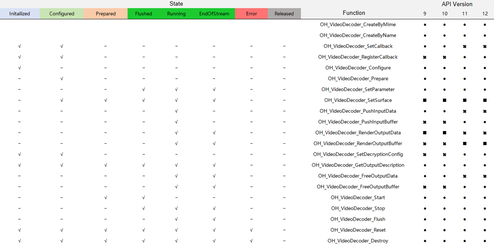

# native_avcodec_videodecoder.h
<!--Kit: AVCodec Kit-->
<!--Subsystem: Multimedia-->
<!--Owner: @zhanghongran-->
<!--Designer: @dpy2650--->
<!--Tester: @cyakee-->
<!--Adviser: @zengyawen-->

## Overview

The file declares the native APIs used for video decoding.

**File to include**: <multimedia/player_framework/native_avcodec_videodecoder.h>

**Library**: libnative_media_vdec.so

**System capability**: SystemCapability.Multimedia.Media.VideoDecoder

**Since**: 9

**Related module**: [VideoDecoder](capi-videodecoder.md)

**Sample**: [AVCodec](https://gitcode.com/openharmony/applications_app_samples/tree/master/code/BasicFeature/Media/AVCodec)

The following figures show the APIs supported by each version and the APIs that can be called in different states.




## Summary

### Structs

| Name| typedef Keyword| Description|
| -- | -- | -- |
| [MediaKeySession](capi-videodecoder-mediakeysession.md) | MediaKeySession | Describes a native object for MediaKeySession.|

### Functions

| Name| Description|
| -- | -- |
| [OH_AVCodec *OH_VideoDecoder_CreateByMime(const char *mime)](#oh_videodecoder_createbymime) | Creates a video decoder instance based on a MIME type. This function is recommended in most cases.|
| [OH_AVCodec *OH_VideoDecoder_CreateByName(const char *name)](#oh_videodecoder_createbyname) | Creates a video decoder instance based on a decoder name. To use this function, you must know the exact name of the decoder. The decoder name can be obtained through capability query.|
| [OH_AVErrCode OH_VideoDecoder_Destroy(OH_AVCodec *codec)](#oh_videodecoder_destroy) | Clears the internal resources of a video decoder and destroys the decoder instance. You only need to call the function once.|
| [OH_AVErrCode OH_VideoDecoder_SetCallback(OH_AVCodec *codec, OH_AVCodecAsyncCallback callback, void *userData)](#oh_videodecoder_setcallback) | Sets an asynchronous callback so that your application can respond to events generated by a video decoder. This function must be called prior to **OH_VideoDecoder_Prepare**.|
| [OH_AVErrCode OH_VideoDecoder_RegisterCallback(OH_AVCodec *codec, OH_AVCodecCallback callback, void *userData)](#oh_videodecoder_registercallback) | Registers an asynchronous callback so that your application can respond to events generated by a video decoder. This function must be called prior to **OH_VideoDecoder_Prepare**.|
| [OH_AVErrCode OH_VideoDecoder_SetSurface(OH_AVCodec *codec, OHNativeWindow *window)](#oh_videodecoder_setsurface) | Sets an output surface for a video decoder. In the initialization phase, this function must be called prior to **OH_VideoDecoder_Prepare**. In the running state, it can be called directly.|
| [OH_AVErrCode OH_VideoDecoder_Configure(OH_AVCodec *codec, OH_AVFormat *format)](#oh_videodecoder_configure) | Configures a video decoder. Typically, you need to configure the video description information that can be extracted from OH_AVSource. This function must be called prior to **OH_VideoDecoder_Prepare**.|
| [OH_AVErrCode OH_VideoDecoder_Prepare(OH_AVCodec *codec)](#oh_videodecoder_prepare) | Prepares internal resources for a video decoder. This function must be called after **OH_VideoDecoder_Configure**.|
| [OH_AVErrCode OH_VideoDecoder_Start(OH_AVCodec *codec)](#oh_videodecoder_start) | Starts a video decoder. This function should be called after a successful call of [OH_VideoDecoder_Prepare](#oh_videodecoder_prepare). After being started, the decoder starts to report the registered event.|
| [OH_AVErrCode OH_VideoDecoder_Stop(OH_AVCodec *codec)](#oh_videodecoder_stop) | Stops a video decoder and releases the input and output buffers. After the video decoder is stopped, you can call **OH_VideoDecoder_Start** to enter the executing state again. If you have passed codec-specific data in the previous **Start** for the decoder, you must pass it again.|
| [OH_AVErrCode OH_VideoDecoder_Flush(OH_AVCodec *codec)](#oh_videodecoder_flush) | Clears the input and output data and parameters, for example, H.264 PPS/SPS, cached in a video decoder. This function invalidates the indexes of all buffers previously reported through the asynchronous callback. Therefore, before calling this function, ensure that the buffers with the specified indexes are no longer required.|
| [OH_AVErrCode OH_VideoDecoder_Reset(OH_AVCodec *codec)](#oh_videodecoder_reset) | Resets a video decoder. The decoder returns to the initial state. To continue decoding, you must call **OH_VideoDecoder_Configure** to configure the decoder again.|
| [OH_AVFormat *OH_VideoDecoder_GetOutputDescription(OH_AVCodec *codec)](#oh_videodecoder_getoutputdescription) | Obtains the OH_AVFormat information about the output data of a video decoder. For details, see [OH_AVFormat](capi-core-oh-avformat.md). You must call **OH_AVFormat_Destroy** to release the OH_AVFormat instance when its lifecycle ends.|
| [OH_AVErrCode OH_VideoDecoder_SetParameter(OH_AVCodec *codec, OH_AVFormat *format)](#oh_videodecoder_setparameter) | Sets dynamic parameters for a video decoder. This function can be called only after the decoder is started. Incorrect parameter settings may cause decoding failure.|
| [OH_AVErrCode OH_VideoDecoder_PushInputData(OH_AVCodec *codec, uint32_t index, OH_AVCodecBufferAttr attr)](#oh_videodecoder_pushinputdata) | Pushes the input buffer filled with data to a video decoder. The input callback reports the available input buffer and the index. For details, see **OH_AVCodecOnNeedInputData**. After being pushed to the decoder, a buffer is not accessible until the buffer with the same index is reported again through the input callback. In addition, some decoders require the input of codec-specific data, such as PPS/SPS data in H.264 format, to initialize the decoding process.|
| [OH_AVErrCode OH_VideoDecoder_RenderOutputData(OH_AVCodec *codec, uint32_t index)](#oh_videodecoder_renderoutputdata) | Frees an output buffer of a video decoder and instructs the decoder to render the decoded data in the buffer on the output surface. If no output surface is configured, calling this function only frees the output buffer.|
| [OH_AVErrCode OH_VideoDecoder_FreeOutputData(OH_AVCodec *codec, uint32_t index)](#oh_videodecoder_freeoutputdata) | Frees an output buffer of a video decoder.|
| [OH_AVErrCode OH_VideoDecoder_PushInputBuffer(OH_AVCodec *codec, uint32_t index)](#oh_videodecoder_pushinputbuffer) | Notifies a video decoder that the buffer corresponding to the index has been filled with input data. The input callback reports the available input buffer and the index. For details, see **OH_AVCodecOnNeedInputBuffer**. After being pushed to the decoder, a buffer is not accessible until the buffer with the same index is reported again through the input callback. In addition, some decoders require the input of codec-specific data, such as PPS/SPS data in H.264 format, to initialize the decoding process. This function is used to transfer the parameters (such as H.264 PPS/SPS) required for decoding to the decoder. The parameters can be transferred to the decoder separately or together with the data to be decoded.|
| [OH_AVErrCode OH_VideoDecoder_RenderOutputBuffer(OH_AVCodec *codec, uint32_t index)](#oh_videodecoder_renderoutputbuffer) | Returns the output buffer corresponding to the index to a video decoder. The buffer carries the decoded data and is used to instruct the decoder to finish rendering on the output surface. If no output surface is configured, calling this function only frees the output buffer.|
| [OH_AVErrCode OH_VideoDecoder_RenderOutputBufferAtTime(OH_AVCodec *codec, uint32_t index, int64_t renderTimestampNs)](#oh_videodecoder_renderoutputbufferattime) | Returns the output buffer corresponding to the index to a video decoder. The buffer carries the decoded data and is used to instruct the decoder to finish rendering within the specified duration on the output surface. If no output surface is configured, calling this function only frees the output buffer. You can request the system to render the buffer at a specific time (after the VSYNC or buffer timestamp) based on the timestamp. To render the buffer at the specified timestamp, that timestamp should approximate the current system time within an acceptable margin of error. Pay attention to the following: 1. Buffers are processed sequentially, which may result in the display of subsequent buffers on the surface being blocked. This is particularly important for interactive scenarios, such as responding to user actions like stopping, fast-forwarding, or rewinding a video.2. If multiple buffers are sent to the surface for rendering on a single VSYNC event, the last buffer is rendered and other buffers are discarded.3. If the difference between the timestamp and the current system time exceeds the acceptable margin of error, the surface ignores the timestamp and renders the buffer at the earliest feasible time. In this case, no frames are discarded.|
| [OH_AVErrCode OH_VideoDecoder_FreeOutputBuffer(OH_AVCodec *codec, uint32_t index)](#oh_videodecoder_freeoutputbuffer) | Frees an output buffer of a video decoder. You need to call this function to release the output buffer in a timely manner. Otherwise, the decoding process is blocked.|
| [OH_AVErrCode OH_VideoDecoder_IsValid(OH_AVCodec *codec, bool *isValid)](#oh_videodecoder_isvalid) | Checks whether a video decoder instance is valid.|
| [OH_AVErrCode OH_VideoDecoder_SetDecryptionConfig(OH_AVCodec *codec, MediaKeySession *mediaKeySession,bool secureVideoPath)](#oh_videodecoder_setdecryptionconfig) | Sets the decryption configuration. This function can be called prior to **OH_VideoDecoder_Prepare**.|
| [OH_AVErrCode OH_VideoDecoder_QueryInputBuffer(struct OH_AVCodec *codec, uint32_t *index, int64_t timeoutUs)](#oh_videodecoder_queryinputbuffer) | Obtains the index of the next available input buffer. After calling this function, you must call [OH_VideoDecoder_GetInputBuffer](#oh_videodecoder_getinputbuffer) to obtain the buffer instance and call [OH_VideoDecoder_PushInputBuffer](#oh_videodecoder_pushinputbuffer) to pass the buffer instance to the decoder.<br> Note that the preceding operations are supported only in synchronous mode.|
| [OH_AVBuffer *OH_VideoDecoder_GetInputBuffer(struct OH_AVCodec *codec, uint32_t index)](#oh_videodecoder_getinputbuffer) | Obtains the instance of the available input buffer. Note that this function works only in synchronous mode.|
| [OH_AVErrCode OH_VideoDecoder_QueryOutputBuffer(struct OH_AVCodec *codec, uint32_t *index, int64_t timeoutUs)](#oh_videodecoder_queryoutputbuffer) | Obtains the index of the next available output buffer. You can perform the following operations to display or release the decoded frame of the buffer instance obtained through [OH_VideoDecoder_GetOutputBuffer](#oh_videodecoder_getoutputbuffer):<br> 1. Return the processed output buffer to the decoder by calling [OH_VideoDecoder_FreeOutputBuffer](#oh_videodecoder_freeoutputbuffer).<br> 2. Render the output surface by calling [OH_VideoDecoder_RenderOutputBuffer](#oh_videodecoder_renderoutputbuffer).<br> 3. Render the output surface within the specified time by calling [OH_VideoDecoder_RenderOutputBufferAtTime](#oh_videodecoder_renderoutputbufferattime).<br> Note that the preceding operations are supported only in synchronous mode.|
| [OH_AVBuffer *OH_VideoDecoder_GetOutputBuffer(struct OH_AVCodec *codec, uint32_t index)](#oh_videodecoder_getoutputbuffer) | Obtains the instance of the available output buffer. Note that this function works only in synchronous mode.|

## Function Description

### OH_VideoDecoder_CreateByMime()

```
OH_AVCodec *OH_VideoDecoder_CreateByMime(const char *mime)
```

**Description**

Creates a video decoder instance based on a MIME type. This function is recommended in most cases.

**System capability**: SystemCapability.Multimedia.Media.VideoDecoder

**Since**: 9


**Parameters**

| Name| Description|
| -- | -- |
| const char *mime | Pointer to a string that describes the MIME type. For details, see [AVCODEC_MIME_TYPE](capi-native-avcodec-base-h.md#variables).|

**Returns**

| Type| Description|
| -- | -- |
| [OH_AVCodec](capi-codecbase-oh-avcodec.md) * | Pointer to the video decoder instance.<br> If the decoder type is not supported or the memory is insufficient, NULL is returned.|

### OH_VideoDecoder_CreateByName()

```
OH_AVCodec *OH_VideoDecoder_CreateByName(const char *name)
```

**Description**

Creates a video decoder instance based on a decoder name. To use this function, you must know the exact name of the decoder. The decoder name can be obtained through capability query.

For details, see [Obtaining Supported Codecs](../../media/avcodec/obtain-supported-codecs.md#creating-a-codec-with-the-specified-name).

**System capability**: SystemCapability.Multimedia.Media.VideoDecoder

**Since**: 9


**Parameters**

| Name| Description|
| -- | -- |
| const char *name | Pointer to a video decoder name.|

**Returns**

| Type| Description|
| -- | -- |
| [OH_AVCodec](capi-codecbase-oh-avcodec.md) * | Pointer to the video decoder instance.<br> If the decoder name is not supported or the memory is insufficient, NULL is returned.|

### OH_VideoDecoder_Destroy()

```
OH_AVErrCode OH_VideoDecoder_Destroy(OH_AVCodec *codec)
```

**Description**

Clears the internal resources of a video decoder and destroys the decoder instance. You only need to call the function once.

**System capability**: SystemCapability.Multimedia.Media.VideoDecoder

**Since**: 9


**Parameters**

| Name| Description|
| -- | -- |
| [OH_AVCodec](capi-codecbase-oh-avcodec.md) *codec | Pointer to a video decoder instance.|

**Returns**

| Type| Description|
| -- | -- |
| [OH_AVErrCode](capi-native-averrors-h.md#oh_averrcode) | **AV_ERR_OK**: The operation is successful.<br>         **AV_ERR_NO_MEMORY**: The decoder instance has been destroyed.<br>         **AV_ERR_INVALID_VAL**: The value of **codec** is nullptr or does not point to a decoder instance.<br>         **AV_ERR_UNKNOWN**: An unknown error occurs.<br>         **AV_ERR_OPERATE_NOT_PERMIT**: An internal execution error occurs.|

### OH_VideoDecoder_SetCallback()

```
OH_AVErrCode OH_VideoDecoder_SetCallback(OH_AVCodec *codec, OH_AVCodecAsyncCallback callback, void *userData)
```

**Description**

Sets an asynchronous callback so that your application can respond to events generated by a video decoder. This function must be called prior to **OH_VideoDecoder_Prepare**.

**System capability**: SystemCapability.Multimedia.Media.VideoDecoder

**Since**: 9

**Deprecated from**: 11

**Substitute**: [OH_VideoDecoder_RegisterCallback](#oh_videodecoder_registercallback)


**Parameters**

| Name| Description|
| -- | -- |
| [OH_AVCodec](capi-codecbase-oh-avcodec.md) *codec | Pointer to a video decoder instance.|
| [OH_AVCodecAsyncCallback](capi-codecbase-oh-avcodecasynccallback.md) callback | All callback functions.|
| void *userData | Pointer to the data on which the caller depends when executing the callback.|

**Returns**

| Type| Description|
| -- | -- |
| [OH_AVErrCode](capi-native-averrors-h.md#oh_averrcode) | **AV_ERR_OK**: The operation is successful.<br>         **AV_ERR_NO_MEMORY**: The decoder instance has been destroyed.<br>         **AV_ERR_INVALID_VAL**: The value of **codec** is nullptr or does not point to a decoder instance.<br>         **AV_ERR_UNKNOWN**: An unknown error occurs.<br>         **AV_ERR_OPERATE_NOT_PERMIT**: An internal execution error occurs.<br>         **AV_ERR_INVALID_STATE**: The function is not called prior to **OH_VideoDecoder_Prepare**.|

### OH_VideoDecoder_RegisterCallback()

```
OH_AVErrCode OH_VideoDecoder_RegisterCallback(OH_AVCodec *codec, OH_AVCodecCallback callback, void *userData)
```

**Description**

Registers an asynchronous callback so that your application can respond to events generated by a video decoder. This function must be called prior to **OH_VideoDecoder_Prepare**.

**System capability**: SystemCapability.Multimedia.Media.VideoDecoder

**Since**: 11


**Parameters**

| Name| Description|
| -- | -- |
| [OH_AVCodec](capi-codecbase-oh-avcodec.md) *codec | Pointer to a video decoder instance.|
| [OH_AVCodecCallback](capi-codecbase-oh-avcodeccallback.md) callback | All callback functions.|
| void *userData | Pointer to the data on which the caller depends when executing the callback.|

**Returns**

| Type| Description|
| -- | -- |
| [OH_AVErrCode](capi-native-averrors-h.md#oh_averrcode) | **AV_ERR_OK**: The operation is successful.<br>         **AV_ERR_NO_MEMORY**: The decoder instance has been destroyed.<br>         **AV_ERR_INVALID_VAL**: The value of **codec** is nullptr or does not point to a decoder instance.<br>         **AV_ERR_UNKNOWN**: An unknown error occurs.<br>         **AV_ERR_OPERATE_NOT_PERMIT**: An internal execution error occurs.<br>         **AV_ERR_INVALID_STATE**: The function is not called prior to **OH_VideoDecoder_Prepare**.|

### OH_VideoDecoder_SetSurface()

```
OH_AVErrCode OH_VideoDecoder_SetSurface(OH_AVCodec *codec, OHNativeWindow *window)
```

**Description**

Sets an output surface for a video decoder.<br>In the initialization phase, this function must be called prior to **OH_VideoDecoder_Prepare**. In the executing state, it can be called directly.

**System capability**: SystemCapability.Multimedia.Media.VideoDecoder

**Since**: 9


**Parameters**

| Name| Description|
| -- | -- |
| [OH_AVCodec](capi-codecbase-oh-avcodec.md) *codec | Pointer to a video decoder instance.|
| [OHNativeWindow](../apis-arkgraphics2d/capi-nativewindow-nativewindow.md) *window | Pointer to an OHNativeWindow instance.|

**Returns**

| Type| Description|
| -- | -- |
| [OH_AVErrCode](capi-native-averrors-h.md#oh_averrcode) | **AV_ERR_OK**: The operation is successful.<br>         **AV_ERR_NO_MEMORY**: The decoder instance has been destroyed.<br>         **AV_ERR_OPERATE_NOT_PERMIT**: The function is called in the buffer mode. It can be called only in the surface mode.<br>         **AV_ERR_INVALID_VAL**: 1. The value of **codec** is nullptr or does not point to a decoder instance. 2. The value of **window** is nullptr.<br>         **AV_ERR_UNKNOWN**: An unknown error occurs.<br>         **AV_ERR_INVALID_STATE**: The function is called in an incorrect state.|

### OH_VideoDecoder_Configure()

```
OH_AVErrCode OH_VideoDecoder_Configure(OH_AVCodec *codec, OH_AVFormat *format)
```

**Description**

Configures a video decoder. Typically, you need to configure the video description information that can be extracted from [OH_AVSource](capi-avsource-oh-avsource.md). This function must be called prior to **OH_VideoDecoder_Prepare**.<br>The value ranges of the following parameters can be obtained from [Capability Query](../../media/avcodec/obtain-supported-codecs.md). All the values of **OH_MD_KEY_ROTATION** are supported.<br>If the current platform does not support **OH_MD_KEY_VIDEO_ENABLE_LOW_LATENCY**, no error is reported and the normal decoding process is used.<br>Parameter verification rules are as follows:

| Key    | Value Within the Range| Value Out of Range| No Value Configured|
| ----------| -------- | -------- | ------ |
| OH_MD_KEY_WIDTH         | AV_ERR_OK       | AV_ERR_INVALID_VAL      | AV_ERR_INVALID_VAL  |
| OH_MD_KEY_HEIGHT        | AV_ERR_OK       | AV_ERR_INVALID_VAL       | AV_ERR_INVALID_VAL     |
| OH_MD_KEY_PIXEL_FORMAT<br>For details, see [OH_AVPixelFormat](capi-native-avformat-h.md#oh_avpixelformat).   | AV_ERR_OK       | AV_ERR_UNSUPPORT       | AV_ERR_OK      |
| OH_MD_KEY_FRAME_RATE    | AV_ERR_OK       | AV_ERR_INVALID_VAL       | AV_ERR_OK     |
| OH_MD_KEY_ROTATION<br>For details, see [OH_MD_KEY_ROTATION](capi-native-avcodec-base-h.md#variables).| AV_ERR_OK       | AV_ERR_INVALID_VAL       | AV_ERR_OK      |

> **NOTE**
>
> You are advised to set the parameters based on the maximum resolution supported by the instance. Otherwise, an exception may occur when streams with the resolution higher than the maximum resolution are to be decoded. This setting directly affects the memory usage of the application.

**System capability**: SystemCapability.Multimedia.Media.VideoDecoder

**Since**: 9


**Parameters**

| Name| Description|
| -- | -- |
| [OH_AVCodec](capi-codecbase-oh-avcodec.md) *codec | Pointer to a video decoder instance.|
| [OH_AVFormat](capi-core-oh-avformat.md) *format | Pointer to an OH_AVFormat instance, which provides the description information about the video track to be decoded.|

**Returns**

| Type| Description|
| -- | -- |
| [OH_AVErrCode](capi-native-averrors-h.md#oh_averrcode) | **AV_ERR_OK**: The operation is successful.<br>         **AV_ERR_NO_MEMORY**: The decoder instance has been destroyed.<br>         **AV_ERR_INVALID_VAL**: 1. The value of **codec** is nullptr or does not point to a decoder instance. 2. The format is not supported.<br>         **AV_ERR_UNKNOWN**: An unknown error occurs.<br>         **AV_ERR_OPERATE_NOT_PERMIT**: An internal execution error occurs.<br>         **AV_ERR_INVALID_STATE**: The function is not called prior to **OH_VideoDecoder_Prepare**.<br>         **AV_ERR_VIDEO_UNSUPPORTED_COLOR_SPACE_CONVERSION**: CSC is not supported.|

### OH_VideoDecoder_Prepare()

```
OH_AVErrCode OH_VideoDecoder_Prepare(OH_AVCodec *codec)
```

**Description**

Prepares internal resources for a video decoder. This function must be called after **OH_VideoDecoder_Configure**.

**System capability**: SystemCapability.Multimedia.Media.VideoDecoder

**Since**: 9


**Parameters**

| Name| Description|
| -- | -- |
| [OH_AVCodec](capi-codecbase-oh-avcodec.md) *codec | Pointer to a video decoder instance.|

**Returns**

| Type| Description|
| -- | -- |
| [OH_AVErrCode](capi-native-averrors-h.md#oh_averrcode) | **AV_ERR_OK**: The operation is successful.<br>         **AV_ERR_NO_MEMORY**: The decoder instance has been destroyed.<br>         **AV_ERR_INVALID_VAL**: The value of **codec** is nullptr or does not point to a decoder instance.<br>         **AV_ERR_UNKNOWN**: An unknown error occurs.<br>         **AV_ERR_INVALID_STATE**: The function is called in an incorrect state.<br>         **AV_ERR_OPERATE_NOT_PERMIT**: 1. An internal execution error occurs. 2. CSC is configured, but the decoder is in buffer mode.|

### OH_VideoDecoder_Start()

```
OH_AVErrCode OH_VideoDecoder_Start(OH_AVCodec *codec)
```

**Description**

Starts a video decoder. This function should be called after a successful call of [OH_VideoDecoder_Prepare](#oh_videodecoder_prepare). After being started, the decoder starts to report the registered event.

**System capability**: SystemCapability.Multimedia.Media.VideoDecoder

**Since**: 9


**Parameters**

| Name| Description|
| -- | -- |
| [OH_AVCodec](capi-codecbase-oh-avcodec.md) *codec | Pointer to a video decoder instance.|

**Returns**

| Type| Description|
| -- | -- |
| [OH_AVErrCode](capi-native-averrors-h.md#oh_averrcode) | **AV_ERR_OK**: The operation is successful.<br>         **AV_ERR_NO_MEMORY**: The decoder instance has been destroyed.<br>         **AV_ERR_INVALID_VAL**: The value of **codec** is nullptr or does not point to a decoder instance.<br>         **AV_ERR_UNKNOWN**: An unknown error occurs.<br>         **AV_ERR_INVALID_STATE**: The function is called in an incorrect state.<br>         **AV_ERR_OPERATE_NOT_PERMIT**: 1. An internal execution error occurs. 2. CSC is configured, but **OH_VideoDecoder_Prepare** is not called.|

### OH_VideoDecoder_Stop()

```
OH_AVErrCode OH_VideoDecoder_Stop(OH_AVCodec *codec)
```

**Description**

Stops a video decoder and releases the input and output buffers. After the video decoder is stopped, you can call **OH_VideoDecoder_Start** to enter the running state again.<br>If you have passed codec-specific data in the previous **Start** for the decoder, you must pass it again.

**System capability**: SystemCapability.Multimedia.Media.VideoDecoder

**Since**: 9


**Parameters**

| Name| Description|
| -- | -- |
| [OH_AVCodec](capi-codecbase-oh-avcodec.md) *codec | Pointer to a video decoder instance.|

**Returns**

| Type| Description|
| -- | -- |
| [OH_AVErrCode](capi-native-averrors-h.md#oh_averrcode) | **AV_ERR_OK**: The operation is successful.<br>         **AV_ERR_NO_MEMORY**: The decoder instance has been destroyed.<br>         **AV_ERR_INVALID_VAL**: The value of **codec** is nullptr or does not point to a decoder instance.<br>         **AV_ERR_UNKNOWN**: An unknown error occurs.<br>         **AV_ERR_INVALID_STATE**: The function is called in an incorrect state.<br>         **AV_ERR_OPERATE_NOT_PERMIT**: An internal execution error occurs.|

### OH_VideoDecoder_Flush()

```
OH_AVErrCode OH_VideoDecoder_Flush(OH_AVCodec *codec)
```

**Description**

Clears the input and output data and parameters, for example, H.264 PPS/SPS, cached in a video decoder.<br>This function invalidates the indexes of all buffers previously reported through the asynchronous callback. Therefore, before calling this function, ensure that the buffers with the specified indexes are no longer required.

**System capability**: SystemCapability.Multimedia.Media.VideoDecoder

**Since**: 9


**Parameters**

| Name| Description|
| -- | -- |
| [OH_AVCodec](capi-codecbase-oh-avcodec.md) *codec | Pointer to a video decoder instance.|

**Returns**

| Type| Description|
| -- | -- |
| [OH_AVErrCode](capi-native-averrors-h.md#oh_averrcode) | **AV_ERR_OK**: The operation is successful.<br>         **AV_ERR_NO_MEMORY**: The decoder instance has been destroyed.<br>         **AV_ERR_INVALID_VAL**: The value of **codec** is nullptr or does not point to a decoder instance.<br>         **AV_ERR_UNKNOWN**: An unknown error occurs.<br>         **AV_ERR_INVALID_STATE**: The function is called in an incorrect state.<br>         **AV_ERR_OPERATE_NOT_PERMIT**: An internal execution error occurs.|

### OH_VideoDecoder_Reset()

```
OH_AVErrCode OH_VideoDecoder_Reset(OH_AVCodec *codec)
```

**Description**

Resets a video decoder. The decoder returns to the initial state. To continue decoding, you must call **OH_VideoDecoder_Configure** to configure the decoder again.

**System capability**: SystemCapability.Multimedia.Media.VideoDecoder

**Since**: 9


**Parameters**

| Name| Description|
| -- | -- |
| [OH_AVCodec](capi-codecbase-oh-avcodec.md) *codec | Pointer to a video decoder instance.|

**Returns**

| Type| Description|
| -- | -- |
| [OH_AVErrCode](capi-native-averrors-h.md#oh_averrcode) | **AV_ERR_OK**: The operation is successful.<br>         **AV_ERR_NO_MEMORY**: The decoder instance has been destroyed.<br>         **AV_ERR_INVALID_VAL**: The value of **codec** is nullptr or does not point to a decoder instance.<br>         **AV_ERR_UNKNOWN**: An unknown error occurs.<br>         **AV_ERR_OPERATE_NOT_PERMIT**: An internal execution error occurs.|

### OH_VideoDecoder_GetOutputDescription()

```
OH_AVFormat *OH_VideoDecoder_GetOutputDescription(OH_AVCodec *codec)
```

**Description**

Obtains the OH_AVFormat information about the output data of a video decoder. For details, see [OH_AVFormat](capi-core-oh-avformat.md).<br>You must call [OH_AVFormat_Destroy](capi-native-avformat-h.md#oh_avformat_destroy) to release the OH_AVFormat instance when its lifecycle ends.

**System capability**: SystemCapability.Multimedia.Media.VideoDecoder

**Since**: 9


**Parameters**

| Name| Description|
| -- | -- |
| [OH_AVCodec](capi-codecbase-oh-avcodec.md) *codec | Pointer to a video decoder instance.|

**Returns**

| Type| Description|
| -- | -- |
| [OH_AVFormat](capi-core-oh-avformat.md) * | Pointer to an OH_AVFormat instance.<br> If the value of **codec** is nullptr or does not point to a decoder instance, NULL is returned.|

### OH_VideoDecoder_SetParameter()

```
OH_AVErrCode OH_VideoDecoder_SetParameter(OH_AVCodec *codec, OH_AVFormat *format)
```

**Description**

Sets dynamic parameters for a video decoder.<br>This function can be called only after the decoder is started. Incorrect parameter settings may cause decoding failure.

**System capability**: SystemCapability.Multimedia.Media.VideoDecoder

**Since**: 9


**Parameters**

| Name| Description|
| -- | -- |
| [OH_AVCodec](capi-codecbase-oh-avcodec.md) *codec | Pointer to a video decoder instance.|
| [OH_AVFormat](capi-core-oh-avformat.md) *format | Pointer to an OH_AVFormat instance.|

**Returns**

| Type| Description|
| -- | -- |
| [OH_AVErrCode](capi-native-averrors-h.md#oh_averrcode) | **AV_ERR_OK**: The operation is successful.<br>         **AV_ERR_NO_MEMORY**: The decoder instance has been destroyed.<br>         **AV_ERR_INVALID_VAL**: 1. The value of **codec** is nullptr or does not point to a decoder instance. 2. The format is not supported.<br>         **AV_ERR_UNKNOWN**: An unknown error occurs.<br>         **AV_ERR_INVALID_STATE**: The function is called in an incorrect state.<br>         **AV_ERR_OPERATE_NOT_PERMIT**: An internal execution error occurs.|

### OH_VideoDecoder_PushInputData()

```
OH_AVErrCode OH_VideoDecoder_PushInputData(OH_AVCodec *codec, uint32_t index, OH_AVCodecBufferAttr attr)
```

**Description**

Pushes the input buffer filled with data to a video decoder.<br>The input callback reports the available input buffer and the index. For details, see [OH_AVCodecOnNeedInputData](capi-native-avcodec-base-h.md#oh_avcodeconneedinputdata). After being pushed to the decoder, a buffer is not accessible until the buffer with the same index is reported again through the input callback.<br>In addition, some decoders require the input of codec-specific data, such as PPS/SPS data in H.264 format, to initialize the decoding process.

**System capability**: SystemCapability.Multimedia.Media.VideoDecoder

**Since**: 9

**Deprecated from**: 11

**Substitute**: [OH_VideoDecoder_PushInputBuffer](#oh_videodecoder_pushinputbuffer)


**Parameters**

| Name| Description|
| -- | -- |
| [OH_AVCodec](capi-codecbase-oh-avcodec.md) *codec | Pointer to a video decoder instance.|
| uint32_t index | Index of an input buffer. The value is provided by [OH_AVCodecOnNeedInputData](capi-native-avcodec-base-h.md#oh_avcodeconneedinputdata).|
| OH_AVCodecBufferAttr attr | Description information about the data in the buffer.|

**Returns**

| Type| Description|
| -- | -- |
| [OH_AVErrCode](capi-native-averrors-h.md#oh_averrcode) | **AV_ERR_OK**: The operation is successful.<br>         **AV_ERR_NO_MEMORY**: The decoder instance has been destroyed.<br>         **AV_ERR_INVALID_VAL**: The value of **codec** is nullptr or does not point to a decoder instance.<br>         **AV_ERR_UNKNOWN**: An unknown error occurs.<br>         **AV_ERR_INVALID_STATE**: The function is called in an incorrect state.<br>         **AV_ERR_OPERATE_NOT_PERMIT**: An internal execution error occurs.|

### OH_VideoDecoder_RenderOutputData()

```
OH_AVErrCode OH_VideoDecoder_RenderOutputData(OH_AVCodec *codec, uint32_t index)
```

**Description**

Frees an output buffer of a video decoder and instructs the decoder to render the decoded data in the buffer on the output surface.<br>If no output surface is configured, calling this function only frees the output buffer.

**System capability**: SystemCapability.Multimedia.Media.VideoDecoder

**Since**: 9

**Deprecated from**: 11

**Substitute**: [OH_VideoDecoder_RenderOutputBuffer](#oh_videodecoder_renderoutputbuffer)


**Parameters**

| Name| Description|
| -- | -- |
| [OH_AVCodec](capi-codecbase-oh-avcodec.md) *codec | Pointer to a video decoder instance.|
| uint32_t index | Index of an output buffer. The value is provided by [OH_AVCodecOnNewOutputData](capi-native-avcodec-base-h.md#oh_avcodeconnewoutputdata).|

**Returns**

| Type| Description|
| -- | -- |
| [OH_AVErrCode](capi-native-averrors-h.md#oh_averrcode) | **AV_ERR_OK**: The operation is successful.<br>         **AV_ERR_NO_MEMORY**: The decoder instance has been destroyed.<br>         **AV_ERR_INVALID_VAL**: The value of **codec** is nullptr or does not point to a decoder instance.<br>         **AV_ERR_UNKNOWN**: An unknown error occurs.<br>         **AV_ERR_INVALID_STATE**: The function is called in an incorrect state.<br>         **AV_ERR_OPERATE_NOT_PERMIT**: An internal execution error occurs.|

### OH_VideoDecoder_FreeOutputData()

```
OH_AVErrCode OH_VideoDecoder_FreeOutputData(OH_AVCodec *codec, uint32_t index)
```

**Description**

Frees an output buffer of a video decoder.

**System capability**: SystemCapability.Multimedia.Media.VideoDecoder

**Since**: 9

**Deprecated from**: 11

**Substitute**: [OH_VideoDecoder_FreeOutputBuffer](#oh_videodecoder_freeoutputbuffer)


**Parameters**

| Name| Description|
| -- | -- |
| [OH_AVCodec](capi-codecbase-oh-avcodec.md) *codec | Pointer to a video decoder instance.|
| uint32_t index | Index of an output buffer. The value is provided by [OH_AVCodecOnNewOutputData](capi-native-avcodec-base-h.md#oh_avcodeconnewoutputdata).|

**Returns**

| Type| Description|
| -- | -- |
| [OH_AVErrCode](capi-native-averrors-h.md#oh_averrcode) | **AV_ERR_OK**: The operation is successful.<br>         **AV_ERR_NO_MEMORY**: The decoder instance has been destroyed.<br>         **AV_ERR_INVALID_VAL**: The value of **codec** is nullptr or does not point to a decoder instance.<br>         **AV_ERR_UNKNOWN**: An unknown error occurs.<br>         **AV_ERR_INVALID_STATE**: The function is called in an incorrect state.<br>         **AV_ERR_OPERATE_NOT_PERMIT**: An internal execution error occurs.|

### OH_VideoDecoder_PushInputBuffer()

```
OH_AVErrCode OH_VideoDecoder_PushInputBuffer(OH_AVCodec *codec, uint32_t index)
```

**Description**

Notifies a video decoder that the buffer corresponding to the index has been filled with input data.<br>The input callback reports the available input buffer and the index. For details, see [OH_AVCodecOnNeedInputBuffer](capi-native-avcodec-base-h.md#oh_avcodeconneedinputbuffer). After being pushed to the decoder, a buffer is not accessible until the buffer with the same index is reported again through the input callback.<br>In addition, some decoders require the input of codec-specific data, such as PPS/SPS data in H.264 format, to initialize the decoding process.<br>This function is used to transfer the parameters (such as H.264 PPS/SPS) required for decoding to the decoder. The parameters can be transferred to the decoder separately or together with the data to be decoded.

**System capability**: SystemCapability.Multimedia.Media.VideoDecoder

**Since**: 11


**Parameters**

| Name| Description|
| -- | -- |
| [OH_AVCodec](capi-codecbase-oh-avcodec.md) *codec | Pointer to a video decoder instance.|
| uint32_t index | Index of an input buffer. The value is provided by [OH_AVCodecOnNeedInputBuffer](capi-native-avcodec-base-h.md#oh_avcodeconneedinputbuffer).|

**Returns**

| Type| Description|
| -- | -- |
| [OH_AVErrCode](capi-native-averrors-h.md#oh_averrcode) | **AV_ERR_OK**: The operation is successful.<br>         **AV_ERR_NO_MEMORY**: The decoder instance has been destroyed.<br>         **AV_ERR_INVALID_VAL**: The value of **codec** is nullptr or does not point to a decoder instance.<br>         **AV_ERR_UNKNOWN**: An unknown error occurs.<br>         **AV_ERR_INVALID_STATE**: The function is called in an incorrect state.<br>         **AV_ERR_OPERATE_NOT_PERMIT**: An internal execution error occurs.|

### OH_VideoDecoder_RenderOutputBuffer()

```
OH_AVErrCode OH_VideoDecoder_RenderOutputBuffer(OH_AVCodec *codec, uint32_t index)
```

**Description**

Returns the output buffer corresponding to the index to a video decoder. The buffer carries the decoded data and is used to instruct the decoder to finish rendering on the output surface.<br>If no output surface is configured, calling this function only frees the output buffer.

**System capability**: SystemCapability.Multimedia.Media.VideoDecoder

**Since**: 11


**Parameters**

| Name| Description|
| -- | -- |
| [OH_AVCodec](capi-codecbase-oh-avcodec.md) *codec | Pointer to a video decoder instance.|
| uint32_t index | Index of an output buffer. The value is provided by [OH_AVCodecOnNewOutputBuffer](capi-native-avcodec-base-h.md#oh_avcodeconnewoutputbuffer).|

**Returns**

| Type| Description|
| -- | -- |
| [OH_AVErrCode](capi-native-averrors-h.md#oh_averrcode) | **AV_ERR_OK**: The operation is successful.<br>         **AV_ERR_NO_MEMORY**: The decoder instance has been destroyed.<br>         **AV_ERR_INVALID_VAL**: The value of **codec** is nullptr or does not point to a decoder instance.<br>         **AV_ERR_UNKNOWN**: An unknown error occurs.<br>         **AV_ERR_INVALID_STATE**: The function is called in an incorrect state.<br>         **AV_ERR_OPERATE_NOT_PERMIT**: An internal execution error occurs.|

### OH_VideoDecoder_RenderOutputBufferAtTime()

```
OH_AVErrCode OH_VideoDecoder_RenderOutputBufferAtTime(OH_AVCodec *codec, uint32_t index, int64_t renderTimestampNs)
```

**Description**

Returns the output buffer corresponding to the index to a video decoder. The buffer carries the decoded data and is used to instruct the decoder to finish rendering within the specified duration on the output surface.<br>If no output surface is configured, calling this function only frees the output buffer.<br>You can request the system to render the buffer at a specific time (after the VSYNC or buffer timestamp) based on the timestamp. To render the buffer at the specified timestamp, that timestamp should approximate the current system time within an acceptable margin of error. Pay attention to the following:<br>1. Buffers are processed sequentially, which may result in the display of subsequent buffers on the surface being blocked. This is particularly important for interactive scenarios, such as responding to user actions like stopping, fast-forwarding, or rewinding a video.<br>2. If multiple buffers are sent to the surface for rendering on a single VSYNC event, the last buffer is rendered and other buffers are discarded.<br>3. If the difference between the timestamp and the current system time exceeds the acceptable margin of error, the surface ignores the timestamp and renders the buffer at the earliest feasible time. In this case, no frames are discarded.

**System capability**: SystemCapability.Multimedia.Media.VideoDecoder

**Since**: 12


**Parameters**

| Name| Description|
| -- | -- |
| [OH_AVCodec](capi-codecbase-oh-avcodec.md) *codec | Pointer to a video decoder instance.|
| uint32_t index | Index of an output buffer. The value is provided by [OH_AVCodecOnNewOutputBuffer](capi-native-avcodec-base-h.md#oh_avcodeconnewoutputbuffer).|
| int64_t renderTimestampNs | Timestamp (in nanoseconds) when the output buffer is sent to the surface. The value must be greater than 0 and should be generated by the clock of the std::chrono::steady_clock standard library.|

**Returns**

| Type| Description|
| -- | -- |
| [OH_AVErrCode](capi-native-averrors-h.md#oh_averrcode) | **AV_ERR_OK**: The operation is successful.<br>         **AV_ERR_NO_MEMORY**: The decoder instance has been destroyed.<br>         **AV_ERR_INVALID_VAL**: The value of **codec** is nullptr or does not point to a decoder instance.<br>         **AV_ERR_UNKNOWN**: An unknown error occurs.<br>         **AV_ERR_INVALID_STATE**: The function is called in an incorrect state.<br>         **AV_ERR_OPERATE_NOT_PERMIT**: An internal execution error occurs.|

### OH_VideoDecoder_FreeOutputBuffer()

```
OH_AVErrCode OH_VideoDecoder_FreeOutputBuffer(OH_AVCodec *codec, uint32_t index)
```

**Description**

Frees an output buffer of a video decoder. You need to call this function to release the output buffer in a timely manner. Otherwise, the decoding process is blocked.<br>For details, see step 12 in surface mode or step 10 in buffer mode in [Video Decoding](../../media/avcodec/video-decoding.md).

**System capability**: SystemCapability.Multimedia.Media.VideoDecoder

**Since**: 11


**Parameters**

| Name| Description|
| -- | -- |
| [OH_AVCodec](capi-codecbase-oh-avcodec.md) *codec | Pointer to a video decoder instance.|
| uint32_t index | Index of an output buffer. The value is provided by [OH_AVCodecOnNewOutputBuffer](capi-native-avcodec-base-h.md#oh_avcodeconnewoutputbuffer).|

**Returns**

| Type| Description|
| -- | -- |
| [OH_AVErrCode](capi-native-averrors-h.md#oh_averrcode) | **AV_ERR_OK**: The operation is successful.<br>         **AV_ERR_NO_MEMORY**: The decoder instance has been destroyed.<br>         **AV_ERR_INVALID_VAL**: 1. The value of **codec** is nullptr or does not point to a decoder instance. 2. The index is invalid or the same index is used consecutively. This error does not affect the subsequent decoding process.<br>         **AV_ERR_UNKNOWN**: An unknown error occurs.<br>         **AV_ERR_INVALID_STATE**: The function is called in an incorrect state.<br>         **AV_ERR_OPERATE_NOT_PERMIT**: An internal execution error occurs.|

### OH_VideoDecoder_IsValid()

```
OH_AVErrCode OH_VideoDecoder_IsValid(OH_AVCodec *codec, bool *isValid)
```

**Description**

Checks whether the decoder service is valid when a decoder instance exists.

**System capability**: SystemCapability.Multimedia.Media.VideoDecoder

**Since**: 10


**Parameters**

| Name| Description|
| -- | -- |
| [OH_AVCodec](capi-codecbase-oh-avcodec.md) *codec | Pointer to a video decoder instance.|
| bool *isValid | Pointer of the Boolean type. The value indicates the validity of the decoder service only when the function returns **AV_ERR_OK**. The value **true** means that the decoder service is valid, and **false** means the opposite. It is recommended that you initialize **isValid** to **false**.|

**Returns**

| Type| Description|
| -- | -- |
| [OH_AVErrCode](capi-native-averrors-h.md#oh_averrcode) | **AV_ERR_OK**: The operation is successful.<br>         **AV_ERR_INVALID_VAL**: The value of **codec** is nullptr or does not point to a decoder instance.|

### OH_VideoDecoder_SetDecryptionConfig()

```
OH_AVErrCode OH_VideoDecoder_SetDecryptionConfig(OH_AVCodec *codec, MediaKeySession *mediaKeySession,bool secureVideoPath)
```

**Description**

Sets the decryption configuration. This function can be called prior to **OH_VideoDecoder_Prepare**.

**System capability**: SystemCapability.Multimedia.Media.VideoDecoder

**Since**: 11


**Parameters**

| Name| Description|
| -- | -- |
| [OH_AVCodec](capi-codecbase-oh-avcodec.md) *codec | Pointer to a video decoder instance.|
| [MediaKeySession](capi-videodecoder-mediakeysession.md) *mediaKeySession | Pointer to a media key session instance with decryption capabilities.|
| bool secureVideoPath | Whether a secure video channel is used. The value **true** means a secure video channel, and **false** means a non-secure video channel. In [surface mode](../../media/avcodec/video-decoding.md#surface-mode), both secure and non-secure video channels are supported. In [buffer mode](../../media/avcodec/video-decoding.md#buffer-mode), only non-secure video channels are supported.|

**Returns**

| Type| Description|
| -- | -- |
| [OH_AVErrCode](capi-native-averrors-h.md#oh_averrcode) | **AV_ERR_OK**: The operation is successful.<br>         **AV_ERR_OPERATE_NOT_PERMIT**: 1. An internal execution error occurs. 2. The decoding service process is abnormal. 3. The media key session service is in an error state.<br>         **AV_ERR_INVALID_VAL**: 1. The value of **codec** is nullptr or does not point to a decoder instance. 2. The value of **mediaKeySession** is nullptr or invalid.<br>         **AV_ERR_NO_MEMORY**: The decoder instance has been destroyed.|

### OH_VideoDecoder_QueryInputBuffer()

```
OH_AVErrCode OH_VideoDecoder_QueryInputBuffer(struct OH_AVCodec *codec, uint32_t *index, int64_t timeoutUs)
```

**Description**

Obtains the index of the next available input buffer.<br>After calling this function, you must call [OH_VideoDecoder_GetInputBuffer](#oh_videodecoder_getinputbuffer) to obtain the buffer instance and call [OH_VideoDecoder_PushInputBuffer](#oh_videodecoder_pushinputbuffer) to pass the buffer instance to the decoder.<br> Note that the preceding operations are supported only in synchronous mode.

**System capability**: SystemCapability.Multimedia.Media.VideoDecoder

**Since**: 20


**Parameters**

| Name| Description|
| -- | -- |
| struct [OH_AVCodec](capi-codecbase-oh-avcodec.md) *codec | Pointer to a video decoder instance.|
| uint32_t *index | Index of an input buffer.|
| int64_t timeoutUs | Timeout duration, in microseconds. A negative value means to wait infinitely. The value **0** means to return immediately. A positive value means to wait for the specified time before exiting.|

**Returns**

| Type| Description|
| -- | -- |
| [OH_AVErrCode](capi-native-averrors-h.md#oh_averrcode) | **AV_ERR_OK**: The operation is successful.<br>         **AV_ERR_NO_MEMORY**: The decoder instance has been destroyed.<br>         **AV_ERR_INVALID_VAL**: The value of **codec** is nullptr or does not point to a decoder instance.<br>         **AV_ERR_UNKNOWN**: An unknown error occurs.<br>         **AV_ERR_SERVICE_DIED**: The codec service has been terminated.<br>         **AV_ERR_INVALID_STATE**: The function is called in an incorrect state.<br>         **AV_ERR_OPERATE_NOT_PERMIT**: This function is called in asynchronous mode.<br>         **AV_ERR_TRY_AGAIN_LATER**: The query fails. Try again after a short interval.|

### OH_VideoDecoder_GetInputBuffer()

```
OH_AVBuffer *OH_VideoDecoder_GetInputBuffer(struct OH_AVCodec *codec, uint32_t index)
```

**Description**

Obtains the instance of the available input buffer.<br>Note that this function works only in synchronous mode.

**System capability**: SystemCapability.Multimedia.Media.VideoDecoder

**Since**: 20


**Parameters**

| Name| Description|
| -- | -- |
| struct [OH_AVCodec](capi-codecbase-oh-avcodec.md) *codec | Pointer to a video decoder instance.|
| uint32_t index | Index of the input buffer. It can be obtained by calling [OH_VideoDecoder_QueryInputBuffer](#oh_videodecoder_queryinputbuffer).|

**Returns**

| Type| Description|
| -- | -- |
| [OH_AVBuffer](capi-core-oh-avbuffer.md) * | Pointer to the OH_AVBuffer instance created. If the operation fails, NULL is returned.|

### OH_VideoDecoder_QueryOutputBuffer()

```
OH_AVErrCode OH_VideoDecoder_QueryOutputBuffer(struct OH_AVCodec *codec, uint32_t *index, int64_t timeoutUs)
```

**Description**

Obtains the index of the next available output buffer.<br>You can perform the following operations to display or release the decoded frame of the buffer instance obtained through [OH_VideoDecoder_GetOutputBuffer](#oh_videodecoder_getoutputbuffer):<br> 1. Return the processed output buffer to the decoder by calling [OH_VideoDecoder_FreeOutputBuffer](#oh_videodecoder_freeoutputbuffer).<br> 2. Render the output surface by calling [OH_VideoDecoder_RenderOutputBuffer](#oh_videodecoder_renderoutputbuffer).<br> 3. Render the output surface within the specified time by calling [OH_VideoDecoder_RenderOutputBufferAtTime](#oh_videodecoder_renderoutputbufferattime).<br> Note that the preceding operations are supported only in synchronous mode.

**System capability**: SystemCapability.Multimedia.Media.VideoDecoder

**Since**: 20


**Parameters**

| Name| Description|
| -- | -- |
| struct [OH_AVCodec](capi-codecbase-oh-avcodec.md) *codec | Pointer to a video decoder instance.|
| uint32_t *index | Index of an output buffer.|
| int64_t timeoutUs | Timeout duration, in microseconds. A negative value means to wait infinitely. The value **0** means to return immediately. A positive value means to wait for the specified time before exiting.|

**Returns**

| Type| Description|
| -- | -- |
| [OH_AVErrCode](capi-native-averrors-h.md#oh_averrcode) | **AV_ERR_OK**: The operation is successful.<br>         **AV_ERR_NO_MEMORY**: The decoder instance has been destroyed.<br>         **AV_ERR_INVALID_VAL**: The value of **codec** is nullptr or does not point to a decoder instance.<br>         **AV_ERR_UNKNOWN**: An unknown error occurs.<br>         **AV_ERR_SERVICE_DIED**: The codec service has been terminated.<br>         **AV_ERR_INVALID_STATE**: The function is called in an incorrect state.<br>         **AV_ERR_OPERATE_NOT_PERMIT**: This function is called in asynchronous mode.<br>         **AV_ERR_STREAM_CHANGED**: The stream format has changed. You can call [OH_VideoDecoder_GetOutputDescription](#oh_videodecoder_getoutputdescription) to obtain the new stream information.<br>         **AV_ERR_TRY_AGAIN_LATER**: The query fails. Try again after a short interval.|

### OH_VideoDecoder_GetOutputBuffer()

```
OH_AVBuffer *OH_VideoDecoder_GetOutputBuffer(struct OH_AVCodec *codec, uint32_t index)
```

**Description**

Obtains the instance of the available output buffer.<br>Note that this function works only in synchronous mode.

**System capability**: SystemCapability.Multimedia.Media.VideoDecoder

**Since**: 20


**Parameters**

| Name| Description|
| -- | -- |
| struct [OH_AVCodec](capi-codecbase-oh-avcodec.md) *codec | Pointer to a video decoder instance.|
| uint32_t index | Index of the output buffer. It can be obtained by calling [OH_VideoDecoder_QueryOutputBuffer](#oh_videodecoder_queryoutputbuffer).|

**Returns**

| Type| Description|
| -- | -- |
| [OH_AVBuffer](capi-core-oh-avbuffer.md) * | Pointer to the OH_AVBuffer instance created. If the operation fails, NULL is returned.|
<!--no_check-->