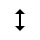
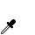
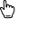
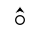
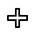

# @ohos.multimodalInput.pointer (Mouse Pointer)

The **pointer** module provides APIs related to pointer attribute management.

> **NOTE**
>
> The initial APIs of this module are supported since API version 9. Newly added APIs will be marked with a superscript to indicate their earliest API version.

## Modules to Import

```js
import { pointer } from '@kit.InputKit';
```

## pointer.setPointerVisible

setPointerVisible(visible: boolean, callback: AsyncCallback&lt;void&gt;): void

Sets the visible status of the mouse pointer. This API uses an asynchronous callback to return the result.

**System capability**: SystemCapability.MultimodalInput.Input.Pointer

**Parameters**

| Name      | Type                       | Mandatory  | Description                                      |
| -------- | ------------------------- | ---- | ---------------------------------------- |
| visible  | boolean                   | Yes   | Whether the mouse pointer is visible. The value **true** indicates that the mouse pointer is visible, and the value **false** indicates the opposite.|
| callback | AsyncCallback&lt;void&gt; | Yes   | Callback used to return the result.|

**Error codes**

For details about the error codes, see [Universal Error Codes](../errorcode-universal.md).

| ID | Error Message            |
| ---- | --------------------- |
| 401  | Parameter error. Possible causes: 1. Mandatory parameters are left unspecified;2. Incorrect parameter types; 3. Parameter verification failed. |

**Example**

```js
try {
  pointer.setPointerVisible(true, (error: Error) => {
    if (error) {
      console.log(`Set pointer visible failed, error: ${JSON.stringify(error, [`code`, `message`])}`);
      return;
    }
    console.log(`Set pointer visible success`);
  });
} catch (error) {
  console.log(`Set pointer visible failed, error: ${JSON.stringify(error, [`code`, `message`])}`);
}
```

## pointer.setPointerVisible

setPointerVisible(visible: boolean): Promise&lt;void&gt;

Sets the visible status of the mouse pointer. This API uses a promise to return the result.

**System capability**: SystemCapability.MultimodalInput.Input.Pointer

**Parameters**

| Name     | Type     | Mandatory  | Description                                      |
| ------- | ------- | ---- | ---------------------------------------- |
| visible | boolean | Yes   | Whether the mouse pointer is visible. The value **true** indicates that the mouse pointer is visible, and the value **false** indicates the opposite.|

**Return value**

| Name                 | Description                 |
| ------------------- | ------------------- |
| Promise&lt;void&gt; | Promise used to return the result.|

**Error codes**

For details about the error codes, see [Universal Error Codes](../errorcode-universal.md).

| ID | Error Message            |
| ---- | --------------------- |
| 401  | Parameter error. Possible causes: 1. Mandatory parameters are left unspecified;2. Incorrect parameter types; 3. Parameter verification failed. |

**Example**

```js
try {
  pointer.setPointerVisible(false).then(() => {
    console.log(`Set pointer visible success`);
  });
} catch (error) {
  console.log(`Set pointer visible failed, error: ${JSON.stringify(error, [`code`, `message`])}`);
}
```

## pointer.setPointerVisibleSync<sup>10+</sup>

setPointerVisibleSync(visible: boolean): void

Sets the visible status of the mouse pointer. This API returns the result synchronously.

**System capability**: SystemCapability.MultimodalInput.Input.Pointer

**Parameters**

| Name     | Type     | Mandatory  | Description                                      |
| ------- | ------- | ---- | ---------------------------------------- |
| visible | boolean | Yes   | Whether the mouse pointer is visible. The value **true** indicates that the mouse pointer is visible, and the value **false** indicates the opposite.|

**Error codes**

For details about the error codes, see [Universal Error Codes](../errorcode-universal.md).

| ID | Error Message            |
| ---- | --------------------- |
| 401  | Parameter error. Possible causes: 1. Mandatory parameters are left unspecified;2. Incorrect parameter types; 3. Parameter verification failed. |

**Example**

```js
try {
  pointer.setPointerVisibleSync(false);
  console.log(`Set pointer visible success`);
} catch (error) {
  console.log(`Set pointer visible failed, error: ${JSON.stringify(error, [`code`, `message`])}`);
}
```

## pointer.isPointerVisible

isPointerVisible(callback: AsyncCallback&lt;boolean&gt;): void

Checks the visible status of the mouse pointer. This API uses an asynchronous callback to return the result. 

**System capability**: SystemCapability.MultimodalInput.Input.Pointer

**Parameters**

| Name      | Type                          | Mandatory  | Description            |
| -------- | ---------------------------- | ---- | -------------- |
| callback | AsyncCallback&lt;boolean&gt; | Yes   | Callback used to return the result. The value **true** indicates that the mouse pointer is displayed, and the value **false** indicates the opposite.|

**Error codes**

For details about the error codes, see [Universal Error Codes](../errorcode-universal.md).

| ID | Error Message            |
| ---- | --------------------- |
| 401  | Parameter error. Possible causes: 1. Mandatory parameters are left unspecified;2. Incorrect parameter types; 3. Parameter verification failed. |

**Example**

```js
try {
  pointer.isPointerVisible((error: Error, visible: boolean) => {
    if (error) {
      console.log(`Get pointer visible failed, error: ${JSON.stringify(error, [`code`, `message`])}`);
      return;
    }
    console.log(`Get pointer visible success, visible: ${JSON.stringify(visible)}`);
  });
} catch (error) {
  console.log(`Get pointer visible failed, error: ${JSON.stringify(error, [`code`, `message`])}`);
}
```

## pointer.isPointerVisible

isPointerVisible(): Promise&lt;boolean&gt;

Checks the visible status of the mouse pointer. This API uses a promise to return the result. 

**System capability**: SystemCapability.MultimodalInput.Input.Pointer

**Return value**

| Name                    | Description                 |
| ---------------------- | ------------------- |
| Promise&lt;boolean&gt; | Promise used to return the result.|

**Example**

```js
try {
  pointer.isPointerVisible().then((visible: boolean) => {
    console.log(`Get pointer visible success, visible: ${JSON.stringify(visible)}`);
  });
} catch (error) {
  console.log(`Get pointer visible failed, error: ${JSON.stringify(error, [`code`, `message`])}`);
}
```

## pointer.isPointerVisibleSync<sup>10+</sup>

isPointerVisibleSync(): boolean

Obtains the visible status of the mouse pointer. This API returns the result synchronously.

**System capability**: SystemCapability.MultimodalInput.Input.Pointer

**Return value**

| Name                    | Description                 |
| ---------------------- | ------------------- |
| boolean | Visible status of the mouse pointer. The value **true** indicates that the mouse pointer is visible, and the value **false** indicates the opposite.|

**Example**

```js
try {
  let visible: boolean = pointer.isPointerVisibleSync();
  console.log(`Get pointer visible success, visible: ${JSON.stringify(visible)}`);
} catch (error) {
  console.log(`Get pointer visible failed, error: ${JSON.stringify(error, [`code`, `message`])}`);
}
```

## pointer.getPointerStyle

getPointerStyle(windowId: number, callback: AsyncCallback&lt;PointerStyle&gt;): void

Obtains the mouse pointer style. This API uses an asynchronous callback to return the result.

**System capability**: SystemCapability.MultimodalInput.Input.Pointer

**Parameters**

| Name      | Type                                      | Mandatory  | Description            |
| -------- | ---------------------------------------- | ---- | -------------- |
| windowId | number                                   | Yes   | Window ID.   |
| callback | AsyncCallback&lt;[PointerStyle](#pointerstyle)&gt; | Yes   | Callback used to return the result.|

**Error codes**

For details about the error codes, see [Universal Error Codes](../errorcode-universal.md).

| ID | Error Message            |
| ---- | --------------------- |
| 401  | Parameter error. Possible causes: 1. Mandatory parameters are left unspecified;2. Incorrect parameter types; 3. Parameter verification failed. |

**Example**

```js
import { BusinessError } from '@kit.BasicServicesKit';
import { window } from '@kit.ArkUI';

let context = getContext(this);
window.getLastWindow(context, (error: BusinessError, win: window.Window) => {
  if (error.code) {
    console.error('Failed to obtain the top window. Cause: ' + JSON.stringify(error));
    return;
  }
  let windowId = win.getWindowProperties().id;
  if (windowId < 0) {
    console.log(`Invalid windowId`);
    return;
  }
  try {
    pointer.getPointerStyle(windowId, (error: Error, style: pointer.PointerStyle) => {
      console.log(`Get pointer style success, style: ${JSON.stringify(style)}`);
    });
  } catch (error) {
    console.log(`Get pointer style failed, error: ${JSON.stringify(error, [`code`, `message`])}`);
  }
});
```

## pointer.getPointerStyle

getPointerStyle(windowId: number): Promise&lt;PointerStyle&gt;

Obtains the mouse pointer style. This API uses a promise to return the result.

**System capability**: SystemCapability.MultimodalInput.Input.Pointer

**Parameters**

| Name    | Type  | Mandatory| Description    |
| -------- | ------ | ---- | -------- |
| windowId | number | Yes  | Window ID.|

**Return value**

| Name                                      | Description                 |
| ---------------------------------------- | ------------------- |
| Promise&lt;[PointerStyle](#pointerstyle)&gt; | Promise used to return the result.|

**Error codes**

For details about the error codes, see [Universal Error Codes](../errorcode-universal.md).

| ID | Error Message            |
| ---- | --------------------- |
| 401  | Parameter error. Possible causes: 1. Mandatory parameters are left unspecified;2. Incorrect parameter types; 3. Parameter verification failed. |

**Example**

```js
import { BusinessError } from '@kit.BasicServicesKit';
import { window } from '@kit.ArkUI';

let context = getContext(this);
window.getLastWindow(context, (error: BusinessError, win: window.Window) => {
  if (error.code) {
    console.error('Failed to obtain the top window. Cause: ' + JSON.stringify(error));
    return;
  }
  let windowId = win.getWindowProperties().id;
  if (windowId < 0) {
    console.log(`Invalid windowId`);
    return;
  }
  try {
    pointer.getPointerStyle(windowId).then((style: pointer.PointerStyle) => {
      console.log(`Get pointer style success, style: ${JSON.stringify(style)}`);
    });
  } catch (error) {
    console.log(`Get pointer style failed, error: ${JSON.stringify(error, [`code`, `message`])}`);
  }
});
```

## pointer.getPointerStyleSync<sup>10+</sup>

getPointerStyleSync(windowId: number): PointerStyle

Obtains the mouse pointer style. This API returns the result synchronously.

**System capability**: SystemCapability.MultimodalInput.Input.Pointer

**Parameters**

| Name    | Type  | Mandatory| Description    |
| -------- | ------ | ---- | -------- |
| windowId | number | Yes  | Window ID.<br>The default value is **-1**, indicating the global mouse pointer style.|

**Return value**

| Name                                      | Description                 |
| ---------------------------------------- | ------------------- |
| [PointerStyle](#pointerstyle) | Mouse pointer style.|

**Error codes**

For details about the error codes, see [Universal Error Codes](../errorcode-universal.md).

| ID | Error Message            |
| ---- | --------------------- |
| 401  | Parameter error. Possible causes: 1. Mandatory parameters are left unspecified;2. Incorrect parameter types; 3. Parameter verification failed. |

**Example**

```js
import { pointer } from '@kit.InputKit';

let windowId = -1;
try {
  let style: pointer.PointerStyle = pointer.getPointerStyleSync(windowId);
  console.log(`Get pointer style success, style: ${JSON.stringify(style)}`);
} catch (error) {
  console.log(`Get pointer style failed, error: ${JSON.stringify(error, [`code`, `message`])}`);
}
```

## pointer.setPointerStyle

setPointerStyle(windowId: number, pointerStyle: PointerStyle, callback: AsyncCallback&lt;void&gt;): void

Sets the mouse pointer style. This API uses an asynchronous callback to return the result.

**System capability**: SystemCapability.MultimodalInput.Input.Pointer

**Parameters**

| Name          | Type                            | Mandatory  | Description                                 |
| ------------ | ------------------------------ | ---- | ----------------------------------- |
| windowId     | number                         | Yes   | Window ID.                         |
| pointerStyle | [PointerStyle](#pointerstyle) | Yes   | Pointer style.                            |
| callback     | AsyncCallback&lt;void&gt;      | Yes   | Callback used to return the result.|

**Error codes**

For details about the error codes, see [Universal Error Codes](../errorcode-universal.md).

| ID | Error Message            |
| ---- | --------------------- |
| 401  | Parameter error. Possible causes: 1. Mandatory parameters are left unspecified;2. Incorrect parameter types; 3. Parameter verification failed. |

**Example**

```js
import { BusinessError } from '@kit.BasicServicesKit';
import { window } from '@kit.ArkUI';

window.getLastWindow(getContext(), (error: BusinessError, win: window.Window) => {
  if (error.code) {
    console.error('Failed to obtain the top window. Cause: ' + JSON.stringify(error));
    return;
  }
  let windowId = win.getWindowProperties().id;
  if (windowId < 0) {
    console.log(`Invalid windowId`);
    return;
  }
  try {
    pointer.setPointerStyle(windowId, pointer.PointerStyle.CROSS, error => {
      console.log(`Set pointer style success`);
    });
  } catch (error) {
    console.log(`Set pointer style failed, error: ${JSON.stringify(error, [`code`, `message`])}`);
  }
});
```
## pointer.setPointerStyle

setPointerStyle(windowId: number, pointerStyle: PointerStyle): Promise&lt;void&gt;

Sets the mouse pointer style. This API uses a promise to return the result.

**System capability**: SystemCapability.MultimodalInput.Input.Pointer

**Parameters**

| Name                 | Type                            | Mandatory  | Description              |
| ------------------- | ------------------------------ | ---- | ---------------- |
| windowId            | number                         | Yes   | Window ID.      |
| pointerStyle        | [PointerStyle](#pointerstyle) | Yes   | Pointer style.         |

**Return value**

| Name                 | Description                 |
| ------------------- | ------------------- |
| Promise&lt;void&gt; | Promise used to return the result.|

**Error codes**

For details about the error codes, see [Universal Error Codes](../errorcode-universal.md).

| ID | Error Message            |
| ---- | --------------------- |
| 401  | Parameter error. Possible causes: 1. Mandatory parameters are left unspecified;2. Incorrect parameter types; 3. Parameter verification failed. |

**Example**

```js
import { BusinessError } from '@kit.BasicServicesKit';
import { window } from '@kit.ArkUI';

window.getLastWindow(getContext(), (error: BusinessError, win: window.Window) => {
  if (error.code) {
    console.error('Failed to obtain the top window. Cause: ' + JSON.stringify(error));
    return;
  }
  let windowId = win.getWindowProperties().id;
  if (windowId < 0) {
    console.log(`Invalid windowId`);
    return;
  }
  try {
    pointer.setPointerStyle(windowId, pointer.PointerStyle.CROSS).then(() => {
      console.log(`Set pointer style success`);
    });
  } catch (error) {
    console.log(`Set pointer style failed, error: ${JSON.stringify(error, [`code`, `message`])}`);
  }
});
```

## pointer.setPointerStyleSync<sup>10+</sup>

setPointerStyleSync(windowId: number, pointerStyle: PointerStyle): void

Sets the mouse pointer style. This API returns the result synchronously.

**System capability**: SystemCapability.MultimodalInput.Input.Pointer

**Parameters**

| Name                 | Type                            | Mandatory  | Description              |
| ------------------- | ------------------------------ | ---- | ---------------- |
| windowId            | number                         | Yes   | Window ID.      |
| pointerStyle        | [PointerStyle](#pointerstyle) | Yes   | Pointer style.         |

**Error codes**

For details about the error codes, see [Universal Error Codes](../errorcode-universal.md).

| ID | Error Message            |
| ---- | --------------------- |
| 401  | Parameter error. Possible causes: 1. Mandatory parameters are left unspecified;2. Incorrect parameter types; 3. Parameter verification failed. |

**Example**
```js
import { BusinessError } from '@kit.BasicServicesKit';
import { window } from '@kit.ArkUI';

window.getLastWindow(getContext(), (error: BusinessError, win: window.Window) => {
  if (error.code) {
    console.error('Failed to obtain the top window. Cause: ' + JSON.stringify(error));
    return;
  }
  let windowId = win.getWindowProperties().id;
  if (windowId < 0) {
    console.log(`Invalid windowId`);
    return;
  }
  try {
    pointer.setPointerStyleSync(windowId, pointer.PointerStyle.CROSS);
    console.log(`Set pointer style success`);
  } catch (error) {
    console.log(`getPointerSize failed, error: ${JSON.stringify(error, [`code`, `message`])}`);
  }
});
```

## PrimaryButton<sup>10+</sup>

Type of the primary mouse button.

**System capability**: SystemCapability.MultimodalInput.Input.Pointer

| Name                              | Value   | Description    |
| -------------------------------- | ---- | ------ |
| LEFT                          | 0    | Left mouse button.    |
| RIGHT                             | 1    | Right mouse button.  |

## RightClickType<sup>10+</sup>

Enumerates shortcut menu triggering modes.

**System capability**: SystemCapability.MultimodalInput.Input.Pointer

| Name                              | Value   | Description    |
| -------------------------------- | ---- | ------ |
| TOUCHPAD_RIGHT_BUTTON            | 1    |Tapping the right-button area of the touchpad.|
| TOUCHPAD_LEFT_BUTTON            | 2    |Tapping the left-button area of the touchpad.|
| TOUCHPAD_TWO_FINGER_TAP         | 3    |Tapping or pressing the touchpad with two fingers.|

## PointerStyle

Enumerates mouse pointer styles.

**System capability**: SystemCapability.MultimodalInput.Input.Pointer

| Name                              | Value   | Description    |Legend|
| -------------------------------- | ---- | ------ |------ |
| DEFAULT                          | 0    | Default     ||
| EAST                             | 1    | East arrow  ||
| WEST                             | 2    | West arrow  ||
| SOUTH                            | 3    | South arrow  ||
| NORTH                            | 4    | North arrow  ||
| WEST_EAST                        | 5    | West-east arrow ||
| NORTH_SOUTH                      | 6    | North-south arrow ||
| NORTH_EAST                       | 7    | North-east arrow ||
| NORTH_WEST                       | 8    | North-west arrow ||
| SOUTH_EAST                       | 9    | South-east arrow ||
| SOUTH_WEST                       | 10   | South-west arrow ||
| NORTH_EAST_SOUTH_WEST            | 11   | North-east and south-west adjustment||
| NORTH_WEST_SOUTH_EAST            | 12   | North-west and south-east adjustment||
| CROSS                            | 13   | Cross (accurate selection)  ||
| CURSOR_COPY                      | 14   | Copy    ||
| CURSOR_FORBID                    | 15   | Forbid   ||
| COLOR_SUCKER                     | 16   | Sucker    ||
| HAND_GRABBING                    | 17   | Grabbing hand  ||
| HAND_OPEN                        | 18   | Opening hand  ||
| HAND_POINTING                    | 19   | Hand-shaped pointer  ||
| HELP                             | 20   | Help   ||
| MOVE                             | 21   | Move    ||
| RESIZE_LEFT_RIGHT                | 22   | Left and right resizing||
| RESIZE_UP_DOWN                   | 23   | Up and down resizing||
| SCREENSHOT_CHOOSE                | 24   | Screenshot crosshair||
| SCREENSHOT_CURSOR                | 25   | Screenshot    ||
| TEXT_CURSOR                      | 26   | Text selection  ||
| ZOOM_IN                          | 27   | Zoom in    ||
| ZOOM_OUT                         | 28   | Zoom out    ||
| MIDDLE_BTN_EAST                  | 29   | Scrolling east  ||
| MIDDLE_BTN_WEST                  | 30   | Scrolling west  ||
| MIDDLE_BTN_SOUTH                 | 31   | Scrolling south  |             |
| MIDDLE_BTN_NORTH                 | 32   | Scrolling north  ||
| MIDDLE_BTN_NORTH_SOUTH           | 33   | Scrolling north-south ||
| MIDDLE_BTN_NORTH_EAST            | 34   | Scrolling north-east ||
| MIDDLE_BTN_NORTH_WEST            | 35   | Scrolling north-west ||
| MIDDLE_BTN_SOUTH_EAST            | 36   | Scrolling south-east ||
| MIDDLE_BTN_SOUTH_WEST            | 37   | Scrolling south-west ||
| MIDDLE_BTN_NORTH_SOUTH_WEST_EAST | 38   | Moving as a cone in four directions||
| HORIZONTAL_TEXT_CURSOR<sup>10+</sup> | 39 | Horizontal text selection||
| CURSOR_CROSS<sup>10+</sup> | 40 | Cross||
| CURSOR_CIRCLE<sup>10+</sup> | 41 | Circle||
| LOADING<sup>10+</sup> | 42 | Animation loading|<br>**Atomic service API**: This API can be used in atomic services since API version 12.|
| RUNNING<sup>10+</sup> | 43 | Animation running in the background|<br>**Atomic service API**: This API can be used in atomic services since API version 12.|
| MIDDLE_BTN_EAST_WEST<sup>16+</sup>           | 44   | Scrolling east-west||

## pointer.setCustomCursor<sup>11+</sup>

setCustomCursor(windowId: number, pixelMap: image.PixelMap, focusX?: number, focusY?: number): Promise&lt;void&gt;

Sets a custom cursor. This API uses a promise to return the result.

**System capability**: SystemCapability.MultimodalInput.Input.Pointer

**Parameters**

| Name   | Type    | Mandatory  | Description                                 |
| ----- | ------ | ---- | ----------------------------------- |
| windowId  | number  | Yes   | Window ID.                         |
| pixelMap  | [image.PixelMap](../apis-image-kit/js-apis-image.md#pixelmap7) | Yes   | Pixel map resource.|
| focusX  | number | No   | Focus x of the custom cursor. The value is greater than or equal to **0**. The default value is **0**.|
| focusY  | number | No   | Focus y of the custom cursor. The value is greater than or equal to **0**. The default value is **0**.|

**Return value**

| Name                 | Description              |
| ------------------- | ---------------- |
| Promise&lt;void&gt; | Promise that returns no value.|

**Error codes**

For details about the error codes, see [Universal Error Codes](../errorcode-universal.md).

| ID | Error Message            |
| ---- | --------------------- |
| 401  | Parameter error. Possible causes: 1. Mandatory parameters are left unspecified;2. Incorrect parameter types; 3. Parameter verification failed. |

**Example**

```js
import { image } from '@kit.ImageKit';
import { BusinessError } from '@kit.BasicServicesKit';
import { window } from '@kit.ArkUI';
getContext().resourceManager.getMediaContent($r("app.media.app_icon")).then((svgFileData) => {
  const svgBuffer: ArrayBuffer = svgFileData.buffer.slice(0);
  let svgImagesource: image.ImageSource = image.createImageSource(svgBuffer);
  let svgDecodingOptions: image.DecodingOptions = {desiredSize: { width: 50, height:50 }};
  svgImagesource.createPixelMap(svgDecodingOptions).then((pixelMap) => {
    window.getLastWindow(getContext(), (error: BusinessError, win: window.Window) => {
      let windowId = win.getWindowProperties().id;
        try {
          pointer.setCustomCursor(windowId, pixelMap).then(() => {
            console.log(`setCustomCursor success`);
          });
        } catch (error) {
          console.log(`setCustomCursor failed, error: ${JSON.stringify(error, [`code`, `message`])}`);
        }
      });
  });
});
```
## CustomCursor<sup>15+</sup>

Pixel map resource.

**System capability**: SystemCapability.MultimodalInput.Input.Pointer
| Name    | Type    | Readable    | Writable    | Description    |
| -------- | ------- | -------- | -------- | ------- |
| pixelMap  | [image.PixelMap](../apis-image-kit/js-apis-image.md#pixelmap7) | No  | No  | Defines a custom cursor. The maximum resolution is 256 x 256 pixels.|
| focusX  | number | No  | Yes  | Horizontal coordinate of the cursor focus. The coordinates are restricted by the size of the custom cursor. The default value is **0**.|
| focusY  | number | No  | Yes  | Vertical coordinate of the cursor focus. The coordinates are restricted by the size of the custom cursor. The default value is **0**.|

## CursorConfig<sup>15+</sup>

Defines the custom cursor configuration.

**System capability**: SystemCapability.MultimodalInput.Input.Pointer

| Name    | Type    | Readable    | Writable    | Description    |
| -------- | ------- | -------- | -------- | ------- |
| followSystem  | boolean  | No  | No  | Whether to adjust the cursor size based on system settings. The value **false** indicates that the size of the custom cursor is used, and the value **true** indicates that the cursor size is adjusted based on the system settings.|

## pointer.setCustomCursor<sup>15+</sup>

setCustomCursor(windowId: number, cursor: CustomCursor, config: CursorConfig): Promise&lt;void&gt;

Sets the custom cursor style. This API uses a promise to return the result.
The cursor may be switched back to the system style in the following cases: application window layout change, hot zone switching, page redirection, moving of the cursor out of the window and then back to the window, or moving of the cursor in different areas of the window. In this case, you need to reset the cursor style.

**System capability**: SystemCapability.MultimodalInput.Input.Pointer

**Parameters**

| Name   | Type   | Mandatory   | Description   |
| -------- | -------- | -------- | -------- |
| windowId  | number  | Yes   | Window ID.                         |
| cursor  | [CustomCursor](js-apis-pointer.md#customcursor15) | Yes   | Pixel map resource.|
| config  | [CursorConfig](js-apis-pointer.md#cursorconfig15) | Yes   | Defines the custom cursor configuration.|

**Return value**

| Name                 | Description              |
| ------------------- | ---------------- |
| Promise&lt;void&gt; | This API uses a promise to return the result. The value **0** indicates that the operation is successful, and any other value indicates that the operation fails.|

**Error codes**

For details about the error codes, see [Universal Error Codes](../errorcode-universal.md).

| ID | Error Message            |
| ---- | --------------------- |
| 401  | 401 - Parameter error. Possible causes: 1. Abnormal windowId parameter passed in. 2. Abnormal pixelMap parameter passed in; 3. Abnormal focusX parameter passed in.4. Abnormal focusY parameter passed in. |

**Example**

```js
import { image } from '@kit.ImageKit';
import { BusinessError } from '@kit.BasicServicesKit';
import { window } from '@kit.ArkUI';
getContext().resourceManager.getMediaContent($r("app.media.app_icon")).then((svgFileData) => {
  const svgBuffer: ArrayBuffer = svgFileData.buffer.slice(0);
  let svgImagesource: image.ImageSource = image.createImageSource(svgBuffer);
  let svgDecodingOptions: image.DecodingOptions = {desiredSize: { width: 50, height:50 }};
  svgImagesource.createPixelMap(svgDecodingOptions).then((pixelMap) => {
    window.getLastWindow(getContext(), (error: BusinessError, win: window.Window) => {
      let windowId = win.getWindowProperties().id;
        try {
          pointer.setCustomCursor(windowId, {pixelMap: pixelMap, focusX: 25, focusY: 25}, {followSystem: false}).then(() => {
            console.log(`setCustomCursor success`);
          });
        } catch (error) {
          console.log(`setCustomCursor failed, error: ${JSON.stringify(error, [`code`, `message`])}`);
        }
      });
  });
});
```

## pointer.setCustomCursorSync<sup>11+</sup>

setCustomCursorSync(windowId: number, pixelMap: image.PixelMap, focusX?: number, focusY?: number): void

Sets a custom cursor. This API returns the result synchronously.

**System capability**: SystemCapability.MultimodalInput.Input.Pointer

**Parameters**

| Name   | Type    | Mandatory  | Description                                 |
| ----- | ------ | ---- | ----------------------------------- |
| windowId  | number  | Yes   | Window ID.                         |
| pixelMap  | [image.PixelMap](../apis-image-kit/js-apis-image.md#pixelmap7) | Yes   | Pixel map resource.|
| focusX  | number | No   | Focus x of the custom cursor. The value is greater than or equal to **0**. The default value is **0**.|
| focusY  | number | No   | Focus y of the custom cursor. The value is greater than or equal to **0**. The default value is **0**.|

**Error codes**

For details about the error codes, see [Universal Error Codes](../errorcode-universal.md).

| ID | Error Message            |
| ---- | --------------------- |
| 401  | Parameter error. Possible causes: 1. Mandatory parameters are left unspecified;2. Incorrect parameter types; 3. Parameter verification failed. |

**Example**

```js
import { image } from '@kit.ImageKit';
import { BusinessError } from '@kit.BasicServicesKit';
import { window } from '@kit.ArkUI';
const svgFileData = getContext().resourceManager.getMediaContent($r("app.media.app_icon")).then((svgFileData) => {
  const svgBuffer: ArrayBuffer = svgFileData.buffer.slice(0);
  let svgImagesource: image.ImageSource = image.createImageSource(svgBuffer);
  let svgDecodingOptions: image.DecodingOptions = {desiredSize: { width: 50, height:50 }};
  svgImagesource.createPixelMap(svgDecodingOptions).then((pixelMap) => {
    window.getLastWindow(getContext(), (error: BusinessError, win: window.Window) => {
      let windowId = win.getWindowProperties().id;
        try {
          pointer.setCustomCursorSync(windowId, pixelMap, 25, 25);
          console.log(`setCustomCursorSync success`);
        } catch (error) {
          console.log(`setCustomCursorSync failed, error: ${JSON.stringify(error, [`code`, `message`])}`);
        }
    });
  });
});
```
