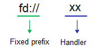

# @ohos.multimedia.media (Media) (System API)
<!--Kit: Media Kit-->
<!--Subsystem: Multimedia-->
<!--Owner: @zzs_911-->
<!--Designer: @stupig001-->
<!--Tester: @xdlinc-->
<!--Adviser: @zengyawen-->

The multimedia subsystem provides a set of simple and easy-to-use APIs for you to access the system and use media resources.

> **NOTE**
>
> - The initial APIs of this module are supported since API version 6. Newly added APIs will be marked with a superscript to indicate their earliest API version.
> - This topic describes only system APIs provided by the module. For details about its public APIs, see [@ohos.multimedia.media (Media)](arkts-apis-media.md).

## Modules to Import

```ts
import { media } from '@kit.MediaKit';
```

## media.createVideoRecorder<sup>9+</sup>

createVideoRecorder(callback: AsyncCallback\<VideoRecorder>): void

Creates a VideoRecorder instance. This API uses an asynchronous callback to return the result.

Only one VideoRecorder instance can be created per device.

**System capability**: SystemCapability.Multimedia.Media.VideoRecorder

**System API**: This is a system API.

**Parameters**

| Name  | Type                                           | Mandatory| Description                                                        |
| -------- | ----------------------------------------------- | ---- | ------------------------------------------------------------ |
| callback | AsyncCallback<[VideoRecorder](#videorecorder9)> | Yes  | Callback used to return the result. If the operation is successful, a VideoRecorder instance is returned; otherwise, **null** is returned. The instance can be used to record video.|

**Error codes**

For details about the error codes, see [Universal Error Codes](../errorcode-universal.md) and [Media Error Codes](errorcode-media.md).

| ID| Error Message                      |
| -------- | ------------------------------ |
| 202      | Not system App.                |
| 5400101  | No memory. Return by callback. |

**Example**

```ts
import { BusinessError } from '@kit.BasicServicesKit';

let videoRecorder: media.VideoRecorder;
media.createVideoRecorder((error: BusinessError, video: media.VideoRecorder) => {
  if (video != null) {
    videoRecorder = video;
    console.info('video createVideoRecorder success');
  } else {
    console.error(`video createVideoRecorder fail, error message:${error.message}`);
  }
});
```

## media.createVideoRecorder<sup>9+</sup>

createVideoRecorder(): Promise\<VideoRecorder>

Creates a VideoRecorder instance. This API uses a promise to return the result.

Only one VideoRecorder instance can be created per device.

**System capability**: SystemCapability.Multimedia.Media.VideoRecorder

**System API**: This is a system API.

**Return value**

| Type                                     | Description                                                        |
| ----------------------------------------- | ------------------------------------------------------------ |
| Promise<[VideoRecorder](#videorecorder9)> | Promise used to return the result. If the operation is successful, a VideoRecorder instance is returned; otherwise, **null** is returned. The instance can be used to record video.|

**Error codes**

For details about the error codes, see [Universal Error Codes](../errorcode-universal.md) and [Media Error Codes](errorcode-media.md).

| ID| Error Message                     |
| -------- | ----------------------------- |
| 202      | Not system App.               |
| 5400101  | No memory. Return by promise. |

**Example**

```ts
import { BusinessError } from '@kit.BasicServicesKit';

let videoRecorder: media.VideoRecorder;
media.createVideoRecorder().then((video: media.VideoRecorder) => {
  if (video != null) {
    videoRecorder = video;
    console.info('video createVideoRecorder success');
  } else {
    console.error('video createVideoRecorder fail');
  }
}).catch((error: BusinessError) => {
  console.error(`video catchCallback, error message:${error.message}`);
});
```

## media.reportAVScreenCaptureUserChoice<sup>12+</sup>

reportAVScreenCaptureUserChoice(sessionId: number, choice: string): Promise\<void>

Reports the user selection result in the screen capture privacy dialog box to the AVScreenCapture server to determine whether to start screen capture. Screen capture starts only when the user touches the **Allow** button to continue the operation.

This API is called by the system application that creates the dialog box.

**System capability**: SystemCapability.Multimedia.Media.AVScreenCapture

**System API**: This is a system API.

**Parameters**

| Name   | Type  | Mandatory| Description                                                         |
| --------- | ------ | ---- | ------------------------------------------------------------ |
| sessionId | number | Yes  | Session ID of the AVScreenCapture service, which is sent to the application when the AVScreenCapture server starts the privacy dialog box.|
| choice    | string | Yes  | User choice, including whether screen capture is agreed, selected display ID, and window ID. For details, see JsonData in the example below.|

**Return value**

| Type            | Description                            |
| ---------------- | -------------------------------- |
| Promise\<void> | Promise that returns no value.|

**Error codes**

| ID| Error Message                                   |
| -------- | ------------------------------------------- |
| 401      | Parameter error. Possible causes: 1. Mandatory parameters are left unspecified. 2. Incorrect parameter types. 3.Parameter verification failed. |
| 5400101  | No memory. Return by promise.               |

**Example**

```ts
import { BusinessError } from '@kit.BasicServicesKit';
import { media } from '@kit.MediaKit';

class JsonData {
  public choice: string = 'true';
  public displayId: number | null = -1;
  public missionId: number | null = -1;
  public checkBoxSelected: string = 'true';
  public isInnerAudioBoxSelected: string = 'true';
}
let sessionId: number = 0; // Use the ID of the session that starts the process.

try {
  const jsonData: JsonData = {
    choice: 'true',  // Replace it with the user choice.
    displayId: -1, // Replace it with the ID of the display selected by the user.
    missionId: -1,   // Replace it with the ID of the window selected by the user.
    checkBoxSelected: 'true',   // Replace it with the enabled status of screen protection.
    isInnerAudioBoxSelected: 'true',   // Replace it the enabled status of internal audio recording.
  }
  await media.reportAVScreenCaptureUserChoice(sessionId, JSON.stringify(jsonData));
} catch (error: BusinessError) {
  console.error(`reportAVScreenCaptureUserChoice error, error message: ${error.message}`);
}
```

## media.getAVScreenCaptureConfigurableParameters<sup>20+</sup>

getAVScreenCaptureConfigurableParameters(sessionId: number): Promise\<string>

Obtains configuration parameters for system- and application-level privacy protection from the server. This API uses a promise to return the result.

>**NOTE**
>
> This API is exclusively for the system application that creates the privacy dialog box.

**System API**: This is a system API.

**System capability**: SystemCapability.Multimedia.Media.AVScreenCapture

**Parameters**

| Name   | Type  | Mandatory| Description                                                         |
| --------- | ------ | ---- | ------------------------------------------------------------ |
| sessionId | number | Yes  | Session ID of the AVScreenCapture service, which is sent to the application when the AVScreenCapture server starts the privacy dialog box.|

**Return value**

| Type            | Description                            |
| ---------------- | -------------------------------- |
| Promise\<string> | Promise used to return the result, which is a string containing the configuration parameters. If the operation fails, an empty string is returned.|

**Error codes**

For details about the error codes, see [Universal Error Codes](../errorcode-universal.md) and [Media Error Codes](errorcode-media.md).
| ID| Error Message                                   |
| -------- | ------------------------------------------- |
| 202      | Called from Non-System applications. Return by promise.               |
| 5400109  | Sessions not exist. Return by promise.               |

**Example**

```ts
import { BusinessError } from '@kit.BasicServicesKit';
import { media } from '@kit.MediaKit';

let sessionId: number = 0; // Use the ID of the session that starts the process.

try {
  let privacyResult: string = await media.getAVScreenCaptureConfigurableParameters(sessionId);
} catch (error: BusinessError) {
  console.error(`getAVScreenCaptureConfigurableParameters error, error message: ${error.message}`);
}
```

## media.getScreenCaptureMonitor<sup>18+</sup>

getScreenCaptureMonitor(): Promise\<ScreenCaptureMonitor>

Obtains a ScreenCaptureMonitor instance. This API uses a promise to return the result.

**System capability**: SystemCapability.Multimedia.Media.AVScreenCapture

**System API**: This is a system API.

**Return value**

| Type                                     | Description                                                        |
| ----------------------------------------- | ------------------------------------------------------------ |
| Promise<[ScreenCaptureMonitor](#screencapturemonitor18)> | Promise used to return the result. The instance can be used to query and monitor the status of the system screen recorder.<br>If the operation is successful, a ScreenCaptureMonitor instance is returned; otherwise, **null** is returned.|

**Error codes**

For details about the error codes, see [Universal Error Codes](../errorcode-universal.md) and [Media Error Codes](errorcode-media.md).

| ID| Error Message                     |
| -------- | ----------------------------- |
| 202  | Not System App. |
| 5400101  | No memory. Return by promise. |

**Example**

```ts
let screenCaptureMonitor: media.ScreenCaptureMonitor;
try {
  screenCaptureMonitor = await media.getScreenCaptureMonitor();
} catch (err) {
  console.error(`getScreenCaptureMonitor failed, error message:${err.message}`);
}
```

## media.createParallelSoundPool<sup>20+</sup>

createParallelSoundPool(maxStreams: number, audioRenderInfo: audio.AudioRendererInfo): Promise\<SoundPool>

Creates a SoundPool instance. This API uses a promise to return the result.

If a SoundPool instance created using [createSoundPool](arkts-apis-media-f.md#mediacreatesoundpool10) is used to play the same sound again, it stops the current audio and restarts the audio. However, if the instance is created using **createParallelSoundPool**, it keeps playing the first audio and starts the new one alongside it.

**System capability**: SystemCapability.Multimedia.Media.SoundPool

**Parameters**

| Name  | Type                                           | Mandatory| Description                                                        |
| -------- | ----------------------------------------------- | ---- | ------------------------------------------------------------ |
| maxStreams | number | Yes  | Maximum number of streams that can be played by the SoundPool instance. The value is an integer ranging from 1 to 32.|
| audioRenderInfo | [audio.AudioRendererInfo](../apis-audio-kit/arkts-apis-audio-i.md#audiorendererinfo8)  | Yes  | Audio renderer parameters.|

**Return value**

| Type                                     | Description                                                        |
| ----------------------------------------- | ------------------------------------------------------------ |
| Promise<[SoundPool](js-apis-inner-multimedia-soundPool.md)> | Promise used to return the result. If the operation is successful, a SoundPool instance is returned; otherwise, **null** is returned. The instance is used for loading and playback.|

**Error codes**

For details about the error codes, see [Universal Error Codes](../errorcode-universal.md) and [Media Error Codes](errorcode-media.md).

| ID| Error Message                     |
| -------- | ----------------------------- |
| 5400101  | No memory. Return by promise. |
| 202| System API error. Return by promise. |

**Example**

```js
import { audio } from '@kit.AudioKit';
import { BusinessError } from '@kit.BasicServicesKit';

let soundPool: media.SoundPool;
let audioRendererInfo: audio.AudioRendererInfo = {
  usage : audio.StreamUsage.STREAM_USAGE_MUSIC,
  rendererFlags : 0
}

media.createParallelSoundPool(5, audioRendererInfo).then((soundpool_: media.SoundPool) => {
  if (soundpool_ != null) {
    soundPool = soundpool_;
    console.info('Succceeded in creating SoundPool');
  } else {
    console.error('Failed to create SoundPool');
  }
}, (error: BusinessError) => {
  console.error(`soundpool catchCallback, error message:${error.message}`);
});
```

## PixelMapParams<sup>11+</sup>

Defines the format parameters of the video thumbnail to be obtained.

**System capability**: SystemCapability.Multimedia.Media.AVImageGenerator

| Name    | Type  |  Read-Only  |   Optional   |  Description                  |
| -------- | ------ |   ------| ------ | ---------------------- |
| colorFormat  | [PixelFormat](#pixelformat11) |  No  |  Yes  | Color format of the thumbnail.<br>**System API**: This is a system API.     |

## PixelFormat<sup>11+</sup>

Enumerates the color formats supported by the video thumbnail.

**System capability**: SystemCapability.Multimedia.Media.AVImageGenerator

**System API**: This is a system API.

| Name                    | Value             | Description                                                        |
| ------------------------ | --------------- | ------------------------------------------------------------ |
| RGB_565       | 2   | RGB_565.                      |
| RGBA_8888        | 3    | RGBA_8888.|
| RGB_888        | 5    | RGB_888.                |

## AVMetadataExtractor<sup>11+</sup>

Provides APIs to obtain metadata from media assets. Before calling any API of AVMetadataExtractor, you must use [createAVMetadataExtractor()](arkts-apis-media-f.md#mediacreateavmetadataextractor11) to create an AVMetadataExtractor instance.

### getTimeByFrameIndex<sup>12+</sup>

getTimeByFrameIndex(index: number): Promise\<number>

Obtains the video timestamp corresponding to a video frame number. Only MP4 video files are supported.

**System capability**: SystemCapability.Multimedia.Media.AVMetadataExtractor

**System API**: This is a system API.

**Parameters**

| Name| Type  | Mandatory| Description      |
| ------ | ------ | ---- | ---------- |
| index  | number | Yes  | Video frame number.|

**Return value**

| Type            | Description                               |
| ---------------- | ----------------------------------- |
| Promise\<number> | Promise used to return the timestamp, in microseconds.|

**Error codes**

For details about the error codes, see [Universal Error Codes](../errorcode-universal.md) and [Media Error Codes](errorcode-media.md).

| ID| Error Message                                      |
| -------- | ---------------------------------------------- |
| 401      | The parameter check failed. Return by promise. |
| 5400102  | Operation not allowed. Returned by promise.    |
| 5400106  | Unsupported format. Returned by promise.       |

**Example**

```ts
import { media } from '@kit.MediaKit';
import { BusinessError } from '@kit.BasicServicesKit';

avMetadataExtractor.getTimeByFrameIndex(0).then((timeUs: number) => {
  console.info(`Succeeded getTimeByFrameIndex timeUs: ${timeUs}`);
}).catch((err: BusinessError) => {
  console.error(`Failed to getTimeByFrameIndex ${err.message}`);
})
```

### getFrameIndexByTime<sup>12+</sup>

getFrameIndexByTime(timeUs: number): Promise\<number>

Obtains the video frame number corresponding to a video timestamp. Only MP4 video files are supported.

**System capability**: SystemCapability.Multimedia.Media.AVMetadataExtractor

**System API**: This is a system API.

**Parameters**

| Name| Type  | Mandatory| Description                    |
| ------ | ------ | ---- | ------------------------ |
| timeUs | number | Yes  | Video timestamp, in microseconds.|

**Return value**

| Type            | Description                     |
| ---------------- | ------------------------- |
| Promise\<number> | Promise used to return the video frame number.|

**Error codes**

For details about the error codes, see [Universal Error Codes](../errorcode-universal.md) and [Media Error Codes](errorcode-media.md).

| ID| Error Message                                      |
| -------- | ---------------------------------------------- |
| 401      | The parameter check failed. Return by promise. |
| 5400102  | Operation not allowed. Returned by promise.    |
| 5400106  | Unsupported format. Returned by promise.       |

**Example**

```ts
import { media } from '@kit.MediaKit';
import { BusinessError } from '@kit.BasicServicesKit';

avMetadataExtractor.getFrameIndexByTime(0).then((index: number) => {
  console.info(`Succeeded getFrameIndexByTime index: ${index}`);
}).catch((err: BusinessError) => {
  console.error(`Failed to getFrameIndexByTime ${err.message}`);
})
```

## AVRecorder<sup>9+</sup>

A recording management class that provides APIs to record media assets. Before calling any API in AVRecorder, you must use [createAVRecorder()](arkts-apis-media-f.md#mediacreateavrecorder9) to create an AVRecorder instance.

> **NOTE**
>
> To use the camera to record videos, the camera module is required. For details about how to use the APIs provided by the camera module, see [Camera Management](../apis-camera-kit/arkts-apis-camera.md).

### isWatermarkSupported<sup>13+</sup>

isWatermarkSupported(): Promise\<boolean>

Checks whether the device supports the hardware digital watermark. This API uses a promise to return the result.

This API can be called after the [prepare()](arkts-apis-media-AVRecorder.md#prepare9-1), [start()](arkts-apis-media-AVRecorder.md#start9), or [paused()](arkts-apis-media-AVRecorder.md#pause9) event is triggered.

**System capability**: SystemCapability.Multimedia.Media.AVRecorder

**System API**: This is a system API.

**Return value**

| Type            | Description                            |
| ---------------- | -------------------------------- |
| Promise\<boolean> | Promise used to return the check result, which indicates the support for the hardware digital watermark. **true** if supported, **false** otherwise.|

**Example**

```ts
import { BusinessError } from '@kit.BasicServicesKit';

avRecorder.isWatermarkSupported().then((isWatermarkSupported: boolean) => {
  console.info(`Succeeded in get, isWatermarkSupported: ${isWatermarkSupported}`);
}).catch((error: BusinessError) => {
  console.error(`Failed to get and catch error is ${error.message}`);
});
```

### setWatermark<sup>13+</sup>

setWatermark(watermark: image.PixelMap, config: WatermarkConfig): Promise\<void>

Sets a watermark for the AVRecorder. This API uses a promise to return the result.

This API can be called only after the [prepare()](arkts-apis-media-AVRecorder.md#prepare9-1) event is triggered and before the [start()](arkts-apis-media-AVRecorder.md#start9) event is triggered.

**System capability**: SystemCapability.Multimedia.Media.AVRecorder

**System API**: This is a system API.

**Parameters**

| Name  | Type                 | Mandatory| Description                        |
| -------- | -------------------- | ---- | --------------------------- |
| watermark | [image.PixelMap](../apis-image-kit/arkts-apis-image-PixelMap.md)      | Yes  | PixelMap data.<br>Currently, the following specifications are supported:<br>- Only RGBA8888 is supported.<br>- If the original image is 8K, the watermark resolution should be limited to a size of 3072 x 288; if the original image is 4K, the watermark resolution should be limited to a size of 1536 x 144.|
| config    | [WatermarkConfig](#watermarkconfig13)   | Yes  | Watermark configuration.|

**Return value**

| Type            | Description                            |
| ---------------- | -------------------------------- |
| Promise\<void> | Promise that returns no value.|

**Error codes**

For details about the error codes, see [Media Error Codes](errorcode-media.md).

| ID| Error Message                                |
| -------- | --------------------------------------   |
|   401    | The parameter check failed. Return by promise.            |
|   801    | Capability not supported. Return by promise. |

**Example**

```ts
import { BusinessError } from '@kit.BasicServicesKit';
import { image } from '@kit.ImageKit';

let watermark: image.PixelMap|undefined = undefined; // need data.
let watermarkConfig: media.WatermarkConfig = { top: 100, left: 100 }

avRecorder.setWatermark(watermark, watermarkConfig).then(() => {
  console.info('Succeeded in setWatermark');
}).catch((error: BusinessError) => {
  console.error(`Failed to setWatermark and catch error is ${error.message}`);
});
```

### setMetadata<sup>18+</sup>
setMetadata(metadata: Record\<string, string\>): void

Sets custom metadata for the recording file of AVRecorder.

This API can be called only after the [prepare()](arkts-apis-media-AVRecorder.md#prepare9-1) event is successfully triggered and before the [stop()](arkts-apis-media-AVRecorder.md#stop9) API is called.

**System capability**: SystemCapability.Multimedia.Media.AVRecorder

**System API**: This is a system API.

**Parameters**

| Name  | Type                 | Mandatory| Description                                                               |
| -------- | -------------------- | ---- |-------------------------------------------------------------------|
| metadata | [Record<string, string>]  | Yes  | Tag and value of the metadata in key-value pairs.<br>- The first string is the tag.<br>- The second string is the value.|

**Return value**

| Type           | Description       |
| --------------- |-----------|
| void | No result.|

**Error codes**

For details about the error codes, see [Universal Error Codes](../errorcode-universal.md).

| ID| Error Message           |
|-------|-----------------|
| 202   | Not System App. |

**Example**

```ts
import { BusinessError } from '@kit.BasicServicesKit';

let meta : Record<string, string> = {
   'com.openharmony.userdefine':'10',
   'com.openharmony.userdefine2':'20'
};

avRecorder.setMetadata(meta);
```

## AVRecorderProfile<sup>9+</sup>

Describes the audio and video recording profile.

**System capability**: SystemCapability.Multimedia.Media.AVRecorder

| Name            | Type                                        | Mandatory| Description                                                        |
| ---------------- | -------------------------------------------- | ---- | ------------------------------------------------------------ |
| enableStableQualityMode<sup>18+</sup>            | boolean                        | No  | Whether to enable stable quality mode for video recording. This parameter is optional for video recording. The default value is **false**. If this parameter is set to **true**, the system will use a video encoding strategy designed to maintain stable quality.<br>**System API**: This is a system API.|

## VideoRecorder<sup>9+</sup>

> **NOTE**
> This class is deprecated after AVRecorder<sup>9+</sup> is released. You are advised to use [AVRecorder](arkts-apis-media-AVRecorder.md) instead.

Implements video recording. Before calling any API in the **VideoRecorder** class, you must use [createVideoRecorder()](#mediacreatevideorecorder9) to create a [VideoRecorder](#videorecorder9) instance.

### Properties

**System capability**: SystemCapability.Multimedia.Media.VideoRecorder

**System API**: This is a system API.

| Name              | Type                                  | Read-Only| Optional| Description            |
| ------------------ | -------------------------------------- | ---- | ---- | ---------------- |
| state<sup>9+</sup> | [VideoRecordState](#videorecordstate9) | Yes  | No  | Video recording state.|

### prepare<sup>9+</sup>

prepare(config: VideoRecorderConfig, callback: AsyncCallback\<void>): void

Sets video recording parameters. This API uses an asynchronous callback to return the result.

**Required permissions:** ohos.permission.MICROPHONE

**System capability**: SystemCapability.Multimedia.Media.VideoRecorder

**System API**: This is a system API.

**Parameters**

| Name  | Type                                        | Mandatory| Description                               |
| -------- | -------------------------------------------- | ---- | ----------------------------------- |
| config   | [VideoRecorderConfig](#videorecorderconfig9) | Yes  | Video recording parameters to set.           |
| callback | AsyncCallback\<void>                         | Yes  | Callback used to return the result.|

**Error codes**

For details about the error codes, see [Universal Error Codes](../errorcode-universal.md) and [Media Error Codes](errorcode-media.md).

| ID| Error Message                                  |
| -------- | ------------------------------------------ |
| 201      | Permission denied. Return by callback.     |
| 202      | Not system App.                            |
| 401      | Parameter error. Possible causes: 1. Mandatory parameters are left unspecified. 2. Incorrect parameter types. 3.Parameter verification failed.       |
| 5400102  | Operation not allowed. Return by callback. |
| 5400105  | Service died. Return by callback.          |

**Example**

```ts
import { BusinessError } from '@kit.BasicServicesKit';

// Configure the parameters based on those supported by the hardware device.
let videoProfile: media.VideoRecorderProfile = {
  audioBitrate : 48000,
  audioChannels : 2,
  audioCodec : media.CodecMimeType.AUDIO_AAC,
  audioSampleRate : 48000,
  fileFormat : media.ContainerFormatType.CFT_MPEG_4,
  videoBitrate : 2000000,
  videoCodec : media.CodecMimeType.VIDEO_AVC,
  videoFrameWidth : 640,
  videoFrameHeight : 480,
  videoFrameRate : 30
}

let videoConfig: media.VideoRecorderConfig = {
  audioSourceType : media.AudioSourceType.AUDIO_SOURCE_TYPE_MIC,
  videoSourceType : media.VideoSourceType.VIDEO_SOURCE_TYPE_SURFACE_YUV,
  profile : videoProfile,
  url : 'fd://xx', // The file must be created by the caller and granted with proper permissions.
  rotation : 0,
  location : { latitude : 30, longitude : 130 }
}

// asyncallback.
videoRecorder.prepare(videoConfig, (err: BusinessError) => {
  if (err == null) {
    console.info('prepare success');
  } else {
    console.error('prepare failed and error is ' + err.message);
  }
})
```

### prepare<sup>9+</sup>

prepare(config: VideoRecorderConfig): Promise\<void>

Sets video recording parameters. This API uses a promise to return the result.

**Required permissions:** ohos.permission.MICROPHONE

**System capability**: SystemCapability.Multimedia.Media.VideoRecorder

**System API**: This is a system API.

**Parameters**

| Name| Type                                        | Mandatory| Description                    |
| ------ | -------------------------------------------- | ---- | ------------------------ |
| config | [VideoRecorderConfig](#videorecorderconfig9) | Yes  | Video recording parameters to set.|

**Return value**

| Type          | Description                                    |
| -------------- | ---------------------------------------- |
| Promise\<void> | Promise used to return the result.|

**Error codes**

For details about the error codes, see [Universal Error Codes](../errorcode-universal.md) and [Media Error Codes](errorcode-media.md).

| ID| Error Message                                 |
| -------- | ----------------------------------------- |
| 201      | Permission denied. Return by promise.     |
| 202      | Not system App.                           |
| 401      | Parameter error. Possible causes: 1. Mandatory parameters are left unspecified. 2. Incorrect parameter types. 3.Parameter verification failed.       |
| 5400102  | Operation not allowed. Return by promise. |
| 5400105  | Service died. Return by promise.          |

**Example**

```ts
import { BusinessError } from '@kit.BasicServicesKit';

// Configure the parameters based on those supported by the hardware device.
let videoProfile: media.VideoRecorderProfile = {
  audioBitrate : 48000,
  audioChannels : 2,
  audioCodec : media.CodecMimeType.AUDIO_AAC,
  audioSampleRate : 48000,
  fileFormat : media.ContainerFormatType.CFT_MPEG_4,
  videoBitrate : 2000000,
  videoCodec : media.CodecMimeType.VIDEO_AVC,
  videoFrameWidth : 640,
  videoFrameHeight : 480,
  videoFrameRate : 30
}

let videoConfig: media.VideoRecorderConfig = {
  audioSourceType : media.AudioSourceType.AUDIO_SOURCE_TYPE_MIC,
  videoSourceType : media.VideoSourceType.VIDEO_SOURCE_TYPE_SURFACE_YUV,
  profile : videoProfile,
  url : 'fd://xx', // The file must be created by the caller and granted with proper permissions.
  rotation : 0,
  location : { latitude : 30, longitude : 130 }
}

// promise.
videoRecorder.prepare(videoConfig).then(() => {
  console.info('prepare success');
}).catch((err: BusinessError) => {
  console.error('prepare failed and catch error is ' + err.message);
});
```

### getInputSurface<sup>9+</sup>

getInputSurface(callback: AsyncCallback\<string>): void

Obtains the surface required for recording. This API uses an asynchronous callback to return the result. The caller obtains the **surfaceBuffer** from this surface and fills in the corresponding data.

Note that the video data must carry the timestamp (in ns) and buffer size, and the start time of the timestamp must be based on the system startup time.

This API can be called only after [prepare()](#prepare9) is called.

**System capability**: SystemCapability.Multimedia.Media.VideoRecorder

**System API**: This is a system API.

**Parameters**

| Name  | Type                  | Mandatory| Description                       |
| -------- | ---------------------- | ---- | --------------------------- |
| callback | AsyncCallback\<string> | Yes  | Callback used to return the result.|

**Error codes**

For details about the error codes, see [Universal Error Codes](../errorcode-universal.md) and [Media Error Codes](errorcode-media.md).

| ID| Error Message                                  |
| -------- | ------------------------------------------ |
| 202      | Not system App.                            |
| 5400102  | Operation not allowed. Return by callback. |
| 5400103  | I/O error. Return by callback.             |
| 5400105  | Service died. Return by callback.          |

**Example**

```ts
import { BusinessError } from '@kit.BasicServicesKit';

// asyncallback.
let surfaceID: string; // Surface ID passed to the external system.
videoRecorder.getInputSurface((err: BusinessError, surfaceId: string) => {
  if (err == null) {
    console.info('getInputSurface success');
    surfaceID = surfaceId;
  } else {
    console.error('getInputSurface failed and error is ' + err.message);
  }
});
```

### getInputSurface<sup>9+</sup>

getInputSurface(): Promise\<string>;

 Obtains the surface required for recording. This API uses a promise to return the result. The caller obtains the **surfaceBuffer** from this surface and fills in the corresponding data.

Note that the video data must carry the timestamp (in ns) and buffer size, and the start time of the timestamp must be based on the system startup time.

This API can be called only after [prepare()](#prepare9-1) is called.

**System capability**: SystemCapability.Multimedia.Media.VideoRecorder

**System API**: This is a system API.

**Return value**

| Type            | Description                            |
| ---------------- | -------------------------------- |
| Promise\<string> | Promise used to return the result.|

**Error codes**

For details about the error codes, see [Universal Error Codes](../errorcode-universal.md) and [Media Error Codes](errorcode-media.md).

| ID| Error Message                                 |
| -------- | ----------------------------------------- |
| 202      | Not system App.                           |
| 5400102  | Operation not allowed. Return by promise. |
| 5400103  | I/O error. Return by promise.             |
| 5400105  | Service died. Return by promise.          |

**Example**

```ts
import { BusinessError } from '@kit.BasicServicesKit';

// promise.
let surfaceID: string; // Surface ID passed to the external system.
videoRecorder.getInputSurface().then((surfaceId: string) => {
  console.info('getInputSurface success');
  surfaceID = surfaceId;
}).catch((err: BusinessError) => {
  console.error('getInputSurface failed and catch error is ' + err.message);
});
```

### start<sup>9+</sup>

start(callback: AsyncCallback\<void>): void

Starts recording. This API uses an asynchronous callback to return the result.

This API can be called only after [prepare()](#prepare9) and [getInputSurface()](#getinputsurface9) are called, because the data source must pass data to the surface first.

**System capability**: SystemCapability.Multimedia.Media.VideoRecorder

**System API**: This is a system API.

**Parameters**

| Name  | Type                | Mandatory| Description                        |
| -------- | -------------------- | ---- | ---------------------------- |
| callback | AsyncCallback\<void> | Yes  | Callback used to return the result.|

**Error codes**

For details about the error codes, see [Universal Error Codes](../errorcode-universal.md) and [Media Error Codes](errorcode-media.md).

| ID| Error Message                                  |
| -------- | ------------------------------------------ |
| 202      | Not system App.                            |
| 5400102  | Operation not allowed. Return by callback. |
| 5400103  | I/O error. Return by callback.             |
| 5400105  | Service died. Return by callback.          |

**Example**

```ts
import { BusinessError } from '@kit.BasicServicesKit';

// asyncallback.
videoRecorder.start((err: BusinessError) => {
  if (err == null) {
    console.info('start videorecorder success');
  } else {
    console.error('start videorecorder failed and error is ' + err.message);
  }
});
```

### start<sup>9+</sup>

start(): Promise\<void>

Starts recording. This API uses a promise to return the result.

This API can be called only after [prepare()](#prepare9-1) and [getInputSurface()](#getinputsurface9-1) are called, because the data source must pass data to the surface first.

**System capability**: SystemCapability.Multimedia.Media.VideoRecorder

**System API**: This is a system API.

**Return value**

| Type          | Description                                 |
| -------------- | ------------------------------------- |
| Promise\<void> | Promise used to return the result.|

**Error codes**

For details about the error codes, see [Universal Error Codes](../errorcode-universal.md) and [Media Error Codes](errorcode-media.md).

| ID| Error Message                                 |
| -------- | ----------------------------------------- |
| 202      | Not system App.                           |
| 5400102  | Operation not allowed. Return by promise. |
| 5400103  | I/O error. Return by promise.             |
| 5400105  | Service died. Return by promise.          |

**Example**

```ts
import { BusinessError } from '@kit.BasicServicesKit';

// promise.
videoRecorder.start().then(() => {
  console.info('start videorecorder success');
}).catch((err: BusinessError) => {
  console.error('start videorecorder failed and catch error is ' + err.message);
});
```

### pause<sup>9+</sup>

pause(callback: AsyncCallback\<void>): void

Pauses recording. This API uses an asynchronous callback to return the result.

This API can be called only after [start()](#start9) is called. You can resume recording by calling [resume()](#resume9).

**System capability**: SystemCapability.Multimedia.Media.VideoRecorder

**System API**: This is a system API.

**Parameters**

| Name  | Type                | Mandatory| Description                        |
| -------- | -------------------- | ---- | ---------------------------- |
| callback | AsyncCallback\<void> | Yes  | Callback used to return the result.|

**Error codes**

For details about the error codes, see [Universal Error Codes](../errorcode-universal.md) and [Media Error Codes](errorcode-media.md).

| ID| Error Message                                  |
| -------- | ------------------------------------------ |
| 202      | Not system App.                            |
| 5400102  | Operation not allowed. Return by callback. |
| 5400103  | I/O error. Return by callback.             |
| 5400105  | Service died. Return by callback.          |

**Example**

```ts
import { BusinessError } from '@kit.BasicServicesKit';

// asyncallback.
videoRecorder.pause((err: BusinessError) => {
  if (err == null) {
    console.info('pause videorecorder success');
  } else {
    console.error('pause videorecorder failed and error is ' + err.message);
  }
});
```

### pause<sup>9+</sup>

pause(): Promise\<void>

Pauses recording. This API uses a promise to return the result.

This API can be called only after [start()](#start9-1) is called. You can resume recording by calling [resume()](#resume9-1).

**System capability**: SystemCapability.Multimedia.Media.VideoRecorder

**System API**: This is a system API.

**Return value**

| Type          | Description                                 |
| -------------- | ------------------------------------- |
| Promise\<void> | Promise used to return the result.|

**Error codes**

For details about the error codes, see [Universal Error Codes](../errorcode-universal.md) and [Media Error Codes](errorcode-media.md).

| ID| Error Message                                 |
| -------- | ----------------------------------------- |
| 202      | Not system App.                           |
| 5400102  | Operation not allowed. Return by promise. |
| 5400103  | I/O error. Return by promise.             |
| 5400105  | Service died. Return by promise.          |

**Example**

```ts
import { BusinessError } from '@kit.BasicServicesKit';

// promise.
videoRecorder.pause().then(() => {
  console.info('pause videorecorder success');
}).catch((err: BusinessError) => {
  console.error('pause videorecorder failed and catch error is ' + err.message);
});
```

### resume<sup>9+</sup>

resume(callback: AsyncCallback\<void>): void

Resumes recording. This API uses an asynchronous callback to return the result.

**System capability**: SystemCapability.Multimedia.Media.VideoRecorder

**System API**: This is a system API.

**Parameters**

| Name  | Type                | Mandatory| Description                        |
| -------- | -------------------- | ---- | ---------------------------- |
| callback | AsyncCallback\<void> | Yes  | Callback used to return the result.|

**Error codes**

For details about the error codes, see [Universal Error Codes](../errorcode-universal.md) and [Media Error Codes](errorcode-media.md).

| ID| Error Message                                  |
| -------- | ------------------------------------------ |
| 202      | Not system App.                            |
| 5400102  | Operation not allowed. Return by callback. |
| 5400103  | I/O error. Return by callback.             |
| 5400105  | Service died. Return by callback.          |

**Example**

```ts
import { BusinessError } from '@kit.BasicServicesKit';

// asyncallback.
videoRecorder.resume((err: BusinessError) => {
  if (err == null) {
    console.info('resume videorecorder success');
  } else {
    console.error('resume videorecorder failed and error is ' + err.message);
  }
});
```

### resume<sup>9+</sup>

resume(): Promise\<void>

Resumes recording. This API uses a promise to return the result.

**System capability**: SystemCapability.Multimedia.Media.VideoRecorder

**System API**: This is a system API.

**Return value**

| Type          | Description                                 |
| -------------- | ------------------------------------- |
| Promise\<void> | Promise used to return the result.|

**Error codes**

For details about the error codes, see [Universal Error Codes](../errorcode-universal.md) and [Media Error Codes](errorcode-media.md).

| ID| Error Message                                 |
| -------- | ----------------------------------------- |
| 202      | Not system App.                           |
| 5400102  | Operation not allowed. Return by promise. |
| 5400103  | I/O error. Return by promise.             |
| 5400105  | Service died. Return by promise.          |

**Example**

```ts
import { BusinessError } from '@kit.BasicServicesKit';

// promise.
videoRecorder.resume().then(() => {
  console.info('resume videorecorder success');
}).catch((err: BusinessError) => {
  console.error('resume videorecorder failed and catch error is ' + err.message);
});
```

### stop<sup>9+</sup>

stop(callback: AsyncCallback\<void>): void

Stops recording. This API uses an asynchronous callback to return the result.

To start another recording, you must call [prepare()](#prepare9) and [getInputSurface()](#getinputsurface9) again.

**System capability**: SystemCapability.Multimedia.Media.VideoRecorder

**System API**: This is a system API.

**Parameters**

| Name  | Type                | Mandatory| Description                        |
| -------- | -------------------- | ---- | ---------------------------- |
| callback | AsyncCallback\<void> | Yes  | Callback used to return the result.|

**Error codes**

For details about the error codes, see [Universal Error Codes](../errorcode-universal.md) and [Media Error Codes](errorcode-media.md).

| ID| Error Message                                  |
| -------- | ------------------------------------------ |
| 202      | Not system App.                            |
| 5400102  | Operation not allowed. Return by callback. |
| 5400103  | I/O error. Return by callback.             |
| 5400105  | Service died. Return by callback.          |

**Example**

```ts
import { BusinessError } from '@kit.BasicServicesKit';

// asyncallback.
videoRecorder.stop((err: BusinessError) => {
  if (err == null) {
    console.info('stop videorecorder success');
  } else {
    console.error('stop videorecorder failed and error is ' + err.message);
  }
});
```

### stop<sup>9+</sup>

stop(): Promise\<void>

Stops recording. This API uses a promise to return the result.

To start another recording, you must call [prepare()](#prepare9-1) and [getInputSurface()](#getinputsurface9-1) again.

**System capability**: SystemCapability.Multimedia.Media.VideoRecorder

**System API**: This is a system API.

**Return value**

| Type          | Description                                 |
| -------------- | ------------------------------------- |
| Promise\<void> | Promise used to return the result.|

**Error codes**

For details about the error codes, see [Universal Error Codes](../errorcode-universal.md) and [Media Error Codes](errorcode-media.md).

| ID| Error Message                                 |
| -------- | ----------------------------------------- |
| 202      | Not system App.                           |
| 5400102  | Operation not allowed. Return by promise. |
| 5400103  | I/O error. Return by promise.             |
| 5400105  | Service died. Return by promise.          |

**Example**

```ts
import { BusinessError } from '@kit.BasicServicesKit';

// promise.
videoRecorder.stop().then(() => {
  console.info('stop videorecorder success');
}).catch((err: BusinessError) => {
  console.error('stop videorecorder failed and catch error is ' + err.message);
});
```

### release<sup>9+</sup>

release(callback: AsyncCallback\<void>): void

Releases the video recording resources. This API uses an asynchronous callback to return the result.

**System capability**: SystemCapability.Multimedia.Media.VideoRecorder

**System API**: This is a system API.

**Parameters**

| Name  | Type                | Mandatory| Description                            |
| -------- | -------------------- | ---- | -------------------------------- |
| callback | AsyncCallback\<void> | Yes  | Callback used to return the result.|

**Error codes**

For details about the error codes, see [Universal Error Codes](../errorcode-universal.md) and [Media Error Codes](errorcode-media.md).

| ID| Error Message                         |
| -------- | --------------------------------- |
| 202      | Not system App.                   |
| 5400105  | Service died. Return by callback. |

**Example**

```ts
import { BusinessError } from '@kit.BasicServicesKit';

// asyncallback.
videoRecorder.release((err: BusinessError) => {
  if (err == null) {
    console.info('release videorecorder success');
  } else {
    console.error('release videorecorder failed and error is ' + err.message);
  }
});
```

### release<sup>9+</sup>

release(): Promise\<void>

Releases the video recording resources. This API uses a promise to return the result.

**System capability**: SystemCapability.Multimedia.Media.VideoRecorder

**System API**: This is a system API.

**Return value**

| Type          | Description                                     |
| -------------- | ----------------------------------------- |
| Promise\<void> | Promise used to return the result.|

**Error codes**

For details about the error codes, see [Universal Error Codes](../errorcode-universal.md) and [Media Error Codes](errorcode-media.md).

| ID| Error Message                         |
| -------- | --------------------------------- |
| 202      | Not system App.                   |
| 5400105  | Service died. Return by callback. |

**Example**

```ts
import { BusinessError } from '@kit.BasicServicesKit';

// promise.
videoRecorder.release().then(() => {
  console.info('release videorecorder success');
}).catch((err: BusinessError) => {
  console.error('release videorecorder failed and catch error is ' + err.message);
});
```

### reset<sup>9+</sup>

reset(callback: AsyncCallback\<void>): void

Resets video recording. This API uses an asynchronous callback to return the result.

To start another recording, you must call [prepare()](#prepare9) and [getInputSurface()](#getinputsurface9) again.

**System capability**: SystemCapability.Multimedia.Media.VideoRecorder

**System API**: This is a system API.

**Parameters**

| Name  | Type                | Mandatory| Description                        |
| -------- | -------------------- | ---- | ---------------------------- |
| callback | AsyncCallback\<void> | Yes  | Callback used to return the result.|

**Error codes**

For details about the error codes, see [Universal Error Codes](../errorcode-universal.md) and [Media Error Codes](errorcode-media.md).

| ID| Error Message                         |
| -------- | --------------------------------- |
| 202      | Not system App.                   |
| 5400103  | I/O error. Return by callback.    |
| 5400105  | Service died. Return by callback. |

**Example**

```ts
import { BusinessError } from '@kit.BasicServicesKit';

// asyncallback.
videoRecorder.reset((err: BusinessError) => {
  if (err == null) {
    console.info('reset videorecorder success');
  } else {
    console.error('reset videorecorder failed and error is ' + err.message);
  }
});
```

### reset<sup>9+</sup>

reset(): Promise\<void>

Resets video recording. This API uses a promise to return the result.

To start another recording, you must call [prepare()](#prepare9-1) and [getInputSurface()](#getinputsurface9-1) again.

**System capability**: SystemCapability.Multimedia.Media.VideoRecorder

**System API**: This is a system API.

**Return value**

| Type          | Description                                 |
| -------------- | ------------------------------------- |
| Promise\<void> | Promise used to return the result.|

**Error codes**

For details about the error codes, see [Universal Error Codes](../errorcode-universal.md) and [Media Error Codes](errorcode-media.md).

| ID| Error Message                        |
| -------- | -------------------------------- |
| 202      | Not system App.                  |
| 5400103  | I/O error. Return by promise.    |
| 5400105  | Service died. Return by promise. |

**Example**

```ts
import { BusinessError } from '@kit.BasicServicesKit';

// promise.
videoRecorder.reset().then(() => {
  console.info('reset videorecorder success');
}).catch((err: BusinessError) => {
  console.error('reset videorecorder failed and catch error is ' + err.message);
});
```

### on('error')<sup>9+</sup>

on(type: 'error', callback: ErrorCallback): void

Subscribes to video recording error events. After an error event is reported, you must handle the event and exit the recording.

**System capability**: SystemCapability.Multimedia.Media.VideoRecorder

**System API**: This is a system API.

**Parameters**

| Name  | Type         | Mandatory| Description                                                        |
| -------- | ------------- | ---- | ------------------------------------------------------------ |
| type     | string        | Yes  | Event type, which is **'error'** in this case.<br>This event is triggered when an error occurs during video recording.|
| callback | [ErrorCallback](../apis-basic-services-kit/js-apis-base.md#errorcallback) | Yes  | Callback invoked when the event is triggered.                                      |

**Error codes**

For details about the error codes, see [Universal Error Codes](../errorcode-universal.md) and [Media Error Codes](errorcode-media.md).

| ID| Error Message                         |
| -------- | --------------------------------- |
| 201      | permission denied.                |
| 202      | Not system App.                   |
| 5400103  | I/O error. Return by callback.    |
| 5400105  | Service died. Return by callback. |

**Example**

```ts
import { BusinessError } from '@kit.BasicServicesKit';

// This event is reported when an error occurs during the retrieval of videoRecordState.
videoRecorder.on('error', (error: BusinessError) => { // Set the 'error' event callback.
  console.error(`audio error called, error: ${error}`);
})
```

## VideoRecordState<sup>9+</sup>

Enumerates the video recording states. You can obtain the state through the **state** property.

**System capability**: SystemCapability.Multimedia.Media.VideoRecorder

**System API**: This is a system API.

| Name    | Type  | Description                  |
| -------- | ------ | ---------------------- |
| idle     | string | The video recorder is idle.        |
| prepared | string | The video recording parameters are set.|
| playing  | string | Video recording is in progress.        |
| paused   | string | Video recording is paused.        |
| stopped  | string | Video recording is stopped.        |
| error    | string | Video recording is in the error state.            |

## VideoRecorderConfig<sup>9+</sup>

Describes the video recording parameters.

The **audioSourceType** and **videoSourceType** parameters are used to distinguish video-only recording from audio and video recording. (For audio-only recording, use [AVRecorder](arkts-apis-media-AVRecorder.md) or [AudioRecorder](arkts-apis-media-AudioRecorder.md).) For video-only recording, set only **videoSourceType**. For audio and video recording, set both **audioSourceType** and **videoSourceType**.

**System capability**: SystemCapability.Multimedia.Media.VideoRecorder

**System API**: This is a system API.

| Name           | Type                                          | Mandatory| Description                                                        |
| --------------- | ---------------------------------------------- | ---- | ------------------------------------------------------------ |
| audioSourceType | [AudioSourceType](arkts-apis-media-e.md#audiosourcetype9)           | No  | Type of the audio source for video recording. This parameter is mandatory for audio recording.                     |
| videoSourceType | [VideoSourceType](arkts-apis-media-e.md#videosourcetype9)           | Yes  | Type of the video source for video recording.                                      |
| profile         | [VideoRecorderProfile](#videorecorderprofile9) | Yes  | Video recording profile.                                         |
| rotation        | number                                         | No  | Rotation angle of the recorded video. The value can only be 0 (default), 90, 180, or 270.      |
| location        | [Location](arkts-apis-media-i.md#location)                          | No  | Geographical location of the recorded video. By default, the geographical location information is not recorded.                |
| url             | string                                         | Yes  | Video output URL. Supported: fd://xx (fd number)<br> |

## VideoRecorderProfile<sup>9+</sup>

Describes the video recording profile.

**System capability**: SystemCapability.Multimedia.Media.VideoRecorder

**System API**: This is a system API.

| Name            | Type                                        | Mandatory| Description            |
| ---------------- | -------------------------------------------- | ---- | ---------------- |
| audioBitrate     | number                                       | No  | Audio encoding bit rate. This parameter is mandatory for audio recording.|
| audioChannels    | number                                       | No  | Audio channel count. This parameter is mandatory for audio recording.|
| audioCodec       | [CodecMimeType](arkts-apis-media-e.md#codecmimetype8)             | No  | Audio encoding format. This parameter is mandatory for audio recording.  |
| audioSampleRate  | number                                       | No  | Audio sample rate. This parameter is mandatory for audio recording.    |
| fileFormat       | [ContainerFormatType](arkts-apis-media-e.md#containerformattype8) | Yes  | Container format of a file.|
| videoBitrate     | number                                       | Yes  | Video encoding bit rate.|
| videoCodec       | [CodecMimeType](arkts-apis-media-e.md#codecmimetype8)             | Yes  | Video encoding format.  |
| videoFrameWidth  | number                                       | Yes  | Width of the recorded video frame.|
| videoFrameHeight | number                                       | Yes  | Height of the recorded video frame.|
| videoFrameRate   | number                                       | Yes  | Video frame rate.  |

## WatermarkConfig<sup>13+</sup>

Describes the watermark configuration set for the AVRecorder. The start point is the upper-left corner of the image.

**System capability**: SystemCapability.Multimedia.Media.Core

**System API**: This is a system API.

| Name     | Type  | Mandatory| Description            |
| --------- | ------ | ---- | ---------------- |
| top       | number | Yes  | Pixel offset from the top edge of the image.|
| left      | number | Yes  | Pixel offset from the left edge of the image.|

## ScreenCaptureMonitor<sup>18+</sup>

A class that provides APIs to query and monitor the system screen recorder status. Before calling any API, you must use [getScreenCaptureMonitor()](#mediagetscreencapturemonitor18) to obtain a [ScreenCaptureMonitor](#screencapturemonitor18) instance.

### Properties

**System capability**: SystemCapability.Multimedia.Media.AVScreenCapture

**System API**: This is a system API.

| Name              | Type                                  | Read-Only| Optional| Description            |
| ------------------ | -------------------------------------- | ---- | ---- | ---------------- |
| isSystemScreenRecorderWorking<sup>18+</sup> | boolean | Yes  | No  | Whether the system screen recorder is working.|

### on('systemScreenRecorder')<sup>18+</sup>

on(type: 'systemScreenRecorder', callback: Callback\<ScreenCaptureEvent>): void

Subscribes to state change events of the system screen recorder. From the ScreenCaptureEvent event reported, you can determine whether the system screen recorder is working.

**System capability**: SystemCapability.Multimedia.Media.AVScreenCapture

**System API**: This is a system API.

**Parameters**

| Name  | Type         | Mandatory| Description                                                        |
| -------- | ------------- | ---- | ------------------------------------------------------------ |
| type     | string        | Yes  | Event type, which is **'systemScreenRecorder'** in this case.<br>This event is triggered when the state of the system screen recorder changes.|
| callback | function | Yes  | Callback invoked when the event is triggered, where [ScreenCaptureEvent](#screencaptureevent18) indicates the new state.                                      |

**Error codes**

For details about the error codes, see [Universal Error Codes](../errorcode-universal.md).

| ID| Error Message                         |
| -------- | --------------------------------- |
| 202  | Not System App.    |

**Example**

```ts

// This event is reported when the state of the system screen recorder changes.
screenCaptureMonitor.on('systemScreenRecorder', (event: media.ScreenCaptureEvent) => { 
  // Set the 'systemScreenRecorder' event callback.
  console.info(`system ScreenRecorder event: ${event}`);
})
```

### off('systemScreenRecorder')<sup>18+</sup>

off(type: 'systemScreenRecorder', callback?: Callback\<ScreenCaptureEvent>): void

Unsubscribes from state change events of the system screen recorder.

**System capability**: SystemCapability.Multimedia.Media.AVScreenCapture

**System API**: This is a system API.

**Parameters**

| Name  | Type         | Mandatory| Description                                                        |
| -------- | ------------- | ---- | ------------------------------------------------------------ |
| type     | string        | Yes  | Event type, which is **'systemScreenRecorder'** in this case.<br>This event is triggered when the state of the system screen recorder changes.|
| callback | function | No  | Callback invoked when the event is triggered, where [ScreenCaptureEvent](#screencaptureevent18) indicates the new state. If this parameter is not specified, the last subscription event is canceled.|

**Error codes**

For details about the error codes, see [Universal Error Codes](../errorcode-universal.md).

| ID| Error Message                         |
| -------- | --------------------------------- |
| 202  | Not System App.    |

**Example**

```ts
screenCaptureMonitor.off('systemScreenRecorder');   
```

## ScreenCaptureEvent<sup>18+</sup>

Enumerates the states available for the system screen recorder.

**System capability**: SystemCapability.Multimedia.Media.AVScreenCapture

**System API**: This is a system API.

| Name                    | Value             | Description                                                        |
| ------------------------ | --------------- | ------------------------------------------------------------ |
| SCREENCAPTURE_STARTED       | 0   | The system screen recorder starts screen capture.                      |
| SCREENCAPTURE_STOPPED        | 1    | The system screen recorder stops screen capture.|

## enableDeviceLevelCapture<sup>20+</sup>

Specifies whether to capture the entire screen or half of the screen when the foldable PC is in the folded state.

**System capability**: SystemCapability.Multimedia.Media.AVScreenCapture

**System API**: This is a system API.

**enableDeviceLevelCapture** is an optional parameter in the **AVScreenCaptureStrategy** API. Its default value is **false**.

| Name                     | Type   | Mandatory| Description|
| ------------------------ | ------- | ---- | ---- |
| enableDeviceLevelCapture | boolean | No  | Whether to capture the entire screen when the foldable PC is folded. **true** to capture the entire screen, **false** to capture half of the screen.|
