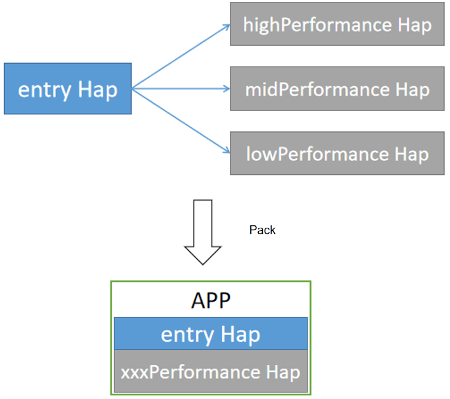

# ExtensionContext

The **ExtensionContext** module, inherited from **Context**, implements the context for Extension abilities.

This module provides APIs for accessing resources of a specific Extension ability. An Extension ability can use the context directly provided by **ExtensionContext** or that extended from **ExtensionContext**. For example, **ServiceExtension** uses **[ServiceExtensionContext](js-apis-service-extension-context.md)**, which extends the capabilities of starting, stopping, binding, and unbinding abilities based on **ExtensionContext**.

> **NOTE**
> 
>  - The initial APIs of this module are supported since API version 9. Newly added APIs will be marked with a superscript to indicate their earliest API version.
>  - The APIs of this module can be used only in the stage model.

## Attributes

**System capability**: SystemCapability.Ability.AbilityRuntime.Core

| Name| Type| Readable| Writable| Description| 
| -------- | -------- | -------- | -------- | -------- |
| currentHapModuleInfo | HapModuleInfo | Yes| No| Information about the HAP file<br>(See **api\bundle\hapModuleInfo.d.ts** in the **SDK** directory.) |
| config   | Configuration | Yes| No| Module configuration information.<br>(See **api\@ohos.application.Configuration.d.ts** in the **SDK** directory.)|
| extensionAbilityInfo | [ExtensionAbilityInfo](js-apis-bundleManager-extensionAbilityInfo.md) | Yes| No| Extension ability information.<br>(See **api\bundle\extensionAbilityInfo.d.ts** in the **SDK** directory.)|

## When to Use
**ExtensionContext** provides information about an Extension ability, module, and HAP file. You can use the information based on service requirements. The following uses **ServiceExtension** as an example to describe a use case of **ExtensionContext**.

**Scenario description**
To adapt to devices with different performance, an application provides three modules: highPerformance, midPerformance, and lowPerformance. Each of them provides a Service Extension ability for the entry. During application installation, the application market installs the HAP file of the entry and the HAP file of the module that matches the device performance. During application running, the entry parses **ServiceExtensionContext.HapModuleInfo** to obtain the HAP file information and executes service logic based on this file.



**Example**

Define a **ServiceExtension** with the same name for the three modules.
``` js
import ServiceExtension from '@ohos.app.ability.ServiceExtensionAbility'
import Want from '@ohos.application.Want'
export default class TheServiceExtension extends ServiceExtension {
    onCreate(want:Want) {
        console.log('ServiceAbility onCreate, want: ' + want.abilityName);
        // Pass ExtensionContext to entry via globalThis.
        globalThis.ExtensionContext = this.context;
    }

    onRequest(want, startId) {
        console.log('ServiceAbility onRequest, want: ' + want.abilityName + ', startId: ' + startId);
    }

    onConnect(want) {
        console.log('ServiceAbility onConnect, want:' + want.abilityName);
        return null;
    }

    onDisconnect(want) {
        console.log('ServiceAbility onDisconnect, want:' + want.abilityName);
    }

    onDestroy() {
        console.log('ServiceAbility onDestroy');
    }
};
```

Start **ServiceExtension** within the **onCreate** callback of the main ability of the entry.
``` js
import Ability from '@ohos.app.ability.Ability'
export default class MainAbility extends Ability {
    onCreate(want, launchParam) {
        console.log("[Demo] MainAbility onCreate");
        let wantExt = {
            deviceId: "",
            bundleName: "com.example.TheServiceExtension",
            abilityName: "TheServiceExtension",
        };
        this.context.startServiceExtensionAbility(wantExt);
    }
};
```

Create a **ServiceModule.ts** file in the entry to execute service logic.
``` js
export default class ServiceModel {
    moduleName: string;

    constructor() {}

    executeTask() {
        if (globalThis.ExtensionContext == undefined) {
            console.log("ERROR, ServiceExtension does not exist");
            return;
        }

        var moduleInfo = globalThis.ExtensionContext.currentHapModuleInfo;
        this.moduleName = moduleInfo.name;
        // Execute service logic based on the module name, which differentiates devices with different performance.
        switch (this.moduleName) {
            case "highPerformance":
                console.log("This is high performance device.");
                // Execute the corresponding service logic.
                break;
            case "midPerformance":
                console.log("This is mid performance device.");
                // Execute the corresponding service logic.
                break;
            case "lowPerformance":
                console.log("This is low performance device.");
                // Execute the corresponding service logic.
                break;
            default:
                console.log("ERROR, invalid moduleName.");
                break;
        }
    }
};
```
