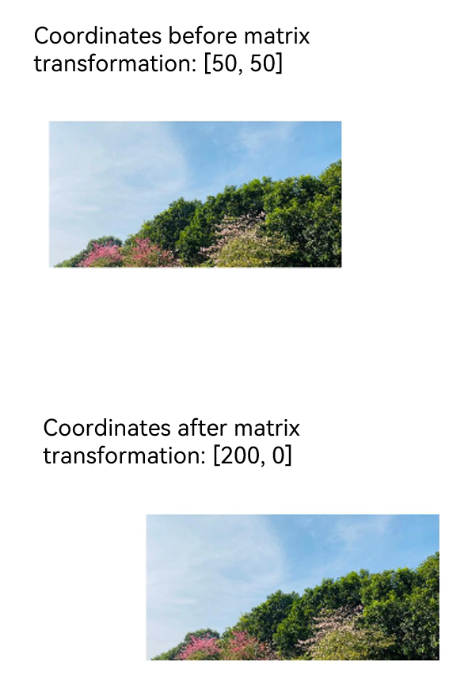

# @ohos.matrix4 (Matrix Transformation)

The **matrix4** module provides APIs for matrix transformation. You can use these APIs to translate, rotate, and scale images.

> **NOTE**
>
> The initial APIs of this module are supported since API version 7. Updates will be marked with a superscript to indicate their earliest API version.


## Modules to Import

```ts
import matrix4 from '@ohos.matrix4'
```


## matrix4.init

init(options: [number,number,number,number,number,number,number,number,number,number,number,number,number,number,number,number]): Matrix4Transit


Matrix constructor, which is used to create a 4 x 4 matrix by using the input parameter. Column-major order is used.

**System capability**: SystemCapability.ArkUI.ArkUI.Full

**Parameters**

| Name| Type                                                        | Mandatory| Description                                                        |
| ------ | ------------------------------------------------------------ | ---- | ------------------------------------------------------------ |
| option | [number,number,number,number,number,number,number,number,number,number,number,number,number,number,number,number] | Yes  | A number array whose length is 16 (4 x 4). For details, see **Description of a 4 x 4 matrix**.<br>Default value:<br>[1,&nbsp;0,&nbsp;0,&nbsp;0,<br>0,&nbsp;1,&nbsp;0,&nbsp;0,<br>0,&nbsp;0,&nbsp;1,&nbsp;0,<br>0,&nbsp;0,&nbsp;0,&nbsp;1] |

**Return value**

| Type                             | Description                        |
| --------------------------------- | ---------------------------- |
| [Matrix4Transit](#matrix4transit) | 4 x 4 matrix object created based on the input parameter.|

**Description of a 4 x 4 matrix**

| Name | Type    | Mandatory  | Description                  |
| ---- | ------ | ---- | -------------------- |
| m00  | number | Yes   | Scaling value of the x-axis. The default value is **1** for the identity matrix.     |
| m01  | number | Yes   | The second value, which is affected by the rotation of the x, y, and z axes.  |
| m02  | number | Yes   | The third value, which is affected by the rotation of the x, y, and z axes.  |
| m03  | number | Yes   | The fourth value, which is meaningless.              |
| m10  | number | Yes   | The fifth value, which is affected by the rotation of the x, y, and z axes.  |
| m11  | number | Yes   | Scaling value of the y-axis. The default value is **1** for the identity matrix.     |
| m12  | number | Yes   | The seventh value, which is affected by the rotation of the x, y, and z axes.  |
| m13  | number | Yes   | The eighth value, which is meaningless.              |
| m20  | number | Yes   | The ninth value, which is affected by the rotation of the x, y, and z axes.  |
| m21  | number | Yes   | The tenth value, which is affected by the rotation of the x, y, and z axes. |
| m22  | number | Yes   | Scaling value of the z-axis. The default value is **1** for the identity matrix.     |
| m23  | number | Yes   | Meaningless value.              |
| m30  | number | Yes   | Translation value of the x-axis, in px. The default value is **0** for the identity matrix.|
| m31  | number | Yes   | Translation value of the y-axis, in px. The default value is **0** for the identity matrix.|
| m32  | number | Yes   | Translation value of the z-axis, in px. The default value is **0** for the identity matrix.|
| m33  | number | Yes   | Valid in homogeneous coordinates, presenting the perspective projection effect.   |

**Example**

```ts
import matrix4 from '@ohos.matrix4'
// Create a 4 x 4 matrix.
let matrix = matrix4.init([1.0, 0.0, 0.0, 0.0,
                          0.0, 1.0, 0.0, 0.0,
                          0.0, 0.0, 1.0, 0.0,
                          0.0, 0.0, 0.0, 1.0])
@Entry
@Component
struct Tests {
  build() {
    Column() {
      Image($r("app.media.zh"))
        .width("40%")
        .height(100)
        .transform(matrix)
    }
  }
}
```


## matrix4.identity

identity(): Matrix4Transit


Constructs an identity matrix.

**System capability**: SystemCapability.ArkUI.ArkUI.Full

**Return value**

| Type                             | Description          |
| --------------------------------- | -------------- |
| [Matrix4Transit](#matrix4transit) | Identity matrix object.|

**Example**

```ts
// The effect of matrix 1 is the same as that of matrix 2.
import matrix4 from '@ohos.matrix4'
let matrix1 = matrix4.init([1.0, 0.0, 0.0, 0.0,
                          0.0, 1.0, 0.0, 0.0,
                          0.0, 0.0, 1.0, 0.0,
                          0.0, 0.0, 0.0, 1.0])
let matrix2 = matrix4.identity()
@Entry
@Component
struct Tests {
  build() {
    Column() {
      Image($r("app.media.zh"))
        .width("40%")
        .height(100)
        .transform(matrix1)
      Image($r("app.media.zh"))
        .width("40%")
        .height(100)
        .margin({ top: 150 })
        .transform(matrix2)
    }
  }
}
```


## matrix4.copy

copy(): Matrix4Transit


Copies this matrix object.

**System capability**: SystemCapability.ArkUI.ArkUI.Full

**Return value**

| Type                             | Description                |
| --------------------------------- | -------------------- |
| [Matrix4Transit](#matrix4transit) | Copy object of the current matrix.|

**Example**

```ts
// xxx.ets
import matrix4 from '@ohos.matrix4'

@Entry
@Component
struct Test {
  private matrix1 = matrix4.identity().translate({ x: 100 })
  private matrix2 = this.matrix1.copy().scale({ x: 2 })

  build() {
    Column() {
      Image($r("app.media.bg1"))
        .width("40%")
        .height(100)
        .transform(this.matrix1)
      Image($r("app.media.bg2"))
        .width("40%")
        .height(100)
        .margin({ top: 50 })
        .transform(this.matrix2)
    }
  }
}
```


## Matrix4Transit


### combine

combine(options: Matrix4Transit): Matrix4Transit


Combines the effects of two matrices to generate a new matrix object.

**System capability**: SystemCapability.ArkUI.ArkUI.Full

**Parameters**

| Name| Type                             | Mandatory| Description              |
| ------ | --------------------------------- | ---- | ------------------ |
| option | [Matrix4Transit](#matrix4transit) | Yes  | Matrix object to be combined.|

**Return value**

| Type                             | Description              |
| --------------------------------- | ------------------ |
| [Matrix4Transit](#matrix4transit) | Object after matrix combination.|

**Example**

```ts
// xxx.ets
import matrix4 from '@ohos.matrix4'

@Entry
@Component
struct Test {
  private matrix1 = matrix4.identity().translate({ x: 200 }).copy()
  private matrix2 = matrix4.identity().scale({ x: 2 }).copy()

  build() {
    Column() {
      // Before matrix transformation
      Image($r("app.media.icon"))
        .width("40%")
        .height(100)
        .margin({ top: 50 })
      // Translate the x-axis by 200px, and then scale it twice to obtain the resultant matrix.
      Image($r("app.media.icon"))
        .transform(this.matrix1.combine(this.matrix2))
        .width("40%")
        .height(100)
        .margin({ top: 50 })
    }
  }
}
```


### invert

invert(): Matrix4Transit

Inverts this matrix object.

**System capability**: SystemCapability.ArkUI.ArkUI.Full

**Return value**

| Type                             | Description                  |
| --------------------------------- | ---------------------- |
| [Matrix4Transit](#matrix4transit) | Inverse matrix object of the current matrix.|

**Example**

```ts
import matrix4 from '@ohos.matrix4'
// The effect of matrix 1 (width scaled up by 2x) is opposite to that of matrix 2 (width scaled down by 2x).
let matrix1 = matrix4.identity().scale({ x: 2 })
let matrix2 = matrix1.invert()

@Entry
@Component
struct Tests {
  build() {
    Column() {
      Image($r("app.media.zh"))
        .width(200)
        .height(100)
        .transform(matrix1)
        .margin({ top: 100 })
      Image($r("app.media.zh"))
        .width(200)
        .height(100)
        .margin({ top: 150 })
        .transform(matrix2)
    }
  }
}
```


### translate

translate(options: TranslateOption): Matrix4Transit

Translates this matrix object along the x, y, and z axes.

**System capability**: SystemCapability.ArkUI.ArkUI.Full

**Parameters**

| Name| Type                               | Mandatory| Description          |
| ------ | ----------------------------------- | ---- | -------------- |
| option | [TranslateOption](#translateoption) | Yes  | Translation configuration.|

**Return value**

| Type                             | Description                        |
| --------------------------------- | ---------------------------- |
| [Matrix4Transit](#matrix4transit) | Matrix object after the translation.|

**Example**

```ts
// xxx.ets
import matrix4 from '@ohos.matrix4'

@Entry
@Component
struct Test {
  private matrix1 = matrix4.identity().translate({ x: 100, y: 200, z: 30 })

  build() {
    Column() {
      Image($r("app.media.bg1")).transform(this.matrix1)
        .width("40%")
        .height(100)
    }
  }
}
```


### scale

scale(options: ScaleOption): Matrix4Transit


Scales this matrix object along the x, y, and z axes.

**System capability**: SystemCapability.ArkUI.ArkUI.Full

**Parameters**

| Name| Type                       | Mandatory| Description          |
| ------ | --------------------------- | ---- | -------------- |
| option | [ScaleOption](#scaleoption) | Yes  | Scaling configuration.|


**Return value**

| Type                             | Description                        |
| --------------------------------- | ---------------------------- |
| [Matrix4Transit](#matrix4transit) | Matrix object after the scaling.|

**Example**

```ts
// xxx.ets
import matrix4 from '@ohos.matrix4'
@Entry
@Component
struct Test {
  private matrix1 = matrix4.identity().scale({ x:2, y:3, z:4, centerX:50, centerY:50 })

  build() {
    Column() { 
      Image($r("app.media.bg1")).transform(this.matrix1)
        .width("40%")
        .height(100)
    }
  }
}
```


### rotate

rotate(options: RotateOption): Matrix4Transit


Rotates this matrix object along the x, y, and z axes.

**System capability**: SystemCapability.ArkUI.ArkUI.Full

**Parameters**

| Name| Type                         | Mandatory| Description          |
| ------ | ----------------------------- | ---- | -------------- |
| option | [RotateOption](#rotateoption) | Yes  | Rotation configuration.|


**Return value**

| Type                             | Description                        |
| --------------------------------- | ---------------------------- |
| [Matrix4Transit](#matrix4transit) | Matrix object after the rotation.|

**Example**

```ts
// xxx.ets
import matrix4 from '@ohos.matrix4'

@Entry
@Component
struct Test {
  private matrix1 = matrix4.identity().rotate({ x: 1, y: 1, z: 2, angle: 30 })

  build() {
    Column() {
      Image($r("app.media.bg1")).transform(this.matrix1)
        .width("40%")
        .height(100)
    }.width("100%").margin({ top: 50 })
  }
}
```


### transformPoint

transformPoint(options: [number, number]): [number, number]


Applies the current transformation effect to a coordinate point.

**System capability**: SystemCapability.ArkUI.ArkUI.Full

**Parameters**

| Name| Type            | Mandatory| Description              |
| ------ | ---------------- | ---- | ------------------ |
| option | [number, number] | Yes  | Point to be transformed.|

**Return value**

| Type            | Description                       |
| ---------------- | --------------------------- |
| [number, number] | Point object after matrix transformation|

**Example**

```ts
// xxx.ets
import matrix4 from '@ohos.matrix4'

@Entry
@Component
struct Test {
  private originPoint: [number, number] = [50, 50]
  private matrix_1 = matrix4.identity().translate({ x: 150, y: -50 })
  private transformPoint = this.matrix_1.transformPoint(this.originPoint)
  private matrix_2 = matrix4.identity().translate({ x: this.transformPoint[0], y: this.transformPoint[1] })

  build() {
    Column() {
      Text(`Coordinates before matrix transformation: [${this.originPoint}]`)
        .fontSize(16)
      Image($r("app.media.image"))
        .width('600px')
        .height('300px')
        .margin({ top: 50 })
      Text(`Coordinates after matrix transformation: [${this.transformPoint}]`)
        .fontSize(16)
        .margin({ top: 100 })
      Image($r("app.media.image"))
        .width('600px')
        .height('300px')
        .margin({ top: 50 })
        .transform(this.matrix_2)
    }.width("100%").padding(50)
  }
}
```



## TranslateOption

**System capability**: SystemCapability.ArkUI.ArkUI.Full

| Name| Type  | Mandatory| Description                                                       |
| ---- | ------ | ---- | ----------------------------------------------------------- |
| x    | number | No  | Translation distance along the x-axis, in px.<br>Default value: **0**<br>Value range: (-∞, +∞)|
| y    | number | No  | Translation distance along the y-axis, in px.<br>Default value: **0**<br>Value range: (-∞, +∞)|
| z    | number | No  | Translation distance along the z-axis, in px.<br>Default value: **0**<br>Value range: (-∞, +∞)|

## ScaleOption

**System capability**: SystemCapability.ArkUI.ArkUI.Full

| Name   | Type  | Mandatory| Description                                                        |
| ------- | ------ | ---- | ------------------------------------------------------------ |
| x       | number | No  | Scaling multiple along the x-axis. If the value is greater than 1, the image is scaled up along the x-axis. If the value is less than 1, the image is scaled down along the x-axis.<br>Default value: **1**<br>Value range: [0, +∞)<br>**NOTE**<br>A value less than 0 evaluates to the default value.|
| y       | number | No  | Scaling multiple along the y-axis. If the value is greater than 1, the image is scaled up along the y-axis. If the value is less than 1, the image is scaled down along the y-axis.<br>Default value: **1**<br>Value range: [0, +∞)<br>**NOTE**<br>A value less than 0 evaluates to the default value.|
| z       | number | No  | Scaling multiple along the z-axis. If the value is greater than 1, the image is scaled up along the z-axis. If the value is less than 1, the image is scaled down along the z-axis.<br>Default value: **1**<br>Value range: [0, +∞)<br>**NOTE**<br>A value less than 0 evaluates to the default value.|
| centerX | number | No  | X coordinate of the center point.<br>Default value: **0**<br>Value range: (-∞, +∞)   |
| centerY | number | No  | Y coordinate of the center point.<br>Default value: **0**<br>Value range: (-∞, +∞)   |

## RotateOption

**System capability**: SystemCapability.ArkUI.ArkUI.Full

| Name   | Type  | Mandatory| Description                                                   |
| ------- | ------ | ---- | ------------------------------------------------------- |
| x       | number | No  | X coordinate of the rotation axis vector.<br>Default value: **1**<br>Value range: (-∞, +∞)|
| y       | number | No  | Y coordinate of the rotation axis vector.<br>Default value: **1**<br>Value range: (-∞, +∞)|
| z       | number | No  | Z coordinate of the rotation axis vector.<br>Default value: **1**<br>Value range: (-∞, +∞)|
| angle   | number | No  | Rotation angle.<br>Default value: **0**                               |
| centerX | number | No  | X coordinate of the center point.<br>Default value: **0**                      |
| centerY | number | No  | Y coordinate of the center point.<br>Default value: **0**                      |
