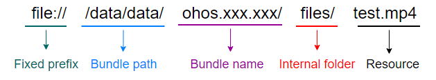

# Media

The multimedia subsystem provides a set of simple and easy-to-use APIs for you to access the system and use media resources.

This subsystem offers various media services covering audio and video, which provide the following capabilities:

- Audio playback ([AudioPlayer](#audioplayer))
- Audio recording ([AudioRecorder](#audiorecorder))

The following capabilities will be provided in the future: video playback, video recording, data source audio/video playback, audio/video encoding and decoding, container encapsulation and decapsulation, and media capability query.

## Modules to Import

```js
import media from '@ohos.multimedia.media';
```

##  media.createAudioPlayer

createAudioPlayer(): [AudioPlayer](#audioplayer)

Creates an **AudioPlayer** instance in synchronous mode.

**Return values**

| Type| Description|
| --------------------------- | ------------------------------------------------------------ |
| [AudioPlayer](#audioplayer) | Returns the **AudioPlayer** instance if the operation is successful; returns **null** otherwise. After the instance is created, you can start, pause, or stop audio playback.|

**Example**

```js
var audioPlayer = media.createAudioPlayer();
```

## media.createAudioPlayerAsync<sup>8+</sup>

createAudioPlayerAsync(callback: AsyncCallback\<[AudioPlayer](#audioplayer)>): void

Creates an **AudioPlayer** instance in asynchronous mode. This method uses a callback to return the result.

**Parameters**

| Name| Type| Mandatory| Description|
| -------- | ------------------------------------------ | ---- | ------------------------------ |
| callback | AsyncCallback<[AudioPlayer](#audioplayer)> | Yes| Callback used to return the **AudioPlayer** instance created.|

**Example**

```js
media.createAudioPlayerAsync((error, audio) => {
   if (typeof(audio) != 'undefined') {
       audioPlayer = audio;
       console.info('audio createAudioPlayerAsync success');
   } else {
       console.info(`audio createAudioPlayerAsync fail, error:${error.message}`);
   }
});
```

## media.createAudioPlayerAsync<sup>8+</sup>

createAudioPlayerAsync: Promise<[AudioPlayer](#audioplayer)>

Creates an **AudioPlayer** instance in asynchronous mode. This method uses a promise to return the result.

**Return values**

| Type| Description|
| ------------------------------------ | ----------------------------------- |
| Promise<[AudioPlayer](#audioplayer)> | Promise used to return the **AudioPlayer** instance created.|

**Example**

```js
function failureCallback(error) {
    console.info(`audio failureCallback, error:${error.message}`);
}
function catchCallback(error) {
    console.info(`audio catchCallback, error:${error.message}`);
}

await media.createAudioPlayerAsync.then((audio) => {
    if (typeof(audio) != 'undefined') {
       audioPlayer = audio;
       console.info('audio createAudioPlayerAsync success');
   } else {
       console.info('audio createAudioPlayerAsync fail');
   }
}, failureCallback).catch(catchCallback);
```

## media.createAudioRecorder
createAudioRecorder(): AudioRecorder

Creates an **AudioRecorder** instance to control audio recording.

**Return values**

| Type| Description|
| ------------------------------- | ----------------------------------------- |
| [AudioRecorder](#audiorecorder) | Returns the **AudioRecorder** instance if the operation is successful; returns **null** otherwise.|

**Example**

```
var audiorecorder = media.createAudioRecorder(); 
```

## MediaErrorCode<sup>8+</sup>

Enumerates the media error codes.

| Name| Value| Description|
| -------------------------- | ---- | -------------------------------------- |
| MSERR_OK                   | 0    | The operation is successful.|
| MSERR_NO_MEMORY            | 1    | Failed to allocate memory. The system may have no available memory.|
| MSERR_OPERATION_NOT_PERMIT | 2    | No permission to perform this operation.|
| MSERR_INVALID_VAL          | 3    | Invalid input parameter.|
| MSERR_IO                   | 4    | An I/O error occurs.|
| MSERR_TIMEOUT              | 5    | The operation times out.|
| MSERR_UNKNOWN              | 6    | An unknown error occurs.|
| MSERR_SERVICE_DIED         | 7    | Invalid server.|
| MSERR_INVALID_STATE        | 8    | The operation is not allowed in the current state.|
| MSERR_UNSUPPORTED          | 9    | The operation is not supported in the current version.|

## MediaType<sup>8+</sup>

Enumerates the media types.

| Name| Value| Description|
| ------------------- | ---- | ------------------ |
| MEDIA_TYPE_AUD      | 0    | Media.|
| MEDIA_TYPE_VID      | 1    | Video.|
| MEDIA_TYPE_SUBTITLE | 2    | Subtitle. (under development)|

## CodecMimeType<sup>8+</sup>

Enumerates the codec MIME types.

| Name| Value| Description|
| ------------ | ----------------- | ------------------------ |
| AUDIO_MPEG   | "audio/mpeg"      | Audio in MPEG format.|
| AUDIO_AAC    | "audio/mp4a-latm" | Audio in MP4A-LATM format.|
| AUDIO_VORBIS | "audio/vorbis"    | Audio in Vorbis format.|
| AUDIO_FLAC   | "audio/flac"      | Audio in FLAC format.|

## MediaDescriptionKey<sup>8+</sup>

Enumerates the media description keys.

| Name| Value| Description|
| ------------------------ | --------------- | ------------------------------------------------------------ |
| MD_KEY_TRACK_INDEX       | "track_index"   | Track index, which is a number.|
| MD_KEY_TRACK_TYPE        | "track_type"    | Track type, which is a number. For details, see [MediaType](#mediatype8).|
| MD_KEY_CODEC_MIME        | "codec_mime"    | Codec MIME type, which is a string.|
| MD_KEY_DURATION          | "duration"      | Media duration, which is a number, in units of ms.|
| MD_KEY_BITRATE           | "bitrate"       | Bit rate, which is a number, in units of bit/s.|
| MD_KEY_WIDTH             | "width"         | Video width, which is a number, in units of pixel.|
| MD_KEY_HEIGHT            | "height"        | Video height, which is a number, in units of pixel.|
| MD_KEY_FRAME_RATE        | "frame_rate"    | Video frame rate, which is a number, in units of 100 fps.|
| MD_KEY_AUD_CHANNEL_COUNT | "channel_count" | Number of audio channels, which is a number.|
| MD_KEY_AUD_SAMPLE_RATE   | "sample_rate"   | Sampling rate, which is a number, in units of Hz.|

## BufferingInfoType<sup>8+</sup>

Enumerates the buffering event types.

| Name| Value| Description|
| ----------------- | ---- | -------------------------- |
| BUFFERING_START   | 1    | Buffering starts.|
| BUFFERING_END     | 2    | Buffering ends.|
| BUFFERING_PERCENT | 3    | Buffering progress, in percent.|
| CACHED_DURATION   | 4    | Cache duration, in milliseconds.|

## AudioPlayer

Manages and plays audio. Before calling a method of the **AudioPlayer** class, you must call [createAudioPlayer()](#media.createaudioplayer) or [createAudioPlayerAsync()](#media.createaudioplayerasync8) to create an [AudioPlayer](#audioplayer) instance.

For details about the audio playback demo, see [Audio Playback Development](.../media/audio-playback.md).

### Attributes<a name=audioplayer_Attributes></a>

| Name| Type| Readable| Writable| Description|
| ----------- | ------------------------- | ---- | ---- | ------------------------------------------------------------ |
| src         | string                    | Yes| Yes| Audio media URI. The mainstream audio formats (MP4, AAC, MP3, and OGG) are supported. <br>**Examples of supported URIs**:<br>1. Local absolute path: file:///data/data/ohos.xxx.xxx/files/test.mp4<br><br>2. HTTP network playback path (under development)<br>3. HLS network playback path (under development)<br>4. FD playback (under development)<br>**Precautions**: <br>Media files can be played only after the read permission is granted.|
| loop        | boolean                   | Yes| Yes| Whether to loop audio playback. The value **true** means to loop audio playback, and **false** means the opposite.|
| currentTime | number                    | Yes| No| Current audio playback position.|
| duration    | number                    | Yes| No| Audio duration.|
| state       | [AudioState](#audiostate) | Yes| No| Audio playback state.|

### play<a name=audioplayer_play></a>

play(): void

Starts to play audio resources. This method can be called only after the **dataLoad** event is triggered.

**Example**

```js
audioPlayer.on('play', () => {    // Set the 'play' event callback.
    console.log('audio play success');
});
audioPlayer.play();
```

### pause<a name=audioplayer_pause></a>

pause(): void

Pauses audio playback.

**Example**

```js
audioPlayer.on('pause', () => {    // Set the 'pause' event callback.
    console.log('audio pause success');
});
audioPlayer.pause();
```

### stop<a name=audioplayer_stop></a>

stop(): void

Stops audio playback.

**Example**

```js
audioPlayer.on('stop', () => {    // Set the 'stop' event callback.
    console.log('audio stop success');
});
audioPlayer.stop();
```

### reset<sup>7+</sup><a name=audioplayer_reset></a>

reset(): void

Switches the audio resource to be played.

**Example**

```js
audioPlayer.on('reset', () => {    // Set the 'reset' event callback.
    console.log('audio reset success');
});
audioPlayer.reset();
```

### seek<a name=audioplayer_seek></a>

seek(timeMs: number): void

Seeks to the specified playback position.

**Parameters**

| Name| Type| Mandatory| Description|
| ------ | ------ | ---- | ------------------------------ |
| timeMs | number | Yes| Position to seek to, in milliseconds.|

**Example**

```js
audioPlayer.on('timeUpdate', (seekDoneTime) => {    // Set the 'timeUpdate' event callback.
    if (typeof (seekDoneTime) == 'undefined') {
        console.info('audio seek fail');
        return;
    }
    console.log('audio seek success. seekDoneTime: ' + seekDoneTime);
});
audioPlayer.seek(30000); // Seek to 30000 ms.
```

### setVolume<a name=audioplayer_setvolume></a>

setVolume(vol: number): void

Sets the volume.

**Parameters**

| Name| Type| Mandatory| Description|
| ------ | ------ | ---- | ------------------------------------------------------------ |
| vol    | number | Yes| Relative volume. The value ranges from 0.00 to 1.00. The value **1** indicates the maximum volume (100%).|

**Example**

```js
audioPlayer.on('volumeChange', () => {    // Set the 'volumeChange' event callback.
    console.log('audio volumeChange success');
});
audioPlayer.setVolume(1);    // Set the volume to 100%.
```

### release<a name=audioplayer_release></a>

release(): void

Releases this **AudioPlayer** instance.

**Example**

```js
audioPlayer.release();
audioPlayer = undefined;
```

### getTrackDescription<sup>8+</sup><a name=audioplayer_gettrackdescription1></a>

getTrackDescription(callback: AsyncCallback<Array<[MediaDescription](#mediadescription8)>>): void

Obtains the audio track information. This method uses a callback to return the result.

**Parameters**

| Name| Type| Mandatory| Description|
| -------- | ------------------------------------------------------------ | ---- | -------------------------- |
| callback | AsyncCallback<Array<[MediaDescription](#mediadescription8)>> | Yes| Callback used to return the audio track information obtained.|

**Example**

```js
function printfDescription(obj) {
    for (let item in obj) {
        let property = obj[item];
        console.info('audio key is ' + item);
        console.info('audio value is ' + property);
    }
}

audioPlayer.getTrackDescription((error, arrlist) => {
    if (typeof (arrlist) != 'undefined') {
        for (let i = 0; i < arrlist.length; i++) {
            printfDescription(arrlist[i]);
        }
    } else {
        console.log(`audio getTrackDescription fail, error:${error.message}`);
    }
});
```

### getTrackDescription<sup>8+</sup><a name=audioplayer_gettrackdescription2></a>

getTrackDescription(): Promise<Array<[MediaDescription](#mediadescription8)>>

Obtains the audio track information. This method uses a promise to return the result.

**Return values**

| Type| Description|
| ------------------------------------------------------ | ------------------------------- |
| Promise<Array<[MediaDescription](#mediadescription8)>> | Promise used to return the audio track information obtained.|

**Example**

```js
function printfDescription(obj) {
    for (let item in obj) {
        let property = obj[item];
        console.info('audio key is ' + item);
        console.info('audio value is ' + property);
    }
}
function failureCallback(error) {
    console.info(`audio failureCallback, error:${error.message}`);
}
function catchCallback(error) {
    console.info(`audio catchCallback, error:${error.message}`);
}

await audioPlayer.getTrackDescription.then((arrlist) => {
    if (typeof (arrlist) != 'undefined') {
        arrayDescription = arrlist;
    } else {
        console.log('audio getTrackDescription fail');
    }
}, failureCallback).catch(catchCallback);
for (let i = 0; i < arrayDescription.length; i++) {
    printfDescription(arrayDescription[i]);
}
```

### on('bufferingUpdate')<sup>8+</sup>

on(type: 'bufferingUpdate', callback: (infoType: [BufferingInfoType](#bufferinginfotype8), value: number) => void): void

Subscribes to the audio buffering update event.

**Parameters**

| Name| Type| Mandatory| Description|
| -------- | ------------------------------------------------------------ | ---- | ------------------------------------------------------------ |
| type     | string                                                       | Yes| Type of the event to subscribe to, which is 'bufferingUpdate' in this example.|
| callback | (infoType: [BufferingInfoType](#bufferinginfotype8), value: number) => void | Yes| Callback invoked when the event is triggered. <br>When [BufferingInfoType](#bufferinginfotype8) is set to **BUFFERING_PERCENT** or **CACHED_DURATION**, **value** is valid. Otherwise, **value** is fixed at **0**.|

**Example**

```js
audioPlayer.on('bufferingUpdate', (infoType, value) => {
    console.log('audio bufferingInfo type: ' + infoType);
    console.log('audio bufferingInfo value: ' + value);
});
```

 ### on('play' | 'pause' | 'stop' | 'reset' | 'dataLoad' | 'finish' | 'volumeChange')

on(type: 'play' | 'pause' | 'stop' | 'reset' | 'dataLoad' | 'finish' | 'volumeChange', callback: () => void): void

Subscribes to the audio playback events.

**Parameters**

| Name| Type| Mandatory| Description|
| -------- | ---------- | ---- | ------------------------------------------------------------ |
| type     | string     | Yes| Type of the event to subscribe to. The following events are supported: 'play' \| 'pause' \| 'stop' \| 'reset' \| 'dataLoad' \| 'finish' \| 'volumeChange' <br>- The 'play' event is triggered when the [play()](#audioplayer_play) method is called and audio playback starts. <br>- The 'pause' event is triggered when the [pause()](#audioplayer_pause) method is called and audio playback is paused. <br>- The 'stop' event is triggered when the [stop()](#audioplayer_stop) method is called and audio playback stops. <br>- The 'reset' event is triggered when the [reset()](#audioplayer_reset) method is called and audio playback is reset. <br>- The 'dataLoad' event is triggered when the audio data is loaded, that is, when the **src** attribute is configured. <br>- The 'finish' event is triggered when the audio playback is finished. <br>- The 'volumeChange' event is triggered when the [setVolume()](#audioplayer_setvolume) method is called and the playback volume is changed.|
| callback | () => void | Yes| Callback invoked when the event is triggered.|

**Example**

```js
let audioPlayer = media.createAudioPlayer();  // Create an AudioPlayer instance.
audioPlayer.on('dataLoad', () => {            // Set the 'dataLoad' event callback, which is triggered when the src attribute is set successfully.
	console.info('audio set source success');
    audioPlayer.play();                       // Start the playback and trigger the 'play' event callback.
});
audioPlayer.on('play', () => {                // Set the 'play' event callback.
	console.info('audio play success');
    audioPlayer.seek(30000);                  // Call the seek() method and trigger the 'timeUpdate' event callback.
});
audioPlayer.on('pause', () => {               // Set the 'pause' event callback.
	console.info('audio pause success');
    audioPlayer.stop();                       // Stop the playback and trigger the 'stop' event callback.
});
audioPlayer.on('reset', () => {               // Set the 'reset' event callback.
	console.info('audio reset success');
    audioPlayer.release();                    // Release the AudioPlayer instance.
    audioPlayer = undefined;
});
audioPlayer.on('timeUpdate', (seekDoneTime) => {  // Set the 'timeUpdate' event callback.
	if (typeof(seekDoneTime) == "undefined") {
        console.info('audio seek fail');
        return;
    }
    console.info('audio seek success, and seek time is ' + seekDoneTime);
    audioPlayer.setVolume(0.5);                // Set the volume to 50% and trigger the 'volumeChange' event callback.
});
audioPlayer.on('volumeChange', () => {         // Set the 'volumeChange' event callback.
	console.info('audio volumeChange success');
    audioPlayer.pause();                       // Pause the playback and trigger the 'pause' event callback.
});
audioPlayer.on('finish', () => {               // Set the 'finish' event callback.
	console.info('audio play finish');
    audioPlayer.stop();                        // Stop the playback and trigger the 'stop' event callback.
});
audioPlayer.on('error', (error) => {           // Set the 'error' event callback.
	console.info(`audio error called, errName is ${error.name}`);
    console.info(`audio error called, errCode is ${error.code}`);
    console.info(`audio error called, errMessage is ${error.message}`);
});
audioPlayer.src = 'file:///data/data/ohos.xxx.xxx/files/test.mp4';  // Set the src attribute and trigger the 'dataLoad' event callback.
```

### on('timeUpdate')

on(type: 'timeUpdate', callback: Callback\<number>): void

Subscribes to the 'timeUpdate' event.

**Parameters**

| Name| Type| Mandatory| Description|
| -------- | ----------------- | ---- | ------------------------------------------------------------ |
| type     | string            | Yes| Type of the event to subscribe to, which is 'timeUpdate' in this method. <br>The 'timeUpdate' event is triggered when the [seek()](#audioplayer_seek) method is called.|
| callback | Callback\<number> | Yes| Callback invoked when the event is triggered. The input parameter of the callback is the time when the seek operation is successful.|

**Example**

```js
audioPlayer.on('timeUpdate', (seekDoneTime) => {    // Set the 'timeUpdate' event callback.
    if (typeof (seekDoneTime) == 'undefined') {
        console.info('audio seek fail');
        return;
    }
    console.log('audio seek success. seekDoneTime: ' + seekDoneTime);
});
audioPlayer.seek(30000); // Seek to 30000 ms.
```

### on('error')

on(type: 'error', callback: ErrorCallback): void

Subscribes to the audio playback error event.

**Parameters**

| Name| Type| Mandatory| Description|
| -------- | ------------- | ---- | ------------------------------------------------------------ |
| type     | string        | Yes| Type of the event to subscribe to, which is 'error' in this method. <br>The 'error' event is triggered when an error occurs during audio playback.|
| callback | ErrorCallback | Yes| Callback invoked when the event is triggered.|

**Example**

```js
audioPlayer.on('error', (error) => {      // Set the error event callback.
	console.info(`audio error called, errName is ${error.name}`);      // Print the error name.
    console.info(`audio error called, errCode is ${error.code}`);      // Print the error code.
    console.info(`audio error called, errMessage is ${error.message}`);// Print the detailed description of the error type.
});
audioPlayer.setVolume(3); // Set volume to an invalid value to trigger the 'error' event.
```

## AudioState

Describes the audio playback state. You can obtain the state through the **state** attribute.

| Name| Type| Description|
| ------------------ | ------ | -------------- |
| idle               | string | Audio playback is idle.|
| playing            | string | Audio playback is in progress.|
| paused             | string | Audio playback is paused.|
| stopped            | string | Audio playback is stopped.|
| error<sup>8+</sup> | string | Audio playback is in the error state.|

## MediaDescription<sup>8+</sup>

### [key : string] : any

Defines media information in key-value mode.

| Name| Type| Description|
| ----- | ------ | ------------------------------------------------------------ |
| key   | string | Key of the media information. For details about the keys, see [MediaDescriptionKey](#mediadescriptionkey8).|
| value | any    | Value of the key. For details about the values, see [MediaDescriptionKey](#mediadescriptionkey8).|

**Example**

```js
function printfItemDescription(obj, key) {
    let property = obj[key];
    console.info('audio key is ' + key);
    console.info('audio value is ' + property);
}

audioPlayer.getTrackDescription((error, arrlist) => {
    if (typeof (arrlist) != 'undefined') {
        for (let i = 0; i < arrlist.length; i++) {
            printfItemDescription(arrlist[i], MD_KEY_TRACK_TYPE);  // Print the MD_KEY_TRACK_TYPE value of each track.
        }
    } else {
        console.log(`audio getTrackDescription fail, error:${error.message}`);
    }
});
```

## AudioRecorder

Implements audio recording. Before calling a method of the **AudioRecorder** class, you must call [createAudioRecorder()](#createaudiorecorder-audiorecorder) to create an **AudioRecorder** instance.

### prepare

prepare(config: AudioRecorderConfig): void

Prepares for recording.

**Parameters**

| Name| Type| Mandatory| Description|
| ------ | ------------------------------------------- | ---- | ------------------------------------------------------------ |
| config | [AudioRecorderConfig](#audiorecorderconfig) | Yes| Recording parameters, including the audio output URI, encoding format, sampling rate, and number of audio channels.|

**Example**

```
let audioRecorderConfig = {
    audioEncoder : AAC_LC ,
    audioEncodeBitRate : 22050,
    audioSampleRate : 22050,
    numberOfChannels : 2,
    format : AAC_ADTS,
    uri : 'file:///data/accounts/account_0/appdata/appdata/recorder/test.m4a',
}
audiorecorder.prepare(audioRecorderConfig)
```


### start

start(): void

Starts audio recording.

**Example**

```
audiorecorder.start();
```

### stop

stop(): void

Stops audio recording.

**Example**

```
audiorecorder.stop();
```

### release

release(): void

Releases this **AudioRecorder** instance.

**Example**

```
audiorecorder.release();
```

### reset

reset(): void

Resets audio recording.

Before resetting audio recording, you must call **stop()** to stop recording. After audio recording is reset, you must call **prepare()** to set the recording configurations for another recording.

**Example**

```
audiorecorder.reset();
```

### on('prepare' | 'start' |  'stop' | 'release' | 'reset')

on(type: 'prepare' | 'start' | 'stop' | 'release' | 'reset', callback: () => void): void

Subscribes to the audio recording events.

**Parameters**

| Name| Type| Mandatory| Description|
| -------- | -------- | ---- | ------------------------------------------------------------ |
| type     | string   | Yes| Type of the event to subscribe to. The following events are supported: 'prepare'\|'start'\|'stop'\|'release'\|'reset' <br/>- The 'prepare' event is triggered when audio recording preparation is complete. <br/>- The 'start' event is triggered when audio recording starts. <br/>- The 'stop' event is triggered when audio recording is stopped. <br/>- The 'release' event is triggered when the resources related to audio recording are released. <br/>- The 'reset' event is triggered when audio recording is reset.|
| callback | function | Yes| Callback invoked when the event is triggered.|

**Example**

```
audiorecorder.on('prepare', () => {
  console.log('Preparation succeeded.');
  audiorecorder.start();
});
```

### on('error')

on(type: 'error', callback: ErrorCallback): void

Subscribes to the audio recording error event.

**Parameters**

| Name| Type| Mandatory| Description|
| -------- | ------------- | ---- | ------------------------------------------------------------ |
| type     | string        | Yes| Type of the event to subscribe to, which is 'error' in this method. <br/>The 'error' event is triggered when an error occurs during audio recording.|
| callback | ErrorCallback | Yes| Callback invoked when the event is triggered.|


## AudioRecorderConfig

Describes audio recording configurations.

| Name| Type| Mandatory| Description|
| ------------------ | --------------------------------------- | ---- | ------------------------------------------------------------ |
| audioEncoder       | [AudioEncoder](#audioencoder)           | No| Audio encoding format. The default value is **AAC_LC**.|
| audioEncodeBitRate | number                                  | No| Audio encoding bit rate. The default value is **48000**.|
| audioSampleRate    | number                                  | No| Audio sampling rate. The default value is **48000**.|
| numberOfChannels   | number                                  | No| Number of audio channels. The default value is **2**.|
| format             | [AudioOutputFormat](#audiooutputformat) | No| Audio output format. The default value is **MPEG_4**.|
| uri                | string                                  | Yes| Audio output URI. The following URI types are supported:<br/> 1. Absolute file path: file:///data/data/ohos.xxx.xxx/cache/test.mp4<br/>2. FD path: file://1&nbsp;(fd&nbsp;number)|


## AudioEncoder

Enumerates the audio encoding formats.

| Name| Default Value| Description|
| ------ | ------ | ------------------------------------------------------------ |
| AAC_LC | 3      | Advanced Audio Coding Low Complexity (AAC-LC).|


## AudioOutputFormat

Enumerates the audio output formats.

| Name| Default Value| Description|
| -------- | ------ | ------------------------------------------------------------ |
| MPEG_4   | 2      | MPEG-4.|
| AAC_ADTS | 6      | Audio Data Transport Stream (ADTS), which is a transport stream format of AAC-based audio.|
