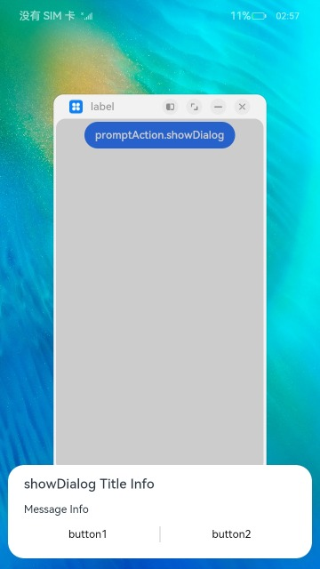
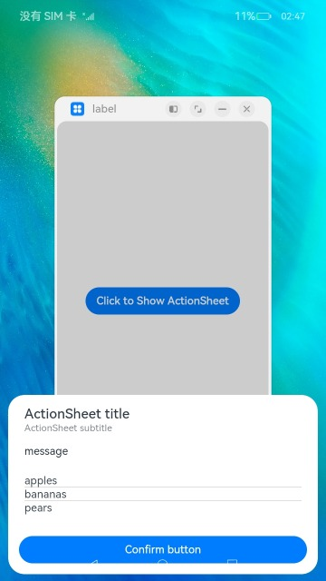

# @ohos.promptAction (Prompt)

The **PromptAction** module provides APIs for creating and showing toasts, dialog boxes, and action menus.

> **NOTE**
>
> The initial APIs of this module are supported since API version 9. Newly added APIs will be marked with a superscript to indicate their earliest API version.
>
> This module cannot be used in the file declaration of the [UIAbility](./js-apis-app-ability-uiAbility.md). In other words, the APIs of this module can be used only after a component instance is created; they cannot be called in the lifecycle of the UIAbility.
>
> The functionality of this module depends on UI context. This means that the APIs of this module cannot be used where the UI context is unclear. For details, see [UIContext](./js-apis-arkui-UIContext.md#uicontext).
>
> Since API version 10, you can use the [getPromptAction](./js-apis-arkui-UIContext.md#getpromptaction) API in [UIContext](./js-apis-arkui-UIContext.md#uicontext) to obtain the [PromptAction](./js-apis-arkui-UIContext.md#promptaction) object associated with the current UI context.

## Modules to Import

```ts
import promptAction from '@ohos.promptAction';
```

## promptAction.showToast

showToast(options: ShowToastOptions): void

Shows a toast.

**System capability**: SystemCapability.ArkUI.ArkUI.Full

**Parameters**

| Name    | Type                                   | Mandatory  | Description     |
| ------- | ------------------------------------- | ---- | ------- |
| options | [ShowToastOptions](#showtoastoptions) | Yes   | Toast options.|

**Error codes**

For details about the error codes, see [promptAction Error Codes](../errorcodes/errorcode-promptAction.md).

| ID  | Error Message|
| --------- | ------- |
| 100001    | if UI execution context not found. |

**Example**

```ts
import promptAction from '@ohos.promptAction'
import { BusinessError } from '@ohos.base';
try {
  promptAction.showToast({            
    message: 'Message Info',
    duration: 2000 
  });
} catch (error) {
  let message = (error as BusinessError).message
  let code = (error as BusinessError).code
  console.error(`showToast args error code is ${code}, message is ${message}`);
};

```


## ShowToastOptions

Describes the options for showing the toast.

**System capability**: SystemCapability.ArkUI.ArkUI.Full

| Name    | Type                                                        | Mandatory| Description                                                        |
| -------- | ------------------------------------------------------------ | ---- | ------------------------------------------------------------ |
| message  | string\| [Resource](../arkui-ts/ts-types.md#resource)<sup>9+</sup>| Yes  | Text to display.<br>**NOTE**<br>The default font is **'Harmony Sans'**. Other fonts are not supported.|
| duration | number                                                       | No  | Duration that the toast will remain on the screen. The default value is 1500 ms. The value range is 1500 ms to 10000 ms. If a value less than 1500 ms is set, the default value is used. If the value greater than 10000 ms is set, the upper limit 10000 ms is used.|
| bottom   | string\| number                                              | No  | Distance between the toast border and the bottom of the screen.<br>Default value: **80vp**            |
| showMode<sup>11+</sup>   | [ToastShowMode](#toastshowmode11)    | No  | Whether to show the toast above the application.<br>Default value: **ToastShowMode.DEFAULT**, which means to show the toast within the application            |

### ToastShowMode<sup>11+</sup>

Describes the mode in which the toast is shown.

**System capability**: SystemCapability.ArkUI.ArkUI.Full

| Name    | Value| Description                                                        |
| -------- | ---- | ------------------------------------------------------------ |
| DEFAULT  | 0   | The toast is shown within the application.|
| TOP_MOST | 1   | The toast is shown above the application.|


## promptAction.showDialog

showDialog(options: ShowDialogOptions): Promise&lt;ShowDialogSuccessResponse&gt;

Shows a dialog box. This API uses a promise to return the result asynchronously.

**System capability**: SystemCapability.ArkUI.ArkUI.Full

**Parameters**

| Name    | Type                                     | Mandatory  | Description    |
| ------- | --------------------------------------- | ---- | ------ |
| options | [ShowDialogOptions](#showdialogoptions) | Yes   | Dialog box options.|

**Return value**

| Type                                      | Description      |
| ---------------------------------------- | -------- |
| Promise&lt;[ShowDialogSuccessResponse](#showdialogsuccessresponse)&gt; | Promise used to return the dialog box response result.|

**Error codes**

For details about the error codes, see [promptAction Error Codes](../errorcodes/errorcode-promptAction.md).

| ID  | Error Message|
| --------- | ------- |
| 100001    | if UI execution context not found. |

**Example**

```ts
import promptAction from '@ohos.promptAction'
import { BusinessError } from '@ohos.base';
try {
  promptAction.showDialog({
    title: 'Title Info',
    message: 'Message Info',
    buttons: [
      {
        text: 'button1',
        color: '#000000'
      },
      {
        text: 'button2',
        color: '#000000'
      }
    ],
  })
    .then(data => {
      console.info('showDialog success, click button: ' + data.index);
    })
    .catch((err:Error) => {
      console.info('showDialog error: ' + err);
    })
} catch (error) {
  let message = (error as BusinessError).message
  let code = (error as BusinessError).code
  console.error(`showDialog args error code is ${code}, message is ${message}`);
};
```


## promptAction.showDialog

showDialog(options: ShowDialogOptions, callback: AsyncCallback&lt;ShowDialogSuccessResponse&gt;):void 

Shows a dialog box. This API uses an asynchronous callback to return the result.

**System capability**: SystemCapability.ArkUI.ArkUI.Full

**Parameters**

| Name     | Type                                      | Mandatory  | Description          |
| -------- | ---------------------------------------- | ---- | ------------ |
| options  | [ShowDialogOptions](#showdialogoptions)  | Yes   | Dialog box options.|
| callback | AsyncCallback&lt;[ShowDialogSuccessResponse](#showdialogsuccessresponse)&gt; | Yes   | Callback used to return the dialog box response result.  |

**Error codes**

For details about the error codes, see [promptAction Error Codes](../errorcodes/errorcode-promptAction.md).

| ID  | Error Message|
| --------- | ------- |
| 100001    | if UI execution context not found. |

**Example**

```ts
import promptAction from '@ohos.promptAction';
import { BusinessError } from '@ohos.base';
try {
  promptAction.showDialog({
    title: 'showDialog Title Info',
    message: 'Message Info',
    isModal: true,
    showInSubWindow: true,
    buttons: [
      {
        text: 'button1',
        color: '#000000'
      },
      {
        text: 'button2',
        color: '#000000'
      }
    ]
  }, (err, data) => {
    if (err) {
      console.info('showDialog err: ' + err);
      return;
    }
    console.info('showDialog success callback, click button: ' + data.index);
  });
} catch (error) {
  let message = (error as BusinessError).message
  let code = (error as BusinessError).code
  console.error(`showDialog args error code is ${code}, message is ${message}`);
};
```




## ShowDialogOptions

Describes the options for showing the dialog box.

**System capability**: SystemCapability.ArkUI.ArkUI.Full

| Name   | Type                                                        | Mandatory| Description                                                        |
| ------- | ------------------------------------------------------------ | ---- | ------------------------------------------------------------ |
| title   | string\| [Resource](../arkui-ts/ts-types.md#resource)<sup>9+</sup>| No  | Title of the dialog box.                                                  |
| message | string\| [Resource](../arkui-ts/ts-types.md#resource)<sup>9+</sup>| No  | Text body.                                                  |
| buttons  | Array&lt;[Button](#button)&gt;    | No  | Array of buttons in the dialog box. The array structure is {text:'button', color: '\#666666'}. More than one button is supported.
| alignment<sup>10+</sup>  | [DialogAlignment](../arkui-ts/ts-methods-alert-dialog-box.md#dialogalignment) | No  | Alignment mode of the dialog box in the vertical direction.<br>Default value: **DialogAlignment.Default**|
| offset<sup>10+</sup>     | [Offset](../arkui-ts/ts-types.md#offset) | No    | Offset of the dialog box based on the **alignment** settings.<br>Default value: **{ dx: 0 , dy: 0 }**|
| maskRect<sup>10+</sup>| [Rectangle](../arkui-ts/ts-methods-alert-dialog-box.md#rectangle10) | No    | Mask area of the dialog box. Events outside the mask area are transparently transmitted, and events within the mask area are not.<br>Default value: **{ x: 0, y: 0, width: '100%', height: '100%' }**|
| showInSubWindow<sup>11+</sup> | boolean | No| Whether to show the dialog box in a sub-window when the dialog box needs to be displayed outside the main window.<br>Default value: **false**, indicating that the dialog box is not displayed in the subwindow<br>**NOTE**<br>A dialog box whose **showInSubWindow** attribute is **true** cannot trigger the display of another dialog box whose **showInSubWindow** attribute is also **true**.|
| isModal<sup>11+</sup> | boolean | No| Whether the dialog box is a modal. A modal dialog box has a mask applied, while a non-modal dialog box does not.<br>Default value: **true**|

## ShowDialogSuccessResponse 

Describes the dialog box response result.

**System capability**: SystemCapability.ArkUI.ArkUI.Full

| Name | Type  | Mandatory| Description                           |
| ----- | ------ | ---- | ------------------------------- |
| index | number | No  | Index of the selected button in the **buttons** array.|

## promptAction.showActionMenu

showActionMenu(options: ActionMenuOptions, callback: AsyncCallback&lt;ActionMenuSuccessResponse&gt;):void

Shows an action menu. This API uses a callback to return the result asynchronously.

**System capability**: SystemCapability.ArkUI.ArkUI.Full

**Parameters**

| Name     | Type                                      | Mandatory  | Description       |
| -------- | ---------------------------------------- | ---- | --------- |
| options  | [ActionMenuOptions](#actionmenuoptions)  | Yes   | Action menu options.  |
| callback | AsyncCallback&lt;[ActionMenuSuccessResponse](#actionmenusuccessresponse)> | Yes   | Callback used to return the action menu response result.|

**Error codes**

For details about the error codes, see [promptAction Error Codes](../errorcodes/errorcode-promptAction.md).

| ID  | Error Message|
| --------- | ------- |
| 100001    | if UI execution context not found. |

**Example**

```ts
import promptAction from '@ohos.promptAction';
import { BusinessError } from '@ohos.base';
try {
  promptAction.showActionMenu({
    title: 'Title Info',
    showInSubWindow: true,
    isModal: true,
    buttons: [
      {
        text: 'item1',
        color: '#666666'
      },
      {
        text: 'item2',
        color: '#000000'
      },
    ]
  }, (err, data) => {
    if (err) {
      console.info('showActionMenu err: ' + err);
      return;
    }
    console.info('showActionMenu success callback, click button: ' + data.index);
  })
} catch (error) {
  let message = (error as BusinessError).message
  let code = (error as BusinessError).code
  console.error(`showActionMenu args error code is ${code}, message is ${message}`);
};
```



## promptAction.showActionMenu

showActionMenu(options: ActionMenuOptions): Promise&lt;ActionMenuSuccessResponse&gt;

Shows an action menu. This API uses a promise to return the result asynchronously.

**System capability**: SystemCapability.ArkUI.ArkUI.Full

**Parameters**

| Name    | Type                                     | Mandatory  | Description     |
| ------- | --------------------------------------- | ---- | ------- |
| options | [ActionMenuOptions](#actionmenuoptions) | Yes   | Action menu options.|

**Return value**

| Type                                      | Description     |
| ---------------------------------------- | ------- |
| Promise&lt;[ActionMenuSuccessResponse](#actionmenusuccessresponse)&gt; | Promise used to return the action menu response result.|

**Error codes**

For details about the error codes, see [promptAction Error Codes](../errorcodes/errorcode-promptAction.md).

| ID  | Error Message|
| --------- | ------- |
| 100001    | if UI execution context not found. |

**Example**

```ts
import promptAction from '@ohos.promptAction';
import { BusinessError } from '@ohos.base';
try {
  promptAction.showActionMenu({
    title: 'showActionMenu Title Info',
    buttons: [
      {
        text: 'item1',
        color: '#666666'
      },
      {
        text: 'item2',
        color: '#000000'
      },
    ]
  })
    .then(data => {
      console.info('showActionMenu success, click button: ' + data.index);
    })
    .catch((err:Error) => {
      console.info('showActionMenu error: ' + err);
    })
} catch (error) {
  let message = (error as BusinessError).message
  let code = (error as BusinessError).code
  console.error(`showActionMenu args error code is ${code}, message is ${message}`);
};
```


## ActionMenuOptions

Describes the options for showing the action menu.

**System capability**: SystemCapability.ArkUI.ArkUI.Full

| Name                         | Type                                                        | Mandatory| Description                                                        |
| ----------------------------- | ------------------------------------------------------------ | ---- | ------------------------------------------------------------ |
| title                         | string\| [Resource](../arkui-ts/ts-types.md#resource)<sup>9+</sup>| No  | Title of the dialog box.                                                  |
| buttons                       | [[Button](#button),[Button](#button)?,[Button](#button)?,[Button](#button)?,[Button](#button)?,[Button](#button)?] | Yes  | Array of menu item buttons. The array structure is **{text:'button', color: '\#666666'}**. Up to six buttons are supported. If there are more than six buttons, only the first six buttons will be displayed.|
| showInSubWindow<sup>11+</sup> | boolean                                                      | No  | Whether to show the dialog box in a sub-window when the dialog box needs to be displayed outside the main window.<br>Default value: **false**, indicating that the dialog box is not displayed in the subwindow<br>**NOTE**<br>A dialog box whose **showInSubWindow** attribute is **true** cannot trigger the display of another dialog box whose **showInSubWindow** attribute is also **true**.|
| isModal<sup>11+</sup>         | boolean                                                      | No  | Whether the dialog box is a modal. A modal dialog box has a mask applied, while a non-modal dialog box does not.<br>Default value: **true**|

## ActionMenuSuccessResponse

Describes the action menu response result.

**System capability**: SystemCapability.ArkUI.ArkUI.Full

| Name   | Type    | Mandatory  | Description                      |
| ----- | ------ | ---- | ------------------------ |
| index | number | No   | Index of the selected button in the **buttons** array, starting from **0**.|

## Button

Describes the menu item button in the action menu.

**System capability**: SystemCapability.ArkUI.ArkUI.Full

| Name   | Type                                      | Mandatory  | Description     |
| ----- | ---------------------------------------- | ---- | ------- |
| text  | string\| [Resource](../arkui-ts/ts-types.md#resource)<sup>9+</sup>| Yes   | Button text.|
| color | string\| [Resource](../arkui-ts/ts-types.md#resource)<sup>9+</sup>| Yes   | Text color of the button.|
